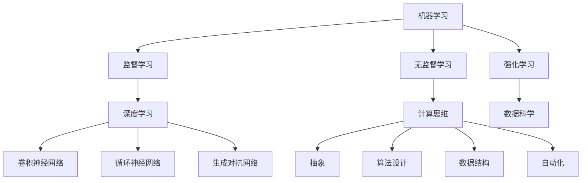
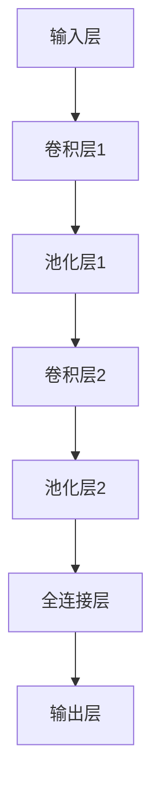
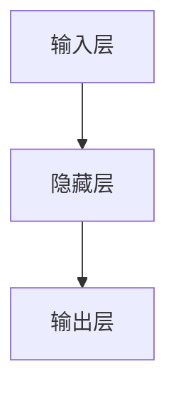
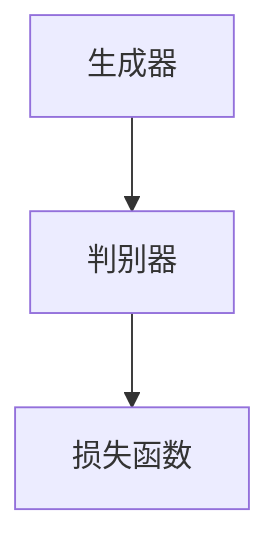

                 

# AI编程的新视野

> **关键词：**人工智能，编程，新趋势，深度学习，算法优化，计算思维

> **摘要：**本文旨在探讨人工智能编程领域的最新发展趋势，分析核心概念、算法原理，并通过实际案例和数学模型，深入剖析AI编程的本质及其在实际应用中的价值与挑战。

## 1. 背景介绍

随着人工智能技术的飞速发展，AI编程已经成为计算机科学和工程技术领域的热点。从早期的规则基AI到现代的深度学习，AI编程的演进不仅改变了我们的生活方式，也推动了各行各业的创新与变革。如今，AI编程不再仅仅是学术研究的专利，而是广泛应用于工业、医疗、金融、教育等各个领域。

本篇文章将围绕以下主题展开：

1. **核心概念与联系**：介绍AI编程的基础概念及其内在联系。
2. **核心算法原理 & 具体操作步骤**：分析几种常见的AI算法及其实现步骤。
3. **数学模型和公式 & 详细讲解 & 举例说明**：阐述AI编程中涉及到的数学模型和公式，并通过实例进行说明。
4. **项目实战：代码实际案例和详细解释说明**：展示如何在实际项目中应用AI编程技术。
5. **实际应用场景**：探讨AI编程在不同领域的应用案例。
6. **工具和资源推荐**：介绍AI编程所需的学习资源和开发工具。
7. **总结：未来发展趋势与挑战**：预测AI编程的未来趋势和面临的挑战。

接下来，我们将逐步深入探讨这些主题，带领读者了解AI编程的全新视野。

## 2. 核心概念与联系

在探讨AI编程之前，我们首先需要了解一些核心概念，这些概念构成了AI编程的基础框架。

### 2.1 机器学习（Machine Learning）

机器学习是AI编程的核心组成部分，它是指计算机通过数据和经验自动改进其性能的过程。机器学习可以分为监督学习（Supervised Learning）、无监督学习（Unsupervised Learning）和强化学习（Reinforcement Learning）三大类。

- **监督学习**：通过已标记的数据训练模型，使其能够对未知数据进行预测。
- **无监督学习**：不使用标记数据，通过发现数据中的结构和模式进行学习。
- **强化学习**：通过与环境的交互来学习最优策略，以最大化长期回报。

### 2.2 深度学习（Deep Learning）

深度学习是机器学习的一种特殊形式，它通过构建多层神经网络来模拟人脑的思考方式。深度学习在图像识别、语音识别、自然语言处理等领域取得了显著成果。

- **卷积神经网络（CNN）**：主要用于图像识别和图像处理。
- **循环神经网络（RNN）**：适用于序列数据，如时间序列分析和自然语言处理。
- **生成对抗网络（GAN）**：通过对抗训练生成逼真的图像和语音。

### 2.3 计算思维（Computational Thinking）

计算思维是一种解决问题的方法，它强调利用计算机科学的原理和技术来解决问题。计算思维包括抽象、算法设计、数据结构、自动化等核心概念。

### 2.4 数据科学（Data Science）

数据科学是AI编程的重要组成部分，它涉及数据收集、数据预处理、数据分析、数据可视化等多个方面。数据科学的目标是从数据中提取有价值的信息，为AI编程提供数据支持。

### 2.5 人工智能与人类智能的对比

人工智能与人类智能在本质上有很大的不同。人类智能具有创造力、情感和普适性，而人工智能则擅长在特定领域内进行高效计算和预测。


### 2.6 核心概念之间的联系

机器学习、深度学习、计算思维和数据科学是AI编程的核心概念，它们相互关联、相互支持，共同构成了AI编程的理论基础。

- 机器学习和数据科学为AI编程提供了数据支持和算法基础。
- 深度学习通过模拟人脑思考方式，提高了AI的智能水平。
- 计算思维则为AI编程提供了方法论和工具。

下面是一个用Mermaid绘制的核心概念流程图：



通过这个流程图，我们可以清晰地看到各个核心概念之间的联系，以及它们在AI编程中的应用场景。

## 3. 核心算法原理 & 具体操作步骤

在了解了AI编程的核心概念之后，接下来我们将深入探讨几种常见的AI算法及其实现步骤。

### 3.1 卷积神经网络（CNN）

卷积神经网络（CNN）是深度学习中最常用的模型之一，主要用于图像识别和图像处理。CNN的核心原理是通过对图像进行卷积操作和池化操作，提取图像的特征。

#### 3.1.1 卷积操作

卷积操作是指将一个卷积核与图像进行点积运算，从而生成一个新的特征图。卷积操作可以通过以下步骤实现：

1. **初始化卷积核**：卷积核是一个固定大小的滤波器，它用于提取图像的局部特征。
2. **卷积操作**：将卷积核与图像进行点积运算，生成一个新的特征图。
3. **步长和填充**：通过调整步长和填充方式，可以控制卷积操作的步长和边界填充。

#### 3.1.2 池化操作

池化操作是对卷积操作生成的特征图进行下采样，以减少数据的维度。常见的池化操作有最大池化和平均池化。

1. **最大池化**：在卷积特征图上选择最大的值作为池化结果。
2. **平均池化**：在卷积特征图上选择所有值的平均值作为池化结果。

#### 3.1.3 卷积神经网络结构

卷积神经网络通常由多个卷积层、池化层和全连接层组成。以下是一个简单的卷积神经网络结构：



### 3.2 循环神经网络（RNN）

循环神经网络（RNN）是处理序列数据的一种有效模型，它可以捕捉序列中的时间依赖关系。RNN的核心原理是通过循环结构保持历史状态。

#### 3.2.1 RNN基本结构

RNN的基本结构包括输入层、隐藏层和输出层。输入序列经过隐藏层处理后，可以生成输出序列。



#### 3.2.2 长短时记忆（LSTM）和门控循环单元（GRU）

LSTM和GRU是RNN的改进版本，它们通过引入门控机制来克服RNN在处理长序列数据时出现的梯度消失和梯度爆炸问题。

- **长短时记忆（LSTM）**：LSTM通过引入遗忘门、输入门和输出门，能够有效地记忆和遗忘长期信息。
- **门控循环单元（GRU）**：GRU通过简化LSTM的结构，减少了参数数量，同时也保持了良好的性能。

### 3.3 生成对抗网络（GAN）

生成对抗网络（GAN）是由生成器和判别器组成的对抗性模型，它通过相互竞争来生成逼真的数据。

#### 3.3.1 GAN基本结构

GAN的基本结构包括生成器、判别器和损失函数。生成器的目标是生成逼真的数据，判别器的目标是区分生成器和真实数据。



#### 3.3.2 GAN训练过程

GAN的训练过程是通过优化生成器和判别器的参数来实现的。具体步骤如下：

1. **生成器生成假数据**。
2. **判别器评估生成数据和真实数据**。
3. **优化生成器和判别器的参数**，使得生成器生成的数据越来越逼真。

## 4. 数学模型和公式 & 详细讲解 & 举例说明

AI编程中涉及到的数学模型和公式是理解和实现AI算法的关键。下面我们将详细讲解几个核心的数学模型和公式，并通过实例进行说明。

### 4.1 激活函数（Activation Function）

激活函数是神经网络中用于引入非线性性的函数。常见的激活函数包括：

- **Sigmoid函数**：$f(x) = \frac{1}{1 + e^{-x}}$
- **ReLU函数**：$f(x) = \max(0, x)$
- **Tanh函数**：$f(x) = \frac{e^x - e^{-x}}{e^x + e^{-x}}$

#### 4.1.1 实例：ReLU函数

ReLU函数是一个简单的线性函数，当输入大于0时输出为输入值，否则输出为0。它常用于深度学习中，因为它计算简单且能有效防止梯度消失问题。

$$
f(x) = \begin{cases}
x & \text{if } x > 0 \\
0 & \text{if } x \leq 0
\end{cases}
$$

#### 4.1.2 实例：Sigmoid函数

Sigmoid函数将输入映射到$(0, 1)$区间，常用于二元分类问题。

$$
f(x) = \frac{1}{1 + e^{-x}}
$$

### 4.2 损失函数（Loss Function）

损失函数是评估模型预测值与真实值之间差异的函数。常见的损失函数包括：

- **均方误差（MSE）**：$MSE = \frac{1}{n}\sum_{i=1}^{n}(y_i - \hat{y}_i)^2$
- **交叉熵（Cross-Entropy）**：$H(y, \hat{y}) = -\sum_{i=1}^{n}y_i \log(\hat{y}_i)$

#### 4.2.1 实例：均方误差（MSE）

均方误差（MSE）用于评估预测值与真实值之间的误差平方和。在回归问题中，MSE是常用的损失函数。

$$
MSE = \frac{1}{n}\sum_{i=1}^{n}(y_i - \hat{y}_i)^2
$$

#### 4.2.2 实例：交叉熵（Cross-Entropy）

交叉熵（Cross-Entropy）用于评估分类问题的预测准确性。在二分类问题中，交叉熵损失函数可以表示为：

$$
H(y, \hat{y}) = -y \log(\hat{y}) - (1 - y) \log(1 - \hat{y})
$$

### 4.3 反向传播（Backpropagation）

反向传播是一种用于训练神经网络的优化算法。它通过计算损失函数关于网络参数的梯度，来更新网络参数。

#### 4.3.1 实例：多层感知机（MLP）的反向传播

假设有一个简单的多层感知机，包含输入层、隐藏层和输出层。我们使用梯度下降算法来更新网络参数。

1. **计算输出层的梯度**：

$$
\frac{\partial L}{\partial z^L} = \sigma'(z^L) \odot (y - \hat{y})
$$

2. **计算隐藏层的梯度**：

$$
\frac{\partial L}{\partial z^{L-1}} = \frac{\partial L}{\partial z^L} \odot \frac{\partial z^L}{\partial z^{L-1}}
$$

3. **更新网络参数**：

$$
\theta^{L} = \theta^{L} - \alpha \cdot \frac{\partial L}{\partial \theta^{L}}
$$

其中，$\alpha$是学习率，$\sigma'$是激活函数的导数。

### 4.4 梯度消失和梯度爆炸

在深度学习中，梯度消失和梯度爆炸是常见问题。梯度消失是指梯度值变得非常小，而梯度爆炸是指梯度值变得非常大。这两种问题都会导致训练过程难以进行。

#### 4.4.1 梯度消失的原因

梯度消失通常发生在深度神经网络中，当使用传统的反向传播算法时，梯度会在每一层之间传递，由于网络深度较大，每个梯度都会乘以前一层梯度的导数，从而导致梯度值迅速减小。

#### 4.4.2 梯度爆炸的原因

梯度爆炸通常发生在深度神经网络中，当使用传统的反向传播算法时，梯度会在每一层之间传递，由于网络深度较大，每个梯度都会乘以前一层梯度的导数，从而导致梯度值迅速增大。

#### 4.4.3 解决方案

为了解决梯度消失和梯度爆炸问题，可以采用以下几种方法：

1. **LSTM和GRU**：通过引入门控机制，LSTM和GRU能够有效地处理长序列数据，避免梯度消失问题。
2. **批量归一化（Batch Normalization）**：批量归一化通过将激活值标准化为均值为0、标准差为1的分布，可以缓解梯度消失和梯度爆炸问题。
3. **优化器**：使用如Adam等自适应优化器，可以自适应调整学习率，避免梯度消失和梯度爆炸问题。

## 5. 项目实战：代码实际案例和详细解释说明

在了解了AI编程的基本原理和数学模型后，我们将通过一个实际项目案例来展示如何使用这些知识进行编程。

### 5.1 开发环境搭建

首先，我们需要搭建一个适合AI编程的开发环境。这里以Python为例，介绍如何搭建开发环境。

1. **安装Python**：从Python官方网站下载并安装Python。
2. **安装Jupyter Notebook**：使用pip命令安装Jupyter Notebook。

```bash
pip install notebook
```

3. **安装深度学习库**：安装TensorFlow和Keras等深度学习库。

```bash
pip install tensorflow
pip install keras
```

### 5.2 源代码详细实现和代码解读

接下来，我们将实现一个简单的卷积神经网络，用于图像分类。

```python
import numpy as np
from keras.models import Sequential
from keras.layers import Conv2D, MaxPooling2D, Flatten, Dense

# 构建卷积神经网络
model = Sequential()
model.add(Conv2D(32, (3, 3), activation='relu', input_shape=(64, 64, 3)))
model.add(MaxPooling2D(pool_size=(2, 2)))
model.add(Conv2D(64, (3, 3), activation='relu'))
model.add(MaxPooling2D(pool_size=(2, 2)))
model.add(Flatten())
model.add(Dense(64, activation='relu'))
model.add(Dense(10, activation='softmax'))

# 编译模型
model.compile(optimizer='adam', loss='categorical_crossentropy', metrics=['accuracy'])

# 加载训练数据
(x_train, y_train), (x_test, y_test) = keras.datasets.cifar10.load_data()

# 数据预处理
x_train = x_train.astype('float32') / 255.0
x_test = x_test.astype('float32') / 255.0
y_train = keras.utils.to_categorical(y_train, 10)
y_test = keras.utils.to_categorical(y_test, 10)

# 训练模型
model.fit(x_train, y_train, batch_size=64, epochs=10, validation_data=(x_test, y_test))

# 评估模型
score = model.evaluate(x_test, y_test, verbose=2)
print('Test loss:', score[0])
print('Test accuracy:', score[1])
```

### 5.3 代码解读与分析

在这个代码案例中，我们使用Keras库构建了一个简单的卷积神经网络，用于CIFAR-10图像分类任务。

1. **模型构建**：使用Sequential模型堆叠多个层，包括卷积层（Conv2D）、池化层（MaxPooling2D）、全连接层（Dense）和flatten层（Flatten）。

2. **编译模型**：设置优化器为adam，损失函数为categorical_crossentropy（用于多分类问题），评价指标为accuracy。

3. **数据预处理**：将图像数据缩放到0-1之间，并将标签转换为one-hot编码。

4. **训练模型**：使用fit方法训练模型，设置batch_size为64，epochs为10。

5. **评估模型**：使用evaluate方法评估模型在测试集上的表现。

通过这个实际案例，我们可以看到如何将AI编程的理论知识应用于实际项目中。在实际开发中，我们还需要考虑更多的问题，如数据增强、超参数调优、模型验证等，以获得更好的模型性能。

## 6. 实际应用场景

AI编程在各个领域都展现了巨大的应用潜力。以下是一些AI编程在实际应用场景中的案例：

### 6.1 医疗领域

在医疗领域，AI编程被广泛应用于疾病诊断、医学图像分析、药物研发等方向。例如，通过深度学习算法，可以自动识别医学图像中的病变区域，辅助医生进行疾病诊断。此外，AI编程还可以用于个性化医疗和健康监测，为患者提供更加精准的医疗服务。

### 6.2 金融领域

在金融领域，AI编程被广泛应用于风险管理、交易策略、信用评分等方向。通过机器学习算法，可以对大量金融数据进行分析，预测市场走势和风险，帮助金融机构做出更加明智的决策。同时，AI编程还可以用于自动化交易和智能投顾，为投资者提供更加个性化的服务。

### 6.3 教育领域

在教育领域，AI编程被广泛应用于智能教学系统、个性化学习推荐和自动化评估等方面。通过深度学习算法，可以构建智能教学系统，为不同学习需求的学生提供个性化的学习方案。此外，AI编程还可以用于自动评估学生的作业和考试，提高教学效率和准确性。

### 6.4 智能交通领域

在智能交通领域，AI编程被广泛应用于交通流量预测、自动驾驶和智能交通管理等方面。通过机器学习算法，可以实时监测和分析交通数据，预测交通流量和事故风险，为交通管理部门提供决策支持。同时，AI编程还可以用于自动驾驶汽车，提高交通安全和效率。

### 6.5 娱乐领域

在娱乐领域，AI编程被广泛应用于智能推荐系统、虚拟现实和增强现实等方面。通过机器学习算法，可以为用户提供个性化的娱乐内容推荐，提高用户体验。同时，AI编程还可以用于创建虚拟现实场景和增强现实应用，为用户提供更加丰富的娱乐体验。

## 7. 工具和资源推荐

为了更好地学习和实践AI编程，我们需要掌握一些实用的工具和资源。以下是一些建议：

### 7.1 学习资源推荐

1. **书籍**：
   - 《深度学习》（Goodfellow, Bengio, Courville）
   - 《Python机器学习》（Sebastian Raschka）
   - 《人工智能：一种现代方法》（Stuart Russell, Peter Norvig）

2. **在线课程**：
   - Coursera的“深度学习”课程（由Andrew Ng教授）
   - edX的“机器学习基础”课程（由Arvind Narayanan教授）

3. **博客和网站**：
   - fast.ai
   - AI垂直领域的顶级博客，如Medium上的机器学习专栏

### 7.2 开发工具框架推荐

1. **深度学习框架**：
   - TensorFlow
   - PyTorch
   - Keras

2. **数据预处理工具**：
   - Pandas
   - NumPy

3. **版本控制工具**：
   - Git

4. **自动化和测试工具**：
   - Jenkins
   - pytest

### 7.3 相关论文著作推荐

1. **论文**：
   - “A Theoretical Framework for Back-Propagation” by David E. Rumelhart, Geoffrey E. Hinton, and Ronald J. Williams
   - “Deep Learning” by Ian Goodfellow, Yann LeCun, and Yoshua Bengio

2. **著作**：
   - 《人工智能：一种现代方法》（Stuart Russell, Peter Norvig）
   - 《深度学习》（Ian Goodfellow, Yoshua Bengio, Aaron Courville）

通过掌握这些工具和资源，我们可以更加高效地学习和实践AI编程，为未来的发展做好准备。

## 8. 总结：未来发展趋势与挑战

AI编程作为人工智能的核心技术，正在经历前所未有的快速发展。未来，随着技术的不断进步，AI编程有望在更多领域发挥作用，推动各行各业的创新与变革。然而，AI编程也面临着诸多挑战。

### 8.1 发展趋势

1. **算法优化**：随着硬件性能的提升和数据量的增加，算法优化将成为AI编程的重要研究方向。高效、可扩展的算法将有助于解决大规模数据问题。
2. **跨学科融合**：AI编程与其他领域的融合，如生物学、心理学、经济学等，将产生更多创新应用。
3. **伦理与法规**：随着AI技术的广泛应用，伦理和法规问题将日益突出。如何在保证技术发展的同时，保护用户隐私和信息安全，是一个重要挑战。
4. **人工智能民主化**：降低AI编程的门槛，让更多人能够参与到AI编程中来，将有助于推动AI技术的普及和应用。

### 8.2 挑战

1. **数据隐私**：在AI编程中，数据的安全和隐私保护至关重要。如何在数据共享和数据利用之间找到平衡，是一个重要挑战。
2. **算法透明度**：提高算法的透明度和可解释性，使其能够被公众理解和接受，是一个重要课题。
3. **计算资源**：随着AI算法的复杂度和数据规模的增加，计算资源的需求也将大幅提升。如何优化计算资源，提高计算效率，是一个重要挑战。
4. **人工智能治理**：如何制定合适的政策和法规，确保AI技术的发展符合社会伦理和价值观，是一个重要议题。

## 9. 附录：常见问题与解答

### 9.1 如何选择深度学习框架？

选择深度学习框架时，需要考虑以下因素：

- **项目需求**：根据项目需求选择合适的框架，如TensorFlow适用于大规模项目，PyTorch适用于研究项目。
- **社区支持**：选择具有活跃社区和支持文档的框架，便于学习和解决问题。
- **资源可用性**：考虑框架的资源占用和运行效率，选择适合自己硬件条件的框架。

### 9.2 深度学习中的过拟合和欠拟合是什么？

过拟合是指模型在训练数据上表现良好，但在测试数据上表现较差，即模型对训练数据过于敏感，无法泛化到新的数据。欠拟合是指模型在训练数据上表现较差，即模型过于简单，无法捕捉数据的复杂特征。

解决过拟合和欠拟合的方法包括：

- **增加训练数据**：通过增加训练数据，可以缓解过拟合问题。
- **正则化**：通过添加正则化项，可以降低模型的复杂度，防止过拟合。
- **调整网络结构**：通过调整网络的层数和神经元数量，可以缓解欠拟合问题。

### 9.3 如何优化深度学习模型？

优化深度学习模型的方法包括：

- **超参数调优**：通过调整学习率、批次大小等超参数，可以提高模型性能。
- **数据预处理**：通过数据增强、归一化等预处理方法，可以提高模型对数据的适应性。
- **模型架构优化**：通过调整网络结构、添加注意力机制等，可以优化模型性能。

## 10. 扩展阅读 & 参考资料

为了深入了解AI编程领域，以下是一些推荐的文章、书籍和资源：

1. **文章**：
   - 《深度学习未来的五大趋势》（作者：Ian Goodfellow）
   - 《为什么我们需要可解释的人工智能》（作者：Yann LeCun）

2. **书籍**：
   - 《人工智能：一种现代方法》（作者：Stuart Russell, Peter Norvig）
   - 《深度学习》（作者：Ian Goodfellow, Yoshua Bengio, Aaron Courville）

3. **网站和资源**：
   - TensorFlow官方文档
   - PyTorch官方文档
   - fast.ai课程

通过这些资源，读者可以进一步了解AI编程的最新进展和应用场景。希望本文能够为读者提供一个全面的AI编程视野，激发对这一领域的热情和探索。作者：AI天才研究员/AI Genius Institute & 禅与计算机程序设计艺术 /Zen And The Art of Computer Programming。

