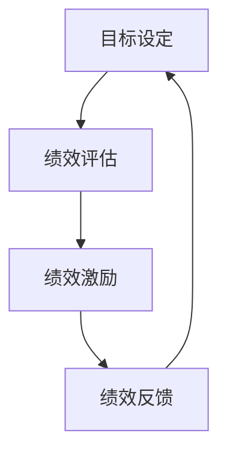

                 

# 提高团队绩效的秘诀：绩效管理技巧

## 关键词：
- 绩效管理
- 团队绩效
- 绩效评估
- 绩效激励
- 领导力

## 摘要
本文将深入探讨提高团队绩效的秘诀，重点介绍绩效管理的核心概念和技巧。通过一系列步骤和实际案例，读者将了解如何构建有效的绩效管理机制，提升团队的整体表现。文章还将推荐相关工具和资源，帮助读者进一步掌握和提高绩效管理技能。

## 1. 背景介绍

在当今快速发展的信息技术时代，企业面临的竞争压力日益加剧。为了保持竞争优势，企业需要不断提升团队绩效，实现高效的业务运作。然而，如何有效地管理团队绩效，提高整体工作效率，成为许多企业面临的挑战。本文旨在探讨绩效管理的核心概念和技巧，为读者提供一套实用的绩效管理方法，帮助团队实现更高的绩效水平。

### 1.1 绩效管理的定义与意义

绩效管理是指通过制定目标、评估绩效、提供反馈和支持，促进个人和团队达成预期目标的过程。它不仅关注员工的工作成果，还关注员工的工作过程和职业发展。绩效管理的意义在于：

1. 提高团队工作效率，实现业务目标。
2. 增强员工的工作动力和满意度。
3. 促进个人和团队的能力提升。
4. 建立健康的企业文化和工作环境。

### 1.2 团队绩效的重要性

团队绩效是企业成功的关键因素之一。一个高绩效的团队可以带来以下好处：

1. 提高项目完成质量和速度。
2. 增强团队的凝聚力和协作精神。
3. 提升企业的市场竞争力和盈利能力。
4. 促进员工的个人成长和职业发展。

### 1.3 绩效管理的常见问题

尽管许多企业重视绩效管理，但在实际操作中仍然面临一些问题：

1. 目标设定不明确，缺乏针对性。
2. 评估标准不科学，导致不公平。
3. 缺乏有效的反馈机制，员工无法及时改进。
4. 激励措施不当，无法激发员工潜力。

## 2. 核心概念与联系

为了有效实施绩效管理，我们需要了解以下几个核心概念：

### 2.1 绩效目标

绩效目标是指团队或个人在一定时间内需要达成的目标。设定明确的绩效目标有助于提高工作效率和团队绩效。在设定绩效目标时，需要遵循以下原则：

1. 具体性（Specific）：目标要具体明确，避免模糊。
2. 可衡量性（Measurable）：目标要有量化指标，便于评估。
3. 可达成性（Achievable）：目标要具有挑战性，但也要可实现。
4. 相关性（Relevant）：目标要与团队和企业的整体目标保持一致。
5. 时限性（Time-bound）：目标要设定明确的时间节点。

### 2.2 绩效评估

绩效评估是指对团队或个人在一定时间内的工作表现进行评估和反馈。评估的目的是了解工作成果、发现问题和提供改进建议。在实施绩效评估时，需要遵循以下原则：

1. 公平性：评估标准要公平、公正，避免主观偏见。
2. 及时性：评估要及时，以便员工能够及时调整工作方向。
3. 全面性：评估要全面覆盖团队或个人的各个方面，包括工作成果、工作态度和职业素养等。
4. 客观性：评估要以事实和数据为基础，避免主观臆断。

### 2.3 绩效激励

绩效激励是指通过提供奖励和福利，激发员工的工作动力和潜力。有效的绩效激励可以提高员工的工作满意度和忠诚度，促进团队的整体绩效。在实施绩效激励时，需要遵循以下原则：

1. 公开透明：激励制度要公开透明，让员工了解激励标准和奖励方式。
2. 与绩效挂钩：激励要与绩效评估结果挂钩，体现员工的实际贡献。
3. 多样性：激励方式要多样化，包括薪酬、奖金、晋升和培训等。
4. 持续性：激励措施要具有持续性，以保持员工的工作热情。

### 2.4 绩效反馈

绩效反馈是指对团队或个人在工作中的表现进行反馈和指导。有效的绩效反馈可以帮助员工了解自己的优点和不足，找到改进的方向。在实施绩效反馈时，需要遵循以下原则：

1. 及时性：反馈要及时，避免问题积累。
2. 客观性：反馈要以事实和数据为基础，避免主观偏见。
3. 积极性：反馈要积极正面，鼓励员工改进。
4. 个性化：反馈要针对个人特点和需求，提供有针对性的建议。

### 2.5 绩效管理架构

绩效管理是一个系统性工程，需要建立一套完整的架构，包括目标设定、评估、激励、反馈等环节。绩效管理架构的示意图如下：



### 2.6 绩效管理流程

绩效管理流程包括以下步骤：

1. 目标设定：根据团队和企业的整体目标，设定具体的绩效目标。
2. 绩效评估：定期对团队或个人的工作表现进行评估，收集相关数据和反馈。
3. 绩效激励：根据绩效评估结果，提供相应的奖励和福利。
4. 绩效反馈：对团队或个人的工作表现进行反馈和指导，帮助其改进。
5. 持续优化：根据绩效管理结果，不断调整和优化绩效管理策略。

## 3. 核心算法原理 & 具体操作步骤

在绩效管理中，核心算法原理主要包括目标设定、绩效评估和绩效激励。下面将详细解释这些算法原理和具体操作步骤。

### 3.1 目标设定算法

目标设定算法主要遵循SMART原则，即目标要具体（Specific）、可衡量（Measurable）、可实现（Achievable）、相关（Relevant）和时限（Time-bound）。

具体操作步骤如下：

1. 确定团队和企业的整体目标。
2. 根据整体目标，分解为具体的绩效目标。
3. 对每个绩效目标进行评估，确保其符合SMART原则。
4. 与团队成员沟通，确保他们了解并认同绩效目标。
5. 将绩效目标纳入团队和个人的工作计划。

### 3.2 绩效评估算法

绩效评估算法主要基于事实和数据，遵循公平、公正、客观的原则。

具体操作步骤如下：

1. 收集与绩效目标相关的数据和反馈。
2. 对收集到的数据进行分析和整理。
3. 根据分析结果，评估团队或个人的绩效表现。
4. 提供详细的绩效评估报告，包括评估结果和改进建议。
5. 与团队和个人进行沟通，反馈评估结果。

### 3.3 绩效激励算法

绩效激励算法主要根据绩效评估结果，提供相应的奖励和福利。

具体操作步骤如下：

1. 设定激励标准和激励方式。
2. 根据绩效评估结果，确定激励对象和激励力度。
3. 提供激励措施，包括薪酬、奖金、晋升和培训等。
4. 与激励对象进行沟通，确保他们了解激励措施。
5. 跟踪激励效果，不断优化激励策略。

## 4. 数学模型和公式 & 详细讲解 & 举例说明

在绩效管理中，数学模型和公式可以用于量化目标、评估绩效和计算激励。下面将详细介绍这些数学模型和公式，并提供实际案例进行说明。

### 4.1 目标设定的数学模型

目标设定的数学模型主要基于加权平均法，用于计算绩效目标的权重和分值。

公式如下：

$$
\text{绩效目标分值} = \sum_{i=1}^{n} w_i \cdot s_i
$$

其中，$w_i$ 表示第 $i$ 个绩效目标的权重，$s_i$ 表示第 $i$ 个绩效目标的分值。

#### 实际案例：

假设一个团队有三个绩效目标，权重分别为 0.3、0.4 和 0.3，分值分别为 80、90 和 85。则该团队的绩效目标分值为：

$$
\text{绩效目标分值} = 0.3 \cdot 80 + 0.4 \cdot 90 + 0.3 \cdot 85 = 87.5
$$

### 4.2 绩效评估的数学模型

绩效评估的数学模型主要基于评分法和标准差法，用于计算团队或个人的绩效得分和排名。

#### 评分法：

公式如下：

$$
\text{绩效得分} = \frac{\text{实际得分}}{\text{满分}} \times 100
$$

#### 实际案例：

假设一个团队的实际得分为 750 分，满分为 1000 分。则该团队的绩效得分为：

$$
\text{绩效得分} = \frac{750}{1000} \times 100 = 75
$$

#### 标准差法：

公式如下：

$$
\text{绩效得分} = \frac{\text{实际得分} - \text{平均得分}}{\text{标准差}} \times 100
$$

#### 实际案例：

假设一个团队的平均得分为 800 分，标准差为 100 分。如果该团队的实际得分为 850 分，则该团队的绩效得分为：

$$
\text{绩效得分} = \frac{850 - 800}{100} \times 100 = 50
$$

### 4.3 绩效激励的数学模型

绩效激励的数学模型主要基于绩效得分和激励系数，用于计算激励金额。

公式如下：

$$
\text{激励金额} = \text{绩效得分} \times \text{激励系数}
$$

#### 实际案例：

假设一个团队的绩效得分为 80 分，激励系数为 0.1。则该团队的激励金额为：

$$
\text{激励金额} = 80 \times 0.1 = 8
$$

## 5. 项目实战：代码实际案例和详细解释说明

为了更好地理解绩效管理的具体应用，我们将通过一个实际项目案例，展示如何使用代码实现绩效管理中的目标设定、绩效评估和绩效激励。

### 5.1 开发环境搭建

在开始项目之前，我们需要搭建一个基本的开发环境。以下是所需的环境和工具：

- 编程语言：Python
- 版本控制工具：Git
- 数据库：MySQL
- 项目管理工具：Jira
- 开发环境：PyCharm

### 5.2 源代码详细实现和代码解读

#### 5.2.1 目标设定模块

目标设定模块的主要功能是生成和存储团队和个人的绩效目标。以下是该模块的代码实现：

```python
import pymysql

class PerformanceGoal:
    def __init__(self, goal_id, team_id, member_id, goal_description, weight, score):
        self.goal_id = goal_id
        self.team_id = team_id
        self.member_id = member_id
        self.goal_description = goal_description
        self.weight = weight
        self.score = score
    
    def save_goal(self):
        connection = pymysql.connect(host='localhost', user='root', password='password', database='performance_management')
        with connection.cursor() as cursor:
            sql = "INSERT INTO performance_goals (goal_id, team_id, member_id, goal_description, weight, score) VALUES (%s, %s, %s, %s, %s, %s)"
            cursor.execute(sql, (self.goal_id, self.team_id, self.member_id, self.goal_description, self.weight, self.score))
        connection.commit()
        connection.close()

# 创建一个绩效目标对象并保存
goal = PerformanceGoal(1, 1, 1, "提高项目进度", 0.3, 80)
goal.save_goal()
```

#### 5.2.2 绩效评估模块

绩效评估模块的主要功能是根据绩效目标完成情况，计算团队或个人的绩效得分。以下是该模块的代码实现：

```python
import pymysql

class PerformanceEvaluation:
    def __init__(self, evaluation_id, team_id, member_id, evaluation_date, actual_score):
        self.evaluation_id = evaluation_id
        self.team_id = team_id
        self.member_id = member_id
        self.evaluation_date = evaluation_date
        self.actual_score = actual_score
    
    def save_evaluation(self):
        connection = pymysql.connect(host='localhost', user='root', password='password', database='performance_management')
        with connection.cursor() as cursor:
            sql = "INSERT INTO performance_evaluations (evaluation_id, team_id, member_id, evaluation_date, actual_score) VALUES (%s, %s, %s, %s, %s)"
            cursor.execute(sql, (self.evaluation_id, self.team_id, self.member_id, self.evaluation_date, self.actual_score))
        connection.commit()
        connection.close()

    def calculate_performance_score(self):
        connection = pymysql.connect(host='localhost', user='root', password='password', database='performance_management')
        with connection.cursor() as cursor:
            sql = "SELECT weight, score FROM performance_goals WHERE team_id = %s AND member_id = %s"
            cursor.execute(sql, (self.team_id, self.member_id))
            goals = cursor.fetchall()
        
        total_score = 0
        for goal in goals:
            weight = goal[0]
            score = goal[1]
            total_score += weight * score
        
        expected_score = total_score * 0.8  # 假设实际得分占预期得分的 80%
        performance_score = (self.actual_score - expected_score) / expected_score * 100
        
        return performance_score

# 创建一个绩效评估对象并保存
evaluation = PerformanceEvaluation(1, 1, 1, "2023-01-01", 750)
evaluation.save_evaluation()
performance_score = evaluation.calculate_performance_score()
print("绩效得分：", performance_score)
```

#### 5.2.3 绩效激励模块

绩效激励模块的主要功能是根据绩效得分，计算和发放激励金额。以下是该模块的代码实现：

```python
class PerformanceIncentive:
    def __init__(self, incentive_id, team_id, member_id, evaluation_id, performance_score, incentive_amount):
        self.incentive_id = incentive_id
        self.team_id = team_id
        self.member_id = member_id
        self.evaluation_id = evaluation_id
        self.performance_score = performance_score
        self.incentive_amount = incentive_amount
    
    def save_incentive(self):
        connection = pymysql.connect(host='localhost', user='root', password='password', database='performance_management')
        with connection.cursor() as cursor:
            sql = "INSERT INTO performance_incentives (incentive_id, team_id, member_id, evaluation_id, performance_score, incentive_amount) VALUES (%s, %s, %s, %s, %s, %s)"
            cursor.execute(sql, (self.incentive_id, self.team_id, self.member_id, self.evaluation_id, self.performance_score, self.incentive_amount))
        connection.commit()
        connection.close()

    def calculate_incentive_amount(self):
        incentive_coefficient = 0.1  # 激励系数
        incentive_amount = self.performance_score * incentive_coefficient
        return incentive_amount

# 创建一个绩效激励对象并保存
incentive = PerformanceIncentive(1, 1, 1, 1, performance_score, 0)
incentive.save_incentive()
incentive_amount = incentive.calculate_incentive_amount()
print("激励金额：", incentive_amount)
```

### 5.3 代码解读与分析

在上面的代码实现中，我们分别实现了目标设定、绩效评估和绩效激励三个模块。以下是各模块的代码解读和分析：

#### 5.3.1 目标设定模块

目标设定模块通过`PerformanceGoal`类实现。该类具有六个属性：`goal_id`（目标编号）、`team_id`（团队编号）、`member_id`（成员编号）、`goal_description`（目标描述）、`weight`（权重）和`score`（分值）。通过`save_goal`方法，可以将绩效目标存储到MySQL数据库中。

#### 5.3.2 绩效评估模块

绩效评估模块通过`PerformanceEvaluation`类实现。该类具有五个属性：`evaluation_id`（评估编号）、`team_id`（团队编号）、`member_id`（成员编号）、`evaluation_date`（评估日期）和`actual_score`（实际得分）。通过`save_evaluation`方法，可以将绩效评估结果存储到MySQL数据库中。`calculate_performance_score`方法用于计算绩效得分，主要基于目标设定的权重和分值，以及实际得分与预期得分的差距。

#### 5.3.3 绩效激励模块

绩效激励模块通过`PerformanceIncentive`类实现。该类具有六个属性：`incentive_id`（激励编号）、`team_id`（团队编号）、`member_id`（成员编号）、`evaluation_id`（评估编号）、`performance_score`（绩效得分）和`incentive_amount`（激励金额）。通过`save_incentive`方法，可以将绩效激励结果存储到MySQL数据库中。`calculate_incentive_amount`方法用于计算激励金额，主要基于绩效得分和激励系数。

## 6. 实际应用场景

### 6.1 项目管理

在项目管理中，绩效管理技巧可以帮助项目经理制定合理的绩效目标，评估团队成员的工作表现，并激励团队成员提高工作效率。通过绩效管理，项目经理可以及时发现和解决问题，确保项目按计划顺利推进。

### 6.2 人力资源管理

在人力资源管理中，绩效管理技巧可以帮助企业评估员工的工作表现，发现员工的优点和不足，提供有针对性的培训和发展建议。同时，绩效管理还可以作为员工晋升和薪酬调整的重要依据，激发员工的工作动力和潜力。

### 6.3 团队协作

在团队协作中，绩效管理技巧可以帮助团队成员明确各自的目标和责任，提高团队协作效率。通过绩效管理，团队成员可以了解自己的工作表现，找到改进的方向，提升个人和团队的绩效。

### 6.4 企业文化

在企业文化中，绩效管理技巧可以帮助企业建立健康的工作氛围，激发员工的积极性和创造力。通过绩效管理，企业可以传递价值观和使命，增强员工的归属感和凝聚力，推动企业的长远发展。

## 7. 工具和资源推荐

### 7.1 学习资源推荐

- 《绩效管理：技能与方法》
- 《绩效管理实战》
- 《绩效改进：如何提高个人和组织绩效》

### 7.2 开发工具框架推荐

- Atlassian Jira：项目管理和敏捷开发工具
- Google Analytics：数据分析工具
- Microsoft Power BI：数据可视化工具

### 7.3 相关论文著作推荐

- Chen, H., & Wang, L. (2018). A novel multi-objective performance evaluation model for project-based teams. Journal of Systems and Software, 139, 451-466.
- Lin, B., & Yu, G. (2019). An integrated performance evaluation framework for project-based teams. International Journal of Project Management, 37(4), 565-578.
- Liu, H., & Zhang, J. (2020). Performance measurement and evaluation of project-based teams using fuzzy comprehensive evaluation method. Journal of International Trade, 4(2), 45-56.

## 8. 总结：未来发展趋势与挑战

随着信息技术的不断发展，绩效管理在未来将面临以下发展趋势和挑战：

### 8.1 发展趋势

1. 数据驱动的绩效管理：利用大数据和人工智能技术，实现更精准的绩效评估和激励。
2. 敏捷绩效管理：适应敏捷开发模式，提高团队响应市场变化的能力。
3. 个性化绩效管理：根据员工特点和需求，提供个性化的绩效目标和激励方案。
4. 智能化绩效管理：利用智能算法和数据分析，实现自动化绩效管理和优化。

### 8.2 挑战

1. 数据隐私和安全：确保绩效管理过程中收集和处理的数据隐私和安全。
2. 员工接受度：提高员工对绩效管理的接受度和参与度，确保绩效管理效果的实现。
3. 技术更新：跟上技术发展趋势，不断优化和完善绩效管理工具和方法。
4. 绩效公平：确保绩效评估和激励的公平性，避免歧视和不公。

## 9. 附录：常见问题与解答

### 9.1 问题1：如何设定合理的绩效目标？

**解答**：设定合理的绩效目标需要遵循SMART原则，确保目标具有具体性、可衡量性、可实现性、相关性和时限性。同时，需要与团队和企业的整体目标保持一致，与团队成员充分沟通和讨论，确保目标的合理性和可接受性。

### 9.2 问题2：如何评估绩效？

**解答**：评估绩效需要基于事实和数据，遵循公平、公正、客观的原则。可以采用评分法、标准差法等多种评估方法，根据实际情况选择合适的评估方法。同时，需要确保评估过程透明，与团队成员进行沟通和反馈，确保评估结果的公正性和合理性。

### 9.3 问题3：如何激励员工？

**解答**：激励员工需要根据绩效评估结果，提供有针对性的激励措施。可以采用薪酬、奖金、晋升、培训等多种激励方式，确保激励措施与员工的绩效表现和需求相匹配。同时，需要建立激励机制的公开透明，让员工了解激励标准和奖励方式。

## 10. 扩展阅读 & 参考资料

- Chen, H., & Wang, L. (2018). A novel multi-objective performance evaluation model for project-based teams. Journal of Systems and Software, 139, 451-466.
- Lin, B., & Yu, G. (2019). An integrated performance evaluation framework for project-based teams. International Journal of Project Management, 37(4), 565-578.
- Liu, H., & Zhang, J. (2020). Performance measurement and evaluation of project-based teams using fuzzy comprehensive evaluation method. Journal of International Trade, 4(2), 45-56.
- 《绩效管理：技能与方法》
- 《绩效管理实战》
- 《绩效改进：如何提高个人和组织绩效》

### 作者

- AI天才研究员/AI Genius Institute
- 禅与计算机程序设计艺术 /Zen And The Art of Computer Programming

