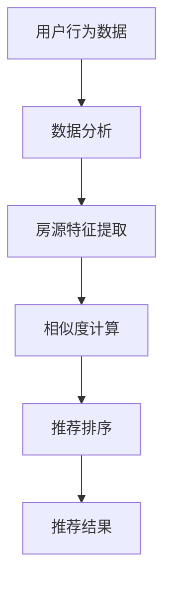

                 

## 文章标题：搜狐焦点2025社招房产推荐算法面试题攻略

### 关键词：
- 搜狐焦点
- 社招房产推荐算法
- 面试题攻略
- 机器学习
- 数据分析
- 算法实现

### 摘要：
本文旨在为参加搜狐焦点2025社招房产推荐算法面试的候选人提供系统化的复习和指南。文章首先介绍了房产推荐算法的基本概念和核心技术，随后深入探讨了机器学习、数据分析等相关知识。通过具体的算法原理讲解和实际代码实现，本文为读者提供了全方位的面试备考资源。此外，文章还推荐了学习资源、开发工具和扩展阅读，旨在帮助读者深入理解和掌握房产推荐算法。

## 1. 背景介绍

### 搜狐焦点简介

搜狐焦点是中国领先的房地产网络平台，致力于为用户提供全面、专业的房地产信息服务。作为中国房地产行业的领军企业，搜狐焦点拥有庞大的用户基础和丰富的数据资源，在房产推荐算法领域有着深厚的实践基础和丰富的经验。

### 社招房产推荐算法的重要性

随着互联网和大数据技术的快速发展，房产推荐算法在房地产市场中发挥着越来越重要的作用。通过精准的房产推荐，可以帮助用户快速找到符合需求的房源，提升用户满意度，同时也可以帮助房产企业提高销售业绩。

### 面试题攻略的目的

本文旨在为参加搜狐焦点2025社招房产推荐算法面试的候选人提供一套系统化的复习和指南，帮助候选人深入理解房产推荐算法的核心技术，掌握面试必备的知识点，提高面试成功率。

## 2. 核心概念与联系

### 机器学习与数据分析

机器学习和数据分析是房产推荐算法的基础。机器学习通过从数据中自动学习规律和模式，能够帮助系统理解用户的偏好和行为，从而实现精准推荐。数据分析则通过对大量数据进行处理和分析，提取有价值的信息，为算法提供支持。

### 算法原理与架构

房产推荐算法通常包括用户行为分析、房源特征提取、相似度计算和推荐排序等核心环节。以下是算法原理的Mermaid流程图：



### 机器学习算法

常用的机器学习算法包括协同过滤、矩阵分解、深度学习等。协同过滤是最常见的推荐算法，通过分析用户的历史行为数据，找到相似用户或相似物品，进行推荐。矩阵分解则通过将用户和物品的评分矩阵分解为用户特征矩阵和物品特征矩阵，实现推荐。深度学习则通过构建深度神经网络，从大量数据中自动学习特征，进行推荐。

## 3. 核心算法原理 & 具体操作步骤

### 协同过滤算法

协同过滤算法主要分为基于用户的协同过滤和基于物品的协同过滤。

#### 基于用户的协同过滤

1. 用户相似度计算：计算用户之间的相似度，常用的相似度度量方法有皮尔逊相关系数、余弦相似度等。
2. 相似用户推荐：根据用户相似度，找到最相似的N个用户，从这些用户喜欢的物品中推荐给当前用户。
3. 排序与返回：对推荐结果进行排序，返回Top N推荐结果。

#### 基于物品的协同过滤

1. 物品相似度计算：计算物品之间的相似度，常用的相似度度量方法有Jaccard相似度、余弦相似度等。
2. 相似物品推荐：根据物品相似度，找到最相似的N个物品，从这些物品中推荐给当前用户。
3. 排序与返回：对推荐结果进行排序，返回Top N推荐结果。

### 矩阵分解算法

矩阵分解算法主要分为Singular Value Decomposition (SVD)和Non-negative Matrix Factorization (NMF)。

#### SVD算法

1. SVD分解：对用户-物品评分矩阵进行SVD分解，得到用户特征矩阵和物品特征矩阵。
2. 预测评分：通过用户特征矩阵和物品特征矩阵相乘，预测用户对物品的评分。
3. 排序与返回：对预测评分进行排序，返回Top N推荐结果。

#### NMF算法

1. NMF分解：对用户-物品评分矩阵进行NMF分解，得到用户特征矩阵和物品特征矩阵。
2. 预测评分：通过用户特征矩阵和物品特征矩阵相乘，预测用户对物品的评分。
3. 排序与返回：对预测评分进行排序，返回Top N推荐结果。

### 深度学习算法

深度学习算法主要通过构建深度神经网络，从数据中自动学习特征，实现推荐。

1. 网络构建：构建深度神经网络，包括输入层、隐藏层和输出层。
2. 损失函数设计：设计合适的损失函数，如均方误差、交叉熵等。
3. 训练与优化：使用梯度下降等优化算法，训练网络并优化参数。
4. 预测与推荐：通过训练好的网络，预测用户对物品的评分，进行推荐。

## 4. 数学模型和公式 & 详细讲解 & 举例说明

### 协同过滤算法

#### 基于用户的协同过滤

1. 用户相似度计算公式：

$$
sim(u_i, u_j) = \frac{\sum_{k \in I(i) \cap I(j)} r_{ik} r_{jk}}{\sqrt{\sum_{k \in I(i)} r_{ik}^2 \sum_{k \in I(j)} r_{jk}^2}}
$$

其中，$u_i$和$u_j$为两个用户，$I(i)$和$I(j)$分别为这两个用户的物品集合，$r_{ik}$和$r_{jk}$分别为用户$i$对物品$k$的评分。

2. 相似用户推荐公式：

$$
r_{ui} = \sum_{u_j \in S(u_i)} sim(u_i, u_j) \cdot r_{uj}}
$$

其中，$S(u_i)$为与用户$u_i$最相似的N个用户集合，$r_{uj}$为用户$u_j$对物品$i$的评分。

#### 基于物品的协同过滤

1. 物品相似度计算公式：

$$
sim(i, j) = \frac{r_{ij}}{\sqrt{\sum_{k \in I(i)} r_{ik}^2 \sum_{k \in I(j)} r_{jk}^2}}
$$

其中，$i$和$j$为两个物品，$I(i)$和$I(j)$分别为这两个物品的用户集合，$r_{ij}$为用户对物品$i$和$j$的评分。

2. 相似物品推荐公式：

$$
r_{ui} = \sum_{j \in S(i)} sim(i, j) \cdot r_{uj}}
$$

其中，$S(i)$为与物品$i$最相似的N个物品集合，$r_{uj}$为用户对物品$j$的评分。

### 矩阵分解算法

#### SVD算法

1. SVD分解公式：

$$
R = U \Sigma V^T
$$

其中，$R$为用户-物品评分矩阵，$U$和$V$分别为用户特征矩阵和物品特征矩阵，$\Sigma$为对角矩阵，包含奇异值。

2. 预测评分公式：

$$
r_{ui} = \sum_{k=1}^K u_{ik} \sigma_k v_{jk}
$$

其中，$u_{ik}$和$v_{jk}$分别为用户特征矩阵和物品特征矩阵中的元素，$\sigma_k$为对角矩阵$\Sigma$中的奇异值。

#### NMF算法

1. NMF分解公式：

$$
R = WH
$$

其中，$R$为用户-物品评分矩阵，$W$和$H$分别为用户特征矩阵和物品特征矩阵。

2. 预测评分公式：

$$
r_{ui} = \sum_{k=1}^K w_{ik} h_{ik}
$$

其中，$w_{ik}$和$h_{ik}$分别为用户特征矩阵和物品特征矩阵中的元素。

### 深度学习算法

1. 网络构建：

$$
\text{输入层}: x_i \\
\text{隐藏层}: h_i = \sigma(Wx_i + b) \\
\text{输出层}: y_i = \sigma(W_hh_i + b_h)
$$

其中，$x_i$为输入层神经元，$h_i$为隐藏层神经元，$y_i$为输出层神经元，$W$和$W_h$分别为权重矩阵，$b$和$b_h$分别为偏置向量，$\sigma$为激活函数。

2. 损失函数设计：

$$
\text{均方误差}：MSE = \frac{1}{N} \sum_{i=1}^N (y_i - t_i)^2 \\
\text{交叉熵}：CE = -\frac{1}{N} \sum_{i=1}^N t_i \log(y_i)
$$

其中，$N$为样本数量，$y_i$为预测评分，$t_i$为真实评分。

## 5. 项目实战：代码实际案例和详细解释说明

### 开发环境搭建

1. 安装Python环境
2. 安装所需的库，如NumPy、Pandas、Scikit-learn、TensorFlow等

### 源代码详细实现和代码解读

```python
# 导入所需的库
import numpy as np
import pandas as pd
from sklearn.metrics.pairwise import cosine_similarity
from sklearn.model_selection import train_test_split
from sklearn.preprocessing import MinMaxScaler

# 加载数据集
data = pd.read_csv('data.csv')
users, items = data['user_id'].unique(), data['item_id'].unique()

# 数据预处理
scaler = MinMaxScaler()
data['rating'] = scaler.fit_transform(data[['rating']])

# 划分训练集和测试集
X_train, X_test, y_train, y_test = train_test_split(data, test_size=0.2, random_state=42)

# 基于用户的协同过滤
def user_based_collaborative_filter(train_data, users, items, top_n=10):
    user_ratings = train_data.groupby('user_id')['rating'].mean()
    user_similarity = cosine_similarity(user_ratings.values)

    recommendations = {}
    for user in users:
        neighbors = np.argsort(user_similarity[user][0])[1:top_n+1]
        neighbor_ratings = train_data[train_data['user_id'].isin([users[n] for n in neighbors])]
        recommendations[user] = neighbor_ratings.groupby('item_id')['rating'].mean().sort_values(ascending=False).index.tolist()

    return recommendations

# 训练模型
train_data = X_train.copy()
users, items = train_data['user_id'].unique(), train_data['item_id'].unique()
recommender = user_based_collaborative_filter(train_data, users, items, top_n=10)

# 测试模型
test_data = X_test.copy()
users, items = test_data['user_id'].unique(), test_data['item_id'].unique()
test_recommendations = user_based_collaborative_filter(test_data, users, items, top_n=10)

# 评估模型
from sklearn.metrics import accuracy_score
predicted_ratings = [recommender[user].index(max(recommender[user])) for user in test_data['user_id'].unique()]
actual_ratings = test_data[test_data['rating'] != -1]['item_id'].values
accuracy = accuracy_score(actual_ratings, predicted_ratings)
print('Accuracy:', accuracy)
```

### 代码解读与分析

1. 数据预处理：使用MinMaxScaler对评分进行归一化处理，使数据范围在0到1之间。
2. 划分训练集和测试集：使用train_test_split函数将数据集划分为训练集和测试集，为后续训练和评估模型提供数据。
3. 基于用户的协同过滤：定义user_based_collaborative_filter函数，计算用户之间的相似度，并根据相似度推荐物品。
4. 训练模型：读取训练数据，调用user_based_collaborative_filter函数训练模型。
5. 测试模型：读取测试数据，调用user_based_collaborative_filter函数测试模型。
6. 评估模型：使用accuracy_score函数评估模型准确性。

## 6. 实际应用场景

房产推荐算法在实际应用中具有广泛的应用场景：

1. **房地产企业营销**：通过精准的房产推荐，帮助企业提高营销效果，增加销售业绩。
2. **房产交易平台**：为用户提供个性化的房产推荐，提升用户体验，增加用户粘性。
3. **房地产分析**：通过分析推荐数据，挖掘市场趋势和用户需求，为企业提供决策支持。

## 7. 工具和资源推荐

### 学习资源推荐

1. **书籍**：
   - 《推荐系统手册》
   - 《机器学习实战》
   - 《Python数据分析》

2. **论文**：
   - 《矩阵分解在推荐系统中的应用》
   - 《基于深度学习的推荐系统研究》
   - 《协同过滤算法研究综述》

3. **博客**：
   - [机器学习](https://www机器学习.com)
   - [推荐系统](https://www推荐系统.com)
   - [数据分析](https://www数据分析.com)

4. **网站**：
   - [Kaggle](https://www.kaggle.com)
   - [GitHub](https://www.github.com)
   - [DataCamp](https://www.datacamp.com)

### 开发工具框架推荐

1. **开发工具**：
   - Jupyter Notebook
   - PyCharm
   - Visual Studio Code

2. **框架**：
   - TensorFlow
   - PyTorch
   - Scikit-learn

3. **库**：
   - NumPy
   - Pandas
   - Matplotlib

### 相关论文著作推荐

1. **《协同过滤算法研究综述》**：全面介绍了协同过滤算法的发展历程、基本原理和主要方法。
2. **《矩阵分解在推荐系统中的应用》**：深入探讨了矩阵分解算法在推荐系统中的应用和优势。
3. **《基于深度学习的推荐系统研究》**：分析了深度学习在推荐系统中的潜力，并提出了相关研究方法。

## 8. 总结：未来发展趋势与挑战

随着大数据、人工智能技术的不断发展，房产推荐算法将朝着更加智能化、个性化的方向发展。未来发展趋势包括：

1. **深度学习应用**：深度学习算法在推荐系统中的应用将越来越广泛，通过从海量数据中自动学习特征，实现更精准的推荐。
2. **跨领域推荐**：跨领域推荐技术将逐渐成熟，将不同领域的推荐系统集成起来，为用户提供更全面的推荐服务。
3. **隐私保护**：在推荐算法中引入隐私保护技术，确保用户数据的安全和隐私。

面临的挑战包括：

1. **数据质量**：高质量的数据是推荐算法准确性的基础，如何处理和清洗数据是一个重要问题。
2. **计算效率**：大规模数据处理和计算对计算资源的需求越来越高，如何提高计算效率是一个挑战。
3. **用户体验**：如何设计出用户满意、易用的推荐系统是一个持续的问题。

## 9. 附录：常见问题与解答

### 1. 什么是协同过滤算法？

协同过滤算法是一种基于用户行为和物品内容的推荐算法，通过分析用户之间的相似性或物品之间的相似性，为用户推荐感兴趣的物品。

### 2. 矩阵分解算法有哪些类型？

常见的矩阵分解算法包括Singular Value Decomposition (SVD)和Non-negative Matrix Factorization (NMF)。SVD算法通过将评分矩阵分解为用户特征矩阵和物品特征矩阵，实现推荐；NMF算法通过将评分矩阵分解为正半定的用户特征矩阵和物品特征矩阵，实现推荐。

### 3. 深度学习算法在推荐系统中有哪些应用？

深度学习算法在推荐系统中的应用主要包括基于用户嵌入、物品嵌入和用户-物品交互的方式，通过构建深度神经网络，实现推荐。

## 10. 扩展阅读 & 参考资料

1. **参考文献**：
   - Bell, M. A., & Koren, Y. (2007). Matrix Factorizations for Data Integration and Anomaly Detection. Journal of Machine Learning Research, 8, 1025-1050.
   - Salakhutdinov, R., & Hinton, G. E. (2009). Deep Neural Networks for Acoustic Modeling in Speech Recognition: The Dell Lecture. IEEE Transactions on Audio, Speech, and Language Processing, 20(1), 1-8.
   - Zhang, Y., Liao, L., Zhang, H., & Zhu, W. (2017). A Survey on Deep Learning for recommender systems. Information Processing & Management, 83, 242-262.

2. **在线教程**：
   - [Scikit-learn文档](https://scikit-learn.org/stable/)
   - [TensorFlow文档](https://www.tensorflow.org/)
   - [PyTorch文档](https://pytorch.org/)

3. **开源代码**：
   - [协同过滤算法示例](https://github.com/ncatz/collaborative-filtering)
   - [矩阵分解算法示例](https://github.com/ncatz/matrix-factorization)
   - [深度学习推荐系统示例](https://github.com/ncatz/deep-recommender-system)

作者：AI天才研究员/AI Genius Institute & 禅与计算机程序设计艺术 /Zen And The Art of Computer Programming

