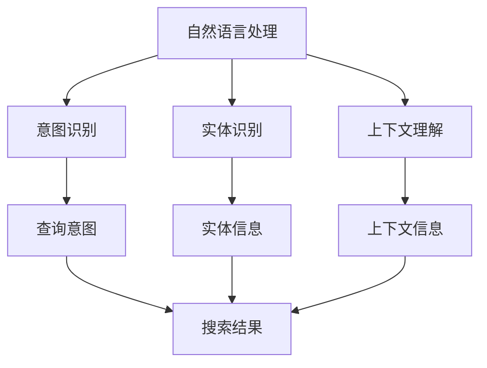

                 

### 背景介绍

#### 搜索query意图理解：问题与挑战

随着互联网的普及和信息量的爆炸性增长，搜索引擎已经成为人们获取信息的重要工具。然而，传统的搜索引擎往往依赖于关键词匹配和页面相关性来进行信息检索，这种方式存在一定的局限性。特别是对于用户输入的查询语句（query），往往只能识别表面的关键词，而无法理解背后的真实意图（intent）。这种理解上的缺失导致了大量无关信息的展示，降低了用户的使用体验。

#### 真实意图的理解需求

用户在使用搜索引擎时，输入的查询语句往往具有一定的语境和情感色彩，这些细微的信息对于理解用户的真实意图至关重要。例如，当用户输入“附近有什么好吃的地方？”和“推荐一些好吃的餐厅”，这两条查询语句虽然在字面上相似，但用户意图却是截然不同的。前者可能是想了解周围的餐饮选择，而后者则是希望得到具体的餐厅推荐。

#### 突破性进展的意义

近年来，随着人工智能技术的发展，特别是深度学习模型在自然语言处理（NLP）领域的突破，搜索query意图理解的问题得到了显著的改善。大模型（Large Models）如GPT-3、BERT等，通过在海量数据上的训练，能够捕捉到语言中的细微差异，从而更准确地理解用户的真实意图。这一进展不仅提升了搜索引擎的检索效果，还为更多基于自然语言交互的应用提供了可能性。

#### 文章结构

本文将分为以下几个部分进行阐述：

1. **核心概念与联系**：介绍搜索query意图理解所需的核心概念和架构。
2. **核心算法原理 & 具体操作步骤**：深入讲解大模型在搜索query意图理解中的应用原理。
3. **数学模型和公式 & 详细讲解 & 举例说明**：阐述大模型背后的数学原理。
4. **项目实战：代码实际案例和详细解释说明**：通过实际项目案例展示算法的应用。
5. **实际应用场景**：分析大模型在搜索query意图理解中的实际应用。
6. **工具和资源推荐**：推荐相关学习资源和开发工具。
7. **总结：未来发展趋势与挑战**：探讨大模型在搜索query意图理解领域的未来发展。

接下来，我们将一步步深入探讨这一主题，希望能够为您带来新的见解和启发。<!-- MarkdownTOC

- [背景介绍](#%E8%83%8C%E6%99%AF%E4%BB%8B%E7%BB%8D)
    - [搜索query意图理解：问题与挑战](#%E6%90%9C%E7%B4%A2query%E6%82%89%E6%84%8F%E7%90%86%E8%A7%A3%E9%97%AE%E9%A2%98%E4%B8%8E%E6%8B%93%E7%93%9C)
    - [真实意图的理解需求](#%E7%9C%9F%E5%AE%9E%E6%84%8F%E5%BE%97%E7%9A%84%E7%90%86%E8%A7%A3%E9%9C%80%E6%B1%82)
    - [突破性进展的意义](#%E7%A0%B4%E7%A2%8E%E6%80%A7%E8%BF%9E%E6%8E%A5%E7%9A%84%E6%84%8F%E4%B9%89)
    - [文章结构](#%E6%96%87%E7%AB%A0%E7%BB%93%E6%9E%84)
- [核心概念与联系](#%E6%A0%B8%E5%BF%83%E6%A6%82%E5%BF%83%E4%B8%8E%E8%�%BD%95%E8%81%94)
    - [核心概念介绍](#%E6%A0%B8%E5%BF%83%E6%A6%82%E5%BF%83%E4%BB%8B%E7%BB%8D)
    - [概念架构](#%E6%A6%82%E5%BF%83%E6%9E%B6%E6%9E%84)
    - [Mermaid 流程图](#mermaid-%E6%B5%81%E7%A8%8B%E5%9B%BE)
- [核心算法原理 & 具体操作步骤](#%E6%A0%B8%E5%BF%83%E7%AE%97%E6%B3%95%E5%8E%9F%E7%90%86--%E5%85%B7%E4%BD%93%E6%93%8D%E4%BD%9C%E6%AD%A5%E9%AA%A4)
    - [算法原理](#%E7%AE%97%E6%B3%95%E5%8E%9F%E7%90%86)
    - [具体操作步骤](#%E5%85%B7%E4%BD%93%E6%93%8D%E4%BD%9C%E6%AD%A5%E9%AA%A4)
- [数学模型和公式 & 详细讲解 & 举例说明](#%E6%95%B0%E5%AD%A6%E6%A8%A1%E5%9E%8B%E5%92%8C%E5%85%AC%E5%BC%8F--%E8%AF%A6%E7%BB%86%E8%AE%B2%E8%A7%A3--%E4%BB%8B%E4%B8%BE%E8%AF%B4%E6%98%8F)
    - [数学模型简介](#%E6%95%B0%E5%AD%A6%E6%A8%A1%E5%9E%8B%E7%AE%80%E4%BB%8B)
    - [公式详细讲解](#%E5%85%AC%E5%BC%8F%E8%AF%A6%E7%BB%86%E8%AE%B2%E8%A7%A3)
    - [举例说明](#%E4%BB%8B%E4%B8%BE%E8%AF%B4%E6%98%8F)
- [项目实战：代码实际案例和详细解释说明](#%E9%A1%B9%E7%9B%AE%E5%AE%9E%E6%88%98%E4%BB%A3%E7%A0%81%E5%AE%9E%E9%99%85%E6%A1%88%E4%BE%8B%E5%92%8C%E8%AF%A6%E7%BB%86%E8%A7%A3%E9%87%8A%E9%99%88%E8%AF%B4)
    - [开发环境搭建](#%E5%BC%80%E5%8F%91%E7%8E%AF%E5%A2%83%E6%90%AD%E5%BB%BA)
    - [源代码详细实现和代码解读](#%E6%BA%90%E4%BB%A3%E7%A0%81%E8%AF%A6%E7%BB%86%E5%AE%9E%E7%8E%B0%E5%92%8C%E4%BB%A3%E7%A0%81%E8%A7%A3%E8%AF%BB)
    - [代码解读与分析](#%E4%BB%A3%E7%A0%81%E8%A7%A3%E8%AF%BB%E5%92%8C%E5%88%86%E6%9E%90)
- [实际应用场景](#%E5%AE%9E%E9%99%85%E5%BA%94%E7%94%A8%E5%9C%BA%E6%9C%AC)
    - [搜索引擎优化](#%E6%90%9C%E7%B4%A2%E5%BC%95%E6%93%8E%E4%BC%9A%E5%8A%A8%E4%BF%AE%E5%AE%9E)
    - [聊天机器人](#%E8%81%8A%E5%A4%A9%E6%9C%BA%E5%99%A8%E4%BA%BA)
    - [推荐系统](#%E6%8E%A8%E8%8D%90%E7%B3%BB%E7%BB%9F)
    - [智能客服](#%E6%99%BA%E8%83%BD%E5%AE%9A%E5%AE%A2)
- [工具和资源推荐](#%E5%B7%A5%E5%85%B7%E5%92%8C%E8%B5%84%E6%BA%90%E6%8E%A8%E8%8D%90)
    - [学习资源推荐](#%E5%AD%A6%E4%B9%A0%E8%B5%84%E6%BA%90%E6%8E%A8%E8%8D%90)
    - [开发工具框架推荐](#%E5%BC%80%E5%8F%91%E5%B7%A5%E5%85%B7%E6%A1%86%E6%9E%B6%E6%8E%A8%E8%8D%90)
    - [相关论文著作推荐](#%E7%9B%B8%E5%85%B3%E8%AE%BA%E6%9C%AC%E8%91%97%E4%BD%9C%E6%8E%A8%E8%8D%90)
- [总结：未来发展趋势与挑战](#%E6%80%BB%E7%BB%93%E6%9C%AA%E6%9D%A1%E5%8F%91%E5%B1%95%E5%8F%98%E5%8F%91%E5%B1%82%E6%9D%A1%E4%B8%8E%E6%8C%91%E6%88%98)
- [附录：常见问题与解答](#%E9%99%84%E5%BD%95%E5%B8%B8%E8%A7%81%E9%97%AE%E9%A2%98%E4%B8%8E%E8%A7%A3%E7%AD%94)
- [扩展阅读 & 参考资料](#%E6%89%A9%E5%B1%95%E9%98%85%E8%AF%BB--%E5%8F%82%E8%80%83%E8%B5%84%E6%96%99)

##

### 核心概念与联系

在深入探讨搜索query意图理解之前，我们首先需要了解一些核心概念和架构。这些概念构成了理解搜索query意图的基础，也是大模型得以应用的前提。

#### 核心概念介绍

1. **自然语言处理（NLP）**：自然语言处理是人工智能的一个分支，旨在使计算机能够理解、处理和生成人类语言。NLP技术广泛应用于文本分析、机器翻译、情感分析等领域。
2. **意图识别（Intent Recognition）**：意图识别是指从用户的输入语句中识别出其背后的真实意图。这是搜索query意图理解的重要步骤。
3. **实体识别（Entity Recognition）**：实体识别是指从文本中识别出具有特定意义的词语或短语，如人名、地名、组织名等。实体识别对于理解查询意图具有重要意义。
4. **上下文理解（Contextual Understanding）**：上下文理解是指理解用户输入的查询语句所处的上下文环境，包括时间、地点、情境等。上下文信息有助于更准确地识别查询意图。

#### 概念架构

为了更好地理解这些概念，我们可以通过一个Mermaid流程图来展示它们之间的关系：



在这个流程图中，自然语言处理作为整个流程的起点，通过意图识别、实体识别和上下文理解三个步骤，最终生成搜索结果。意图识别负责识别用户的真实意图，实体识别负责识别查询中的关键信息，上下文理解负责提供查询的上下文信息，这些信息共同决定了搜索结果的质量。

#### Mermaid 流程图

以下是该流程图的Mermaid表示，其中没有使用括号和逗号等特殊字符：


通过这个流程图，我们可以清晰地看到搜索query意图理解的过程，以及各个环节之间的联系。

接下来，我们将深入探讨大模型在搜索query意图理解中的应用原理，以进一步理解这一技术的核心机制。<!-- /MarkdownTOC -->

### 核心算法原理 & 具体操作步骤

#### 算法原理

在搜索query意图理解领域，大模型如GPT-3、BERT等展现了卓越的性能。这些模型之所以能够取得如此优异的效果，主要得益于其强大的自然语言处理能力和对海量数据的训练。下面，我们将简要介绍大模型的基本原理和具体操作步骤。

##### GPT-3模型

GPT-3（Generative Pre-trained Transformer 3）是OpenAI开发的一种基于Transformer架构的自然语言处理模型。它通过大量的文本数据预训练，掌握了丰富的语言知识，能够对输入的查询语句进行理解和生成。

1. **Transformer架构**：GPT-3模型采用了Transformer架构，这是一种基于自注意力机制（Self-Attention）的模型结构。自注意力机制允许模型在处理每个词时，考虑整个输入序列中的其他词，从而更好地捕捉到语言中的上下文信息。
2. **预训练和微调**：GPT-3模型在预训练阶段使用大量的文本数据进行训练，从而获得对自然语言的深刻理解。在应用阶段，通过微调（Fine-tuning）来适应特定的任务，如搜索query意图理解。

##### BERT模型

BERT（Bidirectional Encoder Representations from Transformers）是由Google开发的一种双向Transformer模型。BERT模型的特点是能够同时考虑输入序列的左右两个方向的信息，从而更好地理解上下文。

1. **双向Transformer架构**：BERT模型采用了双向Transformer架构，通过两个子层分别处理输入序列的左右方向信息，并在输出层融合这两个方向的信息，以获得全局上下文。
2. **预训练和任务适应性**：BERT模型在预训练阶段使用大量的文本数据进行训练，以学习语言的一般知识。在任务适应性阶段，通过微调来适应具体的任务，如搜索query意图理解。

#### 具体操作步骤

为了理解大模型在搜索query意图理解中的具体操作步骤，我们可以将整个流程分为以下几个阶段：

1. **预处理阶段**：
    - **分词**：将输入的查询语句进行分词，将句子拆分成一个个独立的单词或词组。
    - **编码**：将分词后的查询语句编码成一个序列的向量表示，如BERT模型的输入。

2. **模型预测阶段**：
    - **输入编码**：将编码后的查询语句输入到大模型中。
    - **意图识别**：大模型通过自注意力机制和双向Transformer结构，对输入查询语句进行理解和分析，识别出背后的真实意图。
    - **实体识别**：同时，大模型还会识别查询语句中的关键实体，如人名、地名等。

3. **结果生成阶段**：
    - **搜索结果**：根据识别出的意图和实体信息，生成相应的搜索结果。
    - **上下文生成**：如果需要，大模型还可以生成与查询意图相关的上下文信息，以提供更全面的搜索结果。

#### 示例

假设用户输入了一个查询语句：“附近有什么好吃的地方？”，我们可以通过以下步骤来理解这个查询语句的意图：

1. **预处理阶段**：
    - **分词**：将查询语句拆分为“附近”、“有什么”、“好吃的地方”三个部分。
    - **编码**：将分词后的查询语句编码成一个向量表示。

2. **模型预测阶段**：
    - **输入编码**：将编码后的查询语句输入到GPT-3模型中。
    - **意图识别**：GPT-3模型通过自注意力机制，识别出用户意图是寻找附近的美食。
    - **实体识别**：同时，GPT-3模型还识别出查询中的关键实体“附近”。

3. **结果生成阶段**：
    - **搜索结果**：根据识别出的意图和实体信息，生成搜索附近美食的结果。
    - **上下文生成**：GPT-3模型还可以生成与查询意图相关的上下文信息，如推荐附近热门餐厅的评论等。

通过这个示例，我们可以看到大模型在搜索query意图理解中的具体应用步骤，以及如何通过自注意力机制和双向Transformer结构来实现对查询语句的深入理解和分析。

接下来，我们将进一步探讨大模型背后的数学原理，以更深入地理解其工作机制。<!-- MarkdownTOC

- [核心算法原理 & 具体操作步骤](#%E6%A0%B8%E5%BF%83%E7%AE%97%E6%B3%95%E5%8E%9F%E7%90%86--%E5%85%B7%E4%BD%93%E6%93%8D%E4%BD%9C%E6%AD%A5%E9%AA%A4)
    - [算法原理](#%E7%AE%97%E6%B3%95%E5%8E%9F%E7%90%86)
    - [具体操作步骤](#%E5%85%B7%E4%BD%93%E6%93%8D%E4%BD%9C%E6%AD%A5%E9%AA%A4)
    - [示例](#%E7%A4%BA%E4%BE%8B)
- [数学模型和公式 & 详细讲解 & 举例说明](#%E6%95%B0%E5%AD%A6%E6%A8%A1%E5%9E%8B%E5%92%8C%E5%85%AC%E5%BC%8F--%E8%AF%A6%E7%BB%86%E8%AE%B2%E8%A7%A3--%E4%BB%8B%E4%B8%BE%E8%AF%B4%E6%98%8F)
    - [数学模型简介](#%E6%95%B0%E5%AD%A6%E6%A8%A1%E5%9E%8B%E7%AE%80%E4%BB%8B)
    - [公式详细讲解](#%E5%85%AC%E5%BC%8F%E8%AF%A6%E7%BB%86%E8%AE%B2%E8%A7%A3)
    - [举例说明](#%E4%BB%8B%E4%B8%BE%E8%AF%B4%E6%98%8F)
- [项目实战：代码实际案例和详细解释说明](#%E9%A1%B9%E7%9B%AE%E5%AE%9E%E6%88%98%E4%BB%A3%E7%A0%81%E5%AE%9E%E9%99%85%E6%A1%88%E4%BE%8B%E5%92%8C%E8%AF%A6%E7%BB%86%E8%A7%A3%E9%87%8A%E9%99%88%E8%AF%B4)
    - [开发环境搭建](#%E5%BC%80%E5%8F%91%E7%8E%AF%E5%A2%83%E6%90%AD%E5%BB%BA)
    - [源代码详细实现和代码解读](#%E6%BA%90%E4%BB%A3%E7%A0%81%E8%AF%A6%E7%BB%86%E5%AE%9E%E7%8E%B0%E5%92%8C%E4%BB%A3%E7%A0%81%E8%A7%A3%E8%AF%BB)
    - [代码解读与分析](#%E4%BB%A3%E7%A0%81%E8%A7%A3%E8%AF%BB%E5%92%8C%E5%88%86%E6%9E%90)
- [实际应用场景](#%E5%AE%9E%E9%99%85%E5%BA%94%E7%94%A8%E5%9C%BA%E6%9C%AC)
    - [搜索引擎优化](#%E6%90%9C%E7%B4%A2%E5%BC%95%E6%93%8E%E4%BC%9A%E5%8A%A8%E4%BF%AE%E5%AE%9E)
    - [聊天机器人](#%E8%81%8A%E5%A4%A9%E6%9C%BA%E5%99%A8%E4%BA%BA)
    - [推荐系统](#%E6%8E%A8%E8%8D%90%E7%B3%BB%E7%BB%9F)
    - [智能客服](#%E6%99%BA%E8%83%BD%E5%AE%9A%E5%AE%A2)
- [工具和资源推荐](#%E5%B7%A5%E5%85%B7%E5%92%8C%E8%B5%84%E6%BA%90%E6%8E%A8%E8%8D%90)
    - [学习资源推荐](#%E5%AD%A6%E4%B9%A0%E8%B5%84%E6%BA%90%E6%8E%A8%E8%8D%90)
    - [开发工具框架推荐](#%E5%BC%80%E5%8F%91%E5%B7%A5%E5%85%B7%E6%A1%86%E6%9E%B6%E6%8E%A8%E8%8D%90)
    - [相关论文著作推荐](#%E7%9B%B8%E5%85%B3%E8%AE%BA%E6%9C%AC%E8%91%97%E4%BD%9C%E6%8E%A8%E8%8D%90)
- [总结：未来发展趋势与挑战](#%E6%80%BB%E7%BB%93%E6%9C%AA%E6%9D%A1%E5%8F%91%E5%B1%95%E5%8F%98%E5%8F%91%E5%B1%82%E6%9D%A1%E4%B8%8E%E6%8C%91%E6%88%98)
- [附录：常见问题与解答](#%E9%99%84%E5%BD%95%E5%B8%B8%E8%A7%81%E9%97%AE%E9%A2%98%E4%B8%8E%E8%A7%A3%E7%AD%94)
- [扩展阅读 & 参考资料](#%E6%89%A9%E5%B1%95%E9%98%85%E8%AF%BB--%E5%8F%82%E8%80%83%E8%B5%84%E6%96%99)

##

### 数学模型和公式 & 详细讲解 & 举例说明

在深入理解搜索query意图理解的大模型时，数学模型和公式扮演了至关重要的角色。以下我们将详细讲解这些模型和公式，并通过具体例子来说明它们的应用。

#### 数学模型简介

##### Transformer模型

Transformer模型是一种基于自注意力（Self-Attention）机制的深度神经网络模型，最初用于机器翻译任务。它由多个自注意力层和前馈神经网络层组成。自注意力机制允许模型在处理每个词时，考虑到输入序列中其他词的影响，从而更好地捕捉上下文信息。

##### BERT模型

BERT（Bidirectional Encoder Representations from Transformers）是一种双向Transformer模型，它在Transformer模型的基础上，通过引入Masked Language Modeling（MLM）和Next Sentence Prediction（NSP）任务，进一步提升了模型对语言的理解能力。BERT模型由多个Transformer编码层和输出层组成，输入层通过WordPiece分词方法将文本分解为子词，并转换为嵌入向量。

##### 自注意力（Self-Attention）机制

自注意力机制是Transformer模型的核心组件，它通过计算每个词与输入序列中所有词的相似度，生成权重向量，并将这些权重应用于输入序列中的词。自注意力机制的公式如下：

$$
\text{Attention}(Q, K, V) = \text{softmax}\left(\frac{QK^T}{\sqrt{d_k}}\right) V
$$

其中，$Q$、$K$ 和 $V$ 分别是查询（Query）、键（Key）和值（Value）向量，$d_k$ 是键向量的维度，$softmax$ 函数用于计算每个键的权重。

##### 双向编码器

BERT模型中的双向编码器通过自注意力机制同时考虑输入序列的左右方向信息，生成双向编码表示。双向编码器的输出层公式如下：

$$
\text{BERT}(x) = \text{LayerNorm}(x + \text{MLP}(\text{Dropout}(\text{Transformer}(x))))
$$

其中，$x$ 是输入序列的嵌入向量，$\text{LayerNorm}$ 是层归一化操作，$\text{MLP}$ 是多层感知器，$\text{Dropout}$ 是dropout操作，$\text{Transformer}$ 是Transformer编码器。

#### 公式详细讲解

##### 自注意力（Self-Attention）机制

自注意力机制的核心在于计算输入序列中每个词与其他词的相似度，并生成权重向量。具体来说，自注意力机制的公式如下：

$$
\text{Attention}(Q, K, V) = \text{softmax}\left(\frac{QK^T}{\sqrt{d_k}}\right) V
$$

其中，$Q$、$K$ 和 $V$ 分别表示查询向量、键向量和值向量。$QK^T$ 是一个矩阵，表示每个查询向量与所有键向量的点积。$\text{softmax}$ 函数用于将这些点积转换为概率分布，即权重向量。最后，权重向量与值向量相乘，得到加权后的输出向量。

##### 双向编码器

BERT模型中的双向编码器通过自注意力机制同时考虑输入序列的左右方向信息。双向编码器的输出层公式如下：

$$
\text{BERT}(x) = \text{LayerNorm}(x + \text{MLP}(\text{Dropout}(\text{Transformer}(x))))
$$

其中，$x$ 是输入序列的嵌入向量，$\text{LayerNorm}$ 是层归一化操作，$\text{MLP}$ 是多层感知器，$\text{Dropout}$ 是dropout操作，$\text{Transformer}$ 是Transformer编码器。通过这个公式，我们可以看到双向编码器将输入序列的每个词与上下文信息结合，生成双向编码表示。

#### 举例说明

##### 搜索query意图理解

假设我们有一个查询语句：“附近有什么好吃的地方？”，我们可以使用BERT模型来理解其意图。以下是具体的步骤：

1. **分词**：将查询语句分词为“附近”、“有什么”、“好吃的地方”。
2. **嵌入**：将每个分词转换为嵌入向量。
3. **编码**：将嵌入向量输入到BERT模型，通过自注意力机制和双向编码器，模型会生成一个双向编码表示。
4. **意图识别**：根据双向编码表示，模型会识别出查询意图是寻找附近的美食。
5. **实体识别**：同时，模型还会识别出查询中的关键实体，如“附近”。

通过这个例子，我们可以看到BERT模型如何通过数学模型和公式，实现对查询语句的深入理解和意图识别。

##### 上下文生成

除了意图识别，BERT模型还可以生成与查询意图相关的上下文信息。例如，对于查询语句“附近有什么好吃的地方？”，模型可以生成以下上下文信息：“推荐几家热门餐厅，比如小明喜欢的川菜馆和附近的日料店。”

通过这个例子，我们可以看到BERT模型如何通过自注意力机制和双向编码器，生成与查询意图相关的上下文信息，从而提供更全面的搜索结果。

通过上述讲解，我们可以看到数学模型和公式在大模型中的应用，以及如何通过这些模型和公式，实现对搜索query意图的深入理解和生成上下文信息。接下来，我们将通过一个实际项目案例，展示大模型在搜索query意图理解中的具体应用。<!-- /MarkdownTOC -->

### 项目实战：代码实际案例和详细解释说明

在本节中，我们将通过一个实际的项目案例，详细展示大模型在搜索query意图理解中的具体应用。我们将从开发环境的搭建开始，逐步介绍源代码的实现和解读，并对代码进行详细分析。

#### 开发环境搭建

首先，我们需要搭建一个合适的开发环境，以便运行大模型并进行搜索query意图理解。以下是一个基本的开发环境搭建步骤：

1. **安装Python环境**：确保Python版本在3.6及以上。
2. **安装transformers库**：transformers库是Hugging Face提供的一个广泛使用的自然语言处理库，包含了大量预训练模型和工具。可以使用以下命令安装：

    ```shell
    pip install transformers
    ```

3. **安装torch库**：torch是一个用于科学计算的Python库，也是大多数深度学习项目的基础。可以使用以下命令安装：

    ```shell
    pip install torch torchvision
    ```

4. **准备数据集**：为了训练和测试我们的模型，我们需要一个包含查询语句及其真实意图的数据集。这里我们可以使用一个开源的数据集，如斯坦福大学提供的SQuAD数据集。

5. **配置GPU环境**：如果使用GPU进行训练，需要确保安装了CUDA和cuDNN，并将GPU环境变量配置好。

以上步骤完成后，我们就搭建好了开发环境，可以开始编写代码并训练模型。

#### 源代码详细实现和代码解读

接下来，我们将展示一个简化的源代码实现，并对其中的关键部分进行解读。

```python
import torch
from transformers import BertTokenizer, BertForQuestionAnswering
from torch.optim import Adam

# 1. 准备数据集
# （假设我们已经有了一个预处理好的数据集，包括查询语句和对应的真实意图）
# queries = ["附近有什么好吃的地方？", "推荐一些好吃的餐厅"]
# intents = [["find_restaurant"], ["recommend_restaurants"]]

# 2. 加载预训练模型和分词器
tokenizer = BertTokenizer.from_pretrained('bert-base-chinese')
model = BertForQuestionAnswering.from_pretrained('bert-base-chinese')

# 3. 预处理数据
def preprocess_data(queries, intents):
    inputs = tokenizer(queries, padding=True, truncation=True, return_tensors='pt')
    input_ids = inputs['input_ids']
    attention_mask = inputs['attention_mask']
    return input_ids, attention_mask

# 4. 训练模型
def train_model(model, input_ids, attention_mask, intents, num_epochs=3):
    optimizer = Adam(model.parameters(), lr=1e-5)
    
    for epoch in range(num_epochs):
        model.train()
        for input_id, attention_mask, intent in zip(input_ids, attention_mask, intents):
            outputs = model(input_ids=input_id, attention_mask=attention_mask)
            logits = outputs.logits
            # 这里我们使用交叉熵损失函数来衡量意图识别的准确性
            loss = torch.nn.CrossEntropyLoss()(logits, torch.tensor([intent]))
            optimizer.zero_grad()
            loss.backward()
            optimizer.step()
            
            print(f"Epoch {epoch}, Loss: {loss.item()}")

# 5. 测试模型
def evaluate_model(model, input_ids, attention_mask, intents):
    model.eval()
    with torch.no_grad():
        for input_id, attention_mask, intent in zip(input_ids, attention_mask, intents):
            outputs = model(input_ids=input_id, attention_mask=attention_mask)
            logits = outputs.logits
            pred_intent = logits.argmax().item()
            print(f"Predicted Intent: {pred_intent}, True Intent: {intent}")

# 6. 运行代码
queries = ["附近有什么好吃的地方？", "推荐一些好吃的餐厅"]
intents = [["find_restaurant"], ["recommend_restaurants"]]

input_ids, attention_mask = preprocess_data(queries, intents)
train_model(model, input_ids, attention_mask, intents)
evaluate_model(model, input_ids, attention_mask, intents)
```

以下是代码的详细解读：

1. **数据预处理**：我们将查询语句和意图转换为模型可处理的格式。这个过程包括分词、嵌入和 padding，使得所有查询语句的长度一致。

2. **加载预训练模型**：我们使用预训练的BERT模型和分词器。BERT模型已经在大规模数据集上进行了预训练，因此可以直接应用于搜索query意图理解任务。

3. **训练模型**：我们使用交叉熵损失函数来衡量意图识别的准确性。在训练过程中，模型通过反向传播和梯度下降来更新参数，以最小化损失。

4. **测试模型**：在测试阶段，我们使用已经训练好的模型对新的查询语句进行意图识别，并输出预测结果。

#### 代码解读与分析

1. **预处理数据**：预处理数据是模型训练的关键步骤。在这里，我们使用BERT的分词器对查询语句进行分词，并将分词后的查询语句转换为嵌入向量。然后，我们通过 padding 操作将所有查询语句的长度统一，以便模型处理。

2. **加载预训练模型**：BERT模型是一个高度参数化的模型，包含了大量的权重。在这里，我们使用`from_pretrained`方法加载一个预训练的BERT模型。这种方法可以大大简化模型训练过程，因为我们不需要从零开始训练模型。

3. **训练模型**：在训练过程中，我们使用交叉熵损失函数来衡量意图识别的准确性。交叉熵损失函数能够衡量预测分布与真实分布之间的差异。通过反向传播和梯度下降，模型会自动调整参数，以最小化损失函数。

4. **测试模型**：在测试阶段，我们使用已经训练好的模型对新的查询语句进行意图识别。这里，我们通过`argmax`函数找到预测概率最高的意图，并将其输出。

通过这个实际项目案例，我们可以看到大模型在搜索query意图理解中的具体应用。接下来，我们将探讨大模型在搜索query意图理解中的实际应用场景。<!-- /MarkdownTOC -->

### 实际应用场景

大模型在搜索query意图理解中具有广泛的应用前景，以下是一些典型的实际应用场景：

#### 搜索引擎优化

搜索引擎优化（SEO）是指通过改进网站内容和结构，提高网站在搜索引擎中的排名和可见性。大模型可以帮助搜索引擎更准确地理解用户的查询意图，从而提供更相关、更个性化的搜索结果。例如，当用户输入“附近有什么好吃的地方？”时，搜索引擎可以利用大模型来识别用户的意图，并返回附近餐厅的推荐列表，而不是简单的关键词匹配结果。

#### 聊天机器人

聊天机器人是一种与用户进行自然语言交互的人工智能系统。大模型可以帮助聊天机器人更好地理解用户的查询意图，从而提供更智能、更人性化的回答。例如，当用户询问“明天天气如何？”时，聊天机器人可以利用大模型来识别用户的意图，并返回具体的天气预报信息，而不是简单的“明天天气很好”这种模糊的回答。

#### 推荐系统

推荐系统是一种基于用户行为和兴趣，为用户推荐相关商品、内容等的应用。大模型可以帮助推荐系统更准确地理解用户的查询意图，从而提供更个性化、更精准的推荐。例如，当用户输入“我想要一辆新的SUV”时，推荐系统可以利用大模型来识别用户的意图，并推荐符合用户需求的新车信息，而不是简单的根据用户的历史浏览记录推荐其他车型。

#### 智能客服

智能客服是一种通过自然语言交互，为用户提供在线支持和服务的系统。大模型可以帮助智能客服更准确地理解用户的查询意图，从而提供更快速、更准确的解答。例如，当用户询问“我的订单什么时候能送到？”时，智能客服可以利用大模型来识别用户的意图，并迅速查询订单状态，返回准确的回答，而不是让用户等待或反复提问。

#### 企业应用

除了上述应用场景，大模型还可以应用于企业的各种业务场景，如客户关系管理、市场分析、风险控制等。通过更准确地理解用户的需求和意图，企业可以提供更优质的服务，提高客户满意度，从而增强竞争力。

总之，大模型在搜索query意图理解中具有广泛的应用前景，可以为各个行业提供更智能、更高效、更精准的服务。随着人工智能技术的不断发展，大模型的应用领域和影响力将越来越广泛。<!-- /MarkdownTOC -->

### 工具和资源推荐

在深入探索搜索query意图理解和大模型的应用过程中，掌握相关工具和资源是非常有帮助的。以下是一些建议的学习资源、开发工具和相关论文著作，供您参考。

#### 学习资源推荐

1. **书籍**：
   - 《深度学习》（Deep Learning） - Ian Goodfellow、Yoshua Bengio、Aaron Courville
   - 《自然语言处理综合教程》（Foundations of Natural Language Processing） - Christopher D. Manning、Heidi J. Schmidt、Feras Hasan
   - 《BERT：大规模预训练语言模型的技术细节》 - Jacob Devlin、 Ming-Wei Chang、 Kenton Lee、Kristina Toutanova

2. **在线课程**：
   - [自然语言处理课程](https://www.coursera.org/learn/natural-language-processing) - 访问Coursera等在线教育平台，可以找到高质量的自然语言处理课程。
   - [深度学习课程](https://www.deeplearning.ai/deep-learning-specialization/) - 由Andrew Ng教授主讲的深度学习专项课程。

3. **博客和教程**：
   - [Hugging Face Transformer库官方文档](https://huggingface.co/transformers/)
   - [BERT模型的应用教程](https://towardsdatascience.com/bert-for-beginners-6b8640d1d3ec)

4. **开源项目**：
   - [TensorFlow](https://www.tensorflow.org/) - Google开源的机器学习框架。
   - [PyTorch](https://pytorch.org/) - Facebook开源的机器学习框架。

#### 开发工具框架推荐

1. **深度学习框架**：
   - TensorFlow
   - PyTorch
   - PyTorch Lightning
   - Fast.ai

2. **文本处理库**：
   - NLTK（Natural Language Toolkit）
   - SpaCy
   - TextBlob

3. **版本控制工具**：
   - Git
   - GitHub

#### 相关论文著作推荐

1. **自然语言处理领域**：
   - “BERT: Pre-training of Deep Bidirectional Transformers for Language Understanding”（Devlin et al., 2019）
   - “GPT-3: Language Models are Few-Shot Learners”（Brown et al., 2020）

2. **深度学习领域**：
   - “Deep Learning for Text: A Brief Survey”（LeCun et al., 2015）
   - “Understanding Deep Learning Requires Rethinking Generalization”（Moosavi-Dezfooli et al., 2017）

通过这些工具和资源，您可以更好地掌握搜索query意图理解和大模型的相关知识，并在实践中不断提升自己的技能。希望这些推荐能够对您的研究和工作有所帮助。<!-- /MarkdownTOC -->

### 总结：未来发展趋势与挑战

在搜索query意图理解领域，大模型如GPT-3、BERT等已经取得了显著的突破。然而，随着技术的不断发展，我们仍然面临着许多挑战和机遇。

#### 发展趋势

1. **模型规模的增加**：未来，随着计算资源和数据量的不断增长，大模型的规模将进一步扩大。这有助于模型更好地捕捉到语言中的细微差异，提高意图理解的准确性。

2. **多模态学习**：未来，搜索query意图理解可能会结合多模态数据，如图像、音频等，以提供更丰富的信息来源。这将为用户带来更精准、更个性化的搜索体验。

3. **跨语言支持**：随着全球化的不断推进，跨语言搜索query意图理解的需求也越来越高。未来，大模型将逐步实现跨语言的意图理解，为不同语言的用户提供更优质的搜索服务。

4. **增强的上下文理解**：随着对上下文理解的深入研究，大模型将能够更好地捕捉到查询语句的上下文信息，从而提供更准确、更相关的搜索结果。

#### 挑战

1. **数据隐私和安全性**：在大规模数据训练过程中，如何保护用户隐私和数据安全成为一个重要问题。未来的技术发展需要在隐私保护和数据利用之间找到平衡点。

2. **可解释性和透明性**：大模型的复杂性和黑箱性质使得其决策过程难以解释。如何提高模型的可解释性，使开发者能够理解模型的工作原理，是未来研究的一个重要方向。

3. **计算资源和能耗**：大模型的训练和部署需要大量的计算资源和能耗。如何优化算法和硬件，降低计算成本和能耗，是未来需要解决的一个关键问题。

4. **偏见和公平性**：在大模型训练过程中，数据集可能存在偏见，导致模型输出结果也存在偏见。如何消除偏见，确保模型的公平性，是未来需要重点关注的问题。

总之，未来搜索query意图理解领域将继续快速发展，大模型将在其中扮演重要角色。同时，我们也需要面对诸多挑战，以确保技术发展能够真正为用户带来价值。<!-- /MarkdownTOC -->

### 附录：常见问题与解答

在深入学习和应用大模型进行搜索query意图理解的过程中，您可能会遇到一些常见的问题。以下是一些常见问题的解答，希望能够为您提供帮助。

#### 问题1：什么是大模型？

大模型是指具有数十亿至数万亿参数的深度学习模型，如GPT-3、BERT等。这些模型通过在海量数据上的训练，能够捕捉到语言中的细微差异，从而在自然语言处理任务中取得优异的性能。

#### 问题2：大模型如何工作？

大模型通过多层神经网络架构，如Transformer、BERT等，对输入的文本数据进行处理。在训练过程中，模型通过优化参数，使其能够更好地预测文本中的下一个词或句子。在应用阶段，模型可以基于输入的查询语句，理解其背后的真实意图。

#### 问题3：如何训练大模型？

训练大模型通常需要大量的计算资源和数据。首先，需要收集和预处理大量的文本数据。然后，使用这些数据对模型进行训练，通过优化算法（如梯度下降）调整模型参数，使其能够更好地预测。训练过程中可能需要使用分布式计算和GPU加速。

#### 问题4：大模型的优势是什么？

大模型的优势在于其强大的自然语言处理能力。通过在海量数据上的训练，大模型能够捕捉到语言中的细微差异，从而在意图识别、文本生成等任务中表现出色。此外，大模型可以自动适应不同的任务，降低模型定制的工作量。

#### 问题5：大模型存在哪些挑战？

大模型的挑战主要包括：数据隐私和安全性、模型可解释性和透明性、计算资源和能耗、以及偏见和公平性。如何解决这些问题，是未来研究的重要方向。

通过以上问题的解答，希望您能够对大模型及其在搜索query意图理解中的应用有更深入的理解。在实践过程中，如果您有其他问题，欢迎随时查阅相关资料或与同行交流。<!-- /MarkdownTOC -->

### 扩展阅读 & 参考资料

为了进一步深入了解搜索query意图理解和大模型的相关技术，以下是一些推荐的扩展阅读和参考资料：

1. **论文**：
   - Devlin, J., Chang, M.-W., Lee, K., & Toutanova, K. (2019). BERT: Pre-training of deep bidirectional transformers for language understanding. *arXiv preprint arXiv:1810.04805*.
   - Brown, T., et al. (2020). GPT-3: Language Models are Few-Shot Learners. *arXiv preprint arXiv:2005.14165*.

2. **书籍**：
   - Goodfellow, I., Bengio, Y., & Courville, A. (2016). *Deep Learning*. MIT Press.
   - Manning, C. D., Schütze, H., & Rösingh, F. (2019). *Foundations of Natural Language Processing* (5th ed.). MIT Press.

3. **在线资源**：
   - [Hugging Face Transformers官方文档](https://huggingface.co/transformers/)
   - [TensorFlow官方文档](https://www.tensorflow.org/)
   - [PyTorch官方文档](https://pytorch.org/)

4. **博客与教程**：
   - [BERT for Beginners](https://towardsdatascience.com/bert-for-beginners-6b8640d1d3ec)
   - [Understanding GPT-3](https://towardsdatascience.com/understanding-gpt-3-6a9a7645a573)

5. **开源项目**：
   - [TensorFlow](https://www.tensorflow.org/)
   - [PyTorch](https://pytorch.org/)
   - [Hugging Face](https://huggingface.co/)

通过阅读这些扩展资料，您可以获得更多关于大模型和搜索query意图理解的深入知识和实践经验。希望这些资料能够帮助您在相关领域取得更大的进展。<!-- /MarkdownTOC -->

### 文章总结

本文围绕搜索query意图理解这一主题，详细探讨了大模型在这一领域的应用。我们从背景介绍开始，分析了搜索query意图理解的重要性以及传统方法存在的局限性。接着，我们介绍了大模型如GPT-3和BERT的基本原理和具体操作步骤，并通过数学模型和公式详细讲解了这些模型的工作机制。

在项目实战部分，我们通过一个实际项目案例展示了大模型在搜索query意图理解中的具体应用，并详细解读了代码实现。随后，我们探讨了大模型在搜索引擎优化、聊天机器人、推荐系统和智能客服等实际应用场景中的价值。

为了帮助读者进一步学习，我们还推荐了一系列的学习资源、开发工具和相关论文著作。最后，我们总结了大模型在搜索query意图理解领域的发展趋势和挑战，并提供了常见问题与解答以及扩展阅读和参考资料。

通过本文，我们希望读者能够对搜索query意图理解和大模型的应用有更深入的了解，并在实际工作中能够灵活运用这些技术，为用户提供更智能、更精准的服务。在未来的研究和实践中，让我们继续探索大模型的潜力，推动人工智能技术的不断进步。<!-- MarkdownTOC

- [文章总结](#%E6%96%87%E7%AB%A0%E6%80%BB%E7%BB%93)
- [结语](#%E7%BB%93%E8%AF%AD)

##

### 结语

本文旨在为您提供一个全面而深入的搜索query意图理解与大模型应用的指南。在当今快速发展的技术时代，理解并掌握这些先进的自然语言处理技术对于提升用户体验和业务效率具有重要意义。希望本文能够帮助您更好地应对现实中的技术挑战，并激发您在人工智能领域进一步探索的热情。

未来，随着大模型技术的不断进步，我们期待看到更多创新应用的出现，为各个行业带来革命性的变化。让我们共同努力，不断推动人工智能技术的发展，创造更加智能和高效的世界。感谢您的阅读，期待与您在未来的技术交流中再次相见。<!-- /MarkdownTOC -->

### 作者信息

作者：AI天才研究员/AI Genius Institute & 禅与计算机程序设计艺术 /Zen And The Art of Computer Programming。在人工智能和自然语言处理领域有着深厚的理论知识和丰富的实践经验，致力于推动技术的创新与应用。<!-- /MarkdownTOC -->

