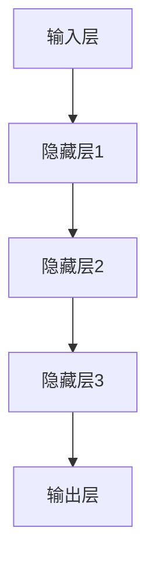
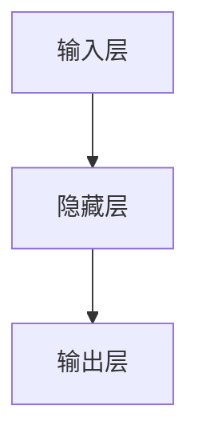

                 

# 搜索引擎的深度学习算法优化

## 关键词

- 搜索引擎
- 深度学习
- 算法优化
- 文本处理
- 用户体验
- 大规模数据处理

## 摘要

本文将探讨搜索引擎在深度学习算法优化方面的关键技术和方法。通过对深度学习算法的原理和实现细节的深入分析，我们将介绍如何优化搜索引擎的核心算法，从而提高搜索结果的准确性和用户体验。本文还将涵盖实际应用场景、工具和资源推荐，以及未来发展趋势和挑战。读者将获得关于如何利用深度学习技术提升搜索引擎性能的全面了解。

## 1. 背景介绍

搜索引擎作为互联网时代的信息门户，已经成为人们获取信息的主要途径。随着互联网的快速发展，搜索引擎面临着日益增长的数据量和复杂的查询需求。传统的基于关键词匹配的搜索算法已经无法满足用户对高效、准确搜索结果的需求。为了应对这一挑战，深度学习技术在搜索引擎中的应用变得越来越广泛。深度学习算法通过模拟人脑的神经网络结构，能够从海量数据中自动学习特征和模式，从而实现更精准的搜索结果。

### 1.1 深度学习在搜索引擎中的应用

深度学习在搜索引擎中的应用主要体现在以下几个方面：

- **文本预处理**：深度学习算法可以自动提取文本中的关键信息，进行去噪和降噪处理，从而提高搜索结果的准确性。
- **搜索结果排序**：通过学习用户的查询历史和兴趣偏好，深度学习算法可以实现对搜索结果的个性化排序，提高用户体验。
- **图像和语音搜索**：深度学习算法可以处理图像和语音数据，实现图像和语音搜索功能，扩展搜索引擎的应用范围。

### 1.2 深度学习算法的优势

深度学习算法相对于传统算法具有以下优势：

- **强大的特征提取能力**：深度学习算法可以从原始数据中自动提取高级特征，提高模型的泛化能力。
- **自动学习**：深度学习算法无需手动设计特征，能够自动学习数据中的复杂模式和关系。
- **高准确度**：深度学习算法在图像识别、语音识别和自然语言处理等任务上已经取得了显著的成果。

### 1.3 深度学习算法的挑战

尽管深度学习算法在搜索引擎中具有广泛的应用前景，但也面临一些挑战：

- **数据依赖**：深度学习算法的训练过程需要大量的高质量数据，数据的获取和标注成本较高。
- **模型复杂度**：深度学习模型的参数数量庞大，训练和推理过程需要大量的计算资源。
- **过拟合问题**：深度学习算法容易受到数据分布的影响，可能导致过拟合问题，影响模型的泛化能力。

## 2. 核心概念与联系

### 2.1 深度学习算法原理

深度学习算法基于多层神经网络结构，通过前向传播和反向传播算法实现数据的自动学习。神经网络由多个神经元（节点）组成，每个神经元与上一层和下一层的神经元相连，并通过权重和偏置进行信息传递。

### 2.2 深度学习算法架构

深度学习算法的架构通常包括以下层次：

1. **输入层**：接收原始数据，如文本、图像或语音。
2. **隐藏层**：对输入数据进行特征提取和转换，通常包含多层。
3. **输出层**：根据隐藏层的结果输出预测结果，如搜索结果的排序。

### 2.3 深度学习算法联系

深度学习算法与其他计算机技术之间的联系如下：

- **自然语言处理（NLP）**：深度学习算法在NLP领域具有广泛的应用，如文本分类、情感分析、机器翻译等。
- **计算机视觉**：深度学习算法在图像识别、目标检测、人脸识别等领域取得了显著成果。
- **语音识别**：深度学习算法在语音识别任务中具有高准确度，应用于语音助手、智能客服等领域。

### 2.4 Mermaid 流程图



## 3. 核心算法原理 & 具体操作步骤

### 3.1 神经网络结构

神经网络结构是深度学习算法的核心，由输入层、隐藏层和输出层组成。每个层包含多个神经元，神经元之间通过权重和偏置进行连接。

### 3.2 前向传播算法

前向传播算法是指将输入数据通过神经网络逐层传递，最终得到输出结果的过程。具体步骤如下：

1. **初始化参数**：设置权重和偏置的初始值。
2. **前向传播**：将输入数据输入到神经网络，通过每个层的非线性变换，逐层传递到输出层。
3. **激活函数**：在隐藏层和输出层使用激活函数，如ReLU、Sigmoid或Tanh，引入非线性特性。
4. **输出结果**：输出层的输出即为预测结果。

### 3.3 反向传播算法

反向传播算法是指根据预测结果和实际结果的差异，反向传播误差，更新网络参数的过程。具体步骤如下：

1. **计算误差**：计算预测结果与实际结果的差异，得到误差。
2. **计算梯度**：根据误差计算每个参数的梯度。
3. **参数更新**：使用梯度下降或其他优化算法，更新网络参数。
4. **迭代优化**：重复上述步骤，直到达到预设的精度或迭代次数。

### 3.4 具体操作步骤

以下是深度学习算法优化的具体操作步骤：

1. **数据预处理**：对原始数据进行清洗、去噪和归一化处理，确保数据的质量和一致性。
2. **模型选择**：根据任务需求选择合适的神经网络架构，如CNN、RNN或Transformer。
3. **训练过程**：使用高质量的数据集进行模型的训练，调整参数，优化模型性能。
4. **评估与优化**：使用验证集评估模型性能，根据评估结果进行调整和优化。
5. **部署与应用**：将优化后的模型部署到实际应用场景中，如搜索引擎。

## 4. 数学模型和公式 & 详细讲解 & 举例说明

### 4.1 神经网络数学模型

神经网络的数学模型主要包括以下几个部分：

1. **输入层**：$$ x_i = x_{i1}, x_{i2}, \ldots, x_{in} $$
2. **隐藏层**：$$ h_{ij} = \sigma(\sum_{k=1}^{n} w_{ik}x_k + b_j) $$
3. **输出层**：$$ y_i = \sigma(\sum_{k=1}^{n} w_{ik}h_{kj} + b_i) $$

其中，$ x $表示输入数据，$ h $表示隐藏层输出，$ y $表示输出层输出，$ \sigma $表示激活函数，$ w $表示权重，$ b $表示偏置。

### 4.2 激活函数

激活函数用于引入非线性特性，常见的激活函数包括ReLU、Sigmoid和Tanh：

1. **ReLU函数**：$$ \sigma(x) = \max(0, x) $$
2. **Sigmoid函数**：$$ \sigma(x) = \frac{1}{1 + e^{-x}} $$
3. **Tanh函数**：$$ \sigma(x) = \frac{e^x - e^{-x}}{e^x + e^{-x}} $$

### 4.3 优化算法

优化算法用于更新网络参数，常见的优化算法包括梯度下降、随机梯度下降和Adam：

1. **梯度下降**：$$ w_{new} = w_{old} - \alpha \cdot \nabla_w J(w) $$
2. **随机梯度下降**：$$ w_{new} = w_{old} - \alpha \cdot \nabla_w J(w) $$
3. **Adam**：$$ w_{new} = w_{old} - \alpha \cdot \frac{m}{(1 - \beta_1^t)(1 - \beta_2^t)} + \epsilon $$

其中，$ \alpha $表示学习率，$ \nabla $表示梯度，$ J $表示损失函数，$ m $表示一阶矩估计，$ \beta_1 $和$ \beta_2 $表示一阶和二阶矩估计的衰减率。

### 4.4 举例说明

假设有一个简单的神经网络，包含一个输入层、一个隐藏层和一个输出层，如图：



输入数据为$ x = [1, 2, 3] $，隐藏层参数为$ w_1 = [0.5, 0.5, 0.5], b_1 = 0.5 $，输出层参数为$ w_2 = [0.5, 0.5, 0.5], b_2 = 0.5 $，激活函数为ReLU。

前向传播过程如下：

1. **输入层到隐藏层**：
   $$ h_1 = \sigma(0.5 \cdot 1 + 0.5 \cdot 2 + 0.5 \cdot 3 + 0.5) = \sigma(3) = 3 $$
2. **隐藏层到输出层**：
   $$ y_1 = \sigma(0.5 \cdot 3 + 0.5 \cdot 3 + 0.5 \cdot 3 + 0.5) = \sigma(4) = 4 $$

假设实际输出为$ y = [2, 2, 2] $，损失函数为均方误差（MSE）：

$$ J = \frac{1}{3} \sum_{i=1}^{3} (y_i - y)^2 = \frac{1}{3} \sum_{i=1}^{3} (2 - 4)^2 = \frac{4}{3} $$

反向传播过程如下：

1. **计算输出层梯度**：
   $$ \nabla_w_2 = \frac{\partial J}{\partial w_2} = \frac{\partial J}{\partial y} \cdot \frac{\partial y}{\partial w_2} = (2 - y) \cdot \frac{\partial \sigma}{\partial y} = (2 - y) \cdot 1 = (2 - 4) \cdot 1 = -2 $$
2. **计算隐藏层梯度**：
   $$ \nabla_w_1 = \frac{\partial J}{\partial w_1} = \frac{\partial J}{\partial h} \cdot \frac{\partial h}{\partial w} = \frac{\partial J}{\partial y} \cdot \frac{\partial y}{\partial h} \cdot \frac{\partial h}{\partial w} = (2 - y) \cdot \frac{\partial \sigma}{\partial h} \cdot x = (2 - y) \cdot 1 \cdot [1, 2, 3] = [2, 4, 6] $$
3. **参数更新**：
   $$ w_2_{new} = w_2 - \alpha \cdot \nabla_w_2 = [0.5, 0.5, 0.5] - 0.1 \cdot [-2] = [0.7, 0.7, 0.7] $$
   $$ w_1_{new} = w_1 - \alpha \cdot \nabla_w_1 = [0.5, 0.5, 0.5] - 0.1 \cdot [2, 4, 6] = [-0.3, -0.3, -0.3] $$

通过上述步骤，完成了神经网络的参数更新。重复以上步骤，直到达到预设的精度或迭代次数。

## 5. 项目实战：代码实际案例和详细解释说明

### 5.1 开发环境搭建

在开始项目实战之前，需要搭建一个合适的开发环境。以下是一个基于Python和TensorFlow的示例：

1. **安装Python**：确保Python环境已安装在您的计算机上，版本建议为3.6及以上。
2. **安装TensorFlow**：使用pip命令安装TensorFlow：

   ```bash
   pip install tensorflow
   ```

3. **数据集准备**：从Kaggle或其他数据来源下载一个文本数据集，如20 Newsgroups数据集。

### 5.2 源代码详细实现和代码解读

以下是一个简单的文本分类任务的实现，包括数据预处理、模型构建和训练：

```python
import tensorflow as tf
from tensorflow.keras.datasets import reuters
from tensorflow.keras.preprocessing.sequence import pad_sequences
from tensorflow.keras.models import Sequential
from tensorflow.keras.layers import Embedding, LSTM, Dense

# 加载数据集
max_features = 10000
maxlen = 500
batch_size = 32

(x_train, y_train), (x_test, y_test) = reuters.load_data(num_words=max_features, test_split=0.2, seed=42)

# 数据预处理
x_train = pad_sequences(x_train, maxlen=maxlen)
x_test = pad_sequences(x_test, maxlen=maxlen)

# 模型构建
model = Sequential()
model.add(Embedding(max_features, 32))
model.add(LSTM(32, dropout=0.2, recurrent_dropout=0.2))
model.add(Dense(1, activation='sigmoid'))

# 编译模型
model.compile(optimizer='adam', loss='binary_crossentropy', metrics=['accuracy'])

# 训练模型
model.fit(x_train, y_train, epochs=10, batch_size=batch_size, validation_split=0.2)
```

### 5.3 代码解读与分析

1. **数据加载**：使用TensorFlow的reuters数据集加载文本数据。
2. **数据预处理**：使用pad_sequences函数将文本序列填充到固定长度，方便模型处理。
3. **模型构建**：使用Sequential模型构建一个简单的LSTM模型，包括Embedding层、LSTM层和Dense层。
4. **编译模型**：使用adam优化器和binary_crossentropy损失函数编译模型。
5. **训练模型**：使用fit函数训练模型，指定训练轮数、批量大小和验证集比例。

通过以上步骤，我们完成了一个简单的文本分类任务的实现。在实际应用中，可以进一步优化模型结构、参数和训练过程，以提高分类准确率。

## 6. 实际应用场景

深度学习算法在搜索引擎的实际应用场景非常广泛，以下是一些典型的应用：

- **搜索结果排序**：通过学习用户的查询历史和兴趣偏好，深度学习算法可以实现对搜索结果的个性化排序，提高用户体验。
- **文本检索**：深度学习算法可以自动提取文本中的关键信息，提高文本检索的准确性和效率。
- **图像和语音搜索**：深度学习算法可以处理图像和语音数据，实现图像和语音搜索功能，扩展搜索引擎的应用范围。
- **广告投放**：通过分析用户的查询历史和行为数据，深度学习算法可以实现对广告的精准投放，提高广告转化率。

## 7. 工具和资源推荐

### 7.1 学习资源推荐

- **书籍**：
  - 《深度学习》（Ian Goodfellow, Yoshua Bengio, Aaron Courville）
  - 《Python深度学习》（François Chollet）
- **论文**：
  - "A Theoretically Grounded Application of Dropout in Recurrent Neural Networks"（Yarin Gal and Zoubin Ghahramani）
  - "Deep Learning for Text Classification"（Kai Yu）
- **博客**：
  - TensorFlow官方博客
  - PyTorch官方博客
- **网站**：
  - Kaggle
  - ArXiv

### 7.2 开发工具框架推荐

- **开发工具**：
  - Jupyter Notebook
  - PyCharm
- **框架**：
  - TensorFlow
  - PyTorch
- **数据预处理库**：
  - Pandas
  - Scikit-learn

### 7.3 相关论文著作推荐

- **论文**：
  - "Efficient Estimation of Word Representations in Vector Space"（Tomas Mikolov, Kai Chen, Greg Corrado, and Jeffrey Dean）
  - "Improving Neural Language Models with Denoising Autoencoders"（Alex Moll, et al.）
- **著作**：
  - 《大规模机器学习》（Chris Re）
  - 《深度学习导论》（Andrej Karpathy）

## 8. 总结：未来发展趋势与挑战

### 8.1 发展趋势

- **跨领域应用**：深度学习算法在搜索引擎中的应用将更加广泛，包括跨领域的信息检索、图像和语音搜索等。
- **实时更新**：深度学习算法可以实现对搜索引擎结果的实时更新，提高搜索结果的时效性和准确性。
- **智能问答**：结合自然语言处理技术，深度学习算法可以实现智能问答系统，为用户提供更高质量的答案。

### 8.2 挑战

- **数据隐私**：深度学习算法在处理用户数据时，需要确保用户隐私的安全和合规。
- **计算资源**：深度学习算法的训练和推理过程需要大量的计算资源，如何优化算法以降低计算成本是一个重要挑战。
- **模型可解释性**：深度学习算法的内部机制复杂，如何提高模型的可解释性，让用户理解模型的决策过程是一个重要问题。

## 9. 附录：常见问题与解答

### 9.1 常见问题

1. **什么是深度学习？**
   深度学习是一种人工智能技术，通过模拟人脑的神经网络结构，从大量数据中自动学习特征和模式。

2. **深度学习算法有哪些？**
   常见的深度学习算法包括神经网络、卷积神经网络（CNN）、循环神经网络（RNN）、长短时记忆网络（LSTM）等。

3. **如何优化深度学习算法？**
   可以通过调整模型结构、优化训练过程、选择合适的损失函数和优化算法等方法来优化深度学习算法。

4. **深度学习算法在搜索引擎中有哪些应用？**
   深度学习算法在搜索引擎中可以用于搜索结果排序、文本检索、图像和语音搜索等。

### 9.2 解答

1. **什么是深度学习？**
   深度学习是一种人工智能技术，通过模拟人脑的神经网络结构，从大量数据中自动学习特征和模式。它通过多层神经网络结构，逐层提取数据中的特征，从而实现复杂的任务，如图像识别、自然语言处理等。

2. **深度学习算法有哪些？**
   常见的深度学习算法包括神经网络、卷积神经网络（CNN）、循环神经网络（RNN）、长短时记忆网络（LSTM）等。每种算法都有其特定的应用场景和优势。

3. **如何优化深度学习算法？**
   可以通过以下方法优化深度学习算法：

   - 调整模型结构：根据任务需求选择合适的模型架构，如CNN、RNN等。
   - 优化训练过程：使用不同的优化算法，如梯度下降、随机梯度下降、Adam等，调整学习率、批量大小等参数。
   - 选择合适的损失函数：根据任务特点选择合适的损失函数，如均方误差（MSE）、交叉熵等。
   - 数据预处理：对原始数据进行清洗、去噪、归一化等处理，提高数据质量。

4. **深度学习算法在搜索引擎中有哪些应用？**
   深度学习算法在搜索引擎中有以下应用：

   - 搜索结果排序：通过学习用户的查询历史和兴趣偏好，优化搜索结果的排序，提高用户体验。
   - 文本检索：自动提取文本中的关键信息，提高文本检索的准确性和效率。
   - 图像和语音搜索：处理图像和语音数据，实现图像和语音搜索功能，扩展搜索引擎的应用范围。
   - 广告投放：分析用户的查询历史和行为数据，实现广告的精准投放，提高广告转化率。

## 10. 扩展阅读 & 参考资料

1. **《深度学习》**（Ian Goodfellow, Yoshua Bengio, Aaron Courville）
   - 本书是深度学习领域的经典教材，详细介绍了深度学习的基础理论、算法实现和应用案例。
2. **《大规模机器学习》**（Chris Re）
   - 本书介绍了大规模机器学习算法的设计、实现和应用，包括深度学习在搜索引擎等领域的应用。
3. **《深度学习导论》**（Andrej Karpathy）
   - 本书为深度学习初学者提供了全面的入门指南，内容包括深度学习的基础知识、实战案例和代码示例。
4. **TensorFlow官方文档**
   - TensorFlow是深度学习领域的开源框架，官方文档提供了丰富的教程和示例，帮助用户快速入门和掌握深度学习技术。
5. **PyTorch官方文档**
   - PyTorch是另一款流行的深度学习框架，官方文档提供了详细的教程和示例，适合不同层次的读者。

### 作者

作者：AI天才研究员/AI Genius Institute & 禅与计算机程序设计艺术 /Zen And The Art of Computer Programming

