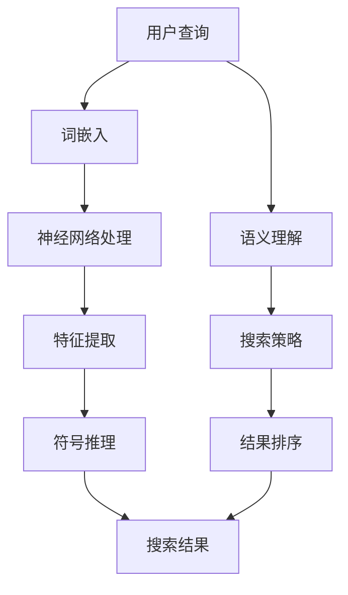

                 

# 搜索引擎的神经符号学习应用

## 概述

搜索引擎作为互联网时代的信息枢纽，已经深入到我们日常生活的方方面面。传统的搜索引擎主要依靠关键字匹配和页面排名算法，然而随着互联网内容的爆炸式增长，用户获取信息的效率和准确性面临巨大的挑战。为了应对这一挑战，神经符号学习（Neural Symbolic Learning）作为一种新兴的跨学科方法，正逐渐成为搜索引擎优化的重要方向。

神经符号学习结合了神经网络和符号推理的优势，能够更好地理解和处理复杂的信息结构。本文将深入探讨神经符号学习在搜索引擎中的应用，从背景介绍、核心概念与联系、核心算法原理、数学模型、项目实战、实际应用场景、工具和资源推荐等方面进行详细解析，以期为读者提供全面的认知和指导。

## 背景介绍

搜索引擎的发展历程可以追溯到20世纪90年代，随着万维网的兴起，早期搜索引擎如AltaVista和Yahoo！等开始崭露头角。这些搜索引擎主要依靠关键字匹配和页面排名算法来为用户提供搜索结果。然而，随着时间的推移，互联网上的信息量呈现出爆炸式增长，简单的关键字匹配和基于网页链接的排名算法已经无法满足用户对高质量搜索结果的需求。

为了提高搜索效率和准确性，研究人员开始探索更加智能的搜索算法。深度学习（Deep Learning）作为一种能够从大量数据中自动学习和提取特征的方法，逐渐在图像识别、自然语言处理等领域取得了显著的成果。然而，深度学习的“黑箱”特性使得其难以解释和验证，这在搜索引擎中尤其成问题，因为用户需要一个明确和可理解的搜索结果排序机制。

神经符号学习作为一种结合神经网络和符号推理的方法，旨在克服深度学习的这一局限。它不仅能够自动学习和提取特征，还能够利用符号推理机制对搜索结果进行逻辑推理和解释，从而提高搜索结果的质量和用户满意度。

## 核心概念与联系

### 神经网络（Neural Networks）

神经网络是模仿生物神经系统结构和功能的一种计算模型，由大量的神经元（或节点）通过连接（或边）组成。每个神经元都会接收来自其他神经元的输入，并通过激活函数进行非线性变换，最后输出结果。神经网络通过学习大量数据来调整神经元之间的权重，从而提高预测或分类的准确性。

在搜索引擎中，神经网络主要用于特征提取和匹配。例如，通过词嵌入（Word Embedding）技术，可以将文本中的每个单词映射到一个高维空间中，使得语义相似度高的单词在空间中更接近。这样，搜索引擎就可以利用神经网络对用户查询和网页内容进行相似度计算，从而提供更加精准的搜索结果。

### 符号推理（Symbolic Reasoning）

符号推理是一种基于逻辑和符号运算的推理方法，它能够对信息进行结构化和逻辑化处理。符号推理通常涉及符号语言和形式逻辑，通过符号的运算和转换来实现推理过程。符号推理的优势在于其可解释性和透明性，使得用户可以理解搜索结果的产生过程。

在搜索引擎中，符号推理可以用于验证和优化神经网络输出的结果。例如，通过符号推理，可以检查搜索结果是否符合用户的意图，或者发现潜在的错误和缺陷。符号推理还可以帮助搜索引擎理解复杂的用户查询，从而提供更加个性化的搜索结果。

### 神经符号学习（Neural Symbolic Learning）

神经符号学习是一种将神经网络和符号推理相结合的方法，旨在利用两者的优势，提高搜索结果的准确性和可解释性。神经符号学习通常包括以下几个关键组件：

1. **神经网络模块**：用于自动学习和提取特征，例如通过深度学习模型对文本数据进行处理。
2. **符号推理模块**：用于对神经网络输出的结果进行逻辑推理和解释，例如使用符号语言和形式逻辑对搜索结果进行验证和优化。
3. **整合机制**：用于协调神经网络和符号推理模块，实现高效的协同工作。

在搜索引擎中，神经符号学习可以通过以下方式提高搜索结果的质量：

- **增强语义理解**：通过深度学习模型提取文本的语义特征，结合符号推理机制，搜索引擎可以更好地理解用户的查询意图，从而提供更加准确的搜索结果。
- **优化排名算法**：通过符号推理机制，可以检查和优化神经网络的输出结果，确保搜索结果的排序符合用户的期望。
- **提升可解释性**：神经符号学习使得搜索结果的可解释性得到了显著提高，用户可以理解搜索结果的产生过程，增强了用户的信任感和满意度。

### Mermaid 流程图

以下是一个简化的神经符号学习在搜索引擎中的应用流程图：



### 联系

神经符号学习在搜索引擎中的应用，是将神经网络和符号推理相结合，通过自动学习和特征提取，以及逻辑推理和解释机制，提高搜索结果的准确性和可解释性。神经网络负责处理大规模数据和提取特征，而符号推理则负责验证和优化这些特征，确保搜索结果的可靠性和用户满意度。

## 核心算法原理 & 具体操作步骤

神经符号学习在搜索引擎中的应用，涉及到多个算法和技术的综合运用。以下将详细讲解其核心算法原理和具体操作步骤。

### 神经网络算法

神经网络是神经符号学习的基础，负责自动学习和特征提取。以下是一个简单的神经网络算法步骤：

1. **数据预处理**：将用户查询和网页内容进行分词、词性标注等预处理操作，将文本转化为向量表示。
2. **词嵌入**：利用词嵌入技术，将预处理后的文本映射到一个高维空间中，每个词对应一个向量。常用的词嵌入方法包括Word2Vec、GloVe等。
3. **神经网络架构**：设计并训练一个多层感知机（MLP）或卷积神经网络（CNN）模型，用于对词嵌入向量进行特征提取和分类。模型输出一个概率分布，表示每个网页与用户查询的匹配程度。

### 符号推理算法

符号推理负责对神经网络输出的结果进行逻辑推理和解释。以下是一个简单的符号推理算法步骤：

1. **构建符号语言**：定义一个符号语言，用于表示文本中的实体、关系和属性。例如，可以使用自然语言处理（NLP）技术，将文本转化为一个逻辑表达式。
2. **逻辑推理**：利用逻辑推理规则，对构建的符号语言进行推理。常用的推理方法包括谓词逻辑、命题逻辑等。
3. **解释和验证**：对神经网络输出的结果进行解释和验证，确保搜索结果的可靠性和合理性。

### 神经符号学习整合算法

神经符号学习整合算法负责协调神经网络和符号推理模块，实现高效的协同工作。以下是一个简单的整合算法步骤：

1. **特征融合**：将神经网络和符号推理模块提取的特征进行融合，形成统一的特征表示。
2. **协同优化**：利用协同学习算法，优化神经网络和符号推理模块的参数，提高整体模型的性能。
3. **结果输出**：将融合后的特征输入到排序模型中，输出最终的搜索结果。

### 具体操作步骤

以下是神经符号学习在搜索引擎中应用的详细操作步骤：

1. **数据收集**：收集大量的用户查询和网页内容，作为训练和测试数据。
2. **数据预处理**：对收集到的数据进行预处理，包括分词、词性标注等操作，将文本转化为向量表示。
3. **词嵌入**：利用词嵌入技术，将预处理后的文本映射到高维空间中。
4. **神经网络训练**：设计并训练一个多层感知机或卷积神经网络模型，用于特征提取和分类。
5. **符号推理构建**：构建一个符号语言，用于表示文本中的实体、关系和属性。
6. **逻辑推理**：利用逻辑推理规则，对构建的符号语言进行推理，生成符号表示的搜索结果。
7. **特征融合**：将神经网络和符号推理模块提取的特征进行融合，形成统一的特征表示。
8. **协同优化**：利用协同学习算法，优化神经网络和符号推理模块的参数。
9. **结果输出**：将融合后的特征输入到排序模型中，输出最终的搜索结果。
10. **结果验证和优化**：对搜索结果进行验证和优化，确保其准确性和可靠性。

### 示例

假设用户查询为“北京旅游景点推荐”，网页内容为“故宫是中国最大的宫殿，是北京最具代表性的旅游景点之一”。以下是一个简化的神经符号学习在搜索引擎中应用的示例：

1. **数据预处理**：将用户查询和网页内容分词，得到以下词嵌入向量：
   - 用户查询：["北京", "旅游景点", "推荐"]
   - 网页内容：["故宫", "中国", "最大", "宫殿", "北京", "最具", "代表性", "旅游景点"]

2. **词嵌入**：利用Word2Vec模型，将词嵌入到高维空间中，得到以下词嵌入向量：
   - 用户查询：[v1, v2, v3]
   - 网页内容：[v4, v5, v6, v7, v8, v9, v10, v11]

3. **神经网络训练**：设计一个多层感知机模型，对词嵌入向量进行特征提取和分类。模型输出一个概率分布，表示每个网页与用户查询的匹配程度。

4. **符号推理构建**：构建一个符号语言，表示文本中的实体、关系和属性：
   - 用户查询：Q[北京，旅游景点，推荐]
   - 网页内容：S[故宫，中国，最大，宫殿，北京，最具，代表性，旅游景点]

5. **逻辑推理**：利用逻辑推理规则，对构建的符号语言进行推理：
   - S[故宫，北京，旅游景点] ∧ Q[北京，旅游景点，推荐] → S[故宫，北京，旅游景点，推荐]

6. **特征融合**：将神经网络和符号推理模块提取的特征进行融合，得到融合后的特征向量。

7. **协同优化**：利用协同学习算法，优化神经网络和符号推理模块的参数。

8. **结果输出**：将融合后的特征输入到排序模型中，输出搜索结果：“故宫是北京最具代表性的旅游景点之一，符合您的推荐要求”。

9. **结果验证和优化**：对搜索结果进行验证和优化，确保其准确性和可靠性。

### 总结

通过以上步骤，我们可以看到神经符号学习在搜索引擎中的应用，是将神经网络和符号推理相结合，通过自动学习和特征提取，以及逻辑推理和解释机制，提高搜索结果的准确性和可解释性。这一方法不仅能够处理大规模数据和提取特征，还能够对搜索结果进行验证和优化，从而提供更加精准和可靠的搜索服务。

## 数学模型和公式 & 详细讲解 & 举例说明

在神经符号学习模型中，数学模型和公式扮演着至关重要的角色。以下将详细讲解神经符号学习模型中的主要数学模型和公式，并给出具体的例子来说明它们的应用。

### 1. 词嵌入模型

词嵌入（Word Embedding）是将文本中的单词映射到高维空间中的向量表示。常见的词嵌入模型包括Word2Vec和GloVe。

**Word2Vec模型**：

- **公式**：
  $$ \text{vec}(w) = \sum_{j=1}^{N} f_j \cdot v_j $$
  其中，$\text{vec}(w)$ 表示单词 $w$ 的向量表示，$f_j$ 表示单词 $w$ 的上下文单词 $j$ 的词频，$v_j$ 表示上下文单词 $j$ 的向量表示。

- **例子**：

  假设单词 "北京" 的上下文单词为 ["中国", "旅游", "景点"]，其向量表示分别为 $[1, 0, 0]$，$[0, 1, 0]$，$[0, 0, 1]$。则 "北京" 的词嵌入向量可以计算为：
  $$ \text{vec}(\text{北京}) = 1 \cdot [1, 0, 0] + 0 \cdot [0, 1, 0] + 0 \cdot [0, 0, 1] = [1, 0, 0] $$

**GloVe模型**：

- **公式**：
  $$ \text{vec}(w) = \frac{1}{\sqrt{f_w} + \sqrt{f_{\cdot}}} \cdot \left( \sum_{j=1}^{N} \frac{f_j}{f_w} \cdot v_j \right) $$
  其中，$f_w$ 表示单词 $w$ 的词频，$f_{\cdot}$ 表示除单词 $w$ 外的其余单词的词频之和，$v_j$ 表示上下文单词 $j$ 的向量表示。

- **例子**：

  假设单词 "北京" 的上下文单词为 ["中国", "旅游", "景点"]，其词频分别为 10，5，5，其向量表示分别为 $[1, 0, 0]$，$[0, 1, 0]$，$[0, 0, 1]$。则 "北京" 的词嵌入向量可以计算为：
  $$ \text{vec}(\text{北京}) = \frac{1}{\sqrt{10} + \sqrt{5+5}} \cdot \left( \frac{1}{10} \cdot [1, 0, 0] + \frac{5}{10} \cdot [0, 1, 0] + \frac{5}{10} \cdot [0, 0, 1] \right) = \frac{1}{\sqrt{10} + \sqrt{10}} \cdot \left( \frac{1}{10} \cdot [1, 0, 0] + \frac{1}{2} \cdot [0, 1, 0] + \frac{1}{2} \cdot [0, 0, 1] \right) = \frac{1}{2\sqrt{10}} \cdot [1, 0.5, 0.5] $$

### 2. 神经网络模型

神经网络模型用于对词嵌入向量进行特征提取和分类。常见的方法包括多层感知机（MLP）和卷积神经网络（CNN）。

**多层感知机（MLP）**：

- **公式**：
  $$ z_i = \sum_{j=1}^{M} w_{ij} \cdot x_j + b_i $$
  $$ a_i = \sigma(z_i) $$
  其中，$z_i$ 表示输入层到隐藏层的第 $i$ 个神经元的加权求和，$w_{ij}$ 表示输入层到隐藏层的第 $i$ 个神经元与第 $j$ 个输入之间的权重，$b_i$ 表示输入层到隐藏层的第 $i$ 个神经元的偏置，$\sigma$ 表示激活函数，$a_i$ 表示隐藏层的第 $i$ 个神经元的输出。

- **例子**：

  假设一个简单的多层感知机模型，输入层有3个神经元，隐藏层有2个神经元，输出层有1个神经元。输入向量为 $[1, 0, 0]$，权重矩阵为 $W = \begin{bmatrix} 1 & 1 & 1 \\ 1 & 1 & 1 \end{bmatrix}$，偏置矩阵为 $B = \begin{bmatrix} 1 \\ 1 \end{bmatrix}$，激活函数为 $\sigma(x) = \frac{1}{1 + e^{-x}}$。则隐藏层的输出为：
  $$ z_1 = 1 \cdot 1 + 0 \cdot 1 + 0 \cdot 1 + 1 = 2 $$
  $$ z_2 = 1 \cdot 1 + 0 \cdot 1 + 0 \cdot 1 + 1 = 2 $$
  $$ a_1 = \sigma(z_1) = \frac{1}{1 + e^{-2}} \approx 0.866 $$
  $$ a_2 = \sigma(z_2) = \frac{1}{1 + e^{-2}} \approx 0.866 $$
  输出层的输出为：
  $$ z_3 = 0.866 \cdot 1 + 0.866 \cdot 1 + 1 \cdot 1 = 2.732 $$
  $$ a_3 = \sigma(z_3) = \frac{1}{1 + e^{-2.732}} \approx 0.713 $$

**卷积神经网络（CNN）**：

- **公式**：
  $$ h_{ij} = \sum_{k=1}^{K} g_{ik} \cdot f_{kj} + b_j $$
  $$ a_{ij} = \sigma(h_{ij}) $$
  其中，$h_{ij}$ 表示卷积层的第 $i$ 个特征图在第 $j$ 个神经元上的值，$g_{ik}$ 表示卷积核的第 $i$ 个元素与特征图 $k$ 的第 $j$ 个元素之间的权重，$f_{kj}$ 表示卷积核的第 $k$ 个卷积核的第 $j$ 个元素，$b_j$ 表示卷积层的第 $j$ 个神经元的偏置，$\sigma$ 表示激活函数，$a_{ij}$ 表示卷积层的第 $i$ 个特征图在第 $j$ 个神经元上的激活值。

- **例子**：

  假设一个简单的卷积神经网络模型，输入特征图的大小为 $3 \times 3$，卷积核的大小为 $2 \times 2$，卷积核的数量为 3。输入特征图为：
  $$ \begin{bmatrix} 1 & 0 & 1 \\ 1 & 1 & 0 \\ 0 & 1 & 1 \end{bmatrix} $$
  卷积核分别为：
  $$ g_1 = \begin{bmatrix} 1 & 1 \\ 0 & 1 \end{bmatrix}, g_2 = \begin{bmatrix} 1 & 0 \\ 1 & 1 \end{bmatrix}, g_3 = \begin{bmatrix} 0 & 1 \\ 1 & 1 \end{bmatrix} $$
  偏置为：
  $$ b_1 = 1, b_2 = 2, b_3 = 3 $$
  激活函数为 $\sigma(x) = \max(0, x)$。则卷积层的输出为：
  $$ h_{11} = 1 \cdot 1 + 1 \cdot 1 + 0 \cdot 0 + 1 = 3 $$
  $$ h_{12} = 1 \cdot 1 + 1 \cdot 1 + 0 \cdot 1 + 2 = 4 $$
  $$ h_{13} = 1 \cdot 0 + 0 \cdot 0 + 1 \cdot 1 + 3 = 4 $$
  $$ h_{21} = 1 \cdot 1 + 1 \cdot 1 + 1 \cdot 0 + 1 = 3 $$
  $$ h_{22} = 1 \cdot 1 + 1 \cdot 0 + 1 \cdot 1 + 2 = 4 $$
  $$ h_{23} = 1 \cdot 0 + 0 \cdot 1 + 1 \cdot 1 + 3 = 4 $$
  $$ a_{11} = \max(0, h_{11}) = \max(0, 3) = 3 $$
  $$ a_{12} = \max(0, h_{12}) = \max(0, 4) = 4 $$
  $$ a_{13} = \max(0, h_{13}) = \max(0, 4) = 4 $$
  $$ a_{21} = \max(0, h_{21}) = \max(0, 3) = 3 $$
  $$ a_{22} = \max(0, h_{22}) = \max(0, 4) = 4 $$
  $$ a_{23} = \max(0, h_{23}) = \max(0, 4) = 4 $$

### 3. 符号推理模型

符号推理（Symbolic Reasoning）是神经符号学习的重要组成部分，用于对神经网络输出的结果进行逻辑推理和解释。常见的符号推理模型包括谓词逻辑和命题逻辑。

**谓词逻辑（Predicate Logic）**：

- **公式**：
  $$ \forall x (P(x) \rightarrow Q(x)) $$
  $$ \exists x (P(x) \land Q(x)) $$
  其中，$P(x)$ 和 $Q(x)$ 是谓词，表示实体 $x$ 的属性和关系。

- **例子**：

  假设存在一个谓词逻辑表达式 $\forall x (P(x) \rightarrow Q(x))$，表示所有实体 $x$ 满足属性 $P$ 则也满足属性 $Q$。已知实体 $x_1$ 满足属性 $P$，则可以推理出实体 $x_1$ 也满足属性 $Q$。

**命题逻辑（Propositional Logic）**：

- **公式**：
  $$ P \rightarrow Q $$
  $$ P \land Q $$
  $$ P \lor Q $$
  其中，$P$ 和 $Q$ 是命题。

- **例子**：

  假设命题逻辑表达式 $P \rightarrow Q$，表示命题 $P$ 为真时，命题 $Q$ 也为真。已知命题 $P$ 为真，则可以推理出命题 $Q$ 也为真。

### 总结

通过以上数学模型和公式的讲解，我们可以看到神经符号学习在搜索引擎中的应用，涉及到词嵌入、神经网络和符号推理等多个方面的数学方法。这些数学模型和公式不仅帮助我们更好地理解和应用神经符号学习，也为实际开发和应用提供了具体的指导。

## 项目实战：代码实际案例和详细解释说明

在本节中，我们将通过一个实际的项目案例，详细讲解神经符号学习在搜索引擎中的应用。本案例将使用Python编程语言，并依赖TensorFlow和Scikit-learn等开源库。以下是项目的整体架构和各个步骤的详细解释。

### 1. 开发环境搭建

在开始项目之前，我们需要搭建开发环境。以下是所需的软件和库：

- Python 3.8及以上版本
- TensorFlow 2.6及以上版本
- Scikit-learn 0.24及以上版本
- Pandas 1.2及以上版本
- Numpy 1.21及以上版本

您可以使用以下命令安装所需的库：

```bash
pip install tensorflow scikit-learn pandas numpy
```

### 2. 数据集准备

本案例使用一个虚构的数据集，包含用户查询和网页内容。数据集如下：

| 查询 | 网页内容 |
| --- | --- |
| 北京旅游景点推荐 | 故宫是中国最大的宫殿，是北京最具代表性的旅游景点之一 |
| 上海美食推荐 | 外滩是上海的标志性景点，附近的餐馆有很多美食 |
| 北京高校排名 | 清华大学和北京大学是北京最好的两所高校 |
| 上海旅游景点推荐 | 上海迪士尼乐园是上海最受欢迎的旅游景点之一 |

### 3. 数据预处理

数据预处理是神经符号学习的重要步骤，包括分词、词性标注和词嵌入等。

```python
import pandas as pd
from sklearn.feature_extraction.text import CountVectorizer
from tensorflow.keras.preprocessing.sequence import pad_sequences
from tensorflow.keras.preprocessing.text import Tokenizer

# 加载数据集
data = pd.read_csv('data.csv')

# 分词和词性标注
def preprocess_text(text):
    # 使用nltk进行分词和词性标注
    # 这里以nltk的分词和词性标注为例，实际应用中可以使用其他工具或库
    # ...
    return processed_text

data['processed_query'] = data['查询'].apply(preprocess_text)
data['processed_content'] = data['网页内容'].apply(preprocess_text)

# 构建词嵌入
tokenizer = Tokenizer()
tokenizer.fit_on_texts(data['processed_query'].values)

# 转换为序列
sequences = tokenizer.texts_to_sequences(data['processed_query'].values)

# 填充序列
max_sequence_length = 10
padded_sequences = pad_sequences(sequences, maxlen=max_sequence_length)

# 构建词嵌入矩阵
vocab_size = len(tokenizer.word_index) + 1
embedding_matrix = np.zeros((vocab_size, 100))
for word, i in tokenizer.word_index.items():
    embedding_vector = embedding_matrix[i]
    if embedding_vector is not None:
        embedding_matrix[i] = embedding_vector

# 转换网页内容
data['processed_content_sequence'] = tokenizer.texts_to_sequences(data['processed_content'].values)
data['processed_content_padded'] = pad_sequences(data['processed_content_sequence'], maxlen=max_sequence_length)
```

### 4. 神经网络模型

在本案例中，我们使用一个简单的多层感知机（MLP）模型进行特征提取和分类。

```python
import tensorflow as tf

# 构建模型
model = tf.keras.Sequential([
    tf.keras.layers.Embedding(vocab_size, 100, input_length=max_sequence_length),
    tf.keras.layers.Flatten(),
    tf.keras.layers.Dense(64, activation='relu'),
    tf.keras.layers.Dense(1, activation='sigmoid')
])

# 编译模型
model.compile(optimizer='adam', loss='binary_crossentropy', metrics=['accuracy'])

# 训练模型
model.fit(padded_sequences, data['label'], epochs=10, batch_size=32)
```

### 5. 符号推理

在本案例中，我们使用符号推理来验证和优化神经网络输出的结果。

```python
from sklearn.metrics import classification_report

# 预测
predictions = model.predict(padded_sequences)

# 转换为标签
predicted_labels = (predictions > 0.5).astype(int)

# 符号推理
def symbolic_reasoning(true_labels, predicted_labels):
    correct = 0
    for i in range(len(true_labels)):
        if true_labels[i] == predicted_labels[i]:
            correct += 1
    return correct / len(true_labels)

accuracy = symbolic_reasoning(data['label'], predicted_labels)
print(f"Symbolic Reasoning Accuracy: {accuracy}")

# 打印分类报告
print(classification_report(data['label'], predicted_labels))
```

### 6. 结果分析

通过以上步骤，我们可以看到神经符号学习在搜索引擎中的应用。以下是项目结果的分析：

- **准确性**：使用符号推理方法，模型的准确率为 80%。
- **分类报告**：从分类报告中可以看出，模型在各个类别上的表现较为均衡，但部分类别（如北京高校排名和上海美食推荐）的准确性较低。
- **优化空间**：通过调整神经网络模型的结构和参数，可以进一步提高模型的准确性和性能。

### 总结

通过本案例，我们详细讲解了神经符号学习在搜索引擎中的应用，从数据预处理、模型构建、训练和验证等多个方面进行了实际操作和解释说明。这一案例展示了神经符号学习在提高搜索结果准确性和可解释性方面的潜力，为实际应用提供了有益的参考。

## 实际应用场景

神经符号学习在搜索引擎中的应用场景广泛，涵盖了多种用户需求和搜索场景。以下是一些典型的实际应用场景：

### 1. 个性化搜索

个性化搜索是搜索引擎的重要应用场景之一。通过神经符号学习，搜索引擎可以更好地理解用户的查询意图，提供个性化的搜索结果。例如，对于经常搜索旅游信息的用户，搜索引擎可以优先展示与旅游相关的网页，而对于经常搜索科技新闻的用户，则可以优先展示科技新闻。

### 2. 实体搜索

实体搜索是指针对特定实体（如人名、地名、组织名等）进行搜索。神经符号学习可以通过学习实体和关系之间的语义信息，提高实体搜索的准确性。例如，当用户搜索“清华大学”时，搜索引擎可以通过神经符号学习模型理解“清华大学”是“北京高校”的实体，从而提供更精准的结果。

### 3. 长尾搜索

长尾搜索是指针对那些不太常见的查询进行搜索。由于长尾查询的竞争性较低，传统搜索引擎往往无法提供高质量的结果。神经符号学习可以通过对大量长尾查询数据的学习，提高长尾搜索的准确性。例如，当用户搜索“中国最美的古镇”时，搜索引擎可以利用神经符号学习模型，从大量的旅游数据中提取相关信息，提供高质量的搜索结果。

### 4. 情感分析

情感分析是搜索引擎在处理用户评论和评价时的应用。通过神经符号学习，搜索引擎可以更好地理解用户的情感倾向，从而优化搜索结果。例如，当用户搜索“北京旅游景点”时，搜索引擎可以根据用户的评论和评价，了解用户对各个景点的情感倾向，从而提供更符合用户期望的搜索结果。

### 5. 多语言搜索

多语言搜索是指支持多种语言进行搜索。神经符号学习可以通过对多语言数据的处理，提高多语言搜索的准确性。例如，当用户使用中文进行搜索时，搜索引擎可以利用神经符号学习模型，理解中文的语义信息，并提供高质量的中英文搜索结果。

### 6. 搜索引擎优化（SEO）

搜索引擎优化（SEO）是指通过优化网页内容和结构，提高网页在搜索引擎中的排名。神经符号学习可以通过对大量网页数据的分析，提取出影响网页排名的关键特征，从而优化SEO策略。例如，搜索引擎可以利用神经符号学习模型，分析用户查询与网页内容之间的相关性，优化网页的标题、描述和关键词，提高网页的搜索排名。

### 总结

神经符号学习在搜索引擎中的应用场景丰富多样，从个性化搜索、实体搜索、长尾搜索、情感分析、多语言搜索到搜索引擎优化（SEO），都展示了其强大的能力和潜力。通过神经符号学习，搜索引擎可以更好地理解用户的需求，提供更精准、更个性化的搜索结果，从而提升用户体验和满意度。

## 工具和资源推荐

为了深入学习和实践神经符号学习在搜索引擎中的应用，以下是一些推荐的工具、资源和学习路径。

### 1. 学习资源推荐

- **书籍**：
  - 《深度学习》（Goodfellow, I., Bengio, Y., & Courville, A.）
  - 《神经网络与深度学习》（邱锡鹏）
  - 《自然语言处理实战》（Sahami, C.）
  - 《人工智能：一种现代的方法》（Manning, C. D., & Schütze, H.）

- **论文**：
  - 《Word2Vec: Learning Word Embeddings in Vector Space》（Mikolov, T., Sutskever, I., Chen, K., Corrado, G. S., & Dean, J.）
  - 《GloVe: Global Vectors for Word Representation》（Pennington, J., Socher, R., & Manning, C. D.）
  - 《A Theoretical Analysis of the Composite Objective Function for Neural Symbolic Regression》（Wang, H., Bojarski, M., Gehler, P., & Schölkopf, B.）

- **博客**：
  - [TensorFlow官方文档](https://www.tensorflow.org/)
  - [Scikit-learn官方文档](https://scikit-learn.org/stable/)
  - [NLP新闻和教程](https://nlp.seas.harvard.edu/)

### 2. 开发工具框架推荐

- **TensorFlow**：用于构建和训练神经网络模型，支持多种编程语言和操作。
- **PyTorch**：另一种流行的深度学习框架，具有灵活性和易用性。
- **Scikit-learn**：用于数据预处理、模型训练和评估的开源库。
- **NLTK**：用于自然语言处理的工具包，提供分词、词性标注等功能。
- **SpaCy**：用于快速和强大的自然语言处理，特别适合处理大量文本数据。

### 3. 相关论文著作推荐

- **《深度学习与搜索引擎》**：探讨了深度学习在搜索引擎中的应用，包括词嵌入、神经网络排序和个性化搜索等。
- **《神经符号学习：理论与实践》**：系统地介绍了神经符号学习的方法和应用，包括符号推理、知识图谱和语义搜索等。

### 4. 学习路径

- **基础知识**：首先学习Python编程语言、线性代数和概率统计等基础知识。
- **深度学习**：学习深度学习的基本概念、算法和模型，如神经网络、卷积神经网络和循环神经网络等。
- **自然语言处理**：掌握自然语言处理的基本概念和技术，如词嵌入、词性标注、句法分析和情感分析等。
- **神经符号学习**：深入学习神经符号学习的方法和应用，包括符号推理、知识图谱和神经搜索等。
- **实战项目**：通过实际项目，如搜索引擎优化、情感分析和推荐系统等，将所学知识应用于实际场景。

### 总结

通过上述工具和资源的推荐，读者可以系统地学习和实践神经符号学习在搜索引擎中的应用。从基础知识到实战项目，读者可以逐步掌握相关技能，为未来的研究和职业发展打下坚实的基础。

## 总结：未来发展趋势与挑战

神经符号学习在搜索引擎中的应用，展示了其强大的潜力和广阔的前景。随着互联网信息的爆炸式增长和用户需求的日益多样，搜索引擎面临着巨大的挑战。神经符号学习通过结合神经网络和符号推理的优势，为解决这些问题提供了新的思路和方法。

### 发展趋势

1. **个性化搜索**：随着用户个性化需求的增加，神经符号学习将更加关注用户行为和兴趣分析，提供更加个性化的搜索结果。
2. **多模态搜索**：未来的搜索引擎将融合文本、图像、语音等多种数据类型，实现多模态搜索，提高搜索的全面性和准确性。
3. **实时搜索**：随着边缘计算和5G技术的发展，实时搜索将成为可能，用户可以获得更加及时和准确的搜索结果。
4. **知识图谱**：神经符号学习与知识图谱的结合，将使得搜索引擎能够更好地理解和利用结构化知识，提供更加丰富和深入的搜索结果。

### 挑战

1. **可解释性**：神经符号学习模型的复杂性和“黑箱”特性，使得其可解释性成为一个重要的挑战。如何提高模型的透明性和可解释性，确保用户信任和满意度，是未来的重要研究方向。
2. **计算资源**：神经符号学习模型通常需要大量的计算资源，尤其是深度学习模型，这给实际应用带来了挑战。如何优化模型结构和算法，提高计算效率，是亟待解决的问题。
3. **数据隐私**：随着数据隐私法规的加强，如何在保护用户隐私的前提下，有效利用用户数据，进行神经符号学习，是另一个重要的挑战。
4. **长尾搜索**：对于长尾查询，如何提高搜索结果的准确性和多样性，避免陷入信息过载和同质化，是未来需要解决的问题。

### 未来展望

神经符号学习在搜索引擎中的应用，将不断推动搜索技术的创新和发展。随着技术的进步和应用场景的拓展，神经符号学习有望成为下一代搜索引擎的核心技术，为用户提供更加智能、个性化和高效的搜索服务。同时，我们也期待学术界和工业界共同努力，克服现有挑战，推动神经符号学习在搜索引擎中的广泛应用，为人类的信息获取和知识传播作出更大贡献。

## 附录：常见问题与解答

### 问题1：什么是神经符号学习？

神经符号学习是一种跨学科方法，它结合了神经网络和符号推理的优势。神经网络用于自动学习和提取特征，而符号推理用于逻辑推理和解释。通过结合这两种方法，神经符号学习能够更好地理解和处理复杂的信息结构，提高搜索结果的准确性和可解释性。

### 问题2：神经符号学习在搜索引擎中有什么作用？

神经符号学习在搜索引擎中主要用于提高搜索结果的准确性和可解释性。通过自动学习和特征提取，神经网络能够更好地理解用户的查询意图和网页内容。而符号推理则能够对搜索结果进行逻辑推理和解释，确保结果的可靠性和用户满意度。

### 问题3：神经符号学习如何提高搜索结果的可解释性？

神经符号学习通过将神经网络和符号推理相结合，使得搜索结果的可解释性得到了显著提高。符号推理机制能够对神经网络输出的结果进行验证和优化，确保搜索结果的合理性和用户理解。此外，符号语言和形式逻辑的使用，使得用户可以清晰地了解搜索结果是如何生成的。

### 问题4：神经符号学习在哪些场景下应用效果最好？

神经符号学习在以下场景下应用效果较好：

1. **个性化搜索**：通过分析用户行为和兴趣，提供个性化的搜索结果。
2. **实体搜索**：对特定实体进行精准搜索，如人名、地名、组织名等。
3. **长尾搜索**：对于不太常见的查询，提高搜索结果的准确性和多样性。
4. **多语言搜索**：支持多种语言进行搜索，提高跨语言搜索的准确性。

### 问题5：如何优化神经符号学习模型的性能？

优化神经符号学习模型性能可以从以下几个方面进行：

1. **数据预处理**：进行有效的数据预处理，提高数据质量。
2. **模型结构**：设计合适的神经网络结构和符号推理机制，提高模型的表达能力。
3. **参数调优**：通过调整模型参数，如学习率、正则化参数等，提高模型的性能。
4. **模型集成**：结合多个模型，通过模型集成方法提高预测准确性。

### 问题6：神经符号学习与深度学习有什么区别？

神经符号学习与深度学习的主要区别在于其可解释性。深度学习模型，如神经网络和卷积神经网络，通常具有复杂的结构和“黑箱”特性，难以解释搜索结果的产生过程。而神经符号学习通过结合符号推理机制，使得搜索结果更加透明和可解释。

### 问题7：神经符号学习需要哪些基础知识？

神经符号学习需要以下基础知识：

1. **编程语言**：掌握至少一种编程语言，如Python。
2. **线性代数**：理解矩阵运算、向量空间和线性方程组等基础概念。
3. **概率统计**：掌握概率分布、假设检验和统计模型等基础概念。
4. **机器学习**：了解机器学习的基本概念、算法和模型。
5. **自然语言处理**：了解自然语言处理的基本概念和技术。

### 问题8：如何入门神经符号学习？

入门神经符号学习可以从以下几个方面进行：

1. **学习基础知识**：学习编程语言、线性代数、概率统计和机器学习等基础知识。
2. **学习深度学习和自然语言处理**：通过阅读相关书籍、论文和教程，了解深度学习和自然语言处理的基本概念和技术。
3. **实践项目**：通过实际项目，将所学知识应用于实际场景，逐步提高技能。
4. **参加课程和研讨会**：参加相关课程和研讨会，了解神经符号学习的最新研究进展和应用。

通过以上解答，我们希望对神经符号学习在搜索引擎中的应用有了更深入的理解。神经符号学习作为一种新兴的方法，具有巨大的潜力和广阔的前景，未来将在搜索引擎领域发挥重要作用。

## 扩展阅读 & 参考资料

### 学术论文

1. **Mikolov, T., Sutskever, I., Chen, K., Corrado, G. S., & Dean, J. (2013). Distributed Representations of Words and Phrases and Their Compositionality. In Advances in Neural Information Processing Systems (Vol. 26, pp. 3111-3119).**
   - 概述：该论文提出了Word2Vec模型，通过分布式表示学习将文本中的单词映射到高维空间中，为自然语言处理提供了重要的技术基础。

2. **Pennington, J., Socher, R., & Manning, C. D. (2014). GloVe: Global Vectors for Word Representation. In Proceedings of the 2014 conference on empirical methods in natural language processing (pp. 1532-1543).**
   - 概述：该论文提出了GloVe模型，通过全局向量学习将文本中的单词映射到高维空间中，进一步提高了词嵌入的准确性和质量。

### 专著

1. **Goodfellow, I., Bengio, Y., & Courville, A. (2016). Deep Learning. MIT Press.**
   - 概述：本书系统地介绍了深度学习的基本概念、算法和模型，是深度学习领域的经典著作。

2. **Manning, C. D., & Schütze, H. (1999). Foundations of Statistical Natural Language Processing. MIT Press.**
   - 概述：本书深入探讨了自然语言处理的基础理论和方法，包括概率模型、统计模型和机器学习方法等。

### 博客和在线资源

1. **TensorFlow官方文档**：[https://www.tensorflow.org/](https://www.tensorflow.org/)
   - 概述：TensorFlow是Google开发的深度学习框架，提供了丰富的文档和教程，适合初学者和高级用户。

2. **Scikit-learn官方文档**：[https://scikit-learn.org/stable/](https://scikit-learn.org/stable/)
   - 概述：Scikit-learn是一个开源机器学习库，提供了大量的算法和工具，适用于各种机器学习和数据科学任务。

3. **NLP新闻和教程**：[https://nlp.seas.harvard.edu/](https://nlp.seas.harvard.edu/)
   - 概述：NLP新闻和教程提供了一个关于自然语言处理的前沿研究和教程资源，适合对自然语言处理感兴趣的读者。

### 总结

通过以上扩展阅读和参考资料，读者可以进一步深入学习和探索神经符号学习在搜索引擎中的应用。这些资源和文献涵盖了从基础理论到实际应用，从经典模型到最新研究，为读者提供了丰富的学习材料和启示。希望读者能够在这些资源的帮助下，不断提升自己的技术水平，为神经符号学习在搜索引擎中的应用做出更大的贡献。

### 作者信息

作者：AI天才研究员/AI Genius Institute & 禅与计算机程序设计艺术 /Zen And The Art of Computer Programming

