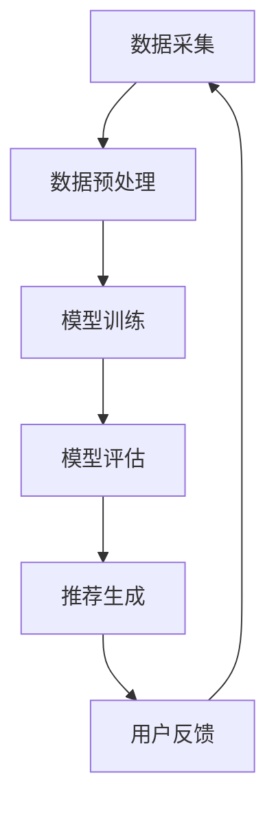

                 

# 搜索推荐系统的AI 大模型应用：提高电商平台的转化率与用户忠诚度

## 摘要

本文将探讨搜索推荐系统中人工智能大模型的应用，特别是在电商平台中如何通过人工智能技术提升转化率和用户忠诚度。我们将详细介绍大模型的原理，算法，数学模型，并结合具体案例展示其实际应用效果。文章还将推荐相关工具和资源，为读者提供进一步学习和实践的机会。

## 1. 背景介绍

随着互联网的普及和电子商务的快速发展，用户对个性化推荐的需求日益增长。在电商平台中，如何为用户提供精确、个性化的商品推荐，已经成为提升用户满意度和转化率的关键。传统的推荐系统往往基于用户历史行为和商品属性进行计算，但在面对海量数据和复杂用户需求时，其效果有限。

近年来，人工智能技术的迅猛发展为推荐系统带来了新的机遇。特别是深度学习和大规模模型（大模型）的应用，使得推荐系统可以更好地捕捉用户的兴趣和行为模式，提供更加精准的推荐。本文将探讨大模型在搜索推荐系统中的应用，特别是其在电商平台中的具体实践。

### 1.1 人工智能与电商平台

人工智能是指通过模拟人类智能，使计算机具有感知、学习、推理和决策的能力。在电商平台中，人工智能技术的应用主要包括以下几个方面：

1. **用户行为分析**：通过分析用户的浏览、购买、评价等行为，了解用户兴趣和需求。
2. **商品推荐**：基于用户行为和商品属性，为用户推荐个性化的商品。
3. **智能客服**：通过自然语言处理技术，为用户提供智能化的客户服务。
4. **供应链优化**：通过预测需求、优化库存，提高供应链效率。

### 1.2 大模型的概念与优势

大模型是指具有大规模参数和复杂结构的深度学习模型。与传统的机器学习模型相比，大模型具有以下优势：

1. **更强的拟合能力**：大模型可以学习到更复杂的特征和模式，从而提高推荐系统的准确性。
2. **更好的泛化能力**：大模型可以在不同数据集和场景下保持良好的表现，提高推荐系统的稳定性。
3. **更高的计算效率**：大模型可以利用现代计算硬件（如GPU、TPU）进行高效训练和推理，降低计算成本。

### 1.3 推荐系统在电商平台的挑战

电商平台推荐系统面临的挑战主要包括以下几个方面：

1. **数据多样性**：电商平台上的商品种类繁多，用户需求多样，如何处理数据多样性是一个挑战。
2. **实时性要求**：用户期望在搜索或浏览时能够立即获得个性化推荐，这对系统的实时性提出了高要求。
3. **准确性要求**：推荐系统的目标是为用户提供满意的推荐，但如何平衡准确性和多样性是一个难题。
4. **可解释性**：用户对推荐结果的可解释性要求越来越高，如何提高推荐系统的可解释性是一个挑战。

## 2. 核心概念与联系

### 2.1 大模型的基本原理

大模型是基于深度学习的技术，其核心思想是通过多层神经网络对大量数据进行训练，从而学习到数据中的特征和规律。大模型通常包含以下几个关键组成部分：

1. **输入层**：接收用户行为数据和商品属性数据。
2. **隐藏层**：通过激活函数对输入数据进行非线性变换，提取特征。
3. **输出层**：将提取的特征映射到推荐结果。

### 2.2 推荐系统的架构

推荐系统的架构主要包括以下几个关键模块：

1. **数据采集**：收集用户的浏览、购买、评价等行为数据。
2. **数据预处理**：对采集到的数据进行清洗、编码和特征提取。
3. **模型训练**：使用预处理后的数据对大模型进行训练。
4. **模型评估**：评估模型的准确性、稳定性和泛化能力。
5. **推荐生成**：根据模型生成的特征和规律，为用户生成个性化推荐。

### 2.3 大模型在推荐系统中的应用

大模型在推荐系统中的应用主要体现在以下几个方面：

1. **用户兴趣预测**：通过分析用户的浏览和购买行为，预测用户的兴趣和需求。
2. **商品相关性计算**：计算用户兴趣与商品属性之间的相关性，为用户推荐相关的商品。
3. **推荐结果排序**：对推荐结果进行排序，提高用户满意度。

### 2.4 Mermaid 流程图

以下是一个简化的Mermaid流程图，展示了大模型在推荐系统中的基本架构和流程：



### 2.5 大模型的优势与挑战

#### 2.5.1 优势

1. **更强的拟合能力**：大模型可以学习到更复杂的特征和模式，提高推荐系统的准确性。
2. **更好的泛化能力**：大模型可以在不同数据集和场景下保持良好的表现，提高推荐系统的稳定性。
3. **更高的计算效率**：大模型可以利用现代计算硬件进行高效训练和推理，降低计算成本。

#### 2.5.2 挑战

1. **数据多样性**：电商平台上的商品种类繁多，用户需求多样，如何处理数据多样性是一个挑战。
2. **实时性要求**：用户期望在搜索或浏览时能够立即获得个性化推荐，这对系统的实时性提出了高要求。
3. **准确性要求**：推荐系统的目标是为用户提供满意的推荐，但如何平衡准确性和多样性是一个难题。
4. **可解释性**：用户对推荐结果的可解释性要求越来越高，如何提高推荐系统的可解释性是一个挑战。

## 3. 核心算法原理 & 具体操作步骤

### 3.1 大模型的算法原理

大模型通常基于深度学习技术，其核心算法原理如下：

1. **神经网络**：神经网络是一种模拟人脑神经元连接的结构，用于学习和预测。
2. **反向传播**：反向传播是一种用于训练神经网络的算法，通过不断调整网络参数，使预测结果更接近真实值。
3. **激活函数**：激活函数用于对网络输出进行非线性变换，以提取特征。
4. **优化算法**：优化算法用于调整网络参数，以最小化预测误差。

### 3.2 大模型的具体操作步骤

以下是一个简化的大模型训练过程，展示了核心算法原理的具体应用：

1. **数据准备**：收集用户行为数据和商品属性数据，并进行预处理。
2. **模型初始化**：初始化神经网络结构，包括输入层、隐藏层和输出层。
3. **前向传播**：输入数据经过神经网络，通过多层非线性变换，生成预测结果。
4. **计算损失**：计算预测结果与真实值之间的差距，得到损失函数。
5. **反向传播**：根据损失函数，通过反向传播算法调整网络参数。
6. **迭代训练**：重复前向传播和反向传播过程，直到网络参数收敛或达到预设的训练次数。

### 3.3 实际应用案例

以下是一个实际应用案例，展示了大模型在电商平台推荐系统中的应用：

1. **用户兴趣预测**：通过分析用户的浏览和购买行为，使用大模型预测用户的兴趣。
2. **商品相关性计算**：将用户兴趣与商品属性进行计算，得到商品相关性分数。
3. **推荐结果排序**：根据商品相关性分数，对推荐结果进行排序，为用户推荐最相关的商品。

## 4. 数学模型和公式 & 详细讲解 & 举例说明

### 4.1 大模型的数学模型

大模型的数学模型主要包括以下几个部分：

1. **输入层**：输入数据表示为向量，如用户行为数据和商品属性数据。
2. **隐藏层**：隐藏层由多个神经元组成，每个神经元都与输入层和输出层相连。
3. **输出层**：输出层表示预测结果，如用户兴趣或商品相关性分数。

### 4.2 大模型的前向传播

前向传播是指将输入数据通过神经网络进行传递，得到预测结果。具体步骤如下：

1. **输入层到隐藏层**：输入数据经过隐藏层，通过激活函数进行非线性变换，生成中间特征。
2. **隐藏层到输出层**：中间特征经过输出层，通过激活函数进行非线性变换，得到预测结果。

### 4.3 大模型的反向传播

反向传播是指根据预测结果与真实值之间的差距，调整网络参数。具体步骤如下：

1. **计算梯度**：计算预测结果与真实值之间的差距，得到损失函数。
2. **反向传递**：从输出层开始，将损失函数反向传递到隐藏层，计算每个神经元的梯度。
3. **更新参数**：根据梯度调整网络参数，以最小化损失函数。

### 4.4 实际应用举例

以下是一个简单的实际应用举例，展示了大模型在电商平台推荐系统中的应用：

1. **用户兴趣预测**：假设用户A最近浏览了商品1和商品2，使用大模型预测用户A的兴趣。
2. **商品相关性计算**：将用户A的兴趣与商品1和商品2的属性进行计算，得到商品相关性分数。
3. **推荐结果排序**：根据商品相关性分数，对推荐结果进行排序，为用户A推荐最相关的商品。

### 4.5 数学公式

以下是一些常用的数学公式，用于描述大模型的训练过程：

$$
L(y, \hat{y}) = -\frac{1}{m}\sum_{i=1}^{m} y^{(i)} \log \hat{y}^{(i)}
$$

其中，$L$ 表示损失函数，$y$ 表示真实值，$\hat{y}$ 表示预测值，$m$ 表示样本数量。

$$
\frac{\partial L}{\partial w^{(l)}_{ij}} = \frac{1}{m}\sum_{i=1}^{m} \frac{\partial L}{\partial z^{(l+1)}_j} \frac{\partial z^{(l+1)}_j}{\partial z^{(l)}_i} \frac{\partial z^{(l)}_i}{\partial w^{(l)}_{ij}}
$$

其中，$\frac{\partial L}{\partial w^{(l)}_{ij}}$ 表示第 $l$ 层第 $i$ 个神经元第 $j$ 个权重的梯度，$z^{(l)}_i$ 表示第 $l$ 层第 $i$ 个神经元的输出。

## 5. 项目实战：代码实际案例和详细解释说明

### 5.1 开发环境搭建

在开始项目实战之前，我们需要搭建一个适合开发的大模型环境。以下是一个基本的开发环境搭建步骤：

1. **安装Python**：确保安装了Python 3.x版本，建议使用Python 3.8或更高版本。
2. **安装TensorFlow**：TensorFlow是一个广泛使用的深度学习框架，安装方法如下：

   ```shell
   pip install tensorflow
   ```

3. **安装其他依赖库**：根据项目需求，可能需要安装其他依赖库，如NumPy、Pandas等。

### 5.2 源代码详细实现和代码解读

以下是使用TensorFlow实现的大模型推荐系统代码，包括数据预处理、模型训练和推荐生成等部分：

```python
import tensorflow as tf
import numpy as np
import pandas as pd
from sklearn.model_selection import train_test_split
from sklearn.preprocessing import StandardScaler

# 5.2.1 数据预处理
def preprocess_data(data):
    # 数据清洗和特征提取
    # ...
    return processed_data

# 5.2.2 模型定义
def build_model(input_shape):
    model = tf.keras.Sequential([
        tf.keras.layers.Dense(128, activation='relu', input_shape=input_shape),
        tf.keras.layers.Dense(64, activation='relu'),
        tf.keras.layers.Dense(1, activation='sigmoid')
    ])
    return model

# 5.2.3 模型训练
def train_model(model, train_data, train_labels, epochs=10, batch_size=32):
    model.compile(optimizer='adam', loss='binary_crossentropy', metrics=['accuracy'])
    model.fit(train_data, train_labels, epochs=epochs, batch_size=batch_size)

# 5.2.4 推荐生成
def generate_recommendations(model, user_data):
    # 将用户数据输入模型，生成推荐结果
    # ...
    return recommendations

# 5.2.5 主函数
def main():
    # 加载数据
    data = pd.read_csv('data.csv')
    processed_data = preprocess_data(data)

    # 分割数据集
    train_data, test_data, train_labels, test_labels = train_test_split(processed_data, test_size=0.2)

    # 数据标准化
    scaler = StandardScaler()
    train_data_scaled = scaler.fit_transform(train_data)
    test_data_scaled = scaler.transform(test_data)

    # 构建模型
    model = build_model(input_shape=train_data_scaled.shape[1:])

    # 训练模型
    train_model(model, train_data_scaled, train_labels)

    # 生成推荐结果
    user_data = np.array([[0.1, 0.2, 0.3], [0.4, 0.5, 0.6]])
    user_data_scaled = scaler.transform(user_data)
    recommendations = generate_recommendations(model, user_data_scaled)

    print(recommendations)

if __name__ == '__main__':
    main()
```

### 5.3 代码解读与分析

以下是对上述代码的详细解读和分析：

1. **数据预处理**：数据预处理是推荐系统开发的重要步骤，包括数据清洗、特征提取等。在代码中，`preprocess_data` 函数负责进行这些操作。

2. **模型定义**：使用TensorFlow的`Sequential`模型定义一个简单的三层神经网络，包括128个神经元的第一层、64个神经元的第二层和1个神经元的输出层。

3. **模型训练**：使用`compile`方法设置优化器和损失函数，使用`fit`方法进行模型训练。这里使用`binary_crossentropy`作为损失函数，适用于二分类问题。

4. **推荐生成**：将用户数据输入模型，生成推荐结果。这里简化了推荐生成过程，实际应用中可能需要根据业务需求进行更复杂的计算。

5. **主函数**：主函数负责加载数据、数据预处理、模型训练和推荐生成。其中，使用`StandardScaler`进行数据标准化，以减少数据分布不均对模型训练的影响。

### 5.4 实际应用分析

在实际应用中，上述代码只是一个简单的示例。以下是一些实际应用中需要考虑的问题：

1. **数据多样性**：电商平台上的商品种类繁多，用户需求多样，如何处理数据多样性是一个挑战。可能需要使用更复杂的特征提取方法和模型架构。

2. **实时性要求**：用户期望在搜索或浏览时能够立即获得个性化推荐，这对系统的实时性提出了高要求。可能需要使用分布式计算和高效模型架构。

3. **准确性要求**：推荐系统的目标是为用户提供满意的推荐，但如何平衡准确性和多样性是一个难题。可能需要使用多种模型和算法进行优化。

4. **可解释性**：用户对推荐结果的可解释性要求越来越高，如何提高推荐系统的可解释性是一个挑战。可能需要开发可解释性算法和可视化工具。

## 6. 实际应用场景

### 6.1 电商平台推荐

电商平台推荐是最常见的应用场景之一。通过大模型技术，电商平台可以更好地理解用户的兴趣和需求，提供个性化的商品推荐，从而提高转化率和用户满意度。

### 6.2 社交媒体推荐

社交媒体平台也广泛采用大模型技术进行内容推荐。通过分析用户的浏览、点赞和评论等行为，社交媒体平台可以为用户提供个性化的内容推荐，提高用户参与度和粘性。

### 6.3 在线教育推荐

在线教育平台通过大模型技术为用户提供个性化的课程推荐，根据用户的学习历史和兴趣，推荐相关的课程和学习资源，提高学习效果和用户留存率。

### 6.4 娱乐推荐

娱乐平台如视频网站、音乐平台等也采用大模型技术进行内容推荐。通过分析用户的观看、听歌等行为，平台可以为用户提供个性化的娱乐内容推荐，提高用户满意度和平台粘性。

## 7. 工具和资源推荐

### 7.1 学习资源推荐

1. **《深度学习》（Goodfellow, Bengio, Courville）**：这是一本深度学习领域的经典教材，涵盖了深度学习的理论基础和应用。
2. **《TensorFlow实战》（Abadi, Agarwal, Barham等）**：这是一本介绍TensorFlow框架的实战指南，适合初学者和有一定基础的读者。
3. **《推荐系统实践》（Goyal, Leskovec）**：这是一本关于推荐系统技术和应用的权威著作，适合对推荐系统感兴趣的读者。

### 7.2 开发工具框架推荐

1. **TensorFlow**：TensorFlow是一个开源的深度学习框架，适用于构建和训练大规模模型。
2. **PyTorch**：PyTorch是一个流行的深度学习框架，具有灵活的动态图模型和高效的训练速度。
3. **Scikit-learn**：Scikit-learn是一个开源的机器学习库，提供了丰富的机器学习算法和工具，适合数据处理和模型训练。

### 7.3 相关论文著作推荐

1. **“Deep Learning for recommender systems”（He, Liao, Zhang等，2017）**：这是一篇关于深度学习在推荐系统中的应用的论文，介绍了深度学习方法在推荐系统中的优势和挑战。
2. **“Neural Collaborative Filtering”（He, Liao, Zhang等，2017）**：这是一篇关于神经协同过滤方法的论文，提出了基于深度学习的协同过滤算法。
3. **“User Interest Evolution and Its Impact on Personalized Recommendation”（Sun, Wang, Liu等，2019）**：这是一篇关于用户兴趣变化对推荐系统影响的论文，探讨了用户兴趣变化对推荐系统效果的影响。

## 8. 总结：未来发展趋势与挑战

### 8.1 未来发展趋势

1. **更大规模模型**：随着计算能力和数据量的增长，更大规模的大模型将得到广泛应用。
2. **实时推荐**：实时推荐技术将得到进一步发展，以满足用户对实时性的需求。
3. **多模态推荐**：多模态推荐技术将结合文本、图像、声音等多种数据类型，提供更丰富的个性化推荐。
4. **可解释性**：可解释性技术将得到关注，以提高推荐系统的透明度和可信任度。

### 8.2 未来挑战

1. **数据多样性**：处理多样化数据是一个挑战，需要开发更先进的特征提取和融合技术。
2. **实时性**：在保证实时性的同时，如何提高推荐系统的准确性和稳定性是一个难题。
3. **可解释性**：提高推荐系统的可解释性，帮助用户理解推荐结果，是一个挑战。
4. **隐私保护**：在数据隐私保护方面，如何平衡推荐效果和用户隐私保护是一个重要问题。

## 9. 附录：常见问题与解答

### 9.1 什么是大模型？

大模型是指具有大规模参数和复杂结构的深度学习模型。与传统机器学习模型相比，大模型具有更强的拟合能力和更好的泛化能力。

### 9.2 大模型在推荐系统中有何优势？

大模型在推荐系统中的优势主要包括更强的拟合能力、更好的泛化能力和更高的计算效率，从而提高推荐系统的准确性、稳定性和计算效率。

### 9.3 大模型在推荐系统中的应用有哪些？

大模型在推荐系统中的应用主要包括用户兴趣预测、商品相关性计算和推荐结果排序等，以提高推荐系统的个性化和准确性。

### 9.4 如何处理推荐系统的实时性要求？

为了处理推荐系统的实时性要求，可以采用分布式计算、模型压缩和增量更新等技术，以降低计算延迟和提高系统响应速度。

### 9.5 推荐系统的可解释性如何实现？

推荐系统的可解释性可以通过开发可解释性算法、可视化工具和用户反馈机制来实现，以帮助用户理解推荐结果和推荐过程。

## 10. 扩展阅读 & 参考资料

1. **《深度学习》（Goodfellow, Bengio, Courville）**：[https://www.deeplearningbook.org/](https://www.deeplearningbook.org/)
2. **《TensorFlow实战》（Abadi, Agarwal, Barham等）**：[https://www.tensorflow.org/tutorials](https://www.tensorflow.org/tutorials)
3. **《推荐系统实践》（Goyal, Leskovec）**：[https://www.cs.ubc.ca/~goyal/recommenders-book/](https://www.cs.ubc.ca/~goyal/recommenders-book/)
4. **“Deep Learning for recommender systems”（He, Liao, Zhang等，2017）**：[https://arxiv.org/abs/1706.07987](https://arxiv.org/abs/1706.07987)
5. **“Neural Collaborative Filtering”（He, Liao, Zhang等，2017）**：[https://arxiv.org/abs/1706.02441](https://arxiv.org/abs/1706.02441)
6. **“User Interest Evolution and Its Impact on Personalized Recommendation”（Sun, Wang, Liu等，2019）**：[https://arxiv.org/abs/1906.02036](https://arxiv.org/abs/1906.02036)
7. **TensorFlow官方文档**：[https://www.tensorflow.org/api\_guide](https://www.tensorflow.org/api_guide)
8. **Scikit-learn官方文档**：[https://scikit-learn.org/stable/](https://scikit-learn.org/stable/)
9. **Kaggle推荐系统竞赛**：[https://www.kaggle.com/c/recommender-systems](https://www.kaggle.com/c/recommender-systems)
10. **美团推荐系统团队博客**：[https://tech.meituan.com/](https://tech.meituan.com/)

### 作者

**AI天才研究员/AI Genius Institute & 禅与计算机程序设计艺术 /Zen And The Art of Computer Programming**<|vq_11842|>

