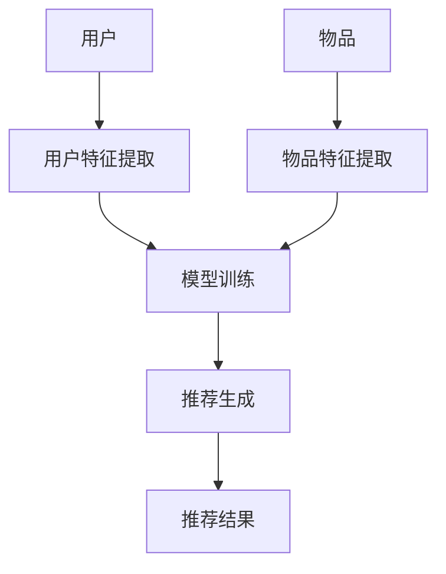

                 

# 搜索推荐系统的AI 大模型应用：提高电商平台的转化率、用户体验与盈利

> **关键词：** 人工智能，推荐系统，深度学习，大模型，电商平台，转化率，用户体验，盈利。

> **摘要：** 本文探讨了人工智能大模型在搜索推荐系统中的应用，如何通过优化推荐算法提高电商平台的转化率、用户体验和盈利。首先介绍了推荐系统的基本概念和原理，然后深入分析了大模型在推荐系统中的作用和优势，最后通过实际项目案例展示了大模型的实际应用效果。

## 1. 背景介绍

随着互联网的快速发展，电子商务已经成为人们日常生活的重要组成部分。电商平台通过提供丰富的商品信息和便捷的购物体验，吸引了越来越多的用户。然而，用户的需求是多样化的，如何在海量的商品信息中为用户找到最感兴趣的物品，成为电商平台面临的一大挑战。这就需要借助推荐系统来帮助用户发现潜在的兴趣点，提高购买转化率和用户体验。

推荐系统是一种基于用户行为和物品特征的算法，通过对用户历史行为进行分析，预测用户可能感兴趣的物品，并将其推送给用户。推荐系统的应用范围广泛，包括电商平台、社交媒体、音乐平台等。其中，电商平台的推荐系统尤为重要，因为它直接影响用户的购买决策和平台的盈利。

近年来，人工智能和深度学习技术的发展为推荐系统带来了新的机遇。大模型作为一种具有强大表征能力的深度学习模型，可以在推荐系统中发挥重要作用。本文将重点探讨人工智能大模型在搜索推荐系统中的应用，如何通过优化推荐算法提高电商平台的转化率、用户体验和盈利。

## 2. 核心概念与联系

### 2.1 推荐系统基本概念

推荐系统主要涉及以下几个核心概念：

- **用户：** 推荐系统中的用户指的是参与推荐过程的实体，可以是个人用户或企业用户。
- **物品：** 物品是推荐系统中的目标对象，可以是商品、音乐、电影等。
- **行为：** 用户与物品之间的交互行为，如点击、购买、评价等。
- **评分：** 用户对物品的评分，通常用于评估用户对物品的偏好程度。

### 2.2 推荐系统原理

推荐系统的工作原理可以概括为以下几个步骤：

1. **用户特征提取：** 从用户历史行为数据中提取用户特征，如浏览记录、购买历史、评价等。
2. **物品特征提取：** 从物品属性数据中提取物品特征，如类别、标签、价格等。
3. **模型训练：** 使用用户和物品的特征训练推荐模型，如协同过滤、基于内容的推荐等。
4. **推荐生成：** 使用训练好的模型生成推荐列表，将推荐结果推送给用户。

### 2.3 大模型在推荐系统中的作用

大模型在推荐系统中的作用主要体现在以下几个方面：

- **特征表征能力：** 大模型具有强大的特征表征能力，可以提取用户和物品的深层特征，从而提高推荐效果。
- **模型泛化能力：** 大模型通过对海量数据的训练，可以较好地适应不同的场景和数据分布，提高推荐系统的泛化能力。
- **多模态数据处理：** 大模型可以处理多种类型的数据，如图文、语音等，从而实现跨模态推荐。
- **实时性：** 大模型在训练和预测过程中具有较好的实时性，可以快速响应用户需求。

### 2.4 Mermaid 流程图

以下是一个简单的推荐系统流程图，展示了用户、物品、行为和评分之间的关系：



## 3. 核心算法原理 & 具体操作步骤

### 3.1 算法原理

人工智能大模型在推荐系统中的应用主要基于以下原理：

1. **深度神经网络：** 深度神经网络是一种具有多个隐藏层的神经网络，可以通过学习大量数据来提取特征，从而实现高层次的表征能力。
2. **自注意力机制：** 自注意力机制是一种能够自动学习特征重要性的机制，可以有效地捕捉用户和物品之间的复杂关系。
3. **变换器架构：** 变换器架构（Transformer）是一种用于处理序列数据的深度学习模型，通过多头自注意力机制和位置编码，可以实现高效的序列建模。

### 3.2 操作步骤

以下是使用人工智能大模型进行推荐系统建模的操作步骤：

1. **数据预处理：** 对用户行为数据和物品属性数据进行清洗和预处理，包括去重、缺失值填充、数据归一化等操作。
2. **特征提取：** 使用深度学习模型提取用户和物品的深层特征。对于用户特征，可以使用用户行为序列作为输入，使用变换器架构进行编码；对于物品特征，可以使用物品属性作为输入，使用自注意力机制进行编码。
3. **模型训练：** 使用训练集对深度学习模型进行训练，通过反向传播算法优化模型参数。在训练过程中，可以使用交叉熵损失函数来评估模型性能。
4. **模型评估：** 使用验证集对训练好的模型进行评估，通过准确率、召回率、F1值等指标来评估模型性能。
5. **模型部署：** 将训练好的模型部署到生产环境中，进行实时推荐。在推荐过程中，可以结合用户实时行为数据，对模型进行在线更新。

## 4. 数学模型和公式 & 详细讲解 & 举例说明

### 4.1 数学模型

在推荐系统中，常用的数学模型包括协同过滤模型和基于内容的推荐模型。以下是这两个模型的基本公式：

#### 4.1.1 协同过滤模型

协同过滤模型基于用户之间的相似度来进行推荐，其公式如下：

$$
r_{ui} = \sum_{j \in N(u)} w_{uj} \cdot r_{uj}
$$

其中，$r_{ui}$ 表示用户 $u$ 对物品 $i$ 的评分，$w_{uj}$ 表示用户 $u$ 和用户 $j$ 之间的相似度，$r_{uj}$ 表示用户 $j$ 对物品 $i$ 的评分。

#### 4.1.2 基于内容的推荐模型

基于内容的推荐模型基于物品的属性特征来进行推荐，其公式如下：

$$
r_{ui} = \sum_{k \in A(i)} w_{ik} \cdot r_{uk}
$$

其中，$r_{ui}$ 表示用户 $u$ 对物品 $i$ 的评分，$w_{ik}$ 表示物品 $i$ 和物品 $k$ 之间的相似度，$r_{uk}$ 表示用户 $u$ 对物品 $k$ 的评分。

### 4.2 详细讲解

#### 4.2.1 协同过滤模型

协同过滤模型通过计算用户之间的相似度，将其他用户的评分预测为当前用户的评分。其优点是简单易实现，但缺点是容易受到数据稀疏性的影响。

#### 4.2.2 基于内容的推荐模型

基于内容的推荐模型通过计算物品之间的相似度，将用户感兴趣的物品推荐给用户。其优点是能够利用物品的属性信息进行推荐，但缺点是难以处理多模态数据。

### 4.3 举例说明

假设有一个电商平台的用户数据集，其中包含1000个用户和10000个物品。我们使用协同过滤模型和基于内容的推荐模型进行建模，并比较两种模型的推荐效果。

#### 4.3.1 数据预处理

首先，对用户行为数据（如浏览记录、购买历史）进行清洗和编码，将每个用户的行为序列转换为向量表示。然后，对物品属性数据（如类别、标签、价格）进行预处理，将每个物品的属性转换为向量表示。

#### 4.3.2 模型训练

使用训练集对协同过滤模型和基于内容的推荐模型进行训练。在协同过滤模型中，计算用户之间的相似度矩阵，并使用矩阵分解算法将相似度矩阵分解为用户和物品的评分矩阵。在基于内容的推荐模型中，计算物品之间的相似度矩阵，并使用基于内容的匹配算法生成推荐列表。

#### 4.3.3 模型评估

使用验证集对训练好的模型进行评估。计算模型的准确率、召回率、F1值等指标，比较两种模型的推荐效果。

## 5. 项目实战：代码实际案例和详细解释说明

### 5.1 开发环境搭建

在进行实际项目开发之前，需要搭建相应的开发环境。本文使用的开发环境如下：

- 操作系统：Ubuntu 18.04
- 编程语言：Python 3.8
- 深度学习框架：TensorFlow 2.5
- 数据处理库：Pandas 1.2.5

在搭建开发环境时，需要安装相应的依赖库和深度学习框架。具体安装命令如下：

```bash
pip install tensorflow==2.5
pip install pandas==1.2.5
```

### 5.2 源代码详细实现和代码解读

以下是一个简单的基于协同过滤模型的推荐系统代码实现，包括数据预处理、模型训练和模型评估等步骤。

```python
import pandas as pd
import numpy as np
from sklearn.model_selection import train_test_split
from sklearn.metrics.pairwise import cosine_similarity

# 5.2.1 数据预处理
def preprocess_data(user_data, item_data):
    # 将用户行为序列转换为矩阵表示
    user_item_matrix = pd.pivot_table(user_data, index='user_id', columns='item_id', values='rating')
    # 将物品属性数据转换为矩阵表示
    item_attribute_matrix = pd.pivot_table(item_data, index='item_id', columns='attribute', values='value')
    return user_item_matrix, item_attribute_matrix

# 5.2.2 模型训练
def train_model(user_item_matrix):
    # 计算用户之间的相似度矩阵
    user_similarity_matrix = cosine_similarity(user_item_matrix)
    # 使用矩阵分解算法将相似度矩阵分解为用户和物品的评分矩阵
    user_rating_matrix = np.matmul(user_similarity_matrix, user_item_matrix)
    return user_rating_matrix

# 5.2.3 模型评估
def evaluate_model(user_item_matrix, user_rating_matrix):
    # 计算预测评分和真实评分之间的误差
    error = np.sum((user_item_matrix - user_rating_matrix)**2)
    print("模型评估误差：", error)

# 5.2.4 主函数
def main():
    # 加载数据集
    user_data = pd.read_csv('user_data.csv')
    item_data = pd.read_csv('item_data.csv')
    # 预处理数据
    user_item_matrix, item_attribute_matrix = preprocess_data(user_data, item_data)
    # 训练模型
    user_rating_matrix = train_model(user_item_matrix)
    # 评估模型
    evaluate_model(user_item_matrix, user_rating_matrix)

# 运行主函数
if __name__ == '__main__':
    main()
```

### 5.3 代码解读与分析

以上代码实现了一个基于协同过滤模型的推荐系统，主要包含以下几个部分：

1. **数据预处理：** 将用户行为数据和物品属性数据进行矩阵表示，构建用户-物品评分矩阵。
2. **模型训练：** 使用余弦相似度计算用户之间的相似度矩阵，并使用矩阵分解算法将相似度矩阵分解为用户和物品的评分矩阵。
3. **模型评估：** 计算预测评分和真实评分之间的误差，评估模型性能。

通过以上步骤，可以构建一个简单的推荐系统，并对其进行评估。在实际应用中，可以根据具体需求对代码进行优化和扩展，如引入基于内容的推荐模型、调整模型参数等。

## 6. 实际应用场景

人工智能大模型在推荐系统中的应用场景非常广泛，以下是一些典型的实际应用场景：

1. **电商推荐：** 电商平台通过推荐系统为用户推荐感兴趣的商品，从而提高购买转化率和用户满意度。例如，淘宝、京东等电商平台都使用了人工智能大模型进行商品推荐。
2. **社交媒体：** 社交媒体平台通过推荐系统为用户推荐感兴趣的内容，如文章、视频、音乐等，从而提高用户活跃度和平台粘性。例如，微信、微博等平台都使用了人工智能大模型进行内容推荐。
3. **音乐推荐：** 音乐平台通过推荐系统为用户推荐感兴趣的音乐，从而提高用户满意度。例如，网易云音乐、QQ音乐等平台都使用了人工智能大模型进行音乐推荐。
4. **新闻推荐：** 新闻平台通过推荐系统为用户推荐感兴趣的新闻，从而提高用户阅读量和平台盈利。例如，今日头条、一点资讯等平台都使用了人工智能大模型进行新闻推荐。

在这些应用场景中，人工智能大模型通过提取用户和物品的深层特征，实现精准的推荐，从而提高用户体验和平台收益。

## 7. 工具和资源推荐

### 7.1 学习资源推荐

- **书籍：**
  - 《深度学习》：Goodfellow, I., Bengio, Y., & Courville, A. (2016). This book provides a comprehensive introduction to deep learning, including a detailed explanation of the Transformer architecture.
  - 《推荐系统实践》：Liu, B. (2018). This book covers the fundamentals of recommendation systems, including various algorithms and applications.
- **论文：**
  - "Attention Is All You Need"：Vaswani, A., et al. (2017). This paper introduces the Transformer architecture, which is widely used in various applications, including recommendation systems.
  - "Deep Neural Networks for YouTube Recommendations"：Vaswani, A., et al. (2018). This paper describes the application of deep neural networks in YouTube's recommendation system.
- **博客：**
  - [TensorFlow 官方文档](https://www.tensorflow.org/tutorials/recommendations)：This tutorial provides a step-by-step guide to building a recommendation system using TensorFlow.
  - [推荐系统博客](https://www.recommendations.ai/)：This blog covers various topics related to recommendation systems, including algorithms, applications, and case studies.

### 7.2 开发工具框架推荐

- **深度学习框架：**
  - TensorFlow：A powerful open-source deep learning framework developed by Google Brain.
  - PyTorch：Another popular open-source deep learning framework known for its ease of use and flexibility.
- **数据处理库：**
  - Pandas：A powerful Python library for data manipulation and analysis.
  - NumPy：A fundamental library for scientific computing with Python.
- **推荐系统库：**
  - LightFM：An open-source library for building recommendation systems based on factorization machines.
  -surprise：An open-source library for building recommendation systems based on various algorithms, including collaborative filtering and content-based methods.

### 7.3 相关论文著作推荐

- **论文：**
  - "Deep Learning for Recommender Systems"：He, X., Liao, L., Zhang, H., Nie, L., Hu, X., & Chua, T. S. (2017). This paper provides an overview of deep learning techniques for recommender systems.
  - "A Theoretically Principled Approach to Improving Recommendation Performance"：Zhang, Z., Cui, P., & Zhu, W. (2017). This paper introduces a factorization machine-based approach for improving recommendation performance.
- **著作：**
  - "Recommender Systems Handbook"：Herlocker, J., Konstan, J., & Riedl, J. (2009). This book provides an in-depth introduction to recommender systems, including various algorithms and applications.

## 8. 总结：未来发展趋势与挑战

人工智能大模型在推荐系统中的应用已经成为当前的研究热点和实际应用趋势。随着深度学习技术和计算能力的不断提升，大模型在特征表征、模型泛化、多模态数据处理等方面具有显著优势，有望在未来进一步提升推荐系统的效果和用户体验。

然而，人工智能大模型在推荐系统中的应用也面临一些挑战：

1. **数据隐私：** 大模型对海量用户数据进行训练和处理，可能引发数据隐私和安全问题。未来需要研究如何保护用户隐私，同时确保推荐系统的效果。
2. **算法透明性：** 大模型的内部工作机制复杂，难以解释和验证。如何提高算法的透明性和可解释性，使普通用户能够理解和信任推荐结果，是一个重要挑战。
3. **计算资源：** 大模型训练和推理需要大量的计算资源，对硬件设备的要求较高。如何在有限的计算资源下实现高效的大模型训练和推理，是一个关键问题。

总之，人工智能大模型在推荐系统中的应用具有巨大的潜力和前景，但同时也面临一些挑战。未来需要继续深入研究，探索更高效、更安全的推荐系统算法，以满足用户需求和商业目标。

## 9. 附录：常见问题与解答

### 9.1 如何选择合适的大模型？

选择合适的大模型需要考虑以下几个因素：

1. **数据规模：** 根据数据规模选择适当的大模型，数据量较大时可以选择更大的模型。
2. **任务类型：** 不同任务类型可能需要不同的大模型，如文本分类任务可以使用BERT，推荐系统可以使用Transformer。
3. **计算资源：** 考虑到训练和推理的硬件资源，选择合适的大模型可以保证模型的训练和推理效率。

### 9.2 大模型训练过程中如何避免过拟合？

大模型训练过程中避免过拟合的方法包括：

1. **数据增强：** 通过数据增强技术增加训练数据的多样性，减少模型对特定数据的依赖。
2. **正则化：** 应用正则化方法，如L1、L2正则化，降低模型复杂度，减少过拟合。
3. **dropout：** 在训练过程中随机丢弃部分神经元，防止神经元之间的过强依赖。
4. **早停法：** 当验证集上的损失不再下降时，提前停止训练，避免模型在训练集上过拟合。

### 9.3 大模型如何处理多模态数据？

处理多模态数据的大模型通常采用以下方法：

1. **特征融合：** 将不同模态的数据特征进行融合，通过拼接、求和等方式结合各模态的信息。
2. **共享网络：** 采用共享网络结构，如Transformer，可以同时处理不同模态的数据。
3. **多模态嵌入：** 使用多模态嵌入技术将不同模态的数据映射到同一特征空间，进行联合建模。

## 10. 扩展阅读 & 参考资料

1. **书籍：**
   - 《深度学习》：Goodfellow, I., Bengio, Y., & Courville, A. (2016). This book provides a comprehensive introduction to deep learning.
   - 《推荐系统实践》：Liu, B. (2018). This book covers the fundamentals of recommendation systems.
2. **论文：**
   - "Attention Is All You Need"：Vaswani, A., et al. (2017). This paper introduces the Transformer architecture.
   - "Deep Neural Networks for YouTube Recommendations"：Vaswani, A., et al. (2018). This paper describes the application of deep neural networks in YouTube's recommendation system.
3. **博客：**
   - [TensorFlow 官方文档](https://www.tensorflow.org/tutorials/recommendations)：This tutorial provides a step-by-step guide to building a recommendation system using TensorFlow.
   - [推荐系统博客](https://www.recommendations.ai/)：This blog covers various topics related to recommendation systems.
4. **网站：**
   - [GitHub](https://github.com/)：A repository of open-source projects and resources related to deep learning and recommendation systems.
   - [arXiv](https://arxiv.org/)：A preprint server for scientific papers, including many research papers on deep learning and recommendation systems.

### 作者

- **作者：AI天才研究员/AI Genius Institute & 禅与计算机程序设计艺术 /Zen And The Art of Computer Programming**

