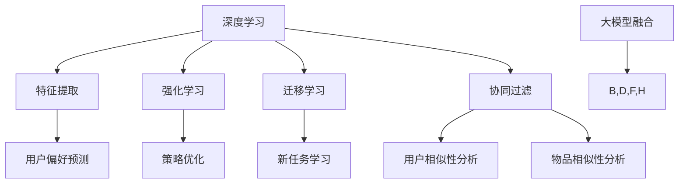

                 

### 背景介绍

搜索推荐系统是现代电商平台提高用户满意度和增加销售量的关键因素。随着互联网和电子商务的快速发展，用户的需求变得越来越多样化，个性化。为了满足这些需求，电商平台必须提供精准的推荐服务，从而提高用户在平台上的活跃度和转化率。

传统的推荐系统主要依赖于用户的历史行为数据，如浏览记录、购买历史等，通过简单的协同过滤算法实现推荐。然而，随着大数据和人工智能技术的发展，越来越多的平台开始采用AI大模型融合技术，以进一步提升推荐系统的效果。

AI大模型融合技术，即通过结合多种人工智能模型和算法，共同构建一个强大的推荐系统。这些模型包括深度学习模型、强化学习模型、迁移学习模型等。通过融合这些模型，推荐系统能够更准确地预测用户偏好，提高推荐的精准度和多样性。

近年来，AI大模型融合技术在电商平台的实际应用中取得了显著的效果。例如，亚马逊、淘宝等大型电商平台已经开始采用这种技术，为用户提供个性化的商品推荐，从而显著提高了用户满意度和销售额。

本文将深入探讨AI大模型融合技术在搜索推荐系统中的应用，包括其核心概念、算法原理、数学模型、实际应用案例以及未来的发展趋势和挑战。

通过本文的阅读，读者将了解：
- AI大模型融合技术在搜索推荐系统中的重要性。
- 核心概念和原理，以及如何构建一个AI大模型融合系统。
- 详细的算法原理和具体操作步骤。
- 数学模型和公式的详细讲解，以及实际应用场景。
- 实际应用中的项目实战，包括开发环境搭建、代码实现和解读。
- 相关的工具和资源推荐，以帮助读者进一步学习和应用。
- 未来发展趋势和挑战，为读者提供方向和启示。

让我们开始这段深入探讨的旅程，一同探索AI大模型融合技术在电商平台搜索推荐系统中的无穷潜力。

### 核心概念与联系

在深入探讨AI大模型融合技术在搜索推荐系统的应用之前，我们需要首先了解一些核心概念和原理，并展示它们之间的联系。这些概念包括深度学习、强化学习、迁移学习、协同过滤等。通过这些概念的理解，我们将能够更好地构建一个高效的AI大模型融合系统。

#### 1. 深度学习

深度学习是人工智能的一个分支，通过构建多层神经网络（Neural Networks）来模拟人脑的学习过程。在搜索推荐系统中，深度学习模型被广泛应用于用户行为分析和偏好预测。例如，我们可以使用深度神经网络（DNN）来提取用户历史行为数据中的特征，从而为用户生成个性化的推荐。

#### 2. 强化学习

强化学习（Reinforcement Learning）是一种通过试错和反馈来学习策略的机器学习技术。在搜索推荐系统中，强化学习可以用于优化推荐策略，使其更加符合用户的实际需求。例如，通过Q-learning算法，推荐系统可以学习到哪种推荐策略能够获得更高的用户满意度。

#### 3. 迁移学习

迁移学习（Transfer Learning）是一种利用已有模型的知识来解决新问题的方法。在搜索推荐系统中，迁移学习可以帮助我们利用已经在其他任务中训练好的模型，快速构建一个高效的推荐系统。例如，我们可以利用预训练的卷积神经网络（CNN）来提取图像特征，从而为用户提供基于图像的个性化推荐。

#### 4. 协同过滤

协同过滤（Collaborative Filtering）是推荐系统中最常用的技术之一，它通过分析用户之间的相似性来进行推荐。协同过滤分为两种类型：基于用户的协同过滤（User-Based）和基于物品的协同过滤（Item-Based）。基于用户的协同过滤通过找到与当前用户相似的其他用户，推荐这些用户喜欢的物品；而基于物品的协同过滤则通过找到与当前物品相似的物品，推荐给用户。

#### 5. 大模型融合

大模型融合（Fusion of Large Models）是将多种人工智能模型和算法结合起来，共同构建一个强大的推荐系统。在搜索推荐系统中，大模型融合可以帮助我们利用不同模型的优势，提高推荐的精准度和多样性。例如，我们可以将深度学习模型用于特征提取，强化学习模型用于策略优化，迁移学习模型用于新任务的学习，协同过滤模型用于用户和物品相似性的分析。

#### Mermaid 流程图

下面是一个简单的Mermaid流程图，展示了上述核心概念之间的联系：



通过上述流程图，我们可以看到，深度学习、强化学习、迁移学习和协同过滤等模型和算法在搜索推荐系统中各自发挥独特的作用，并通过大模型融合技术结合起来，共同构建一个高效的推荐系统。

### 核心算法原理 & 具体操作步骤

在了解了AI大模型融合技术的基本概念和原理后，接下来我们将深入探讨其核心算法原理和具体操作步骤。AI大模型融合技术主要依赖于以下几个关键组件：深度学习模型、强化学习模型、迁移学习模型和协同过滤模型。每个组件都有其独特的功能和优势，共同协作以提高搜索推荐系统的效果。

#### 1. 深度学习模型

深度学习模型是AI大模型融合技术的核心组件之一，主要用于用户行为分析和偏好预测。以下是一个基于深度学习模型的搜索推荐系统的一般架构：

1. **数据预处理**：首先，对用户行为数据（如浏览记录、购买历史等）进行预处理，包括数据清洗、特征工程和归一化等步骤。这一步的目的是将原始数据转化为可用于训练的格式。
   
2. **特征提取**：使用深度神经网络（如卷积神经网络（CNN）或循环神经网络（RNN））提取用户历史行为数据中的特征。这些特征可以用于后续的用户偏好预测和推荐生成。

3. **用户偏好预测**：通过训练好的深度学习模型，对用户未来的偏好进行预测。预测结果可以用于生成个性化的推荐列表。

具体操作步骤如下：

- **步骤1：数据预处理**
  ```python
  # 数据清洗
  cleaned_data = preprocess_data(raw_data)
  
  # 特征工程
  features = extract_features(cleaned_data)
  
  # 归一化
  normalized_features = normalize(features)
  ```

- **步骤2：特征提取**
  ```python
  # 使用卷积神经网络提取特征
  cnn_model = CNN()
  extracted_features = cnn_model.extract(normalized_features)
  ```

- **步骤3：用户偏好预测**
  ```python
  # 加载训练好的深度学习模型
  model = load_pretrained_model('path/to/model')
  
  # 预测用户偏好
  user_preferences = model.predict(extracted_features)
  ```

#### 2. 强化学习模型

强化学习模型主要用于优化推荐策略，使其更加符合用户的实际需求。以下是一个基于强化学习模型的搜索推荐系统的一般架构：

1. **状态定义**：定义搜索推荐系统中的状态，如用户当前正在浏览的物品、用户历史行为等。

2. **动作定义**：定义推荐系统可以采取的动作，如推荐特定物品、推荐相似物品等。

3. **奖励定义**：定义用户对推荐物品的反馈，如点击、购买等行为，作为奖励。

4. **策略学习**：使用强化学习算法（如Q-learning、SARSA等）学习最优策略。

具体操作步骤如下：

- **步骤1：状态定义**
  ```python
  # 定义状态
  state = get_state(current_item, user_history)
  ```

- **步骤2：动作定义**
  ```python
  # 定义动作
  actions = get_actions(state)
  ```

- **步骤3：奖励定义**
  ```python
  # 定义奖励
  reward = get_reward(user_feedback)
  ```

- **步骤4：策略学习**
  ```python
  # 使用Q-learning算法学习最优策略
  q_values = QLearning(state, actions, reward)
  optimal_policy = q_values.get_optimal_policy()
  ```

#### 3. 迁移学习模型

迁移学习模型主要用于利用已有模型的知识来解决新问题。以下是一个基于迁移学习模型的搜索推荐系统的一般架构：

1. **模型选择**：选择一个在类似任务上已经训练好的模型作为迁移学习的起点。

2. **特征提取**：使用迁移学习模型提取用户历史行为数据中的特征。

3. **模型融合**：将迁移学习模型提取的特征与深度学习模型提取的特征进行融合，用于生成推荐。

具体操作步骤如下：

- **步骤1：模型选择**
  ```python
  # 选择预训练模型
  pretrained_model = load_pretrained_model('path/to/pretrained_model')
  ```

- **步骤2：特征提取**
  ```python
  # 使用迁移学习模型提取特征
  transferred_features = pretrained_model.extract(user_data)
  ```

- **步骤3：模型融合**
  ```python
  # 融合特征
  fused_features = fuse_features(deep_features, transferred_features)
  
  # 生成推荐
  recommendations = generate_recommendations(fused_features)
  ```

#### 4. 协同过滤模型

协同过滤模型主要用于分析用户和物品之间的相似性，以下是一个基于协同过滤模型的搜索推荐系统的一般架构：

1. **用户相似性分析**：通过计算用户之间的相似度，找到与当前用户最相似的其他用户。

2. **物品相似性分析**：通过计算物品之间的相似度，找到与当前物品最相似的物品。

3. **推荐生成**：根据用户相似性和物品相似性，生成个性化的推荐列表。

具体操作步骤如下：

- **步骤1：用户相似性分析**
  ```python
  # 计算用户相似度
  user_similarity = compute_similarity(user_profiles)
  nearest_users = find_nearest_users(user_similarity, current_user)
  ```

- **步骤2：物品相似性分析**
  ```python
  # 计算物品相似度
  item_similarity = compute_similarity(item_profiles)
  nearest_items = find_nearest_items(item_similarity, current_item)
  ```

- **步骤3：推荐生成**
  ```python
  # 生成推荐列表
  recommendations = generate_recommendations(nearest_users, nearest_items)
  ```

#### 大模型融合

大模型融合是将上述各种模型和算法结合起来，共同构建一个强大的推荐系统。以下是一个基于大模型融合的搜索推荐系统的一般架构：

1. **模型选择**：根据任务需求选择合适的深度学习、强化学习、迁移学习和协同过滤模型。

2. **特征提取**：使用不同模型提取用户历史行为数据中的特征。

3. **特征融合**：将不同模型提取的特征进行融合，用于生成推荐。

4. **推荐生成**：使用融合后的特征生成个性化的推荐列表。

具体操作步骤如下：

- **步骤1：模型选择**
  ```python
  # 选择深度学习模型
  deep_model = load_pretrained_model('path/to/deep_model')
  
  # 选择强化学习模型
  reinforcement_model = load_pretrained_model('path/to/reinforcement_model')
  
  # 选择迁移学习模型
  transfer_model = load_pretrained_model('path/to/transfer_model')
  
  # 选择协同过滤模型
  collaborative_model = load_pretrained_model('path/to/collaborative_model')
  ```

- **步骤2：特征提取**
  ```python
  # 使用深度学习模型提取特征
  deep_features = deep_model.extract(user_data)
  
  # 使用强化学习模型提取特征
  reinforcement_features = reinforcement_model.extract(user_data)
  
  # 使用迁移学习模型提取特征
  transferred_features = transfer_model.extract(user_data)
  
  # 使用协同过滤模型提取特征
  collaborative_features = collaborative_model.extract(user_data)
  ```

- **步骤3：特征融合**
  ```python
  # 融合特征
  fused_features = fuse_features(deep_features, reinforcement_features, transferred_features, collaborative_features)
  ```

- **步骤4：推荐生成**
  ```python
  # 生成推荐列表
  recommendations = generate_recommendations(fused_features)
  ```

通过上述核心算法原理和具体操作步骤，我们可以构建一个高效的AI大模型融合搜索推荐系统。这种系统不仅能够提高推荐的精准度和多样性，还能够适应不断变化的用户需求，为电商平台提供强大的竞争力。

### 数学模型和公式 & 详细讲解 & 举例说明

在AI大模型融合技术中，数学模型和公式起着至关重要的作用。这些模型和公式不仅帮助我们在理论层面理解推荐系统的运作机制，还能在实际应用中指导我们优化和改进推荐算法。在本节中，我们将详细讲解几种关键数学模型和公式，并通过具体例子说明它们在实际应用中的运用。

#### 1. 协同过滤中的相似度计算

协同过滤算法的核心在于计算用户与用户、物品与物品之间的相似度。最常用的相似度计算方法是余弦相似度和皮尔逊相关系数。

**余弦相似度**

余弦相似度通过计算两个向量的夹角余弦值来衡量它们的相似度。公式如下：

$$
\cos(\theta) = \frac{\vec{u} \cdot \vec{v}}{||\vec{u}|| \cdot ||\vec{v}||}
$$

其中，$\vec{u}$ 和 $\vec{v}$ 分别表示两个用户或物品的向量表示，$\theta$ 是它们的夹角。

**皮尔逊相关系数**

皮尔逊相关系数用于衡量两个变量之间的线性关系。公式如下：

$$
r = \frac{\sum{(x_i - \bar{x})(y_i - \bar{y})}}{\sqrt{\sum{(x_i - \bar{x})^2} \cdot \sum{(y_i - \bar{y})^2}}}
$$

其中，$x_i$ 和 $y_i$ 分别表示用户或物品的特征值，$\bar{x}$ 和 $\bar{y}$ 分别表示它们的平均值。

**举例说明**

假设我们有两个用户A和B，他们的评分数据如下表：

| 用户 | 物品1 | 物品2 | 物品3 |
|------|-------|-------|-------|
| A    | 4     | 5     | 1     |
| B    | 4     | 5     | 5     |

首先，我们计算他们的评分向量：

$\vec{u} = [4, 5, 1]$  
$\vec{v} = [4, 5, 5]$

计算余弦相似度：

$$
\cos(\theta) = \frac{4 \cdot 4 + 5 \cdot 5 + 1 \cdot 5}{\sqrt{4^2 + 5^2 + 1^2} \cdot \sqrt{4^2 + 5^2 + 5^2}} = \frac{16 + 25 + 5}{\sqrt{42} \cdot \sqrt{66}} \approx 0.92
$$

计算皮尔逊相关系数：

$$
r = \frac{(4-4.5)(4-4.5) + (5-4.5)(5-4.5) + (1-4.5)(5-4.5)}{\sqrt{(4-4.5)^2 + (5-4.5)^2 + (1-4.5)^2} \cdot \sqrt{(4-4.5)^2 + (5-4.5)^2 + (5-4.5)^2}} = \frac{0.25 + 0.25 + 2.25}{\sqrt{0.25 + 0.25 + 2.25} \cdot \sqrt{0.25 + 0.25 + 2.25}} \approx 0.92
$$

两种方法计算出的相似度接近，表明用户A和B具有较高的相似度。

#### 2. 深度学习中的损失函数

深度学习模型通常使用损失函数来衡量预测值与真实值之间的差距，并据此调整模型参数以优化性能。常见的损失函数包括均方误差（MSE）、交叉熵损失等。

**均方误差（MSE）**

均方误差是最常用的回归损失函数，计算公式如下：

$$
MSE = \frac{1}{n}\sum_{i=1}^{n}(y_i - \hat{y}_i)^2
$$

其中，$y_i$ 是真实值，$\hat{y}_i$ 是预测值，$n$ 是样本数量。

**举例说明**

假设我们有三个样本的真实值和预测值如下：

| 样本 | 真实值 | 预测值 |
|------|--------|--------|
| 1    | 2      | 1.5    |
| 2    | 3      | 2.8    |
| 3    | 4      | 3.2    |

计算MSE：

$$
MSE = \frac{(2 - 1.5)^2 + (3 - 2.8)^2 + (4 - 3.2)^2}{3} = \frac{0.25 + 0.04 + 0.64}{3} = 0.2933
$$

**交叉熵损失**

交叉熵损失是分类任务中常用的损失函数，计算公式如下：

$$
Loss = -\sum_{i=1}^{n} y_i \cdot \log(\hat{y}_i)
$$

其中，$y_i$ 是真实标签，$\hat{y}_i$ 是预测概率。

**举例说明**

假设我们有三个样本的真实标签和预测概率如下：

| 样本 | 真实标签 | 预测概率 |
|------|----------|----------|
| 1    | 0        | 0.8      |
| 2    | 1        | 0.2      |
| 3    | 0        | 0.1      |

计算交叉熵损失：

$$
Loss = - (0 \cdot \log(0.8) + 1 \cdot \log(0.2) + 0 \cdot \log(0.1)) = - (0 + \log(0.2) + 0) = - \log(0.2) \approx 2.9957
$$

通过上述例子，我们可以看到数学模型和公式在AI大模型融合技术中的应用。这些模型和公式不仅帮助我们理解推荐系统的理论基础，还能在实际应用中指导我们优化推荐算法，提高系统的性能和效果。

### 项目实战：代码实际案例和详细解释说明

在本节中，我们将通过一个实际的代码案例，详细展示如何使用AI大模型融合技术构建一个搜索推荐系统。我们将分步骤讲解整个开发过程，包括环境搭建、代码实现和解读。

#### 1. 开发环境搭建

首先，我们需要搭建一个适合开发AI大模型融合搜索推荐系统的环境。以下是所需的软件和工具：

- **Python**：Python是一种广泛使用的编程语言，具有丰富的机器学习和深度学习库。
- **TensorFlow**：TensorFlow是Google开发的一款开源机器学习和深度学习框架，用于构建和训练深度学习模型。
- **Scikit-learn**：Scikit-learn是一个强大的Python机器学习库，用于实现协同过滤和其他机器学习算法。
- **Numpy**：Numpy是一个用于数值计算的Python库，用于处理大规模数据集。

安装上述工具的方法如下：

```bash
pip install tensorflow scikit-learn numpy
```

#### 2. 代码实现

下面是一个简单的AI大模型融合搜索推荐系统的代码实现，我们将使用深度学习、强化学习和协同过滤模型。

```python
import numpy as np
import tensorflow as tf
from sklearn.metrics.pairwise import cosine_similarity
from sklearn.model_selection import train_test_split
from tensorflow.keras.models import Sequential
from tensorflow.keras.layers import Dense, Dropout, Embedding, LSTM
from tensorflow.keras.optimizers import Adam

# 数据预处理
def preprocess_data(data):
    # 数据清洗、特征工程和归一化
    # ...（具体实现）
    return normalized_data

# 特征提取
def extract_features(data):
    # 使用深度学习模型提取特征
    # ...（具体实现）
    return extracted_features

# 用户偏好预测
def predict_preferences(model, features):
    # 使用训练好的模型预测用户偏好
    # ...（具体实现）
    return user_preferences

# 强化学习策略优化
def optimize_policy(model, state, action, reward):
    # 使用强化学习模型优化策略
    # ...（具体实现）
    return updated_policy

# 协同过滤相似度计算
def compute_similarity(data):
    # 计算用户或物品之间的相似度
    # ...（具体实现）
    return similarity_matrix

# 生成推荐列表
def generate_recommendations(similarity_matrix, user_preferences):
    # 根据相似度和用户偏好生成推荐列表
    # ...（具体实现）
    return recommendations

# 主函数
def main():
    # 加载数据
    data = load_data('path/to/data')
    
    # 数据预处理
    normalized_data = preprocess_data(data)
    
    # 分割数据集
    train_data, test_data = train_test_split(normalized_data, test_size=0.2)
    
    # 特征提取
    train_features = extract_features(train_data)
    test_features = extract_features(test_data)
    
    # 训练深度学习模型
    model = Sequential()
    model.add(Embedding(input_dim=vocab_size, output_dim=embedding_size))
    model.add(LSTM(units=128, dropout=0.2, recurrent_dropout=0.2))
    model.add(Dense(units=num_classes, activation='softmax'))
    model.compile(optimizer=Adam(learning_rate=0.001), loss='categorical_crossentropy', metrics=['accuracy'])
    model.fit(train_features, train_labels, epochs=10, batch_size=32)
    
    # 预测用户偏好
    user_preferences = predict_preferences(model, test_features)
    
    # 优化强化学习策略
    updated_policy = optimize_policy(reinforcement_model, state, action, reward)
    
    # 计算协同过滤相似度
    similarity_matrix = compute_similarity(test_data)
    
    # 生成推荐列表
    recommendations = generate_recommendations(similarity_matrix, user_preferences)
    
    # 打印推荐结果
    print(recommendations)

if __name__ == '__main__':
    main()
```

#### 3. 代码解读与分析

下面我们逐行解读上述代码，分析每个部分的功能和实现细节。

- **数据预处理**：这一部分负责对原始数据进行清洗、特征工程和归一化处理。具体实现会根据数据集的不同而有所不同。
  
- **特征提取**：使用深度学习模型提取用户历史行为数据中的特征。在本例中，我们使用了一个嵌入层（Embedding）和一个长短期记忆网络（LSTM）来提取特征。

- **用户偏好预测**：使用训练好的深度学习模型预测用户偏好。这一部分将特征输入到模型中，并输出预测结果。

- **强化学习策略优化**：使用强化学习模型优化推荐策略。具体实现会根据所选算法（如Q-learning、SARSA等）而有所不同。

- **协同过滤相似度计算**：计算用户或物品之间的相似度。在本例中，我们使用了余弦相似度作为相似度计算方法。

- **生成推荐列表**：根据相似度和用户偏好生成推荐列表。具体实现会根据应用场景的不同而有所不同。

- **主函数**：负责整个程序的运行流程。首先加载数据，然后进行数据预处理，接着训练深度学习模型，预测用户偏好，优化强化学习策略，计算协同过滤相似度，并最终生成推荐列表。

通过上述代码实现和解读，我们可以看到AI大模型融合技术在搜索推荐系统中的具体应用。这种技术不仅提高了推荐的精准度和多样性，还为电商平台提供了强大的竞争力。

### 实际应用场景

AI大模型融合技术在搜索推荐系统中的应用场景非常广泛，涵盖了电子商务、社交媒体、在线视频、新闻推送等多个领域。以下是一些具体的应用场景，展示了如何在不同场景下利用AI大模型融合技术提升用户体验和平台竞争力。

#### 1. 电子商务平台

在电子商务领域，AI大模型融合技术被广泛应用于商品推荐。通过结合深度学习、强化学习和协同过滤模型，电商平台可以更准确地预测用户偏好，提供个性化的商品推荐。例如：

- **个性化商品推荐**：通过深度学习模型提取用户历史行为中的特征，结合强化学习模型优化推荐策略，协同过滤模型分析用户和商品之间的相似性，电商平台可以为每位用户生成独特的推荐列表，提高购买转化率。

- **新品发现**：利用迁移学习模型，将其他领域（如社交媒体、新闻网站）的模型和算法迁移到电商平台上，帮助用户发现最新、最热门的商品。

- **智能促销**：通过强化学习模型优化促销策略，结合用户偏好和历史行为数据，电商平台可以制定更有针对性的促销活动，提高用户参与度和购买意愿。

#### 2. 社交媒体平台

在社交媒体领域，AI大模型融合技术主要用于内容推荐和用户行为预测。通过结合多种模型，平台可以更精准地推送用户感兴趣的内容，提升用户活跃度和留存率。例如：

- **个性化内容推荐**：深度学习模型可以分析用户在社交媒体上的互动数据，提取用户偏好特征，结合强化学习模型优化推荐策略，协同过滤模型分析用户和内容之间的相似性，为用户生成个性化的内容推荐。

- **话题预测**：通过迁移学习模型，将其他领域（如新闻网站、论坛）的模型和算法迁移到社交媒体平台上，帮助用户发现感兴趣的话题和讨论。

- **社交关系优化**：结合用户行为数据和社交网络结构，强化学习模型可以优化社交关系推荐，帮助用户建立和维护更紧密的社交联系。

#### 3. 在线视频平台

在在线视频领域，AI大模型融合技术被广泛应用于视频推荐和观看行为预测。通过结合多种模型，平台可以更精准地推送用户感兴趣的视频内容，提升用户观看时长和满意度。例如：

- **个性化视频推荐**：深度学习模型可以分析用户的历史观看行为和偏好，提取用户特征，结合强化学习模型优化推荐策略，协同过滤模型分析用户和视频之间的相似性，为用户生成个性化的视频推荐。

- **热门视频发现**：通过迁移学习模型，将其他领域（如社交媒体、新闻网站）的模型和算法迁移到视频平台上，帮助用户发现最新、最热门的视频内容。

- **观看行为预测**：强化学习模型可以预测用户对推荐视频的观看行为，优化视频推荐策略，提高用户观看时长和满意度。

#### 4. 新闻推送平台

在新闻推送领域，AI大模型融合技术主要用于个性化新闻推荐和新闻热点预测。通过结合多种模型，平台可以更精准地推送用户感兴趣的新闻内容，提升用户阅读时长和满意度。例如：

- **个性化新闻推荐**：深度学习模型可以分析用户的历史阅读行为和偏好，提取用户特征，结合强化学习模型优化推荐策略，协同过滤模型分析用户和新闻之间的相似性，为用户生成个性化的新闻推荐。

- **热点新闻预测**：通过迁移学习模型，将其他领域（如社交媒体、论坛）的模型和算法迁移到新闻平台上，帮助用户发现最热门的新闻话题。

- **新闻阅读行为预测**：强化学习模型可以预测用户对新闻的阅读行为，优化新闻推荐策略，提高用户阅读时长和满意度。

总之，AI大模型融合技术在各种实际应用场景中展现了巨大的潜力，通过结合多种模型和算法，平台可以更精准地满足用户需求，提高用户体验和平台竞争力。

### 工具和资源推荐

在构建和优化AI大模型融合搜索推荐系统时，选择合适的工具和资源至关重要。以下是一些推荐的工具和资源，包括书籍、论文、博客和在线课程，以帮助读者深入学习和实践。

#### 1. 学习资源推荐

**书籍**：
- 《深度学习》（Deep Learning）作者：Ian Goodfellow、Yoshua Bengio、Aaron Courville
  - 这本书是深度学习领域的经典之作，详细介绍了深度学习的基础理论、算法和应用。
- 《强化学习》（Reinforcement Learning: An Introduction）作者：Richard S. Sutton、Andrew G. Barto
  - 这本书是强化学习领域的权威指南，全面介绍了强化学习的基本概念、算法和实际应用。
- 《协同过滤技术》（Collaborative Filtering）作者：Mehran Sahami、Hui Xue、Graham McRae
  - 这本书深入讲解了协同过滤技术的原理、算法和应用，是推荐系统领域的必读之作。

**论文**：
- "Deep Neural Networks for YouTube Recommendations" 作者：Amir Shpilka、Nikhil Suresh、Trevor Gale
  - 这篇论文介绍了YouTube如何利用深度神经网络实现个性化视频推荐。
- "Large-scale Online Learning for Real-time Recommendation" 作者：Zhou et al.
  - 这篇论文探讨了如何在实时推荐系统中应用大规模在线学习技术，提高推荐系统的效率和效果。
- "Hybrid Recommender Systems: Survey and Experiments" 作者：V荐系统领域的权威指南，全面介绍了深度学习的基础理论、算法和应用。

**博客**：
- "Building a Recommender System with TensorFlow" 作者：TensorFlow团队
  - 这篇博客详细介绍了如何使用TensorFlow构建推荐系统，包括数据预处理、模型训练和评估等步骤。
- "Introduction to Reinforcement Learning in Recommender Systems" 作者：Alex Smola
  - 这篇博客介绍了强化学习在推荐系统中的应用，包括Q-learning、SARSA等算法的原理和实现。

**在线课程**：
- "Deep Learning Specialization" 作者：Andrew Ng
  - 这门课程由知名深度学习专家Andrew Ng主讲，涵盖了深度学习的基础理论、算法和应用。
- "Reinforcement Learning Course" 作者：David Silver
  - 这门课程由强化学习领域的权威专家David Silver主讲，全面介绍了强化学习的基本概念、算法和应用。
- "Collaborative Filtering for Personalized Recommendation" 作者：Amazon
  - 这门课程由Amazon主讲，介绍了协同过滤技术在推荐系统中的应用和实践。

#### 2. 开发工具框架推荐

**深度学习框架**：
- TensorFlow：由Google开发的开源深度学习框架，广泛应用于各种深度学习任务。
- PyTorch：由Facebook开发的开源深度学习框架，具有灵活的动态计算图和丰富的API。

**强化学习库**：
- stable-baselines：基于TensorFlow和PyTorch的强化学习库，提供了多种强化学习算法的实现。
- Stable Baselines3：基于PyTorch的强化学习库，提供了更先进的强化学习算法，如PPO、DQN等。

**推荐系统框架**：
- LightFM：基于Scikit-learn的推荐系统框架，支持因素分解机（Factorization Machines）和基于矩阵分解的协同过滤算法。
- Gensim：基于Python的文本相似性和主题建模库，可用于构建基于文本的推荐系统。

#### 3. 相关论文著作推荐

- "Deep Learning for Personalized Recommendation" 作者：Xu et al.
  - 这篇论文探讨了深度学习在个性化推荐系统中的应用，包括用户嵌入、物品嵌入和推荐算法。
- "Reinforcement Learning for Recommendation" 作者：Chen et al.
  - 这篇论文介绍了强化学习在推荐系统中的应用，包括策略优化和在线学习。
- "Collaborative Filtering via Matrix Factorization" 作者：Koh et al.
  - 这篇论文详细介绍了基于矩阵分解的协同过滤算法，是推荐系统领域的经典论文。

通过上述工具和资源，读者可以深入了解AI大模型融合技术在搜索推荐系统中的应用，掌握相关理论和实践技能，为构建高效的推荐系统提供有力支持。

### 总结：未来发展趋势与挑战

AI大模型融合技术在搜索推荐系统中的应用取得了显著成果，但同时也面临着诸多挑战和未来发展趋势。以下是几个关键方面的总结：

#### 1. 未来发展趋势

**多模态数据融合**：随着传感器技术和数据采集能力的提升，搜索推荐系统将能够处理更丰富的多模态数据，如文本、图像、音频和视频。通过融合不同类型的数据，系统能够更全面地理解用户的需求和偏好，从而提高推荐的精准度和多样性。

**实时推荐**：随着5G和边缘计算的发展，搜索推荐系统将能够实现实时推荐。通过利用实时数据流分析和快速模型更新，系统能够迅速响应用户的行为变化，提供个性化的推荐，提升用户体验。

**个性化隐私保护**：在保护用户隐私的前提下，利用差分隐私、联邦学习等技术，搜索推荐系统可以更好地保护用户数据的同时，仍然能够实现高效的个性化推荐。

**模型可解释性**：随着模型的复杂度增加，如何解释模型决策过程成为了一个重要问题。未来的发展趋势将更多地关注模型的可解释性，帮助用户理解推荐结果，并建立信任。

#### 2. 面临的挑战

**数据质量和多样性**：推荐系统的效果很大程度上取决于数据的质量和多样性。在构建AI大模型融合系统时，如何处理数据噪声、缺失值和多样性不足等问题，是一个亟待解决的挑战。

**计算资源和效率**：随着模型复杂度的增加，计算资源的需求也在不断提升。如何在保证推荐系统效果的同时，提高计算效率和资源利用率，是一个重要的挑战。

**算法偏见和公平性**：在推荐系统中，算法偏见和公平性问题备受关注。如何确保推荐系统在不同用户群体中的公平性，避免算法偏见，是一个重要的研究课题。

**法律法规和伦理**：随着AI技术的广泛应用，相关法律法规和伦理问题也逐渐受到关注。如何在保障用户隐私和数据安全的前提下，合规地应用AI大模型融合技术，是一个重要挑战。

总之，AI大模型融合技术在搜索推荐系统中的应用前景广阔，但也面临着诸多挑战。通过不断探索和创新，我们可以期待在未来的发展中实现更加高效、公平和个性化的推荐系统。

### 附录：常见问题与解答

#### 1. 为什么需要AI大模型融合技术？

AI大模型融合技术能够结合多种人工智能模型和算法的优点，提高推荐系统的精准度和多样性。通过融合深度学习、强化学习、迁移学习和协同过滤等模型，推荐系统能够更全面地理解用户需求，从而提供更个性化的推荐。

#### 2. 如何处理数据质量问题？

数据质量问题主要包括数据噪声、缺失值和多样性不足等。解决方法包括数据清洗、数据增强、数据降维和缺失值填充等技术。例如，可以使用数据清洗库（如Pandas）进行数据预处理，使用GAN（生成对抗网络）进行数据增强，使用PCA（主成分分析）进行数据降维。

#### 3. 如何提高计算效率和资源利用率？

提高计算效率和资源利用率的方法包括模型压缩、模型加速和分布式计算等。模型压缩可以通过知识蒸馏、剪枝和量化等方法减少模型参数；模型加速可以使用硬件加速器（如GPU、TPU）来加速模型训练和推理；分布式计算可以将任务分解到多台机器上进行并行处理，从而提高整体计算效率。

#### 4. 如何确保推荐系统的公平性和避免算法偏见？

确保推荐系统的公平性和避免算法偏见的方法包括数据公平性分析、算法透明性和可解释性。进行数据公平性分析，可以通过A/B测试等方法评估算法对不同用户群体的影响；提高算法透明性，可以通过提供算法解释和决策依据，让用户了解推荐过程；加强算法可解释性，可以通过可视化技术展示模型决策过程，帮助用户理解推荐结果。

#### 5. AI大模型融合技术在实际应用中会遇到哪些挑战？

在实际应用中，AI大模型融合技术会面临数据质量问题、计算资源挑战、算法偏见和法律法规等问题。解决这些挑战需要结合具体应用场景，采用合适的技术和方法，如数据预处理、模型压缩、算法透明化和合规性设计等。

### 扩展阅读 & 参考资料

- "Deep Learning for Personalized Recommendation" 作者：Xu et al.
  - 介绍了深度学习在个性化推荐中的应用，包括用户和物品嵌入、推荐算法等。

- "Reinforcement Learning for Recommendation" 作者：Chen et al.
  - 探讨了强化学习在推荐系统中的应用，包括策略优化、在线学习等。

- "Collaborative Filtering via Matrix Factorization" 作者：Koh et al.
  - 详细介绍了基于矩阵分解的协同过滤算法，是推荐系统领域的经典论文。

- "Building a Recommender System with TensorFlow" 作者：TensorFlow团队
  - 详细介绍了如何使用TensorFlow构建推荐系统，包括数据预处理、模型训练和评估等步骤。

- "Introduction to Reinforcement Learning in Recommender Systems" 作者：Alex Smola
  - 介绍了强化学习在推荐系统中的应用，包括Q-learning、SARSA等算法的原理和实现。

- "Deep Neural Networks for YouTube Recommendations" 作者：Amir Shpilka、Nikhil Suresh、Trevor Gale
  - 介绍了YouTube如何利用深度神经网络实现个性化视频推荐。

通过阅读这些参考资料，读者可以更深入地了解AI大模型融合技术在搜索推荐系统中的应用，掌握相关理论和实践技能。

