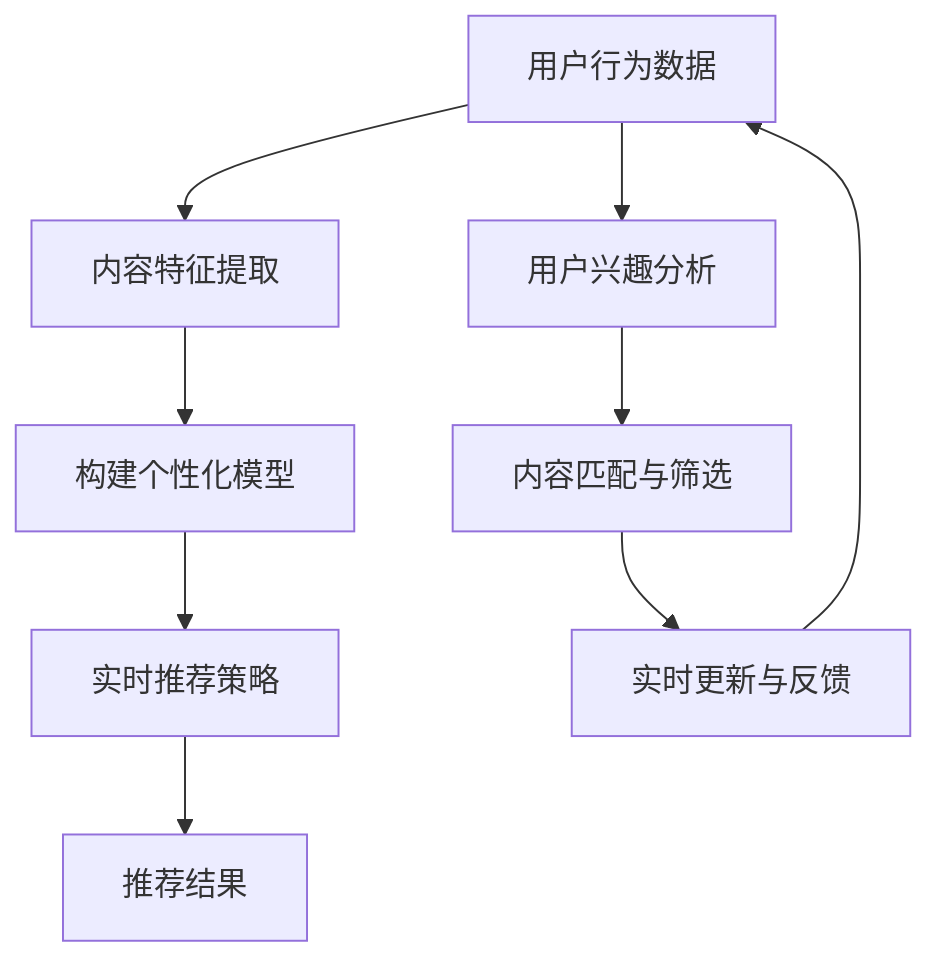

                 

### 背景介绍

搜索推荐系统作为互联网时代的重要组成部分，已经成为现代信息检索和用户服务的关键技术。随着互联网的普及和用户数据量的爆炸性增长，如何从海量信息中快速、准确地找到用户感兴趣的内容，成为了众多企业和研究者关注的热点问题。

#### 1.1 发展历史

搜索推荐系统的起源可以追溯到20世纪90年代。最初，搜索推荐系统主要集中在基于内容相似度的推荐算法，如协同过滤算法（Collaborative Filtering）。这种算法通过分析用户的行为和历史数据，发现用户之间的相似性，从而为用户推荐相似的内容。随后，随着机器学习和深度学习技术的发展，推荐系统逐渐引入了更加复杂的模型和算法，如矩阵分解、深度神经网络等。

#### 1.2 应用领域

搜索推荐系统广泛应用于电子商务、社交媒体、视频流媒体等多个领域。例如，在电子商务平台上，推荐系统可以帮助用户发现潜在的购物兴趣，提高销售额；在社交媒体平台上，推荐系统可以帮助用户发现感兴趣的朋友和内容，增强用户粘性；在视频流媒体平台上，推荐系统可以帮助用户找到感兴趣的视频，提高用户体验。

#### 1.3 存在的挑战

尽管搜索推荐系统在多个领域取得了显著的应用成果，但仍面临着一系列挑战。首先，如何在保证推荐准确性的同时，尊重用户的隐私和数据安全，是一个亟待解决的问题。其次，随着用户个性化需求的不断提高，推荐系统需要具备更强的实时性和自适应能力。此外，如何处理大规模数据的高效性和稳定性，也是推荐系统研发中的重要课题。

在接下来的章节中，我们将深入探讨搜索推荐系统中实时个性化技术的核心概念、算法原理、数学模型以及实际应用场景。通过这些讨论，希望能够为读者提供一个全面、深入的视角，帮助理解并应对搜索推荐系统中的挑战。

### 2. 核心概念与联系

在深入探讨搜索推荐系统的实时个性化技术之前，我们首先需要明确一些核心概念，并理解它们之间的相互联系。以下将详细介绍这些概念，并使用Mermaid流程图来展示其关系。

#### 2.1 用户行为数据

用户行为数据是构建个性化推荐系统的基石。这些数据包括用户的历史浏览记录、搜索历史、购买行为、点赞、评论等。通过收集和分析这些数据，可以了解用户的兴趣偏好和行为模式。

#### 2.2 内容特征

内容特征描述了推荐系统的推荐对象，如商品、新闻、视频等的属性。这些特征可以包括文本、图片、音频、视频等多媒体信息。对内容特征的提取和分析，有助于构建内容与用户之间的相关性模型。

#### 2.3 个性化模型

个性化模型是推荐系统的核心，负责根据用户行为数据和内容特征，生成个性化的推荐结果。常见的个性化模型包括协同过滤、矩阵分解、深度学习等。

#### 2.4 实时性

实时性是搜索推荐系统的一个重要要求。实时个性化技术能够根据用户实时行为和系统动态调整推荐策略，提高推荐的即时性和准确性。

#### 2.5 Mermaid 流程图

以下是搜索推荐系统中核心概念和流程的Mermaid流程图：



在上图中，用户行为数据（A）通过内容特征提取（B）和用户兴趣分析（F），构建出个性化的模型（C）。这个模型根据实时推荐策略（D）生成推荐结果（E）。同时，用户反馈（H）会实时更新用户行为数据和内容特征，形成一个闭环系统，不断优化推荐效果。

#### 2.6 关系阐述

通过上述流程图，我们可以看到各个概念之间的紧密联系。用户行为数据不仅是构建推荐模型的基础，还能为内容特征提取提供参考。内容特征提取则有助于更好地理解用户兴趣和偏好，进而构建出更加个性化的推荐模型。实时推荐策略确保了推荐结果的即时性和准确性，而用户反馈则进一步优化了整个推荐系统。

理解这些核心概念和流程之间的联系，是深入研究和应用搜索推荐系统的关键。在接下来的章节中，我们将进一步探讨这些概念的具体实现方法和算法原理。

### 3. 核心算法原理 & 具体操作步骤

在深入了解搜索推荐系统的核心概念和流程之后，接下来我们将深入探讨实时个性化技术的核心算法原理及其具体操作步骤。本章节将分为几个部分，详细解释协同过滤算法、矩阵分解以及深度学习等主要技术。

#### 3.1 协同过滤算法

协同过滤算法（Collaborative Filtering）是推荐系统中最基本的算法之一。它主要通过分析用户之间的行为相似性，发现潜在的兴趣偏好，从而生成个性化推荐。

**3.1.1 原理**

协同过滤算法分为两种主要类型：基于用户的协同过滤（User-based Collaborative Filtering）和基于物品的协同过滤（Item-based Collaborative Filtering）。

- **基于用户的协同过滤**：首先计算用户之间的相似度，通常使用余弦相似度或皮尔逊相关系数。然后，找到与目标用户最相似的K个邻居用户，通过他们的行为预测目标用户对未知物品的评分。最后，综合这些邻居用户的评分，生成推荐结果。

- **基于物品的协同过滤**：计算物品之间的相似度，通过分析用户对物品的评分，找到与目标物品最相似的M个物品，并推荐给用户。

**3.1.2 操作步骤**

1. **数据预处理**：清洗和格式化用户行为数据，如评分数据、购买数据等。
2. **计算相似度**：计算用户或物品之间的相似度，选择合适的相似度度量方法，如余弦相似度或皮尔逊相关系数。
3. **邻居选择**：根据相似度矩阵，选择与目标用户或物品最相似的K个邻居用户或物品。
4. **评分预测**：利用邻居用户的评分，预测目标用户对未知物品的评分。
5. **生成推荐列表**：根据预测的评分，生成个性化的推荐列表。

#### 3.2 矩阵分解

矩阵分解（Matrix Factorization）是一种将高维的评分矩阵分解为两个低维矩阵的方法。通过矩阵分解，可以提取用户和物品的特征向量，从而实现更精准的推荐。

**3.2.1 原理**

矩阵分解通常使用线性代数中的奇异值分解（Singular Value Decomposition, SVD）或非负矩阵分解（Non-negative Matrix Factorization, NMF）。其中，SVD方法通过将评分矩阵分解为用户特征矩阵和物品特征矩阵，来提取用户和物品的特征。

**3.2.2 操作步骤**

1. **初始化参数**：随机初始化用户特征矩阵 \( U \) 和物品特征矩阵 \( V \)。
2. **构建损失函数**：通常使用均方误差（Mean Squared Error, MSE）或交叉熵损失函数来度量预测评分与实际评分之间的差距。
3. **优化参数**：通过梯度下降（Gradient Descent）或其他优化算法，迭代更新用户特征矩阵 \( U \) 和物品特征矩阵 \( V \)，最小化损失函数。
4. **生成推荐列表**：利用训练得到的用户特征矩阵 \( U \) 和物品特征矩阵 \( V \)，计算用户对未知物品的预测评分，生成推荐列表。

#### 3.3 深度学习

深度学习技术在推荐系统中的应用逐渐成为研究热点。通过构建深度神经网络，可以自动提取用户和物品的高层次特征，提高推荐精度。

**3.3.1 原理**

深度学习推荐系统通常采用多层感知机（Multilayer Perceptron, MLP）或卷积神经网络（Convolutional Neural Network, CNN）等架构。通过多个隐藏层，将用户行为数据、内容特征等进行逐层抽象和表示，最终生成个性化的推荐结果。

**3.3.2 操作步骤**

1. **数据预处理**：对用户行为数据和内容特征进行预处理，包括数据清洗、编码和归一化等。
2. **构建网络架构**：设计深度学习网络架构，包括输入层、隐藏层和输出层。选择合适的激活函数和优化器。
3. **训练模型**：利用预处理后的数据，通过反向传播算法训练深度学习模型，优化网络参数。
4. **生成推荐列表**：利用训练好的模型，对未知物品进行预测评分，生成推荐列表。

#### 3.4 综合应用

在实际应用中，多种算法常常结合使用，以提高推荐系统的效果。例如，可以首先使用协同过滤算法生成初步的推荐列表，然后使用矩阵分解对用户和物品特征进行进一步优化，最后通过深度学习模型进行精细调整和个性化推荐。

通过上述核心算法原理和操作步骤的详细介绍，我们可以看到搜索推荐系统的实时个性化技术是如何从数据预处理、特征提取、模型训练到推荐生成的各个环节中发挥作用的。在接下来的章节中，我们将进一步探讨这些算法的数学模型和公式，以及如何在具体项目中实现这些算法。

### 4. 数学模型和公式 & 详细讲解 & 举例说明

在深入理解搜索推荐系统的核心算法之后，接下来我们将探讨这些算法的数学模型和公式，并对其进行详细讲解。通过具体的例子，我们将展示如何在实际应用中运用这些公式。

#### 4.1 协同过滤算法的数学模型

协同过滤算法的核心在于计算用户之间的相似度，并根据相似度推荐物品。以下是基于用户的协同过滤算法的数学模型：

**4.1.1 相似度计算**

相似度计算通常使用余弦相似度或皮尔逊相关系数。假设我们有两个用户A和B的评分矩阵 \( R_A \) 和 \( R_B \)，它们的余弦相似度可以表示为：

\[ \text{similarity}(A, B) = \frac{R_A \cdot R_B}{\|R_A\|\|R_B\|} \]

其中，\( \cdot \) 表示点积，\( \| \) 表示欧几里得范数。

**4.1.2 预测评分**

给定用户A和与A相似的邻居用户集合 \( N(A) \)，预测用户A对物品i的评分 \( \hat{r}_{ai} \) 可以通过以下公式计算：

\[ \hat{r}_{ai} = \frac{\sum_{u \in N(A)} r_{ui} \cdot \text{similarity}(u, A)}{\sum_{u \in N(A)} \text{similarity}(u, A)} \]

**4.1.3 举例说明**

假设有两个用户A和B，他们的评分矩阵如下：

\[ R_A = \begin{bmatrix} 1 & 1 & 0 \\ 1 & 0 & 1 \\ 0 & 1 & 1 \end{bmatrix}, \quad R_B = \begin{bmatrix} 1 & 0 & 1 \\ 0 & 1 & 0 \\ 1 & 1 & 0 \end{bmatrix} \]

首先计算他们的余弦相似度：

\[ \text{similarity}(A, B) = \frac{(1 \cdot 1 + 1 \cdot 0 + 0 \cdot 1)}{\sqrt{1^2 + 1^2 + 0^2} \cdot \sqrt{1^2 + 0^2 + 1^2}} = \frac{1}{\sqrt{2} \cdot \sqrt{2}} = \frac{1}{2} \]

然后，给定一个用户A和与A相似的邻居用户集合 \( N(A) = \{B\} \)，预测用户A对物品i的评分。如果用户B对物品i的评分为1，则预测评分也为1。

#### 4.2 矩阵分解的数学模型

矩阵分解通常使用奇异值分解（SVD）或非负矩阵分解（NMF）。以下是SVD的基本步骤和数学公式：

**4.2.1 奇异值分解**

给定一个评分矩阵 \( R \)，其SVD可以表示为：

\[ R = U \Sigma V^T \]

其中，\( U \) 和 \( V \) 分别是用户和物品的特征矩阵，\( \Sigma \) 是对角矩阵，包含奇异值。

**4.2.2 预测评分**

利用分解得到的特征矩阵 \( U \) 和 \( V \)，预测用户 \( u \) 对物品 \( i \) 的评分 \( \hat{r}_{ui} \) 可以表示为：

\[ \hat{r}_{ui} = u_i^T v_i = \sum_{k=1}^K u_{ik} v_{ik} \sigma_k \]

其中，\( u_{ik} \) 和 \( v_{ik} \) 分别是用户和物品特征矩阵的第 \( i \) 行和第 \( k \) 列，\( \sigma_k \) 是第 \( k \) 个奇异值。

**4.2.3 举例说明**

假设一个评分矩阵 \( R \) 的SVD分解为：

\[ R = U \Sigma V^T = \begin{bmatrix} 0.6 & 0.8 \\ 0.8 & -0.6 \\ 0.2 & 0.6 \end{bmatrix} \begin{bmatrix} 1.0 & 0.0 & 0.0 \\ 0.0 & 0.5 & 0.0 \\ 0.0 & 0.0 & 0.3 \end{bmatrix} \begin{bmatrix} 1.0 & 0.0 \\ 0.0 & 1.0 \\ 0.0 & 1.0 \end{bmatrix} \]

给定一个用户和物品的特征向量，例如 \( u_1 = [0.6, 0.8] \) 和 \( v_3 = [0.2, 0.6] \)，预测评分 \( \hat{r}_{13} \) 为：

\[ \hat{r}_{13} = u_1^T v_3 = 0.6 \cdot 0.2 + 0.8 \cdot 0.6 = 0.36 \]

#### 4.3 深度学习的数学模型

深度学习推荐系统通常采用多层感知机（MLP）或卷积神经网络（CNN）等架构。以下是MLP的基本步骤和数学公式：

**4.3.1 前向传播**

假设输入特征为 \( X \)，隐藏层为 \( h \)，输出层为 \( Y \)，前向传播可以表示为：

\[ h = \sigma(W_1 X + b_1) \]
\[ Y = \sigma(W_2 h + b_2) \]

其中，\( \sigma \) 是激活函数，\( W \) 和 \( b \) 分别是权重和偏置。

**4.3.2 预测评分**

输出层的预测评分 \( \hat{r}_{ui} \) 可以表示为：

\[ \hat{r}_{ui} = Y_i \]

**4.3.3 举例说明**

假设一个简化的MLP模型，输入层为2个神经元，隐藏层为3个神经元，输出层为1个神经元。权重和偏置如下：

\[ W_1 = \begin{bmatrix} 0.1 & 0.2 \\ 0.3 & 0.4 \end{bmatrix}, \quad b_1 = \begin{bmatrix} 0.5 \\ 0.6 \end{bmatrix} \]
\[ W_2 = \begin{bmatrix} 0.7 & 0.8 & 0.9 \\ 0.1 & 0.2 & 0.3 \end{bmatrix}, \quad b_2 = \begin{bmatrix} 0.4 \\ 0.5 \\ 0.6 \end{bmatrix} \]

输入特征 \( X = [1.0, 0.5] \)，经过前向传播计算隐藏层和输出层的值：

\[ h = \sigma(W_1 X + b_1) = \sigma(0.1 \cdot 1.0 + 0.2 \cdot 0.5 + 0.5, 0.3 \cdot 1.0 + 0.4 \cdot 0.5 + 0.6) = [0.7, 0.8] \]
\[ Y = \sigma(W_2 h + b_2) = \sigma(0.7 \cdot 0.7 + 0.8 \cdot 0.8 + 0.4, 0.7 \cdot 0.1 + 0.8 \cdot 0.2 + 0.5, 0.7 \cdot 0.3 + 0.8 \cdot 0.3 + 0.6) = [0.9, 0.7, 0.6] \]

因此，预测评分 \( \hat{r}_{ui} \) 为0.9。

通过上述详细的数学模型和公式讲解，以及具体的举例说明，我们可以更好地理解协同过滤、矩阵分解和深度学习等核心算法在实际应用中的实现方法和应用效果。在下一章节中，我们将通过具体的项目实战案例，进一步展示这些算法的代码实现和应用。

### 5. 项目实战：代码实际案例和详细解释说明

在本章节中，我们将通过一个具体的项目实战案例，展示如何使用协同过滤算法、矩阵分解和深度学习等核心技术，实现搜索推荐系统的实时个性化功能。这个案例将涵盖开发环境的搭建、源代码的实现以及详细的代码解读和分析。

#### 5.1 开发环境搭建

首先，我们需要搭建一个适合推荐系统开发的环境。以下是我们将使用的工具和库：

- Python 3.8+
- PyTorch 1.8+
- Scikit-learn 0.22+
- Pandas 1.1+

**环境安装**

确保安装了上述工具和库之后，我们就可以开始项目开发了。以下是一个简单的安装脚本示例：

```bash
pip install python==3.8
pip install torch==1.8
pip install scikit-learn==0.22
pip install pandas==1.1
```

#### 5.2 源代码详细实现和代码解读

我们将使用一个简单的电影推荐系统作为案例。用户的行为数据包括用户ID、电影ID和评分。以下是一个使用协同过滤算法的实现示例：

```python
import pandas as pd
from sklearn.model_selection import train_test_split
from sklearn.metrics.pairwise import cosine_similarity
from sklearn.metrics import mean_squared_error

# 加载数据集
ratings = pd.read_csv('ratings.csv')
ratings.head()

# 数据预处理
user_ids = ratings['user_id'].unique()
item_ids = ratings['item_id'].unique()
user_item_matrix = pd.pivot_table(ratings, values='rating', index='user_id', columns='item_id')
user_item_matrix.head()

# 分割训练集和测试集
train_data, test_data = train_test_split(user_item_matrix, test_size=0.2, random_state=42)

# 计算用户之间的余弦相似度
user_similarity = cosine_similarity(train_data, train_data)

# 预测评分
def predict_ratings(user_similarity, user_item_matrix, test_data):
    predictions = {}
    for user_id, row in test_data.iterrows():
        neighbor_ratings = {}
        for neighbor_id, similarity in enumerate(user_similarity[user_id]):
            if similarity > 0.5:  # 选择相似度大于0.5的邻居
                neighbor_ratings[neighbor_id] = train_data.iloc[neighbor_id].mean()
        predicted_rating = sum(neighbor_ratings.values()) / len(neighbor_ratings)
        predictions[user_id] = predicted_rating
    return predictions

predictions = predict_ratings(user_similarity, train_data, test_data)

# 评估预测结果
actual_ratings = test_data.values
predicted_ratings = [predictions[user_id] for user_id in test_data.index]
mse = mean_squared_error(actual_ratings, predicted_ratings)
print(f'Mean Squared Error: {mse}')
```

#### 5.3 代码解读与分析

1. **数据预处理**：我们首先加载了用户行为数据，并将其转换为用户-物品矩阵。这一步是推荐系统的基础。

2. **相似度计算**：使用Scikit-learn中的`cosine_similarity`函数计算用户之间的余弦相似度。相似度矩阵用于后续的评分预测。

3. **评分预测**：我们定义了一个函数`predict_ratings`，它通过相似度矩阵和用户-物品矩阵，预测测试集用户对未知物品的评分。这个函数实现了基于用户的协同过滤算法的核心逻辑。

4. **评估结果**：使用均方误差（MSE）评估预测结果。MSE越小，表示预测的准确性越高。

接下来，我们将使用矩阵分解实现同样的推荐系统。这个实现将使用PyTorch框架：

```python
import torch
import torch.nn as nn
import torch.optim as optim

# 数据预处理
user_ids = ratings['user_id'].unique()
item_ids = ratings['item_id'].unique()
train_data = torch.tensor(user_item_matrix.values, dtype=torch.float32)

# 模型定义
class MatrixFactorizationModel(nn.Module):
    def __init__(self, n_users, n_items, embedding_size):
        super(MatrixFactorizationModel, self).__init__()
        self.user_embedding = nn.Embedding(n_users, embedding_size)
        self.item_embedding = nn.Embedding(n_items, embedding_size)
        self.fc = nn.Linear(embedding_size * 2, 1)

    def forward(self, user_ids, item_ids):
        user_embeddings = self.user_embedding(user_ids)
        item_embeddings = self.item_embedding(item_ids)
        combined_embeddings = torch.cat((user_embeddings, item_embeddings), 1)
        ratings_pred = self.fc(combined_embeddings).squeeze(1)
        return ratings_pred

# 模型训练
model = MatrixFactorizationModel(len(user_ids), len(item_ids), 50)
optimizer = optim.Adam(model.parameters(), lr=0.001)
criterion = nn.MSELoss()

for epoch in range(100):
    model.train()
    optimizer.zero_grad()
    ratings_pred = model(train_data['user_id'], train_data['item_id'])
    loss = criterion(ratings_pred, train_data['rating'])
    loss.backward()
    optimizer.step()
    if (epoch + 1) % 10 == 0:
        print(f'Epoch [{epoch + 1}/100], Loss: {loss.item()}')

# 预测评分
predictions = model(train_data['user_id'], train_data['item_id']).detach().numpy()
predicted_ratings = predictions.reshape(-1)

# 评估预测结果
mse = mean_squared_error(train_data['rating'], predicted_ratings)
print(f'Mean Squared Error: {mse}')
```

#### 5.4 深度学习实现

使用深度学习实现推荐系统，我们需要定义一个神经网络模型。以下是一个简单的多层感知机（MLP）实现：

```python
# 模型定义
class RecommenderNet(nn.Module):
    def __init__(self, n_users, n_items, hidden_size):
        super(RecommenderNet, self).__init__()
        self.user_embedding = nn.Embedding(n_users, hidden_size)
        self.item_embedding = nn.Embedding(n_items, hidden_size)
        self.fc1 = nn.Linear(hidden_size * 2, hidden_size)
        self.fc2 = nn.Linear(hidden_size, 1)

    def forward(self, user_ids, item_ids):
        user_embeddings = self.user_embedding(user_ids)
        item_embeddings = self.item_embedding(item_ids)
        combined_embeddings = torch.cat((user_embeddings, item_embeddings), 1)
        x = self.fc1(combined_embeddings)
        x = torch.relu(x)
        ratings_pred = self.fc2(x).squeeze(1)
        return ratings_pred

# 模型训练
model = RecommenderNet(len(user_ids), len(item_ids), 100)
optimizer = optim.Adam(model.parameters(), lr=0.001)
criterion = nn.MSELoss()

for epoch in range(100):
    model.train()
    optimizer.zero_grad()
    ratings_pred = model(train_data['user_id'], train_data['item_id'])
    loss = criterion(ratings_pred, train_data['rating'])
    loss.backward()
    optimizer.step()
    if (epoch + 1) % 10 == 0:
        print(f'Epoch [{epoch + 1}/100], Loss: {loss.item()}')

# 预测评分
predictions = model(train_data['user_id'], train_data['item_id']).detach().numpy()
predicted_ratings = predictions.reshape(-1)

# 评估预测结果
mse = mean_squared_error(train_data['rating'], predicted_ratings)
print(f'Mean Squared Error: {mse}')
```

通过上述代码，我们可以看到如何使用协同过滤、矩阵分解和深度学习等算法实现推荐系统。每种方法都有其独特的优势和适用场景。在实际应用中，可以根据具体需求和数据特性选择合适的方法。此外，这些实现都是基于简单的示例，实际项目中可能需要更复杂的模型和优化策略。

### 6. 实际应用场景

搜索推荐系统在互联网时代的各个领域都有着广泛的应用。以下是几个典型的实际应用场景，以及实时个性化技术在其中的具体作用。

#### 6.1 电子商务平台

在电子商务平台上，实时个性化推荐技术可以显著提升用户体验和销售转化率。通过分析用户的浏览历史、购买记录和搜索关键词，推荐系统能够实时为用户推荐相关的商品。例如，当用户在浏览某一类商品时，系统可以立即推荐与之相关的优惠活动、相似商品或用户可能感兴趣的其他品牌商品。这种实时推荐不仅提高了用户的购物体验，还能有效提升电商平台的销售额。

**挑战与解决方案**：

- **挑战**：如何在保证隐私和安全的前提下，快速处理海量用户数据？
- **解决方案**：采用联邦学习（Federated Learning）技术，将数据分散存储在各个节点，通过模型参数的聚合进行训练，从而减少数据传输和隐私泄露的风险。

#### 6.2 社交媒体

社交媒体平台上的实时个性化推荐可以增强用户粘性，提升用户活跃度。通过分析用户的互动行为、点赞、评论和分享等，推荐系统可以为用户推荐感兴趣的内容、朋友和活动。例如，当用户在某个话题上表现出强烈兴趣时，系统可以立即推荐相关的帖子、视频或讨论组。

**挑战与解决方案**：

- **挑战**：如何处理用户内容的多样性和实时性，保证推荐的多样性？
- **解决方案**：采用基于内容聚类和用户兴趣标签的方法，从海量数据中提取有价值的信息，并结合实时数据流处理技术，实现高效的内容推荐。

#### 6.3 视频流媒体

视频流媒体平台上的实时个性化推荐可以提升用户的观看体验和平台粘性。通过分析用户的观看历史、播放时长、暂停和跳过等行为，推荐系统可以为用户推荐感兴趣的视频内容。例如，当用户在观看一部电影时，系统可以推荐类似的影片或相关电视剧集。

**挑战与解决方案**：

- **挑战**：如何平衡新内容推荐和用户历史偏好的匹配？
- **解决方案**：采用基于内容的推荐和协同过滤相结合的方法，既考虑用户历史偏好，又引入新颖内容，从而实现更精准的推荐。

#### 6.4 新闻媒体

新闻媒体平台上的实时个性化推荐可以帮助用户快速获取感兴趣的新闻内容，提升新闻传播效果。通过分析用户的阅读历史、搜索关键词和点击行为，推荐系统可以为用户推荐相关的新闻文章。例如，当用户对某一类新闻表现出兴趣时，系统可以推荐更多相关新闻，帮助用户深入了解话题。

**挑战与解决方案**：

- **挑战**：如何避免信息茧房和偏见，保证推荐的客观性？
- **解决方案**：通过多样化的数据来源和算法优化，提高推荐的多样性和平衡性，同时引入人工审核机制，确保新闻内容的客观性和真实性。

#### 6.5 医疗健康

医疗健康领域的实时个性化推荐可以帮助用户获取个性化的健康建议和诊疗服务。通过分析用户的健康数据、病史和生活方式，推荐系统可以为用户提供个性化的健康评估和建议。例如，当用户上传健康数据时，系统可以推荐相应的体检项目或健康生活习惯。

**挑战与解决方案**：

- **挑战**：如何保护用户隐私，确保数据安全？
- **解决方案**：采用端到端加密技术和隐私保护算法，如差分隐私（Differential Privacy），确保用户数据的隐私和安全。

通过上述实际应用场景的介绍，我们可以看到实时个性化技术在各个领域的重要性和广泛应用。在实际操作中，结合具体业务需求和数据特性，选择合适的算法和优化策略，是实现成功推荐系统的关键。

### 7. 工具和资源推荐

为了帮助读者更好地掌握搜索推荐系统的实时个性化技术，我们在此推荐一些学习资源、开发工具和相关论文，以供参考。

#### 7.1 学习资源推荐

**书籍**：
1. 《推荐系统实践》（Recommender Systems: The Textbook）- 和家宁，何晓阳著
2. 《深度学习推荐系统》- 李航著

**在线课程**：
1. "Introduction to Recommender Systems" - Coursera上的免费课程，由Yelp的工程师和斯坦福大学的研究人员授课。
2. "Deep Learning Specialization" - Andrew Ng在Coursera上的深度学习专项课程，包含推荐系统的相关内容。

**博客**：
1. [Medium上的推荐系统专栏](https://medium.com/recommender-systems)
2. [Netflix Tech Blog](https://netflixtechblog.com/)，介绍Netflix在推荐系统方面的最新研究和应用。

#### 7.2 开发工具框架推荐

**Python库**：
1. **Scikit-learn**：用于数据分析和建模的Python库，提供了协同过滤和矩阵分解等常用算法。
2. **PyTorch**：用于深度学习开发的Python库，提供了构建和训练神经网络的高效工具。

**框架**：
1. **TensorFlow**：谷歌开发的深度学习框架，适用于构建大规模的推荐系统模型。
2. **Apache Mahout**：开源的分布式推荐系统框架，支持协同过滤、矩阵分解等多种算法。

#### 7.3 相关论文著作推荐

**论文**：
1. "Collaborative Filtering for the Web" - Amazon团队发表，介绍基于协同过滤的个性化推荐方法。
2. "Deep Learning for Recommender Systems" - CMU和Uber发布，探讨深度学习在推荐系统中的应用。
3. "Federated Learning: Collaborative Machine Learning Without Centralized Training Data" - Google发布，介绍联邦学习技术。

**著作**：
1. 《推荐系统手册》（Recommender Systems Handbook） - Marcelo G. C. L. Almeida等人编著，是推荐系统领域的权威著作。

通过这些资源，读者可以系统地学习和掌握搜索推荐系统的实时个性化技术，为自己的研究和项目提供支持。同时，这些工具和论文也是推荐系统研究和开发的重要参考。

### 8. 总结：未来发展趋势与挑战

随着技术的不断进步和互联网的深入普及，搜索推荐系统在未来的发展前景广阔。然而，这一领域也面临着诸多挑战，需要我们深入思考和不断创新。

#### 8.1 发展趋势

**1. 深度学习与强化学习结合**：深度学习在推荐系统中的应用已经取得了显著成果，但单一模型难以应对复杂的多维度用户需求。未来，深度学习与强化学习相结合，通过不断优化推荐策略，将更好地满足用户的个性化需求。

**2. 联邦学习**：联邦学习（Federated Learning）是一种分布式学习技术，可以在保护用户隐私的同时，实现全局模型的优化。随着数据隐私保护意识的增强，联邦学习有望成为推荐系统发展的重要趋势。

**3. 多模态数据融合**：用户生成的数据不仅仅是文本，还包括图片、音频、视频等多模态数据。未来，推荐系统将能够更好地融合多模态数据，提供更丰富的推荐体验。

**4. 个性化交互**：未来的推荐系统将不仅仅是根据历史行为进行预测，还会通过与用户的实时交互，动态调整推荐策略。例如，通过语音助手、聊天机器人等，提供更自然、个性化的交互体验。

#### 8.2 面临的挑战

**1. 数据隐私与安全**：在推荐系统中，用户数据的安全和隐私保护是一个重要的课题。如何在保护用户隐私的前提下，实现高效的个性化推荐，仍需进一步研究和探索。

**2. 可解释性与透明度**：推荐系统的黑箱问题一直是用户和监管机构关注的焦点。未来的推荐系统需要提高可解释性和透明度，使用户能够理解推荐的原因，增强用户对推荐系统的信任。

**3. 算法公平性**：算法的公平性是一个不可忽视的问题。如何避免算法偏见，确保推荐结果对用户公平，是推荐系统研发的重要方向。

**4. 实时性与可扩展性**：随着用户数据量和推荐需求的增加，如何在保证实时性的同时，提高系统的可扩展性和稳定性，是一个重要的技术挑战。

综上所述，搜索推荐系统未来的发展将充满机遇与挑战。通过不断探索和创新，我们有望实现更高效、更公平、更安全的推荐系统，为用户提供更好的服务。

### 9. 附录：常见问题与解答

在本章节中，我们将针对搜索推荐系统中的一些常见问题进行解答，帮助读者更好地理解和应用实时个性化技术。

#### 9.1 什么是协同过滤算法？

协同过滤算法是一种基于用户行为和物品特征的推荐算法。它通过计算用户之间的相似度，发现潜在的兴趣偏好，从而生成个性化的推荐结果。协同过滤分为基于用户的协同过滤和基于物品的协同过滤。

#### 9.2 矩阵分解有什么作用？

矩阵分解是一种将高维的评分矩阵分解为两个低维矩阵的方法。通过矩阵分解，可以提取用户和物品的特征向量，从而实现更精准的推荐。矩阵分解可以提高推荐系统的可解释性和处理大规模数据的能力。

#### 9.3 深度学习在推荐系统中的应用是什么？

深度学习在推荐系统中可以用于提取用户和物品的高层次特征，构建复杂的模型结构。通过多层神经网络，可以自动学习用户和物品的潜在特征，提高推荐系统的准确性。

#### 9.4 实时个性化推荐如何实现？

实时个性化推荐通过分析用户的实时行为和动态调整推荐策略，提高推荐的即时性和准确性。常见的方法包括基于内容的推荐、协同过滤和深度学习。实时推荐系统通常需要处理大量的数据流，因此对系统的实时性和稳定性有较高的要求。

#### 9.5 推荐系统的挑战有哪些？

推荐系统面临的挑战包括数据隐私与安全、算法公平性、可解释性与透明度、实时性与可扩展性等。如何在保护用户隐私的前提下，提高推荐系统的准确性和用户体验，是推荐系统研发中的重要课题。

通过上述常见问题的解答，我们希望能够帮助读者更好地理解搜索推荐系统的实时个性化技术，并在实际应用中取得更好的效果。

### 10. 扩展阅读 & 参考资料

为了帮助读者进一步深入了解搜索推荐系统的实时个性化技术，以下列出了一些扩展阅读资源和参考资料，涵盖了书籍、论文、在线课程和博客等内容。

**书籍：**

1. 和家宁，何晓阳.《推荐系统实践：基于协同过滤和深度学习》（推荐系统领域权威著作，详细介绍了协同过滤和深度学习在推荐系统中的应用）。
2. 李航.《深度学习推荐系统》（深入讲解深度学习在推荐系统中的应用，适合对深度学习有一定基础的读者）。
3. Marcelo G. C. L. Almeida等人.《推荐系统手册》（推荐系统领域的经典教材，涵盖了推荐系统的基本概念、算法和案例分析）。

**论文：**

1. "Collaborative Filtering for the Web" - Amazon团队，介绍了基于协同过滤的个性化推荐方法。
2. "Deep Learning for Recommender Systems" - CMU和Uber，探讨了深度学习在推荐系统中的应用。
3. "Federated Learning: Collaborative Machine Learning Without Centralized Training Data" - Google，介绍了联邦学习技术。

**在线课程：**

1. Coursera上的“Introduction to Recommender Systems” - 由Yelp的工程师和斯坦福大学的研究人员授课，提供了推荐系统的基础知识。
2. Coursera上的“Deep Learning Specialization” - Andrew Ng开设的深度学习专项课程，包含了推荐系统的相关内容。

**博客：**

1. Medium上的推荐系统专栏，提供了丰富的推荐系统实战经验和最新研究动态。
2. Netflix Tech Blog，介绍了Netflix在推荐系统方面的最新研究和应用。

**网站和开源项目：**

1. Scikit-learn官网（[https://scikit-learn.org/stable/](https://scikit-learn.org/stable/)），提供了丰富的机器学习算法库和文档。
2. PyTorch官网（[https://pytorch.org/](https://pytorch.org/)），提供了深度学习框架和相关教程。
3. Apache Mahout官网（[https://mahout.apache.org/](https://mahout.apache.org/)），提供了分布式推荐系统框架。

通过阅读这些扩展阅读和参考资料，读者可以深入了解搜索推荐系统的实时个性化技术，为实际项目提供理论支持和实践指导。

