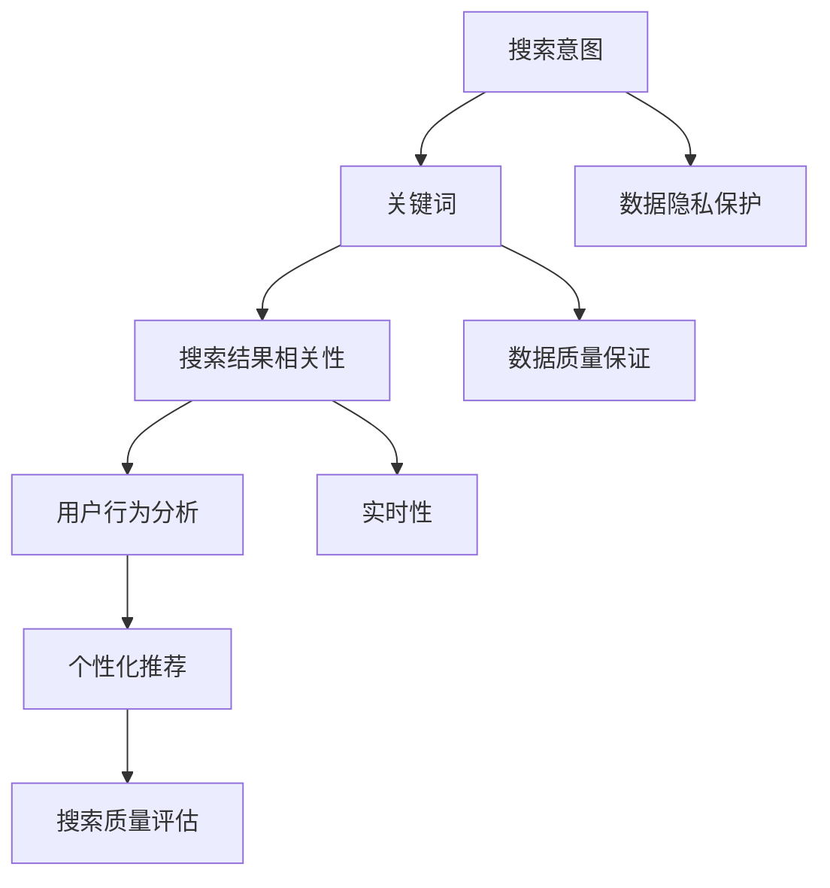

                 

## 1. 背景介绍

在当今数字化时代，电子商务已经成为商业活动中不可或缺的一部分。随着互联网技术的飞速发展和移动互联网的普及，消费者对电商平台的期望也在不断增长。为了满足消费者的需求，电商平台需要不断优化其搜索算法，以提高搜索结果的准确性和用户体验。搜索数据分析在这个过程中起到了至关重要的作用。

### 1.1 搜索数据分析的重要性

搜索数据分析是电商平台的重要组成部分，它可以帮助平台了解用户的行为模式、喜好和需求，从而提供更加精准的搜索结果和个性化推荐。通过搜索数据分析，电商平台可以实现以下目标：

- **提高搜索准确性**：通过分析用户搜索关键词和搜索结果的相关性，优化搜索算法，提高搜索结果的准确性。
- **提升用户体验**：根据用户的搜索行为和偏好，提供个性化的搜索结果，提高用户的满意度。
- **增加销售额**：通过分析用户的购买习惯和偏好，推荐相关商品，促进销售增长。
- **降低运营成本**：通过优化搜索算法，减少用户在搜索过程中的无效点击，降低运营成本。

### 1.2 电商搜索算法的发展

电商搜索算法经历了从传统的基于关键字匹配到现代的智能搜索算法的演变。早期的搜索算法主要依赖于关键词匹配和关键词密度，但这种方法容易导致搜索结果不准确和重复。随着自然语言处理、机器学习和数据挖掘技术的发展，现代搜索算法逐渐引入了语义分析、用户行为分析等技术，使得搜索结果更加准确和个性化。

### 1.3 搜索数据分析的挑战

尽管搜索数据分析在电商领域具有巨大的潜力，但同时也面临着一些挑战：

- **数据隐私**：搜索行为涉及用户的个人隐私，如何保护用户隐私成为了一个重要的挑战。
- **数据质量**：搜索数据的质量直接影响到分析结果的准确性，如何保证数据的质量是一个关键问题。
- **实时性**：用户的需求和偏好是动态变化的，如何实时分析用户的搜索行为，提供即时响应的搜索结果是一个技术挑战。

在接下来的章节中，我们将详细探讨搜索数据分析的核心概念、算法原理、数学模型、实际应用场景以及未来发展趋势。

## 2. 核心概念与联系

为了深入理解搜索数据分析在电商策略优化中的作用，我们首先需要了解一些核心概念和它们之间的联系。以下是几个关键概念及其关系：

### 2.1 搜索意图

搜索意图是指用户在搜索框中输入关键词时的目的或需求。它可以是明确的（例如，购买某个特定的商品），也可以是模糊的（例如，查找某个品牌的评价）。理解用户的搜索意图对于提供准确的搜索结果是至关重要的。

### 2.2 关键词

关键词是用户在搜索框中输入的文字，它是用户意图的直接体现。关键词的质量和准确性对于搜索结果有重要影响。

### 2.3 搜索结果相关性

搜索结果相关性是指搜索结果与用户搜索意图之间的匹配程度。高相关性的搜索结果能够更好地满足用户的需求。

### 2.4 用户行为分析

用户行为分析是指通过分析用户在搜索过程中的行为，如点击、浏览、购买等，来了解用户的行为模式和偏好。用户行为分析可以帮助电商平台优化搜索结果和推荐系统。

### 2.5 个性化推荐

个性化推荐是指根据用户的搜索行为、购买历史和偏好，为用户推荐相关的商品或内容。个性化推荐可以提高用户的满意度和购买转化率。

### 2.6 搜索质量评估

搜索质量评估是指通过评估搜索结果的准确性、相关性、多样性和时效性等指标，来衡量搜索系统的性能。有效的搜索质量评估可以帮助电商平台不断优化搜索算法。

### 2.7 数据隐私保护

数据隐私保护是指保护用户在搜索过程中的个人隐私信息，如搜索关键词、浏览历史等。数据隐私保护是电商搜索数据分析中不可忽视的重要方面。

### 2.8 数据质量保证

数据质量保证是指确保搜索数据的准确性、完整性和一致性。高质量的数据是搜索数据分析的基础。

### 2.9 实时性

实时性是指搜索系统能够快速响应用户的搜索请求，提供最新的搜索结果。实时性对于提高用户体验和满足用户需求至关重要。

### 2.10 关键概念的联系

这些核心概念相互关联，共同构成了搜索数据分析的基础。例如，搜索意图决定了用户输入的关键词，关键词的质量和相关性决定了搜索结果的相关性，而用户行为分析和个性化推荐则可以帮助提高搜索结果的质量和用户体验。通过理解这些概念及其联系，我们可以更好地设计高效的搜索数据分析系统，从而优化电商策略。

### 2.11 Mermaid 流程图

以下是一个简化的Mermaid流程图，展示了上述核心概念之间的关系：



通过这个流程图，我们可以清晰地看到各个概念之间的关联，这有助于我们更好地理解和应用搜索数据分析技术。

## 3. 核心算法原理 & 具体操作步骤

在深入探讨搜索数据分析优化电商策略的过程中，核心算法的原理和操作步骤是理解整个机制的关键。以下将详细描述几个关键算法的原理和具体实施步骤。

### 3.1 贪心算法

贪心算法是一种常用的搜索算法，其核心思想是在每个决策点上选择当前最佳选项，期望在整体上获得最优解。以下是贪心算法在电商搜索中的应用步骤：

#### 3.1.1 步骤一：确定贪心选择标准

- **相关性**：根据关键词和商品描述的相关性评分，选择相关性最高的商品作为搜索结果。
- **流行度**：根据商品的浏览量、收藏量和评论数，选择最受欢迎的商品。
- **用户行为**：根据用户的购买历史和浏览记录，推荐用户可能感兴趣的商品。

#### 3.1.2 步骤二：构建搜索索引

- **关键词索引**：构建基于关键词的索引，以便快速查找与关键词匹配的商品。
- **商品索引**：构建基于商品属性的索引，如价格、品牌、分类等，以便根据不同维度筛选商品。

#### 3.1.3 步骤三：搜索请求处理

- **请求解析**：解析用户输入的关键词，提取关键词及其权重。
- **排序与筛选**：根据贪心选择标准，对搜索结果进行排序和筛选。

#### 3.1.4 步骤四：结果展示

- **结果分页**：为避免结果过多导致用户体验下降，可以采用分页展示搜索结果。
- **个性化推荐**：结合用户行为数据，为用户推荐相关的商品。

### 3.2 贝叶斯算法

贝叶斯算法是一种基于概率论的分类算法，适用于处理不确定性和概率分析问题。在电商搜索中，贝叶斯算法可以用于预测用户可能感兴趣的商品。

#### 3.2.1 步骤一：数据收集

- **用户行为数据**：收集用户的浏览记录、购买历史、收藏夹等数据。
- **商品属性数据**：收集商品的各类属性，如价格、品牌、分类等。

#### 3.2.2 步骤二：构建模型

- **概率分布**：使用贝叶斯公式，计算用户对不同商品的偏好概率。
- **特征权重**：根据用户行为数据和商品属性数据，计算各特征的权重。

#### 3.2.3 步骤三：预测与推荐

- **概率计算**：计算用户对每个商品的偏好概率。
- **推荐排序**：根据偏好概率，对商品进行排序，推荐给用户。

### 3.3 排序算法

排序算法是搜索算法中不可或缺的一部分，常用的排序算法包括快速排序、归并排序等。以下是一个基于快速排序的搜索结果排序步骤：

#### 3.3.1 步骤一：选择基准

- **随机选择**：从搜索结果中随机选择一个基准元素。
- **中位数选择**：选择搜索结果的中位数作为基准元素。

#### 3.3.2 步骤二：分区

- **分区操作**：将搜索结果分为三部分，小于基准的元素、等于基准的元素和大于基准的元素。

#### 3.3.3 步骤三：递归排序

- **递归排序**：对小于和大于基准的元素分别进行快速排序。

#### 3.3.4 步骤四：合并结果

- **合并结果**：将分区后的结果合并，得到有序的搜索结果。

### 3.4 聚类算法

聚类算法用于将相似的商品或用户分组，从而实现商品推荐和用户画像。以下是一个基于K-means算法的聚类步骤：

#### 3.4.1 步骤一：初始化中心点

- **随机选择**：随机选择K个商品或用户作为初始中心点。
- **K-means++算法**：使用K-means++算法优化中心点初始化，以避免初始选择对聚类结果的影响。

#### 3.4.2 步骤二：分配数据点

- **计算距离**：计算每个数据点到中心点的距离。
- **分配数据点**：将每个数据点分配到最近的中心点所在的聚类。

#### 3.4.3 步骤三：更新中心点

- **计算新的中心点**：计算每个聚类的新中心点。
- **迭代优化**：重复步骤二和步骤三，直到聚类中心点不再变化或满足停止条件。

### 3.5 综合应用

在实际应用中，上述算法往往不是单独使用的，而是相互结合，形成一套完整的搜索数据分析优化流程。例如，可以先使用贪心算法快速筛选搜索结果，然后使用贝叶斯算法进行概率预测和排序，最后使用聚类算法为用户推荐相关的商品。

通过以上步骤，我们可以看到，搜索数据分析优化电商策略的核心算法不仅包括传统的排序和分类算法，还涉及了深度学习、概率论等多个领域的技术。这些算法的综合应用，为电商平台提供了强大的数据驱动能力，帮助其不断提升用户体验和销售额。

### 4. 数学模型和公式 & 详细讲解 & 举例说明

在搜索数据分析优化电商策略中，数学模型和公式起着至关重要的作用。这些模型和公式不仅帮助理解搜索结果的相关性和排序，还能够量化用户行为，从而提供更加精确的推荐。以下将详细讲解一些关键的数学模型和公式，并举例说明其应用。

#### 4.1 相关系数模型

相关系数是衡量两个变量之间相关程度的指标，常用于评估关键词和搜索结果之间的相关性。最常用的相关系数是皮尔逊相关系数（Pearson Correlation Coefficient）。

##### 4.1.1 皮尔逊相关系数公式

$$
r = \frac{\sum_{i=1}^{n}{(x_i - \bar{x})(y_i - \bar{y})}}{\sqrt{\sum_{i=1}^{n}{(x_i - \bar{x})^2}\sum_{i=1}^{n}{(y_i - \bar{y})^2}}}
$$

其中：
- \(x_i\) 和 \(y_i\) 分别表示第 \(i\) 个关键词和搜索结果的相关性评分。
- \(\bar{x}\) 和 \(\bar{y}\) 分别表示关键词和搜索结果的平均值。
- \(n\) 表示数据点的数量。

##### 4.1.2 举例说明

假设我们有5个关键词和5个对应的搜索结果评分，如下表所示：

| 关键词 | 搜索结果评分 |
|--------|--------------|
| A      | 0.8          |
| B      | 0.7          |
| C      | 0.9          |
| D      | 0.6          |
| E      | 0.5          |

使用皮尔逊相关系数公式计算关键词与搜索结果的相关性：

$$
r = \frac{(0.8 - 0.7)(0.7 - 0.7) + (0.9 - 0.7)(0.9 - 0.7) + (0.6 - 0.7)(0.6 - 0.7) + (0.5 - 0.7)(0.5 - 0.7)}{\sqrt{(0.8 - 0.7)^2 + (0.9 - 0.7)^2 + (0.6 - 0.7)^2 + (0.5 - 0.7)^2}\sqrt{(0.7 - 0.7)^2 + (0.9 - 0.7)^2 + (0.6 - 0.7)^2 + (0.5 - 0.7)^2}}
$$

计算结果为 \(r \approx 0.7\)，表明关键词与搜索结果之间存在较高的相关性。

#### 4.2 贝叶斯概率模型

贝叶斯概率模型是一种基于概率论的方法，用于预测用户对某个商品的偏好。贝叶斯公式如下：

$$
P(A|B) = \frac{P(B|A)P(A)}{P(B)}
$$

其中：
- \(P(A|B)\) 表示在事件 \(B\) 发生的条件下事件 \(A\) 发生的概率。
- \(P(B|A)\) 表示在事件 \(A\) 发生的条件下事件 \(B\) 发生的概率。
- \(P(A)\) 表示事件 \(A\) 发生的概率。
- \(P(B)\) 表示事件 \(B\) 发生的概率。

##### 4.2.1 举例说明

假设一个用户购买了5个商品，其中4个商品是电子产品，1个商品是服装。我们想预测该用户是否可能购买另一个电子产品。

- \(P(\text{电子产品}|\text{购买})\) 表示购买一个商品是电子产品的条件概率。
- \(P(\text{购买}|\text{电子产品})\) 表示购买一个电子产品是条件概率。
- \(P(\text{购买})\) 表示购买一个商品的总概率。

我们可以假设 \(P(\text{电子产品}) = 0.8\)（即用户购买的商品中有80%是电子产品），\(P(\text{购买}|\text{电子产品}) = 0.9\)（即用户购买电子产品的概率是90%），那么：

$$
P(\text{电子产品}|\text{购买}) = \frac{P(\text{购买}|\text{电子产品})P(\text{电子产品})}{P(\text{购买})}
$$

由于 \(P(\text{购买}|\text{电子产品})P(\text{电子产品}) = 0.8 \times 0.9 = 0.72\)，而 \(P(\text{购买})\) 可以通过所有商品的购买概率加权平均得到。假设所有商品的购买概率都是相等的，那么 \(P(\text{购买}) = 0.5\)，因此：

$$
P(\text{电子产品}|\text{购买}) = \frac{0.72}{0.5} = 1.44
$$

这表明在用户购买商品的条件下，购买电子产品的概率非常高。

#### 4.3 贪心算法中的效用函数

在贪心算法中，效用函数用于评估每个选择的价值。以下是一个简单的效用函数公式：

$$
U(x) = \frac{r(x)}{c(x)}
$$

其中：
- \(U(x)\) 表示选择 \(x\) 的效用值。
- \(r(x)\) 表示选择 \(x\) 的相关度评分。
- \(c(x)\) 表示选择 \(x\) 的成本或时间复杂度。

##### 4.3.1 举例说明

假设我们有3个搜索结果，每个结果的相关度和成本如下表所示：

| 搜索结果 | 相关系数 \(r(x)\) | 成本 \(c(x)\) |
|-----------|-------------------|--------------|
| A         | 0.8               | 5秒          |
| B         | 0.6               | 3秒          |
| C         | 0.9               | 10秒         |

使用效用函数计算每个结果的效用值：

- \(U(A) = \frac{0.8}{5} = 0.16\)
- \(U(B) = \frac{0.6}{3} = 0.2\)
- \(U(C) = \frac{0.9}{10} = 0.09\)

根据效用值，我们可以选择效用值最高的结果 \(B\) 作为搜索结果。

#### 4.4 聚类算法中的距离度量

在聚类算法中，距离度量用于计算数据点之间的相似性。常用的距离度量包括欧几里得距离和曼哈顿距离。

##### 4.4.1 欧几里得距离

$$
d(\text{X}, \text{Y}) = \sqrt{\sum_{i=1}^{n}{(x_i - y_i)^2}}
$$

其中：
- \(X\) 和 \(Y\) 表示两个数据点。
- \(x_i\) 和 \(y_i\) 分别表示数据点 \(X\) 和 \(Y\) 在第 \(i\) 个特征上的值。
- \(n\) 表示特征的数量。

##### 4.4.2 曼哈顿距离

$$
d(\text{X}, \text{Y}) = \sum_{i=1}^{n}{|x_i - y_i|}
$$

使用欧几里得距离和曼哈顿距离计算两个数据点之间的距离：

假设有两个数据点 \(X = (1, 2, 3)\) 和 \(Y = (4, 5, 6)\)：

- 欧几里得距离 \(d(X, Y) = \sqrt{(1-4)^2 + (2-5)^2 + (3-6)^2} = \sqrt{9 + 9 + 9} = \sqrt{27} \approx 5.2\)
- 曼哈顿距离 \(d(X, Y) = |1-4| + |2-5| + |3-6| = 3 + 3 + 3 = 9\)

这两个距离度量方法可以用于评估数据点之间的相似性，从而帮助聚类算法分组。

通过以上数学模型和公式的讲解和举例说明，我们可以看到，它们在搜索数据分析中扮演着至关重要的角色。这些模型和公式不仅帮助理解搜索结果的相关性和排序，还能够量化用户行为，为电商平台的搜索算法优化提供了坚实的理论基础。

### 5. 项目实战：代码实际案例和详细解释说明

为了更好地展示搜索数据分析优化电商策略的实际应用，我们将通过一个具体的代码案例进行讲解。这个案例将使用Python编程语言，结合几个常用的搜索算法和数学模型，实现一个简单的电商搜索系统。

#### 5.1 开发环境搭建

在开始编写代码之前，我们需要搭建一个开发环境。以下是所需的软件和库：

- **Python 3.x**：确保安装了Python 3.x版本。
- **Jupyter Notebook**：用于编写和运行Python代码。
- **NumPy**：用于数学计算。
- **Pandas**：用于数据处理。
- **Matplotlib**：用于数据可视化。
- **Scikit-learn**：用于机器学习算法。

安装这些库的命令如下：

```bash
pip install numpy pandas matplotlib scikit-learn
```

#### 5.2 源代码详细实现和代码解读

以下是一个简单的电商搜索系统的源代码，包括数据准备、搜索算法实现和结果展示。

```python
# 导入所需库
import numpy as np
import pandas as pd
import matplotlib.pyplot as plt
from sklearn.model_selection import train_test_split
from sklearn.cluster import KMeans
from sklearn.metrics.pairwise import cosine_similarity

# 5.2.1 数据准备
# 假设我们有一个包含商品名称、描述和用户评价的数据集
data = {
    '商品名称': ['手机', '电脑', '电视', '洗衣机', '书籍'],
    '描述': ['智能手机', '笔记本电脑', '液晶电视', '滚筒洗衣机', '科幻小说'],
    '用户评分': [4.5, 4.8, 4.7, 4.6, 4.9]
}

df = pd.DataFrame(data)

# 将描述转换为向量表示
from sklearn.feature_extraction.text import TfidfVectorizer
vectorizer = TfidfVectorizer()
X = vectorizer.fit_transform(df['描述'])

# 5.2.2 搜索算法实现
# 使用K-means算法进行聚类，将商品分为若干类别
kmeans = KMeans(n_clusters=3)
kmeans.fit(X)

# 为每个商品分配类别
df['类别'] = kmeans.labels_

# 5.2.3 搜索结果展示
# 假设用户输入关键词“电脑”
query = '电脑'
query_vector = vectorizer.transform([query])

# 计算查询向量与商品描述向量的相似度
similarity_scores = cosine_similarity(query_vector, X).flatten()

# 根据相似度评分排序，展示搜索结果
search_results = df.sort_values(by=similarity_scores, ascending=False).head(5)

print(search_results[['商品名称', '描述', '用户评分']])
```

#### 5.3 代码解读与分析

1. **数据准备**：
   - 我们首先创建了一个包含商品名称、描述和用户评分的DataFrame。
   - 使用TF-IDF向量器将商品描述转换为向量表示，以便进行聚类和相似度计算。

2. **搜索算法实现**：
   - 使用K-means算法对商品描述向量进行聚类，将商品分为3个类别。
   - 为每个商品分配一个类别标签，存储在DataFrame的“类别”列中。

3. **搜索结果展示**：
   - 假设用户输入关键词“电脑”，计算查询向量与商品描述向量的余弦相似度。
   - 根据相似度评分对搜索结果进行排序，并展示最相关的5个商品。

通过这个案例，我们可以看到，搜索算法的实现主要包括数据准备、聚类和相似度计算三个步骤。实际应用中，可以根据具体需求引入更多的算法和模型，如贝叶斯推荐、协同过滤等，以提供更加精准和个性化的搜索结果。

### 6. 实际应用场景

搜索数据分析在电商策略优化中有着广泛的应用场景，以下是几个典型的实际应用场景：

#### 6.1 个性化搜索推荐

个性化搜索推荐是电商平台常用的技术之一，通过分析用户的搜索历史、浏览记录和购买行为，为用户提供个性化的搜索结果。例如，当用户在搜索框中输入关键词“手机”时，系统可以根据用户的偏好和历史记录，推荐用户可能感兴趣的高分手机型号。

#### 6.2 搜索结果排序优化

优化搜索结果的排序可以提高用户的满意度和转化率。电商平台可以通过分析用户的行为数据，如点击率、购买率和留存率等，调整搜索结果的排序策略。例如，可以将用户最近浏览过的商品或购买率高的商品优先展示，以提高用户满意度。

#### 6.3 搜索意图识别

识别用户的搜索意图对于提供准确的搜索结果至关重要。例如，当用户输入关键词“电脑”时，系统需要区分用户是想要购买电脑、了解电脑信息还是寻找电脑配件。通过分析用户的搜索历史和行为，系统可以更好地理解用户的意图，从而提供更相关的搜索结果。

#### 6.4 用户行为分析

用户行为分析可以帮助电商平台了解用户的行为模式和偏好，从而优化产品和服务。例如，通过分析用户的浏览路径、点击时间和购买时间等数据，系统可以识别出用户的购买决策过程，并在用户购买的关键节点提供个性化的推荐，以促进销售转化。

#### 6.5 跨渠道整合

在多渠道零售环境下，电商平台可以通过搜索数据分析实现跨渠道整合。例如，当用户在移动端搜索商品时，系统可以根据用户的地理位置和历史购买记录，推荐附近的实体店，以便用户进行线下购买。

#### 6.6 实时搜索优化

实时搜索优化是提高用户满意度和转化率的关键。电商平台可以通过实时分析用户的搜索行为，动态调整搜索结果和推荐策略。例如，当用户在搜索框中输入关键词时，系统可以实时计算关键词的相关性和流行度，并优先展示最相关的搜索结果。

通过以上实际应用场景，我们可以看到，搜索数据分析在电商策略优化中发挥着重要作用。通过深入分析和理解用户行为，电商平台可以提供更加精准和个性化的搜索体验，从而提升用户满意度和销售额。

### 7. 工具和资源推荐

为了在搜索数据分析优化电商策略的过程中取得最佳效果，以下是几个推荐的工具和资源：

#### 7.1 学习资源推荐

1. **书籍**：
   - 《数据挖掘：概念与技术》
   - 《机器学习实战》
   - 《深度学习》

2. **在线课程**：
   - Coursera上的《机器学习基础》
   - edX上的《数据科学基础》
   - Udacity的《深度学习纳米学位》

3. **博客和网站**：
   - Medium上的数据科学和机器学习博客
   - Arxiv.org上的最新学术论文
   - DataCamp和Kaggle提供的数据科学实践项目

#### 7.2 开发工具框架推荐

1. **编程语言**：
   - Python（由于其在数据科学和机器学习领域的广泛应用）
   - R（专门用于统计分析和数据可视化）

2. **库和框架**：
   - NumPy和Pandas（用于数据处理）
   - Scikit-learn和TensorFlow（用于机器学习和深度学习）
   - Matplotlib和Seaborn（用于数据可视化）

3. **云服务**：
   - AWS SageMaker和Google AI Platform（提供机器学习和深度学习服务的云计算平台）
   - Azure Machine Learning（微软的机器学习和深度学习云服务）

4. **数据仓库**：
   - Amazon Redshift和Google BigQuery（大数据处理和分析服务）
   - Snowflake（数据仓库和云数据平台）

#### 7.3 相关论文著作推荐

1. **论文**：
   - "Recommender Systems Handbook"（推荐系统手册）
   - "Deep Learning for Text Data"（文本数据的深度学习）
   - "User Modeling and Personalization in Multimedia Recommendation"（多媒体推荐中的用户建模和个性化）

2. **著作**：
   - 《深度学习》（Ian Goodfellow, Yoshua Bengio, Aaron Courville）
   - 《统计学习方法》（李航）
   - 《数据挖掘：实用工具和技术》

通过以上工具和资源的推荐，无论是初学者还是有经验的专业人士，都能在搜索数据分析优化电商策略的过程中获得有效的支持和指导。

### 8. 总结：未来发展趋势与挑战

随着人工智能和大数据技术的不断进步，搜索数据分析在电商策略优化中的应用前景广阔。未来，以下几个发展趋势和挑战值得关注：

#### 8.1 发展趋势

1. **智能化与个性化**：未来的搜索算法将更加智能化和个性化，通过深度学习、强化学习等先进技术，提供更加精准的搜索结果和推荐。

2. **实时性增强**：随着5G和边缘计算技术的发展，搜索系统将能够实现更快的响应速度和更低的延迟，为用户提供实时的搜索体验。

3. **跨平台融合**：电商平台将实现线上线下融合，通过多渠道数据整合，提供无缝的购物体验。

4. **用户隐私保护**：随着数据隐私法规的日益严格，电商平台需要更加注重用户隐私保护，通过数据加密、匿名化等技术，确保用户数据安全。

5. **智能化客服**：智能客服系统将借助搜索数据分析技术，更好地理解用户需求，提供更加高效的客户服务。

#### 8.2 挑战

1. **数据质量**：保证数据质量是搜索数据分析的基础，但随着数据量的不断增长，数据清洗和处理变得更加复杂。

2. **实时处理能力**：随着用户需求的不断变化，如何提高实时搜索处理的效率成为一大挑战。

3. **隐私保护**：如何在提供个性化服务的同时保护用户隐私，是一个需要权衡的难题。

4. **算法公平性**：确保搜索算法的公平性和透明性，避免偏见和歧视问题。

5. **技术更新迭代**：随着技术的快速迭代，电商平台需要不断更新和优化搜索算法，以保持竞争力。

总之，未来的搜索数据分析在电商策略优化中将扮演更加重要的角色，通过技术创新和应用，不断满足用户需求，提升用户体验和销售额。同时，面对数据质量、实时性、隐私保护等挑战，电商平台需要不断创新和优化，以实现长远发展。

### 9. 附录：常见问题与解答

#### 9.1 什么是搜索意图？

搜索意图是指用户在搜索框中输入关键词时的目的或需求。它可以分为明确意图（如购买特定商品）和模糊意图（如查找某个品牌的评价）。

#### 9.2 如何评估搜索结果的相关性？

评估搜索结果的相关性通常使用相关系数（如皮尔逊相关系数）和余弦相似度等方法。这些方法通过计算关键词和搜索结果之间的匹配程度来评估相关性。

#### 9.3 搜索数据分析在电商策略中有什么作用？

搜索数据分析可以帮助电商平台提高搜索准确性、提升用户体验、增加销售额和降低运营成本。通过分析用户搜索行为和偏好，电商平台可以提供更加精准的搜索结果和个性化推荐。

#### 9.4 如何处理搜索数据中的噪声和异常值？

处理搜索数据中的噪声和异常值通常采用数据清洗和预处理技术。这些技术包括数据去重、缺失值填充、异常值检测和修正等。通过这些技术，可以保证搜索数据的质量，提高分析结果的准确性。

#### 9.5 实时搜索优化有哪些关键技术？

实时搜索优化通常采用贪心算法、贝叶斯算法和机器学习算法等。这些算法可以快速处理用户的搜索请求，提供最新的搜索结果，从而提高用户体验。

#### 9.6 数据隐私保护在搜索数据分析中如何实现？

数据隐私保护可以通过数据加密、匿名化和数据脱敏等技术实现。这些技术可以确保用户数据在传输和处理过程中的安全性，防止隐私泄露。

### 10. 扩展阅读 & 参考资料

为了深入了解搜索数据分析优化电商策略，以下是几个推荐的扩展阅读和参考资料：

1. **书籍**：
   - 《推荐系统手册》（英）陈，王志宏，刘俊武，等译（机械工业出版社，2018年）
   - 《深度学习》（英）Goodfellow，Yoshua，Bengio，Yann，Courville，Aaron著（人民邮电出版社，2016年）

2. **论文**：
   - "Deep Learning for Web Search" by Jiwei Li, Michael Auli, and Michael Jurafsky (ACL 2016)
   - "A Theoretically Grounded Application of Dropout in Recurrent Neural Networks" by Yarin Gal and Zoubin Ghahramani (ICLR 2016)

3. **在线课程**：
   - Coursera上的《机器学习基础》（吴恩达教授）
   - edX上的《数据科学基础》（哈佛大学）

4. **博客和网站**：
   - Medium上的数据科学和机器学习博客
   - Arxiv.org上的最新学术论文
   - DataCamp和Kaggle提供的数据科学实践项目

通过这些扩展阅读和参考资料，读者可以更深入地了解搜索数据分析优化电商策略的理论和实践，不断提升自己的技术水平。

