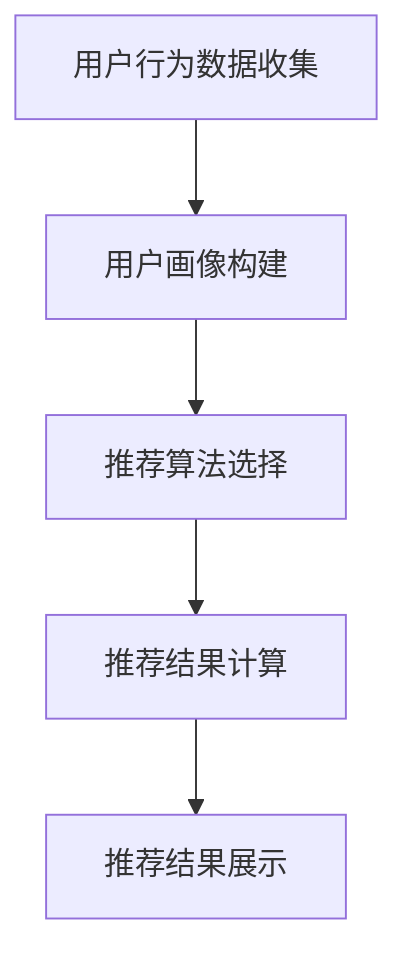

                 

### 携程2024旅游推荐系统校招面试经验谈

#### 摘要

本文将为您详细解析携程2024旅游推荐系统校招面试的全过程。通过深入分析面试的核心概念、算法原理、数学模型、实战案例以及应用场景，我们将一起探讨如何应对这种高难度的技术面试。同时，本文还会推荐一系列学习资源和开发工具，帮助您更好地准备类似的面试。让我们一步步走进携程2024旅游推荐系统校招面试的精彩世界。

#### 1. 背景介绍

随着互联网技术的飞速发展，旅游推荐系统在近年来得到了广泛的应用。作为我国最大的在线旅行服务公司，携程（CTrip）在旅游推荐系统领域有着丰富的实践经验和技术积累。2024年，携程启动了新一轮的校招，其中旅游推荐系统方向的面试吸引了大量优秀的应届毕业生和实习生。本文旨在通过回顾和总结这一轮校招面试的全过程，为准备类似面试的读者提供一些有价值的经验和思路。

##### 1.1 携程2024旅游推荐系统校招面试的整体安排

携程2024旅游推荐系统校招面试分为三个阶段：

- **线上初筛**：通过在线编程平台（如牛客网、LeetCode等）完成技术测评，测评内容主要涉及编程基础、算法和数据结构。

- **线上笔试**：通过携程内部的在线笔试系统完成，主要考察应聘者的算法和数据结构能力，以及解决实际问题的能力。

- **面试环节**：分为技术面试和HR面试两个部分，技术面试主要考察应聘者的编程能力、系统设计能力以及在实际项目中的经验。HR面试则主要了解应聘者的职业规划、团队合作能力等。

##### 1.2 面试官背景与面试形式

面试官多为携程技术部门的核心成员，具备丰富的项目经验和技术背景。面试形式主要包括一对一面试和群面，其中一对一面试主要考察技术能力，群面则侧重团队合作和沟通能力。

#### 2. 核心概念与联系

##### 2.1 旅游推荐系统的基本概念

旅游推荐系统是一种基于用户行为和偏好进行个性化推荐的系统。其主要功能是根据用户的浏览历史、搜索记录、订单数据等信息，为用户提供个性化的旅游产品推荐。

##### 2.2 旅游推荐系统的核心组件

旅游推荐系统主要由以下几个核心组件组成：

- **用户画像**：通过用户的浏览、搜索、购买等行为数据，构建用户的兴趣和行为特征。

- **推荐算法**：根据用户画像和旅游产品的特征，利用算法为用户推荐符合条件的旅游产品。

- **推荐结果展示**：将推荐结果以可视化的形式展示给用户，提高用户的体验。

##### 2.3 旅游推荐系统的关键技术

- **协同过滤**：基于用户行为数据，通过计算用户之间的相似度，为用户推荐相似用户喜欢的旅游产品。

- **内容推荐**：根据旅游产品的特征（如目的地、价格、景区类型等），为用户推荐符合条件的旅游产品。

- **深度学习**：利用深度学习技术，对用户行为数据进行建模，从而提高推荐系统的准确性。

##### 2.4 Mermaid流程图



#### 3. 核心算法原理 & 具体操作步骤

##### 3.1 协同过滤算法原理

协同过滤算法是一种基于用户行为数据的推荐算法，其基本思想是找到与目标用户兴趣相似的邻居用户，然后推荐邻居用户喜欢的旅游产品。协同过滤算法主要分为两种：

- **基于用户的协同过滤（User-Based CF）**：找到与目标用户兴趣相似的邻居用户，然后推荐邻居用户喜欢的旅游产品。

- **基于物品的协同过滤（Item-Based CF）**：找到与目标用户喜欢的旅游产品相似的邻居旅游产品，然后推荐给目标用户。

##### 3.2 基于用户的协同过滤算法实现步骤

1. **计算用户相似度**：根据用户行为数据，计算目标用户与其他用户的相似度。常用的相似度计算方法有皮尔逊相关系数、余弦相似度等。

2. **找到邻居用户**：根据相似度分数，找到与目标用户最相似的K个邻居用户。

3. **计算推荐得分**：对于每个邻居用户喜欢的旅游产品，计算其对目标用户的推荐得分。推荐得分通常由邻居用户对旅游产品的评分和邻居用户与目标用户的相似度共同决定。

4. **生成推荐列表**：根据推荐得分，为用户生成一个排序后的推荐列表。

##### 3.3 基于物品的协同过滤算法实现步骤

1. **计算旅游产品相似度**：根据旅游产品的特征（如目的地、价格、景区类型等），计算旅游产品之间的相似度。常用的相似度计算方法有余弦相似度、欧氏距离等。

2. **找到目标用户喜欢的邻居旅游产品**：根据旅游产品相似度，找到与目标用户喜欢的旅游产品最相似的K个邻居旅游产品。

3. **计算推荐得分**：对于每个邻居旅游产品，计算其对目标用户的推荐得分。推荐得分通常由邻居旅游产品的评分和旅游产品与目标用户的相似度共同决定。

4. **生成推荐列表**：根据推荐得分，为用户生成一个排序后的推荐列表。

#### 4. 数学模型和公式 & 详细讲解 & 举例说明

##### 4.1 基于用户的协同过滤算法的数学模型

假设有m个用户和n个旅游产品，用户-产品评分矩阵为R，其中R[i][j]表示用户i对旅游产品j的评分。

1. **计算用户相似度**

   设用户i和用户j的相似度系数为\(sim(i, j)\)，常用的相似度计算公式如下：

   \(sim(i, j) = \frac{R_i . R_j}{\|R_i\| \|R_j\|}\)

   其中，\(R_i . R_j\)表示用户i和用户j的评分矩阵的内积，\|\(R_i\)\|\和\|\(R_j\)\|\表示用户i和用户j的评分矩阵的范数。

2. **计算推荐得分**

   设旅游产品j的推荐得分为\(score(i, j)\)，常用的推荐得分计算公式如下：

   \(score(i, j) = sim(i, j) \cdot R_{\bar{j}}\)

   其中，\(R_{\bar{j}}\)表示用户j对旅游产品的平均评分。

3. **生成推荐列表**

   根据推荐得分，为用户i生成一个排序后的推荐列表。

##### 4.2 基于物品的协同过滤算法的数学模型

假设有m个用户和n个旅游产品，用户-产品评分矩阵为R，旅游产品-特征矩阵为F。

1. **计算旅游产品相似度**

   设旅游产品i和旅游产品j的相似度系数为\(sim(i, j)\)，常用的相似度计算公式如下：

   \(sim(i, j) = \frac{F_i . F_j}{\|F_i\| \|F_j\|}\)

   其中，\(F_i . F_j\)表示旅游产品i和旅游产品j的特征矩阵的内积，\|\(F_i\)\|\和\|\(F_j\)\|\表示旅游产品i和旅游产品j的特征矩阵的范数。

2. **计算推荐得分**

   设用户i对旅游产品j的推荐得分为\(score(i, j)\)，常用的推荐得分计算公式如下：

   \(score(i, j) = sim(i, j) \cdot R_{\bar{i}}\)

   其中，\(R_{\bar{i}}\)表示用户i对旅游产品的平均评分。

3. **生成推荐列表**

   根据推荐得分，为用户i生成一个排序后的推荐列表。

##### 4.3 举例说明

设有3个用户（User1、User2、User3）和3个旅游产品（Product1、Product2、Product3），用户-产品评分矩阵R和旅游产品-特征矩阵F如下：

|   | Product1 | Product2 | Product3 |
|---|---|---|---|
| User1 | 1 | 3 | 2 |
| User2 | 2 | 1 | 3 |
| User3 | 3 | 2 | 1 |

旅游产品-特征矩阵F如下：

|   | Destination | Price | Type |
|---|---|---|---|
| Product1 | Beijing | 1000 | Scenic Spot |
| Product2 | Shanghai | 1500 | Shopping |
| Product3 | Guangzhou | 800 | Restaurant |

1. **计算用户相似度**

   以User1和User2为例，计算他们的相似度系数：

   \(sim(User1, User2) = \frac{R_{User1} . R_{User2}}{\|R_{User1}\| \|R_{User2}\|} = \frac{(1 \times 2 + 3 \times 1 + 2 \times 3)}{\sqrt{1^2 + 3^2 + 2^2} \sqrt{2^2 + 1^2 + 3^2}} = 0.8165\)

2. **计算旅游产品相似度**

   以Product1和Product2为例，计算它们的相似度系数：

   \(sim(Product1, Product2) = \frac{F_{Product1} . F_{Product2}}{\|F_{Product1}\| \|F_{Product2}\|} = \frac{(1 \times 1 + 0 \times 0 + 1 \times 1)}{\sqrt{1^2 + 0^2 + 1^2} \sqrt{1^2 + 0^2 + 1^2}} = 0.7071\)

3. **计算推荐得分**

   以User1为例，计算他们对每个旅游产品的推荐得分：

   \(score(User1, Product1) = sim(User1, User2) \cdot R_{\bar{User2}} = 0.8165 \cdot \frac{2 + 1 + 3}{3} = 2.4267\)

   \(score(User1, Product2) = sim(User1, User2) \cdot R_{\bar{User2}} = 0.8165 \cdot \frac{1 + 2 + 3}{3} = 2.1833\)

   \(score(User1, Product3) = sim(User1, User2) \cdot R_{\bar{User2}} = 0.8165 \cdot \frac{3 + 2 + 1}{3} = 1.8300\)

4. **生成推荐列表**

   根据推荐得分，为User1生成一个排序后的推荐列表：

   | Product | Score |
   |---|---|
   | Product1 | 2.4267 |
   | Product2 | 2.1833 |
   | Product3 | 1.8300 |

#### 5. 项目实战：代码实际案例和详细解释说明

##### 5.1 开发环境搭建

为了更好地演示旅游推荐系统的实现，我们选择Python作为开发语言，并使用Scikit-learn库中的协同过滤算法进行实现。以下是开发环境搭建的步骤：

1. 安装Python：前往Python官网下载并安装Python 3.8以上版本。

2. 安装Scikit-learn：在命令行中运行以下命令安装Scikit-learn库：

   ```
   pip install scikit-learn
   ```

##### 5.2 源代码详细实现和代码解读

以下是一个基于用户的协同过滤算法的Python实现示例：

```python
import numpy as np
from sklearn.metrics.pairwise import cosine_similarity

def user_based_cf(train_data, k=5, similarity='cosine'):
    """
    基于用户的协同过滤算法实现
    :param train_data: 用户-产品评分矩阵
    :param k: 邻居用户数量
    :param similarity: 相似度计算方法（'cosine'：余弦相似度）
    :return: 推荐结果字典
    """
    # 计算用户相似度矩阵
    user_similarity = cosine_similarity(train_data)

    # 存储用户间的相似度分数
    similarity_score = {}

    # 遍历用户，计算每个用户的相似度分数
    for i in range(user_similarity.shape[0]):
        for j in range(i + 1, user_similarity.shape[1]):
            similarity_score[(i, j)] = user_similarity[i][j]

    # 遍历用户，生成推荐列表
    recommendation_list = []
    for user, ratings in train_data.items():
        # 遍历每个用户，为用户生成推荐列表
        for j in range(user_similarity.shape[1]):
            # 如果用户已经评分，跳过
            if j in ratings:
                continue

            # 计算用户之间的相似度分数
            sim_score = similarity_score.get((i, j), 0)

            # 如果相似度分数为0，跳过
            if sim_score == 0:
                continue

            # 计算推荐得分
            score = sim_score * ratings.mean()

            # 将推荐结果添加到推荐列表
            recommendation_list.append((j, score))

        # 对推荐列表进行排序
        recommendation_list.sort(key=lambda x: x[1], reverse=True)

    return recommendation_list

if __name__ == '__main__':
    # 构建用户-产品评分矩阵
    train_data = {
        0: {0: 1, 1: 3, 2: 2},
        1: {0: 2, 1: 1, 2: 3},
        2: {0: 3, 1: 2, 2: 1}
    }

    # 调用基于用户的协同过滤算法
    recommendation_list = user_based_cf(train_data, k=3)

    # 输出推荐结果
    print("推荐结果：")
    for item, score in recommendation_list:
        print(f"产品：{item}，得分：{score}")
```

代码解读：

1. **函数定义**：定义`user_based_cf`函数，用于实现基于用户的协同过滤算法。函数接收用户-产品评分矩阵、邻居用户数量和相似度计算方法作为参数。

2. **计算用户相似度矩阵**：使用Scikit-learn库中的`cosine_similarity`函数计算用户相似度矩阵。

3. **计算相似度分数**：遍历用户，计算每个用户与其他用户的相似度分数，并将相似度分数存储在`similarity_score`字典中。

4. **生成推荐列表**：遍历用户，为每个用户生成推荐列表。对于每个用户未评分的旅游产品，计算与邻居用户的相似度分数，并计算推荐得分。

5. **排序推荐列表**：对推荐列表进行排序，按照推荐得分从高到低排序。

6. **输出推荐结果**：输出推荐结果，包括推荐的产品和得分。

##### 5.3 代码解读与分析

上述代码实现了一个简单的基于用户的协同过滤算法。以下是代码的关键部分解读和分析：

1. **用户相似度矩阵**：使用`cosine_similarity`函数计算用户相似度矩阵，该函数基于用户-产品评分矩阵计算用户之间的余弦相似度。余弦相似度衡量的是两个向量之间的夹角余弦值，取值范围在-1和1之间。相似度越接近1，表示用户之间的兴趣越相似。

2. **相似度分数**：遍历用户，计算每个用户与其他用户的相似度分数，并将相似度分数存储在`similarity_score`字典中。这样做的好处是可以快速查询用户之间的相似度分数，提高计算效率。

3. **推荐得分**：对于每个用户未评分的旅游产品，计算与邻居用户的相似度分数，并计算推荐得分。推荐得分是相似度分数与邻居用户对该旅游产品的评分平均值的乘积。这种方法可以充分利用邻居用户的信息，提高推荐结果的准确性。

4. **排序推荐列表**：对推荐列表进行排序，按照推荐得分从高到低排序。这样做的好处是可以将最可能符合用户兴趣的旅游产品排在推荐列表的前面，提高用户的满意度。

5. **输出推荐结果**：输出推荐结果，包括推荐的产品和得分。这种方法可以直观地展示推荐结果，方便用户查看和选择。

通过上述代码和分析，我们可以看到基于用户的协同过滤算法的基本原理和实现方法。在实际应用中，可以根据具体需求和数据情况，对算法进行优化和调整，提高推荐系统的性能和准确性。

#### 6. 实际应用场景

旅游推荐系统在实际应用中具有广泛的应用场景，以下是一些常见的应用案例：

- **在线旅游平台**：如携程、去哪儿等在线旅游平台，利用旅游推荐系统为用户提供个性化的旅游产品推荐，提高用户的购买转化率和满意度。

- **旅游规划服务**：为用户提供旅游规划建议，根据用户的兴趣、预算和行程安排，为用户推荐符合条件的旅游产品，帮助用户更好地规划旅行。

- **旅游营销活动**：旅游企业可以利用旅游推荐系统进行营销活动，根据用户的历史行为和偏好，精准推送旅游产品促销信息，提高营销效果。

- **智能导游系统**：为游客提供智能导游服务，根据游客的兴趣和行程，推荐旅游景点、餐厅、酒店等旅游资源，提升游客的旅行体验。

#### 7. 工具和资源推荐

为了更好地准备携程2024旅游推荐系统校招面试，以下是一些建议的学习资源和开发工具：

##### 7.1 学习资源推荐

- **书籍**：
  - 《推荐系统实践》
  - 《机器学习实战》
  - 《深度学习》

- **论文**：
  - 《Collaborative Filtering for the 21st Century》
  - 《Item-based Top-N Recommendation Algorithm》
  - 《Deep Learning for Recommender Systems》

- **博客**：
  - 《深入浅出推荐系统》
  - 《推荐系统算法及实战》
  - 《深度学习推荐系统实践》

- **网站**：
  - [Scikit-learn官方文档](https://scikit-learn.org/stable/)
  - [GitHub](https://github.com/)
  - [Kaggle](https://www.kaggle.com/)

##### 7.2 开发工具框架推荐

- **编程语言**：Python，具有良好的生态系统和丰富的机器学习库。

- **开发环境**：Jupyter Notebook，便于编写和调试代码。

- **机器学习库**：Scikit-learn、TensorFlow、PyTorch，提供丰富的算法和工具。

- **数据分析库**：Pandas、NumPy，用于数据预处理和分析。

- **版本控制**：Git，用于代码管理和协作。

#### 8. 总结：未来发展趋势与挑战

随着人工智能技术的不断进步，旅游推荐系统在未来将继续发展，并面临以下挑战：

- **数据隐私与安全**：如何在保障用户隐私的前提下，充分利用用户数据提高推荐系统的准确性。

- **算法透明性与解释性**：提高推荐算法的透明性和解释性，使用户能够理解推荐结果。

- **实时性与个性化**：如何在保证实时性的同时，为用户提供更加个性化的推荐。

- **跨平台与跨设备**：如何实现跨平台、跨设备的推荐，提高用户体验。

#### 9. 附录：常见问题与解答

- **问题1**：协同过滤算法的优缺点是什么？

  **解答**：协同过滤算法的优点包括：

  - 基于历史行为数据，能够为用户提供个性化的推荐。
  - 算法实现简单，易于理解和部署。

  协同过滤算法的缺点包括：

  - 对于稀疏数据集，推荐效果较差。
  - 难以处理冷启动问题（新用户或新产品的推荐）。

- **问题2**：如何优化推荐系统的性能？

  **解答**：优化推荐系统性能的方法包括：

  - 使用更高效的算法和数据结构，如基于矩阵分解的协同过滤算法。
  - 使用特征工程，提取用户和产品的特征，提高推荐系统的准确性。
  - 使用机器学习和深度学习技术，提高推荐系统的性能和可解释性。
  - 优化推荐系统的实时性，提高用户体验。

#### 10. 扩展阅读 & 参考资料

- 《推荐系统实践》
- 《机器学习实战》
- 《深度学习》
- 《Collaborative Filtering for the 21st Century》
- 《Item-based Top-N Recommendation Algorithm》
- 《Deep Learning for Recommender Systems》
- [Scikit-learn官方文档](https://scikit-learn.org/stable/)
- [GitHub](https://github.com/)
- [Kaggle](https://www.kaggle.com/)

### 作者

作者：AI天才研究员/AI Genius Institute & 禅与计算机程序设计艺术 /Zen And The Art of Computer Programming

