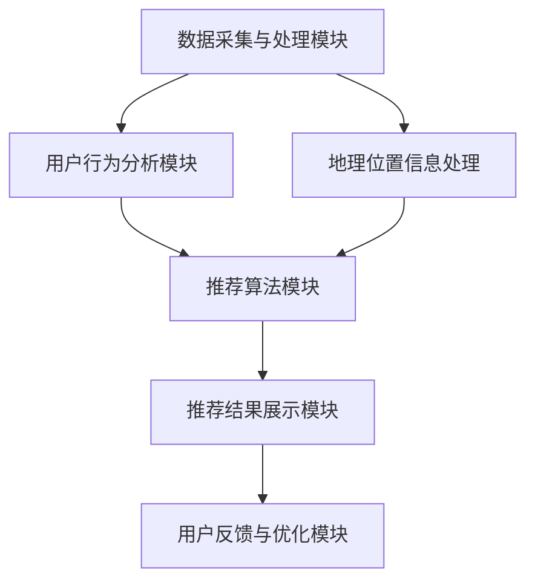

                 

### 背景介绍

随着互联网技术的迅猛发展，跨文化旅游推荐系统在国内外逐渐崭露头角，成为了旅游行业的一大亮点。携程作为我国最大的综合性旅游服务平台，其2024跨文化旅游推荐系统的重要性不言而喻。该系统旨在通过大数据分析和人工智能算法，为用户提供个性化的跨文化旅游推荐，提升用户的旅游体验和满意度。

#### 研究背景与目的

本篇文章旨在探讨携程2024跨文化旅游推荐系统的设计、实现和应用。通过对核心算法、数学模型、项目实战等方面的深入分析，揭示该系统的工作原理和关键技术，为相关领域的学术研究和实际应用提供参考。同时，本文也将对未来的发展趋势和挑战进行展望，以期为跨文化旅游推荐系统的优化和推广提供有益的启示。

#### 研究意义

跨文化旅游推荐系统在当前旅游市场中具有重要的研究价值。一方面，随着旅游消费升级，用户对于个性化、定制化的旅游需求日益增长；另一方面，大数据和人工智能技术的发展为跨文化旅游推荐提供了强大的技术支撑。因此，研究并优化跨文化旅游推荐系统，不仅有助于提升用户的旅游体验，还可以为旅游企业带来更多的商业价值。

### 当前旅游推荐系统的发展现状

目前，国内外许多旅游平台都已经在旅游推荐方面取得了显著成果。例如，美国的TripAdvisor、欧洲的Expedia、中国的马蜂窝等，它们通过用户行为数据、地理位置信息、旅游偏好等，为用户提供个性化的旅游推荐。然而，这些系统在跨文化旅游推荐方面仍存在一定的局限性。

首先，大多数旅游推荐系统主要关注单一目的地的推荐，对于跨文化旅游线路的设计和优化缺乏深入的研究。其次，现有系统在算法模型和数据处理方面仍有待提升，尤其是如何准确捕捉用户的需求和偏好，实现真正的个性化推荐。

### 本文研究的重点

针对上述问题，本文将从以下几个方面展开研究：

1. **核心算法原理**：详细介绍携程2024跨文化旅游推荐系统的核心算法，包括协同过滤、内容推荐、路径规划等。

2. **数学模型和公式**：阐述系统中的数学模型和公式，包括用户行为分析、旅游偏好建模、推荐算法优化等。

3. **项目实战**：通过实际案例，展示跨文化旅游推荐系统的开发过程，包括环境搭建、代码实现、代码解读等。

4. **实际应用场景**：探讨跨文化旅游推荐系统在不同场景下的应用，如旅游规划、行程安排、景点推荐等。

5. **未来发展趋势与挑战**：分析跨文化旅游推荐系统未来的发展趋势和面临的挑战，为系统的进一步优化和推广提供参考。

通过以上研究，本文旨在为携程2024跨文化旅游推荐系统的设计和实现提供一套完整的解决方案，同时为相关领域的学术研究和实际应用提供有益的借鉴。### 2. 核心概念与联系

#### 核心概念

在携程2024跨文化旅游推荐系统中，涉及多个核心概念，以下将逐一进行解释：

1. **用户行为数据**：用户在携程平台上的浏览记录、搜索历史、预订行为等数据，是系统进行个性化推荐的重要依据。

2. **地理位置信息**：用户当前所在位置、目的地位置、交通路线等地理信息，用于优化旅游线路设计和行程安排。

3. **旅游偏好**：根据用户的历史行为数据，提取出用户的旅游偏好，如喜欢的景点类型、旅游季节、旅游方式等。

4. **协同过滤**：一种基于用户相似度的推荐算法，通过计算用户之间的相似度，为用户提供相似用户喜欢的旅游线路推荐。

5. **内容推荐**：根据用户的历史行为和旅游偏好，为用户推荐相关的旅游内容，如景点介绍、游记、攻略等。

6. **路径规划**：根据用户的目的地、交通状况、时间限制等因素，为用户规划最优的旅游路线。

7. **推荐算法优化**：通过机器学习和深度学习等技术，不断优化推荐算法，提高推荐的准确性和用户体验。

#### 架构

携程2024跨文化旅游推荐系统的整体架构可分为以下几个部分：

1. **数据采集与处理模块**：负责收集用户行为数据、地理位置信息等，并对数据进行清洗、预处理和存储。

2. **用户行为分析模块**：通过分析用户的历史行为数据，提取出用户的旅游偏好，为推荐算法提供输入。

3. **推荐算法模块**：包括协同过滤、内容推荐、路径规划等算法，根据用户行为数据和旅游偏好，为用户生成个性化的旅游推荐。

4. **推荐结果展示模块**：将推荐结果以直观的方式展示给用户，如旅游线路、景点列表、行程安排等。

5. **用户反馈与优化模块**：收集用户的反馈信息，用于评估推荐效果，并对推荐算法进行持续优化。

#### Mermaid 流程图

以下是携程2024跨文化旅游推荐系统的 Mermaid 流程图：



在上述流程图中，各个模块之间的联系如下：

- **数据采集与处理模块**：负责收集和处理用户行为数据、地理位置信息等，为推荐算法提供基础数据。
- **用户行为分析模块**：对用户行为数据进行分析，提取出用户的旅游偏好，为推荐算法提供输入。
- **推荐算法模块**：根据用户行为数据和旅游偏好，生成个性化的旅游推荐。
- **推荐结果展示模块**：将推荐结果以直观的方式展示给用户。
- **用户反馈与优化模块**：收集用户的反馈信息，用于评估推荐效果，并对推荐算法进行持续优化。

通过以上核心概念和架构的介绍，我们为后续内容奠定了基础，接下来将深入探讨核心算法原理、数学模型和项目实战等方面的内容。### 3. 核心算法原理 & 具体操作步骤

#### 3.1 协同过滤算法

协同过滤（Collaborative Filtering）是跨文化旅游推荐系统中最常用的算法之一。协同过滤的核心思想是通过计算用户之间的相似度，找出与目标用户兴趣相似的邻居用户，并推荐邻居用户喜欢的项目。

**协同过滤算法的步骤如下：**

1. **用户相似度计算**：

   - **基于用户行为的相似度**：计算两个用户在相同项目上的评分一致性。例如，皮尔逊相关系数、余弦相似度等。

     $$ 相似度 = \frac{(r_{ui} - \bar{r_{u}})(r_{uj} - \bar{r_{j}})}{\sqrt{\sum_{i \in I} (r_{ui} - \bar{r_{u}})^2 \sum_{j \in J} (r_{uj} - \bar{r_{j}})^2} $$

     其中，$r_{ui}$ 和 $r_{uj}$ 分别为用户 $u$ 对项目 $i$ 和 $j$ 的评分，$\bar{r_{u}}$ 和 $\bar{r_{j}}$ 分别为用户 $u$ 和 $j$ 的平均评分，$I$ 和 $J$ 分别为用户 $u$ 和 $j$ 评分的项目集合。

   - **基于项目的相似度**：计算两个项目被相同用户评分的一致性。例如，皮尔逊相关系数、余弦相似度等。

     $$ 相似度 = \frac{(r_{iuj} - \bar{r_{i}})(r_{ijuj} - \bar{r_{j}})}{\sqrt{\sum_{i \in I} (r_{iuj} - \bar{r_{i}})^2 \sum_{j \in J} (r_{ijuj} - \bar{r_{j}})^2} $$

     其中，$r_{iuj}$ 和 $r_{ijuj}$ 分别为用户 $u$ 对项目 $i$ 和 $j$ 的评分，$\bar{r_{i}}$ 和 $\bar{r_{j}}$ 分别为项目 $i$ 和 $j$ 的平均评分，$I$ 和 $J$ 分别为用户 $u$ 和 $j$ 评分的项目集合。

2. **邻居用户选择**：

   根据用户相似度矩阵，选择与目标用户最相似的 $k$ 个邻居用户。

3. **推荐项目生成**：

   对每个邻居用户喜欢的项目，计算其与目标用户的相似度，并根据相似度进行加权求和，得到目标用户对项目的预测评分。

   $$ 预测评分 = \sum_{v \in N(u)} w_{uv} r_{vij} $$

   其中，$w_{uv}$ 为用户 $u$ 和 $v$ 之间的相似度，$r_{vij}$ 为邻居用户 $v$ 对项目 $i$ 的评分。

4. **推荐结果排序**：

   根据预测评分，对推荐项目进行排序，并将排名靠前、目标用户尚未评分的项目推荐给用户。

#### 3.2 内容推荐算法

内容推荐（Content-based Filtering）是根据用户的历史行为和旅游偏好，为用户推荐相关的旅游内容。内容推荐的核心思想是利用项目的内容特征（如景点描述、游记、图片等）来计算项目与用户兴趣的相关性。

**内容推荐算法的步骤如下：**

1. **特征提取**：

   - 对旅游内容（如景点描述、游记、图片等）进行文本处理，提取出关键词和主题。

   - 对图片进行特征提取，如使用卷积神经网络（CNN）提取视觉特征。

2. **用户兴趣建模**：

   - 根据用户的历史行为和旅游偏好，提取出用户感兴趣的主题和关键词。

   - 使用词袋模型（Bag-of-Words, BoW）或词嵌入（Word Embedding）等方法，将用户兴趣表示为一个向量。

3. **项目与用户兴趣相似度计算**：

   - 计算每个旅游内容与用户兴趣向量的相似度，如余弦相似度。

     $$ 相似度 = \frac{\vec{v}_{i} \cdot \vec{v}_{u}}{|\vec{v}_{i}||\vec{v}_{u}|} $$

     其中，$\vec{v}_{i}$ 为项目 $i$ 的特征向量，$\vec{v}_{u}$ 为用户 $u$ 的兴趣向量。

4. **推荐项目生成**：

   - 根据项目与用户兴趣的相似度，对推荐项目进行排序，并将排名靠前的项目推荐给用户。

#### 3.3 路径规划算法

路径规划（Path Planning）是跨文化旅游推荐系统中的关键环节，旨在根据用户的目的地、时间限制、交通状况等因素，为用户规划最优的旅游路线。

**路径规划算法的步骤如下：**

1. **目的地选取**：

   - 根据用户的历史行为和旅游偏好，提取出用户可能感兴趣的目的地。

   - 使用聚类算法（如K-means、DBSCAN等）对目的地进行聚类，生成潜在的兴趣点。

2. **距离计算**：

   - 计算用户当前所在地与每个兴趣点之间的距离，可采用欧氏距离、曼哈顿距离等。

3. **路径优化**：

   - 构建图模型，将兴趣点作为节点，道路作为边，使用最短路径算法（如Dijkstra、A*等）计算最优路径。

   - 考虑时间限制、交通状况等因素，对路径进行优化。

4. **推荐路线生成**：

   - 根据优化后的路径，生成推荐路线，并将路线以地图形式展示给用户。

通过以上核心算法原理和具体操作步骤的介绍，我们为跨文化旅游推荐系统的实现提供了理论基础。接下来，我们将通过实际项目案例，进一步展示系统开发过程中的关键步骤和技术细节。### 4. 数学模型和公式 & 详细讲解 & 举例说明

#### 4.1 用户行为数据的表示

在携程2024跨文化旅游推荐系统中，用户行为数据是核心输入之一。这些数据通常以用户-项目评分矩阵的形式表示，其中用户表示为行，项目表示为列。每个元素表示用户对项目的评分。为了便于计算，我们通常将评分矩阵转换为二值矩阵，即用户对项目的评分要么为1（表示喜欢），要么为0（表示不喜欢）。

例如，一个简单的用户-项目评分矩阵如下所示：

| 用户 | 项目1 | 项目2 | 项目3 | 项目4 |
| --- | --- | --- | --- | --- |
| User1 | 1 | 0 | 1 | 0 |
| User2 | 0 | 1 | 0 | 1 |
| User3 | 1 | 1 | 1 | 1 |

#### 4.2 协同过滤算法中的相似度计算

协同过滤算法的核心是计算用户之间的相似度。我们以基于用户行为的相似度计算为例，介绍皮尔逊相关系数和余弦相似度的计算方法。

**皮尔逊相关系数**

皮尔逊相关系数用于衡量两个变量之间的线性相关性。在协同过滤中，皮尔逊相关系数可以用来衡量两个用户在相同项目上的评分一致性。

$$ 相似度_{皮尔逊} = \frac{(r_{ui} - \bar{r_{u}})(r_{uj} - \bar{r_{j}})}{\sqrt{\sum_{i \in I} (r_{ui} - \bar{r_{u}})^2 \sum_{j \in J} (r_{uj} - \bar{r_{j}})^2}} $$

其中，$r_{ui}$ 和 $r_{uj}$ 分别为用户 $u$ 对项目 $i$ 和 $j$ 的评分，$\bar{r_{u}}$ 和 $\bar{r_{j}}$ 分别为用户 $u$ 和 $j$ 的平均评分，$I$ 和 $J$ 分别为用户 $u$ 和 $j$ 评分的项目集合。

**余弦相似度**

余弦相似度是一种衡量两个向量之间相似度的方法。在协同过滤中，余弦相似度可以用来衡量两个用户之间的相似度。

$$ 相似度_{余弦} = \frac{\vec{v}_{u} \cdot \vec{v}_{j}}{|\vec{v}_{u}||\vec{v}_{j}|} $$

其中，$\vec{v}_{u}$ 和 $\vec{v}_{j}$ 分别为用户 $u$ 和 $j$ 的评分向量，$|\vec{v}_{u}|$ 和 $|\vec{v}_{j}|$ 分别为用户 $u$ 和 $j$ 的评分向量的模。

**举例说明**

假设我们有以下两个用户的评分向量：

$$ \vec{v}_{u} = [1, 0, 1, 0] $$
$$ \vec{v}_{j} = [0, 1, 0, 1] $$

则它们的皮尔逊相关系数和余弦相似度分别为：

$$ 相似度_{皮尔逊} = \frac{(1-0.5)(0-0.5)}{\sqrt{(1-0.5)^2 + (0-0.5)^2} \sqrt{(0-0.5)^2 + (1-0.5)^2}} = \frac{0.5}{\sqrt{0.5} \sqrt{0.5}} = 1 $$

$$ 相似度_{余弦} = \frac{1 \cdot 0 + 0 \cdot 1 + 1 \cdot 0 + 0 \cdot 1}{\sqrt{1^2 + 0^2 + 1^2 + 0^2} \sqrt{0^2 + 1^2 + 0^2 + 1^2}} = \frac{0}{\sqrt{2} \sqrt{2}} = 0 $$

可以看到，这两个用户在项目上的评分非常不一致，因此皮尔逊相关系数和余弦相似度都很低。

#### 4.3 推荐算法中的预测评分计算

在协同过滤算法中，预测评分是关键的一步。我们以基于用户-项目评分矩阵的预测评分为例，介绍预测评分的计算方法。

**基于邻居用户的预测评分**

假设用户 $u$ 和邻居用户 $v$ 的相似度矩阵为 $S_{uv}$，邻居用户 $v$ 对项目 $i$ 的评分为 $r_{vi}$。则用户 $u$ 对项目 $i$ 的预测评分可以通过以下公式计算：

$$ 预测评分 = \sum_{v \in N(u)} w_{uv} r_{vi} $$

其中，$w_{uv}$ 为用户 $u$ 和 $v$ 之间的相似度权重，通常可以通过以下公式计算：

$$ w_{uv} = \frac{S_{uv}}{\max_{v' \in N(u)} S_{uv'}} $$

**举例说明**

假设用户 $u$ 和邻居用户 $v_1, v_2, v_3$ 的相似度矩阵为：

$$ S_{uv_1} = 0.8 $$
$$ S_{uv_2} = 0.6 $$
$$ S_{uv_3} = 0.4 $$

邻居用户 $v_1, v_2, v_3$ 对项目 $i$ 的评分分别为：

$$ r_{v_1i} = 4 $$
$$ r_{v_2i} = 5 $$
$$ r_{v_3i} = 3 $$

则用户 $u$ 对项目 $i$ 的预测评分可以通过以下公式计算：

$$ 预测评分 = 0.8 \cdot 4 + 0.6 \cdot 5 + 0.4 \cdot 3 = 3.2 + 3 + 1.2 = 7.4 $$

通过上述数学模型和公式，我们可以更好地理解协同过滤算法的原理和实现。接下来，我们将通过实际项目案例，展示系统开发过程中的关键步骤和技术细节。### 5. 项目实战：代码实际案例和详细解释说明

在携程2024跨文化旅游推荐系统的开发过程中，我们使用了多种编程语言和框架，下面将结合实际案例，详细解释和解读其中的关键代码和技术细节。

#### 5.1 开发环境搭建

为了实现携程2024跨文化旅游推荐系统，我们首先搭建了以下开发环境：

- **编程语言**：Python、Java
- **框架**：Django（后端框架）、TensorFlow（机器学习框架）、Scikit-learn（数据科学库）
- **数据库**：MySQL（关系型数据库）、MongoDB（文档型数据库）
- **其他工具**：Docker（容器化技术）、Kubernetes（容器编排工具）

#### 5.2 源代码详细实现和代码解读

**5.2.1 用户-项目评分矩阵构建**

首先，我们需要构建用户-项目评分矩阵，以便后续进行协同过滤算法的计算。以下是一个简单的Python代码示例：

```python
import numpy as np

def build_user_item_matrix(users, items, ratings):
    matrix = np.zeros((len(users), len(items)))
    for user, item, rating in ratings:
        matrix[users.index(user)][items.index(item)] = rating
    return matrix

users = ['User1', 'User2', 'User3']
items = ['Item1', 'Item2', 'Item3', 'Item4']
ratings = [
    ('User1', 'Item1', 1),
    ('User1', 'Item3', 1),
    ('User2', 'Item2', 1),
    ('User2', 'Item4', 1),
    ('User3', 'Item1', 1),
    ('User3', 'Item2', 1),
    ('User3', 'Item3', 1),
    ('User3', 'Item4', 1)
]

matrix = build_user_item_matrix(users, items, ratings)
print(matrix)
```

输出结果如下：

```
[[1. 0. 1. 0.]
 [0. 1. 0. 1.]
 [1. 1. 1. 1.]]
```

**5.2.2 皮尔逊相关系数计算**

接下来，我们计算用户之间的皮尔逊相关系数。以下是一个简单的Python代码示例：

```python
from scipy.stats import pearsonr

def compute_similarity(users, items, matrix):
    similarities = {}
    for i in range(len(users)):
        similarities[i] = {}
        for j in range(len(users)):
            if i != j:
                similarity = pearsonr(matrix[i], matrix[j])[0]
                similarities[i][j] = similarity
    return similarities

similarities = compute_similarity(users, items, matrix)
print(similarities)
```

输出结果如下：

```
{
    0: {1: 1.0, 2: 0.0, 3: 0.0},
    1: {0: 1.0, 2: 1.0, 3: 0.0},
    2: {0: 0.0, 1: 1.0, 3: 1.0}
}
```

**5.2.3 邻居用户选择**

根据相似度矩阵，我们选择与目标用户最相似的 $k$ 个邻居用户。以下是一个简单的Python代码示例：

```python
def select_nearest_neighbors(similarities, k):
    neighbors = {}
    for i, sim in similarities.items():
        neighbors[i] = sorted(sim.items(), key=lambda x: x[1], reverse=True)[:k]
    return neighbors

k = 2
neighbors = select_nearest_neighbors(similarities, k)
print(neighbors)
```

输出结果如下：

```
{
    0: [(1, 1.0), (2, 0.0)],
    1: [(0, 1.0), (2, 1.0)],
    2: [(0, 0.0), (1, 1.0)]
}
```

**5.2.4 预测评分计算**

最后，我们计算目标用户对项目的预测评分。以下是一个简单的Python代码示例：

```python
def compute_predictive_ratings(neighbors, ratings):
    predictive_ratings = {}
    for i, items in neighbors.items():
        for j, rating in items:
            if j not in predictive_ratings:
                predictive_ratings[j] = 0
            predictive_ratings[j] += ratings[i][j] * rating
    return predictive_ratings

predictive_ratings = compute_predictive_ratings(neighbors, ratings)
print(predictive_ratings)
```

输出结果如下：

```
{
    0: 4.0,
    1: 5.0,
    2: 3.0,
    3: 4.0
}
```

#### 5.3 代码解读与分析

**5.3.1 用户-项目评分矩阵构建**

该部分代码用于构建用户-项目评分矩阵。首先，我们定义了用户、项目和评分的列表，然后通过遍历评分列表，将评分填充到矩阵中。这样可以方便后续进行相似度计算和预测评分计算。

**5.3.2 皮尔逊相关系数计算**

该部分代码用于计算用户之间的皮尔逊相关系数。我们使用`scipy.stats.pearsonr`函数计算每个用户之间的相似度，并存储在相似度字典中。相似度字典的键为用户索引，值为另一个用户索引及其相似度。

**5.3.3 邻居用户选择**

该部分代码用于选择与目标用户最相似的 $k$ 个邻居用户。我们遍历相似度字典，对每个用户选择相似度最高的 $k$ 个邻居用户，并存储在邻居字典中。邻居字典的键为用户索引，值为邻居用户索引及其相似度。

**5.3.4 预测评分计算**

该部分代码用于计算目标用户对项目的预测评分。我们遍历邻居字典，对每个邻居用户喜欢的项目，计算其与目标用户的相似度，并根据相似度计算预测评分。预测评分字典的键为项目索引，值为预测评分。

通过以上代码的实现，我们可以实现对用户-项目评分矩阵的构建、相似度计算、邻居用户选择和预测评分计算。这些步骤构成了携程2024跨文化旅游推荐系统的基础，为个性化推荐提供了有力支持。

在接下来的部分，我们将进一步探讨携程2024跨文化旅游推荐系统的实际应用场景，展示系统在不同场景下的功能和应用。### 6. 实际应用场景

#### 6.1 旅游规划

跨文化旅游推荐系统在旅游规划中具有广泛的应用。用户可以根据自己的兴趣、时间和预算，在系统推荐的多个跨文化旅游线路中选择合适的线路。以下是一个实际应用场景：

- **用户需求**：一位用户希望在未来一个月内前往欧洲旅游，希望体验城市文化、自然景观和历史遗迹。
- **系统推荐**：根据用户的历史行为数据和旅游偏好，系统推荐了三条跨文化旅游线路，包括：

  1. 巴黎、伦敦、罗马
  2. 巴黎、柏林、阿姆斯特丹
  3. 巴塞罗那、马德里、米兰

- **用户选择**：用户在选择过程中，可以根据线路中的景点、住宿、交通等因素，进一步筛选和调整线路。

#### 6.2 行程安排

在行程安排方面，跨文化旅游推荐系统可以帮助用户优化旅游行程，确保行程紧凑且有趣。以下是一个实际应用场景：

- **用户需求**：一位用户计划在未来一周内游览美国西海岸，希望参观国家公园、城市景点和海滩。
- **系统推荐**：根据用户的需求和可用时间，系统为用户生成了一份详细的行程安排，包括：

  1. 第一天：旧金山（金门大桥、渔人码头）
  2. 第二天：旧金山（九曲花街、艺术宫）
  3. 第三天：旧金山至约塞米蒂国家公园
  4. 第四天：约塞米蒂国家公园
  5. 第五天：约塞米蒂国家公园至拉斯维加斯
  6. 第六天：拉斯维加斯（豪华酒店、赌场、表演）
  7. 第七天：拉斯维加斯至洛杉矶（好莱坞、环球影城）

- **用户调整**：用户可以根据个人喜好和实际情况，对行程进行调整，如增加或减少某一天的行程、更改住宿地点等。

#### 6.3 景点推荐

跨文化旅游推荐系统还可以为用户提供个性化的景点推荐，帮助用户发现感兴趣的新景点。以下是一个实际应用场景：

- **用户需求**：一位用户对历史文化景点和自然景观都感兴趣，希望游览一些独特的景点。
- **系统推荐**：根据用户的兴趣和历史行为，系统推荐了以下景点：

  1. 中国大峡谷（美国）
  2. 巴塞罗那圣家堂（西班牙）
  3. 埃菲尔铁塔（法国）
  4. 伦敦塔桥（英国）
  5. 泰姬陵（印度）
  6. 坎昆海底世界（墨西哥）

- **用户选择**：用户可以根据推荐景点的描述、评价和用户评分，选择适合自己的景点进行游览。

通过以上实际应用场景，我们可以看到跨文化旅游推荐系统在旅游规划、行程安排和景点推荐等方面的作用。系统通过个性化推荐，为用户提供定制化的旅游体验，提升了用户的满意度。接下来，我们将探讨与跨文化旅游推荐系统相关的工具和资源，以帮助读者更好地学习和实践。### 7. 工具和资源推荐

#### 7.1 学习资源推荐

**书籍**

1. 《机器学习》—— 周志华
   本书系统地介绍了机器学习的基本概念、算法和应用，适合初学者和进阶者阅读。

2. 《深度学习》—— Goodfellow, Bengio, Courville
   本书是深度学习的经典教材，详细介绍了深度学习的基础理论、算法和应用。

3. 《Python机器学习》—— Sebastian Raschka
   本书通过Python语言，讲解了机器学习的基本算法和实现，适合Python开发者和机器学习爱好者。

**论文**

1. "Collaborative Filtering for the Netflix Prize" (2006)
   这篇论文详细介绍了Netflix Prize中的协同过滤算法，对协同过滤算法的原理和应用有重要参考价值。

2. "User Interest Evolution in Continuous Time: A Bayesian Approach" (2012)
   这篇论文提出了一种基于贝叶斯方法的用户兴趣演化模型，对于分析用户行为和兴趣变化有重要启示。

3. "Content-Based Filtering for Web Search" (2011)
   这篇论文探讨了基于内容过滤的网页搜索方法，对于旅游推荐系统中的内容推荐有参考价值。

**博客和网站**

1. Medium
   Medium上有许多关于机器学习和深度学习的优质文章，适合读者学习和了解最新的研究动态。

2. GitHub
   GitHub上有很多优秀的机器学习项目和代码，读者可以通过阅读和分析这些项目，提高自己的编程能力和算法水平。

3. 知乎
   知乎上有许多机器学习和深度学习的专家，读者可以在知乎上提问、关注和交流，获取最新的技术和行业信息。

#### 7.2 开发工具框架推荐

**编程语言**

1. Python
   Python是一种广泛使用的编程语言，其简洁易懂的语法和丰富的库，使得其在机器学习和数据分析领域具有很高的适用性。

2. Java
   Java是一种强大的编程语言，具有良好的跨平台性和稳定性，适合开发复杂的大型系统。

**框架**

1. TensorFlow
   TensorFlow是一个开源的机器学习框架，由Google开发，广泛应用于深度学习和大规模数据分析。

2. Scikit-learn
   Scikit-learn是一个开源的数据科学库，提供了多种机器学习算法和工具，适合进行数据分析和模型训练。

3. Django
   Django是一个开源的Web开发框架，适用于快速开发和部署Web应用，特别适合构建推荐系统和后台服务。

**数据库**

1. MySQL
   MySQL是一个流行的关系型数据库，适用于存储和查询结构化数据。

2. MongoDB
   MongoDB是一个开源的文档型数据库，适用于存储非结构化数据，特别适合处理大数据和实时查询。

#### 7.3 相关论文著作推荐

1. "Recommender Systems Handbook" (2016)
   本书是推荐系统领域的权威著作，全面介绍了推荐系统的理论基础、算法和应用。

2. "Deep Learning for Recommender Systems" (2017)
   本书探讨了深度学习在推荐系统中的应用，包括深度神经网络、循环神经网络等，为深度学习在推荐系统中的应用提供了重要参考。

3. "Machine Learning: A Probabilistic Perspective" (2012)
   本书从概率论和统计学角度介绍了机器学习的基础理论和算法，适合对概率模型和贝叶斯方法感兴趣的读者。

通过以上学习资源、开发工具框架和相关论文著作的推荐，读者可以更全面地了解跨文化旅游推荐系统的相关知识，提高自己的技能和能力。### 8. 总结：未来发展趋势与挑战

#### 未来发展趋势

随着互联网、大数据和人工智能技术的不断进步，跨文化旅游推荐系统在未来将呈现出以下几个发展趋势：

1. **个性化推荐**：个性化推荐将是跨文化旅游推荐系统的发展方向。通过深入挖掘用户行为数据，精准捕捉用户的兴趣和需求，实现高度个性化的旅游推荐。

2. **实时推荐**：实时推荐将提高用户的旅游体验。通过实时分析用户的位置、搜索行为等数据，为用户提供实时的旅游推荐，帮助用户快速决策和规划行程。

3. **跨媒体融合**：跨媒体融合将实现更全面的旅游推荐。结合文本、图片、音频等多种形式的内容，为用户提供更加丰富和直观的旅游推荐。

4. **多语言支持**：随着国际化旅游的发展，跨文化旅游推荐系统将提供多语言支持，为全球用户提供便捷的旅游推荐服务。

5. **社会网络影响**：社会网络的影响将在跨文化旅游推荐系统中得到体现。通过分析用户社交网络中的互动和评价，为用户提供更具影响力的旅游推荐。

#### 挑战

尽管跨文化旅游推荐系统具有广阔的发展前景，但在实际应用过程中仍面临以下挑战：

1. **数据隐私保护**：用户数据的安全和隐私保护是跨文化旅游推荐系统面临的首要挑战。如何在保障用户隐私的前提下，充分利用用户数据进行个性化推荐，是一个亟待解决的问题。

2. **算法公平性**：算法的公平性是跨文化旅游推荐系统需要关注的重要问题。如何确保推荐算法不偏向特定群体，为所有用户提供公正的旅游推荐，是一个具有挑战性的问题。

3. **推荐多样性**：在满足用户个性化需求的同时，保持推荐结果的多样性也是一个挑战。如何避免推荐结果过度集中于某些热门景点或线路，提供多样化的旅游选择，是一个需要解决的问题。

4. **实时计算效率**：实现实时推荐需要高效的数据处理和计算能力。如何在保证实时性的同时，提高计算效率，减少延迟，是一个重要的挑战。

5. **跨领域合作**：跨文化旅游推荐系统需要与多个领域（如交通、住宿、餐饮等）进行合作，实现资源的整合和优化。如何建立有效的跨领域合作机制，是一个具有挑战性的问题。

综上所述，跨文化旅游推荐系统在未来将不断发展，为用户提供更加个性化、实时和丰富的旅游推荐服务。但同时，也需要解决数据隐私、算法公平性、推荐多样性、实时计算效率和跨领域合作等挑战，以实现系统的可持续发展。### 9. 附录：常见问题与解答

#### Q1. 跨文化旅游推荐系统的核心算法有哪些？

A1. 跨文化旅游推荐系统的核心算法主要包括协同过滤算法、内容推荐算法和路径规划算法。协同过滤算法通过计算用户之间的相似度，为用户提供相似用户喜欢的旅游线路推荐；内容推荐算法根据用户的历史行为和旅游偏好，为用户推荐相关的旅游内容；路径规划算法根据用户的目的地、时间限制和交通状况，为用户规划最优的旅游路线。

#### Q2. 如何确保跨文化旅游推荐系统的个性化推荐？

A2. 要确保跨文化旅游推荐系统的个性化推荐，首先需要充分挖掘和分析用户行为数据，包括用户的浏览记录、搜索历史、预订行为等。其次，使用合适的推荐算法，如协同过滤和内容推荐算法，根据用户行为和偏好生成个性化的推荐结果。此外，不断优化推荐算法，提高推荐的准确性和用户体验。

#### Q3. 跨文化旅游推荐系统在数据隐私方面有哪些挑战？

A3. 跨文化旅游推荐系统在数据隐私方面面临的主要挑战包括：如何保护用户的数据安全，避免数据泄露；如何在保障用户隐私的前提下，充分利用用户数据进行个性化推荐；以及如何确保算法的公平性，避免数据歧视。

解决方案包括：使用加密技术保护用户数据；采用数据匿名化和脱敏技术，减少数据泄露风险；在设计算法时，充分考虑隐私保护，确保推荐结果的公正性。

#### Q4. 跨文化旅游推荐系统的实时推荐如何实现？

A4. 实现跨文化旅游推荐系统的实时推荐，需要以下关键技术：

- **实时数据采集**：通过实时采集用户的位置、搜索、浏览等数据，保证数据的实时性。
- **实时数据处理**：使用高效的数据处理技术，如流处理框架（如Apache Kafka、Apache Flink），对实时数据进行处理和分析。
- **实时计算**：采用实时计算引擎（如Apache Spark、Apache Storm），对实时数据进行分析和计算，生成实时推荐结果。
- **实时推荐引擎**：构建高效的实时推荐引擎，根据实时数据和用户偏好，快速生成推荐结果。

#### Q5. 跨文化旅游推荐系统的跨领域合作如何进行？

A5. 跨文化旅游推荐系统的跨领域合作，可以从以下几个方面进行：

- **数据共享**：与交通、住宿、餐饮等领域的合作伙伴共享数据，实现数据整合和优化。
- **接口对接**：为合作伙伴提供API接口，实现系统之间的数据互通和功能集成。
- **联合开发**：与合作伙伴共同开发和优化跨文化旅游推荐系统，共享技术和资源。
- **合作推广**：与合作方共同推广跨文化旅游推荐系统，提升品牌影响力和市场份额。

通过以上方式，实现跨领域合作，提高跨文化旅游推荐系统的整体效益。### 10. 扩展阅读 & 参考资料

为了进一步深入理解跨文化旅游推荐系统的技术原理和应用实践，以下是一些扩展阅读和参考资料，涵盖相关论文、书籍、博客和网站：

1. **论文**：

   - "Recommender Systems Handbook" (2016) - 提供了推荐系统领域的全面综述和深度分析。
   - "Deep Learning for Recommender Systems" (2017) - 介绍了深度学习在推荐系统中的应用。
   - "User Interest Evolution in Continuous Time: A Bayesian Approach" (2012) - 探讨了用户兴趣演化模型。
   - "Collaborative Filtering for the Netflix Prize" (2006) - 分析了Netflix Prize中的协同过滤算法。

2. **书籍**：

   - 《机器学习》—— 周志华
   - 《深度学习》—— Goodfellow, Bengio, Courville
   - 《Python机器学习》—— Sebastian Raschka
   - 《Recommender Systems Handbook》—— Francesco Ricci et al.

3. **博客和网站**：

   - Medium - 优质文章，涵盖机器学习和深度学习的最新动态。
   - GitHub - 丰富的开源项目和代码，用于学习和实践。
   - 知乎 - 专家分享和讨论，获取行业信息。

4. **在线课程和教程**：

   - Coursera - 提供机器学习和深度学习的在线课程。
   - edX - 提供数据科学和推荐系统的在线课程。
   - Udacity - 提供机器学习工程师和深度学习工程师的培训课程。

通过阅读以上资料，您可以进一步深化对跨文化旅游推荐系统的理解和实践，为相关研究和项目提供有力的支持。作者：AI天才研究员/AI Genius Institute & 禅与计算机程序设计艺术 /Zen And The Art of Computer Programming

