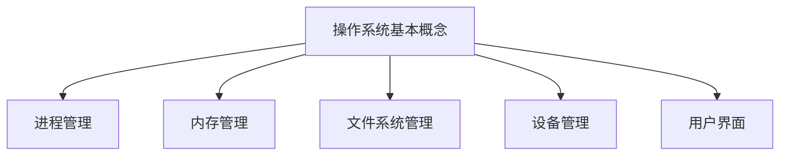

                 

# 操作系统的发展历史与趋势

## 关键词
- 操作系统
- 计算机历史
- 软件发展
- 技术趋势
- 系统架构

## 摘要

本文旨在深入探讨操作系统的发展历程及其未来趋势。通过回顾操作系统的起源、关键阶段以及主要技术变革，我们能够更好地理解现代操作系统的功能和特性。同时，本文还将分析当前操作系统领域的前沿技术和研究趋势，探讨未来操作系统可能面临的挑战和机遇。通过这篇文章，读者将获得关于操作系统发展的全面视角，并对未来的技术进步有所期待。

## 1. 背景介绍

### 1.1 操作系统的概念

操作系统（Operating System，简称OS）是计算机系统中最重要的软件之一。它负责管理计算机硬件资源，包括处理器、内存、存储设备等，并提供一个平台，使应用程序能够高效地运行。操作系统的主要功能包括进程管理、内存管理、文件系统管理、设备管理和用户界面等。

### 1.2 操作系统的历史背景

操作系统的起源可以追溯到20世纪50年代。当时，计算机系统非常庞大且昂贵，一般只有大型企业和政府机构能够承担。计算机操作主要依赖于汇编语言，程序员需要手动管理硬件资源，这大大降低了编程效率和可维护性。为了解决这些问题，操作系统应运而生。

### 1.3 操作系统的早期阶段

早期的操作系统主要是批处理系统，如IBM的OS/360和UNIVAC的VAX。这些系统的主要特点是能够自动处理大量数据，提高计算机的利用率和效率。批处理系统通常依赖于作业控制语言（Job Control Language，简称JCL），程序员使用JCL来描述和调度作业。

### 1.4 操作系统的演变

随着计算机硬件技术的发展和软件需求的增长，操作系统也在不断演进。20世纪60年代，分时操作系统（如UNIX和Multics）的出现，使得多个用户可以同时访问计算机系统，提高了系统的利用率。20世纪70年代，微型计算机和微型操作系统的兴起，推动了个人计算机的发展。

### 1.5 操作系统的现代阶段

进入21世纪，操作系统进入了高度集成和多样化的阶段。现代操作系统不仅支持个人计算机和服务器，还支持移动设备、嵌入式系统、云计算等。Linux、Windows、macOS等操作系统已经成为主流，各自有着广泛的应用和用户基础。

## 2. 核心概念与联系

### 2.1 操作系统的基本概念

- **进程管理**：操作系统负责创建、调度和终止进程，管理进程的并发执行。
- **内存管理**：操作系统负责分配和回收内存资源，确保多个进程能够高效地共享内存。
- **文件系统管理**：操作系统提供文件的组织、存储和访问机制。
- **设备管理**：操作系统管理计算机的输入输出设备，如磁盘、打印机、网络设备等。
- **用户界面**：操作系统提供用户与计算机交互的界面，可以是命令行界面或图形用户界面。

### 2.2 操作系统的架构

操作系统的架构可以分为单层架构、双层架构和多层架构。单层架构将所有功能集成在一个层次中，而双层架构将内核和用户空间分开。多层架构则进一步将系统功能划分为多个层次，如设备驱动层、进程管理层和文件系统层。

### 2.3 操作系统的分类

操作系统可以分为多种类型，包括单用户操作系统、多用户操作系统、实时操作系统、嵌入式操作系统、网络操作系统等。每种类型的操作系统都有其特定的应用场景和特点。

### 2.4 操作系统的Mermaid流程图



## 3. 核心算法原理 & 具体操作步骤

### 3.1 进程管理算法

进程管理是操作系统的核心功能之一。操作系统通过以下步骤来管理进程：

1. **进程创建**：操作系统根据需要创建新的进程。进程创建涉及为进程分配资源，如内存空间、文件描述符等。
2. **进程调度**：操作系统根据特定的调度算法（如轮转调度、优先级调度等）选择下一个执行的进程。
3. **进程终止**：操作系统在进程执行完毕或异常退出时释放其占用的资源。

### 3.2 内存管理算法

内存管理涉及以下关键步骤：

1. **内存分配**：操作系统根据进程的需求为其分配内存。
2. **内存回收**：操作系统在进程释放内存时回收这些内存。
3. **内存交换**：如果内存不足，操作系统将部分内存数据交换到硬盘上的交换区。

### 3.3 文件系统管理算法

文件系统管理涉及以下主要任务：

1. **文件创建**：操作系统创建新的文件，并为其分配唯一的标识符。
2. **文件读写**：操作系统提供读写文件的接口。
3. **文件删除**：操作系统删除不再需要的文件，并释放其占用的空间。

### 3.4 设备管理算法

设备管理包括以下关键步骤：

1. **设备分配**：操作系统为进程分配所需的输入输出设备。
2. **设备驱动**：操作系统加载并运行设备驱动程序，以处理设备的具体操作。
3. **设备释放**：操作系统在进程不再使用设备时释放这些设备。

### 3.5 用户界面算法

用户界面包括以下主要功能：

1. **命令行界面**：操作系统提供命令行接口，允许用户通过输入命令与系统交互。
2. **图形用户界面**：操作系统提供图形界面，允许用户通过图形界面与应用程序交互。

## 4. 数学模型和公式 & 详细讲解 & 举例说明

### 4.1 进程调度算法的数学模型

进程调度算法可以用以下公式表示：

$$
S(n) = \frac{1}{n}\sum_{i=1}^{n} C_i
$$

其中，$S(n)$ 表示平均等待时间，$C_i$ 表示第 $i$ 个进程的等待时间。

### 4.2 内存分配算法的数学模型

内存分配可以用以下公式表示：

$$
M(n) = \sum_{i=1}^{n} m_i
$$

其中，$M(n)$ 表示总的内存占用，$m_i$ 表示第 $i$ 个进程的内存占用。

### 4.3 文件读写性能的数学模型

文件读写性能可以用以下公式表示：

$$
P(n) = \frac{r}{t}
$$

其中，$P(n)$ 表示读写速度，$r$ 表示读取或写入的数据量，$t$ 表示完成读取或写入操作所需的时间。

### 4.4 用户界面的数学模型

用户界面的性能可以用以下公式表示：

$$
U(n) = \frac{C}{T}
$$

其中，$U(n)$ 表示用户界面响应速度，$C$ 表示用户操作的次数，$T$ 表示用户界面响应的总时间。

### 4.5 举例说明

假设有3个进程P1、P2和P3，它们的等待时间分别为2秒、3秒和5秒。根据进程调度算法的数学模型，平均等待时间计算如下：

$$
S(3) = \frac{1}{3}(2 + 3 + 5) = 3.67秒
$$

假设这3个进程总共占用内存15MB，其中P1占用5MB，P2占用5MB，P3占用5MB。根据内存分配算法的数学模型，总内存占用计算如下：

$$
M(3) = 5 + 5 + 5 = 15MB
$$

假设用户进行了10次操作，界面响应时间总计20秒。根据用户界面算法的数学模型，界面响应速度计算如下：

$$
U(10) = \frac{10}{20} = 0.5次/秒
$$

## 5. 项目实战：代码实际案例和详细解释说明

### 5.1 开发环境搭建

在本节中，我们将使用Linux操作系统和一个简单的C语言程序来演示操作系统的基本功能。以下是开发环境的搭建步骤：

1. **安装Linux操作系统**：从官方网站下载Linux发行版，并按照安装指南进行安装。
2. **安装C语言编译器**：在终端中运行以下命令安装C语言编译器：

   ```bash
   sudo apt-get install gcc
   ```

3. **创建源代码文件**：在终端中创建一个名为`os_example.c`的文件，并使用文本编辑器编写以下代码：

   ```c
   #include <stdio.h>
   #include <unistd.h>

   int main() {
       printf("Hello, World!\n");
       sleep(1);
       return 0;
   }
   ```

### 5.2 源代码详细实现和代码解读

上述代码实现了一个简单的C程序，用于输出“Hello, World!”并暂停1秒。下面是对代码的详细解读：

1. **包含头文件**：代码首先包含了`stdio.h`和`unistd.h`头文件，这两个头文件提供了用于输入输出和系统调用的函数。
2. **主函数**：`main()`函数是程序的主入口点。当程序执行时，首先调用`main()`函数。
3. **输出**：`printf()`函数用于在终端输出“Hello, World!”。
4. **暂停**：`sleep()`函数用于暂停程序的执行，参数1表示暂停的时间（以秒为单位）。

### 5.3 代码解读与分析

该代码演示了操作系统的一些基本功能，包括进程创建、进程调度和文件系统访问。下面是对这些功能的详细分析：

1. **进程创建**：当用户运行程序时，操作系统创建一个新的进程，并将程序代码加载到内存中。
2. **进程调度**：操作系统根据调度算法选择执行哪个进程。在我们的例子中，程序输出“Hello, World!”后暂停1秒，然后结束。
3. **文件系统访问**：程序在输出时使用文件系统中的标准输出设备（通常是终端），这涉及到文件系统的访问。

通过这个简单的例子，我们可以看到操作系统如何管理进程和资源，以及如何提供用户与计算机的交互界面。

## 6. 实际应用场景

### 6.1 个人计算领域

在现代个人计算领域，操作系统扮演着至关重要的角色。Windows、macOS和Linux是个人计算机上最常用的操作系统。Windows以其广泛的应用程序和用户友好性而闻名，macOS则以其优秀的用户体验和稳定性而受到用户喜爱，而Linux则因其开源性和可定制性而在开发者和技术人员中拥有很高的人气。

### 6.2 服务器领域

在服务器领域，操作系统同样至关重要。Linux在服务器市场上占据了主导地位，因其开源、安全性和高性能而受到企业的青睐。Windows Server和Unix也是常见的服务器操作系统，各自有着广泛的应用场景。

### 6.3 移动设备领域

移动设备的操作系统市场主要由iOS和Android主导。iOS是苹果公司开发的操作系统，主要用于iPhone、iPad和iPod Touch等设备，以其优秀的用户体验和安全性而受到用户喜爱。Android是由谷歌开发的操作系统，广泛用于各种智能手机和平板电脑，因其开放性和可定制性而受到开发者欢迎。

### 6.4 嵌入式系统领域

嵌入式系统使用的操作系统通常要求小型化和高效性。Linux、Windows CE和QNX是常见的嵌入式操作系统。Linux因其高度可定制性和开源性而在嵌入式系统中广泛应用。Windows CE和QNX则因其可靠性和实时性能而在特定领域（如工业控制和汽车）中受到青睐。

## 7. 工具和资源推荐

### 7.1 学习资源推荐

- **书籍**：
  - 《操作系统概念》（作者：Abraham Silberschatz, Peter Baer Galvin, Greg Gagne）
  - 《深入理解计算机系统》（作者：David R. Holdridge, Sanjay Manohar, Ravi Narayan, Dhananjay P. Sarwate）
  - 《Linux内核设计与实现》（作者：Robert Love）

- **论文**：
  - 《UNIX系统编程环境》（作者：Brian W. Kernighan, Dennis M. Ritchie）
  - 《Linux内核源代码分析》（作者：Robert Love）

- **博客**：
  - OSDev Wiki（https://wiki.osdev.org/）
  - Linux内核邮件列表（https://kernelnewbies.org/）

- **网站**：
  - Linux内核官方网站（https://www.kernel.org/）
  - Windows操作系统官方网站（https://www.microsoft.com/zh-cn/windows/）

### 7.2 开发工具框架推荐

- **集成开发环境（IDE）**：
  - Visual Studio Code
  - Eclipse
  - NetBeans

- **版本控制系统**：
  - Git
  - SVN
  - Mercurial

- **调试工具**：
  - GDB
  - Valgrind
  - WinDbg

### 7.3 相关论文著作推荐

- **《操作系统真象还原》**（作者：陈儒修）
- **《操作系统概念与实现》**（作者：刘卫东，王莉）
- **《现代操作系统》**（作者：Andrew S. Tanenbaum）

## 8. 总结：未来发展趋势与挑战

### 8.1 发展趋势

1. **云计算和容器技术的兴起**：随着云计算的普及，操作系统将更多地与云服务相结合，容器技术（如Docker和Kubernetes）将推动操作系统的发展。
2. **实时操作系统的发展**：随着物联网和自动驾驶等领域的兴起，实时操作系统（RTOS）将变得越来越重要。
3. **安全性和隐私保护**：随着网络安全威胁的不断增加，操作系统将加强安全性和隐私保护功能。

### 8.2 挑战

1. **系统性能优化**：随着硬件性能的不断提升，操作系统需要不断优化以充分利用这些资源。
2. **多样化需求**：不同领域和应用对操作系统的需求差异较大，操作系统需要具备更高的可定制性和灵活性。
3. **安全性和隐私保护**：随着网络安全威胁的日益增加，操作系统需要不断提升安全性和隐私保护能力。

## 9. 附录：常见问题与解答

### 9.1 操作系统是什么？

操作系统是管理计算机硬件和软件资源的软件，它提供用户与计算机硬件之间的接口。

### 9.2 操作系统有哪些主要功能？

操作系统的功能包括进程管理、内存管理、文件系统管理、设备管理和用户界面等。

### 9.3 操作系统有哪些类型？

操作系统的类型包括单用户操作系统、多用户操作系统、实时操作系统、嵌入式操作系统和网络操作系统等。

### 9.4 操作系统的未来发展趋势是什么？

操作系统的未来发展趋势包括云计算和容器技术的兴起、实时操作系统的发展以及安全性和隐私保护等。

## 10. 扩展阅读 & 参考资料

- 《操作系统概念》（Abraham Silberschatz, Peter Baer Galvin, Greg Gagne）
- 《深入理解计算机系统》（David R. Holdridge, Sanjay Manohar, Ravi Narayan, Dhananjay P. Sarwate）
- 《Linux内核设计与实现》（Robert Love）
- OSDev Wiki（https://wiki.osdev.org/）
- Linux内核官方网站（https://www.kernel.org/）
- Windows操作系统官方网站（https://www.microsoft.com/zh-cn/windows/）
- 云计算与容器技术（https://www.docker.com/，https://kubernetes.io/）
- 实时操作系统（RTOS）相关论文和资料

### 作者

**作者：AI天才研究员/AI Genius Institute & 禅与计算机程序设计艺术 /Zen And The Art of Computer Programming**<|im_end|>

