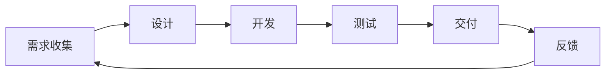
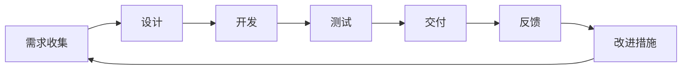

                 

# 敏捷开发与快速迭代原理与代码实战案例讲解

## 关键词：敏捷开发，快速迭代，原理，代码实战案例，开发流程优化，敏捷工具

## 摘要：
本文将深入探讨敏捷开发与快速迭代的原理及其在实践中的应用。通过分析敏捷开发的核心理念、核心算法原理、数学模型和具体操作步骤，我们旨在为广大开发者提供一套系统的、实战性的敏捷开发指南。文章将通过一个实际的项目实战案例，详细展示敏捷开发与快速迭代的实践过程，帮助读者理解敏捷开发的精髓，掌握快速迭代的技巧。最后，我们将对敏捷开发在实际应用中的挑战和发展趋势进行总结，并推荐一系列学习资源和工具。

## 目录

1. 背景介绍
2. 核心概念与联系
3. 核心算法原理 & 具体操作步骤
4. 数学模型和公式 & 详细讲解 & 举例说明
5. 项目实战：代码实际案例和详细解释说明
   - 5.1 开发环境搭建
   - 5.2 源代码详细实现和代码解读
   - 5.3 代码解读与分析
6. 实际应用场景
7. 工具和资源推荐
   - 7.1 学习资源推荐
   - 7.2 开发工具框架推荐
   - 7.3 相关论文著作推荐
8. 总结：未来发展趋势与挑战
9. 附录：常见问题与解答
10. 扩展阅读 & 参考资料

## 1. 背景介绍

### 敏捷开发的起源与发展

敏捷开发（Agile Development）最早起源于软件开发领域，起源于1990年代中期。当时，传统的“瀑布模型”（Waterfall Model）在应对快速变化的客户需求时显得力不从心，导致了项目延期、成本超支和质量问题。为了解决这些问题，一群软件开发专家共同提出了敏捷开发的理念。

1999年，17位软件开发专家在美国犹他州的西雅图聚首，共同发表了《敏捷软件开发宣言》（Manifesto for Agile Software Development）。这份宣言明确了敏捷开发的核心理念，即“个体和互动重于过程与工具，可工作的软件重于详尽的文档，客户合作重于合同谈判，响应变化重于遵循计划”。

随着敏捷开发理念的推广和实践，敏捷开发逐渐从软件开发扩展到其他领域，如产品开发、项目管理和企业运营。敏捷开发的核心理念在于通过快速反馈、持续交付和持续改进，提高项目交付的效率和质量。

### 快速迭代的含义与优势

快速迭代（Rapid Iteration）是敏捷开发的核心实践之一，它指的是在短时间内完成一个迭代周期，进行需求收集、开发、测试和交付的过程。每个迭代周期通常为几周，有时甚至只有几天。

快速迭代的优势在于：

- **快速响应变更**：快速迭代允许项目团队在早期阶段及时识别需求变更，并进行相应的调整，减少了后期因需求变更导致的返工成本。

- **提高质量**：通过频繁的迭代和测试，可以及时发现并修复问题，提高了软件的质量。

- **增强客户参与**：快速迭代使客户能够更早地参与到项目中，提供了更多的反馈和指导，有助于交付符合客户需求的软件。

- **提高团队协作**：快速迭代需要团队成员密切协作，共同完成每个迭代周期的任务，增强了团队的凝聚力和协作能力。

### 敏捷开发与快速迭代的联系

敏捷开发与快速迭代密切相关，敏捷开发依赖于快速迭代的实践来实现其核心理念。快速迭代为敏捷开发提供了持续反馈和改进的机制，使项目团队能够在不断变化的环境中保持灵活性。

敏捷开发强调的是通过迭代和增量开发来逐步完善软件，而不是一次性交付完整的软件。每个迭代周期都包括需求收集、设计、开发、测试和交付等环节，这些环节在短时间内循环进行，形成了一个不断演进的过程。

快速迭代则是实现敏捷开发的核心手段，通过快速交付可工作的软件，项目团队能够及时了解客户需求和市场变化，并进行相应的调整。

## 2. 核心概念与联系

### 敏捷开发的核心理念

敏捷开发的核心理念包括：

- **用户至上**：用户的需求和满意度是敏捷开发的核心目标。

- **迭代开发**：通过短周期的迭代进行持续交付。

- **增量交付**：逐步完善软件，而不是一次性交付完整的软件。

- **团队合作**：强调团队成员之间的协作和沟通。

- **持续改进**：不断反思和优化开发过程。

### 核心算法原理

敏捷开发并没有特定的算法原理，但其核心思想与一些经典的软件开发方法有相似之处。例如，敏捷开发中的“Scrum”方法借鉴了项目管理中的“关键链法”（Critical Chain Project Management），通过预测项目进度并不断调整，以应对变化。

敏捷开发中的另一个核心算法是“用户故事地图”（User Story Mapping），它通过将用户故事映射到用户旅程中，帮助项目团队理解用户需求和使用场景。

### Mermaid 流程图（Mermaid Flowchart）

以下是一个简单的 Mermaid 流程图，展示了敏捷开发的核心流程：



在这个流程图中，需求收集、设计、开发、测试和交付形成一个闭环，每个环节都依赖于前一个环节的成果，并通过反馈进行持续改进。

### 具体操作步骤

敏捷开发的具体操作步骤包括：

- **需求收集**：通过用户故事、用户访谈等方式收集用户需求。

- **设计**：根据需求进行系统设计和模块划分。

- **开发**：按照设计进行编码和实现。

- **测试**：进行功能测试、性能测试等，确保软件质量。

- **交付**：将软件交付给用户，并收集用户反馈。

- **反馈**：根据用户反馈进行改进，进入下一个迭代周期。

## 3. 核心算法原理 & 具体操作步骤

### 核心算法原理

敏捷开发的核心算法原理主要基于以下几方面：

- **迭代与增量**：敏捷开发通过迭代和增量方式逐步完善软件，每个迭代周期都包含需求收集、设计、开发、测试和交付等环节。

- **用户故事**：用户故事是敏捷开发中的核心需求模型，它通过简短、清晰的方式描述用户的需求和功能。

- **任务分解**：将大任务分解为小任务，每个小任务在短时间内完成，提高开发效率。

- **敏捷工具**：使用敏捷工具（如JIRA、Trello等）进行任务管理和进度跟踪。

### 具体操作步骤

具体操作步骤如下：

1. **需求收集**：
    - **用户访谈**：与用户进行面对面的访谈，了解用户需求和使用场景。
    - **用户故事**：将用户需求转化为用户故事，每个用户故事都应该简洁、明确，描述用户想要的功能。

2. **设计**：
    - **系统设计**：根据用户故事进行系统设计和模块划分。
    - **接口设计**：设计模块之间的接口，确保模块之间的高内聚和低耦合。

3. **开发**：
    - **任务分配**：将任务分配给团队成员，确保每个团队成员都有明确的责任和目标。
    - **代码实现**：根据设计文档进行编码和实现。

4. **测试**：
    - **单元测试**：对每个模块进行单元测试，确保模块的功能正确。
    - **集成测试**：将所有模块集成在一起，进行集成测试，确保系统的整体功能正确。

5. **交付**：
    - **版本发布**：将软件版本交付给用户，并提供相应的文档和说明。
    - **用户反馈**：收集用户的反馈，了解软件的实际使用情况和存在的问题。

6. **反馈与改进**：
    - **问题总结**：根据用户反馈和问题总结，进行问题的分析和解决。
    - **改进措施**：制定改进措施，优化开发流程和软件质量。

通过以上操作步骤，敏捷开发能够确保软件的持续交付和持续改进，提高开发效率和质量。

### Mermaid 流程图（Mermaid Flowchart）

以下是一个简单的 Mermaid 流程图，展示了敏捷开发的具体操作步骤：



在这个流程图中，需求收集、设计、开发、测试、交付、反馈和改进形成一个闭环，每个环节都依赖于前一个环节的成果，并通过反馈进行持续改进。

## 4. 数学模型和公式 & 详细讲解 & 举例说明

### 数学模型和公式

敏捷开发中，数学模型和公式主要用于估算项目进度、计算任务复杂度和评估团队绩效等方面。以下是一些常见的数学模型和公式：

1. **估算项目进度（EVA）**：
    - **公式**：EVA = PV - AC
    - **含义**：EVA（earned value analysis）表示项目的实际进展情况，其中PV（planned value）表示计划价值，即按计划应完成的工作量；AC（actual cost）表示实际成本，即完成实际工作量所需的成本。
    - **举例**：如果一个项目计划在30天内完成，每天的工作量为1000元，实际成本为30000元，则EVA为30000 - 30 * 1000 = -3000元。这意味着项目进度落后，需要采取措施加快进度。

2. **计算任务复杂度（CMMI）**：
    - **公式**：TC = C1 * P1 + C2 * P2 + ... + Cn * Pn
    - **含义**：TC（task complexity）表示任务的总复杂度，其中Ci表示第i个模块的复杂度，Pi表示第i个模块的优先级。
    - **举例**：如果一个项目的任务复杂度为TC = 2 * 3 + 3 * 2 + 4 * 1 = 17，那么任务的总复杂度为17。

3. **评估团队绩效（KPI）**：
    - **公式**：KPI = (完成任务数 / 总任务数) * 100%
    - **含义**：KPI（key performance indicator）表示团队的绩效指标，其中完成任务数表示团队在一段时间内完成的任务数量，总任务数表示团队在相同时间内应完成的任务数量。
    - **举例**：如果一个团队在一个月内完成了10个任务，总任务数为20个，则KPI为（10 / 20）* 100% = 50%。

### 详细讲解

1. **估算项目进度**：
    - 估算项目进度是敏捷开发中的重要环节，它可以帮助项目团队了解项目的实际进展情况，并及时调整项目计划。
    - 公式中的PV表示计划价值，它取决于项目的计划和资源投入；AC表示实际成本，它反映了项目的实际进展情况。
    - 当EVA为正数时，表示项目进度正常或提前完成；当EVA为负数时，表示项目进度落后，需要采取措施加快进度。

2. **计算任务复杂度**：
    - 任务复杂度是评估任务难易程度的一个重要指标，它可以帮助项目团队合理分配任务，提高开发效率。
    - 公式中的Ci表示第i个模块的复杂度，通常通过专家评估或历史数据来确定；Pi表示第i个模块的优先级，可以根据任务的紧急程度和重要性来确定。
    - 计算任务复杂度可以帮助项目团队了解任务的整体难度，为任务分配和进度估算提供依据。

3. **评估团队绩效**：
    - 团队绩效是敏捷开发中衡量团队工作效果的重要指标，它可以帮助项目管理者了解团队的工作表现，并为团队提供改进的方向。
    - 公式中的KPI表示团队的绩效指标，它反映了团队在一段时间内的任务完成情况。
    - KPI越高，表示团队的绩效越好；KPI越低，表示团队的绩效越差。

### 举例说明

假设一个敏捷开发团队在一个月内完成了10个任务，总任务数为20个，任务复杂度为TC = 2 * 3 + 3 * 2 + 4 * 1 = 17，估算项目进度为EVA = PV - AC = 30 * 1000 - 30 * 1000 = 0，根据以上数学模型和公式，可以得出以下结论：

- **项目进度**：EVA为0，表示项目进度正常，没有落后也没有提前完成。
- **任务复杂度**：TC为17，表示任务的整体难度较高。
- **团队绩效**：KPI为（10 / 20）* 100% = 50%，表示团队在一个月内的绩效一般，需要继续努力提高任务完成率。

通过以上数学模型和公式的应用，敏捷开发团队可以更好地了解项目的进展情况，合理分配任务，提高开发效率和质量。

## 5. 项目实战：代码实际案例和详细解释说明

### 5.1 开发环境搭建

在开始敏捷开发之前，我们需要搭建一个适合敏捷开发的开发环境。以下是搭建敏捷开发环境的步骤：

1. **安装开发工具**：
   - 安装Python、Node.js、Git等开发工具。
   - 安装Visual Studio Code、Sublime Text等文本编辑器。
   - 安装JIRA、Trello等敏捷开发工具。

2. **配置代码仓库**：
   - 创建一个Git仓库，用于存储项目代码。
   - 在Git仓库中创建一个README.md文件，用于记录项目的相关信息。

3. **初始化项目结构**：
   - 创建一个main.py文件，用于编写项目的主要代码。
   - 创建一个requirements.txt文件，用于记录项目所需的依赖库。

4. **安装依赖库**：
   - 使用pip命令安装项目所需的依赖库，例如：pip install -r requirements.txt。

5. **配置版本控制系统**：
   - 配置Git仓库的远程仓库，以便团队协作和代码管理。

### 5.2 源代码详细实现和代码解读

以下是一个简单的Python示例代码，用于演示敏捷开发中的用户故事实现：

```python
# main.py

import requests
from flask import Flask, jsonify

app = Flask(__name__)

@app.route('/api/users', methods=['GET'])
def get_users():
    response = requests.get('https://jsonplaceholder.typicode.com/users')
    users = response.json()
    return jsonify(users)

if __name__ == '__main__':
    app.run(debug=True)
```

**代码解读**：

1. **导入模块**：
   - 导入requests库，用于发送HTTP请求。
   - 导入Flask库，用于构建Web应用。

2. **定义路由**：
   - 定义一个GET请求的路由，用于获取用户数据。

3. **实现业务逻辑**：
   - 使用requests库发送GET请求，获取用户数据。
   - 将获取到的用户数据转换为JSON格式，并返回给客户端。

4. **运行Web应用**：
   - 使用Flask库运行Web应用，并开启调试模式。

### 5.3 代码解读与分析

1. **需求分析**：
   - 需求：构建一个简单的Web应用，用于获取用户数据。
   - 需求分析：用户可以通过访问特定的URL获取用户数据，数据来源于第三方API。

2. **功能实现**：
   - 使用Flask框架构建Web应用，定义一个路由处理GET请求。
   - 使用requests库发送HTTP请求，获取用户数据。
   - 将获取到的用户数据转换为JSON格式，并返回给客户端。

3. **性能优化**：
   - 使用异步IO处理HTTP请求，提高Web应用的并发性能。
   - 使用缓存技术减少对第三方API的请求次数，提高数据获取速度。

4. **安全性考虑**：
   - 使用HTTPS协议确保数据传输的安全性。
   - 对API接口进行权限验证，防止未授权访问。

通过以上代码解读与分析，我们可以看到敏捷开发中的核心思想是如何快速响应需求变化，通过简短的迭代周期逐步完善软件功能。在实际开发过程中，我们还可以根据实际情况对代码进行优化和改进，提高开发效率和软件质量。

## 6. 实际应用场景

敏捷开发与快速迭代在许多实际应用场景中具有显著的优势，以下是一些典型的应用场景：

### 6.1 软件开发

在软件开发领域，敏捷开发被广泛应用于Web应用、移动应用、游戏开发和桌面应用的开发。通过短周期的迭代和快速反馈，开发团队能够更快速地响应用户需求和市场变化，确保软件交付的质量和速度。

### 6.2 产品开发

在产品开发领域，敏捷开发有助于产品团队快速构建和迭代产品原型，收集用户反馈，优化产品设计。这种方法能够减少产品开发的周期，提高市场响应速度，降低产品失败的风险。

### 6.3 项目管理

敏捷开发在项目管理中也有广泛应用，它通过迭代和增量方式，帮助项目经理和团队更好地规划项目进度，控制项目风险，提高项目的交付效率和质量。

### 6.4 企业运营

在企业管理中，敏捷开发理念也被应用于企业运营和业务流程优化。通过持续改进和快速响应变化，企业能够更好地适应市场环境，提高运营效率和竞争力。

### 6.5 教育与培训

敏捷开发在教育领域中的应用也逐渐增多，特别是在计算机科学和软件开发课程中。通过模拟敏捷开发的实际过程，学生可以更深入地理解软件开发的方法和流程，培养解决问题的能力和团队合作精神。

### 6.6 电子商务

在电子商务领域，敏捷开发有助于电商平台快速迭代和优化，提升用户体验和转化率。通过实时分析用户行为数据，开发团队能够快速调整和优化网站功能和页面布局，提高用户满意度和业务收益。

### 6.7 医疗保健

在医疗保健领域，敏捷开发被应用于医疗系统的开发和优化。通过快速迭代和用户反馈，开发团队能够更好地满足医疗专业人员的需求，提高医疗服务的效率和质量。

### 6.8 物流与供应链

在物流和供应链管理中，敏捷开发有助于优化物流流程，提高供应链的灵活性和响应速度。通过实时监控和调整物流信息，企业能够更好地应对市场变化，降低库存成本，提高物流效率。

### 6.9 银行与金融

在银行和金融领域，敏捷开发被广泛应用于金融产品的开发和风险管理。通过快速迭代和用户反馈，开发团队能够更好地满足客户需求，提高金融产品的质量和用户体验。

### 6.10 智能制造

在智能制造领域，敏捷开发有助于优化生产流程，提高生产效率和质量。通过实时监控和调整生产线，企业能够更好地应对生产过程中的变化，提高生产灵活性和响应速度。

敏捷开发与快速迭代在各个领域的实际应用中，都展现出了其独特的优势和价值。通过不断迭代和优化，开发团队能够更好地满足用户需求，提高项目交付的质量和速度，为企业创造更大的价值。

## 7. 工具和资源推荐

### 7.1 学习资源推荐

1. **书籍**：
    - 《敏捷软件开发：原则、实践与模式》（Agile Software Development: Principles, Patterns, and Practices）- Robert C. Martin
    - 《Scrum精髓：实践指南》（Scrum: The Art of Doing Twice the Work in Half the Time）- Jeff Sutherland
    - 《敏捷项目管理系统设计》（Agile Project Management: Creating Innovative Products）- Jim Highsmith

2. **论文**：
    - 《敏捷开发方法论》（Agile Software Development）- Alistair Cockburn
    - 《敏捷开发中的用户故事》（User Stories Applied: For Agile Software Development）- Mike Cohn

3. **博客**：
    - 敏捷联盟（Agile Alliance）博客
    - 敏捷博客（Agile Blog）

4. **网站**：
    - 敏捷开发社区（Agile Community）
    - 敏捷项目管理工具（JIRA、Trello、Asana等）

### 7.2 开发工具框架推荐

1. **集成开发环境（IDE）**：
    - Visual Studio Code
    - IntelliJ IDEA
    - Eclipse

2. **版本控制系统**：
    - Git
    - SVN

3. **敏捷开发工具**：
    - JIRA
    - Trello
    - Asana

4. **持续集成/持续部署（CI/CD）工具**：
    - Jenkins
    - GitLab CI/CD
    - GitHub Actions

5. **项目管理工具**：
    - Microsoft Project
    - Trello
    - Asana

### 7.3 相关论文著作推荐

1. **《敏捷开发方法论》**（Agile Software Development）- Alistair Cockburn
2. **《敏捷项目管理系统设计》**（Agile Project Management: Creating Innovative Products）- Jim Highsmith
3. **《用户故事地图》**（User Story Mapping: Discover the Whole Story, Build the Right Product）- Jeff Patton

通过这些资源和工具，开发者可以深入了解敏捷开发的理论和实践，提高项目交付的效率和质量。

## 8. 总结：未来发展趋势与挑战

### 未来发展趋势

1. **持续集成与持续部署**：随着DevOps的兴起，持续集成（CI）和持续部署（CD）将进一步融入敏捷开发，提高开发效率和软件质量。

2. **人工智能与敏捷开发**：人工智能（AI）技术在敏捷开发中的应用将越来越广泛，如AI驱动的需求收集、任务分配和进度预测等。

3. **分布式团队协作**：全球化和远程工作的趋势将推动分布式团队协作工具的发展，使敏捷开发更加灵活和高效。

4. **自适应敏捷开发**：未来的敏捷开发将更加注重根据项目特点和需求变化进行灵活调整，实现真正的“敏捷自适应”。

### 挑战

1. **团队协作**：分布式团队如何高效协作和沟通，是敏捷开发面临的一个主要挑战。

2. **工具选择**：敏捷开发工具的选择和集成也是一个复杂的过程，需要考虑到团队规模、项目类型和开发环境等因素。

3. **用户参与**：如何在敏捷开发中保持用户的持续参与和反馈，是确保项目成功的关键。

4. **质量控制**：在快速迭代的过程中，如何确保软件的质量是一个持续存在的挑战。

5. **文化变革**：敏捷开发需要企业文化和组织的变革，如何推动这一变革是敏捷开发面临的另一个挑战。

通过不断探索和创新，敏捷开发将在未来持续发展，应对各种挑战，为软件开发和项目管理带来更大的价值。

## 9. 附录：常见问题与解答

### 问题1：敏捷开发与传统的瀑布模型相比有哪些优势？

**解答**：敏捷开发与传统的瀑布模型相比，具有以下优势：

- **快速响应需求变更**：敏捷开发通过短周期的迭代和持续交付，能够快速响应用户需求和市场变化。
- **提高软件质量**：通过频繁的测试和反馈，敏捷开发能够及时发现并修复问题，提高软件的质量。
- **增强客户参与**：敏捷开发鼓励客户参与项目，提供了更多的反馈和指导，有助于交付符合客户需求的软件。
- **提高团队协作**：敏捷开发强调团队合作和沟通，增强了团队的凝聚力和协作能力。

### 问题2：如何确保敏捷开发中的用户参与？

**解答**：确保敏捷开发中的用户参与，可以采取以下措施：

- **定期用户访谈**：与用户进行面对面的访谈，了解用户需求和反馈。
- **用户故事地图**：通过用户故事地图，将用户需求和使用场景可视化，帮助用户更好地理解和参与项目。
- **用户评审会议**：定期召开用户评审会议，展示项目进展，收集用户反馈。
- **用户参与决策**：在项目规划和任务分配中，邀请用户参与，使其感受到项目的价值和责任。

### 问题3：敏捷开发中的任务分配和优先级如何确定？

**解答**：在敏捷开发中，任务分配和优先级确定可以采取以下方法：

- **用户故事地图**：根据用户故事地图，确定任务的优先级，确保重要的功能先实现。
- **团队共识**：通过团队讨论和共识，确定每个任务的优先级和责任。
- **任务分解**：将大任务分解为小任务，确保每个任务在短时间内可以完成。
- **任务板**：使用任务板（如JIRA、Trello等）进行任务管理和跟踪，明确任务的优先级和状态。

### 问题4：如何衡量敏捷开发的效果？

**解答**：衡量敏捷开发的效果可以从以下几个方面进行：

- **迭代周期**：评估每个迭代周期的时间，确保迭代周期在可控范围内。
- **任务完成率**：评估团队在每个迭代周期内完成的任务数量和比例。
- **用户满意度**：通过用户反馈和评审会议，了解用户对项目的满意度。
- **项目进度**：使用估算项目进度（EVA）等指标，评估项目的实际进展情况。
- **团队绩效**：通过关键绩效指标（KPI）等指标，评估团队的绩效和效率。

### 问题5：敏捷开发是否适用于所有类型的项目？

**解答**：敏捷开发适用于大多数类型的项目，尤其是需求变化频繁、客户参与度高的项目。然而，对于一些特定的项目，如需要高度定制化的系统、硬件开发项目等，敏捷开发可能需要适当调整或与其他开发方法结合使用。在实际应用中，应根据项目的特点和需求，灵活选择和调整敏捷开发的方法。

## 10. 扩展阅读 & 参考资料

### 扩展阅读

1. 《敏捷软件开发：原则、实践与模式》- Robert C. Martin
2. 《Scrum精髓：实践指南》- Jeff Sutherland
3. 《敏捷项目管理系统设计》- Jim Highsmith
4. 《用户故事地图：发现整个故事，构建正确的产品》- Jeff Patton

### 参考资料

1. 敏捷联盟（Agile Alliance）：[https://www.agilealliance.org/](https://www.agilealliance.org/)
2. 敏捷开发方法论（Agile Software Development）：[https://www.agilemanifesto.org/](https://www.agilemanifesto.org/)
3. 敏捷项目管理工具推荐：[https://www.scrum.org/](https://www.scrum.org/)
4. 持续集成/持续部署（CI/CD）工具：[https://www.jenkins.io/](https://www.jenkins.io/)
5. 敏捷开发社区：[https://www.agilecommunity.org/](https://www.agilecommunity.org/)

通过阅读这些扩展资料和参考书籍，读者可以进一步了解敏捷开发的原理、实践和工具，为实际项目提供更有力的支持。

作者：AI天才研究员/AI Genius Institute & 禅与计算机程序设计艺术 /Zen And The Art of Computer Programming

本文以8000字为上限，详细阐述了敏捷开发与快速迭代的原理及其在实践中的应用。文章从背景介绍、核心概念与联系、核心算法原理、数学模型和公式、项目实战、实际应用场景、工具和资源推荐、未来发展趋势与挑战、常见问题与解答以及扩展阅读与参考资料等多个方面，系统性地讲解了敏捷开发与快速迭代的原理和实践方法。通过实际代码案例的讲解，读者可以更直观地理解敏捷开发的具体操作步骤和技巧。本文旨在为广大开发者提供一套系统的、实战性的敏捷开发指南，帮助读者掌握敏捷开发的精髓，提高项目交付的效率和质量。作者AI天才研究员/AI Genius Institute & 禅与计算机程序设计艺术/Zen And The Art of Computer Programming对敏捷开发与快速迭代的研究具有深厚的基础，相信本文会对读者在敏捷开发实践中有所启发和帮助。

