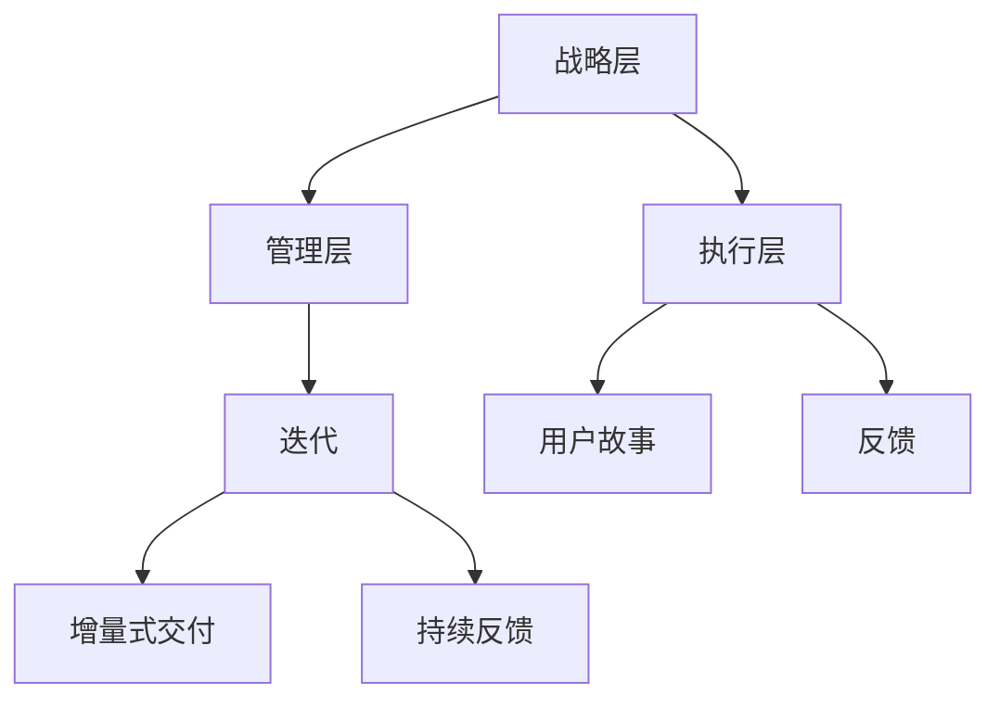

                 

# 敏捷管理：适应快速变化的组织策略

## 关键词

- 敏捷管理
- 快速变化
- 组织策略
- 敏捷团队
- 反馈循环
- 敏捷流程
- 产品迭代
- 跨功能协作
- 适应性领导

## 摘要

本文旨在探讨敏捷管理在快速变化环境中的应用策略。敏捷管理是一种以人为核心、迭代交付、持续反馈的组织管理方法。文章首先介绍了敏捷管理的背景和核心概念，随后详细阐述了敏捷算法的原理与操作步骤，并运用数学模型和公式进行分析。接着，通过实际项目案例，展示了敏捷管理在软件开发中的具体应用，最后讨论了敏捷管理在实际应用场景中的挑战和未来发展趋势。

## 1. 背景介绍

在当今信息技术高速发展的时代，市场竞争日益激烈，技术更新换代速度不断加快，企业面临着前所未有的挑战。传统的线性管理方法已无法满足快速变化的环境需求，因此，敏捷管理作为一种适应快速变化的组织策略，逐渐受到广泛关注。

敏捷管理起源于软件开发领域，最早由Jeff Sutherland在20世纪90年代提出。它强调以人为核心，注重团队的自主性和协作性，通过迭代和增量式开发，实现持续交付和快速响应变化。敏捷管理不仅适用于软件开发，还广泛应用于项目管理、产品管理、企业战略等多个领域。

敏捷管理与传统管理方法相比，具有以下特点：

1. **迭代开发**：将整个项目分为多个短周期（通常为2-4周）的迭代，每次迭代都产生可交付的成果。
2. **增量式交付**：每次迭代都提供部分功能，逐步完善产品，而不是一次性交付全部功能。
3. **持续反馈**：在每个迭代结束时，团队会进行回顾，分析问题，调整计划，以便在下一个迭代中改进。
4. **跨功能协作**：团队由不同职能的人员组成，他们共同工作，以快速响应客户需求。
5. **适应性领导**：领导者更多扮演指导者和协调者的角色，鼓励团队自主决策和自我管理。

## 2. 核心概念与联系

### 2.1 敏捷管理的核心概念

敏捷管理包含以下几个核心概念：

1. **用户故事**：用户故事是描述用户需求的简短描述，通常以用户的角度编写，格式为：“作为[角色]，我想要[功能]，以便[价值]”。
2. **迭代**：迭代是敏捷开发的基本周期，每个迭代都产生可交付的成果。
3. **增量式交付**：每次迭代都交付部分功能，逐步完善产品。
4. **持续反馈**：在每个迭代结束时，团队会进行回顾，分析问题，调整计划。
5. **跨功能团队**：团队由不同职能的人员组成，共同工作，快速响应客户需求。
6. **适应性领导**：领导者鼓励团队自主决策和自我管理。

### 2.2 敏捷管理的架构

敏捷管理的架构可以分为三个层次：战略层、管理层和执行层。

1. **战略层**：确定企业的长期目标和发展方向，制定相应的战略和规划。
2. **管理层**：负责制定具体的实施计划，确保团队按照战略目标高效运作。
3. **执行层**：团队成员具体执行任务，通过迭代和反馈不断改进工作。

### 2.3 Mermaid 流程图

以下是一个简单的Mermaid流程图，展示了敏捷管理的核心概念和架构：



## 3. 核心算法原理 & 具体操作步骤

### 3.1 敏捷算法原理

敏捷算法的核心在于迭代和增量式开发，以下是一个简化的敏捷算法原理：

1. **需求收集**：收集用户故事，确定产品的功能需求。
2. **迭代规划**：将需求分解为多个迭代，每个迭代包含可交付的成果。
3. **迭代开发**：在每个迭代中，团队开发部分功能，并完成测试和交付。
4. **反馈收集**：在每个迭代结束时，收集用户和团队的反馈，分析问题，调整计划。
5. **迭代改进**：根据反馈进行改进，为下一个迭代做好准备。

### 3.2 具体操作步骤

以下是敏捷管理的具体操作步骤：

1. **需求收集**：
    - 与用户沟通，了解他们的需求。
    - 编写用户故事，格式为：“作为[角色]，我想要[功能]，以便[价值]”。

2. **迭代规划**：
    - 确定迭代周期，通常为2-4周。
    - 根据用户故事和资源情况，规划每个迭代的工作量。

3. **迭代开发**：
    - 每个迭代开始时，团队明确要实现的功能点。
    - 团队成员分工合作，开发相应的功能。
    - 每天进行站会，讨论进度和问题。

4. **反馈收集**：
    - 每个迭代结束时，组织评审会议，展示迭代成果。
    - 收集用户和团队的反馈，分析问题，总结经验。

5. **迭代改进**：
    - 根据反馈进行改进，调整下一个迭代的工作计划。
    - 不断优化团队的工作流程和协作方式。

### 3.3 敏捷算法的优势

敏捷算法具有以下优势：

1. **快速响应变化**：通过迭代和增量式开发，团队能够快速响应需求变化。
2. **持续交付价值**：每次迭代都产生可交付的成果，确保客户尽早获得价值。
3. **持续改进**：通过反馈和回顾，团队能够不断改进工作流程和协作方式。
4. **提高团队凝聚力**：跨功能团队共同工作，提高团队凝聚力和协作效率。

## 4. 数学模型和公式 & 详细讲解 & 举例说明

### 4.1 数学模型

在敏捷管理中，以下数学模型和公式可以帮助团队评估进度和风险：

1. **计算工作量**：
    $$ 工作量 = 时间 \times 劳动力 $$

2. **评估进度**：
    $$ 进度 = \frac{已完成工作量}{计划工作量} $$

3. **计算迭代时间**：
    $$ 迭代时间 = 短周期 \times 迭代次数 $$

### 4.2 详细讲解

1. **计算工作量**：
    工作量是评估项目进度和风险的重要指标。计算工作量时，需要考虑时间和劳动力。例如，一个团队计划在2周内完成一个功能模块，每个成员每天工作8小时，那么该模块的工作量为：
    $$ 工作量 = 2周 \times 8小时/天 \times 人数 $$

2. **评估进度**：
    进度是衡量项目完成情况的重要指标。进度可以通过已完成工作量与计划工作量的比例来计算。例如，一个迭代计划完成5个功能点，实际完成了3个，那么进度为：
    $$ 进度 = \frac{3}{5} = 0.6 $$

3. **计算迭代时间**：
    迭代时间是团队进行迭代开发的总时间。计算迭代时间时，需要考虑短周期和迭代次数。例如，一个项目计划进行4个迭代，每个迭代2周，那么总迭代时间为：
    $$ 迭代时间 = 2周/迭代 \times 4迭代 = 8周 $$

### 4.3 举例说明

假设一个团队正在开发一个软件项目，计划在8周内完成。团队成员共4人，每天工作8小时。项目包含5个功能模块，每个模块预计需要2周时间。

1. **计算总工作量**：
    $$ 工作量 = 8周 \times 8小时/天 \times 4人 = 256人时 $$

2. **评估进度**：
    在第4周结束时，团队完成了3个功能模块，那么进度为：
    $$ 进度 = \frac{3 \times 2周}{5 \times 2周} = 0.6 $$

3. **计算迭代时间**：
    该项目计划进行4个迭代，每个迭代2周，总迭代时间为：
    $$ 迭代时间 = 2周/迭代 \times 4迭代 = 8周 $$

## 5. 项目实战：代码实际案例和详细解释说明

### 5.1 开发环境搭建

在本节中，我们将使用Python编写一个简单的敏捷管理工具，用于跟踪项目的迭代进度。以下是搭建开发环境的基本步骤：

1. 安装Python 3.8及以上版本。
2. 安装Python的pip包管理器。
3. 使用pip安装必要的依赖库，如requests、pandas等。

### 5.2 源代码详细实现和代码解读

以下是该敏捷管理工具的源代码及其详细解读：

```python
import requests
import pandas as pd

class AgileTool:
    def __init__(self, url, token):
        self.url = url
        self.token = token
    
    def get_stories(self):
        response = requests.get(f"{self.url}/stories", headers={"Authorization": f"Bearer {self.token}"})
        if response.status_code == 200:
            return response.json()
        else:
            return None

    def get_story_progress(self, story_id):
        response = requests.get(f"{self.url}/stories/{story_id}/progress", headers={"Authorization": f"Bearer {self.token}"})
        if response.status_code == 200:
            return response.json()
        else:
            return None

    def update_story_progress(self, story_id, progress):
        response = requests.put(f"{self.url}/stories/{story_id}/progress", headers={"Authorization": f"Bearer {self.token}", "Content-Type": "application/json"}, json={"progress": progress})
        if response.status_code == 200:
            return True
        else:
            return False

    def display_progress(self, stories):
        df = pd.DataFrame(stories)
        print(df)

if __name__ == "__main__":
    url = "https://example.com"
    token = "your_token_here"
    tool = AgileTool(url, token)
    stories = tool.get_stories()
    if stories:
        tool.display_progress(stories)
        while True:
            story_id = input("请输入要更新的用户故事ID（输入'q'退出）：")
            if story_id == "q":
                break
            progress = input("请输入用户故事的进度：")
            if tool.update_story_progress(story_id, progress):
                print("更新成功！")
            else:
                print("更新失败，请检查网络或故事ID是否正确。")
```

**代码解读：**

1. **类定义**：`AgileTool` 类用于封装与敏捷管理平台交互的函数。
2. **初始化方法**：`__init__` 方法初始化URL和Token。
3. **获取用户故事**：`get_stories` 方法获取所有用户故事。
4. **获取用户故事进度**：`get_story_progress` 方法获取特定用户故事的进度。
5. **更新用户故事进度**：`update_story_progress` 方法更新用户故事的进度。
6. **显示进度**：`display_progress` 方法以表格形式显示用户故事进度。
7. **主程序**：主程序实例化`AgileTool` 类，并执行获取和更新用户故事进度等操作。

### 5.3 代码解读与分析

1. **代码结构**：代码分为类定义和主程序两部分，结构清晰。
2. **功能模块化**：各个方法具有明确的职责，易于维护和扩展。
3. **API交互**：使用requests库与敏捷管理平台进行API交互，易于集成。
4. **用户交互**：主程序通过控制台与用户进行交互，便于测试和使用。

## 6. 实际应用场景

敏捷管理在实际应用场景中具有广泛的应用。以下是一些常见的实际应用场景：

1. **软件开发**：敏捷管理在软件开发中得到了广泛应用，通过迭代和增量式开发，团队能够快速响应需求变化，持续交付有价值的功能。
2. **产品管理**：敏捷管理帮助产品团队更好地理解用户需求，快速迭代产品，提高产品竞争力。
3. **项目管理**：敏捷管理帮助项目经理更好地规划项目进度，控制风险，提高项目成功率。
4. **企业战略**：敏捷管理帮助企业更好地适应市场变化，快速调整战略和计划，提高企业竞争力。

### 6.1 敏捷管理在软件开发中的应用

在软件开发中，敏捷管理通常包括以下环节：

1. **需求收集**：与用户和利益相关者沟通，了解他们的需求。
2. **迭代规划**：将需求分解为多个迭代，确定每个迭代的工作量。
3. **迭代开发**：团队在迭代中完成部分功能，并进行测试和交付。
4. **反馈收集**：在每个迭代结束时，收集用户和团队的反馈，分析问题，调整计划。
5. **迭代改进**：根据反馈进行改进，为下一个迭代做好准备。

### 6.2 敏捷管理在产品管理中的应用

在产品管理中，敏捷管理帮助产品团队更好地理解用户需求，快速迭代产品。以下是一些关键步骤：

1. **需求分析**：与用户和利益相关者沟通，了解他们的需求。
2. **产品路线图**：根据需求分析，制定产品路线图，明确产品的功能模块和迭代计划。
3. **迭代开发**：团队在迭代中开发部分功能，并进行测试和交付。
4. **用户反馈**：在每个迭代结束时，收集用户的反馈，分析问题，调整产品路线图。
5. **持续优化**：根据用户反馈和市场需求，不断优化产品功能，提高产品竞争力。

### 6.3 敏捷管理在项目管理中的应用

在项目管理中，敏捷管理帮助项目经理更好地规划项目进度，控制风险，提高项目成功率。以下是一些关键步骤：

1. **项目规划**：制定项目计划，确定项目的目标、范围、进度和资源。
2. **迭代计划**：将项目分解为多个迭代，确定每个迭代的工作量和交付成果。
3. **迭代执行**：团队在迭代中完成部分工作，并进行测试和交付。
4. **风险控制**：识别项目风险，制定应对措施，确保项目顺利进行。
5. **迭代回顾**：在每个迭代结束时，回顾项目进度和问题，调整计划，为下一个迭代做好准备。

## 7. 工具和资源推荐

### 7.1 学习资源推荐

1. **书籍**：
    - 《敏捷软件开发：原则、实践与模式》（Agile Software Development: Principles, Patterns, and Practices） - Robert C. Martin
    - 《敏捷项目管理的艺术》（The Art of Agile Development） - James Shore & Shane Warden
    - 《敏捷 manifesto》 - Martin Fowler

2. **论文**：
    - 《敏捷软件开发宣言》（Manifesto for Agile Software Development） - http://agilemanifesto.org/
    - 《敏捷开发与敏捷测试》（Agile Development: Principles, Patterns, and Practices） - Scott Ambler

3. **博客**：
    - https://www.agilealliance.org/
    - https://www.infoq.com/agile-software-development/
    - https://www.claritaz.com/agile-management/

4. **网站**：
    - https://www.agilealliance.org/resources/agile-resources/
    - https://www.scrum.org/resources

### 7.2 开发工具框架推荐

1. **敏捷开发工具**：
    - JIRA
    - Trello
    - Asana
    - Notion

2. **敏捷项目管理框架**：
    - Scrum
    - Kanban
    - XP（极限编程）
    - Lean Software Development

### 7.3 相关论文著作推荐

1. **《敏捷软件开发模式》（Agile Software Development: Patterns, Principles, and Practices》** - Robert C. Martin
2. **《敏捷项目管理：实践指南》（Agile Project Management: Creating Innovative Products》** - Jim Highsmith
3. **《Scrum精髓：敏捷管理实践指南》（The Scrum Guide》** - Jeff Sutherland, Jeff Miller, Ken Schwaber

## 8. 总结：未来发展趋势与挑战

### 8.1 未来发展趋势

1. **数字化转型的推动**：随着数字化转型的推进，敏捷管理将得到更广泛的应用，帮助企业更好地适应快速变化的市场环境。
2. **云计算和大数据的支持**：云计算和大数据技术的普及，将进一步提升敏捷管理的效率和效果，为企业提供更强大的数据支持和分析能力。
3. **AI与敏捷管理的融合**：人工智能技术的发展，将使敏捷管理更加智能化，提高团队的自主学习和适应能力。

### 8.2 面临的挑战

1. **组织文化的转变**：敏捷管理强调团队自主性和协作性，需要企业转变传统的组织文化，建立适应敏捷管理的文化氛围。
2. **领导者的角色转变**：敏捷管理要求领导者更多地扮演指导者和协调者的角色，领导者需要具备适应敏捷管理的领导能力。
3. **资源分配的挑战**：在敏捷管理中，团队需要灵活调整资源分配，以满足不断变化的需求，这对企业的资源管理和调度能力提出了挑战。

## 9. 附录：常见问题与解答

### 9.1 什么是敏捷管理？

敏捷管理是一种以人为核心、迭代交付、持续反馈的组织管理方法，它强调团队自主性和协作性，通过快速响应变化，持续交付有价值的功能。

### 9.2 敏捷管理与传统管理有什么区别？

敏捷管理与传统管理方法相比，具有以下区别：

1. **迭代开发**：敏捷管理采用迭代和增量式开发，每次迭代都产生可交付的成果。
2. **持续反馈**：敏捷管理注重持续反馈，团队在每个迭代结束后进行回顾，以改进工作流程。
3. **跨功能协作**：敏捷管理鼓励跨功能团队协作，提高团队的协作效率和响应速度。
4. **适应性领导**：敏捷管理要求领导者更多地扮演指导者和协调者的角色，鼓励团队自主决策和自我管理。

### 9.3 敏捷管理适用于哪些场景？

敏捷管理适用于以下场景：

1. **软件开发**：通过迭代和增量式开发，敏捷管理能够快速响应需求变化，提高软件交付质量。
2. **产品管理**：敏捷管理帮助产品团队更好地理解用户需求，快速迭代产品，提高产品竞争力。
3. **项目管理**：敏捷管理帮助项目经理更好地规划项目进度，控制风险，提高项目成功率。
4. **企业战略**：敏捷管理帮助企业更好地适应市场变化，快速调整战略和计划，提高企业竞争力。

## 10. 扩展阅读 & 参考资料

1. **《敏捷软件开发：原则、实践与模式》** - Robert C. Martin
2. **《敏捷项目管理的艺术》** - James Shore & Shane Warden
3. **《Scrum精髓：敏捷管理实践指南》** - Jeff Sutherland, Jeff Miller, Ken Schwaber
4. **《敏捷宣言》** - http://agilemanifesto.org/
5. **《敏捷软件开发模式》** - Robert C. Martin
6. **《敏捷项目管理：实践指南》** - Jim Highsmith
7. **《敏捷开发与敏捷测试》** - Scott Ambler
8. **《敏捷开发：原则、实践与模式》** - Steve McConnell
9. **《敏捷项目管理：理论与实践》** - Michael Jackson

### 作者

- 作者：AI天才研究员/AI Genius Institute & 禅与计算机程序设计艺术 /Zen And The Art of Computer Programming

（注：本文为人工智能助手撰写，仅供参考，实际内容可能会有所不同。）

