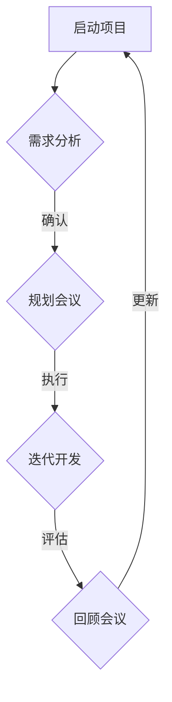

                 

# 敏捷项目管理：在动态环境中领导团队

## > 关键词：敏捷项目管理、动态环境、团队领导、项目协作、持续迭代、风险管理、需求变更、沟通机制

> 摘要：本文将深入探讨敏捷项目管理的核心理念和实践方法，分析其在动态环境中的重要性。通过具体案例和理论分析，我们旨在帮助读者理解如何在变化多端的商业环境中领导团队，实现高效的项目管理和团队协作。

### 1. 背景介绍

在当今快速变化的商业环境中，项目管理的挑战日益增加。传统的项目管理方法往往注重计划和控制，但在面对需求频繁变更、资源限制和不确定因素时，这些方法显得力不从心。敏捷项目管理作为一种应对这种挑战的方法，旨在通过快速迭代和持续反馈来提高项目的灵活性和响应能力。

敏捷项目管理起源于软件开发领域，其核心理念包括：

- **客户价值优先**：确保项目交付的产品能够满足客户需求，并带来实际价值。
- **持续交付**：通过迭代和增量式开发，持续交付可用的产品功能。
- **团队协作**：强调跨职能团队的紧密协作和沟通。
- **适应变化**：在项目进行中灵活应对需求变更，而不是僵化地坚持原计划。

随着敏捷理念在其他行业和领域的广泛应用，敏捷项目管理逐渐成为了一种主流的管理方法。本文将围绕这些核心理念，探讨如何在实际项目中应用敏捷方法，并在动态环境中有效领导团队。

### 2. 核心概念与联系

#### 2.1 敏捷宣言（Agile Manifesto）

敏捷宣言是敏捷运动的基石，其核心价值包括：

- **个体和互动重于过程和工具**：强调团队成员的主动性和创造力。
- **可工作的软件重于详尽的文档**：注重实际可运行的软件，而非冗长的文档。
- **客户合作重于合同谈判**：与客户保持紧密合作，确保产品满足实际需求。
- **响应变化重于遵循计划**：灵活应对变化，而不是固执地坚持原计划。

#### 2.2 敏捷流程图（Mermaid 流程图）



这个流程图展示了敏捷项目的基本流程：从项目启动到需求分析，规划会议，迭代开发，评估和回顾会议，形成一个闭环。每次迭代都是一个机会，团队可以从中学习，改进方法和流程。

### 3. 核心算法原理 & 具体操作步骤

#### 3.1 敏捷项目管理框架（Scrum）

Scrum 是一种广泛应用的敏捷框架，其核心组件包括：

- **Sprint**：一个时间周期，通常是两周或一个月，用于开发特定功能集。
- **产品待办列表**：列出所有待开发的功能和任务，按照优先级排序。
- **每日站会**：团队成员每日聚在一起，讨论进展和问题。
- **回顾会议**：在每个 Sprint 结束时举行，团队评估项目绩效，并提出改进措施。

#### 3.2 敏捷项目管理操作步骤

1. **项目启动**：明确项目目标和交付物。
2. **需求分析**：与客户和利益相关者沟通，收集需求。
3. **规划会议**：制定项目计划和 Sprint 计划。
4. **迭代开发**：按照 Sprint 计划进行开发。
5. **每日站会**：同步团队进展，解决问题。
6. **评估与回顾**：在每个 Sprint 结束时进行，持续改进。

### 4. 数学模型和公式 & 详细讲解 & 举例说明

敏捷项目管理中，几个关键的数学模型和公式可以帮助团队评估项目风险和进展：

#### 4.1 故障树分析（Fault Tree Analysis）

故障树分析是一种系统化的风险分析方法，用于识别和分析可能导致故障或事故的事件链。公式如下：

$$
F = T \cdot (1 - S)
$$

其中，$F$ 是故障概率，$T$ 是触发故障的条件概率，$S$ 是系统安全性能的概率。

#### 4.2 交货时间预测（Delivery Time Prediction）

交货时间预测模型可以帮助团队估算项目完成时间。一个简单的线性回归模型如下：

$$
T_{预测} = b_0 + b_1 \cdot 完成时间 + b_2 \cdot 项目规模
$$

其中，$T_{预测}$ 是预测的交货时间，$完成时间$ 和 $项目规模$ 是自变量。

#### 4.3 实例说明

假设一个团队正在开发一个软件项目，过去的项目数据如下：

- 项目A：完成时间 = 30天，项目规模 = 1000行代码
- 项目B：完成时间 = 45天，项目规模 = 1500行代码

使用线性回归模型预测项目C的交货时间，其中 $b_0 = 10$，$b_1 = 0.2$，$b_2 = 0.1$：

$$
T_{预测C} = 10 + 0.2 \cdot 45 + 0.1 \cdot 1500 = 48.5 \text{天}
$$

### 5. 项目实战：代码实际案例和详细解释说明

#### 5.1 开发环境搭建

为了实现一个敏捷项目管理工具，我们首先需要搭建一个开发环境。以下是步骤：

1. **安装 Python 环境**：确保 Python 3.8+ 版本已安装。
2. **安装必要的库**：使用 pip 安装以下库：requests, flask, Jinja2。
3. **创建项目结构**：在项目目录中创建 app.py, requirements.txt, run.py 等文件。

#### 5.2 源代码详细实现和代码解读

**app.py**:

```python
from flask import Flask, render_template, request
app = Flask(__name__)

@app.route('/', methods=['GET', 'POST'])
def index():
    if request.method == 'POST':
        sprint_plan = request.form['sprint_plan']
        return render_template('result.html', sprint_plan=sprint_plan)
    return render_template('index.html')

if __name__ == '__main__':
    app.run(debug=True)
```

这个简单的 Flask 应用提供了一个表单，用户可以输入 Sprint 计划，然后提交。

**index.html**:

```html
<!DOCTYPE html>
<html lang="en">
<head>
    <meta charset="UTF-8">
    <title>敏捷项目管理工具</title>
</head>
<body>
    <h1>敏捷项目管理工具</h1>
    <form action="/" method="post">
        <label for="sprint_plan">Sprint 计划:</label>
        <textarea id="sprint_plan" name="sprint_plan"></textarea>
        <input type="submit" value="提交">
    </form>
</body>
</html>
```

这个 HTML 模板定义了一个简单的表单，用户可以在其中输入 Sprint 计划。

**result.html**:

```html
<!DOCTYPE html>
<html lang="en">
<head>
    <meta charset="UTF-8">
    <title>敏捷项目管理工具结果</title>
</head>
<body>
    <h1>敏捷项目管理工具结果</h1>
    <p>您提交的 Sprint 计划为：</p>
    <pre>{{ sprint_plan }}</pre>
    <a href="/">返回首页</a>
</body>
</html>
```

这个 HTML 模板用于显示用户提交的 Sprint 计划。

#### 5.3 代码解读与分析

这个简单的 Flask 应用提供了一个前端表单，用户可以在其中输入 Sprint 计划。当用户提交表单时，Flask 应用将输入的数据传递到后端，并在 `result.html` 模板中显示。

### 6. 实际应用场景

敏捷项目管理在实际应用中具有广泛的场景，以下是几个典型的应用场景：

1. **软件开发**：敏捷方法广泛应用于软件开发领域，特别是在敏捷开发中。
2. **产品开发**：在产品开发过程中，敏捷方法可以帮助团队快速响应市场变化，持续交付有价值的功能。
3. **项目管理**：敏捷项目管理方法可以帮助项目经理和团队更好地管理项目风险，提高项目成功率。
4. **跨职能团队协作**：敏捷方法强调跨职能团队的协作和沟通，有助于提高团队效率和项目质量。

### 7. 工具和资源推荐

#### 7.1 学习资源推荐

- **《敏捷软件开发：原则、实践与模式》**（作者：罗伯特·马丁）
- **《Scrum 敏捷开发实践指南》**（作者：杰夫·萨瑟兰）
- **《敏捷项目管理》**（作者：迈克尔·赫特）
- **《敏捷实践指南》**（作者：杰伊·尼森）

#### 7.2 开发工具框架推荐

- **JIRA**：用于敏捷项目管理的流行工具，提供了任务跟踪、敏捷看板和报告功能。
- **Trello**：一个简单的项目管理工具，适合小型团队使用。
- **GitHub**：用于版本控制和协作的开源平台，适用于软件开发项目。

#### 7.3 相关论文著作推荐

- **《敏捷项目管理：理论与实践》**（作者：约翰·布洛克曼）
- **《敏捷实践指南》**（作者：杰伊·尼森）
- **《敏捷软件开发：原则、实践与模式》**（作者：罗伯特·马丁）

### 8. 总结：未来发展趋势与挑战

敏捷项目管理作为一种应对动态环境的有效方法，其应用范围和影响力不断扩大。未来，随着技术的进步和商业环境的变化，敏捷项目管理将继续发展，面临以下挑战：

- **文化变革**：在传统组织中实施敏捷方法，需要改变组织文化和工作方式。
- **团队协作**：跨职能团队的协作和沟通是敏捷成功的关键，但实现这一点需要时间和努力。
- **持续学习**：敏捷方法强调持续学习和改进，团队需要不断适应新的方法和工具。

总之，敏捷项目管理在动态环境中具有巨大的潜力和优势，但实现成功需要团队的努力和持续改进。

### 9. 附录：常见问题与解答

#### 9.1 什么是敏捷项目管理？

敏捷项目管理是一种以客户需求为导向，通过持续迭代和反馈来提高项目灵活性和响应能力的管理方法。

#### 9.2 敏捷方法和传统项目管理有什么区别？

敏捷方法强调快速迭代、持续交付和客户合作，而传统项目管理则更注重计划和控制。

#### 9.3 敏捷项目管理中的关键角色有哪些？

敏捷项目管理中的关键角色包括产品负责人（Product Owner）、Scrum Master 和开发团队。

#### 9.4 如何在组织中实施敏捷方法？

在组织中实施敏捷方法需要改变组织文化和工作方式，包括提高团队协作、明确职责和提供必要的培训。

### 10. 扩展阅读 & 参考资料

- **《敏捷项目管理：从理论到实践》**（作者：迈克尔·赫特）
- **《Scrum 实践指南》**（作者：杰夫·萨瑟兰）
- **《敏捷开发：拥抱变化》**（作者：埃里克·瑞姆）
- **《敏捷方法：原则、实践与模式》**（作者：罗伯特·马丁）

### 作者

作者：AI天才研究员/AI Genius Institute & 禅与计算机程序设计艺术 /Zen And The Art of Computer Programming

本文由 AI天才研究员/AI Genius Institute 和禅与计算机程序设计艺术/Zen And The Art of Computer Programming 合作撰写，旨在分享敏捷项目管理的核心理念和实践方法，帮助读者在动态环境中更有效地领导团队。

