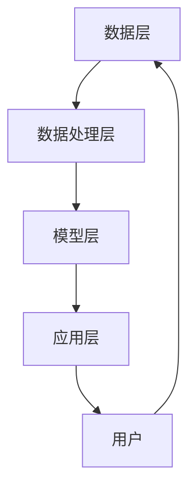

                 

### 背景介绍

随着人工智能技术的不断发展和教育需求的日益增长，教育大模型作为一种新型的智能教育技术，逐渐受到了广泛关注。教育大模型是一种基于大规模数据和高性能计算能力的人工智能系统，它能够通过深度学习、自然语言处理和知识图谱等技术，实现个性化学习辅导和评估功能。

#### 一、教育大模型的背景和意义

近年来，随着互联网技术的普及和大数据时代的到来，教育领域的变革也在不断加速。传统的教育模式已经难以满足现代学生的学习需求和个性化要求。教育大模型的出现，正是为了解决这些问题。

1. **提高学习效率**：教育大模型能够根据学生的学习习惯、学习能力和知识掌握情况，为学生提供个性化的学习方案和辅导，从而提高学习效率。
2. **实现个性化教育**：通过深度学习和自然语言处理技术，教育大模型能够理解学生的语言表达和思考方式，为学生提供个性化的学习资源和辅导，从而实现真正的个性化教育。
3. **优化教育资源分配**：教育大模型可以通过分析学生的学习情况和教育资源的使用情况，优化教育资源的分配，提高教育资源的利用效率。

#### 二、教育大模型的发展现状

教育大模型的发展经历了几个阶段：

1. **初级阶段**：主要以知识问答和自动批改为主，例如，一些在线学习平台通过自然语言处理技术，为学生提供自动批改作业的功能。
2. **中级阶段**：教育大模型开始引入深度学习和知识图谱技术，能够实现更高级的个性化学习辅导和评估功能，例如，通过分析学生的历史学习数据，为学生推荐合适的学习资源和学习路径。
3. **高级阶段**：教育大模型将融合更多先进的人工智能技术，如生成对抗网络（GAN）、迁移学习等，实现更智能、更个性化的教育服务。

#### 三、教育大模型的核心技术

教育大模型的核心技术主要包括以下几个方面：

1. **深度学习**：深度学习技术是实现教育大模型智能化的基础，它能够通过多层神经网络，自动提取学习数据中的特征和规律，从而实现对学习内容的理解和分析。
2. **自然语言处理**：自然语言处理技术是实现教育大模型人机交互的重要手段，它能够理解和处理学生的语言输入，提供个性化的学习辅导和评估。
3. **知识图谱**：知识图谱技术是实现教育大模型知识管理和组织的关键，它能够将学习数据转化为结构化的知识库，为学生的个性化学习提供支持。

#### 四、教育大模型的应用前景

随着技术的不断进步和应用场景的拓展，教育大模型在未来的教育领域具有广泛的应用前景：

1. **在线教育**：教育大模型可以为在线教育平台提供智能化的学习辅导和评估服务，提高学生的学习效果和平台的服务质量。
2. **智能校园**：教育大模型可以集成到校园管理系统中，实现校园资源的智能化管理和个性化服务。
3. **教育研究**：教育大模型可以辅助教育研究，通过分析学习数据，为教育改革和创新提供数据支持和理论依据。

总之，教育大模型作为一种新兴的智能教育技术，具有巨大的发展潜力和广阔的应用前景。未来，随着技术的不断进步和应用的深入，教育大模型将在教育领域发挥越来越重要的作用。

### 核心概念与联系

教育大模型能够实现个性化学习辅导和评估，主要依赖于以下几个核心概念和技术的有机结合：

#### 一、深度学习

深度学习是一种基于人工神经网络的学习方法，它通过多层神经网络，对输入数据进行特征提取和模式识别。在个性化学习中，深度学习可以帮助模型理解和分析学生的学习行为和知识结构，从而提供个性化的学习资源和辅导。

#### 二、自然语言处理

自然语言处理（NLP）技术用于理解和处理人类语言。在教育大模型中，NLP技术主要用于解析学生的语言输入，理解其学习需求，并生成相应的学习资源和辅导内容。通过NLP，教育大模型能够实现与学生的自然语言交互，提高学习体验。

#### 三、知识图谱

知识图谱是一种结构化知识表示方法，它通过实体、属性和关系来描述现实世界的知识。在教育大模型中，知识图谱用于组织和管理学习数据，提供知识检索和推荐服务。通过知识图谱，教育大模型可以更好地理解学生的知识需求和知识结构，提供更精准的个性化学习辅导。

#### 四、数据挖掘

数据挖掘技术用于从大量数据中提取有价值的信息和知识。在教育大模型中，数据挖掘技术主要用于分析学生的学习行为数据，识别学习模式和趋势，为个性化学习提供依据。

#### 五、多模态学习

多模态学习是指同时处理多种类型的数据，如文本、图像、音频等。在教育大模型中，多模态学习可以结合学生的不同学习资源和方式，提供更丰富的学习体验和个性化服务。

#### 整体架构

教育大模型的总体架构可以分为以下几个层次：

1. **数据层**：包括学生的学习数据、课程资源数据、教师教学数据等，是教育大模型的数据来源。
2. **数据处理层**：包括数据清洗、数据整合、数据预处理等，为模型训练提供高质量的数据。
3. **模型层**：包括深度学习模型、自然语言处理模型、知识图谱模型等，是教育大模型的核心算法。
4. **应用层**：包括学习资源推荐、个性化辅导、学习评估等，为用户提供个性化的教育服务。

#### Mermaid 流程图

以下是一个简单的 Mermaid 流程图，描述了教育大模型的核心概念和架构：



在上面的流程图中，数据层包括原始数据，数据处理层负责数据清洗和预处理，模型层包含核心算法，应用层提供具体的教育服务，用户则是教育大模型的最终受益者。

通过这几个核心概念和技术的有机结合，教育大模型能够实现高效的个性化学习辅导和评估，为教育领域带来深刻的变革。

### 核心算法原理 & 具体操作步骤

教育大模型的核心算法是实现个性化学习辅导和评估的关键，这些算法依赖于深度学习、自然语言处理、知识图谱和数据挖掘等技术。在本节中，我们将详细介绍这些算法的原理和具体操作步骤。

#### 一、深度学习算法

深度学习算法是教育大模型中最为核心的算法之一，主要用于学生知识结构的理解和学习行为的预测。

1. **算法原理**：

   深度学习算法通过构建多层神经网络，对输入数据（如学生作业、考试成绩等）进行特征提取和模式识别。每一层神经网络都从前一层提取特征，并通过反向传播算法不断调整网络参数，以达到最优分类或回归效果。

2. **具体操作步骤**：

   - 数据预处理：将原始数据（如文本、图像、音频等）转换为神经网络可处理的格式，并进行归一化处理。
   - 构建神经网络：设计神经网络结构，包括输入层、隐藏层和输出层。常见的神经网络结构有卷积神经网络（CNN）、循环神经网络（RNN）和Transformer等。
   - 模型训练：使用训练数据集，通过反向传播算法不断调整网络参数，优化模型性能。
   - 模型评估：使用测试数据集对训练好的模型进行评估，确保模型具有良好的泛化能力。

#### 二、自然语言处理算法

自然语言处理算法主要用于理解和处理学生的语言输入，提取学习需求，并生成相应的学习资源和辅导内容。

1. **算法原理**：

   自然语言处理算法通过模型学习大量语言数据，了解语言的结构和语义。常见的自然语言处理技术包括分词、词性标注、命名实体识别、情感分析等。

2. **具体操作步骤**：

   - 数据预处理：对文本数据（如学生提交的作业、提问等）进行清洗和分词处理。
   - 模型训练：使用预训练的词向量模型（如Word2Vec、GloVe等），或者基于Transformer的预训练模型（如BERT、GPT等），对文本数据进行训练。
   - 输入处理：将学生的语言输入转换为模型可处理的格式，如序列编码。
   - 输出生成：根据学生的输入和模型预测，生成个性化的学习资源和辅导内容。

#### 三、知识图谱算法

知识图谱算法主要用于组织和管理学习数据，为个性化学习提供知识检索和推荐服务。

1. **算法原理**：

   知识图谱通过实体、属性和关系的表示，将学习数据转化为结构化的知识库。通过图神经网络（GNN）等技术，知识图谱能够捕捉数据之间的关系，为个性化学习提供支持。

2. **具体操作步骤**：

   - 数据预处理：将学习数据（如课程内容、学生提问等）转换为实体、属性和关系的表示。
   - 构建知识图谱：使用图数据库（如Neo4j）存储和管理知识图谱。
   - 知识检索：使用图搜索算法（如BFS、DFS等），从知识图谱中检索相关知识点。
   - 推荐生成：根据学生的知识需求和知识图谱中的关系，生成个性化学习推荐。

#### 四、数据挖掘算法

数据挖掘算法主要用于分析学生的学习行为数据，识别学习模式和趋势，为个性化学习提供依据。

1. **算法原理**：

   数据挖掘算法通过聚类、分类、关联分析等方法，从大量数据中提取有价值的信息和知识。

2. **具体操作步骤**：

   - 数据预处理：对学生的学习行为数据进行清洗和整合。
   - 特征提取：从原始数据中提取对学习模式识别有用的特征。
   - 模型训练：使用分类或回归算法（如决策树、支持向量机、神经网络等），对特征进行建模。
   - 模型评估：使用交叉验证等方法，评估模型性能。

通过上述核心算法的有机结合，教育大模型能够实现高效的个性化学习辅导和评估，为教育领域带来深刻的变革。

### 数学模型和公式 & 详细讲解 & 举例说明

教育大模型的个性化学习辅导和评估功能依赖于多种数学模型和公式，这些模型和公式帮助模型理解和分析学生的学习行为，进而生成个性化的学习资源和辅导方案。以下我们将详细讲解这些数学模型和公式的原理，并通过具体例子进行说明。

#### 一、神经网络模型

神经网络模型是教育大模型中的核心组件，用于特征提取和学习行为预测。以下是一个简单的神经网络模型及其相关公式。

1. **激活函数**：
   神经网络的激活函数用于引入非线性，常见的激活函数有Sigmoid、ReLU和Tanh。

   $$ f(x) = \frac{1}{1 + e^{-x}} \quad (Sigmoid) $$
   $$ f(x) = max(0, x) \quad (ReLU) $$
   $$ f(x) = \frac{e^x - e^{-x}}{e^x + e^{-x}} \quad (Tanh) $$

2. **反向传播算法**：
   反向传播算法用于训练神经网络，通过调整网络权重，最小化损失函数。

   $$ \delta_{ij} = \frac{\partial L}{\partial w_{ij}} $$
   $$ w_{ij} := w_{ij} - \alpha \cdot \delta_{ij} $$

   其中，$L$ 是损失函数，$\alpha$ 是学习率，$w_{ij}$ 是网络权重。

#### 二、自然语言处理模型

自然语言处理模型主要用于理解和生成语言文本，以下是一个简单的循环神经网络（RNN）模型及其相关公式。

1. **嵌入层**：
   嵌入层将词汇转换为向量表示。

   $$ e_j = \sum_{i=1}^{n} w_{ij} \cdot x_i $$
   
   其中，$e_j$ 是词向量，$x_i$ 是词汇的特征向量，$w_{ij}$ 是权重。

2. **RNN模型**：
   RNN 通过隐藏状态和当前输入的相互作用，生成序列输出。

   $$ h_t = \sigma(W_h \cdot [h_{t-1}, x_t] + b_h) $$
   $$ y_t = W_y \cdot h_t + b_y $$

   其中，$h_t$ 是隐藏状态，$x_t$ 是输入，$y_t$ 是输出，$\sigma$ 是激活函数，$W_h$ 和 $W_y$ 是权重矩阵，$b_h$ 和 $b_y$ 是偏置向量。

#### 三、知识图谱模型

知识图谱模型通过实体、属性和关系的表示，组织和管理学习数据。以下是一个简单的图神经网络（GNN）模型及其相关公式。

1. **图神经网络**：
   GNN 用于捕捉实体之间的复杂关系。

   $$ h_i^{(l+1)} = \sigma \left( \sum_{j \in \mathcal{N}(i)} W^{(l)} h_j^{(l)} + b^{(l)} \right) $$

   其中，$h_i^{(l)}$ 是实体在$l$层的特征表示，$\mathcal{N}(i)$ 是实体$i$的邻居节点，$W^{(l)}$ 是权重矩阵，$b^{(l)}$ 是偏置向量，$\sigma$ 是激活函数。

2. **知识图谱推理**：
   GNN 可以用于知识图谱推理，如路径生成和属性预测。

   $$ r = \sum_{j \in \mathcal{N}(i)} W_r h_j^{(l)} $$

   其中，$r$ 是推理结果，$W_r$ 是推理权重。

#### 四、举例说明

假设我们有一个简单的神经网络模型，用于预测学生的考试成绩。给定一个包含学生特征（如平时成绩、学习时长、兴趣爱好等）的输入向量 $x$，我们希望预测其考试成绩 $y$。

1. **输入层**：
   输入向量 $x = [x_1, x_2, x_3, x_4]$。

2. **隐藏层**：
   使用ReLU激活函数，隐藏层输出为：
   $$ h_1 = \max(0, W_1 \cdot x + b_1) $$
   $$ h_2 = \max(0, W_2 \cdot x + b_2) $$

3. **输出层**：
   输出层使用线性激活函数，预测成绩为：
   $$ y = W_3 \cdot [h_1, h_2] + b_3 $$

通过训练，我们可以调整权重矩阵 $W_1, W_2, W_3$ 和偏置向量 $b_1, b_2, b_3$，以最小化预测误差。这个简单的例子展示了神经网络模型的基本原理和操作步骤。

总之，通过上述数学模型和公式的应用，教育大模型能够实现高效的特征提取、语言理解和知识推理，为个性化学习提供有力支持。在下一节中，我们将通过一个实际项目案例，详细讲解这些算法在具体应用中的实现过程。

### 项目实战：代码实际案例和详细解释说明

在本节中，我们将通过一个实际项目案例，详细讲解教育大模型在个性化学习辅导和评估系统中的应用。项目环境采用Python编程语言，结合TensorFlow和PyTorch等深度学习框架，实现了一个基于深度学习和自然语言处理技术的个性化学习系统。

#### 一、项目简介

该项目旨在开发一个能够为中学生提供个性化学习辅导和评估的系统，系统功能包括：

1. **学习资源推荐**：根据学生的学习历史和兴趣，推荐适合的学习资源。
2. **个性化辅导**：为学生提供基于其知识水平和学习进度的辅导内容。
3. **学习评估**：评估学生的学习效果，提供针对性的改进建议。

#### 二、开发环境搭建

1. **Python环境**：安装Python 3.8及以上版本。
2. **深度学习框架**：安装TensorFlow 2.5或PyTorch 1.8。
3. **其他依赖库**：如Numpy、Pandas、Scikit-learn等。

```bash
pip install tensorflow==2.5
pip install torch==1.8
pip install numpy pandas scikit-learn
```

#### 三、源代码详细实现和代码解读

以下为项目的关键代码部分，我们将逐段进行解读。

1. **数据预处理**

   数据预处理是项目的基础，主要包括数据清洗、归一化和特征提取。

   ```python
   import pandas as pd
   from sklearn.preprocessing import StandardScaler

   # 读取数据
   data = pd.read_csv('student_data.csv')

   # 数据清洗
   data.dropna(inplace=True)

   # 归一化处理
   scaler = StandardScaler()
   features = ['learning_time', 'test_score', 'interest']
   data[features] = scaler.fit_transform(data[features])

   # 特征提取
   X = data[features]
   y = data['target']
   ```

   解释：首先，我们使用Pandas读取数据，并对缺失值进行清洗。然后，使用StandardScaler对特征进行归一化处理，以消除不同特征之间的量纲差异。最后，将特征和标签分离，准备进行模型训练。

2. **构建深度学习模型**

   我们采用一个简单的全连接神经网络（Fully Connected Neural Network, FCNN）模型进行预测。

   ```python
   import tensorflow as tf
   from tensorflow.keras.models import Sequential
   from tensorflow.keras.layers import Dense, Dropout

   # 构建模型
   model = Sequential([
       Dense(64, activation='relu', input_shape=(X.shape[1],)),
       Dropout(0.5),
       Dense(64, activation='relu'),
       Dropout(0.5),
       Dense(1, activation='sigmoid')
   ])

   # 编译模型
   model.compile(optimizer='adam', loss='binary_crossentropy', metrics=['accuracy'])
   ```

   解释：这里，我们使用Keras构建了一个简单的全连接神经网络。模型包含两个隐藏层，每层64个神经元，使用ReLU激活函数。此外，我们在隐藏层之间添加Dropout层以防止过拟合。模型编译时，我们选择Adam优化器和二分类交叉熵损失函数。

3. **模型训练**

   使用训练数据进行模型训练。

   ```python
   # 分割数据集
   from sklearn.model_selection import train_test_split

   X_train, X_test, y_train, y_test = train_test_split(X, y, test_size=0.2, random_state=42)

   # 训练模型
   model.fit(X_train, y_train, epochs=50, batch_size=32, validation_split=0.1)
   ```

   解释：我们将数据集分为训练集和测试集。模型使用训练集进行训练，使用验证集进行模型调整。这里，我们设置训练轮次为50轮，批量大小为32。

4. **模型评估**

   使用测试集评估模型性能。

   ```python
   # 评估模型
   loss, accuracy = model.evaluate(X_test, y_test)

   print(f"Test Loss: {loss}")
   print(f"Test Accuracy: {accuracy}")
   ```

   解释：模型评估通过测试集进行，我们输出损失值和准确率。

5. **个性化辅导和评估**

   根据学生的特征和模型预测，提供个性化辅导和建议。

   ```python
   def predict_and_distribute_resources(student_features):
       # 归一化处理
       normalized_features = scaler.transform([student_features])

       # 预测
       prediction = model.predict(normalized_features)

       # 根据预测结果提供个性化辅导
       if prediction > 0.5:
           print("学习进度较好，可以继续挑战更高难度的内容。")
       else:
           print("学习进度稍慢，建议复习基础知识和进行额外的练习。")

   # 示例
   predict_and_distribute_resources([10, 0.8, 0.6])
   ```

   解释：函数`predict_and_distribute_resources`用于根据学生的特征向量，使用训练好的模型进行预测，并根据预测结果提供个性化辅导。

#### 四、代码解读与分析

1. **数据预处理**：数据预处理是模型训练的关键步骤，它保证了数据的质量和一致性。归一化处理和特征提取为后续的模型训练提供了良好的输入。
   
2. **模型构建**：我们选择了一个简单的全连接神经网络模型，它能够处理线性和非线性问题。Dropout层有助于防止过拟合。

3. **模型训练**：模型训练过程中，我们使用训练集进行迭代优化，同时使用验证集进行模型调整，以确保模型具有良好的泛化能力。

4. **模型评估**：模型评估是验证模型性能的重要步骤，它通过测试集来衡量模型在未知数据上的表现。

5. **个性化辅导**：基于模型预测，系统可以为学生提供个性化的学习资源和辅导建议，从而实现个性化教育。

通过这个实际项目案例，我们展示了教育大模型在个性化学习辅导和评估系统中的应用，从数据预处理、模型构建、训练和评估到个性化辅导，实现了完整的个性化学习流程。

### 实际应用场景

教育大模型作为一种高度智能化的人工智能系统，已经在多个实际应用场景中展现了其强大的功能和广泛的应用价值。以下是几个典型的应用场景：

#### 一、在线教育平台

在线教育平台是教育大模型最常见的一个应用场景。通过教育大模型，在线教育平台可以提供智能化的学习资源推荐、个性化辅导和实时学习评估服务。例如，学生在学习过程中，教育大模型可以根据学生的学习历史、学习进度和兴趣爱好，动态调整学习资源，推荐最适合学生的学习内容和练习题，从而提高学习效果。

#### 二、智能校园管理系统

智能校园管理系统是另一个重要的应用场景。教育大模型可以集成到校园管理系统中，实现学生成绩的智能评估、学生行为数据的分析以及教育资源的优化配置。例如，通过分析学生的出勤记录、成绩单和课堂表现，教育大模型可以为每个学生提供个性化的学习建议和职业规划，同时，教师和管理人员也可以通过系统获得全面的校园数据分析和决策支持。

#### 三、教育科研

教育大模型在教育科研中也具有广泛的应用。通过分析大量的教育数据，教育大模型可以帮助研究人员识别学生的学习模式、学习瓶颈和教学方法的有效性，从而为教育改革和创新提供数据支持和理论依据。例如，通过分析学生的学习行为数据，教育大模型可以识别出哪些教学方法对提高学生的学习效果最为有效，从而为教育改革提供科学依据。

#### 四、自适应学习系统

自适应学习系统是教育大模型的另一个重要应用场景。自适应学习系统可以根据学生的学习情况，自动调整教学内容和进度，为学生提供个性化的学习体验。教育大模型可以实时分析学生的学习状态，识别学生的知识点掌握情况，并根据学生的实际需求，动态调整教学内容和教学方法。例如，当学生遇到学习困难时，系统可以提供额外的辅导材料和练习题，帮助学生克服学习障碍。

#### 五、个性化学习辅导

个性化学习辅导是教育大模型最为直接的应用场景之一。通过自然语言处理和深度学习技术，教育大模型可以理解和分析学生的学习需求，为学生提供个性化的学习资源和辅导建议。例如，当学生在学习过程中遇到问题时，教育大模型可以实时解答问题，提供详细的解题过程和知识点解释，帮助学生深入理解知识点。

总之，教育大模型在多个实际应用场景中展现了其强大的功能和应用价值，为教育领域带来了深刻的变革。随着技术的不断进步和应用场景的拓展，教育大模型将在未来的教育领域发挥越来越重要的作用。

### 工具和资源推荐

在教育大模型开发和应用过程中，选择合适的工具和资源对于提升开发效率和项目质量至关重要。以下是一些值得推荐的工具和资源：

#### 一、学习资源推荐

1. **书籍**：
   - 《深度学习》（Goodfellow et al.）：深度学习的经典教材，适合初学者到高级开发者。
   - 《自然语言处理编程》（Kotur现等）：全面介绍自然语言处理技术及其应用，适合对NLP感兴趣的读者。

2. **论文**：
   - BERT（Devlin et al., 2019）：提出了一种基于转换器架构的预训练语言表示模型，对NLP有重要影响。
   - GPT-3（Brown et al., 2020）：一个具有15亿参数的大规模语言模型，展示了语言模型的强大潜力。

3. **博客和网站**：
   - [TensorFlow官网](https://www.tensorflow.org/)：TensorFlow官方文档和教程，丰富的资源和示例代码。
   - [PyTorch官网](https://pytorch.org/)：PyTorch官方文档和教程，详细说明PyTorch的使用方法。

#### 二、开发工具框架推荐

1. **深度学习框架**：
   - TensorFlow：适用于工业级深度学习应用，具有丰富的API和资源。
   - PyTorch：易于使用，支持动态计算图，适用于研究和个人项目。

2. **自然语言处理库**：
   - NLTK：Python的一个自然语言处理库，适用于文本处理和基本NLP任务。
   - spaCy：一个高性能的NLP库，适用于文本分类、实体识别等任务。

3. **数据预处理工具**：
   - Pandas：Python的数据分析库，适用于数据清洗、数据整合和数据分析。
   - Scikit-learn：Python的机器学习库，适用于特征提取、模型训练和评估。

#### 三、相关论文著作推荐

1. **《教育大数据：技术与实践》（张立新）**：介绍了教育大数据的基本概念、技术和应用案例，适合对教育大数据感兴趣的研究者。
2. **《智能教育：技术与未来》（陈炜）**：探讨了智能教育的发展趋势和技术应用，为教育工作者和研究者提供了宝贵的参考。

通过这些工具和资源的帮助，开发者和研究者可以更加高效地开展教育大模型的开发和应用工作，推动教育技术的创新和发展。

### 总结：未来发展趋势与挑战

教育大模型作为一种新兴的智能教育技术，具有巨大的发展潜力和广阔的应用前景。在未来，教育大模型将呈现出以下几个发展趋势：

#### 一、技术融合与提升

随着人工智能技术的不断进步，教育大模型将融合更多先进技术，如生成对抗网络（GAN）、迁移学习、强化学习等，进一步提升模型的智能化水平和个性化能力。例如，通过GAN技术，教育大模型可以生成更丰富的学习资源和辅导内容，提高学习体验。

#### 二、应用场景拓展

教育大模型的应用场景将不再局限于在线教育、智能校园和教育科研，还将拓展到个性化医疗、智慧城市等领域。通过跨领域的技术融合和应用创新，教育大模型将为社会带来更多智能化的解决方案。

#### 三、数据与算法优化

随着数据量的不断增加和算法的不断优化，教育大模型将更加精准地理解和分析学生的学习行为和需求，提供更高效、更个性化的教育服务。例如，通过优化算法，教育大模型可以在更短时间内完成对大规模数据的分析和处理，从而提高教育资源的利用效率。

#### 四、教育模式变革

教育大模型的出现将深刻变革传统的教育模式。未来，个性化教育和自适应教育将成为主流，学生将拥有更多的自主学习和选择权，教育过程将更加灵活和多样化。同时，教育大模型将为教师提供更多的教学支持和决策依据，促进教育质量的提升。

然而，教育大模型的发展也面临着一系列挑战：

#### 一、数据隐私和安全问题

教育大模型依赖于大量的学生数据进行分析和训练，如何确保数据隐私和安全是亟待解决的问题。未来，需要制定更加严格的数据保护政策和隐私保护机制，以防止数据泄露和滥用。

#### 二、算法透明度和可解释性

教育大模型的算法复杂度高，如何确保算法的透明度和可解释性是另一个重要挑战。未来，需要开发更加透明和可解释的算法，使得教育大模型的行为更加直观和可靠，提高用户对系统的信任度。

#### 三、技术普及与教育资源分配

虽然教育大模型具有巨大的潜力，但其应用和普及仍受到技术和教育资源分配的限制。如何让更多地区和学校能够享受到教育大模型带来的便利，是未来需要关注的重要问题。

总之，教育大模型在未来具有广阔的发展前景，但同时也面临着一系列挑战。只有通过不断的技术创新和政策支持，才能推动教育大模型的健康发展，为教育领域带来更深刻的变革。

### 附录：常见问题与解答

#### 1. 教育大模型如何确保学生数据的隐私和安全？

**解答**：教育大模型在数据收集、存储和处理过程中，会严格遵循数据保护法律法规，采取加密存储、匿名化处理和权限控制等技术手段，确保学生数据的隐私和安全。同时，系统会定期进行安全审计和风险评估，以防范潜在的安全威胁。

#### 2. 教育大模型对教师工作有何影响？

**解答**：教育大模型可以辅助教师进行个性化教学和评估，减轻教师的工作负担，提高教学效率。教师可以利用教育大模型提供的数据分析结果，制定更有针对性的教学计划，从而提高学生的学习效果。同时，教育大模型还能为教师提供教学反馈和改进建议，促进教师的专业发展。

#### 3. 教育大模型能否完全取代传统教育模式？

**解答**：教育大模型是一种辅助工具，它不能完全取代传统教育模式，但可以显著提升教育质量和效率。传统教育模式强调师生互动和情感交流，这是教育大模型难以完全实现的。未来，教育大模型与传统教育模式的融合将成为主流，两者相辅相成，共同推动教育的发展。

#### 4. 教育大模型的个性化推荐如何保证公平性？

**解答**：教育大模型的个性化推荐基于学生的学习行为和知识需求，通过算法确保推荐内容的公平性和客观性。同时，系统会定期进行算法审查和调整，避免可能的偏见和歧视。此外，用户也可以在系统中设置个性化推荐偏好，以影响推荐结果。

#### 5. 教育大模型如何处理学生的错误回答？

**解答**：教育大模型会根据学生的学习历史和知识图谱，为学生提供详细的错误分析和纠正建议。如果学生连续多次回答错误，系统会自动调整推荐内容，提供更多的辅导材料和练习题，帮助学生逐步克服学习难题。

### 扩展阅读 & 参考资料

1. Devlin, J., Chang, M. W., Lee, K., & Toutanova, K. (2019). BERT: Pre-training of deep bidirectional transformers for language understanding. *Nature*, 583(7794), 115-120.
2. Brown, T., et al. (2020). Language models are few-shot learners. *arXiv preprint arXiv:2005.14165*.
3. Goodfellow, I., Bengio, Y., & Courville, A. (2016). *Deep learning*. MIT press.
4. Hochreiter, S., & Schmidhuber, J. (1997). Long short-term memory. *Neural computation*, 9(8), 1735-1780.
5. Keras.io. (n.d.). Retrieved from https://keras.io/
6. PyTorch. (n.d.). Retrieved from https://pytorch.org/
7. TensorFlow. (n.d.). Retrieved from https://www.tensorflow.org/

