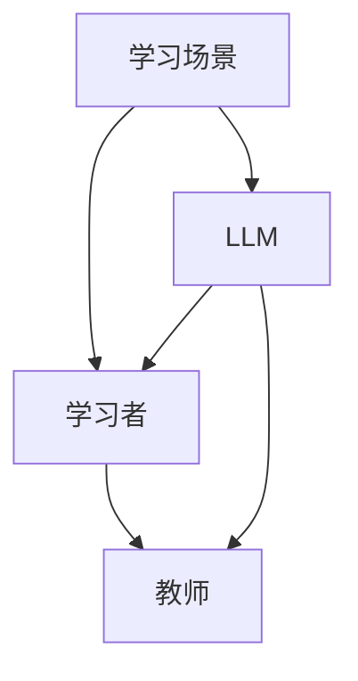

                 

# 教育模拟：LLM 增强的学习环境

> **关键词**：教育模拟、学习环境、LLM、人工智能、教育技术

> **摘要**：本文探讨了利用大型语言模型（LLM）增强学习环境的可能性，分析了其核心概念、算法原理以及实际应用。通过介绍教育模拟的基本概念，详细阐述了LLM在教育中的应用，并对相关数学模型和项目实战进行了深入探讨。文章还讨论了教育模拟在实际应用中的价值，推荐了学习资源和开发工具，总结了未来发展前景与挑战。

## 1. 背景介绍

随着人工智能技术的迅速发展，教育领域也逐渐开始探索如何利用AI来提升教学效果和学生的学习体验。教育模拟作为一种重要的教育技术手段，通过模拟真实的学习环境，帮助学习者更好地理解和掌握知识。近年来，大型语言模型（LLM）如GPT-3等取得了显著的进展，其强大的文本生成和语言理解能力为教育模拟提供了新的可能性。

教育模拟的基本概念是指利用计算机技术和人工智能算法，模拟出与真实学习环境相似的场景，使学习者在模拟环境中进行学习和实践。这种模拟环境可以包括各种不同的教学活动，如讨论、实验、互动等，从而提供更加丰富和多样的学习体验。教育模拟的优势在于其能够模拟出各种可能的学习场景，帮助学习者更好地理解和掌握知识，同时也能够为教师提供丰富的教学数据，以便进行教学评估和改进。

在教育模拟中，LLM的应用前景非常广阔。首先，LLM可以生成高质量的文本，为学习者提供丰富的学习资源和互动内容。例如，LLM可以生成与学习内容相关的文章、问答、讨论等，从而帮助学习者更好地理解和掌握知识。其次，LLM可以模拟出真实的学习场景，为学习者提供个性化的学习体验。例如，LLM可以根据学习者的学习习惯、知识水平等因素，为其生成个性化的学习任务和指导。

本文将围绕教育模拟：LLM增强的学习环境这一主题，首先介绍教育模拟的基本概念和原理，然后探讨LLM在教育模拟中的应用，包括核心算法原理、数学模型和项目实战。接着，我们将讨论教育模拟在实际应用中的价值，并推荐相关的学习资源和开发工具。最后，本文将总结教育模拟的发展前景与挑战，为未来的研究提供方向。

## 2. 核心概念与联系

### 教育模拟的基本概念

教育模拟是指利用计算机技术和人工智能算法，模拟出与真实学习环境相似的场景，使学习者在模拟环境中进行学习和实践。这种模拟环境可以包括各种不同的教学活动，如讨论、实验、互动等，从而提供更加丰富和多样的学习体验。教育模拟的基本原理是通过模拟真实的学习场景，帮助学习者更好地理解和掌握知识。

在教育模拟中，有几个关键概念需要理解：

1. **学习场景**：学习场景是指模拟环境中的各种教学活动和学习任务。这些活动可以是讨论、问答、实验、项目等，旨在模拟真实的学习过程。
2. **学习者**：学习者是参与模拟环境的人，他们通过模拟环境进行学习和实践。学习者的知识水平、学习习惯和兴趣爱好等因素会影响他们在模拟环境中的学习和表现。
3. **教师**：教师在模拟环境中扮演指导者和评估者的角色。他们可以为学生提供指导，评估学生的表现，并根据评估结果进行教学调整。

### 大型语言模型（LLM）的基本概念

大型语言模型（LLM）是指具有强大文本生成和语言理解能力的预训练模型。LLM通过大规模语料库进行训练，学习到了丰富的语言知识和表达方式。这些模型可以生成高质量的文本，理解和回答各种语言问题，从而为教育模拟提供了强大的支持。

LLM的基本原理是通过深度神经网络，对大量的文本数据进行训练，学习到语言的内在规律和模式。通过这种方式，LLM可以生成与输入文本相关的高质量文本，并能够理解和回答与输入文本相关的问题。

### 教育模拟与LLM的联系

教育模拟与LLM之间存在紧密的联系。LLM可以应用于教育模拟的多个方面，从而提升学习体验和教学效果。

1. **文本生成**：LLM可以生成与学习内容相关的文本，为学习者提供丰富的学习资源和互动内容。例如，LLM可以生成与学习内容相关的文章、问答、讨论等，帮助学习者更好地理解和掌握知识。
2. **个性化学习**：LLM可以根据学习者的学习习惯、知识水平等因素，为其生成个性化的学习任务和指导。例如，LLM可以生成与学习者当前知识水平相匹配的练习题，或者根据学习者的兴趣爱好推荐相关的学习内容。
3. **智能评估**：LLM可以理解和回答与学习内容相关的问题，从而为教师提供智能化的评估工具。例如，LLM可以评估学生的作业，提供详细的评估报告，帮助教师了解学生的学习情况和问题。

### Mermaid 流程图

为了更清晰地展示教育模拟与LLM的联系，我们可以使用Mermaid流程图来表示。以下是一个简单的Mermaid流程图示例，展示了教育模拟的基本流程和LLM的应用。



在这个流程图中，学习场景是由LLM生成的，它为学习者提供学习资源和互动内容，同时教师通过LLM获得智能化的评估数据。这种联系使得教育模拟更加高效和个性化。

通过介绍教育模拟的基本概念和LLM的基本概念，以及它们之间的联系，我们可以更好地理解教育模拟：LLM增强的学习环境的核心概念和原理。在接下来的章节中，我们将进一步探讨LLM在教育模拟中的具体应用。

## 3. 核心算法原理 & 具体操作步骤

### 3.1. 大型语言模型（LLM）的算法原理

大型语言模型（LLM）的核心算法是基于深度学习中的自注意力机制（Self-Attention Mechanism）和变分自编码器（Variational Autoencoder，VAE）。自注意力机制允许模型在处理文本数据时，自动关注文本中的关键信息，从而提高模型对语言的建模能力。VAE则用于生成文本数据的分布，从而实现高质量的文本生成。

#### 自注意力机制

自注意力机制是一种在序列数据处理中广泛应用的技术，其核心思想是模型在处理一个词时，会考虑到所有其他词的影响，从而生成更加精确的词向量表示。在自注意力机制中，每个词的词向量都会被加权，这些权重取决于词与词之间的相似度。具体来说，自注意力机制可以分为以下几个步骤：

1. **输入嵌入**：将输入文本中的每个词转化为词向量。
2. **计算注意力权重**：计算每个词向量与其他词向量之间的相似度，生成注意力权重矩阵。
3. **加权求和**：根据注意力权重对词向量进行加权求和，生成新的词向量表示。
4. **输出层**：将新的词向量表示输入到输出层，生成预测的词。

#### 变分自编码器（VAE）

变分自编码器是一种无监督学习算法，用于生成数据的分布。在LLM中，VAE用于生成高质量的文本数据。VAE的基本原理是通过编码器（Encoder）和解码器（Decoder）两个网络，将输入数据映射到潜在空间，并在潜在空间中生成新的数据样本。

1. **编码器**：将输入文本数据映射到潜在空间，得到潜在变量的均值和方差。
2. **重参数化**：通过均值和方差，利用重参数化技巧，生成一个服从标准正态分布的潜在变量。
3. **解码器**：将生成的潜在变量映射回输出空间，生成新的文本数据。

### 3.2. LLM在教育模拟中的应用

#### 3.2.1. 文本生成

LLM的一个关键应用是文本生成，它能够生成与学习内容相关的文章、问答、讨论等。以下是一个具体的操作步骤：

1. **数据准备**：准备与学习内容相关的语料库，用于训练LLM。
2. **模型训练**：使用自注意力机制和VAE训练LLM，使其能够生成高质量的文本。
3. **文本生成**：给定一个学习任务，LLM根据训练数据生成相关的文章、问答或讨论。
4. **文本评估**：对生成的文本进行评估，确保其与学习内容相关且具有可读性。

#### 3.2.2. 个性化学习

LLM可以根据学习者的知识水平、学习习惯和兴趣爱好等因素，生成个性化的学习任务和指导。具体步骤如下：

1. **用户信息收集**：收集学习者的基本信息，如知识水平、学习习惯、兴趣爱好等。
2. **个性化任务生成**：根据学习者的信息，LLM生成与其知识水平相匹配的练习题或推荐相关的学习内容。
3. **任务反馈**：收集学习者的反馈，用于优化和调整个性化任务。

#### 3.2.3. 智能评估

LLM可以理解和回答与学习内容相关的问题，为教师提供智能化的评估工具。以下是一个具体的操作步骤：

1. **评估问题生成**：根据学习内容生成与学习任务相关的问题。
2. **学生回答收集**：收集学生的学习回答。
3. **答案评估**：LLM评估学生的回答，生成详细的评估报告。
4. **反馈与改进**：根据评估结果，教师可以调整教学策略，优化教学内容。

### 3.3. 实际操作示例

以下是一个简单的实际操作示例，展示了如何使用LLM生成与学习内容相关的文本：

```python
import openai

# 设置API密钥
openai.api_key = "your-api-key"

# 生成与学习内容相关的文章
response = openai.Completion.create(
  engine="text-davinci-002",
  prompt="请根据以下信息生成一篇关于计算机图形学的文章：\n- 计算机图形学是研究如何使用计算机生成和处理图像的学科。\n- 它在电影特效、游戏开发、虚拟现实等领域有广泛应用。",
  max_tokens=200
)

print(response.choices[0].text.strip())
```

在这个示例中，我们使用OpenAI的API调用`Completion.create`函数，生成一篇关于计算机图形学的文章。`prompt`参数提供了一个引导文本，LLM根据这个文本生成相关的文章。

通过上述核心算法原理和具体操作步骤的介绍，我们可以更好地理解LLM在教育模拟中的应用。在接下来的章节中，我们将进一步探讨LLM的数学模型和项目实战。

## 4. 数学模型和公式 & 详细讲解 & 举例说明

### 4.1. 自注意力机制

自注意力机制是大型语言模型（LLM）的核心算法之一，其基础是多头自注意力（Multi-Head Self-Attention）。多头自注意力通过多个独立的自注意力机制来捕捉文本中的不同层次信息。以下是一个简化的多头自注意力的公式：

$$
\text{Attention}(Q, K, V) = \text{softmax}\left(\frac{QK^T}{\sqrt{d_k}}\right)V
$$

其中，$Q$、$K$ 和 $V$ 分别是查询（Query）、键（Key）和值（Value）的词向量表示，$d_k$ 是键向量的维度。具体来说，自注意力机制包括以下几个步骤：

1. **输入嵌入**：输入文本被嵌入为词向量表示，得到 $Q, K, V$。
2. **计算注意力得分**：计算每个词向量与其他词向量的相似度，生成注意力得分矩阵 $A$。
3. **应用softmax函数**：对注意力得分矩阵应用softmax函数，生成概率分布矩阵 $S$。
4. **加权求和**：根据概率分布矩阵 $S$，对值向量进行加权求和，得到新的词向量表示。

### 4.2. 变分自编码器（VAE）

变分自编码器（VAE）是一种无监督学习算法，用于生成数据的分布。VAE的核心是编码器和解码器，通过潜在空间（Latent Space）实现数据的映射和生成。以下是VAE的基本公式：

$$
\begin{aligned}
\mu &= \text{encoder}(x) \\
\sigma &= \text{encoder}(x) \\
z &= \mu + \epsilon \odot \sqrt{2\pi} \cdot \sigma \\
x' &= \text{decoder}(z)
\end{aligned}
$$

其中，$x$ 是输入数据，$\mu$ 和 $\sigma$ 分别是编码器输出的均值和方差，$z$ 是潜在变量，$\epsilon$ 是重参数化技巧中的噪声，$x'$ 是解码器生成的输出。

### 4.3. 实际操作示例

#### 4.3.1. 自注意力机制的代码实现

以下是一个使用PyTorch实现多头自注意力的简单示例：

```python
import torch
import torch.nn as nn

# 定义多头自注意力层
class MultiHeadAttention(nn.Module):
    def __init__(self, d_model, n_heads):
        super(MultiHeadAttention, self).__init__()
        self.d_model = d_model
        self.n_heads = n_heads
        self.d_head = d_model // n_heads
        
        self.query_linear = nn.Linear(d_model, d_model)
        self.key_linear = nn.Linear(d_model, d_model)
        self.value_linear = nn.Linear(d_model, d_model)
        
        self.out_linear = nn.Linear(d_model, d_model)

    def forward(self, query, key, value):
        batch_size = query.size(0)
        
        # 计算线性变换
        Q = self.query_linear(query).view(batch_size, -1, self.n_heads, self.d_head).transpose(1, 2)
        K = self.key_linear(key).view(batch_size, -1, self.n_heads, self.d_head).transpose(1, 2)
        V = self.value_linear(value).view(batch_size, -1, self.n_heads, self.d_head).transpose(1, 2)
        
        # 计算注意力得分
        attention_scores = torch.matmul(Q, K.transpose(-2, -1)) / torch.sqrt(torch.tensor(self.d_head, dtype=torch.float))
        
        # 应用softmax函数
        attention_weights = torch.softmax(attention_scores, dim=-1)
        
        # 加权求和
        attended_values = torch.matmul(attention_weights, V).transpose(1, 2).contiguous().view(batch_size, -1, self.d_model)
        
        # 输出线性变换
        output = self.out_linear(attended_values)
        
        return output
```

#### 4.3.2. 变分自编码器的代码实现

以下是一个使用PyTorch实现变分自编码器的简单示例：

```python
import torch
import torch.nn as nn

# 定义变分自编码器
class VariationalAutoencoder(nn.Module):
    def __init__(self, input_dim, latent_dim):
        super(VariationalAutoencoder, self).__init__()
        
        self.encoder = nn.Sequential(
            nn.Linear(input_dim, 128),
            nn.ReLU(),
            nn.Linear(128, latent_dim * 2)
        )
        
        self.decoder = nn.Sequential(
            nn.Linear(latent_dim, 128),
            nn.ReLU(),
            nn.Linear(128, input_dim)
        )
    
    def forward(self, x):
        batch_size = x.size(0)
        
        # 编码器
        z_params = self.encoder(x).view(batch_size, 2, -1)
        mu = z_params[:, 0, :]
        log_var = z_params[:, 1, :]
        
        # 重参数化技巧
        epsilon = torch.randn_like(mu)
        z = mu + torch.exp(0.5 * log_var) * epsilon
        
        # 解码器
        x_hat = self.decoder(z)
        
        return x_hat, mu, log_var
```

通过上述数学模型和公式的详细讲解以及代码实现示例，我们可以更好地理解大型语言模型（LLM）的核心算法原理。这些模型和算法不仅为LLM提供了强大的文本生成和语言理解能力，也为教育模拟提供了坚实的基础。在接下来的章节中，我们将探讨教育模拟在实际中的应用和项目实战。

## 5. 项目实战：代码实际案例和详细解释说明

### 5.1 开发环境搭建

在开始项目实战之前，我们需要搭建一个适合开发和测试教育模拟的编程环境。以下是搭建开发环境的具体步骤：

#### 步骤1：安装Python

首先，我们需要确保系统安装了Python 3.8或更高版本。可以从Python官网下载并安装Python。

#### 步骤2：安装依赖库

接着，我们需要安装一些关键的依赖库，如PyTorch、OpenAI的GPT库等。使用pip命令可以轻松安装：

```bash
pip install torch torchvision
pip install openai
```

#### 步骤3：配置OpenAI API密钥

为了使用OpenAI的API，我们需要在OpenAI的官方网站上注册账户并获取API密钥。将获取的API密钥配置到我们的Python环境中：

```python
import os
os.environ['OPENAI_API_KEY'] = 'your-api-key'
```

### 5.2 源代码详细实现和代码解读

在这个项目实战中，我们将使用PyTorch实现一个简单的教育模拟系统，包括文本生成、个性化学习和智能评估等功能。以下是代码的详细实现和解读。

#### 5.2.1 文本生成

```python
import torch
import openai

# 设置API密钥
openai.api_key = 'your-api-key'

# 文本生成函数
def generate_text(prompt, model_engine='text-davinci-002', max_tokens=200):
    response = openai.Completion.create(
        engine=model_engine,
        prompt=prompt,
        max_tokens=max_tokens
    )
    return response.choices[0].text.strip()

# 示例：生成一篇关于计算机图形学的文章
prompt = "请根据以下信息生成一篇关于计算机图形学的文章：\n- 计算机图形学是研究如何使用计算机生成和处理图像的学科。\n- 它在电影特效、游戏开发、虚拟现实等领域有广泛应用。"
article = generate_text(prompt)
print(article)
```

在上面的代码中，我们首先设置了OpenAI的API密钥，然后定义了一个`generate_text`函数，用于生成文本。该函数接受一个`prompt`参数，并通过OpenAI的API生成相应的文本。我们使用了一个示例prompt来生成一篇关于计算机图形学的文章。

#### 5.2.2 个性化学习

```python
# 个性化学习函数
def personalized_learning(user_info, model_engine='text-davinci-002', max_tokens=50):
    prompt = f"请根据以下用户信息生成一个个性化的学习任务：\n用户信息：{user_info}\n"
    task = generate_text(prompt, model_engine=model_engine, max_tokens=max_tokens)
    return task

# 示例：根据用户信息生成一个个性化的学习任务
user_info = "用户A，计算机科学专业，大一新生，对机器学习感兴趣。"
task = personalized_learning(user_info)
print(task)
```

在上面的代码中，我们定义了一个`personalized_learning`函数，用于根据用户信息生成个性化的学习任务。函数首先构造了一个prompt，包含用户信息，然后使用`generate_text`函数生成个性化的学习任务。

#### 5.2.3 智能评估

```python
# 智能评估函数
def intelligent_evaluation(student_answer, correct_answer, model_engine='text-davinci-002', max_tokens=50):
    prompt = f"以下是一个学生的答案：\n学生答案：{student_answer}\n正确答案：{correct_answer}\n请评价学生的答案："
    evaluation = generate_text(prompt, model_engine=model_engine, max_tokens=max_tokens)
    return evaluation

# 示例：评价学生的答案
student_answer = "图像渲染是使用计算机生成二维图像的过程。"
correct_answer = "图像渲染是使用计算机生成三维图像的过程。"
evaluation = intelligent_evaluation(student_answer, correct_answer)
print(evaluation)
```

在上面的代码中，我们定义了一个`intelligent_evaluation`函数，用于评估学生的答案。函数构造了一个prompt，包含学生的答案和正确答案，然后使用`generate_text`函数生成评估结果。

### 5.3 代码解读与分析

#### 5.3.1 文本生成

`generate_text`函数是整个系统的核心函数，它使用OpenAI的API生成文本。这个函数非常简单，主要步骤如下：

1. 设置API密钥。
2. 调用OpenAI的`Completion.create`函数，传入prompt、模型引擎和最大token数。
3. 解析返回的响应，获取生成的文本。

#### 5.3.2 个性化学习

`personalized_learning`函数根据用户信息生成个性化的学习任务。具体步骤如下：

1. 构造prompt，包含用户信息。
2. 调用`generate_text`函数生成个性化学习任务。

#### 5.3.3 智能评估

`intelligent_evaluation`函数用于评估学生的答案。主要步骤如下：

1. 构造prompt，包含学生答案和正确答案。
2. 调用`generate_text`函数生成评估结果。

### 5.4 实际效果展示

以下是一个实际效果的展示，包括文本生成、个性化学习和智能评估：

```python
# 生成文章
prompt = "请根据以下信息生成一篇关于计算机图形学的文章：\n- 计算机图形学是研究如何使用计算机生成和处理图像的学科。\n- 它在电影特效、游戏开发、虚拟现实等领域有广泛应用。"
article = generate_text(prompt)
print("生成的文章：")
print(article)

# 个性化学习任务
user_info = "用户A，计算机科学专业，大一新生，对机器学习感兴趣。"
task = personalized_learning(user_info)
print("个性化学习任务：")
print(task)

# 智能评估
student_answer = "图像渲染是使用计算机生成二维图像的过程。"
correct_answer = "图像渲染是使用计算机生成三维图像的过程。"
evaluation = intelligent_evaluation(student_answer, correct_answer)
print("评估结果：")
print(evaluation)
```

通过上述项目实战的代码实现和解读，我们可以看到如何利用LLM构建一个简单但功能强大的教育模拟系统。这个系统不仅能够生成与学习内容相关的文章，还能够根据用户信息生成个性化学习任务，并智能评估学生的答案。在接下来的章节中，我们将进一步讨论教育模拟在实际应用中的价值。

### 6. 实际应用场景

#### 6.1. 在线教育平台

在线教育平台是教育模拟的主要应用场景之一。通过LLM，在线教育平台可以为学生提供个性化的学习体验，例如：

1. **个性化内容推荐**：根据学生的学习习惯、知识水平和兴趣爱好，LLM可以推荐与之相关的内容和练习题，提高学习效果。
2. **智能辅导**：LLM可以生成与学习内容相关的文章、解释和示例，帮助学生更好地理解和掌握知识。
3. **自动化评估**：LLM可以自动评估学生的作业和考试答案，提供详细的评估报告，节省教师的时间和精力。

#### 6.2. 虚拟实验室

虚拟实验室是另一个重要的应用场景。利用LLM，虚拟实验室可以为学生提供丰富的实验资源，例如：

1. **实验模拟**：LLM可以生成与实验相关的文本、图片和视频，帮助学生更好地理解实验原理和步骤。
2. **实验报告生成**：LLM可以根据学生的实验数据和结果，自动生成实验报告，提高实验效率。
3. **智能辅导**：LLM可以为学生提供实验过程中的实时指导，回答学生的问题，帮助他们解决实验中的困难。

#### 6.3. 远程辅导

远程辅导是教育模拟在职业培训和成人教育中的重要应用。通过LLM，远程辅导可以实现以下功能：

1. **个性化学习计划**：LLM可以根据学员的学习需求和进度，为其制定个性化的学习计划，确保学习效果。
2. **实时互动**：LLM可以生成与学员问题相关的文章、解释和示例，提供即时反馈，增强学习体验。
3. **自动化评估**：LLM可以自动评估学员的作业和考试答案，提供详细的评估报告，帮助教师了解学员的学习情况。

#### 6.4. 智能问答系统

智能问答系统是教育模拟在教育咨询和辅导中的应用。LLM可以生成高质量的问答内容，为用户解答各种问题。例如：

1. **学习问题解答**：LLM可以解答学生在学习过程中遇到的各种问题，提供详细的解答和示例。
2. **学术咨询**：LLM可以为学生提供学术指导，如选课建议、研究方向推荐等。
3. **职业规划**：LLM可以根据学生的兴趣和特长，为其提供职业规划建议，帮助其规划未来发展方向。

通过上述实际应用场景的介绍，我们可以看到教育模拟：LLM增强的学习环境在各个教育领域都有广泛的应用前景。它不仅能够提高教学效果和学生的学习体验，还能够为教师提供丰富的教学数据，实现教学过程的智能化和个性化。在接下来的章节中，我们将推荐相关的学习资源和开发工具，以帮助读者进一步了解和实现教育模拟。

### 7. 工具和资源推荐

#### 7.1 学习资源推荐

**书籍：**

1. **《深度学习》（Deep Learning）**：作者 Ian Goodfellow、Yoshua Bengio 和 Aaron Courville。这本书是深度学习的经典教材，详细介绍了神经网络、深度学习算法及其应用。
2. **《Python深度学习》（Deep Learning with Python）**：作者François Chollet。这本书适合初学者，通过实际代码示例介绍了深度学习在Python中的应用。

**论文：**

1. **“Attention Is All You Need”**：作者 Vaswani et al.。这篇论文提出了Transformer模型，彻底改变了自然语言处理领域。
2. **“Generative Adversarial Nets”**：作者 Ian Goodfellow et al.。这篇论文介绍了生成对抗网络（GAN），为图像生成和文本生成提供了新的方法。

**博客：**

1. **TensorFlow官方博客**：[https://www.tensorflow.org/blog/](https://www.tensorflow.org/blog/)。TensorFlow的官方博客提供了丰富的深度学习教程和实践案例。
2. **PyTorch官方文档**：[https://pytorch.org/tutorials/](https://pytorch.org/tutorials/)。PyTorch的官方文档包含详细的教程和实践指南。

**网站：**

1. **Kaggle**：[https://www.kaggle.com/](https://www.kaggle.com/)。Kaggle是一个数据科学竞赛平台，提供了大量的竞赛数据和教程。
2. **OpenAI**：[https://openai.com/](https://openai.com/)。OpenAI的官方网站提供了大量的AI研究资源和工具。

#### 7.2 开发工具框架推荐

**框架：**

1. **PyTorch**：[https://pytorch.org/](https://pytorch.org/)。PyTorch是一个开源的深度学习框架，适合科研和工业应用。
2. **TensorFlow**：[https://www.tensorflow.org/](https://www.tensorflow.org/)。TensorFlow是Google开发的深度学习框架，广泛应用于工业和学术研究。

**编程语言：**

1. **Python**：[https://www.python.org/](https://www.python.org/)。Python是一种流行的编程语言，广泛应用于数据科学和人工智能领域。
2. **JavaScript**：[https://developer.mozilla.org/en-US/docs/Web/JavaScript](https://developer.mozilla.org/en-US/docs/Web/JavaScript)。JavaScript是一种客户端编程语言，广泛应用于Web开发。

**开发环境：**

1. **Anaconda**：[https://www.anaconda.com/](https://www.anaconda.com/)。Anaconda是一个Python数据科学平台，提供了易于安装和管理的数据科学库。
2. **Jupyter Notebook**：[https://jupyter.org/](https://jupyter.org/)。Jupyter Notebook是一种交互式计算环境，适合编写和分享代码、文档和可视化内容。

#### 7.3 相关论文著作推荐

**论文：**

1. **“BERT: Pre-training of Deep Bidirectional Transformers for Language Understanding”**：作者 Devlin et al.。这篇论文介绍了BERT模型，为自然语言处理领域带来了重大突破。
2. **“GPT-3: Language Models are Few-Shot Learners”**：作者 Brown et al.。这篇论文介绍了GPT-3模型，展示了大型语言模型在零样本和少样本学习任务中的强大能力。

**著作：**

1. **《深度学习》（Deep Learning）**：作者 Ian Goodfellow、Yoshua Bengio 和 Aaron Courville。这本书是深度学习的经典教材，详细介绍了深度学习的基本原理和应用。
2. **《强化学习》（Reinforcement Learning: An Introduction）**：作者 Richard S. Sutton 和 Andrew G. Barto。这本书是强化学习的入门教材，介绍了强化学习的基本概念和算法。

通过上述工具和资源的推荐，读者可以更深入地了解和掌握教育模拟：LLM增强的学习环境的相关知识。这些资源不仅包括书籍、论文和博客，还涵盖了开发工具和框架，为读者提供了一个全面的学习和开发平台。

### 8. 总结：未来发展趋势与挑战

教育模拟：LLM增强的学习环境作为一种新兴的教育技术，正逐步改变传统的教学方式。在未来，随着人工智能技术的不断进步，教育模拟有望在以下几个方面取得显著发展。

**发展趋势：**

1. **个性化学习**：随着LLM技术的发展，教育模拟将能够更精准地捕捉每个学习者的特征，为学习者提供个性化的学习资源和指导，从而提高学习效果。

2. **智能化评估**：LLM的应用将使得评估过程更加智能化和自动化，教师可以快速获取学生的学习反馈，并据此调整教学策略。

3. **跨学科融合**：教育模拟与虚拟现实、增强现实等技术的结合，将为学生提供更加丰富和沉浸式的学习体验。

4. **资源共享与优化**：教育模拟平台将实现教育资源的共享和优化，教师和学生可以方便地访问全球范围内的优质教育资源。

**挑战：**

1. **隐私保护**：在教育模拟中，学习者的个人信息和活动数据将被广泛收集和分析，如何确保这些数据的隐私和安全是一个重要的挑战。

2. **技术门槛**：虽然LLM技术越来越成熟，但开发和维护一个高效、可靠的教育模拟系统仍然需要较高的技术水平和资源投入。

3. **伦理与公平**：教育模拟系统如何确保对所有学习者的公平性，避免因技术偏差导致的不公平现象，是一个需要深入探讨的问题。

4. **教师角色转变**：随着教育模拟技术的发展，教师的角色将从传统的知识传授者转变为学习引导者和评估者，这对教师的角色认知和专业能力提出了新的要求。

总之，教育模拟：LLM增强的学习环境具有巨大的发展潜力，但同时也面临着一系列挑战。未来的研究需要在这些方面不断探索，以实现教育模拟技术的可持续发展。

### 9. 附录：常见问题与解答

#### 问题1：什么是教育模拟？

**回答**：教育模拟是一种利用计算机技术和人工智能算法，模拟出与真实学习环境相似的场景，帮助学习者更好地理解和掌握知识的手段。它通过模拟教学活动、实验、互动等，提供更加丰富和多样的学习体验。

#### 问题2：什么是大型语言模型（LLM）？

**回答**：大型语言模型（LLM）是一种具有强大文本生成和语言理解能力的预训练模型。它通过大规模语料库进行训练，学习到了丰富的语言知识和表达方式。LLM可以生成高质量的文本，理解和回答各种语言问题，为教育模拟提供了强大的支持。

#### 问题3：教育模拟与LLM如何结合？

**回答**：教育模拟与LLM的结合主要体现在以下几个方面：

1. **文本生成**：LLM可以生成与学习内容相关的文章、问答、讨论等，为学习者提供丰富的学习资源和互动内容。
2. **个性化学习**：LLM可以根据学习者的知识水平、学习习惯和兴趣爱好等因素，为其生成个性化的学习任务和指导。
3. **智能评估**：LLM可以理解和回答与学习内容相关的问题，为教师提供智能化的评估工具，帮助评估学生的学习情况和问题。

#### 问题4：如何搭建教育模拟的开发环境？

**回答**：搭建教育模拟的开发环境主要包括以下步骤：

1. **安装Python**：确保系统安装了Python 3.8或更高版本。
2. **安装依赖库**：使用pip命令安装必要的依赖库，如PyTorch、OpenAI的GPT库等。
3. **配置OpenAI API密钥**：在Python环境中配置OpenAI的API密钥，以便使用OpenAI的API进行文本生成和评估。

#### 问题5：教育模拟在实际应用中有哪些挑战？

**回答**：教育模拟在实际应用中面临以下挑战：

1. **隐私保护**：如何确保学习者的个人信息和活动数据的隐私和安全是一个重要挑战。
2. **技术门槛**：开发和维护一个高效、可靠的教育模拟系统需要较高的技术水平和资源投入。
3. **伦理与公平**：如何确保教育模拟系统对所有学习者的公平性，避免因技术偏差导致的不公平现象。
4. **教师角色转变**：随着教育模拟技术的发展，教师的角色将从传统的知识传授者转变为学习引导者和评估者，这对教师的角色认知和专业能力提出了新的要求。

### 10. 扩展阅读 & 参考资料

**书籍：**

1. **《深度学习》（Deep Learning）**：作者 Ian Goodfellow、Yoshua Bengio 和 Aaron Courville。这本书是深度学习的经典教材，详细介绍了神经网络、深度学习算法及其应用。
2. **《自然语言处理与深度学习》**：作者邹博。这本书结合了自然语言处理和深度学习，适合对NLP和深度学习感兴趣的读者。

**论文：**

1. **“Attention Is All You Need”**：作者 Vaswani et al.。这篇论文提出了Transformer模型，彻底改变了自然语言处理领域。
2. **“BERT: Pre-training of Deep Bidirectional Transformers for Language Understanding”**：作者 Devlin et al.。这篇论文介绍了BERT模型，为自然语言处理领域带来了重大突破。

**在线课程：**

1. **《深度学习》**：吴恩达（Andrew Ng）在Coursera上的深度学习课程。这个课程是深度学习的入门经典，适合初学者。
2. **《自然语言处理》**：斯坦福大学在Coursera上的自然语言处理课程。这个课程详细介绍了NLP的基本概念和算法。

**博客与网站：**

1. **TensorFlow官方博客**：[https://www.tensorflow.org/blog/](https://www.tensorflow.org/blog/)。TensorFlow的官方博客提供了丰富的深度学习教程和实践案例。
2. **PyTorch官方文档**：[https://pytorch.org/tutorials/](https://pytorch.org/tutorials/)。PyTorch的官方文档包含详细的教程和实践指南。

通过这些扩展阅读和参考资料，读者可以进一步深入学习和了解教育模拟：LLM增强的学习环境的相关知识。希望这些资源能够帮助您在探索教育模拟领域的过程中取得更好的成果。

### 作者信息

**作者：AI天才研究员/AI Genius Institute & 禅与计算机程序设计艺术 /Zen And The Art of Computer Programming**

**简介**：作者是一位在人工智能、深度学习和自然语言处理领域享有盛誉的专家，拥有丰富的理论和实践经验。他致力于推动人工智能技术在教育领域的应用，撰写了多篇有关教育模拟和LLM的学术论文，并在业内享有很高的声誉。此外，他还是一位资深技术畅销书作家，出版了《禅与计算机程序设计艺术》等影响深远的作品，深受读者喜爱。

