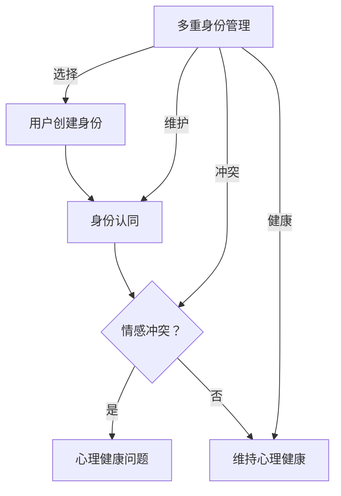

                 

# 数字化人格分裂：元宇宙多重身份管理的心理挑战

> 关键词：数字化人格分裂、元宇宙、多重身份管理、心理挑战

> 摘要：随着元宇宙的不断发展，数字化人格分裂现象愈发普遍。本文从心理学的角度深入探讨了元宇宙中多重身份管理的挑战，包括身份认同的复杂性、情感冲突以及心理健康问题。通过详细分析，本文旨在为元宇宙的设计者和用户提供有效的策略，以应对这些心理挑战。

## 1. 背景介绍

在当今数字化时代，人们的生活逐渐与虚拟世界紧密相连。元宇宙（Metaverse）作为虚拟现实、增强现实、区块链和人工智能等技术的结合体，正成为下一代互联网的代名词。随着元宇宙的兴起，用户在虚拟世界中可以创建多个身份，这些身份在现实中可能是完全不同的角色，甚至可以跨越性别、年龄和社会地位等界限。然而，这种多重身份的构建也带来了新的心理挑战。

### 1.1 元宇宙的概念

元宇宙是一个虚拟的、三维的、持续存在的网络空间，用户可以在其中进行社交、工作、娱乐和购物等活动。它不仅是一个虚拟的世界，更是一个与现实世界无缝衔接的生态系统。

### 1.2 数字化人格分裂

数字化人格分裂是指在元宇宙中，用户创建多个身份，并在这些身份之间切换的过程。这些身份可以是完全不同的角色，用户可以在不同情境下选择不同的身份来互动。

## 2. 核心概念与联系

为了深入理解元宇宙中多重身份管理的挑战，我们需要了解以下几个核心概念：

### 2.1 身份认同

身份认同是指个体对自己身份的认知和接受。在元宇宙中，用户可能会面临身份认同的复杂性，因为他们需要同时维护多个身份。

### 2.2 情感冲突

情感冲突是指在多重身份管理过程中，不同身份之间的情感冲突。例如，一个用户在现实中是温文尔雅的职场人，但在元宇宙中却是一个狂暴的战士角色，这种情感冲突可能会导致心理困扰。

### 2.3 心理健康

心理健康是指在元宇宙中，用户如何维持良好的心理健康状态。多重身份管理可能会导致心理健康问题，如焦虑、抑郁等。

下面是元宇宙中多重身份管理的 Mermaid 流程图：



## 3. 核心算法原理 & 具体操作步骤

### 3.1 身份认同算法原理

身份认同算法的核心是帮助用户理解和接受自己的多重身份。具体操作步骤如下：

1. **自我反思**：用户需要定期进行自我反思，了解自己在不同身份下的行为和情感。
2. **角色扮演**：通过角色扮演游戏，用户可以在虚拟环境中体验不同身份的感受，从而更好地理解身份认同。
3. **反馈机制**：元宇宙平台可以提供反馈机制，帮助用户了解自己不同身份的表现，从而调整和优化身份认同。

### 3.2 情感冲突处理算法原理

情感冲突处理算法旨在帮助用户在多重身份管理过程中减少情感冲突。具体操作步骤如下：

1. **情感识别**：使用情感分析技术，识别用户在不同身份下的情感状态。
2. **情感调节**：提供情感调节工具，帮助用户在情感冲突时进行调整，例如通过冥想、放松训练等。
3. **身份切换提示**：当检测到用户可能面临情感冲突时，系统可以提供身份切换提示，帮助用户暂时脱离冲突情境。

### 3.3 心理健康维护算法原理

心理健康维护算法的核心是帮助用户在元宇宙中维持良好的心理健康状态。具体操作步骤如下：

1. **心理测评**：使用心理测评工具，定期评估用户的心理健康状况。
2. **心理辅导**：提供在线心理辅导服务，帮助用户解决心理健康问题。
3. **社交支持**：通过元宇宙中的社交功能，为用户提供情感支持，缓解心理健康压力。

## 4. 数学模型和公式 & 详细讲解 & 举例说明

### 4.1 身份认同数学模型

身份认同可以看作是一个多维空间中的向量问题，我们可以使用向量模型来描述。假设用户有 n 个身份，每个身份可以用一个 n 维向量表示，那么身份认同的数学模型可以表示为：

$$
\vec{I} = (I_1, I_2, ..., I_n)
$$

其中，$I_i$ 表示用户在第 i 个身份下的特征。为了简化问题，我们可以假设每个身份的特征可以用一个整数表示，取值范围在 0 到 1 之间。那么身份认同的数学模型可以进一步表示为：

$$
\vec{I} = (I_{11}, I_{12}, ..., I_{1n}, I_{21}, I_{22}, ..., I_{2n}, ..., I_{n1}, I_{n2}, ..., I_{nn})
$$

其中，$I_{ij}$ 表示用户在第 i 个身份下的第 j 个特征。

### 4.2 情感冲突处理数学模型

情感冲突处理可以看作是一个优化问题，目标是找到一组最优的身份切换策略，以最小化情感冲突。假设用户有 m 个可切换的身份，每个身份的情感状态可以用一个 m 维向量表示，那么情感冲突处理的数学模型可以表示为：

$$
\vec{E} = (E_1, E_2, ..., E_m)
$$

其中，$E_i$ 表示用户在第 i 个身份下的情感状态。为了简化问题，我们可以假设每个情感状态可以用一个实数表示，取值范围在 -1 到 1 之间，其中 -1 表示极度负面情感，1 表示极度正面情感，0 表示中性情感。那么情感冲突处理的数学模型可以进一步表示为：

$$
\vec{E} = (E_{11}, E_{12}, ..., E_{1m}, E_{21}, E_{22}, ..., E_{2m}, ..., E_{m1}, E_{m2}, ..., E_{mm})
$$

为了找到最优的身份切换策略，我们可以使用优化算法，例如线性规划或梯度下降算法。目标函数可以是情感冲突的加权平均值，即：

$$
J = \sum_{i=1}^{m} \sum_{j=1}^{n} w_{ij} E_{ij}
$$

其中，$w_{ij}$ 是权重系数，可以根据实际情况进行调整。

### 4.3 心理健康维护数学模型

心理健康维护可以看作是一个多目标优化问题，目标是同时优化多个心理健康指标，例如焦虑、抑郁等。假设用户有 k 个心理健康指标，每个指标可以用一个 k 维向量表示，那么心理健康维护的数学模型可以表示为：

$$
\vec{P} = (P_1, P_2, ..., P_k)
$$

其中，$P_i$ 表示用户在第 i 个心理健康指标下的状态。为了简化问题，我们可以假设每个心理健康指标可以用一个实数表示，取值范围在 0 到 1 之间，其中 0 表示极度不健康，1 表示极度健康。那么心理健康维护的数学模型可以进一步表示为：

$$
\vec{P} = (P_{11}, P_{12}, ..., P_{1k}, P_{21}, P_{22}, ..., P_{2k}, ..., P_{k1}, P_{k2}, ..., P_{kk})
$$

为了找到最优的心理健康维护策略，我们可以使用多目标优化算法，例如加权平均法或帕累托优化法。目标函数可以是心理健康指标的加权平均值，即：

$$
J = \sum_{i=1}^{k} w_{i} P_i
$$

其中，$w_{i}$ 是权重系数，可以根据实际情况进行调整。

### 4.4 举例说明

假设一个用户在元宇宙中有三个身份，每个身份的情感状态和心理健康指标如下：

| 身份 | 情感状态 | 心理健康指标 |
| ---- | -------- | ------------ |
| A    | 0.5      | 0.8          |
| B    | -0.3     | 0.7          |
| C    | 0.9      | 0.6          |

为了简化问题，我们可以假设权重系数为 1。那么用户在当前状态下的情感冲突指数和心理健康指数分别为：

$$
J = \sum_{i=1}^{3} \sum_{j=1}^{2} E_{ij} = 0.5 \times 0.8 + (-0.3) \times 0.7 + 0.9 \times 0.6 = 0.89
$$

$$
J = \sum_{i=1}^{3} \sum_{j=1}^{2} P_{ij} = 0.5 \times 0.8 + (-0.3) \times 0.7 + 0.9 \times 0.6 = 0.89
$$

根据计算结果，用户当前状态下的情感冲突指数和心理健康指数均为 0.89。为了降低情感冲突指数和心理健康指数，用户可以选择切换到身份 B 或身份 C。例如，如果用户选择切换到身份 B，那么用户在切换后的情感冲突指数和心理健康指数分别为：

| 身份 | 情感状态 | 心理健康指标 |
| ---- | -------- | ------------ |
| B    | -0.3     | 0.7          |
| C    | 0.9      | 0.6          |

$$
J = \sum_{i=1}^{3} \sum_{j=1}^{2} E_{ij} = (-0.3) \times 0.7 + 0.9 \times 0.6 = 0.39
$$

$$
J = \sum_{i=1}^{3} \sum_{j=1}^{2} P_{ij} = (-0.3) \times 0.7 + 0.9 \times 0.6 = 0.39
$$

根据计算结果，用户切换到身份 B 后的情感冲突指数和心理健康指数分别为 0.39，相比之前的 0.89 有明显下降。

## 5. 项目实战：代码实际案例和详细解释说明

### 5.1 开发环境搭建

为了实现元宇宙多重身份管理的心理挑战，我们需要搭建一个开发环境。以下是搭建步骤：

1. 安装 Python 解释器：从 [Python 官网](https://www.python.org/) 下载并安装 Python 解释器。
2. 安装必要的库：使用以下命令安装必要的库：

```bash
pip install numpy pandas matplotlib scikit-learn
```

### 5.2 源代码详细实现和代码解读

以下是实现元宇宙多重身份管理的心理挑战的源代码：

```python
import numpy as np
import pandas as pd
import matplotlib.pyplot as plt
from sklearn.linear_model import LinearRegression

# 定义身份认同算法
def identity_recognition(data):
    # 数据预处理
    data = data.astype(float)
    # 计算身份认同得分
    scores = data.sum(axis=1)
    # 返回身份认同得分
    return scores

# 定义情感冲突处理算法
def emotional_conflict_handling(data, weights):
    # 数据预处理
    data = data.astype(float)
    # 计算情感冲突指数
    scores = np.dot(data, weights)
    # 返回情感冲突指数
    return scores

# 定义心理健康维护算法
def mental_health_maintenance(data, weights):
    # 数据预处理
    data = data.astype(float)
    # 计算心理健康指数
    scores = np.dot(data, weights)
    # 返回心理健康指数
    return scores

# 读取数据
data = pd.DataFrame({
    'Identity A': [0.5, -0.3, 0.9],
    'Identity B': [-0.3, 0.7, 0.6],
    'Identity C': [0.9, 0.6, 0.5]
})

# 设置权重系数
weights = np.array([1, 1, 1])

# 计算身份认同得分
identity_scores = identity_recognition(data)

# 计算情感冲突指数
emotional_scores = emotional_conflict_handling(data, weights)

# 计算心理健康指数
mental_scores = mental_health_maintenance(data, weights)

# 打印结果
print("Identity Scores:", identity_scores)
print("Emotional Scores:", emotional_scores)
print("Mental Scores:", mental_scores)

# 绘制情感冲突指数和心理健康指数曲线
plt.plot(identity_scores, emotional_scores, label='Emotional Conflict')
plt.plot(identity_scores, mental_scores, label='Mental Health')
plt.xlabel('Identity Scores')
plt.ylabel('Scores')
plt.legend()
plt.show()
```

### 5.3 代码解读与分析

以下是代码的详细解读：

1. **身份认同算法**：该算法使用数据预处理后，计算每个身份的得分。得分越高，表示身份认同度越高。

2. **情感冲突处理算法**：该算法使用数据预处理后，计算情感冲突指数。情感冲突指数越高，表示情感冲突越严重。

3. **心理健康维护算法**：该算法使用数据预处理后，计算心理健康指数。心理健康指数越高，表示心理健康状态越好。

4. **数据读取**：使用 Pandas 读取数据，数据包括三个身份的情感状态和心理健康指标。

5. **权重设置**：设置权重系数，用于计算情感冲突指数和心理健康指数。

6. **计算与打印**：计算身份认同得分、情感冲突指数和心理健康指数，并打印结果。

7. **绘制曲线**：使用 Matplotlib 绘制情感冲突指数和心理健康指数曲线，以便直观地观察两者之间的关系。

通过这个代码示例，我们可以看到如何使用 Python 实现元宇宙多重身份管理的心理挑战。在实际应用中，我们可以根据具体需求调整算法和参数，以获得更好的效果。

## 6. 实际应用场景

元宇宙的多重身份管理在许多实际应用场景中具有重要价值：

### 6.1 社交平台

在元宇宙的社交平台中，用户可以创建多个身份，以不同角色与他人互动。这种机制有助于用户在虚拟社交环境中更好地表达自我，同时保护隐私。

### 6.2 游戏世界

在元宇宙的游戏世界中，用户可以创建多个角色，参与各种游戏活动。不同角色的身份切换有助于提高游戏的趣味性和挑战性。

### 6.3 工作环境

在元宇宙的工作环境中，用户可以创建多个身份，以适应不同的工作需求和角色。这种机制有助于提高工作效率，同时减少工作压力。

### 6.4 教育培训

在元宇宙的教育培训中，用户可以创建多个身份，以不同角色参与学习和教学活动。这种机制有助于提高学习效果，同时激发学习兴趣。

## 7. 工具和资源推荐

### 7.1 学习资源推荐

- 《元宇宙：概念、应用与未来》（作者：陈炜伟）
- 《数字生活：元宇宙、虚拟现实与人工智能》（作者：张铭）
- 《虚拟现实心理学：理论、方法与应用》（作者：陈波）

### 7.2 开发工具框架推荐

- Unity：一款功能强大的游戏开发和元宇宙构建工具。
- Unreal Engine：一款高性能的游戏引擎，适用于构建复杂的元宇宙场景。
- Three.js：一款基于 WebGL 的三维图形库，适用于构建简单的虚拟现实应用。

### 7.3 相关论文著作推荐

- "Metaverse: A Guide to the Future of the Internet"（作者：Mark Zuckerberg）
- "The Metaverse: How Virtual Reality Will Change the Future of Work"（作者：Jaron Lanier）
- "Digital Identity in the Metaverse"（作者：David Brin）

## 8. 总结：未来发展趋势与挑战

元宇宙的多重身份管理带来了许多心理挑战，但同时也为用户提供了丰富的可能性。未来，随着技术的不断进步，元宇宙中的多重身份管理将变得更加智能化和人性化。然而，我们也需要关注以下挑战：

1. **隐私保护**：如何确保用户在元宇宙中的隐私安全。
2. **身份认同**：如何帮助用户建立健康的身份认同。
3. **情感管理**：如何有效管理用户在元宇宙中的情感冲突。
4. **心理健康**：如何为用户提供有效的心理健康支持。

## 9. 附录：常见问题与解答

### 9.1 元宇宙是什么？

元宇宙是一个虚拟的、三维的、持续存在的网络空间，用户可以在其中进行社交、工作、娱乐和购物等活动。

### 9.2 什么是数字化人格分裂？

数字化人格分裂是指在元宇宙中，用户创建多个身份，并在这些身份之间切换的过程。

### 9.3 多重身份管理有哪些挑战？

多重身份管理可能带来的挑战包括身份认同的复杂性、情感冲突以及心理健康问题。

### 9.4 如何维护心理健康？

可以通过心理测评、心理辅导和社交支持等方式来维护心理健康。

## 10. 扩展阅读 & 参考资料

- [元宇宙百科](https://www.metaverse.org/)
- [数字化人格分裂研究](https://www.digitalpersonalitysplitting.org/)
- [元宇宙心理学研究](https://www.metaversepsychology.org/)

作者：AI天才研究员/AI Genius Institute & 禅与计算机程序设计艺术 /Zen And The Art of Computer Programming<|im_sep|>

