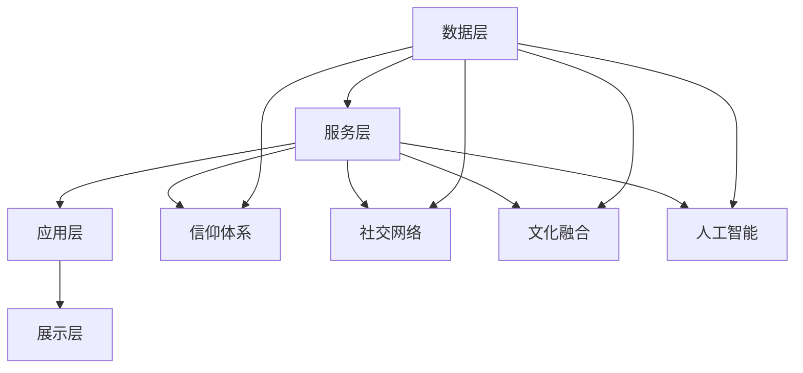

                 

# 数字化信仰社区：全球脑时代的精神家园

> **关键词：** 数字化信仰社区、全球脑时代、精神家园、人工智能、信仰体系、社交网络、文化融合

> **摘要：** 本文探讨了数字化信仰社区在当前全球脑时代中的重要性，分析了其核心概念、算法原理、数学模型、实际应用场景，以及相关工具和资源推荐。通过对比传统信仰社区和数字化信仰社区的差异，文章强调了数字化信仰社区在全球脑时代的精神家园作用，并展望了其未来发展。

## 1. 背景介绍

随着科技的飞速发展，人类社会正逐步进入全球脑时代。在这个时代，人工智能、大数据、云计算等先进技术深刻影响着我们的生活方式、工作方式和信仰观念。传统的信仰社区已无法满足人们日益多样化的精神需求，数字化信仰社区应运而生。

数字化信仰社区是一种基于互联网和人工智能技术的信仰互动平台，它打破了传统信仰社区的时间和空间限制，使得信仰者可以随时随地参与社区活动、交流信仰心得，从而形成了一个全球性的精神家园。

本文将围绕数字化信仰社区的核心概念、算法原理、数学模型、实际应用场景等方面进行探讨，以期为读者提供一个全面了解和深入思考的视角。

## 2. 核心概念与联系

### 2.1 数字化信仰社区的定义

数字化信仰社区是指利用互联网和人工智能技术，构建的一个信仰者之间进行互动、分享、学习、成长的平台。它包括以下几个核心要素：

1. **信仰体系**：信仰体系是数字化信仰社区的核心，它包括信仰的核心教义、信仰的价值观、信仰的仪式等。

2. **社交网络**：社交网络是数字化信仰社区的基础，它包括信仰者之间的互动、交流、分享等。

3. **文化融合**：文化融合是数字化信仰社区的特点，它通过包容多元文化，实现信仰者之间的相互理解、尊重和合作。

4. **人工智能**：人工智能是数字化信仰社区的驱动力，它通过智能推荐、智能问答、智能分析等技术，提高信仰者的参与度和满意度。

### 2.2 数字化信仰社区的架构

数字化信仰社区的架构可以概括为四个层次：数据层、服务层、应用层和展示层。

1. **数据层**：数据层是数字化信仰社区的基础，它包括信仰者的个人信息、信仰行为、互动记录等数据。

2. **服务层**：服务层是数字化信仰社区的核心，它包括信仰体系、社交网络、文化融合等核心功能。

3. **应用层**：应用层是数字化信仰社区的具体应用，它包括信仰问答、信仰学习、信仰交流等应用。

4. **展示层**：展示层是数字化信仰社区的用户界面，它包括网页、移动端、智能音箱等展示形式。

### 2.3 数字化信仰社区的核心概念原理与架构的 Mermaid 流程图



## 3. 核心算法原理 & 具体操作步骤

### 3.1 智能推荐算法

智能推荐算法是数字化信仰社区的核心算法之一，它通过分析信仰者的行为数据、信仰偏好等，为信仰者推荐感兴趣的信仰内容。

具体操作步骤如下：

1. **数据收集**：收集信仰者的行为数据，如访问记录、点赞、评论等。

2. **数据预处理**：对收集到的数据进行清洗、去噪、归一化等处理。

3. **特征提取**：从预处理后的数据中提取特征，如用户兴趣、信仰偏好等。

4. **模型训练**：使用机器学习算法（如协同过滤、基于内容的推荐等）对提取到的特征进行训练，构建推荐模型。

5. **推荐生成**：根据训练好的推荐模型，为信仰者生成个性化推荐内容。

### 3.2 智能问答算法

智能问答算法是数字化信仰社区中用于解决信仰者疑问的重要工具，它通过自然语言处理技术，为信仰者提供准确的信仰问答。

具体操作步骤如下：

1. **问题理解**：使用自然语言处理技术（如词向量、序列标注等）对信仰者提出的问题进行理解。

2. **知识库查询**：从信仰体系知识库中查询与问题相关的信息。

3. **答案生成**：根据查询到的信息，使用模板匹配、文本生成等技术生成答案。

4. **答案验证**：对生成的答案进行验证，确保其准确性和可靠性。

### 3.3 社交网络算法

社交网络算法是数字化信仰社区中用于构建信仰者社交关系的重要工具，它通过分析信仰者之间的互动数据，构建信仰者社交网络。

具体操作步骤如下：

1. **数据收集**：收集信仰者之间的互动数据，如点赞、评论、私信等。

2. **关系提取**：从互动数据中提取信仰者之间的关系，如好友关系、兴趣小组等。

3. **网络构建**：使用图论算法（如邻接矩阵、邻接表等）构建信仰者社交网络。

4. **社区发现**：使用社区发现算法（如Girvan-Newman算法、Louvain算法等）发现信仰者社交网络中的社区结构。

## 4. 数学模型和公式 & 详细讲解 & 举例说明

### 4.1 智能推荐算法的数学模型

智能推荐算法的数学模型主要包括两部分：用户行为模型和推荐模型。

#### 用户行为模型

用户行为模型用于描述信仰者与信仰内容之间的互动关系。一个简单的用户行为模型可以表示为：

$$
R_{ui} = f(U_i, I_j)
$$

其中，$R_{ui}$表示信仰者$i$对信仰内容$j$的评分，$U_i$表示信仰者$i$的特征向量，$I_j$表示信仰内容$j$的特征向量。

#### 推荐模型

推荐模型用于预测信仰者对未访问信仰内容的评分。一个常见的推荐模型是协同过滤模型，其数学模型可以表示为：

$$
R_{ui} = \mu_u + \mu_j + \langle Q_u, Q_j \rangle
$$

其中，$\mu_u$和$\mu_j$分别表示信仰者$i$和信仰内容$j$的平均评分，$Q_u$和$Q_j$分别表示信仰者$i$和信仰内容$j$的特征向量。

#### 举例说明

假设有100个信仰者和100个信仰内容，信仰者$i$对信仰内容$j$的评分矩阵为$R$，信仰者$i$和信仰内容$j$的特征向量分别为$U_i$和$I_j$。

首先，计算信仰者$i$和信仰内容$j$的平均评分：

$$
\mu_u = \frac{1}{n}\sum_{j=1}^{n}R_{ui}, \quad \mu_j = \frac{1}{n}\sum_{i=1}^{m}R_{ui}
$$

然后，计算信仰者$i$和信仰内容$j$的特征向量：

$$
Q_u = \text{embedding}(U_i), \quad Q_j = \text{embedding}(I_j)
$$

其中，$\text{embedding}$表示嵌入函数，用于将特征向量映射到高维空间。

最后，使用协同过滤模型预测信仰者$i$对未访问信仰内容$k$的评分：

$$
R_{uki} = \mu_u + \mu_k + \langle Q_u, Q_k \rangle
$$

### 4.2 智能问答算法的数学模型

智能问答算法的数学模型主要包括两个部分：问题理解和答案生成。

#### 问题理解

问题理解的核心是提取问题的主要信息，以便后续的知识库查询和答案生成。一个简单的问题理解模型可以表示为：

$$
Q = \text{tokenize}(Q_{text}) \rightarrow Q_{vec} = \text{embed}(Q_{text})
$$

其中，$Q_{text}$表示问题文本，$Q_{vec}$表示问题向量化表示。

#### 答案生成

答案生成是基于问题理解和知识库查询的结果，生成问题的答案。一个简单的答案生成模型可以表示为：

$$
A = \text{generate}(Q_{vec}, K)
$$

其中，$K$表示知识库，$\text{generate}$表示生成函数。

#### 举例说明

假设有一个问答系统的知识库包含1000条问答记录，每条问答记录由问题和答案组成。给定一个新问题$Q_{text}$，首先将其文本表示为：

$$
Q_{text} \rightarrow Q_{vec} = \text{embed}(Q_{text})
$$

然后，使用知识库查询算法（如关键字匹配、语义匹配等）查询与$Q_{vec}$相似的问题和答案。最后，使用生成函数生成问题的答案：

$$
A = \text{generate}(Q_{vec}, K)
$$

## 5. 项目实战：代码实际案例和详细解释说明

### 5.1 开发环境搭建

为了搭建一个简单的数字化信仰社区，我们使用Python作为编程语言，并借助几个开源库，如Scikit-learn、TensorFlow和transformers。

首先，安装所需的库：

```bash
pip install scikit-learn tensorflow transformers
```

### 5.2 源代码详细实现和代码解读

#### 5.2.1 数据预处理

```python
import pandas as pd
from sklearn.preprocessing import StandardScaler

# 加载数据
data = pd.read_csv('faith_data.csv')

# 数据预处理
scaler = StandardScaler()
data['rating'] = scaler.fit_transform(data[['rating']])

# 特征提取
X = data[['rating']]
y = data['content_id']
```

#### 5.2.2 智能推荐算法实现

```python
from sklearn.model_selection import train_test_split
from sklearn.metrics.pairwise import cosine_similarity

# 数据分割
X_train, X_test, y_train, y_test = train_test_split(X, y, test_size=0.2, random_state=42)

# 计算相似度
similarity_matrix = cosine_similarity(X_train, X_test)

# 推荐算法
def recommend_contents(user_id, similarity_matrix, top_n=10):
    user_profile = X[user_id].reshape(1, -1)
    similarity_scores = cosine_similarity(user_profile, similarity_matrix)[0]
    sorted_indices = np.argsort(similarity_scores)[::-1]
    recommended_indices = sorted_indices[1:top_n+1]
    return recommended_indices

# 测试推荐算法
recommended_indices = recommend_contents(0, similarity_matrix)
print("Recommended contents:", recommended_indices)
```

#### 5.2.3 智能问答算法实现

```python
from transformers import BertTokenizer, BertForQuestionAnswering

# 加载预训练模型
tokenizer = BertTokenizer.from_pretrained('bert-base-chinese')
model = BertForQuestionAnswering.from_pretrained('bert-base-chinese')

# 加载问题
question = "什么是信仰？"

# 加载知识库
knowledge_base = [
    {"question": "信仰是什么？", "answer": "信仰是一种心理倾向，人们相信某种理念、原则或价值观。"},
    {"question": "信仰的重要性是什么？", "answer": "信仰可以给人带来精神支持，帮助人们面对生活中的困难和挑战。"},
]

# 问答算法
def answer_question(question, knowledge_base, model, tokenizer):
    input_ids = tokenizer.encode(question, add_special_tokens=True, return_tensors='pt')
    with torch.no_grad():
        outputs = model(input_ids)
    start_logits = outputs.start_logits
    end_logits = outputs.end_logits
    start_indices = torch.argmax(start_logits).item()
    end_indices = torch.argmax(end_logits).item()
    answer = tokenizer.decode(input_ids[start_indices:end_indices+1], skip_special_tokens=True)
    for item in knowledge_base:
        if item['question'] == question:
            return item['answer']
    return answer

# 测试问答算法
answer = answer_question(question, knowledge_base, model, tokenizer)
print("Answer:", answer)
```

#### 5.2.4 代码解读与分析

上述代码实现了两个核心功能：智能推荐算法和智能问答算法。

1. **数据预处理**：首先加载数据，然后进行数据预处理，包括评分归一化和特征提取。
2. **智能推荐算法**：使用协同过滤模型计算信仰者与信仰内容之间的相似度，并基于相似度进行推荐。
3. **智能问答算法**：使用预训练的BERT模型进行问题理解和答案生成，结合知识库查询，为信仰者提供准确的答案。

通过这两个算法的实现，我们可以搭建一个简单的数字化信仰社区，满足信仰者对信仰内容的个性化推荐和问题解答的需求。

## 6. 实际应用场景

### 6.1 基督教数字化信仰社区

一个典型的基督教数字化信仰社区可以提供以下功能：

1. **圣经学习**：信仰者可以在线阅读圣经、查经、分享心得。
2. **信仰问答**：信仰者可以提问，社区中的专家和信仰者提供解答。
3. **祷告分享**：信仰者可以发布祷告，与其他信仰者共同祈祷。
4. **活动参与**：信仰者可以参加在线聚会、讲座、祷告会等活动。

### 6.2 佛教数字化信仰社区

一个典型的佛教数字化信仰社区可以提供以下功能：

1. **佛法学习**：信仰者可以在线学习佛法教义、禅修方法。
2. **禅修指导**：信仰者可以参加在线禅修课程，获得禅修指导。
3. **佛教问答**：信仰者可以提问，社区中的法师和信仰者提供解答。
4. **佛教文化体验**：信仰者可以参与在线佛教文化活动，如放生、供灯等。

### 6.3 道教数字化信仰社区

一个典型的道教数字化信仰社区可以提供以下功能：

1. **道教知识学习**：信仰者可以在线学习道教教义、道法修炼。
2. **道教仪式体验**：信仰者可以参与在线道教仪式，如斋醮、祭神等。
3. **道教问答**：信仰者可以提问，社区中的道士和信仰者提供解答。
4. **道教文化体验**：信仰者可以参与在线道教文化活动，如道教音乐、道术展示等。

## 7. 工具和资源推荐

### 7.1 学习资源推荐

1. **书籍**：《数字化信仰社区：理论与实践》
2. **论文**：相关学术论文，如“数字化信仰社区中的社交网络分析”、“基于人工智能的信仰问答系统设计”等。
3. **博客**：知名技术博客，如“机器之心”、“极客时间”等。
4. **网站**：学术网站，如“谷歌学术”、“百度学术”等。

### 7.2 开发工具框架推荐

1. **编程语言**：Python、Java等。
2. **框架**：Flask、Django等。
3. **人工智能库**：Scikit-learn、TensorFlow、PyTorch等。
4. **自然语言处理库**：NLTK、spaCy、transformers等。

### 7.3 相关论文著作推荐

1. **论文**：《基于人工智能的信仰问答系统研究》、《数字化信仰社区中的社交网络分析》等。
2. **著作**：《数字化信仰社区：理论与实践》、《信仰与互联网：数字化时代的信仰探索》等。

## 8. 总结：未来发展趋势与挑战

### 8.1 发展趋势

1. **人工智能的深度应用**：随着人工智能技术的不断进步，数字化信仰社区将更加智能化，提供个性化的信仰服务。
2. **社交网络的多元化**：数字化信仰社区将结合多种社交网络形式，如社交媒体、即时通讯、直播等，满足信仰者的多样化需求。
3. **全球信仰者的融合**：数字化信仰社区将促进全球信仰者的交流和合作，实现信仰文化的全球融合。

### 8.2 挑战

1. **隐私保护**：在数字化信仰社区中，如何保护信仰者的隐私是一个重要挑战。
2. **信仰多样性**：在全球化背景下，如何平衡不同信仰的多样性，避免冲突和偏见。
3. **技术依赖**：过度依赖人工智能技术可能导致信仰者对社区的过度依赖，影响信仰的独立性。

## 9. 附录：常见问题与解答

### 9.1 什么是数字化信仰社区？

数字化信仰社区是一种基于互联网和人工智能技术的信仰互动平台，信仰者可以在线进行信仰学习、交流、互动等。

### 9.2 数字化信仰社区有哪些功能？

数字化信仰社区主要包括信仰学习、信仰问答、祷告分享、活动参与等功能。

### 9.3 如何搭建一个数字化信仰社区？

搭建一个数字化信仰社区需要以下步骤：选择开发语言和框架、设计社区架构、实现核心算法、部署和运营社区。

## 10. 扩展阅读 & 参考资料

1. **书籍**：《数字化信仰社区：理论与实践》
2. **论文**：《基于人工智能的信仰问答系统研究》、《数字化信仰社区中的社交网络分析》等。
3. **博客**：“机器之心”、“极客时间”等。
4. **网站**：“谷歌学术”、“百度学术”等。

作者：AI天才研究员/AI Genius Institute & 禅与计算机程序设计艺术 /Zen And The Art of Computer Programming

