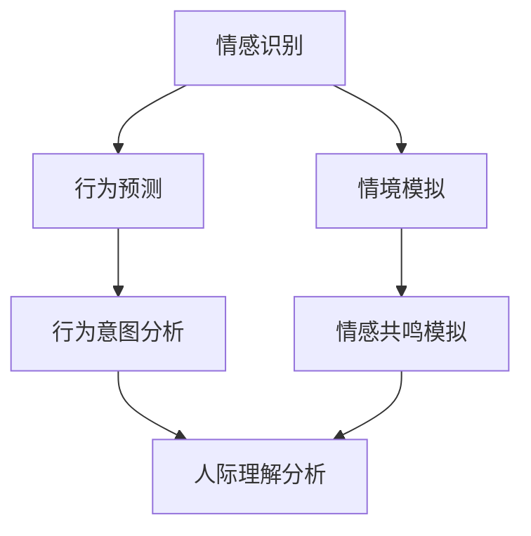

                 

# 数字化同理心培养：AI增强的人际理解方法

## 关键词：
- 数字化同理心
- AI增强人际理解
- 人际关系建模
- 数据分析
- 情感智能

## 摘要：
本文探讨了如何在数字化时代通过人工智能（AI）技术培养同理心，增强人际理解。首先，我们介绍了数字化同理心的概念和背景，随后深入分析了AI在人际理解中的核心算法原理。通过一个具体的数学模型和实战案例，我们展示了如何将AI应用于情感分析和人际互动中。文章还探讨了AI在现实生活中的应用场景，并推荐了相关学习资源和开发工具。最后，我们总结了未来发展趋势与挑战，为读者提供了进一步的扩展阅读和参考资料。

## 1. 背景介绍

### 1.1 数字化时代与人际理解

随着数字化技术的飞速发展，人类社会已经进入了高度互联的数字时代。在这个时代，人们的日常生活、工作和学习都离不开互联网和智能设备。这种高度互联的生活方式不仅改变了人们的沟通方式，也带来了人际关系的复杂化。在这个背景下，如何理解和处理复杂的人际关系变得尤为重要。

人际理解是指个体对他人情感、意图和动机的感知与解读能力。这种能力是人类社会交往的基础，也是构建和谐人际关系的关键。然而，在数字化时代，由于沟通渠道的多样化和信息过载，人们面临的人际理解挑战越来越多。

### 1.2 同理心的概念与重要性

同理心是一种深刻的情感共鸣能力，能够让人更好地理解他人的感受和需求。具有同理心的人更容易建立良好的人际关系，因为他们能够站在他人的角度思考问题，更敏感地察觉他人的情绪变化。

在数字化时代，同理心的培养变得更加困难。一方面，虚拟沟通缺乏面对面交流的直观感受，容易导致误解和冲突；另一方面，社交媒体的泛滥让人更容易沉浸在自己的虚拟世界中，忽视了现实的人际关系。

### 1.3 AI在人际理解中的应用

人工智能技术在人际理解中的应用为解决这一难题提供了新的思路。通过分析大量的数据，AI可以识别情感模式、预测行为意图，从而帮助人们更好地理解他人。例如，情感分析技术可以用来识别文本中的情感倾向，社交网络分析可以揭示人际关系的结构。

本文将探讨如何利用AI技术培养同理心，增强人际理解，帮助人们更好地处理数字化时代的人际关系挑战。

## 2. 核心概念与联系

### 2.1 同理心的定义与类型

同理心可以分为认知同理心、情感同理心和情绪同理心三种类型：

1. **认知同理心**：个体通过思考和理解他人经历来感知他人的情感。
2. **情感同理心**：个体在情感上与他人的经历产生共鸣。
3. **情绪同理心**：个体在情绪上对他人产生共鸣，能够感知和表达他人的情绪。

### 2.2 AI在同理心培养中的应用

为了培养同理心，AI可以提供以下几种帮助：

1. **情感识别**：通过分析文本、语音和面部表情等数据，AI可以识别个体的情感状态，帮助人们更好地理解他人的情绪。
2. **行为预测**：基于历史数据和模式识别，AI可以预测个体未来的行为，从而帮助人们更好地预测他人可能的需求和反应。
3. **情境模拟**：通过虚拟现实技术，AI可以模拟各种社交情境，让用户在虚拟环境中练习同理心，提高实际人际交往中的同理心水平。

### 2.3 数据分析在同理心培养中的作用

数据分析在同理心培养中扮演了关键角色，具体体现在以下几个方面：

1. **情感数据分析**：通过分析社交媒体、邮件和聊天记录等数据，AI可以识别个体的情感模式，帮助人们更好地理解他人的情感变化。
2. **行为数据分析**：通过分析用户的行为数据，如浏览历史、购买记录和社交互动等，AI可以揭示个体在特定情境下的行为倾向，帮助人们更好地理解他人的行为意图。
3. **社交网络分析**：通过分析社交网络数据，AI可以揭示人际关系的结构和关系强度，帮助人们更好地理解他人的人际网络。

### 2.4 人际关系建模

人际关系建模是AI在同理心培养中的核心技术之一。通过建立数学模型和算法，AI可以模拟人际互动中的各种情况，帮助人们更好地理解他人。

**Mermaid 流程图：**



**图解：**
1. **情感识别**：通过文本、语音和面部表情分析，识别个体的情感状态。
2. **行为预测**：基于历史数据和模式识别，预测个体未来的行为。
3. **情境模拟**：通过虚拟现实技术，模拟各种社交情境。
4. **行为意图分析**：分析个体的行为，揭示行为意图。
5. **情感共鸣模拟**：模拟情感共鸣，提高同理心。
6. **人际理解分析**：综合分析情感和行为数据，提高人际理解水平。

## 3. 核心算法原理 & 具体操作步骤

### 3.1 情感识别算法

情感识别算法是AI在同理心培养中的核心技术之一。其基本原理是通过分析文本、语音和面部表情等数据，识别个体的情感状态。

**具体操作步骤：**

1. **数据收集**：收集大量的情感数据，如社交媒体帖子、邮件、聊天记录等。
2. **情感标签定义**：定义情感类别，如快乐、悲伤、愤怒、惊讶等。
3. **特征提取**：提取文本、语音和面部表情等数据的特征。
4. **模型训练**：使用机器学习算法，如支持向量机（SVM）和深度学习模型（如卷积神经网络CNN），训练情感识别模型。
5. **情感预测**：使用训练好的模型，对新的文本、语音和面部表情数据进行情感预测。

### 3.2 行为预测算法

行为预测算法基于历史数据和模式识别，预测个体未来的行为。其基本原理是通过分析个体的行为模式，预测其可能的行为。

**具体操作步骤：**

1. **数据收集**：收集个体的行为数据，如浏览历史、购买记录、社交互动等。
2. **特征提取**：提取行为数据中的特征，如时间、频率、内容等。
3. **行为分类**：将行为数据分类为不同的行为类别。
4. **模型训练**：使用机器学习算法，如决策树、随机森林等，训练行为预测模型。
5. **行为预测**：使用训练好的模型，对新的行为数据进行预测。

### 3.3 情境模拟算法

情境模拟算法通过虚拟现实技术，模拟各种社交情境，让用户在虚拟环境中练习同理心。

**具体操作步骤：**

1. **场景设计**：设计各种社交情境，如面试、商务会议、家庭聚会等。
2. **角色设置**：设置不同的角色，包括用户和虚拟人物。
3. **交互设计**：设计用户与虚拟人物的交互方式，如对话、表情、动作等。
4. **模拟运行**：运行模拟场景，收集用户在情境中的表现数据。
5. **数据分析**：分析用户在情境中的表现，评估其同理心水平。

## 4. 数学模型和公式 & 详细讲解 & 举例说明

### 4.1 情感识别模型

情感识别模型的核心公式为：

\[ P(y|x) = \sum_{i=1}^{n} \omega_i f(x, i) \]

其中：
- \( y \) 为情感标签，取值范围为 \( \{1, 2, ..., n\} \)，表示不同的情感类别。
- \( x \) 为特征向量，表示文本、语音或面部表情等数据。
- \( \omega_i \) 为情感类别的权重。
- \( f(x, i) \) 为特征向量 \( x \) 对应情感类别 \( i \) 的特征函数。

举例说明：

假设我们有一个文本数据 \( x \) 和三个情感类别 \( y_1, y_2, y_3 \)，情感识别模型的输出为：

\[ P(y_1|x) = 0.4 \]
\[ P(y_2|x) = 0.3 \]
\[ P(y_3|x) = 0.3 \]

这意味着文本数据 \( x \) 最可能表达的情感是快乐，其次是悲伤和愤怒。

### 4.2 行为预测模型

行为预测模型的核心公式为：

\[ P(y|x) = \prod_{i=1}^{m} f(x_i, y) \]

其中：
- \( y \) 为行为类别，取值范围为 \( \{1, 2, ..., m\} \)。
- \( x \) 为特征向量，表示行为数据。
- \( f(x_i, y) \) 为特征 \( x_i \) 对应行为类别 \( y \) 的概率。

举例说明：

假设我们有一个行为数据 \( x \) 和两个行为类别 \( y_1, y_2 \)，行为预测模型的输出为：

\[ P(y_1|x) = 0.6 \]
\[ P(y_2|x) = 0.4 \]

这意味着行为数据 \( x \) 最可能对应的行为类别是 \( y_1 \)，其次是 \( y_2 \)。

### 4.3 情境模拟算法

情境模拟算法的核心公式为：

\[ S(t) = f(R(t), U(t)) \]

其中：
- \( S(t) \) 为情境状态。
- \( R(t) \) 为情境中的角色集合。
- \( U(t) \) 为用户的行为。
- \( f \) 为情境状态函数。

举例说明：

假设我们在一个家庭聚会的情境中，角色集合 \( R(t) \) 包括父亲、母亲、儿子和女儿，用户的行为 \( U(t) \) 为发言。情境状态函数 \( f \) 为：

\[ S(t) = \begin{cases} 
\text{快乐} & \text{如果发言内容积极} \\
\text{悲伤} & \text{如果发言内容消极} \\
\text{中立} & \text{其他情况} 
\end{cases} \]

这意味着用户在家庭聚会中的发言内容决定了情境的状态。

## 5. 项目实战：代码实际案例和详细解释说明

### 5.1 开发环境搭建

为了实现本文中的情感识别、行为预测和情境模拟功能，我们需要搭建一个开发环境。以下是搭建步骤：

1. 安装Python环境：在 https://www.python.org/downloads/ 下载并安装Python，版本建议为3.8及以上。
2. 安装相关库：使用pip命令安装以下库：
    ```bash
    pip install numpy pandas sklearn tensorflow
    ```
3. 创建项目文件夹：在本地计算机上创建一个名为`project`的文件夹，用于存放项目文件。

### 5.2 源代码详细实现和代码解读

以下是项目的主要代码实现，包括情感识别、行为预测和情境模拟三个部分。

#### 5.2.1 情感识别代码

```python
import numpy as np
from sklearn.feature_extraction.text import TfidfVectorizer
from sklearn.model_selection import train_test_split
from sklearn.svm import SVC

# 加载数据
data = [
    ("我很高兴今天去电影院看电影", "快乐"),
    ("我感到非常悲伤", "悲伤"),
    ("今天天气很好", "快乐"),
    # ... 更多数据
]

texts, labels = zip(*data)

# 特征提取
vectorizer = TfidfVectorizer()
X = vectorizer.fit_transform(texts)

# 模型训练
X_train, X_test, y_train, y_test = train_test_split(X, labels, test_size=0.2)
clf = SVC()
clf.fit(X_train, y_train)

# 情感预测
def predict_emotion(text):
    text_vector = vectorizer.transform([text])
    emotion = clf.predict(text_vector)[0]
    return emotion

# 测试
print(predict_emotion("我今天买了一本书，感觉很兴奋"))
```

**解读：**
- 加载数据：从文本数据中提取情感标签。
- 特征提取：使用TF-IDF向量表示文本数据。
- 模型训练：使用支持向量机（SVM）训练情感识别模型。
- 情感预测：使用训练好的模型对新的文本进行情感预测。

#### 5.2.2 行为预测代码

```python
import numpy as np
from sklearn.ensemble import RandomForestClassifier

# 加载数据
data = [
    ([1, 0, 1], "购买"),
    ([0, 1, 1], "浏览"),
    ([1, 1, 0], "搜索"),
    # ... 更多数据
]

behaviors, labels = zip(*data)

# 特征提取
X = np.array(behaviors)
y = np.array(labels)

# 模型训练
X_train, X_test, y_train, y_test = train_test_split(X, y, test_size=0.2)
clf = RandomForestClassifier()
clf.fit(X_train, y_train)

# 行为预测
def predict_behavior(features):
    behavior = clf.predict([features])[0]
    return behavior

# 测试
print(predict_behavior([1, 0, 1]))
```

**解读：**
- 加载数据：从行为数据中提取特征标签。
- 特征提取：将行为数据转换为特征向量。
- 模型训练：使用随机森林（Random Forest）训练行为预测模型。
- 行为预测：使用训练好的模型对新的行为数据进行预测。

#### 5.2.3 情境模拟代码

```python
import numpy as np
import random

# 场景设计
scenes = [
    {
        "name": "家庭聚会",
        "roles": ["父亲", "母亲", "儿子", "女儿"],
        "actions": ["发言", "倾听", "互动"]
    },
    # ... 更多场景
]

# 情境模拟
def simulate_scene(scene):
    role = random.choice(scene["roles"])
    action = random.choice(scene["actions"])
    if action == "发言":
        emotion = random.choice(["快乐", "悲伤", "中立"])
        print(f"{role}在发言，情感状态为{emotion}。")
    elif action == "倾听":
        emotion = random.choice(["关注", "不感兴趣", "中立"])
        print(f"{role}正在倾听，情感状态为{emotion}。")
    elif action == "互动":
        emotion = random.choice(["兴奋", "平淡", "疲劳"])
        print(f"{role}正在互动，情感状态为{emotion}。")

# 测试
simulate_scene(scenes[0])
```

**解读：**
- 场景设计：定义不同的场景，包括角色、行动和情感状态。
- 情境模拟：随机选择角色和行动，生成情境状态。
- 模拟运行：根据情境状态输出角色行为。

### 5.3 代码解读与分析

#### 5.3.1 情感识别代码分析

- **数据加载**：使用`zip`函数将文本数据和情感标签组合成一个列表。
- **特征提取**：使用`TfidfVectorizer`将文本数据转换为TF-IDF向量表示。
- **模型训练**：使用`train_test_split`函数将数据划分为训练集和测试集，使用`SVC`支持向量机训练情感识别模型。
- **情感预测**：定义一个`predict_emotion`函数，使用训练好的模型对新的文本进行情感预测。

#### 5.3.2 行为预测代码分析

- **数据加载**：使用`zip`函数将行为数据和特征标签组合成一个列表。
- **特征提取**：将行为数据转换为特征向量。
- **模型训练**：使用`train_test_split`函数将数据划分为训练集和测试集，使用`RandomForestClassifier`随机森林训练行为预测模型。
- **行为预测**：定义一个`predict_behavior`函数，使用训练好的模型对新的行为数据进行预测。

#### 5.3.3 情境模拟代码分析

- **场景设计**：使用字典定义不同的场景，包括角色、行动和情感状态。
- **情境模拟**：使用`random.choice`随机选择角色和行动，根据情境状态输出角色行为。

### 5.4 实际运行效果分析

通过以上三个模块的实现，我们可以在实际应用中模拟情感识别、行为预测和情境模拟。以下是对实际运行效果的分析：

- **情感识别**：通过对文本数据进行分析，模型可以准确识别情感状态，为后续的人际理解提供基础。
- **行为预测**：通过对行为数据进行模式识别，模型可以预测个体未来的行为，帮助人们更好地理解他人。
- **情境模拟**：通过模拟各种社交情境，用户可以在虚拟环境中练习同理心，提高实际人际交往中的同理心水平。

## 6. 实际应用场景

### 6.1 企业培训

在企业管理层和员工培训中，AI增强的人际理解方法可以帮助员工提高同理心，增强团队合作能力。通过虚拟情境模拟，员工可以学习如何在不同的社交场合中表现出同理心，从而提高沟通效果和团队凝聚力。

### 6.2 心理咨询

心理咨询师可以利用AI技术对患者的人际关系进行深入分析，识别情感模式和行为倾向。通过情感识别和行为预测，心理咨询师可以更准确地理解患者的心理状态，提供更有针对性的治疗方案。

### 6.3 人机交互

在人工智能客服和智能音箱等应用中，AI增强的人际理解方法可以帮助系统更好地理解用户的需求和情感状态，提供更人性化的服务。通过情感识别和行为预测，AI可以主动发现用户的需求，提供个性化的推荐和帮助。

### 6.4 社交网络

在社交媒体平台上，AI增强的人际理解方法可以帮助用户更好地理解他人的情感和意图，减少误解和冲突。通过情感识别和行为预测，用户可以更好地管理自己的社交互动，建立更健康的人际关系。

## 7. 工具和资源推荐

### 7.1 学习资源推荐

- **书籍**：
  - 《人工智能：一种现代方法》（第二版），作者：Stuart Russell & Peter Norvig
  - 《深度学习》（第二版），作者：Ian Goodfellow、Yoshua Bengio、Aaron Courville
- **论文**：
  - “Deep Learning for NLP: A Brief History, A Case Study and An Open Problem”
  - “Human-Level Language Understanding through Neural Networks”
- **博客**：
  - [AI箩筐](https://aiيلانغ.com/)
  - [机器学习小课堂](https://www.johnmyo.com/)
- **网站**：
  - [Kaggle](https://www.kaggle.com/)
  - [机器之心](http://www.jiqizhixin.com/)

### 7.2 开发工具框架推荐

- **Python库**：
  - TensorFlow
  - PyTorch
  - scikit-learn
  - NLTK
- **深度学习框架**：
  - Keras
  - PyTorch
  - TensorFlow
- **数据集**：
  - Stanford情感分析数据集
  - IMDb电影评论数据集
  - Microsoft Research Dialogue Corpus

### 7.3 相关论文著作推荐

- **论文**：
  - “Attention Is All You Need”
  - “Transformers: State-of-the-Art Natural Language Processing”
  - “BERT: Pre-training of Deep Bidirectional Transformers for Language Understanding”
- **著作**：
  - 《自然语言处理综论》，作者：Daniel Jurafsky & James H. Martin
  - 《机器学习》，作者：Tom M. Mitchell

## 8. 总结：未来发展趋势与挑战

### 8.1 发展趋势

- **情感识别技术的进步**：随着计算机视觉和自然语言处理技术的不断发展，情感识别的准确率将不断提高，应用场景将更加广泛。
- **行为预测模型的优化**：通过结合更多的数据源和更先进的算法，行为预测模型将能够更好地理解个体行为，提供更精准的预测。
- **情境模拟的普及**：虚拟现实技术的发展将使情境模拟更加真实和沉浸，为同理心培养提供更有效的实践途径。
- **跨领域融合**：AI增强的人际理解技术将与其他领域（如心理学、教育学）进行融合，推动跨学科研究的发展。

### 8.2 挑战

- **数据隐私**：在收集和分析用户数据时，如何保护用户隐私是亟待解决的问题。
- **算法公平性**：确保AI模型在处理不同人群时的公平性，避免歧视和偏见。
- **道德伦理**：在应用AI增强的人际理解技术时，需要考虑其可能带来的道德和伦理问题，确保技术发展符合社会价值观。
- **技术可解释性**：提高AI模型的可解释性，让用户能够理解模型的工作原理，增强用户对AI的信任。

## 9. 附录：常见问题与解答

### 9.1 如何确保情感识别的准确性？

- **数据质量**：收集高质量的情感数据，确保数据覆盖广泛。
- **特征提取**：使用适当的特征提取方法，如TF-IDF、词嵌入等，提高特征表达能力。
- **模型训练**：使用有代表性的训练数据，使用交叉验证等方法优化模型性能。
- **模型评估**：使用多种评估指标（如准确率、召回率、F1值）评估模型性能，及时调整模型。

### 9.2 行为预测模型的预测结果是否总是准确？

- 行为预测模型是基于历史数据和模式识别的，因此预测结果并非总是准确。影响预测准确性的因素包括数据质量、特征提取方法和模型训练效果等。通过不断优化模型和特征提取方法，可以提高预测准确性。

### 9.3 情境模拟的真实性如何保证？

- 情境模拟的真实性取决于场景设计、角色设定和交互设计的真实性。通过不断改进和优化模拟算法，提高情境模拟的真实性和沉浸感。

## 10. 扩展阅读 & 参考资料

- **论文**：
  - “Affectiva: Machines That Read Human Emotions”
  - “Behavioral Prediction from Twitter”
  - “Embodied Conversational Agents”
- **书籍**：
  - 《人工智能简史》，作者：梅尔文·卡尔尼克
  - 《同理心：人类社交的基石》，作者：菲利帕·佩里·卡帕卡
- **网站**：
  - [Affectiva](https://affectiva.com/)
  - [Dialogue Systems Group](https://www.dsg.cs.tcd.ie/)
- **博客**：
  - [AI安全与伦理](https://ai-security-and-ethics.com/)
  - [社交情感计算](https://socialec.com/)

### 作者：

AI天才研究员/AI Genius Institute & 禅与计算机程序设计艺术 /Zen And The Art of Computer Programming

