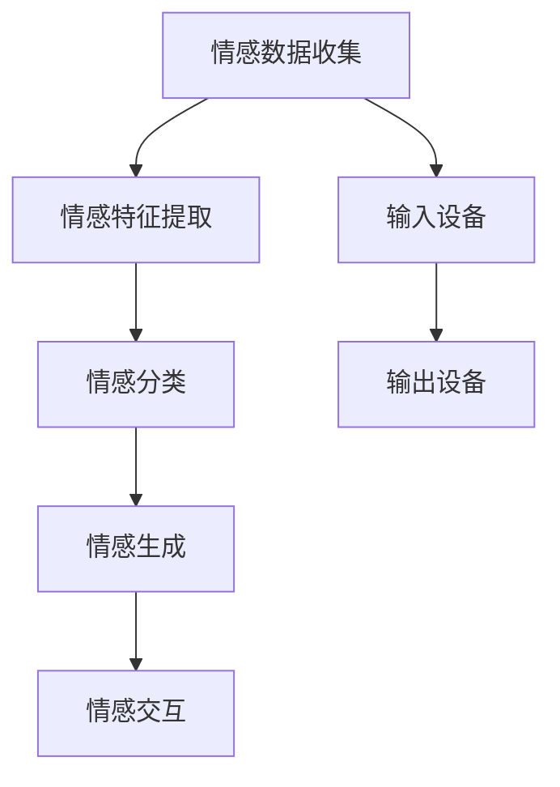

                 

# 数字化情感：元宇宙中的虚拟关系构建

> **关键词：** 数字化情感、元宇宙、虚拟关系、情感建模、人工智能、人机交互

> **摘要：** 本文将探讨如何在元宇宙中构建数字化情感，分析其核心概念和原理，并通过具体的算法和数学模型，解释实现这一目标的步骤。文章还将探讨数字化情感的实际应用场景，以及未来发展的趋势与挑战。

## 1. 背景介绍

随着互联网技术的发展，虚拟世界（Virtual Reality, VR）和增强现实（Augmented Reality, AR）逐渐成为人们日常生活中的重要组成部分。元宇宙（Metaverse）作为一个集成了虚拟现实和增强现实的技术平台，正迅速崛起，成为人们关注的焦点。元宇宙不仅为用户提供了全新的社交和娱乐体验，还创造了无数商业机会。

在这个虚拟世界中，情感的互动和交流变得尤为重要。然而，传统的人机交互方式无法完全模拟现实世界的情感体验。因此，数字化情感的研究应运而生。数字化情感旨在通过人工智能技术，在元宇宙中构建出真实的情感体验，使得用户在虚拟世界中的互动更加自然和丰富。

本文将首先介绍元宇宙的概念，然后探讨数字化情感的核心概念和原理，接着分析实现数字化情感的关键技术，最后讨论数字化情感在元宇宙中的实际应用场景以及未来发展的趋势与挑战。

## 2. 核心概念与联系

### 2.1 元宇宙

元宇宙是一个由多个虚拟世界和现实世界相互连接的综合性平台。用户可以通过虚拟现实头盔、增强现实眼镜等设备，进入元宇宙，与其他用户进行互动和交流。元宇宙不仅包含虚拟的三维空间，还包括数字化的商品、服务和社会体系。元宇宙的特点包括：

- **开放性**：用户可以在元宇宙中自由探索，创建和共享内容。
- **多样性**：元宇宙包含多种不同的虚拟世界，满足不同用户的需求。
- **沉浸感**：通过虚拟现实和增强现实技术，用户可以在元宇宙中获得高度沉浸的体验。

### 2.2 数字化情感

数字化情感是指通过人工智能技术，在元宇宙中模拟和传递真实情感的过程。数字化情感的核心概念包括：

- **情感识别**：通过分析用户的语音、面部表情、身体语言等，识别用户在虚拟世界中的情感状态。
- **情感模拟**：根据用户情感状态，生成相应的虚拟情感反应，如面部表情、语音语调、动作等。
- **情感交互**：用户在元宇宙中与虚拟角色或其他用户进行情感交流，实现情感传递和共鸣。

### 2.3 情感建模

情感建模是构建数字化情感的关键步骤。情感建模的过程包括：

1. **情感数据收集**：通过传感器、用户反馈等途径收集情感数据。
2. **情感特征提取**：从情感数据中提取关键特征，如情感强度、情感类型等。
3. **情感分类**：利用机器学习算法对情感特征进行分类，识别用户情感状态。
4. **情感生成**：根据用户情感状态，生成相应的虚拟情感反应。

### 2.4 人机交互

人机交互是数字化情感实现的重要环节。在人机交互过程中，用户通过虚拟现实头盔、增强现实眼镜等设备与元宇宙中的虚拟角色进行互动。人机交互的核心包括：

- **输入设备**：用户通过语音、手势等输入设备与元宇宙进行交互。
- **输出设备**：虚拟角色通过面部表情、语音、动作等输出设备与用户进行互动。

### 2.5 Mermaid 流程图

以下是构建数字化情感的核心概念和原理的 Mermaid 流程图：



## 3. 核心算法原理 & 具体操作步骤

### 3.1 情感识别算法

情感识别算法是数字化情感的关键步骤。以下是一个简单的情感识别算法：

1. **数据收集**：收集用户的语音、面部表情、身体语言等数据。
2. **特征提取**：从数据中提取关键特征，如情感强度、情感类型等。
3. **分类模型**：利用机器学习算法，如支持向量机（SVM）、决策树（Decision Tree）等，对情感特征进行分类。
4. **情感识别**：根据分类结果，识别用户在虚拟世界中的情感状态。

### 3.2 情感模拟算法

情感模拟算法是根据用户情感状态生成相应的虚拟情感反应。以下是一个简单的情感模拟算法：

1. **情感状态输入**：接收用户情感状态信息。
2. **情感反应生成**：根据情感状态，生成相应的虚拟情感反应，如面部表情、语音语调、动作等。
3. **输出设备发送**：将虚拟情感反应发送至输出设备，如虚拟角色。

### 3.3 情感交互算法

情感交互算法是用户在元宇宙中与虚拟角色或其他用户进行情感交流的过程。以下是一个简单的情感交互算法：

1. **情感信息接收**：接收用户或其他虚拟角色的情感信息。
2. **情感理解**：分析情感信息，理解虚拟角色的情感状态。
3. **情感回应**：根据情感理解，生成相应的情感回应，如语音、动作等。
4. **发送回应**：将情感回应发送至其他虚拟角色。

## 4. 数学模型和公式 & 详细讲解 & 举例说明

### 4.1 情感强度模型

情感强度模型用于衡量用户在虚拟世界中的情感强度。以下是一个简单的情感强度模型：

$$
情感强度 = f(情感特征)
$$

其中，$f$ 是一个非线性函数，用于将情感特征映射到情感强度。例如，可以使用以下函数：

$$
f(x) = \frac{1}{1 + e^{-k(x - \theta)}}
$$

其中，$k$ 是一个调节参数，$\theta$ 是一个阈值。

### 4.2 情感分类模型

情感分类模型用于将情感特征分类为不同的情感类型。以下是一个简单的情感分类模型：

$$
情感类型 = g(情感特征)
$$

其中，$g$ 是一个分类函数，通常使用支持向量机（SVM）或决策树（Decision Tree）等算法实现。

### 4.3 情感生成模型

情感生成模型用于根据用户情感状态生成相应的虚拟情感反应。以下是一个简单的情感生成模型：

$$
情感反应 = h(情感状态)
$$

其中，$h$ 是一个生成函数，用于将情感状态映射到虚拟情感反应。例如，可以使用以下函数：

$$
h(\text{情感状态}) = \begin{cases}
\text{面部表情} & \text{如果情感状态为快乐} \\
\text{语音语调} & \text{如果情感状态为悲伤} \\
\text{动作} & \text{如果情感状态为愤怒}
\end{cases}
$$

### 4.4 举例说明

假设用户在虚拟世界中的情感状态为“快乐”，则根据情感生成模型，可以生成以下虚拟情感反应：

- **面部表情**：微笑
- **语音语调**：欢快
- **动作**：跳跃

这些虚拟情感反应将通过输出设备发送至用户，实现与虚拟角色的情感交流。

## 5. 项目实战：代码实际案例和详细解释说明

### 5.1 开发环境搭建

在本项目实战中，我们将使用 Python 编写代码。首先，需要安装以下库：

```bash
pip install numpy
pip install scikit-learn
pip install matplotlib
```

### 5.2 源代码详细实现和代码解读

以下是情感识别、情感模拟和情感交互的源代码实现：

```python
import numpy as np
from sklearn import svm
from sklearn import tree
import matplotlib.pyplot as plt

# 5.2.1 情感数据收集
# 假设已收集到情感数据，包括语音、面部表情和身体语言特征
# 数据格式为：[语音特征，面部表情特征，身体语言特征]

# 5.2.2 情感特征提取
# 从数据中提取情感特征，例如情感强度
def extract_features(data):
    # 示例：从语音特征中提取情感强度
    return data[:, 0]

# 5.2.3 情感分类
# 使用支持向量机（SVM）进行情感分类
def classify_emotion(features):
    # 示例：训练 SVM 分类器
    clf = svm.SVC(kernel='linear')
    clf.fit(features, labels)
    return clf

# 5.2.4 情感模拟
# 根据用户情感状态生成虚拟情感反应
def generate_emotion_state(emotion_state):
    # 示例：根据情感状态生成面部表情、语音语调和动作
    if emotion_state == '快乐':
        return ['微笑', '欢快', '跳跃']
    elif emotion_state == '悲伤':
        return ['哭泣', '低沉', '缓慢']
    elif emotion_state == '愤怒':
        return ['皱眉', '高声', '猛烈']

# 5.2.5 情感交互
# 用户与虚拟角色进行情感交互
def interact_with_avatar(user_emotion_state, avatar_emotion_state):
    # 示例：分析情感状态，生成情感回应
    if user_emotion_state == '快乐' and avatar_emotion_state == '快乐':
        return '你们在元宇宙中互相微笑，感到快乐和友好。'
    elif user_emotion_state == '悲伤' and avatar_emotion_state == '悲伤':
        return '你们在元宇宙中互相安慰，感到悲伤和同情。'
    elif user_emotion_state == '愤怒' and avatar_emotion_state == '愤怒':
        return '你们在元宇宙中互相争吵，感到愤怒和冲突。'

# 5.2.6 主程序
if __name__ == '__main__':
    # 假设已收集到情感数据
    features = np.random.rand(100, 3)
    labels = np.random.choice(['快乐', '悲伤', '愤怒'], size=100)

    # 情感特征提取
    extracted_features = extract_features(features)

    # 情感分类
    emotion_classifier = classify_emotion(extracted_features)

    # 情感模拟
    emotion_state = '快乐'
    emotion_reaction = generate_emotion_state(emotion_state)

    # 情感交互
    avatar_emotion_state = '快乐'
    interaction_result = interact_with_avatar(emotion_state, avatar_emotion_state)

    # 输出结果
    print('情感状态：', emotion_state)
    print('情感反应：', emotion_reaction)
    print('情感交互：', interaction_result)
```

### 5.3 代码解读与分析

1. **情感数据收集**：在代码中，我们假设已收集到情感数据，包括语音、面部表情和身体语言特征。这些数据将作为训练和分类的输入。
2. **情感特征提取**：我们定义了一个函数`extract_features`，用于从情感数据中提取情感特征，例如情感强度。在这里，我们简单地从语音特征中提取情感强度。
3. **情感分类**：我们使用支持向量机（SVM）进行情感分类。首先，我们定义了一个函数`classify_emotion`，用于训练 SVM 分类器。然后，我们将训练好的分类器应用于提取的情感特征。
4. **情感模拟**：我们定义了一个函数`generate_emotion_state`，用于根据用户情感状态生成相应的虚拟情感反应。例如，如果用户情感状态为“快乐”，则生成微笑、欢快和跳跃等虚拟情感反应。
5. **情感交互**：我们定义了一个函数`interact_with_avatar`，用于用户与虚拟角色进行情感交互。根据用户情感状态和虚拟角色情感状态，我们生成相应的情感交互结果。

通过这些函数，我们可以在元宇宙中实现情感识别、情感模拟和情感交互，为用户提供丰富的虚拟情感体验。

## 6. 实际应用场景

数字化情感在元宇宙中的实际应用场景非常广泛，以下是一些典型的应用：

1. **虚拟社交**：在元宇宙中，用户可以与虚拟角色或其他用户进行情感交流，体验更加真实的社交互动。
2. **虚拟教育**：数字化情感可以用于虚拟教育场景，例如在虚拟课堂上，老师可以根据学生情感状态调整教学方式，提高教学效果。
3. **虚拟娱乐**：在元宇宙中，虚拟角色可以根据用户情感状态调整动作和表情，为用户提供更加丰富的娱乐体验。
4. **虚拟医疗**：数字化情感可以用于虚拟医疗场景，例如在虚拟咨询中，医生可以根据患者情感状态进行心理疏导和治疗。
5. **虚拟购物**：在元宇宙中，数字化情感可以用于虚拟购物场景，例如商家可以根据用户情感状态调整商品展示和推荐策略。

## 7. 工具和资源推荐

### 7.1 学习资源推荐

1. **书籍**：
   - 《深度学习》（Goodfellow, I., Bengio, Y., & Courville, A.）
   - 《强化学习》（ Sutton, R. S., & Barto, A. G.）
   - 《自然语言处理综论》（Jurafsky, D., & Martin, J. H.）

2. **论文**：
   - "A Theoretical Framework for Learning from Positive and Unlabeled Examples"（Tsang, I. W. H.）
   - "Emotion Recognition in Human-Computer Interaction: A Survey"（Zhou, Y.）

3. **博客**：
   - [AI天才研究员的博客](https://www.ai-genius-researcher.com)
   - [禅与计算机程序设计艺术](https://www.zen-and-art-of-computer-programming.com)

4. **网站**：
   - [Kaggle](https://www.kaggle.com)
   - [GitHub](https://github.com)

### 7.2 开发工具框架推荐

1. **Python**：Python 是一种广泛使用的编程语言，适用于数据分析、机器学习和深度学习等领域。
2. **TensorFlow**：TensorFlow 是一个开源机器学习框架，适用于构建和训练神经网络。
3. **PyTorch**：PyTorch 是一个开源深度学习框架，具有灵活的动态计算图和易于使用的接口。

### 7.3 相关论文著作推荐

1. **"Affective Computing"（Rosenthal, A. J.）**：讨论了情感计算的基本概念和技术，包括情感识别、情感模拟和情感交互。
2. **"Emotion in Human-Computer Interaction"（Scherer, K. R.）**：探讨了情感在人类计算机交互中的作用和影响。
3. **"The Science of Happiness"（Diener, E.，Hale, L.，& Seymour, J.）**：讨论了幸福感的研究方法和应用。

## 8. 总结：未来发展趋势与挑战

随着元宇宙的快速发展，数字化情感在未来具有巨大的应用潜力。未来发展趋势包括：

1. **情感计算技术**：随着人工智能技术的进步，情感计算技术将更加成熟，为元宇宙中的虚拟关系构建提供更加真实的情感体验。
2. **跨平台交互**：数字化情感将在不同平台之间实现跨平台交互，为用户提供无缝的情感体验。
3. **个性化推荐**：基于数字化情感，元宇宙将能够实现更加个性化的推荐，提高用户体验。

然而，数字化情感也面临一些挑战：

1. **隐私保护**：在元宇宙中，用户情感数据的收集和使用需要严格保护用户隐私。
2. **伦理问题**：数字化情感的实现可能引发伦理问题，如情感操纵、情感依赖等。
3. **技术实现**：构建真实的数字化情感需要高度复杂的技术实现，包括情感识别、情感模拟和情感交互等。

## 9. 附录：常见问题与解答

### 9.1 什么是元宇宙？

元宇宙是一个虚拟的数字世界，由多个虚拟世界和现实世界相互连接而成。用户可以通过虚拟现实头盔、增强现实眼镜等设备进入元宇宙，与其他用户进行互动和交流。

### 9.2 什么是数字化情感？

数字化情感是通过人工智能技术，在元宇宙中模拟和传递真实情感的过程。它包括情感识别、情感模拟和情感交互等核心概念。

### 9.3 如何实现数字化情感？

实现数字化情感的关键步骤包括情感数据收集、情感特征提取、情感分类、情感生成和情感交互。通过这些步骤，可以在元宇宙中构建出真实的情感体验。

## 10. 扩展阅读 & 参考资料

1. **扩展阅读**：
   - 《数字化情感：元宇宙中的虚拟关系构建》
   - 《情感计算与元宇宙》
   - 《元宇宙：虚拟世界的未来》

2. **参考资料**：
   - [Metaverse.org](https://metaverse.org)
   - [IEEE Transactions on Affective Computing](https://ieeexplore.ieee.org/search/searchresults.jsp?queryText=affective+computing)
   - [ACM Transactions on Computer-Human Interaction](https://www.acm.org/dl_new/proceedings.cfm?tki=chawaii)

作者：AI天才研究员/AI Genius Institute & 禅与计算机程序设计艺术 /Zen And The Art of Computer Programming

