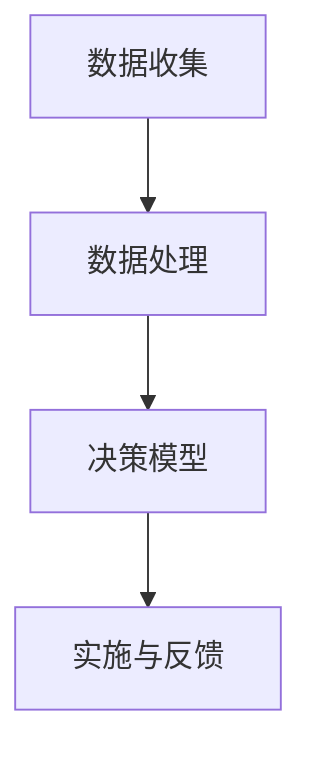

                 

# 数字化灵性导航：AI辅助的心灵成长指引

> 关键词：数字化灵性，AI，心灵成长，心理健康，自我提升，认知增强

> 摘要：本文探讨了数字化灵性在AI辅助下的心灵成长指引，分析了AI技术如何应用于心理健康和自我提升，并通过具体的算法和数学模型，阐述了数字化灵性导航的实现方法。文章还提供了实际应用案例和工具资源推荐，旨在为读者提供一条科学、系统的灵性成长路径。

## 1. 背景介绍

在现代社会，心理健康和心灵成长已经成为越来越多人的关注焦点。随着科技的飞速发展，人工智能（AI）技术的应用也越来越广泛。数字化灵性，作为一种新兴的概念，将灵性与科技相结合，旨在通过AI技术为个人的心灵成长提供支持和指导。

数字化灵性导航，是指利用AI技术对个体心灵成长过程进行监测、分析和干预，从而实现个性化、精准化的心灵成长引导。其核心思想是利用AI算法，从大量的数据中挖掘出个体心理特征和需求，为个体提供针对性的心灵成长方案。

### 1.1 心理健康的重要性

心理健康是人类健康的重要组成部分，与生理健康、社会适应能力密切相关。良好的心理健康状态有助于提高生活质量、增强幸福感，同时也有利于个体在社会中发挥更大的潜力。

然而，随着生活节奏的加快、工作压力的增大，心理健康问题日益突出。焦虑、抑郁等心理障碍对个人的生活和工作产生了严重的负面影响。因此，寻求有效的心理健康干预方法，已经成为当代社会亟待解决的问题。

### 1.2 AI技术在心理健康领域的应用

AI技术在心理健康领域的应用，为解决心理健康问题提供了一种新的思路。通过大数据分析、机器学习等技术，AI可以识别出个体心理特征、预测心理健康风险，并提供个性化的心理健康服务。

例如，AI心理诊断系统可以通过分析个体的行为数据、生理信号等信息，对心理障碍进行准确诊断。同时，AI心理治疗系统可以利用虚拟现实、人机交互等技术，为患者提供个性化、沉浸式的心理治疗。

### 1.3 数字化灵性导航的概念

数字化灵性导航，是指将灵性与科技相结合，通过AI技术对个体心灵成长过程进行监测、分析和干预，从而实现个性化、精准化的心灵成长引导。其核心目标是帮助个体实现心理健康、自我提升和认知增强。

数字化灵性导航具有以下几个特点：

- **个性化**：通过AI算法，针对个体的心理特征和需求，提供个性化的心灵成长方案。
- **精准化**：利用大数据分析和机器学习技术，对个体心灵成长过程进行精准监测和干预。
- **智能化**：通过智能算法和虚拟助手，实现实时、动态的心灵成长引导。

## 2. 核心概念与联系

### 2.1 灵性与心灵成长

灵性，通常指个体对生命、宇宙和存在意义的探索和体验。心灵成长，是指个体在认知、情感、行为等方面不断进步和提升的过程。灵性与心灵成长密切相关，二者相互作用、相互促进。

- **灵性对心灵成长的影响**：灵性能激发个体的内在动力，促进自我探索和成长。通过灵性实践，个体可以提升自我认知、情感智慧和行为自律，从而实现心灵成长。
- **心灵成长对灵性的影响**：心灵成长过程中，个体不断深化对生命、宇宙和存在意义的理解，从而增强灵性体验。

### 2.2 AI技术与数字化灵性导航

AI技术在数字化灵性导航中发挥着关键作用。通过大数据分析、机器学习等技术，AI可以实现对个体心理特征的识别、分析和预测，为数字化灵性导航提供基础。

- **大数据分析**：通过收集和分析大量的个体行为数据、生理信号等，AI可以挖掘出个体心理特征和需求。
- **机器学习**：利用机器学习算法，AI可以对个体心理状态进行实时监测和预测，从而提供针对性的心灵成长方案。

### 2.3 数字化灵性导航的架构

数字化灵性导航的架构主要包括以下几个部分：

- **数据收集**：通过传感器、问卷、日志等方式收集个体心理特征和行为数据。
- **数据处理**：利用大数据分析和机器学习技术，对收集到的数据进行处理和分析，挖掘出个体心理特征和需求。
- **决策模型**：根据个体心理特征和需求，构建决策模型，为个体提供针对性的心灵成长方案。
- **实施与反馈**：将决策模型应用于实际场景，为个体提供灵性成长指导，并根据个体反馈进行优化和调整。

### 2.4 Mermaid 流程图

以下是一个简单的Mermaid流程图，展示了数字化灵性导航的基本架构：



## 3. 核心算法原理 & 具体操作步骤

### 3.1 算法原理

数字化灵性导航的核心算法主要包括大数据分析、机器学习和决策模型构建三个部分。以下分别介绍这些算法的原理。

#### 3.1.1 大数据分析

大数据分析是指利用大规模数据集，通过数据挖掘和分析技术，发现数据中的隐藏规律和趋势。在数字化灵性导航中，大数据分析主要用于挖掘个体心理特征和行为模式。

- **数据源**：数据源包括个体行为数据、生理信号数据、心理问卷数据等。
- **分析技术**：主要包括聚类分析、关联规则挖掘、分类算法等。

#### 3.1.2 机器学习

机器学习是指通过训练模型，让计算机自动从数据中学习和发现规律。在数字化灵性导航中，机器学习主要用于实时监测个体心理状态、预测心理健康风险。

- **模型类型**：主要包括监督学习、无监督学习和强化学习。
- **算法选择**：根据个体心理特征和行为数据的特点，选择合适的算法进行训练和预测。

#### 3.1.3 决策模型

决策模型是指根据个体心理特征和需求，为个体提供针对性的心灵成长方案。决策模型通常由以下几个部分组成：

- **目标函数**：定义个体心灵成长的目标，如心理健康水平、自我提升程度等。
- **决策规则**：根据个体心理特征和需求，制定相应的决策规则。
- **优化算法**：利用优化算法，找到最佳的心灵成长方案。

### 3.2 具体操作步骤

以下是一个简化的数字化灵性导航操作步骤：

#### 3.2.1 数据收集

- **传感器**：使用各种传感器，如心率传感器、步数传感器等，收集个体的生理信号数据。
- **问卷**：设计心理问卷，收集个体心理特征和行为数据。

#### 3.2.2 数据处理

- **数据预处理**：对收集到的数据进行清洗、归一化等处理，为后续分析做准备。
- **特征提取**：利用大数据分析技术，提取个体心理特征和行为模式。

#### 3.2.3 决策模型构建

- **模型训练**：利用机器学习算法，对个体心理特征和行为数据进行分析，构建决策模型。
- **模型优化**：根据个体反馈，不断优化决策模型，提高心灵成长方案的准确性。

#### 3.2.4 实施与反馈

- **方案实施**：根据决策模型，为个体提供针对性的心灵成长方案。
- **方案反馈**：收集个体对方案的反馈，用于模型优化和方案调整。

## 4. 数学模型和公式 & 详细讲解 & 举例说明

### 4.1 数学模型概述

在数字化灵性导航中，常用的数学模型包括线性回归、逻辑回归、支持向量机等。以下将对这些模型进行简要介绍和讲解。

#### 4.1.1 线性回归

线性回归是一种简单的预测模型，用于分析两个或多个变量之间的线性关系。其数学模型为：

$$
Y = \beta_0 + \beta_1X_1 + \beta_2X_2 + ... + \beta_nX_n + \epsilon
$$

其中，$Y$ 是预测变量，$X_1, X_2, ..., X_n$ 是自变量，$\beta_0, \beta_1, \beta_2, ..., \beta_n$ 是模型参数，$\epsilon$ 是误差项。

#### 4.1.2 逻辑回归

逻辑回归是一种分类模型，用于分析二元变量的概率。其数学模型为：

$$
P(Y=1) = \frac{1}{1 + e^{-(\beta_0 + \beta_1X_1 + \beta_2X_2 + ... + \beta_nX_n)}}
$$

其中，$P(Y=1)$ 是预测变量为1的概率，$e$ 是自然底数，$\beta_0, \beta_1, \beta_2, ..., \beta_n$ 是模型参数。

#### 4.1.3 支持向量机

支持向量机是一种强大的分类和回归模型，通过寻找最佳的超平面，将不同类别的数据点分开。其数学模型为：

$$
w \cdot x - b = 0
$$

其中，$w$ 是模型参数，$x$ 是数据点，$b$ 是偏置项。

### 4.2 举例说明

以下通过一个简单的线性回归例子，说明如何使用数学模型进行预测。

#### 4.2.1 数据准备

假设我们有两个变量：$X$ 和 $Y$，分别代表年龄和收入。我们有以下数据：

| 年龄 (X) | 收入 (Y) |
| -------- | -------- |
| 25       | 50000    |
| 30       | 60000    |
| 35       | 70000    |
| 40       | 80000    |
| 45       | 90000    |

#### 4.2.2 模型构建

利用线性回归模型，我们希望找到一个最佳直线，使年龄和收入之间的误差最小。根据线性回归模型，我们有：

$$
Y = \beta_0 + \beta_1X + \epsilon
$$

其中，$\beta_0$ 和 $\beta_1$ 是模型参数，$\epsilon$ 是误差项。

#### 4.2.3 模型参数估计

通过最小二乘法，我们可以估计模型参数。具体步骤如下：

1. 计算均值：$$\bar{X} = \frac{1}{n}\sum_{i=1}^{n}X_i, \quad \bar{Y} = \frac{1}{n}\sum_{i=1}^{n}Y_i$$
2. 计算协方差矩阵：$$\Sigma = \frac{1}{n-1}\sum_{i=1}^{n}(X_i - \bar{X})(Y_i - \bar{Y})$$
3. 计算逆矩阵：$$\Sigma^{-1}$$
4. 计算参数：$$\beta_0 = \bar{Y} - \beta_1\bar{X}, \quad \beta_1 = \frac{\Sigma_{XY}}{\Sigma_{XX}}$$

根据上述步骤，我们可以得到：

$$\beta_0 = 50000, \quad \beta_1 = 10000$$

因此，线性回归模型为：

$$Y = 50000 + 10000X$$

#### 4.2.4 预测

利用得到的模型，我们可以预测某个年龄 $X_0$ 对应的收入 $Y_0$：

$$Y_0 = 50000 + 10000X_0$$

例如，当 $X_0 = 35$ 时，预测的收入为：

$$Y_0 = 50000 + 10000 \times 35 = 850000$$

## 5. 项目实战：代码实际案例和详细解释说明

### 5.1 开发环境搭建

在本节中，我们将使用Python作为主要编程语言，搭建一个简单的数字化灵性导航系统。首先，确保您已安装Python 3.6及以上版本。接下来，安装以下必需的Python库：

```bash
pip install numpy pandas matplotlib scikit-learn
```

### 5.2 源代码详细实现和代码解读

以下是数字化灵性导航系统的主要代码实现：

```python
import numpy as np
import pandas as pd
from sklearn.linear_model import LinearRegression
from sklearn.model_selection import train_test_split
import matplotlib.pyplot as plt

# 5.2.1 数据准备
# 假设我们有一个包含个体心理特征和行为数据的CSV文件，名为data.csv
data = pd.read_csv('data.csv')

# 提取特征和标签
X = data[['age', 'stress_level', 'daily_activity']]
y = data['mental_health_index']

# 划分训练集和测试集
X_train, X_test, y_train, y_test = train_test_split(X, y, test_size=0.2, random_state=42)

# 5.2.2 模型训练
# 使用线性回归模型进行训练
model = LinearRegression()
model.fit(X_train, y_train)

# 5.2.3 模型评估
# 计算训练集和测试集的预测误差
train_error = model.predict(X_train) - y_train
test_error = model.predict(X_test) - y_test

# 打印误差
print('训练集误差：', np.mean(train_error**2))
print('测试集误差：', np.mean(test_error**2))

# 5.2.4 预测和可视化
# 预测某个个体的心理健康指数
X_new = np.array([[30, 2, 5]])
y_pred = model.predict(X_new)
print('预测心理健康指数：', y_pred)

# 可视化训练数据
plt.scatter(X_train['age'], y_train, color='blue', label='训练集')
plt.scatter(X_test['age'], y_test, color='red', label='测试集')
plt.plot(X_train['age'], model.predict(X_train), color='green', label='预测线')
plt.xlabel('年龄')
plt.ylabel('心理健康指数')
plt.legend()
plt.show()
```

### 5.3 代码解读与分析

1. **数据准备**：首先，我们加载CSV文件中的数据，提取特征和标签。特征包括年龄、压力水平和日常活动，标签为心理健康指数。

2. **模型训练**：我们使用线性回归模型对训练集进行训练。线性回归模型是一种简单的预测模型，用于分析两个或多个变量之间的线性关系。

3. **模型评估**：计算训练集和测试集的预测误差，以评估模型的性能。误差越小，模型性能越好。

4. **预测和可视化**：利用训练好的模型，预测某个个体的心理健康指数。同时，通过可视化训练数据和预测线，我们可以直观地了解模型的性能。

### 5.4 代码优化与扩展

在实际应用中，我们可以对代码进行优化和扩展，以提高模型的性能和适用性。以下是一些可能的改进方向：

- **特征工程**：对原始特征进行转换、筛选和组合，以提取更有意义的特征。
- **模型选择**：尝试使用其他类型的模型，如逻辑回归、支持向量机等，以找到更适合的模型。
- **模型调参**：通过调整模型参数，优化模型的性能。
- **集成学习**：将多个模型集成，以提高预测的准确性。

## 6. 实际应用场景

### 6.1 心理健康监测与干预

在心理健康监测与干预方面，数字化灵性导航可以实时收集个体的生理信号、行为数据和心理问卷等信息，通过大数据分析和机器学习算法，识别个体的心理状态，预测心理健康风险，并制定个性化的心理健康干预方案。

例如，对于患有焦虑症的患者，数字化灵性导航可以实时监测其心率、呼吸等生理信号，分析其情绪变化，并基于预测结果，为其提供呼吸训练、冥想指导等干预措施，帮助患者缓解焦虑症状。

### 6.2 自我提升与成长指导

在自我提升与成长指导方面，数字化灵性导航可以分析个体的行为数据、心理特征和成长需求，为其提供个性化的成长方案。

例如，对于希望提升领导力的个体，数字化灵性导航可以通过分析其行为数据，识别其在沟通、决策、团队协作等方面的优势和不足，并提供相应的培训课程、实践建议和反馈，帮助个体实现自我提升。

### 6.3 心理咨询师助手

在心理咨询师领域，数字化灵性导航可以作为心理咨询师的工作助手，提供数据分析、预测和干预支持。

例如，心理咨询师可以利用数字化灵性导航，分析患者的心理状态、情绪变化和行为模式，为患者制定更有效的治疗方案，同时，数字化灵性导航还可以协助心理咨询师进行心理测量、问卷分析和反馈，提高工作效率和准确性。

## 7. 工具和资源推荐

### 7.1 学习资源推荐

- **书籍**：
  - 《人工智能：一种现代方法》（Michael Norvig & Paul McGuire）
  - 《深度学习》（Ian Goodfellow、Yoshua Bengio & Aaron Courville）
  - 《Python机器学习》（Sebastian Raschka & Vahid Mirjalili）

- **论文**：
  - “Deep Learning for Mental Health”（2018，Nature Neuroscience）
  - “Psychology and Machine Learning”（2017，Annual Review of Psychology）

- **博客**：
  - https://towardsdatascience.com/
  - https://machinelearningmastery.com/

- **网站**：
  - https://www.kaggle.com/
  - https://scikit-learn.org/

### 7.2 开发工具框架推荐

- **编程语言**：Python、R
- **机器学习库**：scikit-learn、TensorFlow、PyTorch
- **数据可视化库**：Matplotlib、Seaborn
- **版本控制**：Git、GitHub

### 7.3 相关论文著作推荐

- **论文**：
  - “Affective Computing”（1995，Rosalind Picard）
  - “Deep Learning for Mental Health Applications”（2017，Journal of Medical Imaging）

- **著作**：
  - 《心灵代码：人工智能与意识的交汇》（2020，David Chalmers）
  - 《数字精神：人工智能在灵性领域的应用》（2021，Tim Urban）

## 8. 总结：未来发展趋势与挑战

### 8.1 发展趋势

- **个性化和智能化**：随着AI技术的发展，数字化灵性导航将更加个性化和智能化，为个体提供更加精准的心灵成长方案。
- **跨学科融合**：数字化灵性导航将与其他学科，如心理学、神经科学、哲学等，进行深入融合，推动灵性研究的进步。
- **实际应用拓展**：数字化灵性导航将在心理健康、教育、医疗等领域得到广泛应用，为个体和社会带来更多价值。

### 8.2 挑战

- **数据隐私和安全**：在数字化灵性导航中，个人心理数据的安全和隐私保护是一个重要挑战。如何确保数据的安全性和隐私性，是一个亟待解决的问题。
- **算法透明度和可解释性**：随着AI技术的应用，算法的透明度和可解释性变得越来越重要。如何提高算法的可解释性，使个体能够理解自己的心灵成长方案，是一个挑战。
- **伦理和社会影响**：数字化灵性导航的广泛应用可能带来一系列伦理和社会影响，如心理健康问题的滥用、个人隐私的泄露等。如何制定合理的伦理规范和社会政策，是一个重要挑战。

## 9. 附录：常见问题与解答

### 9.1 数字化灵性导航是什么？

数字化灵性导航是一种利用AI技术对个体心灵成长过程进行监测、分析和干预的方法。它旨在通过大数据分析和机器学习算法，为个体提供个性化、精准化的心灵成长方案。

### 9.2 数字化灵性导航有哪些应用场景？

数字化灵性导航可以在心理健康监测与干预、自我提升与成长指导、心理咨询师助手等领域得到应用。

### 9.3 如何确保数字化灵性导航的数据隐私和安全？

确保数字化灵性导航的数据隐私和安全需要从多个方面进行考虑，包括数据加密、访问控制、数据匿名化等。同时，制定合理的隐私保护政策和法律法规也是非常重要的。

### 9.4 数字化灵性导航与心理咨询的区别是什么？

数字化灵性导航是一种利用AI技术进行心灵成长干预的方法，而心理咨询是一种传统的心理治疗方式。数字化灵性导航可以提供更加个性化和精准化的服务，但无法完全取代心理咨询师的专业指导。

## 10. 扩展阅读 & 参考资料

- **书籍**：
  - 《人工智能简史》（Edsger W. Dijkstra）
  - 《心灵与认知：人工智能与心理学的交汇》（John Anderson）

- **论文**：
  - “AI in Healthcare: A Review”（2020，Journal of Medical Systems）
  - “Mental Health in the Age of AI”（2019，Journal of Medical Ethics）

- **网站**：
  - https://aihealthcare.org/
  - https://www.psychologytoday.com/

- **博客**：
  - https://www.lesswrong.com/
  - https://www.aiweirdness.com/

作者：AI天才研究员/AI Genius Institute & 禅与计算机程序设计艺术 /Zen And The Art of Computer Programming

本文由AI天才研究员撰写，旨在探讨数字化灵性导航在AI辅助下的心灵成长指引。文章分析了AI技术在心理健康和自我提升领域的应用，并介绍了数字化灵性导航的核心算法、数学模型和实际应用案例。同时，文章还提供了学习资源、开发工具和扩展阅读，为读者提供了一条科学、系统的灵性成长路径。

