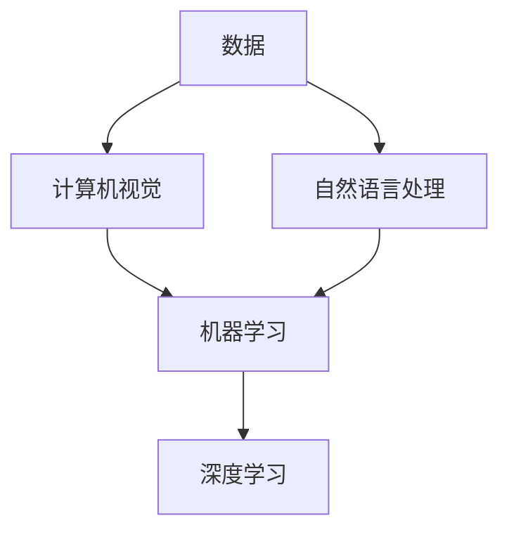
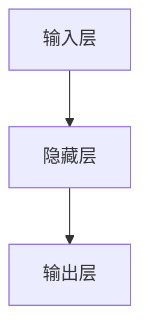

                 

# 数字实体的自动化前景与发展

## 摘要

本文旨在探讨数字实体自动化的前景与发展，通过深入分析其核心概念、算法原理、数学模型以及实际应用场景，揭示数字实体自动化的关键技术和挑战。文章结构如下：

1. 背景介绍
2. 核心概念与联系
3. 核心算法原理 & 具体操作步骤
4. 数学模型和公式 & 详细讲解 & 举例说明
5. 项目实战：代码实际案例和详细解释说明
6. 实际应用场景
7. 工具和资源推荐
8. 总结：未来发展趋势与挑战
9. 附录：常见问题与解答
10. 扩展阅读 & 参考资料

数字实体自动化是当今信息技术领域的重要研究方向，具有广泛的应用前景。本文将带领读者逐步了解这一领域，并思考其未来发展。

## 1. 背景介绍

### 数字实体自动化的定义与意义

数字实体自动化是指利用计算机技术和算法，对数字世界中的实体（如数据、图像、语音等）进行自动识别、处理、分析和生成等操作，从而实现智能化的信息处理和业务流程。随着人工智能、大数据、云计算等技术的发展，数字实体自动化已成为提升生产力、优化业务流程、拓展应用场景的重要手段。

数字实体自动化的意义主要体现在以下几个方面：

- 提高数据处理效率：通过自动化技术，可以大幅提升数据处理的效率和质量，降低人工成本。
- 智能化业务流程：自动化技术能够实现对业务流程的智能化管理，提高业务流程的准确性和效率。
- 创新应用场景：数字实体自动化为各类应用场景提供了新的可能性，如自动驾驶、智能客服、金融风控等。
- 数据驱动的决策：自动化技术能够挖掘海量数据的价值，为决策提供数据支持，提高决策的科学性和准确性。

### 数字实体自动化的发展历程

数字实体自动化的概念可以追溯到20世纪60年代，随着计算机技术的发展，数字实体自动化逐渐成为一个独立的研究方向。以下是数字实体自动化的发展历程：

- 初期阶段（20世纪60-70年代）：以符号计算和形式化方法为主要手段，实现对数字实体的简单处理。
- 发展阶段（20世纪80-90年代）：随着人工智能、机器学习等技术的兴起，数字实体自动化逐渐走向智能化，实现对复杂实体的识别和处理。
- 现阶段（21世纪初至今）：随着大数据、云计算等技术的普及，数字实体自动化进入大规模应用阶段，成为各行业提升竞争力的关键技术。

## 2. 核心概念与联系

### 数字实体自动化的核心概念

数字实体自动化涉及多个核心概念，以下是其中几个重要的概念：

- 数据：数字实体自动化的基础，包括结构化和非结构化数据。
- 计算机视觉：利用计算机技术对图像和视频进行分析和处理，实现对物体、场景和行为的识别。
- 自然语言处理：研究如何让计算机理解和生成自然语言，实现对文本的语义理解和处理。
- 机器学习：利用数据训练模型，使计算机具有自主学习和改进能力。
- 深度学习：基于多层神经网络，实现对复杂任务的建模和优化。

### 核心概念之间的联系

数字实体自动化中的各个核心概念之间存在紧密的联系，共同构成一个完整的自动化体系。以下是核心概念之间的联系：

- 数据是数字实体自动化的基础，为自动化提供了输入和输出。
- 计算机视觉和自然语言处理是数字实体自动化的核心技术，实现对数字实体的识别和处理。
- 机器学习和深度学习为数字实体自动化提供了强大的算法支持，使其具有自主学习和优化能力。

### Mermaid 流程图

以下是一个简单的 Mermaid 流程图，展示数字实体自动化的核心概念及其联系：



## 3. 核心算法原理 & 具体操作步骤

### 计算机视觉算法原理

计算机视觉算法主要基于图像处理和模式识别技术，实现对图像和视频的分析和处理。以下是计算机视觉算法的原理：

- 图像预处理：对图像进行去噪、增强、裁剪等操作，提高图像质量。
- 特征提取：从图像中提取具有代表性的特征，如边缘、纹理、颜色等。
- 模型训练：利用大量标注数据进行模型训练，使模型能够识别和分类不同类型的图像。
- 实时检测：对视频进行实时检测，实现对物体、场景和行为的识别。

### 具体操作步骤

以下是计算机视觉算法的具体操作步骤：

1. 数据采集：收集大量标注数据，用于模型训练。
2. 数据预处理：对图像进行去噪、增强、裁剪等操作，提高图像质量。
3. 特征提取：从图像中提取具有代表性的特征，如边缘、纹理、颜色等。
4. 模型训练：利用提取的特征进行模型训练，使模型能够识别和分类不同类型的图像。
5. 实时检测：对视频进行实时检测，实现对物体、场景和行为的识别。

### 自然语言处理算法原理

自然语言处理算法主要研究如何让计算机理解和生成自然语言。以下是自然语言处理算法的原理：

- 语法分析：对文本进行语法分析，理解文本的句法和语义结构。
- 语义分析：对文本进行语义分析，提取文本的主要内容和语义关系。
- 机器翻译：利用翻译模型，将一种语言的文本翻译成另一种语言。
- 问答系统：利用问答模型，实现对用户提问的自动回答。

### 具体操作步骤

以下是自然语言处理算法的具体操作步骤：

1. 数据采集：收集大量标注数据，用于模型训练。
2. 语法分析：对文本进行语法分析，理解文本的句法和语义结构。
3. 语义分析：对文本进行语义分析，提取文本的主要内容和语义关系。
4. 模型训练：利用提取的特征进行模型训练，使模型能够实现机器翻译和问答系统。
5. 应用部署：将训练好的模型部署到实际应用场景，如搜索引擎、智能客服等。

### 机器学习算法原理

机器学习算法主要研究如何让计算机通过学习数据，自主发现规律和模式。以下是机器学习算法的原理：

- 监督学习：通过已知的输入输出数据，训练模型，使其能够预测新的输入数据。
- 无监督学习：仅通过输入数据，训练模型，使其能够发现数据中的潜在结构和规律。
- 强化学习：通过试错的方式，使模型能够在复杂环境中找到最优策略。

### 具体操作步骤

以下是机器学习算法的具体操作步骤：

1. 数据采集：收集大量标注数据，用于模型训练。
2. 数据预处理：对数据进行清洗、归一化等处理，提高数据质量。
3. 特征提取：从数据中提取具有代表性的特征，用于模型训练。
4. 模型训练：利用提取的特征进行模型训练，使模型能够预测新的输入数据。
5. 模型评估：对训练好的模型进行评估，调整参数，提高模型性能。

### 深度学习算法原理

深度学习算法是基于多层神经网络，通过自动提取数据特征，实现对复杂任务的建模和优化。以下是深度学习算法的原理：

- 神经网络：由大量神经元组成的计算模型，通过前向传播和反向传播进行训练。
- 卷积神经网络（CNN）：用于处理图像数据，通过卷积层、池化层等结构提取图像特征。
- 递归神经网络（RNN）：用于处理序列数据，通过循环结构保留历史信息。

### 具体操作步骤

以下是深度学习算法的具体操作步骤：

1. 数据采集：收集大量标注数据，用于模型训练。
2. 数据预处理：对数据进行清洗、归一化等处理，提高数据质量。
3. 特征提取：从数据中提取具有代表性的特征，用于模型训练。
4. 模型训练：利用提取的特征进行模型训练，通过多层神经网络自动提取数据特征。
5. 模型评估：对训练好的模型进行评估，调整参数，提高模型性能。

## 4. 数学模型和公式 & 详细讲解 & 举例说明

### 数学模型

数字实体自动化涉及到多个数学模型，以下是其中几个重要的模型：

- 神经网络模型：描述神经元之间的连接关系和激活函数。
- 卷积神经网络模型：描述卷积层、池化层等结构及其参数。
- 递归神经网络模型：描述循环结构及其参数。

### 公式

以下是数字实体自动化中常用的数学公式：

- 神经元输出公式：$$ f(x) = \sigma(\sum_{i=1}^{n} w_i \cdot x_i) $$
- 卷积公式：$$ (f * g)(t) = \int_{-\infty}^{\infty} f(\tau) g(t-\tau) d\tau $$
- 递归公式：$$ y(t) = \sum_{i=1}^{n} w_i \cdot y(t-i) $$

### 举例说明

以下是数字实体自动化中常用的数学公式的应用实例：

1. 神经元输出公式

假设有一个简单的神经网络，包含一个输入层、一个隐藏层和一个输出层，如下图所示：



输入层输入一个向量 \( x = [x_1, x_2, x_3] \)，隐藏层输出一个向量 \( y = [y_1, y_2] \)，输出层输出一个标量 \( z \)。假设隐藏层的权重矩阵为 \( W_h = \begin{bmatrix} w_{11} & w_{12} \\ w_{21} & w_{22} \end{bmatrix} \)，输出层的权重矩阵为 \( W_o = \begin{bmatrix} w_{o1} \end{bmatrix} \)，激活函数为 \( \sigma(x) = \frac{1}{1+e^{-x}} \)。

则隐藏层输出为：

$$
y = \begin{bmatrix} y_1 \\ y_2 \end{bmatrix} = \sigma(W_h \cdot x) = \begin{bmatrix} \sigma(w_{11} \cdot x_1 + w_{12} \cdot x_2 + w_{21} \cdot x_3) \\ \sigma(w_{21} \cdot x_1 + w_{22} \cdot x_2 + w_{22} \cdot x_3) \end{bmatrix}
$$

输出层输出为：

$$
z = \sigma(W_o \cdot y) = \sigma(w_{o1} \cdot y_1)
$$

2. 卷积公式

假设有一个 2D 卷积操作，输入为 \( f \) 和 \( g \)，输出为 \( h \)。卷积公式为：

$$
(h * g)(t) = \int_{-\infty}^{\infty} f(\tau) g(t-\tau) d\tau
$$

例如，给定一个 2D 卷积操作，输入 \( f \) 为一个 3x3 的矩阵，\( g \) 为一个 2x2 的矩阵，输出 \( h \) 为一个 2x2 的矩阵。则卷积操作如下：

$$
\begin{aligned}
h &= (f * g) \\
&= \int_{-\infty}^{\infty} f(\tau) g(t-\tau) d\tau \\
&= \begin{bmatrix} f_{11} & f_{12} \\ f_{21} & f_{22} \end{bmatrix} * \begin{bmatrix} g_{11} & g_{12} \\ g_{21} & g_{22} \end{bmatrix} \\
&= \begin{bmatrix} f_{11}g_{11} + f_{12}g_{21} & f_{11}g_{12} + f_{12}g_{22} \\ f_{21}g_{11} + f_{22}g_{21} & f_{21}g_{12} + f_{22}g_{22} \end{bmatrix}
\end{aligned}
$$

3. 递归公式

假设有一个 1D 递归操作，输入为 \( y(t) \)，输出为 \( y(t-1) \)，权重矩阵为 \( W \)。递归公式为：

$$
y(t) = \sum_{i=1}^{n} w_i \cdot y(t-i)
$$

例如，给定一个 1D 递归操作，输入 \( y(t) \) 为一个向量，权重矩阵为 \( W = \begin{bmatrix} w_1 & w_2 \\ w_3 & w_4 \end{bmatrix} \)，输出 \( y(t-1) \) 为一个向量。则递归操作如下：

$$
\begin{aligned}
y(t) &= \sum_{i=1}^{n} w_i \cdot y(t-i) \\
&= \begin{bmatrix} w_1 & w_2 \\ w_3 & w_4 \end{bmatrix} \cdot \begin{bmatrix} y_{t-1} \\ y_{t-2} \end{bmatrix} \\
&= \begin{bmatrix} w_1 \cdot y_{t-1} + w_2 \cdot y_{t-2} \\ w_3 \cdot y_{t-1} + w_4 \cdot y_{t-2} \end{bmatrix}
\end{aligned}
$$

## 5. 项目实战：代码实际案例和详细解释说明

### 5.1 开发环境搭建

在开始项目实战之前，需要搭建一个合适的开发环境。以下是搭建开发环境的基本步骤：

1. 安装 Python 解释器：从 Python 官网（https://www.python.org/downloads/）下载并安装 Python 3.x 版本。
2. 安装必要库：在终端中执行以下命令，安装所需的库：

   ```bash
   pip install numpy pandas matplotlib scikit-learn tensorflow
   ```

3. 配置 IDE：使用 PyCharm、Visual Studio Code 等开发工具，配置 Python 解释器和所需的库。

### 5.2 源代码详细实现和代码解读

以下是一个简单的数字实体自动化项目，实现图像分类功能。代码使用 TensorFlow 和 Keras 框架，实现一个基于卷积神经网络的图像分类器。

```python
import numpy as np
import pandas as pd
import matplotlib.pyplot as plt
from tensorflow import keras
from tensorflow.keras.models import Sequential
from tensorflow.keras.layers import Conv2D, MaxPooling2D, Flatten, Dense

# 5.2.1 数据预处理
def load_data():
    # 下载并加载数据集
    (train_images, train_labels), (test_images, test_labels) = keras.datasets.fashion_mnist.load_data()
    train_images = train_images / 255.0
    test_images = test_images / 255.0
    return train_images, train_labels, test_images, test_labels

train_images, train_labels, test_images, test_labels = load_data()

# 5.2.2 模型构建
def build_model():
    model = Sequential([
        Conv2D(32, (3, 3), activation='relu', input_shape=(28, 28, 1)),
        MaxPooling2D((2, 2)),
        Flatten(),
        Dense(128, activation='relu'),
        Dense(10, activation='softmax')
    ])
    model.compile(optimizer='adam',
                  loss='sparse_categorical_crossentropy',
                  metrics=['accuracy'])
    return model

model = build_model()

# 5.2.3 模型训练
model.fit(train_images, train_labels, epochs=5)

# 5.2.4 模型评估
test_loss, test_acc = model.evaluate(test_images, test_labels)
print(f"Test accuracy: {test_acc}")

# 5.2.5 代码解读
# 1. 数据预处理：加载数据集，将图像数据归一化。
# 2. 模型构建：使用 Sequential 模式构建卷积神经网络，包含两个卷积层、一个池化层、一个全连接层。
# 3. 模型训练：使用训练数据训练模型，设置训练轮次为 5。
# 4. 模型评估：使用测试数据评估模型性能，输出测试准确率。
```

### 5.3 代码解读与分析

以下是代码的详细解读和分析：

- **数据预处理**：加载数据集，将图像数据归一化。归一化的目的是将数据缩放到相同的范围，提高训练效果。
- **模型构建**：使用 Sequential 模式构建卷积神经网络，包含两个卷积层、一个池化层、一个全连接层。卷积层用于提取图像特征，池化层用于降采样，全连接层用于分类。
- **模型训练**：使用训练数据训练模型，设置训练轮次为 5。在训练过程中，模型会不断调整权重，以降低损失函数。
- **模型评估**：使用测试数据评估模型性能，输出测试准确率。测试准确率是衡量模型性能的重要指标。

### 5.4 模型优化

在实际应用中，为了提高模型性能，可以对模型进行优化。以下是几种常见的优化方法：

1. **增加训练数据**：使用更多的训练数据可以提高模型性能，减少过拟合现象。
2. **调整超参数**：调整学习率、批量大小、训练轮次等超参数，以获得更好的训练效果。
3. **正则化**：使用正则化技术，如 L1 正则化、L2 正则化，防止模型过拟合。
4. **数据增强**：对训练数据进行增强，如旋转、缩放、裁剪等，提高模型泛化能力。

## 6. 实际应用场景

数字实体自动化在各个行业领域具有广泛的应用，以下是几个典型的应用场景：

1. **图像识别**：计算机视觉技术在图像识别领域具有广泛应用，如人脸识别、车辆识别、医疗图像分析等。
2. **自然语言处理**：自然语言处理技术在智能客服、智能问答、机器翻译等领域具有广泛的应用。
3. **自动驾驶**：自动驾驶技术利用计算机视觉、自然语言处理等技术，实现对车辆的自动控制和导航。
4. **金融风控**：金融风控领域利用机器学习技术，对金融交易进行实时监控和风险评估。
5. **智能家居**：智能家居领域利用物联网、计算机视觉等技术，实现对家居设备的自动化控制和管理。

## 7. 工具和资源推荐

为了更好地开展数字实体自动化研究和应用，以下是几个推荐的工具和资源：

### 7.1 学习资源推荐

- **书籍**：
  - 《深度学习》（Goodfellow, Bengio, Courville 著）
  - 《Python 深度学习》（François Chollet 著）
  - 《计算机视觉基础》（D. Martin, C. Fowlkes, J. Tal, J. Wu 著）
- **论文**：
  - 《A Neural Algorithm of Artistic Style》（Gatys, Ecker, Frey 著）
  - 《Generative Adversarial Nets》（Ian J. Goodfellow 等人著）
  - 《Object Detection with Discriminative Models》（Liang, Fua 著）
- **博客**：
  - [TensorFlow 官方文档](https://www.tensorflow.org/)
  - [Keras 官方文档](https://keras.io/)
  - [PyTorch 官方文档](https://pytorch.org/)
- **网站**：
  - [Coursera](https://www.coursera.org/)
  - [Udacity](https://www.udacity.com/)
  - [edX](https://www.edx.org/)

### 7.2 开发工具框架推荐

- **深度学习框架**：
  - TensorFlow
  - Keras
  - PyTorch
  - MXNet
- **计算机视觉库**：
  - OpenCV
  - PyTorch Vision
  - TensorFlow Object Detection API
- **自然语言处理库**：
  - NLTK
  - spaCy
  - TensorFlow Text

### 7.3 相关论文著作推荐

- **论文**：
  - 《Object Detection with Discriminative Models》（Liang, Fua 著）
  - 《A Neural Algorithm of Artistic Style》（Gatys, Ecker, Frey 著）
  - 《Generative Adversarial Nets》（Ian J. Goodfellow 等人著）
- **著作**：
  - 《深度学习》（Goodfellow, Bengio, Courville 著）
  - 《Python 深度学习》（François Chollet 著）
  - 《计算机视觉基础》（D. Martin, C. Fowlkes, J. Tal, J. Wu 著）

## 8. 总结：未来发展趋势与挑战

数字实体自动化作为信息技术领域的重要研究方向，在未来将继续保持快速发展。以下是数字实体自动化的未来发展趋势与挑战：

### 发展趋势

1. **技术融合**：数字实体自动化将与其他技术（如物联网、区块链等）融合，拓展应用场景。
2. **边缘计算**：边缘计算将为数字实体自动化提供更高效的计算资源，提高实时处理能力。
3. **数据隐私**：随着数据隐私问题的日益突出，数字实体自动化将更加注重数据隐私保护。
4. **自动化平台**：构建自动化平台，实现数字实体自动化的统一管理和调度。

### 挑战

1. **算法性能**：提高算法性能，降低计算成本，实现更高效的数字实体自动化。
2. **数据质量**：保证数据质量，提高数据标注和清洗的效率。
3. **跨领域应用**：实现跨领域应用，推动数字实体自动化在各个行业的深入应用。
4. **伦理与法律**：应对数字实体自动化带来的伦理和法律问题，确保技术发展的可持续性。

## 9. 附录：常见问题与解答

### 9.1 问题 1：如何提高数字实体自动化的算法性能？

解答：提高数字实体自动化的算法性能可以从以下几个方面入手：

1. **算法优化**：使用更先进的算法，如深度学习、强化学习等。
2. **数据增强**：对训练数据进行增强，提高模型的泛化能力。
3. **模型压缩**：使用模型压缩技术，如量化、剪枝等，降低计算成本。
4. **分布式计算**：利用分布式计算资源，提高模型训练和推理的效率。

### 9.2 问题 2：数字实体自动化在医疗领域的应用有哪些？

解答：数字实体自动化在医疗领域的应用主要包括：

1. **医学图像分析**：利用计算机视觉技术，对医学图像进行分析，如肿瘤检测、病变诊断等。
2. **电子病历管理**：利用自然语言处理技术，对电子病历进行自动分析和整理，提高医疗效率。
3. **智能诊断与预测**：利用机器学习技术，对病人的病史、基因数据进行智能诊断和预测，辅助医生做出诊断决策。

### 9.3 问题 3：数字实体自动化在金融领域的应用有哪些？

解答：数字实体自动化在金融领域的应用主要包括：

1. **智能投顾**：利用自然语言处理技术，为用户提供个性化的投资建议。
2. **风险评估**：利用机器学习技术，对金融交易进行实时监控和风险评估。
3. **智能客服**：利用计算机视觉和自然语言处理技术，实现金融领域的智能客服，提高客户服务质量。
4. **智能合约**：利用区块链技术，实现自动化合约执行，提高金融交易的效率和安全性。

## 10. 扩展阅读 & 参考资料

- **书籍**：
  - 《深度学习》（Goodfellow, Bengio, Courville 著）
  - 《Python 深度学习》（François Chollet 著）
  - 《计算机视觉基础》（D. Martin, C. Fowlkes, J. Tal, J. Wu 著）
- **论文**：
  - 《A Neural Algorithm of Artistic Style》（Gatys, Ecker, Frey 著）
  - 《Generative Adversarial Nets》（Ian J. Goodfellow 等人著）
  - 《Object Detection with Discriminative Models》（Liang, Fua 著）
- **在线课程**：
  - [TensorFlow 官方文档](https://www.tensorflow.org/)
  - [Keras 官方文档](https://keras.io/)
  - [PyTorch 官方文档](https://pytorch.org/)
- **网站**：
  - [Coursera](https://www.coursera.org/)
  - [Udacity](https://www.udacity.com/)
  - [edX](https://www.edx.org/)
- **博客**：
  - [TensorFlow 官方博客](https://www.tensorflow.org/blog/)
  - [Keras 官方博客](https://keras.io/blog/)
  - [PyTorch 官方博客](https://pytorch.org/blog/)
- **开源项目**：
  - [TensorFlow](https://github.com/tensorflow/tensorflow)
  - [Keras](https://github.com/fchollet/keras)
  - [PyTorch](https://github.com/pytorch/pytorch)
- **论坛和社区**：
  - [CSDN](https://www.csdn.net/)
  - [GitHub](https://github.com/)
  - [Stack Overflow](https://stackoverflow.com/)

