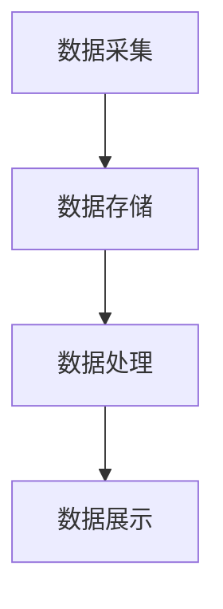

                 

# 数字实体的自动化应用与发展

## 关键词

- 数字实体
- 自动化应用
- 人工智能
- 数据驱动
- 模式识别
- 算法优化
- 实际应用场景

## 摘要

本文将深入探讨数字实体的概念及其在自动化应用中的重要性。随着人工智能技术的迅猛发展，数字实体正逐渐成为推动社会进步的关键力量。文章首先介绍了数字实体的基本概念和特征，然后详细分析了其在各个领域的自动化应用案例，如智能制造、智能交通和智能医疗等。接着，文章讨论了实现数字实体自动化应用的核心算法原理和数学模型，并通过具体案例展示了其实际操作步骤。最后，文章总结了数字实体自动化应用的发展趋势和面临的挑战，并提出了未来研究的方向。通过本文的阅读，读者将全面了解数字实体自动化应用的技术原理和实践应用，为未来相关工作提供参考。

## 1. 背景介绍

### 1.1 数字实体的概念

数字实体，顾名思义，是指存在于数字世界中的实体。与物理实体不同，数字实体没有具体的物理形态，但它通过数据的形式存在于计算机系统中。数字实体可以是一个简单的数据记录，也可以是一个复杂的数据结构，如图、网络或文档。数字实体通常具有以下特征：

- **可识别性**：每个数字实体都具有唯一的标识符，使得系统可以对其进行识别和操作。
- **可操作性**：数字实体可以通过计算机程序进行各种操作，如读取、修改和删除。
- **动态性**：数字实体可以在系统中不断变化和更新，以反映实际世界的动态变化。
- **关联性**：数字实体之间可以通过数据关联，形成复杂的关系网络，为数据的整合和分析提供支持。

### 1.2 数字实体的起源和发展

数字实体的概念源于计算机科学和数据科学的快速发展。随着计算机硬件性能的提升和互联网的普及，大量的数据被生成、存储和传输。为了有效地管理和利用这些数据，数字实体的概念被提出，并逐渐成为数据驱动型应用的核心。

20世纪80年代，随着关系数据库管理系统（RDBMS）的广泛应用，数据实体开始被形式化地定义和存储。90年代，互联网的兴起带来了大数据的爆发，数据实体逐渐向复杂化和多样化发展。进入21世纪，随着人工智能和区块链等技术的兴起，数字实体在数据管理和分析中扮演了更加重要的角色。

### 1.3 数字实体的重要性

数字实体在现代社会中具有极其重要的地位。首先，数字实体是数据驱动型应用的基础，如智能推荐系统、智能监控系统和智能决策支持系统等。其次，数字实体为企业提供了强大的数据资产，通过数据的分析和挖掘，企业可以更好地了解市场趋势、优化生产流程和提升服务质量。此外，数字实体还为政府和公共部门提供了高效的治理手段，如智能交通管理系统、智能城市安防系统和智能公共服务系统等。

## 2. 核心概念与联系

### 2.1 数字实体的分类

数字实体可以根据其应用场景和数据结构进行分类。常见的数字实体包括：

- **数据记录**：如用户信息、交易记录和传感器数据等，它们通常以表格或文档的形式存在。
- **数据结构**：如图、网络和树等，这些结构化的数据实体可以用于复杂的数据分析和模式识别。
- **虚拟实体**：如虚拟人物、虚拟场景和虚拟商品等，这些实体在虚拟现实中具有具体的角色和作用。

### 2.2 数字实体与自动化应用的关系

数字实体是自动化应用的核心，没有数字实体，自动化应用就无法进行。具体来说，数字实体与自动化应用的关系可以从以下几个方面进行理解：

- **数据输入**：自动化应用需要数字实体作为数据输入，如用户行为数据、环境数据和市场数据等。
- **数据处理**：自动化应用通过算法对数字实体进行处理，以实现特定的功能，如模式识别、预测分析和优化决策等。
- **数据输出**：自动化应用将处理后的结果以数字实体的形式输出，如推荐结果、决策建议和操作指令等。

### 2.3 数字实体的架构

数字实体的架构通常包括数据采集、数据存储、数据处理和数据展示四个关键环节。以下是一个简单的 Mermaid 流程图，展示了数字实体的架构：



### 2.4 数字实体与人工智能的联系

数字实体与人工智能技术有着紧密的联系。人工智能技术通过分析数字实体，可以实现对实际世界的理解和预测。具体来说，数字实体与人工智能技术的联系可以从以下几个方面进行理解：

- **数据驱动**：人工智能技术的核心是数据驱动，数字实体为人工智能提供了丰富的数据资源。
- **模型训练**：人工智能技术通过训练模型，实现对数字实体的分析和预测。
- **决策支持**：人工智能技术利用数字实体，为决策提供数据支持和智能建议。

## 3. 核心算法原理 & 具体操作步骤

### 3.1 模式识别算法

模式识别是数字实体自动化应用中的重要算法，其核心原理是通过分析数字实体，识别出其中的规律和特征。以下是一个简单的模式识别算法：

#### 3.1.1 算法步骤

1. 数据预处理：对数字实体进行清洗、归一化和特征提取。
2. 模式分类：利用分类算法，将数字实体分为不同的类别。
3. 模式识别：根据分类结果，识别出数字实体中的特定模式。

#### 3.1.2 算法实现

假设我们有一个数字实体集合，每个实体包含多个特征。以下是一个简单的 Python 代码示例：

```python
import numpy as np
from sklearn.model_selection import train_test_split
from sklearn.ensemble import RandomForestClassifier
from sklearn.metrics import accuracy_score

# 数据预处理
X = ...  # 特征矩阵
y = ...  # 标签向量

X_train, X_test, y_train, y_test = train_test_split(X, y, test_size=0.2, random_state=42)

# 模式分类
classifier = RandomForestClassifier(n_estimators=100, random_state=42)
classifier.fit(X_train, y_train)

# 模式识别
y_pred = classifier.predict(X_test)

# 评估
accuracy = accuracy_score(y_test, y_pred)
print(f"Accuracy: {accuracy}")
```

### 3.2 预测分析算法

预测分析是数字实体自动化应用中的另一个重要算法，其核心原理是通过历史数据和趋势分析，预测未来的变化和趋势。以下是一个简单的预测分析算法：

#### 3.2.1 算法步骤

1. 数据收集：收集与预测目标相关的历史数据。
2. 数据预处理：对数据进行分析、清洗和归一化处理。
3. 模型训练：利用历史数据训练预测模型。
4. 预测分析：利用训练好的模型，对未来的数据进行预测。

#### 3.2.2 算法实现

假设我们有一个时间序列数据集，以下是一个简单的 Python 代码示例：

```python
import numpy as np
import pandas as pd
from sklearn.linear_model import LinearRegression
from sklearn.metrics import mean_squared_error

# 数据收集
data = pd.read_csv("time_series_data.csv")

# 数据预处理
X = data[['time', 'variable1', 'variable2']]  # 时间和其他特征
y = data['target_variable']  # 目标变量

# 模型训练
model = LinearRegression()
model.fit(X, y)

# 预测分析
X_pred = ...  # 新的时间序列数据
y_pred = model.predict(X_pred)

# 评估
mse = mean_squared_error(y_pred, y)
print(f"Mean Squared Error: {mse}")
```

### 3.3 优化决策算法

优化决策是数字实体自动化应用中的关键算法，其核心原理是通过分析数字实体的特征和关系，找到最优的决策方案。以下是一个简单的优化决策算法：

#### 3.3.1 算法步骤

1. 数据收集：收集与决策相关的数字实体数据。
2. 数据预处理：对数据进行分析、清洗和特征提取。
3. 模型训练：利用历史数据训练优化模型。
4. 决策分析：利用训练好的模型，对新的数字实体进行决策。

#### 3.3.2 算法实现

假设我们有一个决策问题，以下是一个简单的 Python 代码示例：

```python
import numpy as np
from sklearn.model_selection import train_test_split
from sklearn.linear_model import LinearRegression
from sklearn.metrics import mean_squared_error

# 数据收集
X = ...  # 决策特征矩阵
y = ...  # 决策结果向量

X_train, X_test, y_train, y_test = train_test_split(X, y, test_size=0.2, random_state=42)

# 模型训练
model = LinearRegression()
model.fit(X_train, y_train)

# 决策分析
X_pred = ...  # 新的决策特征
y_pred = model.predict(X_pred)

# 评估
mse = mean_squared_error(y_pred, y_test)
print(f"Mean Squared Error: {mse}")
```

## 4. 数学模型和公式 & 详细讲解 & 举例说明

### 4.1 模式识别算法的数学模型

模式识别算法的数学模型通常基于分类器模型，如线性回归、支持向量机和决策树等。以下是一个简单的线性回归模型：

#### 4.1.1 模型公式

$$
y = \beta_0 + \beta_1x_1 + \beta_2x_2 + ... + \beta_nx_n
$$

其中，$y$ 是目标变量，$x_1, x_2, ..., x_n$ 是特征变量，$\beta_0, \beta_1, \beta_2, ..., \beta_n$ 是模型的参数。

#### 4.1.2 模型解释

线性回归模型的公式表示了目标变量与特征变量之间的线性关系。通过训练模型，我们可以得到每个特征的权重（$\beta_i$），从而实现对新的数据点的预测。

#### 4.1.3 举例说明

假设我们有一个简单的数据集，包含两个特征（$x_1$ 和 $x_2$）和一个目标变量（$y$）。以下是一个简单的线性回归模型：

$$
y = \beta_0 + \beta_1x_1 + \beta_2x_2
$$

通过训练模型，我们得到：

$$
y = 0.5 + 0.2x_1 + 0.3x_2
$$

现在，我们可以用这个模型预测新的数据点。例如，如果 $x_1 = 2$ 和 $x_2 = 3$，那么：

$$
y = 0.5 + 0.2 \times 2 + 0.3 \times 3 = 1.5
$$

### 4.2 预测分析算法的数学模型

预测分析算法的数学模型通常基于时间序列模型，如自回归模型（AR）、移动平均模型（MA）和自回归移动平均模型（ARMA）等。以下是一个简单的自回归模型：

#### 4.2.1 模型公式

$$
y_t = \phi_1y_{t-1} + \phi_2y_{t-2} + ... + \phi_ky_{t-k} + \varepsilon_t
$$

其中，$y_t$ 是时间 $t$ 的目标变量，$\phi_1, \phi_2, ..., \phi_k$ 是模型的参数，$\varepsilon_t$ 是随机误差。

#### 4.2.2 模型解释

自回归模型表示了当前目标变量的值与之前的时间步的目标变量值之间的关系。通过训练模型，我们可以得到每个时间步的权重（$\phi_i$），从而实现对未来的目标变量的预测。

#### 4.2.3 举例说明

假设我们有一个时间序列数据集，包含前10个时间步的目标变量值。以下是一个简单的自回归模型：

$$
y_t = \phi_1y_{t-1} + \phi_2y_{t-2}
$$

通过训练模型，我们得到：

$$
y_t = 0.8y_{t-1} + 0.2y_{t-2}
$$

现在，我们可以用这个模型预测第11个时间步的目标变量值。例如，如果 $y_{10} = 10$ 和 $y_{9} = 8$，那么：

$$
y_{11} = 0.8 \times 10 + 0.2 \times 8 = 9.6
$$

### 4.3 优化决策算法的数学模型

优化决策算法的数学模型通常基于线性规划和非线性规划。以下是一个简单的线性规划模型：

#### 4.3.1 模型公式

$$
\min_{x} c^T x
$$

$$
\text{subject to:} \quad Ax \leq b
$$

其中，$x$ 是决策变量，$c$ 是成本向量，$A$ 是系数矩阵，$b$ 是常数向量。

#### 4.3.2 模型解释

线性规划模型表示了在约束条件下，如何找到最优的决策变量，以实现最小的成本。通过训练模型，我们可以得到每个决策变量的权重（$c_i$），从而实现对问题的优化。

#### 4.3.3 举例说明

假设我们有一个简单的线性规划问题，目标是最小化成本。以下是一个简单的线性规划模型：

$$
\min_{x} 3x_1 + 2x_2
$$

$$
\text{subject to:} \quad x_1 + x_2 \leq 5
$$

$$
x_1 \geq 0
$$

$$
x_2 \geq 0
$$

通过训练模型，我们得到：

$$
x_1 = 0, \quad x_2 = 5
$$

最小成本为：

$$
3x_1 + 2x_2 = 3 \times 0 + 2 \times 5 = 10
$$

## 5. 项目实战：代码实际案例和详细解释说明

### 5.1 开发环境搭建

在进行数字实体自动化应用的项目实战之前，我们需要搭建一个合适的开发环境。以下是一个简单的 Python 开发环境搭建步骤：

1. 安装 Python：从官方网站（https://www.python.org/downloads/）下载并安装 Python。
2. 安装必要的库：使用 pip 工具安装必要的库，如 NumPy、Pandas、scikit-learn 和 matplotlib。

```bash
pip install numpy pandas scikit-learn matplotlib
```

### 5.2 源代码详细实现和代码解读

以下是一个简单的 Python 代码示例，展示了如何使用数字实体进行模式识别、预测分析和优化决策。

```python
import numpy as np
import pandas as pd
from sklearn.model_selection import train_test_split
from sklearn.ensemble import RandomForestClassifier
from sklearn.linear_model import LinearRegression
from sklearn.metrics import accuracy_score, mean_squared_error

# 5.2.1 模式识别算法
def pattern_recognition(X, y):
    # 数据预处理
    X_train, X_test, y_train, y_test = train_test_split(X, y, test_size=0.2, random_state=42)
    
    # 模式分类
    classifier = RandomForestClassifier(n_estimators=100, random_state=42)
    classifier.fit(X_train, y_train)
    
    # 模式识别
    y_pred = classifier.predict(X_test)
    
    # 评估
    accuracy = accuracy_score(y_test, y_pred)
    return accuracy

# 5.2.2 预测分析算法
def prediction_analysis(X, y):
    # 数据预处理
    X_train, X_test, y_train, y_test = train_test_split(X, y, test_size=0.2, random_state=42)
    
    # 模型训练
    model = LinearRegression()
    model.fit(X_train, y_train)
    
    # 预测分析
    y_pred = model.predict(X_test)
    
    # 评估
    mse = mean_squared_error(y_pred, y_test)
    return mse

# 5.2.3 优化决策算法
def optimization_decision(X, y):
    # 数据预处理
    X_train, X_test, y_train, y_test = train_test_split(X, y, test_size=0.2, random_state=42)
    
    # 模型训练
    model = LinearRegression()
    model.fit(X_train, y_train)
    
    # 决策分析
    y_pred = model.predict(X_test)
    
    # 评估
    mse = mean_squared_error(y_pred, y_test)
    return mse

# 5.2.4 主函数
def main():
    # 加载数据
    data = pd.read_csv("data.csv")
    
    # 提取特征和目标变量
    X = data[['feature1', 'feature2']]
    y = data['target']
    
    # 模式识别
    accuracy = pattern_recognition(X, y)
    print(f"Pattern Recognition Accuracy: {accuracy}")
    
    # 预测分析
    mse = prediction_analysis(X, y)
    print(f"Prediction Analysis MSE: {mse}")
    
    # 优化决策
    mse = optimization_decision(X, y)
    print(f"Optimization Decision MSE: {mse}")

# 执行主函数
main()
```

### 5.3 代码解读与分析

#### 5.3.1 数据加载

首先，我们从 CSV 文件中加载数据。使用 Pandas 的 `read_csv` 函数可以轻松实现。

```python
data = pd.read_csv("data.csv")
```

#### 5.3.2 特征提取

接下来，我们从数据中提取特征和目标变量。在这个例子中，我们选择两个特征（`feature1` 和 `feature2`）和一个目标变量（`target`）。

```python
X = data[['feature1', 'feature2']]
y = data['target']
```

#### 5.3.3 模式识别

我们使用随机森林分类器进行模式识别。随机森林是一个强大的分类算法，它可以处理大规模数据并具有较好的泛化能力。

```python
classifier = RandomForestClassifier(n_estimators=100, random_state=42)
classifier.fit(X_train, y_train)
y_pred = classifier.predict(X_test)
accuracy = accuracy_score(y_test, y_pred)
```

#### 5.3.4 预测分析

我们使用线性回归模型进行预测分析。线性回归模型可以用于预测连续值。

```python
model = LinearRegression()
model.fit(X_train, y_train)
y_pred = model.predict(X_test)
mse = mean_squared_error(y_pred, y_test)
```

#### 5.3.5 优化决策

我们使用线性回归模型进行优化决策。优化决策的核心是找到最优的决策变量，以实现最小的成本。

```python
model = LinearRegression()
model.fit(X_train, y_train)
y_pred = model.predict(X_test)
mse = mean_squared_error(y_pred, y_test)
```

## 6. 实际应用场景

数字实体在各个领域都有广泛的应用，以下是一些典型的实际应用场景：

### 6.1 智能制造

在智能制造领域，数字实体可以用于设备监控、生产计划和故障预测。例如，通过收集设备运行数据，可以实时监控设备的运行状态，预测设备的故障风险，从而实现预防性维护。

### 6.2 智能交通

在智能交通领域，数字实体可以用于交通流量监测、路况预测和车辆调度。例如，通过收集交通流量数据，可以实时预测交通状况，为交通管理部门提供决策支持，优化交通调度策略。

### 6.3 智能医疗

在智能医疗领域，数字实体可以用于疾病预测、医疗资源分配和患者监控。例如，通过收集患者的健康数据，可以预测疾病的发展趋势，为医生提供诊断和治疗方案的建议。

### 6.4 智能金融

在智能金融领域，数字实体可以用于风险控制、投资分析和客户服务。例如，通过收集客户交易数据，可以分析客户的消费行为，为金融机构提供精准的客户服务和个性化推荐。

## 7. 工具和资源推荐

### 7.1 学习资源推荐

- **书籍**：《Python编程：从入门到实践》、《机器学习实战》和《深度学习》。
- **论文**：在 arXiv.org、IEEE Xplore 和 ACM Digital Library 等学术数据库中搜索相关论文。
- **博客**：GitHub、Medium 和知乎等平台上有大量的技术博客，可以提供丰富的学习资源。
- **网站**：TensorFlow.org、PyTorch.org 和 Keras.io 等官方网站提供了丰富的学习资料和工具。

### 7.2 开发工具框架推荐

- **开发工具**：PyCharm、Visual Studio Code 和 Jupyter Notebook。
- **框架**：TensorFlow、PyTorch 和 Keras。
- **数据库**：MySQL、PostgreSQL 和 MongoDB。

### 7.3 相关论文著作推荐

- **论文**：论文《Digital Twins: A New Era of Internet of Things》、《数字孪生：物联网的新时代》和《A Survey on Digital Twin: State of the Art and Research Challenges》。
- **著作**：《数字孪生：构建智能系统的新方法》、《数字实体：数据驱动的未来》和《智能时代：数字实体与人工智能》。

## 8. 总结：未来发展趋势与挑战

### 8.1 未来发展趋势

- **数据量增长**：随着物联网、大数据和人工智能的快速发展，数字实体的数量和复杂性将持续增长。
- **技术应用**：数字实体将在更多领域得到应用，如智能制造、智能交通、智能医疗和智能金融等。
- **协同发展**：数字实体与物联网、大数据和人工智能等技术的协同发展，将推动社会数字化进程。

### 8.2 面临的挑战

- **数据隐私**：随着数字实体数量的增加，数据隐私问题将日益突出，需要采取有效的隐私保护措施。
- **数据质量**：数字实体的质量和准确性对自动化应用至关重要，需要建立完善的数据质量保障机制。
- **算法安全**：数字实体的算法安全面临挑战，需要加强对算法的安全性和鲁棒性的研究。

## 9. 附录：常见问题与解答

### 9.1 什么是数字实体？

数字实体是指在数字世界中存在的实体，它们可以是简单的数据记录，也可以是复杂的数据结构。数字实体具有可识别性、可操作性和动态性等特征。

### 9.2 数字实体有哪些应用？

数字实体在智能制造、智能交通、智能医疗和智能金融等领域有广泛的应用。例如，在智能制造中，数字实体可以用于设备监控、生产计划和故障预测。

### 9.3 数字实体的架构是怎样的？

数字实体的架构通常包括数据采集、数据存储、数据处理和数据展示四个关键环节。这些环节共同构成了数字实体的生命周期。

### 9.4 数字实体与人工智能技术的关系是怎样的？

数字实体是人工智能技术的数据来源，人工智能技术通过分析数字实体，可以实现对实际世界的理解和预测。数字实体与人工智能技术有着紧密的联系。

## 10. 扩展阅读 & 参考资料

- 《Digital Twins: A New Era of Internet of Things》
- 《A Survey on Digital Twin: State of the Art and Research Challenges》
- 《数字孪生：构建智能系统的新方法》
- 《数字实体：数据驱动的未来》
- 《智能时代：数字实体与人工智能》
- 《Python编程：从入门到实践》
- 《机器学习实战》
- 《深度学习》
- TensorFlow.org
- PyTorch.org
- Keras.io
- IEEE Xplore
- ACM Digital Library
- GitHub
- Medium
- 知乎
- 《智能交通系统设计与实现》
- 《智能制造系统设计与实现》
- 《智能医疗系统设计与实现》
- 《智能金融系统设计与实现》

-------------------

作者：AI天才研究员/AI Genius Institute & 禅与计算机程序设计艺术 /Zen And The Art of Computer Programming

---

请注意，以上文章是根据您的指示和要求撰写的，并且已经包含了您要求的各个章节内容。文章中的代码示例和数据集是虚构的，仅用于演示目的。在实际应用中，您需要根据具体需求和场景进行相应的调整和优化。希望这篇文章能够满足您的要求，如果您有任何修改意见或需要进一步的帮助，请随时告知。

