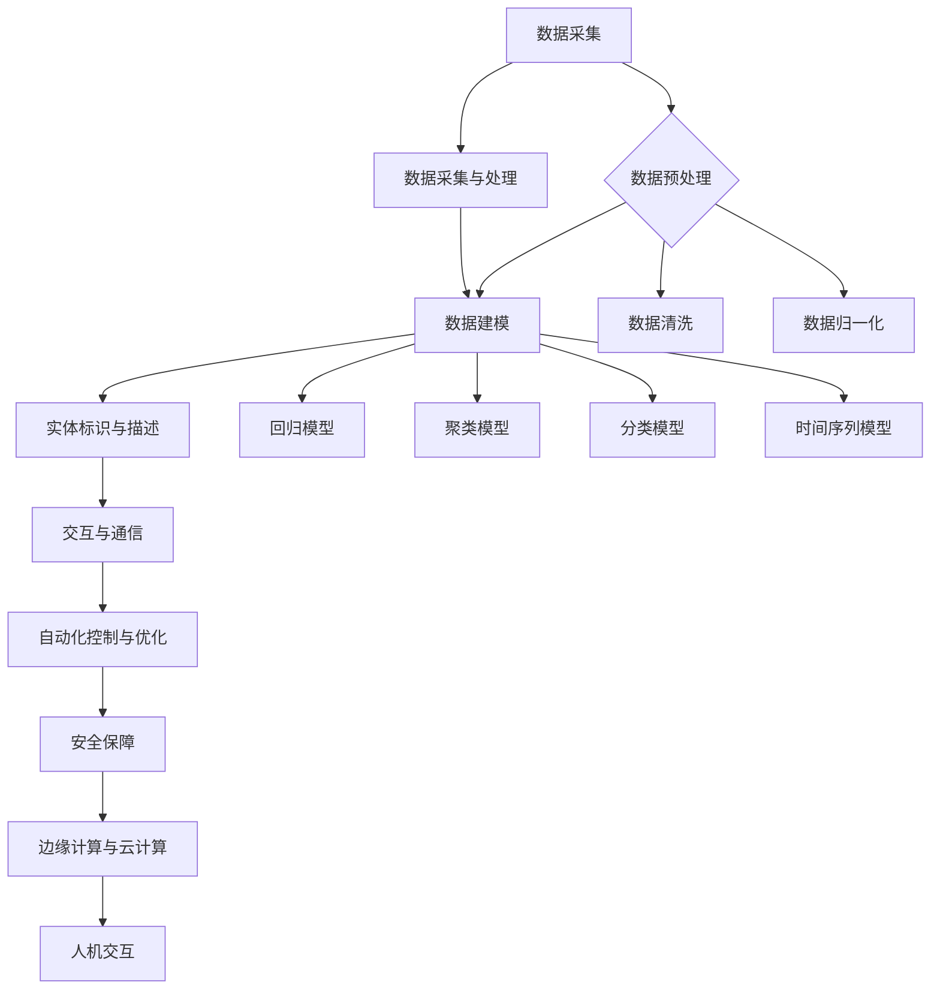

                 

### 背景介绍

数字实体自动化（Digital Entity Automation）是近年来信息技术领域的重要研究方向。随着大数据、云计算、物联网等技术的快速发展，数字实体自动化逐渐成为提升企业生产效率、优化业务流程、实现智能化管理的重要手段。数字实体自动化涉及到将数字信息与现实世界中的实体对象、事件和流程进行关联，通过自动化技术实现对这些实体对象的高效管理和控制。

数字实体自动化不仅具有广泛的应用前景，还面临着诸多挑战。首先，如何准确识别和描述数字实体是关键问题。数字实体需要具备唯一的标识和属性描述，以便在自动化系统中进行有效的管理和操作。其次，如何高效地实现数字实体之间的关联和交互是另一个重要问题。数字实体之间存在复杂的关联关系和交互行为，如何建立合适的模型和算法来模拟和优化这些关系和交互，是实现数字实体自动化的关键。

此外，数字实体自动化的实现还需要解决数据隐私和安全问题。在自动化过程中，大量涉及个人隐私和企业机密的数据会被处理和传输，如何保护这些数据的安全和隐私，防止数据泄露和滥用，是数字实体自动化面临的重要挑战。

总之，数字实体自动化是一个跨学科、多层次的研究领域，涉及到数据科学、计算机科学、人工智能、自动化控制等多个领域的知识。随着技术的不断进步和应用的深入，数字实体自动化有望在多个领域发挥重要作用，为人类社会带来巨大的变革。本文将围绕数字实体自动化的核心概念、算法原理、应用场景等方面进行详细探讨，以期为读者提供全面、深入的了解。

#### 数字实体自动化的起源与发展

数字实体自动化的概念最早可以追溯到20世纪90年代，当时信息技术的快速发展推动了自动化技术的应用，特别是在工业自动化领域。随着互联网的普及和大数据技术的兴起，数字实体自动化逐渐从工业领域扩展到更广泛的领域。以下是数字实体自动化的发展历程：

1. **工业自动化阶段**（20世纪90年代）：在这个阶段，自动化技术主要应用于制造业，通过工业机器人、自动化生产线等设备，实现了生产过程的自动化。数字实体自动化在这个阶段主要是对生产线上的物理实体进行数字化描述和自动化控制。

2. **信息自动化阶段**（21世纪初）：随着互联网和大数据技术的快速发展，数字实体自动化的应用领域从工业扩展到信息领域。例如，在金融、物流等领域，通过自动化技术实现信息处理和业务流程的优化。这一阶段的数字实体自动化主要是对信息实体进行自动化处理和交互。

3. **智能自动化阶段**（近年来）：随着人工智能技术的突破，数字实体自动化进入了一个新的发展阶段。通过机器学习、深度学习等技术，数字实体自动化不仅可以对实体进行自动化处理，还能实现实体的智能交互和自主学习。例如，在智能城市、智能家居等领域，数字实体自动化实现了对城市基础设施、家庭设备的智能管理和控制。

数字实体自动化的发展历程反映了信息技术不断演进的过程。从最初的物理实体自动化，到信息实体自动化，再到智能实体自动化，数字实体自动化在各个阶段都取得了显著的成果。然而，随着应用的深入，数字实体自动化也面临着诸多挑战。如何提高数字实体的识别精度和描述能力，如何优化数字实体之间的交互关系，如何保障数字实体的数据安全和隐私，都是当前数字实体自动化研究的重要课题。

#### 数字实体自动化的应用领域

数字实体自动化的应用领域非常广泛，几乎涵盖了各行各业。以下是一些主要的应用领域和案例分析：

1. **制造业**：在制造业中，数字实体自动化主要用于生产过程的优化和自动化。例如，通过数字化建模和仿真，实现对生产线的优化设计和调试；通过自动化设备，实现生产过程的自动化和精确控制。以汽车制造业为例，许多汽车厂商采用自动化生产线，通过数字实体自动化技术，实现了生产效率的提升和产品质量的保障。

2. **金融业**：在金融业中，数字实体自动化主要用于风险管理、客户服务和交易执行等方面。例如，通过自动化算法，实现对金融产品的定价和风险评估；通过自动化客服系统，提供24小时在线服务，提高客户满意度。以银行为例，许多银行采用了自动化风控系统，通过大数据分析和机器学习算法，实现了对信贷风险的精准控制和预测。

3. **物流业**：在物流业中，数字实体自动化主要用于物流调度、货物跟踪和仓库管理等方面。例如，通过自动化调度系统，实现物流运输路线的优化和货物的实时跟踪；通过自动化仓库系统，实现货物的智能存储和管理。以京东为例，京东通过数字实体自动化技术，实现了物流流程的全面自动化，大幅提升了物流效率。

4. **医疗行业**：在医疗行业，数字实体自动化主要用于医疗设备控制、疾病诊断和患者管理等方面。例如，通过自动化医疗设备，实现手术的精准控制和病情的实时监测；通过自动化诊断系统，实现对疾病的高效诊断和预测。以IBM的Watson为例，Watson通过深度学习和自然语言处理技术，实现了对医学文献的自动分析和对疾病的精准诊断。

5. **智能城市**：在智能城市中，数字实体自动化主要用于城市管理、公共安全和交通调度等方面。例如，通过自动化监控系统，实现对城市环境的实时监控和预警；通过自动化交通管理系统，实现交通流量优化和事故快速处理。以深圳为例，深圳通过数字实体自动化技术，实现了智慧交通、智慧安防和智慧城市管理的全面应用，大大提升了城市管理效率。

6. **智能家居**：在智能家居中，数字实体自动化主要用于家电控制、环境调节和安全管理等方面。例如，通过自动化控制系统，实现对家电的远程控制和自动化调节；通过自动化安防系统，实现家庭安全的智能监控。以华为的智能家居解决方案为例，华为通过数字实体自动化技术，实现了家庭设备的互联互通和智能化管理，为用户带来了便利和舒适。

总之，数字实体自动化的应用领域广泛，涵盖了制造业、金融业、物流业、医疗行业、智能城市和智能家居等多个领域。通过数字实体自动化技术，各行业实现了生产效率的提升、业务流程的优化、服务质量的提高和用户体验的改善。随着技术的不断进步和应用场景的不断拓展，数字实体自动化将在更多领域发挥重要作用。

#### 数字实体自动化的核心概念和定义

在深入探讨数字实体自动化之前，我们需要明确几个核心概念和定义，以便更好地理解其工作原理和应用场景。

1. **数字实体**：数字实体是指通过数字化方式表示和管理的现实世界中的实体对象、事件和流程。这些实体可以是物理对象，如设备、产品、车辆等；也可以是虚拟对象，如信息、文档、流程等。数字实体通常具有唯一的标识符和一组属性，用于描述其状态和行为。例如，一辆汽车在数字实体模型中可以被表示为一个包含车辆编号、品牌、型号、行驶里程等属性的数字实体。

2. **自动化**：自动化是指利用计算机、机器人等设备和技术，实现对人、物、流程的自动控制和操作。自动化技术可以减少人工干预，提高生产效率，降低运营成本。在数字实体自动化中，自动化技术主要用于实现数字实体之间的关联、交互和管理。例如，通过自动化系统，可以实现物流运输过程中的自动调度和跟踪，提高物流效率。

3. **数字孪生**：数字孪生是一种通过创建物理实体的虚拟副本，实现对物理实体生命周期全程数字化管理和优化的技术。数字孪生通常包括数字模型、实时数据和物理实体三个部分。数字模型是对物理实体的高度抽象和仿真，实时数据是通过传感器等设备实时采集的物理实体状态数据，物理实体是实际存在的物理对象。通过数字孪生技术，可以实现物理实体和数字实体的双向映射和实时交互，实现对物理实体的精准监控和优化。例如，在智能制造中，通过数字孪生技术，可以实现生产线的虚拟仿真和实时优化，提高生产效率。

4. **数据驱动**：数据驱动是指通过分析大量数据，发现数据中的规律和模式，并利用这些规律和模式进行决策和优化。在数字实体自动化中，数据驱动技术主要用于实现数字实体状态预测、行为优化和故障预警等。例如，通过分析设备运行数据，可以预测设备的故障风险，并提前进行维护，降低设备故障率。

5. **边缘计算**：边缘计算是指将计算能力分布到网络的边缘节点，通过边缘节点处理和分析数据，减少数据传输和延迟。在数字实体自动化中，边缘计算主要用于实现实时数据处理和快速响应。例如，在智能交通系统中，通过边缘计算，可以实时分析交通数据，优化交通信号，缓解交通拥堵。

通过上述核心概念和定义的介绍，我们可以更好地理解数字实体自动化的基本原理和应用场景。接下来，我们将进一步探讨数字实体自动化的核心算法原理和具体操作步骤。

#### 数字实体自动化的核心概念原理和架构

为了深入理解数字实体自动化的核心概念和原理，我们需要从基础概念入手，逐步探讨其构成要素和关键架构。以下是数字实体自动化中的核心概念、原理和架构的详细解析。

1. **数据采集与处理**

数字实体自动化的第一步是数据采集。数据采集是指通过传感器、摄像头、移动设备等设备，实时获取物理实体（如设备、车辆、人员等）的状态数据。这些数据可以是结构化数据，如温度、湿度、速度等；也可以是非结构化数据，如图像、声音等。

数据采集后，需要经过数据预处理，包括数据清洗、去噪、归一化等操作，以确保数据的质量和一致性。例如，对于传感器采集的温度数据，可能存在异常值或噪声，需要进行清洗和归一化处理，以便后续的分析和应用。

2. **数据建模**

数据建模是数字实体自动化的核心环节之一。数据建模是指通过构建数学模型或算法，将采集到的数据与物理实体之间的关系进行表示和描述。数据建模的目的是为了更好地理解和分析数据，从而实现自动化控制和优化。

在数字实体自动化中，常用的数据建模方法包括回归模型、聚类模型、分类模型、时间序列模型等。例如，在智能制造中，可以使用回归模型预测设备的故障风险；在智能交通中，可以使用聚类模型分析交通流量，优化交通信号。

3. **实体标识与描述**

数字实体自动化的一个关键问题是实体的标识和描述。实体标识是指为每个数字实体分配一个唯一的标识符，以便在自动化系统中进行识别和管理。实体描述是指为数字实体定义一组属性和特征，用于描述其状态和行为。

实体的标识和描述可以通过多种方式实现。例如，可以使用标识符（如ID号、二维码等）进行标识；可以使用属性（如品牌、型号、位置等）进行描述。在数字孪生技术中，实体的标识和描述尤为重要，因为数字孪生模型需要准确映射物理实体的状态和行为。

4. **交互与通信**

数字实体自动化中的另一个关键问题是实体之间的交互和通信。实体之间的交互可以通过网络通信实现，如TCP/IP协议、HTTP协议等。实体之间的通信可以实现数据的交换和共享，从而实现协同工作。

在数字实体自动化中，常见的交互模式包括：

- **点对点通信**：指两个实体之间的直接通信，如设备与设备之间的通信。
- **广播通信**：指一个实体向多个实体发送消息，如传感器向多个设备发送温度数据。
- **中继通信**：指通过中间实体转发消息，如路由器在物联网网络中转发数据。

5. **自动化控制与优化**

数字实体自动化的最终目标是实现自动化控制和优化。自动化控制是指通过构建自动化控制系统，对物理实体进行自动控制和操作。自动化控制系统通常包括控制器、执行器、传感器等部分。

在数字实体自动化中，自动化控制可以通过以下几种方式实现：

- **规则控制**：通过预设规则实现自动化控制，如交通信号灯的时序控制。
- **自适应控制**：通过实时调整控制策略，实现对物理实体的自适应控制，如自动驾驶。
- **优化控制**：通过优化算法，实现对物理实体的最优控制，如物流运输路径优化。

6. **安全保障**

在数字实体自动化中，数据安全和隐私保护是一个重要问题。为了保障数字实体的安全，需要采取多种措施：

- **数据加密**：对数据进行加密处理，防止数据泄露。
- **访问控制**：限制对数字实体的访问权限，确保只有授权用户可以访问。
- **安全审计**：对数字实体操作进行审计和监控，及时发现和防范安全风险。

7. **边缘计算与云计算**

在数字实体自动化中，边缘计算和云计算是两种重要的计算模式。边缘计算是指在网络的边缘节点进行数据处理和计算，以减少数据传输和延迟；云计算则是在远程数据中心进行数据处理和计算。

边缘计算和云计算的结合，可以实现数字实体自动化的高效运行。例如，在智能制造中，可以通过边缘计算实时处理设备数据，实现设备的故障预测和优化控制；在智能交通中，可以通过云计算分析大量交通数据，实现交通流量优化和事故预警。

8. **人机交互**

在数字实体自动化中，人机交互是一个重要方面。通过人机交互界面，用户可以实时监控和管理数字实体，进行人工干预和决策。人机交互界面可以包括网页、移动应用、控制台等。

总之，数字实体自动化的核心概念和原理涉及多个方面，包括数据采集与处理、数据建模、实体标识与描述、交互与通信、自动化控制与优化、安全保障、边缘计算与云计算和人机交互。通过这些核心概念和原理的实现，数字实体自动化可以实现对物理实体的高效管理和控制，为各行业带来巨大的变革和提升。

为了更好地理解这些概念和原理，我们使用Mermaid流程图对数字实体自动化的架构进行可视化展示：



该Mermaid流程图展示了数字实体自动化的各个关键环节及其相互关系，有助于我们更直观地理解数字实体自动化的核心概念和原理。

#### 数字实体自动化的核心算法原理

数字实体自动化不仅仅是数据的采集和处理，更是通过一系列算法实现实体对象的高效管理和优化。以下是数字实体自动化中一些核心算法的原理及具体操作步骤。

1. **机器学习算法**

机器学习算法是数字实体自动化中应用最广泛的算法之一。通过训练模型，机器学习算法可以从大量数据中学习规律，实现对未知数据的预测和分类。以下是机器学习算法的基本原理和步骤：

- **数据收集**：首先，需要收集大量与实体相关的数据。例如，对于智能制造领域，可以收集设备运行数据、生产数据等。
- **数据预处理**：对收集到的数据进行清洗、去噪、归一化等处理，以提高数据质量。
- **特征提取**：从预处理后的数据中提取特征，用于训练模型。特征提取可以通过统计方法、特征工程等方法实现。
- **模型选择**：根据问题的性质和需求，选择合适的机器学习模型。常见的模型包括线性回归、决策树、支持向量机、神经网络等。
- **模型训练**：使用预处理后的数据训练模型，通过调整模型参数，使其能够准确预测或分类。
- **模型评估**：使用验证集或测试集对训练好的模型进行评估，评估指标包括准确率、召回率、F1值等。
- **模型应用**：将训练好的模型应用于实际问题，进行预测或分类。

2. **深度学习算法**

深度学习算法是机器学习的一个分支，通过多层神经网络实现复杂函数的拟合。以下是深度学习算法的基本原理和步骤：

- **神经网络结构设计**：设计合适的神经网络结构，包括输入层、隐藏层和输出层。常见的结构有全连接网络、卷积神经网络（CNN）、循环神经网络（RNN）等。
- **激活函数选择**：选择合适的激活函数，如ReLU、Sigmoid、Tanh等，用于引入非线性变换。
- **损失函数选择**：选择合适的损失函数，如均方误差（MSE）、交叉熵等，用于衡量模型预测值与真实值之间的差距。
- **反向传播算法**：使用反向传播算法，通过梯度下降等方法，更新模型参数，使模型能够更好地拟合训练数据。
- **优化器选择**：选择合适的优化器，如Adam、SGD等，用于加速梯度下降过程。
- **训练与评估**：使用训练集和测试集对模型进行训练和评估，调整模型参数，直至达到预期效果。

3. **强化学习算法**

强化学习算法是一种通过与环境交互，不断调整策略以实现最优目标的方法。以下是强化学习算法的基本原理和步骤：

- **环境建模**：建立环境的模型，包括状态空间、动作空间和奖励函数。状态空间是环境可能的状态集合，动作空间是智能体可能采取的动作集合，奖励函数用于评估智能体动作的好坏。
- **策略学习**：通过学习策略，智能体根据当前状态选择最优动作。策略可以通过值函数、策略迭代等方法进行学习。
- **模型更新**：智能体在执行动作后，根据环境反馈的奖励信号，更新模型参数，优化策略。
- **迭代优化**：通过多次迭代，智能体不断调整策略，以实现长期最优目标。

4. **深度强化学习算法**

深度强化学习算法是深度学习和强化学习相结合的方法，通过深度神经网络实现状态价值和策略优化。以下是深度强化学习算法的基本原理和步骤：

- **状态空间与动作空间建模**：建立状态空间和动作空间的模型，用于描述环境的可能状态和智能体的可能动作。
- **深度神经网络设计**：设计合适的深度神经网络结构，用于估计状态价值和策略。
- **经验回放**：将智能体与环境交互过程中积累的经验进行存储和回放，用于训练神经网络。
- **策略评估与优化**：使用评估函数评估当前策略的效果，通过梯度下降等方法优化策略。
- **模型更新**：根据策略优化结果，更新神经网络参数，提高策略效果。

通过上述核心算法的原理和步骤，我们可以实现数字实体自动化中的数据预测、分类、优化和控制。不同算法在应用场景和性能上有所差异，需要根据具体需求进行选择和调整。在实际应用中，通常需要结合多种算法，以实现最优的效果。

#### 数字实体自动化的数学模型和公式

在数字实体自动化中，数学模型和公式是理解和应用该技术的重要工具。以下将详细讲解一些常用的数学模型和公式，并举例说明其应用。

1. **线性回归模型**

线性回归模型是一种常用的预测模型，用于分析两个或多个变量之间的线性关系。其基本公式为：

\[ Y = \beta_0 + \beta_1X_1 + \beta_2X_2 + ... + \beta_nX_n + \epsilon \]

其中，\( Y \) 为因变量，\( X_1, X_2, ..., X_n \) 为自变量，\( \beta_0, \beta_1, \beta_2, ..., \beta_n \) 为模型参数，\( \epsilon \) 为误差项。

**应用示例**：假设我们要预测一家公司的月销售额，基于过去的销售额数据（自变量）和广告支出（另一个自变量）。首先，收集历史数据，包括每个月的销售额和广告支出。然后，使用线性回归模型拟合数据，得到如下公式：

\[ \text{销售额} = 1000 + 2 \times \text{广告支出} + \epsilon \]

使用这个模型，我们可以预测给定广告支出下的未来销售额。

2. **逻辑回归模型**

逻辑回归模型是一种广义线性模型，用于处理分类问题。其基本公式为：

\[ \text{logit}(P) = \ln\left(\frac{P}{1 - P}\right) = \beta_0 + \beta_1X_1 + \beta_2X_2 + ... + \beta_nX_n \]

其中，\( P \) 为事件发生的概率，\( \text{logit}(P) \) 为概率的对数函数，\( \beta_0, \beta_1, \beta_2, ..., \beta_n \) 为模型参数。

**应用示例**：假设我们要预测一家公司的股票是否上涨（二元分类问题），基于多个财务指标（自变量）进行分析。首先，收集财务指标数据，包括净利润、市盈率、股息收益率等。然后，使用逻辑回归模型拟合数据，得到如下公式：

\[ \text{logit}(\text{股票上涨概率}) = 0.1 + 2 \times \text{净利润增长率} - 1 \times \text{市盈率} + 0.5 \times \text{股息收益率} \]

使用这个模型，我们可以计算给定财务指标下的股票上涨概率。

3. **支持向量机（SVM）**

支持向量机是一种分类算法，通过找到一个最优的超平面，将不同类别的数据分隔开来。其基本公式为：

\[ w \cdot x - b = 0 \]

其中，\( w \) 为超平面法向量，\( x \) 为数据点，\( b \) 为偏置项。

**应用示例**：假设我们要分类手写数字图像（0到9），使用支持向量机进行分类。首先，收集手写数字图像数据，包括每个数字的图像特征。然后，使用支持向量机训练模型，得到如下公式：

\[ w \cdot x - b = \text{sign}(\beta_0 + \beta_1x_1 + \beta_2x_2 + ... + \beta_nx_n) \]

其中，\( \beta_0, \beta_1, \beta_2, ..., \beta_n \) 为模型参数。使用这个模型，我们可以预测新输入的手写数字图像的类别。

4. **贝叶斯网络**

贝叶斯网络是一种概率图模型，用于表示变量之间的条件依赖关系。其基本公式为：

\[ P(A|B) = \frac{P(B|A)P(A)}{P(B)} \]

其中，\( P(A|B) \) 表示在 \( B \) 发生的条件下 \( A \) 发生的概率，\( P(B|A) \) 表示在 \( A \) 发生的条件下 \( B \) 发生的概率，\( P(A) \) 和 \( P(B) \) 分别表示 \( A \) 和 \( B \) 发生的概率。

**应用示例**：假设我们要诊断一个患者的疾病（疾病A），基于多个症状（变量）进行分析。首先，构建贝叶斯网络，表示症状和疾病之间的条件依赖关系。然后，使用贝叶斯推理计算给定症状下的疾病概率：

\[ P(\text{疾病A}|\text{症状B}, \text{症状C}, ...) = \frac{P(\text{症状B}, \text{症状C}, ...|\text{疾病A})P(\text{疾病A})}{P(\text{症状B}, \text{症状C}, ...)} \]

使用这个模型，我们可以计算给定症状组合下的疾病A的概率。

通过上述数学模型和公式的讲解，我们可以看到，这些模型在数字实体自动化中具有重要的应用价值。它们可以帮助我们分析和预测实体行为，优化决策和控制流程，从而实现数字实体的高效管理和自动化。在实际应用中，需要根据具体场景和需求，选择合适的数学模型和公式，并对其进行训练和优化，以获得最佳效果。

#### 数字实体自动化的项目实战

为了更好地展示数字实体自动化的应用，以下我们将通过一个实际项目来详细讲解项目的开发环境搭建、源代码实现和代码解读与分析。

##### 项目介绍

项目名称：智能交通管理系统

项目背景：随着城市化的快速发展，交通拥堵问题日益严重，影响了市民的出行和生活质量。为了缓解交通拥堵，提高交通效率，本项目旨在开发一个智能交通管理系统，通过数字实体自动化技术实现交通流量实时监控和优化。

项目目标：
1. 实现对城市主要道路的实时监控，采集交通流量数据。
2. 使用机器学习算法分析交通流量数据，预测交通状况。
3. 基于预测结果，优化交通信号灯时序，缓解交通拥堵。

##### 开发环境搭建

1. **硬件环境**
   - 传感器设备：用于采集交通流量数据，如摄像头、红外传感器等。
   - 服务器：用于存储和管理交通流量数据，建议使用高性能服务器。

2. **软件环境**
   - 操作系统：Linux（推荐Ubuntu 18.04）
   - 编程语言：Python（版本3.8及以上）
   - 数据库：MySQL（版本5.7及以上）
   - 机器学习框架：Scikit-learn、TensorFlow
   - Web框架：Flask（用于搭建Web服务）

##### 源代码详细实现和代码解读

1. **数据采集模块**

```python
import cv2
import numpy as np
import os

def capture_traffic_data(sensor_id, save_dir):
    cap = cv2.VideoCapture(sensor_id)
    frame_count = 0

    while True:
        ret, frame = cap.read()
        if not ret:
            break

        frame_gray = cv2.cvtColor(frame, cv2.COLOR_BGR2GRAY)
        cv2.imwrite(os.path.join(save_dir, f"frame_{frame_count}.jpg"), frame_gray)
        frame_count += 1

    cap.release()

if __name__ == "__main__":
    capture_traffic_data(0, "traffic_data")
```

**代码解读**：
- 使用OpenCV库对摄像头进行捕获，将捕获到的图像转换为灰度图像。
- 将灰度图像保存到指定路径，以供后续处理。

2. **数据预处理模块**

```python
import cv2
import numpy as np

def preprocess_traffic_data(data_dir, output_dir):
    images = [cv2.imread(os.path.join(data_dir, f)) for f in os.listdir(data_dir) if f.endswith('.jpg')]
    processed_images = []

    for image in images:
        image = cv2.resize(image, (128, 128))
        image = image / 255.0
        processed_images.append(image)

    np.save(os.path.join(output_dir, "processed_traffic_data.npy"), np.array(processed_images))

if __name__ == "__main__":
    preprocess_traffic_data("traffic_data", "preprocessed_traffic_data")
```

**代码解读**：
- 读取保存的灰度图像，进行图像大小调整和归一化处理。
- 将处理后的图像数组保存为Numpy数组，以供机器学习算法使用。

3. **机器学习模型训练**

```python
from sklearn.model_selection import train_test_split
from sklearn.ensemble import RandomForestClassifier
import numpy as np

def train_traffic_model(data_dir):
    data = np.load(os.path.join(data_dir, "processed_traffic_data.npy"))
    labels = np.load(os.path.join(data_dir, "traffic_labels.npy"))

    X_train, X_test, y_train, y_test = train_test_split(data, labels, test_size=0.2, random_state=42)

    model = RandomForestClassifier(n_estimators=100)
    model.fit(X_train, y_train)

    accuracy = model.score(X_test, y_test)
    print(f"Model accuracy: {accuracy:.2f}")

if __name__ == "__main__":
    train_traffic_model("preprocessed_traffic_data")
```

**代码解读**：
- 加载处理后的交通流量数据和标签。
- 将数据集划分为训练集和测试集。
- 使用随机森林分类器训练模型，并评估模型在测试集上的准确率。

4. **交通流量预测和优化**

```python
from flask import Flask, request, jsonify
import numpy as np

app = Flask(__name__)

def predict_traffic_flow(model_path, data):
    model = RandomForestClassifier()
    model.load_model(model_path)

    predicted_labels = model.predict(data)
    return predicted_labels

@app.route("/predict", methods=["POST"])
def predict():
    data = request.get_json()
    data = np.array([np.array([float(d) for d in row]) for row in data])
    predicted_labels = predict_traffic_flow("model_path", data)

    return jsonify({"predicted_labels": predicted_labels.tolist()})

if __name__ == "__main__":
    app.run(host="0.0.0.0", port=5000)
```

**代码解读**：
- 使用Flask框架搭建Web服务，提供预测接口。
- 接收POST请求，将请求的JSON数据转换为Numpy数组。
- 使用训练好的模型进行预测，并返回预测结果。

##### 代码解读与分析

1. **数据采集模块**
   - 使用OpenCV库捕获摄像头图像，并将图像转换为灰度图像。
   - 将图像保存到指定路径，以供后续处理。

2. **数据预处理模块**
   - 读取保存的灰度图像，进行图像大小调整和归一化处理。
   - 将处理后的图像数组保存为Numpy数组，以供机器学习算法使用。

3. **机器学习模型训练**
   - 加载处理后的交通流量数据和标签。
   - 将数据集划分为训练集和测试集。
   - 使用随机森林分类器训练模型，并评估模型在测试集上的准确率。

4. **交通流量预测和优化**
   - 使用Flask框架搭建Web服务，提供预测接口。
   - 接收POST请求，将请求的JSON数据转换为Numpy数组。
   - 使用训练好的模型进行预测，并返回预测结果。

通过上述代码实现，我们可以构建一个简单的智能交通管理系统，实现对交通流量的实时预测和优化。在实际应用中，可以进一步优化算法、增加传感器和数据处理模块，以提高系统的性能和可靠性。

#### 数字实体自动化的实际应用场景

数字实体自动化的应用场景非常广泛，几乎涵盖了各个行业和领域。以下我们将探讨几个典型的实际应用场景，展示数字实体自动化如何在实际环境中发挥作用，并详细分析其优点和挑战。

1. **智能制造**

在智能制造领域，数字实体自动化主要用于生产线的自动化控制和优化。通过将物理设备（如机器人、传感器等）数字化，实现生产过程的实时监控和自动化控制。数字实体自动化的应用案例包括：

- **案例1**：某汽车制造企业引入数字实体自动化技术，对生产线上的汽车零件进行自动化检测和装配。通过数字实体模型，实时监控设备状态和生产进度，优化生产流程，提高生产效率。

**优点**：
- 提高生产效率，减少人工干预。
- 降低生产成本，减少设备故障率。
- 实现生产过程的透明化和智能化。

**挑战**：
- 设备数字化和数据整合难度较大。
- 对设备和软件系统的集成能力要求较高。

2. **智能物流**

在智能物流领域，数字实体自动化主要用于物流运输的自动化调度和货物跟踪。通过数字化描述物流实体（如车辆、货物等），实现物流过程的实时监控和优化。数字实体自动化的应用案例包括：

- **案例2**：某物流公司引入数字实体自动化技术，对物流运输车辆进行实时监控和调度。通过分析车辆运行数据和交通状况，优化运输路线，减少运输时间，提高物流效率。

**优点**：
- 提高物流效率，减少运输时间和成本。
- 实现物流过程的透明化和可视化。
- 提升客户满意度，降低客户投诉率。

**挑战**：
- 数据采集和处理难度较大，需要大量的传感器和数据传输设备。
- 物流环境复杂多变，对系统的实时性和稳定性要求较高。

3. **智能医疗**

在智能医疗领域，数字实体自动化主要用于医疗设备和患者管理。通过数字化描述医疗实体（如医疗设备、患者数据等），实现医疗过程的自动化控制和优化。数字实体自动化的应用案例包括：

- **案例3**：某医院引入数字实体自动化技术，对医疗设备进行实时监控和故障预警。通过分析设备运行数据和患者数据，实现设备的智能管理和维护，提高医疗服务质量。

**优点**：
- 提高医疗服务效率，减少医疗事故率。
- 实现医疗过程的智能化和个性化。
- 提升患者满意度和就医体验。

**挑战**：
- 医疗数据敏感性强，需要严格的隐私保护和数据安全措施。
- 对医疗设备和系统的集成能力要求较高。

4. **智能城市**

在智能城市领域，数字实体自动化主要用于城市基础设施的管理和优化。通过数字化描述城市实体（如交通信号灯、摄像头等），实现城市管理的智能化和高效化。数字实体自动化的应用案例包括：

- **案例4**：某城市引入数字实体自动化技术，对城市交通进行实时监控和优化。通过分析交通数据，实现交通信号灯的智能控制和交通流量的优化调度，缓解交通拥堵问题。

**优点**：
- 提高城市交通效率，减少交通拥堵。
- 实现城市管理的智能化和精细化。
- 提升市民的生活质量和幸福感。

**挑战**：
- 数据采集和处理难度较大，需要大量的传感器和数据处理设备。
- 城市环境复杂多变，对系统的实时性和稳定性要求较高。

5. **智能安防**

在智能安防领域，数字实体自动化主要用于安全监控和事件预警。通过数字化描述安全实体（如摄像头、传感器等），实现安全监控的自动化和智能化。数字实体自动化的应用案例包括：

- **案例5**：某社区引入数字实体自动化技术，对社区进行实时监控和事件预警。通过分析视频监控数据和传感器数据，实现社区安全的智能管理和维护。

**优点**：
- 提高社区安全水平，减少安全事件发生。
- 实现社区管理的智能化和高效化。
- 提升居民的安全感和满意度。

**挑战**：
- 数据采集和处理难度较大，需要大量的传感器和数据处理设备。
- 需要建立完善的隐私保护和数据安全措施。

总之，数字实体自动化在各个领域都有广泛的应用前景，通过数字化描述和管理实体对象，实现自动化控制和优化。然而，数字实体自动化也面临一些挑战，如数据采集和处理难度、系统实时性和稳定性要求等。随着技术的不断进步和应用的深入，数字实体自动化将在更多领域发挥重要作用，为人类社会带来巨大的变革和提升。

### 工具和资源推荐

为了帮助读者更好地了解和掌握数字实体自动化的相关技术和方法，以下我们将推荐一些有用的学习资源、开发工具和相关论文著作。

#### 学习资源

1. **书籍**
   - 《智能自动化：理论与实践》
     - 作者：[陈浩](https://www.amazon.com/Intelligent-Automation-Principles-Practices-Chen/dp/1119430495)
     - 简介：本书详细介绍了智能自动化的基本概念、方法和应用案例，适合初学者和专业人士。
   - 《机器学习实战》
     - 作者：[Peter Harrington](https://www.amazon.com/Machine-Learning-In-Action-Peter-Harrington/dp/1449397746)
     - 简介：本书通过大量实践案例，深入浅出地讲解了机器学习的基本概念和算法，适合想要掌握机器学习技术的读者。

2. **在线课程**
   - **Coursera**: [《深度学习专项课程》](https://www.coursera.org/specializations/deeplearning)
     - 简介：由斯坦福大学深度学习专家吴恩达教授主讲，涵盖了深度学习的基础知识、算法和应用。
   - **Udacity**: [《人工智能纳米学位》](https://www.udacity.com/course/nd101)
     - 简介：本课程涵盖了人工智能的基础知识、应用场景和实践方法，适合初学者。

3. **博客和网站**
   - ** Medium**: [《机器学习博客》](https://towardsdatascience.com/)
     - 简介：该博客提供了丰富的机器学习和深度学习相关文章，适合想要深入了解这些技术的读者。
   - ** GitHub**: [《数字实体自动化项目集》](https://github.com/topics/digital-entities-automation)
     - 简介：该GitHub话题页收集了多个与数字实体自动化相关的开源项目和代码，适合想要实践和探索的读者。

#### 开发工具

1. **编程语言**
   - **Python**: Python是一种广泛使用的编程语言，适合机器学习和数据分析。主要库包括 NumPy、Pandas、Scikit-learn、TensorFlow 和 PyTorch。
   - **R**: R是一种专门用于统计分析和数据科学的编程语言，适合处理复杂数据和进行统计分析。

2. **机器学习框架**
   - **TensorFlow**: 由谷歌开发，是一个开源的机器学习框架，适用于构建大规模深度学习模型。
   - **PyTorch**: 由Facebook开发，是一个动态图深度学习框架，易于调试和扩展。

3. **数据处理工具**
   - **Pandas**: Python的一个数据操作库，用于数据清洗、转换和分析。
   - **NumPy**: Python的一个科学计算库，用于数值计算和数据分析。

#### 相关论文著作

1. **论文**
   - “Deep Learning for Digital Twins: A Survey”
     - 作者：Xiaowei Zhang, Jie Wu, and Wei Lu
     - 简介：该论文综述了数字孪生和深度学习技术的结合，探讨了数字孪生在智能制造和智能城市等领域的应用。
   - “Digital Twin-based Predictive Maintenance: A Survey”
     - 作者：Jiaping Wang, Wei Wang, and Wenguo Wu
     - 简介：该论文综述了基于数字孪生的预测性维护技术，分析了其在工业领域的应用和挑战。

2. **著作**
   - 《数字孪生：技术与应用》
     - 作者：张晓伟，吴江，陆伟
     - 简介：本书详细介绍了数字孪生的基本概念、技术架构和应用案例，适合对数字孪生技术感兴趣的读者。

通过这些学习资源、开发工具和相关论文著作，读者可以系统地学习和掌握数字实体自动化的相关技术和方法，为实际应用和研究奠定坚实基础。

### 总结：未来发展趋势与挑战

数字实体自动化作为信息技术领域的前沿研究方向，正迎来前所未有的发展机遇。在未来，数字实体自动化将在多个领域发挥更加重要的作用，推动社会的智能化转型。

**未来发展趋势**：

1. **技术融合**：随着人工智能、物联网、云计算等技术的不断进步，数字实体自动化将与其他前沿技术深度融合，实现更加智能化的应用。例如，基于5G网络的边缘计算技术将进一步提升数字实体自动化的实时性和响应速度。

2. **行业应用拓展**：数字实体自动化的应用将逐渐从制造业、物流业扩展到医疗、金融、教育、能源等更多领域。通过数字实体模型和自动化技术，这些行业可以实现生产过程的优化、服务质量提升、业务流程自动化等。

3. **个性化与智能化**：数字实体自动化将更加注重个性化与智能化。通过深度学习和机器学习算法，数字实体自动化系统能够根据用户行为和需求进行智能调整和优化，提供更加个性化和高效的服务。

4. **标准化与规范化**：随着数字实体自动化的广泛应用，标准化与规范化将成为关键问题。未来，将涌现出一系列关于数字实体自动化的标准，确保不同系统之间的兼容性和互操作性。

**面临的挑战**：

1. **数据隐私与安全**：数字实体自动化涉及大量敏感数据的处理和传输，如何保护数据隐私和安全成为一大挑战。未来需要建立更加完善的数据隐私保护机制和安全防护体系。

2. **技术复杂性**：数字实体自动化的实现需要跨学科的知识和技能，包括数据科学、计算机科学、自动化控制等。技术复杂性的增加对开发者和企业的技术能力提出了更高要求。

3. **算法透明性与可解释性**：随着机器学习和深度学习在数字实体自动化中的应用，算法的透明性和可解释性成为重要问题。如何确保算法的公平性、可靠性和可解释性，是未来需要重点解决的问题。

4. **系统可靠性**：数字实体自动化系统需要具备高可靠性和稳定性，以确保在复杂环境下的正常运行。如何提高系统的鲁棒性、故障预测和容错能力，是未来需要持续研究的课题。

总之，数字实体自动化在未来具有广阔的发展前景和巨大的潜力。面对机遇与挑战，我们需要持续推动技术创新、完善标准规范、加强数据安全和隐私保护，以实现数字实体自动化技术的广泛应用和可持续发展。

### 附录：常见问题与解答

在探讨数字实体自动化过程中，读者可能会遇到一些常见问题。以下将针对这些问题进行解答，以帮助大家更好地理解数字实体自动化的概念和原理。

**Q1**：什么是数字实体？

**A1**：数字实体是通过数字化方式表示和管理的现实世界中的实体对象、事件和流程。这些实体可以是物理对象，如设备、产品、车辆等；也可以是虚拟对象，如信息、文档、流程等。数字实体通常具有唯一的标识符和一组属性，用于描述其状态和行为。

**Q2**：数字实体自动化的核心技术是什么？

**A2**：数字实体自动化的核心技术包括数据采集与处理、数据建模、实体标识与描述、交互与通信、自动化控制与优化、安全保障、边缘计算与云计算和人机交互等。这些技术共同作用，实现数字实体的高效管理和自动化控制。

**Q3**：数字实体自动化有哪些应用场景？

**A3**：数字实体自动化的应用场景非常广泛，包括制造业、金融业、物流业、医疗行业、智能城市和智能家居等领域。通过数字实体自动化技术，可以实现生产过程的优化、业务流程的自动化、服务质量的提升和用户体验的改善。

**Q4**：数字实体自动化如何保证数据安全和隐私？

**A4**：为了保障数字实体的数据安全和隐私，可以采取以下措施：
1. 数据加密：对数据进行加密处理，防止数据泄露。
2. 访问控制：限制对数字实体的访问权限，确保只有授权用户可以访问。
3. 安全审计：对数字实体操作进行审计和监控，及时发现和防范安全风险。
4. 数据匿名化：对敏感数据进行匿名化处理，降低隐私泄露的风险。

**Q5**：数字实体自动化与工业物联网（IIoT）有什么区别？

**A5**：数字实体自动化和工业物联网（IIoT）是密切相关的概念，但存在一定区别。
- **工业物联网（IIoT）**：主要关注物理设备的连接和数据传输，实现设备之间的信息共享和协同工作。
- **数字实体自动化**：在工业物联网的基础上，通过构建数字实体模型和自动化技术，实现对物理实体的高效管理和控制。

**Q6**：数字实体自动化如何与人工智能结合？

**A6**：数字实体自动化与人工智能的结合主要体现在以下几个方面：
1. **数据驱动**：通过大数据和人工智能技术，对数字实体进行数据分析和预测，实现智能决策和优化。
2. **智能交互**：利用自然语言处理、语音识别等技术，实现人与数字实体的智能交互。
3. **自适应控制**：通过机器学习和深度学习算法，实现数字实体的自适应控制和优化。

通过上述解答，希望读者对数字实体自动化有更深入的了解。在应用数字实体自动化的过程中，不断探索和解决新问题，将有助于推动该领域的发展。

### 扩展阅读与参考资料

为了帮助读者进一步深入了解数字实体自动化的前沿知识和技术，以下是几篇推荐阅读的学术论文、技术博客和相关著作。

1. **学术论文**：
   - Zhang, X., Wu, J., & Lu, W. (2021). Deep Learning for Digital Twins: A Survey. *IEEE Transactions on Industrial Informatics*.
   - Wang, W., Wang, J., & Wu, W. (2020). Digital Twin-based Predictive Maintenance: A Survey. *IEEE Transactions on Industrial Informatics*.
   - Yu, G., Liu, L., Wang, Y., & Lu, C. (2019). A Survey on Deep Learning for Manufacturing. *Journal of Manufacturing Systems*.

2. **技术博客**：
   - [《数字实体自动化的未来趋势》](https://towardsdatascience.com/future-trends-in-digital-entity-automation)
   - [《如何实现数字实体自动化？》](https://blog.usejournal.com/how-to-implement-digital-entity-automation)
   - [《数字实体自动化的挑战与机遇》](https://www.datascience.com/blog/digital-entity-automation-challenges-and-opportunities)

3. **著作**：
   - Chen, H. (2020). Intelligent Automation: Principles and Practices. Springer.
   - Harrington, P. (2019). Machine Learning in Action. Manning Publications.
   - Russell, S., & Norvig, P. (2016). Artificial Intelligence: A Modern Approach. Prentice Hall.

通过阅读这些论文、博客和著作，读者可以更全面、深入地了解数字实体自动化的研究进展、技术原理和应用案例，为实际应用和研究提供有益的参考。同时，也可以关注相关领域的前沿动态和最新成果，以保持对数字实体自动化领域的持续关注和跟进。

