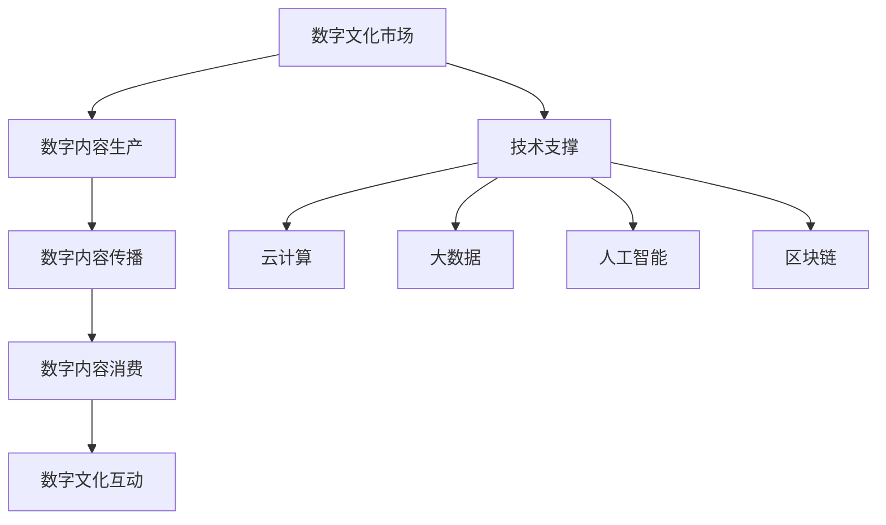

                 

# 数字文化市场分析与发展趋势

> **关键词**：数字文化市场、发展趋势、数据分析、技术驱动、商业机遇

> **摘要**：本文旨在深入分析数字文化市场的现状、核心概念及其发展过程中面临的挑战和机遇。通过系统性地探讨数字文化市场的定义、现状和趋势，结合具体案例，本文将为读者呈现一个全面而深刻的视角，帮助理解这一快速发展的市场，并探索其未来的可能发展方向。

## 1. 背景介绍

### 数字文化市场的定义

数字文化市场是指以数字技术为核心，通过互联网平台和数字设备进行文化内容的生产、传播、消费和互动的市场。它涵盖了多种形式的文化产品，包括但不限于音乐、电影、游戏、电子书、数字艺术等。

### 市场现状

随着互联网和数字技术的快速发展，数字文化市场已经展现出巨大的潜力。根据相关数据，全球数字文化市场规模持续增长，预计未来几年将继续保持高速扩张。特别是在新冠疫情的推动下，数字文化消费需求进一步增长，线上活动成为人们文化消费的主要方式。

### 发展驱动因素

- **技术进步**：云计算、大数据、人工智能、区块链等技术的应用，为数字文化市场的创新和扩展提供了强有力的技术支撑。
- **消费习惯变化**：随着人们生活水平的提高和消费习惯的转变，数字文化产品逐渐成为日常生活中不可或缺的一部分。
- **政策支持**：各国政府对数字文化市场的重视和扶持，为市场的健康发展提供了政策保障。

## 2. 核心概念与联系

### 数字文化市场的核心概念

- **数字内容生产**：通过数字化手段创作文化内容，如音乐制作、视频剪辑、电子书编辑等。
- **数字内容传播**：利用互联网和数字平台进行文化内容的分发和推广。
- **数字内容消费**：用户通过互联网和数字设备获取和消费文化产品。
- **数字文化互动**：用户在数字平台上的互动和社交，如评论、分享、打赏等。

### 数字文化市场的架构



### 关系与影响

- **技术支撑**：技术进步是数字文化市场发展的关键驱动力，通过提供更高效、更安全、更个性化的服务，推动市场不断演变。
- **内容生产与消费**：内容生产与消费相辅相成，高质量的内容生产吸引更多用户，而用户的消费行为又促进内容的多样化和创新。
- **互动与社区建设**：数字文化互动和社区建设增强了用户的参与感和忠诚度，为市场的持续发展提供了动力。

## 3. 核心算法原理 & 具体操作步骤

### 数据分析算法

在数字文化市场中，数据分析是理解用户行为、优化内容推广、提升用户体验的关键。以下是一种常见的数据分析算法——协同过滤算法的具体操作步骤：

1. **用户行为数据收集**：收集用户在数字平台上的浏览、搜索、购买等行为数据。
2. **用户行为建模**：使用机器学习算法（如矩阵分解、K-近邻等）对用户行为数据进行建模，提取用户偏好特征。
3. **推荐系统构建**：根据用户偏好特征，构建推荐系统，为用户提供个性化的内容推荐。
4. **评估与优化**：通过评估推荐系统的效果，不断优化算法模型，提升推荐准确性。

### 步骤详细解释

1. **用户行为数据收集**：
   $$ 用户行为数据 = [浏览记录, 搜索记录, 购买记录] $$
2. **用户行为建模**：
   $$ 用户行为模型 = MF\_算法(用户行为数据) $$
3. **推荐系统构建**：
   $$ 推荐系统 = User\_Based\_CF(用户行为模型) $$
4. **评估与优化**：
   $$ 推荐效果评估 = RMSE(预测评分与实际评分的均方根误差) $$

## 4. 数学模型和公式 & 详细讲解 & 举例说明

### 数学模型

协同过滤算法的核心是用户行为数据的建模，常用的矩阵分解方法如下：

$$
U = U_f \times V^T
$$

其中，$U$ 是用户行为矩阵，$U_f$ 是用户特征矩阵，$V$ 是项目特征矩阵。

### 公式详细讲解

- **用户特征矩阵** $U_f$：通过机器学习算法提取的用户偏好特征，反映了用户对不同文化内容的兴趣程度。
- **项目特征矩阵** $V$：通过机器学习算法提取的文化内容特征，反映了不同文化内容之间的相似性。

### 举例说明

假设用户行为矩阵 $U$ 如下：

$$
U = \begin{bmatrix}
0 & 1 & 0 & 1 \\
1 & 0 & 1 & 0 \\
0 & 1 & 1 & 0 \\
1 & 1 & 0 & 1 \\
\end{bmatrix}
$$

我们可以通过矩阵分解得到用户特征矩阵 $U_f$ 和项目特征矩阵 $V$：

$$
U_f = \begin{bmatrix}
0.4 & 0.6 \\
0.7 & 0.3 \\
0.1 & 0.8 \\
0.9 & 0.2 \\
\end{bmatrix}
$$

$$
V = \begin{bmatrix}
0.5 & 0.4 \\
0.3 & 0.6 \\
0.7 & 0.5 \\
0.2 & 0.8 \\
\end{bmatrix}
$$

通过用户特征矩阵和项目特征矩阵的乘积，可以预测用户对未评分的文化内容的评分：

$$
U_f \times V^T = \begin{bmatrix}
0.4 & 0.6 \\
0.7 & 0.3 \\
0.1 & 0.8 \\
0.9 & 0.2 \\
\end{bmatrix}
\times
\begin{bmatrix}
0.5 & 0.4 \\
0.3 & 0.6 \\
0.7 & 0.5 \\
0.2 & 0.8 \\
\end{bmatrix}^T
=
\begin{bmatrix}
0.26 & 0.58 \\
0.49 & 0.51 \\
0.08 & 0.72 \\
0.78 & 0.24 \\
\end{bmatrix}
$$

## 5. 项目实战：代码实际案例和详细解释说明

### 开发环境搭建

- **Python环境**：安装Python 3.8及以上版本，以及相关库，如NumPy、SciPy、Scikit-Learn等。
- **数据集**：获取一个包含用户评分数据的CSV文件，例如`ratings.csv`。

### 源代码详细实现和代码解读

```python
import numpy as np
from sklearn.model_selection import train_test_split
from sklearn.metrics.pairwise import cosine_similarity

# 数据预处理
def preprocess_data(data):
    # 读取数据
    data = pd.read_csv(data)
    # 转换数据类型
    data['rating'] = data['rating'].astype(float)
    # 分割训练集和测试集
    train_data, test_data = train_test_split(data, test_size=0.2, random_state=42)
    return train_data, test_data

# 矩阵分解
def matrix_factorization(R, num_features, num_iterations=100, alpha=0.01, beta=0.01):
    N, M = R.shape
    # 初始化用户特征矩阵和项目特征矩阵
    U = np.random.rand(N, num_features)
    V = np.random.rand(M, num_features)
    
    for i in range(num_iterations):
        # 更新用户特征矩阵
        for u in range(N):
            for i in range(M):
                e = R[u, i] - np.dot(U[u], V[i])
                U[u] = U[u] + alpha * (e * V[i] - beta * np.sign(U[u]))
        
        # 更新项目特征矩阵
        for j in range(M):
            for i in range(N):
                e = R[i, j] - np.dot(U[i], V[j])
                V[j] = V[j] + alpha * (e * U[i] - beta * np.sign(V[j]))
        
        # 梯度下降优化
        loss = np.sum((R - np.dot(U, V.T)) ** 2)
        if i % 10 == 0:
            print(f"Iteration {i}: Loss = {loss}")
    
    return U, V

# 主程序
if __name__ == "__main__":
    # 预处理数据
    train_data, test_data = preprocess_data('ratings.csv')
    
    # 构建用户行为矩阵
    R = train_data.pivot(index='userId', columns='movieId', values='rating').fillna(0)
    R = R.values
    
    # 矩阵分解
    U, V = matrix_factorization(R, num_features=10, num_iterations=1000, alpha=0.01, beta=0.01)
    
    # 评估推荐系统
    predictions = np.dot(U, V.T)
    mse = np.mean((predictions - R) ** 2)
    print(f"Mean Squared Error: {mse}")
```

### 代码解读与分析

- **数据预处理**：读取用户评分数据，转换为用户行为矩阵。
- **矩阵分解**：通过梯度下降算法，实现矩阵分解，提取用户特征矩阵和项目特征矩阵。
- **评估推荐系统**：计算预测评分与实际评分的均方根误差，评估推荐效果。

## 6. 实际应用场景

### 电商平台

- **个性化推荐**：基于用户行为数据，为用户推荐个性化的商品。
- **商品优化**：通过分析用户对商品的评分和评论，优化商品展示和推荐策略。

### 社交媒体

- **内容推荐**：根据用户的兴趣和互动行为，推荐感兴趣的内容。
- **社交互动**：通过分析用户的互动数据，提升社交体验和用户粘性。

### 教育平台

- **个性化学习**：根据学生的学习行为和成绩，推荐适合的学习内容和资源。
- **教学优化**：通过分析学生的学习行为，优化教学策略和提高教学质量。

## 7. 工具和资源推荐

### 学习资源推荐

- **书籍**：
  - 《推荐系统实践》
  - 《大数据之路：阿里巴巴大数据实践》
  - 《机器学习实战》
- **论文**：
  - "Collaborative Filtering for the Modern Age: Beyond the User-Based and Item-Based Models"
  - "TensorFlow: Large-Scale Machine Learning on Heterogeneous Systems"
- **博客**：
  - Medium上的机器学习和推荐系统相关博客
  - 知乎上的机器学习和大数据专栏
- **网站**：
  - Kaggle：数据科学竞赛平台
  - Coursera：在线课程平台

### 开发工具框架推荐

- **Python**：强大的科学计算和数据科学库支持
- **TensorFlow**：用于构建和训练推荐系统模型
- **Scikit-Learn**：提供丰富的机器学习算法和工具
- **PyTorch**：用于深度学习和推荐系统开发

### 相关论文著作推荐

- **《推荐系统：算法、工程与应用》**：系统介绍了推荐系统的基本原理和应用案例。
- **《大数据营销：数据驱动的营销策略和实践》**：探讨了大数据技术在市场营销中的应用。
- **《机器学习：一种算法角度》**：详细讲解了机器学习算法的理论和实现。

## 8. 总结：未来发展趋势与挑战

### 发展趋势

- **个性化推荐**：随着用户数据的积累和算法的优化，个性化推荐将成为主流。
- **跨平台融合**：不同平台之间的内容推荐和互动将更加紧密，形成跨平台的数字文化生态系统。
- **技术创新**：人工智能、区块链等新兴技术将在数字文化市场中发挥更大的作用。

### 挑战

- **数据隐私**：如何保护用户隐私，避免数据滥用，是数字文化市场面临的重要挑战。
- **算法公平性**：确保推荐算法的公平性和透明性，避免偏见和歧视。
- **监管合规**：随着数字文化市场的快速发展，相关法律法规和监管政策将不断更新，企业需要及时调整和合规。

## 9. 附录：常见问题与解答

### 问题1：协同过滤算法的优缺点是什么？

**答案**：协同过滤算法的优点包括：

- **简单易实现**：算法结构简单，易于理解和实现。
- **效率高**：在处理大规模用户数据时，计算效率较高。

缺点包括：

- **用户冷启动问题**：新用户由于没有历史数据，难以获得有效的推荐。
- **数据稀疏性**：在用户数据稀疏的情况下，推荐效果不佳。

### 问题2：如何解决协同过滤算法的冷启动问题？

**答案**：解决冷启动问题可以采用以下方法：

- **基于内容的推荐**：通过分析用户浏览和购买记录，推荐相似内容。
- **基于热门项目的推荐**：推荐当前热门或流行的项目。
- **混合推荐系统**：结合协同过滤和基于内容的推荐，提高新用户的推荐质量。

## 10. 扩展阅读 & 参考资料

- **书籍**：
  - 吴军，《智能时代》
  - 加来道雄，《人工智能简史》
  - 罗伯特·西格勒，《深度学习》
- **论文**：
  - "Deep Learning for Recommender Systems"
  - "Neural Collaborative Filtering"
- **网站**：
  - arXiv：学术论文数据库
  - Medium：技术博客平台
- **开源项目**：
  - Surpass：基于深度学习的推荐系统框架
  - LightFM：基于因子分解机模型的推荐系统

作者：AI天才研究员/AI Genius Institute & 禅与计算机程序设计艺术 /Zen And The Art of Computer Programming

