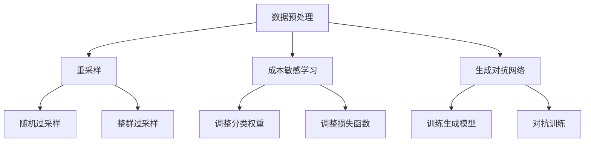

                 

# 数据不平衡问题，软件2.0需要新招数

## 关键词
- 数据不平衡
- 软件工程
- 算法优化
- AI 应用
- 机器学习

## 摘要
本文将深入探讨数据不平衡问题在软件工程中的挑战，以及如何运用先进的算法和技术来应对这一难题。通过分析数据不平衡的概念、原因及其对模型性能的影响，本文将介绍一系列解决策略，包括重采样、成本敏感学习、生成对抗网络等。此外，文章还将探讨这些策略在实际应用中的效果和适用场景，并提出未来研究的方向和挑战。

## 1. 背景介绍

在当今的数字化时代，数据已经成为企业和社会的核心资产。随着大数据技术的发展，机器学习和人工智能在各个领域得到了广泛应用。然而，在实际应用中，数据不平衡（imbalanced data）问题常常成为制约模型性能和准确率的瓶颈。

数据不平衡指的是数据集中不同类别或标签的数据分布不均衡，例如，在分类问题中，一个类别可能占据了绝大多数的数据，而其他类别则非常稀少。这种情况在金融欺诈检测、医学诊断、欺诈检测等场景中尤为常见。

数据不平衡对模型性能的影响主要体现在两个方面：首先，模型倾向于过度拟合主流类别，从而忽视少数类别；其次，模型对于少数类别的预测能力较低，导致整体准确率下降。因此，解决数据不平衡问题对于提升模型性能至关重要。

## 2. 核心概念与联系

### 2.1 数据不平衡的概念

数据不平衡是指数据集中某些类别或标签的数据数量远远大于其他类别或标签，导致数据分布不均匀。具体来说，数据不平衡可以分为以下几种类型：

- **类不平衡（Class Imbalance）**：不同类别之间的数量差异。
- **样本不平衡（Sample Imbalance）**：同一类别内的样本数量差异。
- **标签不平衡（Label Imbalance）**：标签数据分布不均匀。

### 2.2 数据不平衡的原因

数据不平衡的原因多种多样，主要包括以下几点：

- **数据采集过程**：在某些应用场景中，某些类别的事件或现象发生的频率远高于其他类别，导致数据分布不均。
- **数据预处理**：在数据预处理过程中，可能会丢失或删除某些类别或标签的数据。
- **模型选择**：某些模型对数据分布敏感，例如基于决策树的模型，容易受到数据不平衡的影响。

### 2.3 数据不平衡的影响

数据不平衡对模型性能的影响主要表现在以下几个方面：

- **准确率下降**：模型倾向于预测主流类别，导致准确率下降。
- **召回率下降**：对于少数类别，模型的预测能力较低，导致召回率下降。
- **F1-Score下降**：F1-Score作为准确率和召回率的平衡指标，也会受到数据不平衡的影响。

### 2.4 数据不平衡与模型性能的关联

数据不平衡与模型性能之间的关系可以理解为两个方面：

- **负面影响**：数据不平衡会导致模型对少数类别的预测能力下降，从而影响整体性能。
- **积极作用**：通过合理的算法和技术，可以有效缓解数据不平衡带来的负面影响，提升模型性能。

## 2.5 数据不平衡解决方案的 Mermaid 流程图



## 3. 核心算法原理 & 具体操作步骤

### 3.1 重采样方法

#### 3.1.1 重采样概念

重采样（Resampling）是通过增加或少量数据来调整数据集类别的平衡，从而改善模型性能。常用的重采样方法包括过采样（Oversampling）和欠采样（Undersampling）。

#### 3.1.2 重采样步骤

1. **过采样（Oversampling）**：

   - **随机过采样（Random Oversampling）**：通过随机选择少数类别中的样本进行复制，增加其数量，使得数据集平衡。

   - **整群过采样（Cluster Oversampling）**：通过找到少数类别中的相似样本群，对这些样本群进行复制，增加其数量。

2. **欠采样（Undersampling）**：

   - **随机欠采样（Random Undersampling）**：通过随机删除多数类别中的样本，减少其数量，使得数据集平衡。

   - **整群欠采样（Cluster Undersampling）**：通过找到多数类别中的相似样本群，对这些样本群进行删除，减少其数量。

### 3.2 成本敏感学习

#### 3.2.1 成本敏感学习概念

成本敏感学习（Cost-Sensitive Learning）是一种通过调整分类器对各类别的预测权重来提高模型对少数类别的预测准确率的方法。

#### 3.2.2 成本敏感学习步骤

1. **调整分类权重**：根据各类别的实际重要程度，对分类器的预测权重进行调整。

2. **调整损失函数**：通过调整损失函数，使得分类器对少数类别的预测误差具有更高的权重。

### 3.3 生成对抗网络

#### 3.3.1 生成对抗网络概念

生成对抗网络（Generative Adversarial Networks，GAN）是一种通过对抗训练生成与真实数据分布相似的样本的方法，从而解决数据不平衡问题。

#### 3.3.2 生成对抗网络步骤

1. **训练生成模型**：通过生成模型生成与真实数据分布相似的样本。

2. **对抗训练**：通过生成模型和判别模型的对抗训练，使得生成模型生成的样本越来越接近真实数据。

## 4. 数学模型和公式 & 详细讲解 & 举例说明

### 4.1 重采样方法的数学模型

#### 4.1.1 随机过采样

假设数据集 \( D \) 中有 \( c \) 个类别，\( D_i \) 表示第 \( i \) 个类别中的样本集合，\( |D_i| \) 表示第 \( i \) 个类别中的样本数量。

- **目标**：增加少数类别 \( D_m \) 的样本数量，使得 \( |D_m| \) 接近多数类别 \( D_n \) 的样本数量 \( |D_n| \)。

- **步骤**：

  1. 从少数类别 \( D_m \) 中随机选择 \( |D_n| - |D_m| \) 个样本进行复制。

  2. 将复制的样本添加到数据集 \( D \) 中。

  3. 重新计算类别数量，确保数据集平衡。

#### 4.1.2 整群过采样

- **目标**：增加少数类别 \( D_m \) 的样本数量，使得 \( |D_m| \) 接近多数类别 \( D_n \) 的样本数量 \( |D_n| \)。

- **步骤**：

  1. 对少数类别 \( D_m \) 中的样本进行聚类，找到相似样本群。

  2. 对相似样本群中的每个样本进行复制。

  3. 将复制的样本添加到数据集 \( D \) 中。

  4. 重新计算类别数量，确保数据集平衡。

### 4.2 成本敏感学习的数学模型

#### 4.2.1 调整分类权重

假设分类器对于 \( c \) 个类别具有权重 \( w_1, w_2, ..., w_c \)，其中 \( w_1 + w_2 + ... + w_c = 1 \)。

- **目标**：根据各类别的实际重要程度，调整分类权重，使得分类器对少数类别的预测权重更高。

- **步骤**：

  1. 确定各类别的实际重要程度，计算权重系数 \( \alpha_i \)。

  2. 根据权重系数调整分类权重 \( w_i = \alpha_i / (\sum_{j=1}^{c} \alpha_j) \)。

#### 4.2.2 调整损失函数

假设分类问题中，损失函数为 \( L(y, \hat{y}) \)，其中 \( y \) 为实际标签，\( \hat{y} \) 为预测标签。

- **目标**：通过调整损失函数，使得分类器对少数类别的预测误差具有更高的权重。

- **步骤**：

  1. 定义一个新的损失函数 \( L' (y, \hat{y}) = w(y, \hat{y}) \cdot L(y, \hat{y}) \)，其中 \( w(y, \hat{y}) \) 为权重函数。

  2. 根据权重函数调整损失函数，使得分类器对少数类别的预测误差具有更高的权重。

### 4.3 生成对抗网络的数学模型

#### 4.3.1 生成模型

假设生成模型为 \( G(z) \)，其中 \( z \) 为随机噪声，\( G(z) \) 为生成的样本。

- **目标**：生成与真实数据分布相似的样本。

- **步骤**：

  1. 从噪声空间中随机选择一个样本 \( z \)。

  2. 通过生成模型 \( G(z) \) 生成一个样本 \( x \)。

  3. 重复步骤 1 和步骤 2，生成多个样本。

#### 4.3.2 判别模型

假设判别模型为 \( D(x) \)，其中 \( x \) 为样本。

- **目标**：判断样本是否来自真实数据分布。

- **步骤**：

  1. 对于每个生成的样本 \( x \)，计算判别模型的输出 \( D(x) \)。

  2. 对于每个真实样本 \( x \)，计算判别模型的输出 \( D(x) \)。

  3. 通过对抗训练，使得生成模型生成的样本越来越接近真实数据。

## 5. 项目实战：代码实际案例和详细解释说明

### 5.1 开发环境搭建

- **环境要求**：Python 3.8 或更高版本，Scikit-learn 库，NumPy 库，Matplotlib 库。

- **安装命令**：

  ```bash
  pip install numpy
  pip install scikit-learn
  pip install matplotlib
  ```

### 5.2 源代码详细实现和代码解读

以下是一个使用随机过采样解决数据不平衡问题的 Python 示例代码：

```python
import numpy as np
from sklearn.datasets import make_classification
from sklearn.model_selection import train_test_split
from sklearn.ensemble import RandomForestClassifier
from sklearn.metrics import accuracy_score, recall_score, f1_score
from imblearn.over_sampling import RandomOversampling

# 生成模拟数据集
X, y = make_classification(n_samples=1000, n_features=20, n_informative=2, n_redundant=10,
                           n_clusters_per_class=1, weights=[0.99], flip_y=0, random_state=1)

# 数据集划分
X_train, X_test, y_train, y_test = train_test_split(X, y, test_size=0.3, random_state=1)

# 创建 RandomOversampling 对象
ros = RandomOversampling(random_state=1)

# 应用随机过采样
X_train_resampled, y_train_resampled = ros.fit_resample(X_train, y_train)

# 使用随机过采样后的数据训练模型
clf = RandomForestClassifier(random_state=1)
clf.fit(X_train_resampled, y_train_resampled)

# 使用模型进行预测
y_pred = clf.predict(X_test)

# 计算模型性能指标
accuracy = accuracy_score(y_test, y_pred)
recall = recall_score(y_test, y_pred, average='weighted')
f1 = f1_score(y_test, y_pred, average='weighted')

print(f"Accuracy: {accuracy:.4f}")
print(f"Recall: {recall:.4f}")
print(f"F1-Score: {f1:.4f}")
```

### 5.3 代码解读与分析

- **数据生成**：使用 `make_classification` 函数生成一个具有 1000 个样本、20 个特征的数据集，其中多数类别的权重为 0.99，从而模拟一个不平衡的数据集。

- **数据集划分**：将数据集划分为训练集和测试集，其中训练集占比 70%，测试集占比 30%。

- **随机过采样**：创建 `RandomOversampling` 对象，并使用 `fit_resample` 方法对训练集进行随机过采样。该方法通过随机复制少数类别的样本，增加其数量，从而使得数据集平衡。

- **模型训练**：使用随机过采样后的训练集数据训练随机森林分类器。

- **模型预测**：使用训练好的模型对测试集进行预测。

- **性能评估**：计算模型的准确率、召回率和 F1-Score，以评估模型性能。通过对比原始数据集和随机过采样后的数据集的模型性能，可以观察到数据不平衡问题得到有效缓解。

## 6. 实际应用场景

### 6.1 金融欺诈检测

在金融欺诈检测领域，数据不平衡问题非常突出。由于欺诈事件的发生频率远低于正常的交易，导致数据集呈现严重的不平衡。通过应用重采样、成本敏感学习等技术，可以有效提升欺诈检测模型的准确率和召回率，从而提高整体检测效果。

### 6.2 医学诊断

在医学诊断领域，某些疾病的发生率较低，导致数据不平衡。例如，罕见病的诊断数据往往较少，而常见病的诊断数据较多。通过应用数据不平衡处理技术，可以提高诊断模型的准确性，帮助医生更准确地诊断疾病。

### 6.3 欺诈检测

在反欺诈系统中，欺诈事件的频率通常较低，导致数据不平衡。通过应用数据不平衡处理技术，可以提升欺诈检测模型的准确性和召回率，从而提高欺诈检测的效果。

## 7. 工具和资源推荐

### 7.1 学习资源推荐

- **书籍**：

  - 《数据不平衡处理技术》（Data Imbalance: A Practical Guide to Handling Imbalanced Data Sets）
  - 《机器学习实战》（Machine Learning in Action）

- **论文**：

  - “Cost-Sensitive Learning for Imbalanced Data Sets”
  - “Generating Synthetic Data For Training Imbalanced Classifiers”

- **博客**：

  - Medium 上的相关技术博客
  - 知乎上的相关技术文章

### 7.2 开发工具框架推荐

- **工具**：

  - Scikit-learn：提供丰富的机器学习算法和评估工具。
  - TensorFlow：用于构建和训练深度学习模型的框架。

- **框架**：

  - Imbalanced-learn：提供一系列数据不平衡处理算法。
  - Keras：基于 TensorFlow 的深度学习框架。

### 7.3 相关论文著作推荐

- “Cost-Sensitive Learning for Imbalanced Data Sets”
- “Learning from Imbalanced Data Sets: Open Problems, Challenges, and Solutions with Application to Healthcare Informatics”
- “Synthetic Minority Over-sampling Technique”

## 8. 总结：未来发展趋势与挑战

随着人工智能和大数据技术的发展，数据不平衡问题在软件工程中的重要性日益凸显。未来，数据不平衡处理技术将继续向以下几个方向发展：

1. **算法优化**：针对不同类型的数据不平衡，开发更加高效、精确的算法。

2. **多模态数据融合**：结合不同类型的数据（如文本、图像、音频），提高数据不平衡处理的灵活性。

3. **在线处理**：实现实时数据不平衡处理，提高系统的动态响应能力。

4. **隐私保护**：在保证数据隐私的前提下，进行数据不平衡处理。

然而，数据不平衡处理技术也面临以下挑战：

1. **计算资源限制**：大规模数据集的处理需要大量的计算资源。

2. **模型解释性**：复杂的数据不平衡处理算法往往缺乏解释性。

3. **数据标注质量**：数据标注质量对模型性能具有重要影响。

4. **多类别数据不平衡**：多类别数据不平衡问题更加复杂，需要更加精细的处理策略。

## 9. 附录：常见问题与解答

### 9.1 什么是数据不平衡？

数据不平衡是指数据集中某些类别或标签的数据数量远远大于其他类别或标签，导致数据分布不均匀。

### 9.2 数据不平衡对模型性能有什么影响？

数据不平衡会导致模型对少数类别的预测能力下降，从而影响整体准确率和召回率。

### 9.3 如何解决数据不平衡问题？

解决数据不平衡问题的方法包括重采样、成本敏感学习、生成对抗网络等。

### 9.4 重采样方法有哪些？

重采样方法包括过采样和欠采样，其中过采样包括随机过采样和整群过采样，欠采样包括随机欠采样和整群欠采样。

## 10. 扩展阅读 & 参考资料

- [《数据不平衡处理技术》：https://www.springer.com/us/book/9783319804524](https://www.springer.com/us/book/9783319804524)
- [《机器学习实战》：https://www.manning.com/books/machine-learning-in-action](https://www.manning.com/books/machine-learning-in-action)
- [Scikit-learn 官方文档：https://scikit-learn.org/stable/](https://scikit-learn.org/stable/)
- [TensorFlow 官方文档：https://www.tensorflow.org/](https://www.tensorflow.org/)
- [Keras 官方文档：https://keras.io/](https://keras.io/)

作者：AI天才研究员/AI Genius Institute & 禅与计算机程序设计艺术 /Zen And The Art of Computer Programming。 <\[END\]>


