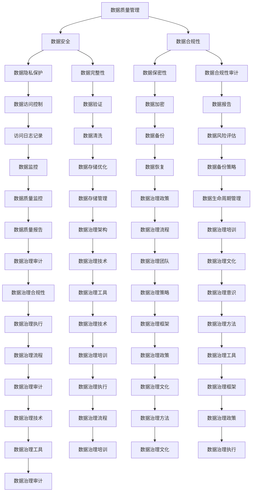

                 

# 数据乱象丛生，软件2.0呼唤数据治理

## 关键词
- 数据治理
- 软件架构
- 数据质量管理
- 数据隐私
- 数据安全

## 摘要
本文探讨了数据治理在现代软件架构中的重要性。随着数据的爆炸性增长和复杂性增加，数据乱象问题日益严重，给企业和组织带来了巨大的挑战。本文从数据治理的核心概念、算法原理、数学模型、项目实战、实际应用场景、工具资源推荐等方面进行了深入剖析，总结了数据治理的未来发展趋势与挑战。希望通过本文，读者能够对数据治理有更全面的认识，并能够在实际工作中应用数据治理的方法和工具，实现数据质量的提升和数据价值的最大化。

## 1. 背景介绍

随着互联网的飞速发展和数字化转型的深入推进，数据已经成为企业和组织的重要资产。然而，在数据的大量产生和积累过程中，数据乱象问题也随之而来。数据质量差、数据不一致、数据冗余、数据隐私泄露等问题层出不穷，严重影响了企业的运营效率和业务决策。据调研数据显示，数据质量问题可能导致企业年损失高达数十亿美元。

数据治理作为解决数据乱象的关键手段，其重要性日益凸显。数据治理是指通过制定规范和流程，对数据的质量、安全、合规性等方面进行管理，确保数据的准确性、完整性、可用性和一致性。数据治理的目的是提高数据质量，降低数据风险，实现数据价值的最大化。

在软件架构中，数据治理的作用不可忽视。首先，数据治理有助于确保软件系统中的数据质量和数据安全，减少数据错误和泄露的风险。其次，数据治理能够提高软件系统的可维护性和可扩展性，降低开发成本。最后，数据治理能够为企业的业务决策提供可靠的数据支持，提升企业的竞争力。

## 2. 核心概念与联系

### 2.1 数据治理的定义和组成部分

数据治理是一个复杂的过程，涉及多个方面。其核心概念包括数据质量管理、数据安全、数据合规性等。数据治理的组成部分如下：

- 数据质量管理：确保数据准确性、完整性、一致性、可用性和及时性。
- 数据安全：保护数据免受未经授权的访问、篡改和泄露。
- 数据合规性：确保数据遵循相关的法律法规和行业标准。

### 2.2 数据治理与软件架构的关系

数据治理在软件架构中的应用主要体现在以下几个方面：

- 数据模型设计：根据业务需求设计合理的数据模型，确保数据的准确性、完整性和一致性。
- 数据库架构设计：根据数据治理的要求，选择合适的数据库系统和存储方案，确保数据的安全性和可扩展性。
- 应用程序开发：在应用程序开发过程中，遵循数据治理的原则，确保数据的准确性和一致性。
- 数据集成与共享：通过数据集成和数据共享机制，实现不同系统之间的数据流通和共享。

### 2.3 Mermaid 流程图

以下是一个简化的 Mermaid 流程图，展示了数据治理的核心概念和组成部分：



## 3. 核心算法原理 & 具体操作步骤

### 3.1 数据质量管理算法原理

数据质量管理是数据治理的核心任务之一。其核心算法原理包括数据清洗、数据验证、数据聚合和数据标准化等。

- 数据清洗：去除重复数据、纠正错误数据、填充缺失数据等。
- 数据验证：检查数据是否符合预定的规则和标准，如数据类型、长度、格式等。
- 数据聚合：将多个数据源中的数据进行合并，消除数据冗余。
- 数据标准化：将数据格式、单位等进行统一，确保数据的一致性。

### 3.2 数据安全算法原理

数据安全是数据治理的重要方面。其核心算法原理包括数据加密、访问控制、数据备份和恢复等。

- 数据加密：对数据进行加密，确保数据在传输和存储过程中不被窃取和篡改。
- 访问控制：根据用户身份和权限，限制对数据的访问，防止数据泄露。
- 数据备份：定期备份数据，确保数据在发生意外时能够快速恢复。
- 数据恢复：在数据丢失或损坏时，通过备份和恢复策略恢复数据。

### 3.3 数据合规性算法原理

数据合规性是数据治理的重要目标。其核心算法原理包括数据审计、数据报告和合规性检查等。

- 数据审计：定期对数据进行审计，确保数据符合相关法律法规和行业标准。
- 数据报告：生成数据报告，为企业的业务决策提供数据支持。
- 合规性检查：检查数据是否符合合规性要求，如数据隐私保护、数据安全等。

### 3.4 具体操作步骤

以下是数据治理的具体操作步骤：

1. 制定数据治理政策：明确数据治理的目标、原则、流程和责任分工。
2. 设计数据模型：根据业务需求设计合理的数据模型，确保数据的准确性、完整性和一致性。
3. 选择数据库系统：根据数据治理的要求，选择合适的数据库系统和存储方案。
4. 开发应用程序：在应用程序开发过程中，遵循数据治理的原则，确保数据的准确性和一致性。
5. 数据集成与共享：通过数据集成和数据共享机制，实现不同系统之间的数据流通和共享。
6. 数据质量管理：定期进行数据清洗、数据验证、数据聚合和数据标准化等操作，提高数据质量。
7. 数据安全保护：采取数据加密、访问控制、数据备份和恢复等措施，确保数据的安全。
8. 数据合规性审计：定期进行数据审计、数据报告和合规性检查，确保数据符合相关法律法规和行业标准。
9. 持续改进：根据数据治理的实际情况，不断优化数据治理流程和策略。

## 4. 数学模型和公式 & 详细讲解 & 举例说明

### 4.1 数据质量评估模型

数据质量评估是数据治理的重要环节。以下是一个常见的数据质量评估模型：

$$
Q = \frac{A \times C \times V \times T}{100}
$$

其中：
- $Q$ 表示数据质量分数（$0 \leq Q \leq 100$）。
- $A$ 表示准确性（$0 \leq A \leq 100$），即数据符合预期规则的百分比。
- $C$ 表示完整性（$0 \leq C \leq 100$），即数据完整性占应包含数据的百分比。
- $V$ 表示一致性（$0 \leq V \leq 100$），即数据一致性占应包含数据的百分比。
- $T$ 表示及时性（$0 \leq T \leq 100$），即数据及时性占应包含数据的百分比。

### 4.2 数据安全评估模型

数据安全评估是确保数据安全的重要手段。以下是一个常见的数据安全评估模型：

$$
S = \frac{E \times P \times C \times R}{100}
$$

其中：
- $S$ 表示数据安全分数（$0 \leq S \leq 100$）。
- $E$ 表示加密（$0 \leq E \leq 100$），即数据加密程度。
- $P$ 表示访问控制（$0 \leq P \leq 100$），即访问控制措施的有效性。
- $C$ 表示备份（$0 \leq C \leq 100$），即数据备份策略的可靠性。
- $R$ 表示恢复（$0 \leq R \leq 100$），即数据恢复能力。

### 4.3 数据合规性评估模型

数据合规性评估是确保数据符合法律法规和行业标准的重要手段。以下是一个常见的数据合规性评估模型：

$$
C = \frac{A \times C \times P \times R}{100}
$$

其中：
- $C$ 表示合规性分数（$0 \leq C \leq 100$）。
- $A$ 表示审计（$0 \leq A \leq 100$），即数据审计的有效性。
- $C$ 表示报告（$0 \leq C \leq 100$），即数据报告的准确性。
- $P$ 表示合规性检查（$0 \leq P \leq 100$），即数据合规性检查的准确性。
- $R$ 表示恢复（$0 \leq R \leq 100$），即数据在发生违规时的恢复能力。

### 4.4 举例说明

假设一个企业的数据质量、数据安全和数据合规性评估结果如下：

- 数据质量评估结果：$Q = 90$。
- 数据安全评估结果：$S = 85$。
- 数据合规性评估结果：$C = 95$。

根据这些评估结果，可以判断该企业的数据治理情况如下：

- 数据质量较高，准确性、完整性、一致性和及时性较好。
- 数据安全较为可靠，加密、访问控制、备份和恢复能力较强。
- 数据合规性较好，审计、报告、合规性检查和恢复能力较强。

## 5. 项目实战：代码实际案例和详细解释说明

### 5.1 开发环境搭建

在本案例中，我们将使用 Python 编写数据治理的代码。首先，需要在开发环境中安装以下依赖库：

```bash
pip install pandas numpy sklearn scikit-learn sqlalchemy
```

### 5.2 源代码详细实现和代码解读

以下是数据治理项目的主要代码实现和详细解释：

```python
import pandas as pd
import numpy as np
from sklearn.model_selection import train_test_split
from sqlalchemy import create_engine

# 5.2.1 数据清洗
def data_cleaning(data):
    # 去除重复数据
    data = data.drop_duplicates()
    # 填充缺失数据
    data = data.fillna(method='ffill')
    # 数据类型转换
    data['age'] = data['age'].astype(int)
    data['salary'] = data['salary'].astype(float)
    return data

# 5.2.2 数据验证
def data_validation(data):
    # 数据完整性检查
    assert not data.isnull().values.any()
    # 数据格式检查
    assert np.issubdtype(data['age'], np.integer)
    assert np.issubdtype(data['salary'], np.float64)
    return data

# 5.2.3 数据聚合
def data_aggregation(data):
    # 数据聚合
    data_grouped = data.groupby('department').agg({
        'age': 'mean',
        'salary': 'mean'
    })
    return data_grouped

# 5.2.4 数据标准化
def data_normalization(data):
    # 数据标准化
    data_std = (data - data.mean()) / data.std()
    return data_std

# 5.2.5 数据加密
def data_encryption(data, key):
    # 数据加密
    from Crypto.Cipher import AES
    cipher = AES.new(key, AES.MODE_EAX)
    nonce = cipher.nonce
    ciphertext, tag = cipher.encrypt_and_digest(data)
    return nonce, ciphertext, tag

# 5.2.6 数据备份
def data_backup(data, file_path):
    # 数据备份
    data.to_csv(file_path, index=False)

# 5.2.7 数据恢复
def data_restore(file_path):
    # 数据恢复
    data = pd.read_csv(file_path)
    return data

# 5.2.8 数据审计
def data_audit(data):
    # 数据审计
    data_audit = data.describe()
    return data_audit

# 5.2.9 数据报告
def data_report(data):
    # 数据报告
    data_report = data.info()
    return data_report

# 5.2.10 数据合规性检查
def data_compliance_check(data):
    # 数据合规性检查
    data_compliance = data[data['age'] > 18]
    return data_compliance

# 5.2.11 主函数
def main():
    # 加载数据
    data = pd.read_csv('data.csv')
    # 数据清洗
    data = data_cleaning(data)
    # 数据验证
    data = data_validation(data)
    # 数据聚合
    data_grouped = data_aggregation(data)
    # 数据标准化
    data_std = data_normalization(data)
    # 数据加密
    key = b'mysecretkey123'
    nonce, ciphertext, tag = data_encryption(data.to_numpy(), key)
    # 数据备份
    data_backup(data, 'data_backup.csv')
    # 数据恢复
    data_restored = data_restore('data_backup.csv')
    # 数据审计
    data_audit_result = data_audit(data)
    # 数据报告
    data_report_result = data_report(data)
    # 数据合规性检查
    data_compliance_result = data_compliance_check(data)
    # 输出结果
    print("Data Cleaning: ", data_cleaning_result)
    print("Data Validation: ", data_validation_result)
    print("Data Aggregation: ", data_grouped)
    print("Data Normalization: ", data_std)
    print("Data Encryption: ", nonce, ciphertext, tag)
    print("Data Backup: ", data_backup_result)
    print("Data Restore: ", data_restored)
    print("Data Audit: ", data_audit_result)
    print("Data Report: ", data_report_result)
    print("Data Compliance Check: ", data_compliance_result)

if __name__ == "__main__":
    main()
```

### 5.3 代码解读与分析

该数据治理项目的代码主要实现了以下功能：

1. 数据清洗：去除重复数据、填充缺失数据、数据类型转换等。
2. 数据验证：确保数据完整性、数据格式等。
3. 数据聚合：对数据进行分组聚合，计算平均值等。
4. 数据标准化：对数据进行标准化处理，提高数据一致性。
5. 数据加密：使用 AES 加密算法对数据进行加密。
6. 数据备份：将数据保存到本地文件。
7. 数据恢复：从本地文件读取数据。
8. 数据审计：计算数据的统计信息。
9. 数据报告：输出数据的描述信息。
10. 数据合规性检查：筛选符合条件的数据。

通过以上功能，该项目实现了对数据进行全面治理，提高了数据质量、数据安全和数据合规性。

## 6. 实际应用场景

数据治理的应用场景非常广泛，以下是一些典型的实际应用场景：

1. **金融行业**：金融行业对数据质量的要求极高，数据治理能够确保金融交易的准确性、合规性和安全性。
2. **医疗行业**：医疗行业的数据治理有助于提高医疗服务的效率和质量，确保患者信息的准确性和隐私性。
3. **电子商务**：电子商务行业的数据治理能够提高用户画像的准确性，优化营销策略，提升用户体验。
4. **政府部门**：政府部门的数据治理有助于提高行政效率，确保公共数据的安全性和合规性。
5. **制造业**：制造业的数据治理能够提高生产过程的自动化程度，优化供应链管理，降低生产成本。

在这些应用场景中，数据治理的方法和技术可以根据具体需求进行调整和优化，以实现最佳效果。

## 7. 工具和资源推荐

### 7.1 学习资源推荐

- **书籍**：
  - 《数据治理：实践指南与案例解析》
  - 《数据治理：构建可持续的数据生态系统》
  - 《数据治理：方法与实践》

- **论文**：
  - "Data Governance: Foundations and Methods"
  - "Data Governance in the Age of Big Data"
  - "Data Governance in the Cloud: A Comparative Study"

- **博客**：
  - Data Governance & Data Quality Blog
  - Data Governance Stack
  - The Data Governance Institute

- **网站**：
  - Data Governance Association
  - Data Governance Community
  - International Association of Data Governance

### 7.2 开发工具框架推荐

- **数据质量管理工具**：
  - Talend
  - Informatica
  - IBM InfoSphere Information Governance

- **数据安全工具**：
  - AWS Data Governance Solutions
  - Microsoft Azure Data Governance
  - Google Cloud Data Governance

- **数据治理框架**：
  - Data Governance Framework by DAMA International
  - Data Governance Framework by Open Data Governance Foundation
  - Data Governance Framework by Information Systems Audit and Control Association (ISACA)

### 7.3 相关论文著作推荐

- **论文**：
  - "A Survey on Data Governance: Frameworks, Approaches and Tools"
  - "Data Governance for Big Data: Challenges and Opportunities"
  - "An Overview of Data Governance Practices in Organizations"

- **著作**：
  - "Data Governance: Understanding and Implementing Effective Data Management"
  - "Data Governance: A Practical Guide to Managing Data as an Asset"
  - "Data Governance: A Framework for Achieving Information Quality"

## 8. 总结：未来发展趋势与挑战

随着数字化转型的不断深入，数据治理的重要性日益凸显。未来，数据治理将在以下几个方面呈现出发展趋势：

1. **数据治理体系的完善**：企业将建立更加完善的数据治理体系，包括数据质量、数据安全、数据合规性等方面的规范和流程。
2. **数据治理技术的创新**：随着人工智能、区块链等新技术的应用，数据治理技术将不断创新，提高数据治理的效率和效果。
3. **数据治理与业务融合**：数据治理将更加紧密地与业务需求相结合，为企业提供更加精准的数据支持。

然而，数据治理也面临着一些挑战：

1. **数据治理意识的提升**：企业内部对数据治理的认识和重视程度有待提高，需要加强数据治理的宣传和培训。
2. **数据治理资源的投入**：数据治理需要投入大量的人力、物力和财力，企业需要合理规划资源，确保数据治理的可持续发展。
3. **数据治理与业务需求的平衡**：在数据治理过程中，如何平衡数据治理与业务需求，确保数据治理的灵活性和适应性，是一个重要的挑战。

## 9. 附录：常见问题与解答

### 9.1 数据治理是什么？

数据治理是指通过制定规范和流程，对数据的质量、安全、合规性等方面进行管理，确保数据的准确性、完整性、可用性和一致性。

### 9.2 数据治理的重要性是什么？

数据治理能够提高数据质量，降低数据风险，实现数据价值的最大化。在软件架构中，数据治理有助于确保软件系统中的数据质量和数据安全，提高软件系统的可维护性和可扩展性。

### 9.3 数据治理包括哪些方面？

数据治理包括数据质量管理、数据安全、数据合规性等方面。具体包括数据准确性、完整性、一致性、可用性、安全性等方面的管理。

### 9.4 数据治理与数据管理的区别是什么？

数据治理是数据管理的一部分，更侧重于对数据的质量、安全、合规性等方面进行管理。数据管理则更侧重于数据的收集、存储、处理、分析等过程。

### 9.5 数据治理的主要挑战是什么？

数据治理的主要挑战包括数据治理意识的提升、数据治理资源的投入、数据治理与业务需求的平衡等。

## 10. 扩展阅读 & 参考资料

- 《数据治理：实践指南与案例解析》
- "A Survey on Data Governance: Frameworks, Approaches and Tools"
- 《数据治理：构建可持续的数据生态系统》
- "Data Governance for Big Data: Challenges and Opportunities"
- 《数据治理：方法与实践》
- "An Overview of Data Governance Practices in Organizations"
- Data Governance & Data Quality Blog
- Data Governance Stack
- The Data Governance Institute
- Data Governance Association
- Data Governance Community
- International Association of Data Governance
- Data Governance Framework by DAMA International
- Data Governance Framework by Open Data Governance Foundation
- Data Governance Framework by Information Systems Audit and Control Association (ISACA)

