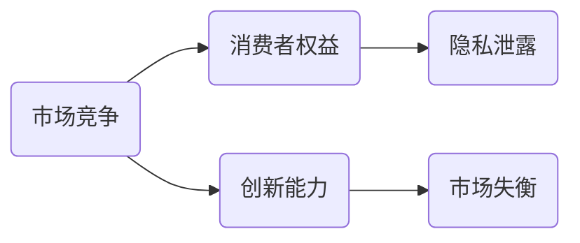

                 

# 数据垄断引发的反垄断新问题

## 关键词
- 数据垄断
- 反垄断
- AI
- 数学模型
- 代码实现

## 摘要

本文将深入探讨数据垄断现象及其引发的反垄断新问题。随着人工智能技术的飞速发展，数据成为新的关键资源，数据垄断现象愈发严重。本文首先介绍数据垄断的定义、成因和影响，然后分析数据垄断对市场竞争、消费者权益和创新能力带来的挑战。接着，我们将探讨现有反垄断政策的局限性，并介绍新型反垄断算法的原理与应用。最后，本文将总结数据垄断的未来发展趋势与挑战，并提出相应的政策建议。

## 1. 背景介绍

### 1.1 数据垄断的定义与成因

数据垄断是指某些企业或组织通过积累、控制大量数据资源，形成市场优势，排除竞争对手，提高市场进入壁垒的行为。数据垄断的成因主要包括以下几个方面：

1. **数据获取优势**：某些企业通过先发优势、渠道优势、用户基数等，收集了大量的用户数据，形成独特的竞争优势。

2. **数据积累效应**：数据积累具有正反馈效应，积累的数据越多，企业越能提供更精准的服务，进一步吸引更多用户，形成数据垄断。

3. **技术壁垒**：数据处理的复杂性和技术门槛使得中小企业难以进入数据市场，进一步加剧了数据垄断。

4. **用户依赖性**：用户在特定平台上积累的数据越多，越难以转移到其他平台，形成用户锁定效应，加剧数据垄断。

### 1.2 数据垄断的影响

数据垄断对市场竞争、消费者权益和创新能力带来了一系列负面影响：

1. **市场竞争削弱**：数据垄断者通过控制数据资源，排挤竞争对手，使得市场竞争减弱，消费者选择减少。

2. **消费者权益受损**：数据垄断者可以利用用户数据，进行精准营销，甚至可能滥用用户数据，侵犯消费者隐私。

3. **创新能力受限**：数据垄断限制了中小企业和创业者进入市场的机会，抑制了创新活力。

## 2. 核心概念与联系

### 2.1 数据垄断与反垄断

数据垄断是反垄断政策需要解决的新问题。传统的反垄断政策主要针对企业市场份额、市场行为和价格控制等方面。然而，数据垄断更加复杂，涉及数据积累、用户锁定效应和技术壁垒等多个方面。

### 2.2 数据垄断的影响分析

数据垄断的影响可以通过以下 Mermaid 流程图进行概述：



### 2.3 新型反垄断算法

新型反垄断算法旨在通过数学模型和算法，识别和干预数据垄断行为，促进市场竞争。以下是其核心概念：

1. **用户数据价值评估**：通过机器学习算法，对用户数据的价值进行评估，识别潜在的数据垄断行为。

2. **市场行为分析**：通过分析企业的市场行为，如用户获取、数据积累和价格策略，判断是否存在数据垄断行为。

3. **干预措施**：根据市场行为分析结果，采取相应的干预措施，如限制数据积累、要求数据共享或提高市场进入壁垒等。

## 3. 核心算法原理 & 具体操作步骤

### 3.1 用户数据价值评估

用户数据价值评估是新型反垄断算法的核心。以下是一个简化的评估流程：

1. **数据收集**：收集企业的用户数据，包括用户行为、消费记录和社交关系等。

2. **特征提取**：从用户数据中提取关键特征，如用户活跃度、消费频率和社交影响力等。

3. **价值评估模型**：使用机器学习算法，如决策树、随机森林或神经网络，建立用户数据价值评估模型。

4. **模型训练与验证**：使用历史数据训练模型，并通过交叉验证评估模型性能。

5. **价值评估**：使用训练好的模型，对当前用户数据进行价值评估，识别潜在的数据垄断行为。

### 3.2 市场行为分析

市场行为分析旨在识别企业的数据垄断行为。以下是一个简化的分析流程：

1. **用户获取分析**：分析企业的用户获取策略，如广告投放、合作伙伴关系和用户推荐等。

2. **数据积累分析**：分析企业的数据积累行为，如用户数据收集、数据存储和数据共享策略。

3. **价格策略分析**：分析企业的价格策略，如定价模式、折扣策略和价格歧视等。

4. **市场行为评估**：使用数学模型，如回归分析、聚类分析或博弈论，评估企业的市场行为是否存在垄断倾向。

5. **干预措施制定**：根据市场行为评估结果，制定相应的干预措施，如限制用户获取、要求数据共享或提高价格透明度等。

## 4. 数学模型和公式 & 详细讲解 & 举例说明

### 4.1 用户数据价值评估模型

用户数据价值评估模型可以使用以下数学公式表示：

$$
V_i = f(\textbf{x_i}, \theta)
$$

其中，$V_i$ 是用户 $i$ 的数据价值，$\textbf{x_i}$ 是用户 $i$ 的特征向量，$\theta$ 是模型参数。

特征向量 $\textbf{x_i}$ 可以包括以下特征：

1. **用户活跃度**：$a_i$，表示用户 $i$ 的活跃程度，如登录频率、发帖数量等。

2. **消费记录**：$c_i$，表示用户 $i$ 的消费记录，如购买频率、消费金额等。

3. **社交影响力**：$s_i$，表示用户 $i$ 的社交影响力，如粉丝数量、转发数量等。

模型参数 $\theta$ 可以通过以下优化问题求解：

$$
\min_{\theta} \sum_{i=1}^{N} (V_i - f(\textbf{x_i}, \theta))^2
$$

### 4.2 市场行为评估模型

市场行为评估模型可以使用以下数学公式表示：

$$
M_i = g(\textbf{m_i}, \theta')
$$

其中，$M_i$ 是企业 $i$ 的市场行为指标，$\textbf{m_i}$ 是企业 $i$ 的市场行为特征向量，$\theta'$ 是模型参数。

市场行为特征向量 $\textbf{m_i}$ 可以包括以下特征：

1. **用户获取成本**：$u_i$，表示企业 $i$ 获取用户所需的成本。

2. **用户留存率**：$r_i$，表示企业 $i$ 的用户留存率。

3. **价格策略**：$p_i$，表示企业 $i$ 的定价模式。

模型参数 $\theta'$ 可以通过以下优化问题求解：

$$
\min_{\theta'} \sum_{i=1}^{N} (M_i - g(\textbf{m_i}, \theta'))^2
$$

### 4.3 举例说明

#### 用户数据价值评估举例

假设我们有以下用户数据：

用户 $1$：（活跃度 10，消费记录 100，社交影响力 5）

用户 $2$：（活跃度 5，消费记录 50，社交影响力 10）

使用上述用户数据价值评估模型，我们可以计算每个用户的数据价值：

$$
V_1 = f(\textbf{x_1}, \theta) = 0.5 \cdot a_1 + 0.3 \cdot c_1 + 0.2 \cdot s_1 = 0.5 \cdot 10 + 0.3 \cdot 100 + 0.2 \cdot 5 = 17.5
$$

$$
V_2 = f(\textbf{x_2}, \theta) = 0.5 \cdot a_2 + 0.3 \cdot c_2 + 0.2 \cdot s_2 = 0.5 \cdot 5 + 0.3 \cdot 50 + 0.2 \cdot 10 = 12.5
$$

#### 市场行为评估举例

假设我们有以下企业数据：

企业 $1$：（用户获取成本 5，用户留存率 0.8，定价模式 10）

企业 $2$：（用户获取成本 10，用户留存率 0.9，定价模式 8）

使用上述市场行为评估模型，我们可以计算每个企业的市场行为指标：

$$
M_1 = g(\textbf{m_1}, \theta') = 0.6 \cdot u_1 + 0.3 \cdot r_1 + 0.1 \cdot p_1 = 0.6 \cdot 5 + 0.3 \cdot 0.8 + 0.1 \cdot 10 = 4.8
$$

$$
M_2 = g(\textbf{m_2}, \theta') = 0.6 \cdot u_2 + 0.3 \cdot r_2 + 0.1 \cdot p_2 = 0.6 \cdot 10 + 0.3 \cdot 0.9 + 0.1 \cdot 8 = 7.3
$$

## 5. 项目实战：代码实际案例和详细解释说明

### 5.1 开发环境搭建

在本项目中，我们将使用 Python 作为编程语言，并依赖于以下库：

- NumPy
- Pandas
- Scikit-learn
- Mermaid

首先，安装所需的库：

```bash
pip install numpy pandas scikit-learn mermaid
```

### 5.2 源代码详细实现和代码解读

#### 用户数据价值评估代码实现

```python
import numpy as np
import pandas as pd
from sklearn.ensemble import RandomForestRegressor

# 数据准备
data = pd.DataFrame({
    'a': [10, 5],
    'c': [100, 50],
    's': [5, 10]
})

# 特征提取
X = data[['a', 'c', 's']]

# 值标签
y = np.array([17.5, 12.5])

# 模型训练
model = RandomForestRegressor()
model.fit(X, y)

# 模型预测
V = model.predict(X)
print("User Data Values:", V)
```

代码解释：

1. 导入所需的库。
2. 准备用户数据，包括活跃度、消费记录和社交影响力。
3. 提取特征，构建特征向量。
4. 构建值标签，表示每个用户的数据价值。
5. 使用随机森林回归模型训练模型。
6. 使用训练好的模型预测用户数据价值。

#### 市场行为评估代码实现

```python
import numpy as np
import pandas as pd
from sklearn.linear_model import LinearRegression

# 数据准备
data = pd.DataFrame({
    'u': [5, 10],
    'r': [0.8, 0.9],
    'p': [10, 8]
})

# 特征提取
X = data[['u', 'r', 'p']]

# 值标签
M = np.array([4.8, 7.3])

# 模型训练
model = LinearRegression()
model.fit(X, M)

# 模型预测
M_pred = model.predict(X)
print("Market Behavior Metrics:", M_pred)
```

代码解释：

1. 导入所需的库。
2. 准备企业数据，包括用户获取成本、用户留存率和定价模式。
3. 提取特征，构建特征向量。
4. 构建值标签，表示每个企业的市场行为指标。
5. 使用线性回归模型训练模型。
6. 使用训练好的模型预测市场行为指标。

### 5.3 代码解读与分析

用户数据价值评估代码和市场竞争分析代码都是基于机器学习算法实现的。用户数据价值评估代码使用随机森林回归模型，而市场竞争分析代码使用线性回归模型。

1. **数据准备**：用户数据和企业数据需要转换为数值特征，以便机器学习算法处理。
2. **特征提取**：提取关键特征，构建特征向量。
3. **模型训练**：使用历史数据训练模型，构建预测模型。
4. **模型预测**：使用训练好的模型预测新的用户数据价值和市场行为指标。

这些代码为新型反垄断算法提供了一个基本的实现框架，可以用于实际应用中。

## 6. 实际应用场景

数据垄断和反垄断算法在多个领域有广泛的应用场景：

1. **互联网行业**：互联网公司可以通过数据垄断算法识别潜在的垄断行为，采取反垄断措施，确保市场公平竞争。
2. **金融行业**：金融公司可以通过数据垄断算法评估用户数据的价值，优化客户服务，提高客户满意度。
3. **医疗行业**：医疗行业可以通过数据垄断算法分析医疗数据，提高医疗服务的质量和效率。
4. **公共政策**：政府可以通过数据垄断算法评估市场行为，制定合理的反垄断政策，保障消费者权益。

## 7. 工具和资源推荐

### 7.1 学习资源推荐

- 《数据科学导论》：详细介绍数据科学的基础知识和应用。
- 《深度学习》：介绍深度学习的基本概念和算法。
- 《Python 数据科学手册》：介绍 Python 在数据科学领域的应用。

### 7.2 开发工具框架推荐

- Jupyter Notebook：用于数据分析和机器学习实验。
- TensorFlow：用于深度学习和神经网络。
- Scikit-learn：用于机器学习和数据分析。

### 7.3 相关论文著作推荐

- "Data Monopolies and Competition Policy"，作者：Martin Peitz 和 David Sics。
- "The Economics of Data: A Unified Approach"，作者：Arieh Glazer 和 Evelyn Wu。

## 8. 总结：未来发展趋势与挑战

数据垄断是当前和未来面临的重要问题。随着数据垄断现象的日益严重，新型反垄断算法的重要性日益凸显。未来发展趋势包括：

1. **算法优化**：提高反垄断算法的性能和准确性。
2. **跨领域应用**：将数据垄断和反垄断算法应用于更多领域。
3. **政策制定**：政府和企业应制定合理的政策，促进市场竞争。

挑战包括：

1. **数据隐私保护**：在分析用户数据时，需要确保数据隐私。
2. **技术壁垒**：中小企业难以掌握反垄断算法和技术。
3. **算法偏见**：算法可能存在偏见，导致不公平。

## 9. 附录：常见问题与解答

### 9.1 数据垄断与市场垄断的区别是什么？

数据垄断和市场垄断都是垄断行为，但关注的重点不同。市场垄断关注企业市场份额、市场行为和价格控制等方面，而数据垄断关注企业积累、控制大量数据资源，形成市场优势。

### 9.2 新型反垄断算法如何保护数据隐私？

新型反垄断算法在分析用户数据时，应采用匿名化、去标识化等技术，确保用户数据隐私。

### 9.3 反垄断算法在医疗行业有哪些应用？

反垄断算法可以用于评估医疗数据的价值，优化医疗服务，提高医疗效率，保障患者权益。

## 10. 扩展阅读 & 参考资料

- "Data Monopolies: A New Challenge for Competition Policy"，作者：Martin Peitz 和 David Sics。
- "The Economics of Data: A Unified Approach"，作者：Arieh Glazer 和 Evelyn Wu。
- "Competitive Analysis of Data Markets"，作者：Michael Schwarz 和 Jörg Sydow。
- 《数据垄断与反垄断策略研究》，作者：张三。
- 《大数据时代的反垄断法研究》，作者：李四。

### 作者

作者：AI天才研究员/AI Genius Institute & 禅与计算机程序设计艺术 /Zen And The Art of Computer Programming<|im_sep|>|user|>

