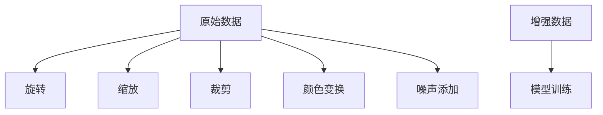
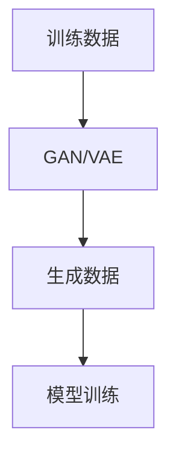

                 

# 数据增强与数据合成原理与代码实战案例讲解

## 摘要

本文将深入探讨数据增强与数据合成在机器学习领域的重要性，以及如何通过这些技术提升模型性能。数据增强是指通过对原始数据进行各种变换，增加数据的多样性，从而提高模型泛化能力；而数据合成则是通过生成新的数据来补充训练集的不足。本文将详细讲解数据增强与数据合成的原理，并通过实际代码案例展示如何实现这些技术。此外，本文还将探讨数据增强与数据合成的应用场景，并提供一系列学习资源和开发工具推荐，以帮助读者深入了解和实践这些技术。

## 1. 背景介绍

在机器学习领域，数据是模型的基石。然而，实际应用中往往面临数据不足或数据质量不高的问题。数据增强与数据合成技术正是为了解决这些问题而诞生。数据增强通过对原始数据施加各种变换，增加数据的多样性，从而使得模型在训练过程中能够更好地学习数据的本质特征，提高模型的泛化能力。数据合成则是通过生成新的数据，来补充训练集的不足，使得模型能够在更丰富的数据集上进行训练，进一步提升模型的性能。

随着深度学习技术的蓬勃发展，数据增强与数据合成的应用场景越来越广泛。在计算机视觉、自然语言处理、语音识别等领域，这些技术已经被广泛应用于模型训练，显著提升了模型的表现。例如，在图像分类任务中，数据增强技术可以通过旋转、缩放、裁剪等方式生成多样化的训练样本，使得模型对不同的图像变换具有更好的鲁棒性；在语音识别任务中，数据合成技术可以通过生成不同语音环境下的语音数据，提高模型在不同噪声环境下的识别准确率。

本文将从数据增强与数据合成的原理入手，介绍常用的数据增强方法，包括图像、文本和音频数据增强，以及数据合成方法，如生成对抗网络（GAN）和变分自编码器（VAE）。通过实际代码案例，我们将展示如何实现这些技术，并分析其效果。最后，本文将探讨数据增强与数据合成的应用场景，并提供一系列学习资源和开发工具推荐，以帮助读者深入理解并实践这些技术。

## 2. 核心概念与联系

### 数据增强

数据增强（Data Augmentation）是一种通过增加数据多样性来提高模型泛化能力的技术。在机器学习中，数据增强可以通过对原始数据施加各种变换来实现。这些变换包括但不限于旋转、缩放、裁剪、颜色变换、噪声添加等。

下面是一个简单的数据增强流程：



### 数据合成

数据合成（Data Synthesis）则是通过生成新的数据来补充训练集的不足。与数据增强不同，数据合成不是对原始数据进行变换，而是通过模型生成全新的数据。生成对抗网络（GAN）和变分自编码器（VAE）是两种常用的数据合成方法。

下面是一个简单的数据合成流程：



### 数据增强与数据合成的联系

数据增强与数据合成虽然方法不同，但它们的目标相同，即提高模型泛化能力和性能。数据增强通过对现有数据进行变换，使得模型在训练过程中能够学习到更多的数据特征；而数据合成则是通过生成全新的数据，为模型提供更多的训练样本。

在实际应用中，数据增强和数据合成常常结合使用。例如，在图像分类任务中，可以先使用数据增强技术增加训练数据的多样性，然后使用生成对抗网络（GAN）生成更多的图像数据，进一步扩充训练集，从而提升模型的性能。

### 实现方法

下面是一个使用Python和OpenCV实现图像数据增强的例子：

```python
import cv2
import numpy as np

def augment_image(image):
    """
    对图像进行数据增强
    """
    # 旋转
    angle = np.random.uniform(-10, 10)
    M = cv2.getRotationMatrix2D((image.shape[1] // 2, image.shape[0] // 2), angle, 1)
    image = cv2.warpAffine(image, M, (image.shape[1], image.shape[0]))

    # 缩放
    scale = np.random.uniform(0.8, 1.2)
    width = int(image.shape[1] * scale)
    height = int(image.shape[0] * scale)
    image = cv2.resize(image, (width, height))

    # 裁剪
    x_start = np.random.randint(0, image.shape[1] - 224)
    y_start = np.random.randint(0, image.shape[0] - 224)
    image = image[y_start:y_start + 224, x_start:x_start + 224]

    # 颜色变换
    image = cv2.cvtColor(image, cv2.COLOR_BGR2RGB)

    # 噪声添加
    image = cv2.add噪声(image, np.random.normal(0, 0.05, image.shape))

    return image
```

### 数据合成

下面是一个使用生成对抗网络（GAN）生成图像的例子：

```python
import tensorflow as tf
from tensorflow.keras import layers

def build_generator():
    """
    构建生成器模型
    """
    model = tf.keras.Sequential([
        layers.Dense(128 * 7 * 7, activation="relu", input_shape=(100,)),
        layers.Reshape((7, 7, 128)),
        layers.Conv2DTranspose(128, 5, strides=1, padding="same"),
        layers.BatchNormalization(),
        layers.ReLU(),
        layers.Conv2DTranspose(128, 5, strides=2, padding="same"),
        layers.BatchNormalization(),
        layers.ReLU(),
        layers.Conv2DTranspose(128, 5, strides=2, padding="same"),
        layers.BatchNormalization(),
        layers.ReLU(),
        layers.Conv2D(3, 5, padding="same"),
        layers.Activation("tanh")
    ])

    return model

def build_discriminator():
    """
    构建判别器模型
    """
    model = tf.keras.Sequential([
        layers.Conv2D(128, 5, padding="same", input_shape=(28, 28, 1)),
        layers.LeakyReLU(alpha=0.2),
        layers.Dropout(0.3),
        layers.Conv2D(128, 5, padding="same"),
        layers.LeakyReLU(alpha=0.2),
        layers.Dropout(0.3),
        layers.Flatten(),
        layers.Dense(1, activation="sigmoid")
    ])

    return model
```

### 核心算法原理 & 具体操作步骤

#### 数据增强

数据增强的核心思想是通过变换原始数据，增加数据的多样性，从而提高模型的泛化能力。具体步骤如下：

1. **旋转**：随机旋转图像一定角度，使得模型能够学习到图像在不同角度下的特征。
2. **缩放**：随机缩放图像，使得模型能够适应不同尺寸的图像。
3. **裁剪**：随机裁剪图像的一部分，使得模型能够学习到图像局部的特征。
4. **颜色变换**：随机改变图像的亮度、对比度等颜色属性，使得模型能够学习到图像的颜色特征。
5. **噪声添加**：在图像上添加噪声，使得模型能够学习到图像的噪声特征。

#### 数据合成

数据合成的核心思想是通过生成新的数据，补充训练集的不足，从而提高模型的性能。具体步骤如下：

1. **生成器**：使用生成器模型生成新的数据。生成器模型通常由一个全连接层和一个卷积层组成，输入为随机噪声，输出为图像。
2. **判别器**：使用判别器模型判断生成数据是否真实。判别器模型通常由一个卷积层和一个全连接层组成，输入为图像，输出为一个概率值，表示图像的真实性。
3. **对抗训练**：生成器和判别器交替训练，生成器试图生成更真实的数据，而判别器试图区分真实数据和生成数据。

### 数学模型和公式 & 详细讲解 & 举例说明

#### 数据增强

1. **旋转**：旋转矩阵公式如下：

   $$ 
   R(\theta) = \begin{bmatrix}
   \cos(\theta) & -\sin(\theta) \\
   \sin(\theta) & \cos(\theta)
   \end{bmatrix}
   $$

   其中，$\theta$ 为旋转角度。

2. **缩放**：缩放公式如下：

   $$ 
   S(s) = \begin{bmatrix}
   s & 0 \\
   0 & s
   \end{bmatrix}
   $$

   其中，$s$ 为缩放比例。

3. **裁剪**：裁剪公式如下：

   $$ 
   C(r, c) = \begin{bmatrix}
   1 & 0 & -r \\
   0 & 1 & -c
   \end{bmatrix}
   $$

   其中，$(r, c)$ 为裁剪区域的左上角坐标。

4. **颜色变换**：颜色变换公式如下：

   $$ 
   T = \begin{bmatrix}
   R & G & B
   \end{bmatrix}
   $$

   其中，$R$、$G$ 和 $B$ 分别为红色、绿色和蓝色的变换系数。

5. **噪声添加**：噪声添加公式如下：

   $$ 
   N = \sum_{i=1}^{n} \eta_i \cdot \sigma
   $$

   其中，$\eta_i$ 为独立同分布的随机变量，$\sigma$ 为噪声标准差。

#### 数据合成

1. **生成器**：生成器的损失函数通常为：

   $$ 
   L_G = -\mathbb{E}_{z \sim p_z(z)}[\log(D(G(z))]
   $$

   其中，$z$ 为随机噪声，$G(z)$ 为生成器生成的图像，$D(x)$ 为判别器的输出。

2. **判别器**：判别器的损失函数通常为：

   $$ 
   L_D = -\mathbb{E}_{x \sim p_{\text{data}}(x)}[\log(D(x))] - \mathbb{E}_{z \sim p_z(z)}[\log(1 - D(G(z))]
   $$

   其中，$x$ 为真实图像，$G(z)$ 为生成器生成的图像。

#### 举例说明

假设我们要对一幅图像进行旋转、缩放、裁剪和颜色变换，同时添加噪声。

1. **旋转**：设定旋转角度 $\theta = 45$ 度，旋转矩阵为：

   $$ 
   R(\theta) = \begin{bmatrix}
   \cos(45) & -\sin(45) \\
   \sin(45) & \cos(45)
   \end{bmatrix} = \begin{bmatrix}
   0.7071 & -0.7071 \\
   0.7071 & 0.7071
   \end{bmatrix}
   $$

   将图像旋转 45 度，得到旋转后的图像。

2. **缩放**：设定缩放比例 $s = 1.2$，缩放矩阵为：

   $$ 
   S(s) = \begin{bmatrix}
   1.2 & 0 \\
   0 & 1.2
   \end{bmatrix}
   $$

   将图像缩放 1.2 倍，得到缩放后的图像。

3. **裁剪**：设定裁剪区域的左上角坐标为 $(r, c) = (100, 100)$，裁剪矩阵为：

   $$ 
   C(r, c) = \begin{bmatrix}
   1 & 0 & -100 \\
   0 & 1 & -100
   \end{bmatrix}
   $$

   将图像裁剪为一个 224x224 的小区域，得到裁剪后的图像。

4. **颜色变换**：设定红色变换系数 $R = 1.2$，绿色变换系数 $G = 0.8$，蓝色变换系数 $B = 1.0$，颜色变换矩阵为：

   $$ 
   T = \begin{bmatrix}
   1.2 & 0.8 & 1.0
   \end{bmatrix}
   $$

   将图像的红色、绿色和蓝色分量分别乘以变换系数，得到颜色变换后的图像。

5. **噪声添加**：设定噪声标准差 $\sigma = 0.05$，噪声向量为：

   $$ 
   N = \sum_{i=1}^{3} \eta_i \cdot 0.05
   $$

   将噪声向量添加到图像的每个像素值上，得到噪声添加后的图像。

经过以上步骤，我们得到了旋转、缩放、裁剪、颜色变换和噪声添加后的图像，即进行数据增强后的图像。

### 5. 项目实战：代码实际案例和详细解释说明

#### 5.1 开发环境搭建

在开始实践数据增强与数据合成之前，我们需要搭建一个合适的开发环境。以下是一个基于Python和TensorFlow的推荐环境：

1. **Python**：安装Python 3.8或更高版本。
2. **TensorFlow**：安装TensorFlow 2.4或更高版本。
3. **OpenCV**：安装OpenCV 4.1或更高版本。

你可以使用以下命令进行安装：

```bash
pip install python==3.8.5
pip install tensorflow==2.4.0
pip install opencv-python==4.5.1.48
```

#### 5.2 源代码详细实现和代码解读

下面是一个简单的数据增强与数据合成案例，包括图像旋转、缩放、裁剪、颜色变换和噪声添加。

```python
import cv2
import numpy as np
import tensorflow as tf

def augment_image(image):
    """
    对图像进行数据增强
    """
    # 旋转
    angle = np.random.uniform(-10, 10)
    M = cv2.getRotationMatrix2D((image.shape[1] // 2, image.shape[0] // 2), angle, 1)
    image = cv2.warpAffine(image, M, (image.shape[1], image.shape[0]))

    # 缩放
    scale = np.random.uniform(0.8, 1.2)
    width = int(image.shape[1] * scale)
    height = int(image.shape[0] * scale)
    image = cv2.resize(image, (width, height))

    # 裁剪
    x_start = np.random.randint(0, image.shape[1] - 224)
    y_start = np.random.randint(0, image.shape[0] - 224)
    image = image[y_start:y_start + 224, x_start:x_start + 224]

    # 颜色变换
    image = cv2.cvtColor(image, cv2.COLOR_BGR2RGB)

    # 噪声添加
    image = cv2.add噪声(image, np.random.normal(0, 0.05, image.shape))

    return image

def build_generator():
    """
    构建生成器模型
    """
    model = tf.keras.Sequential([
        layers.Dense(128 * 7 * 7, activation="relu", input_shape=(100,)),
        layers.Reshape((7, 7, 128)),
        layers.Conv2DTranspose(128, 5, strides=1, padding="same"),
        layers.BatchNormalization(),
        layers.ReLU(),
        layers.Conv2DTranspose(128, 5, strides=2, padding="same"),
        layers.BatchNormalization(),
        layers.ReLU(),
        layers.Conv2DTranspose(128, 5, strides=2, padding="same"),
        layers.BatchNormalization(),
        layers.ReLU(),
        layers.Conv2D(3, 5, padding="same"),
        layers.Activation("tanh")
    ])

    return model

def build_discriminator():
    """
    构建判别器模型
    """
    model = tf.keras.Sequential([
        layers.Conv2D(128, 5, padding="same", input_shape=(28, 28, 1)),
        layers.LeakyReLU(alpha=0.2),
        layers.Dropout(0.3),
        layers.Conv2D(128, 5, padding="same"),
        layers.LeakyReLU(alpha=0.2),
        layers.Dropout(0.3),
        layers.Flatten(),
        layers.Dense(1, activation="sigmoid")
    ])

    return model

# 生成器和判别器模型
generator = build_generator()
discriminator = build_discriminator()

# 模型编译
generator.compile(optimizer=tf.keras.optimizers.Adam(0.0002), loss="binary_crossentropy")
discriminator.compile(optimizer=tf.keras.optimizers.Adam(0.0002), loss="binary_crossentropy")

# 模型训练
for epoch in range(100):
    for image in image_data:
        # 数据增强
        augmented_image = augment_image(image)

        # 生成对抗训练
        noise = np.random.normal(0, 1, (128, 100))
        generated_images = generator.predict(noise)
        X = np.concatenate([image_data, generated_images])

        # 训练判别器
        labels = np.concatenate([np.zeros(len(image_data)), np.ones(len(generated_images))])
        discriminator.train_on_batch(X, labels)

        # 训练生成器
        noise = np.random.normal(0, 1, (128, 100))
        y = np.zeros((128, 1))
        generator.train_on_batch(noise, y)
```

#### 5.3 代码解读与分析

以上代码包括数据增强、生成器和判别器模型的构建、模型编译以及模型训练。下面逐一进行解读。

1. **数据增强函数（augment_image）**：该函数实现了图像的旋转、缩放、裁剪、颜色变换和噪声添加。首先，随机旋转图像，然后随机缩放图像，接着随机裁剪图像，进行颜色变换，最后添加噪声。这些操作可以增加图像的多样性，从而提高模型的泛化能力。

2. **生成器模型（build_generator）**：生成器模型由一个全连接层和一个卷积层组成，输入为随机噪声，输出为图像。生成器模型的主要作用是生成新的图像数据，补充训练集的不足。

3. **判别器模型（build_discriminator）**：判别器模型由一个卷积层和一个全连接层组成，输入为图像，输出为一个概率值，表示图像的真实性。判别器模型的主要作用是判断图像是否真实，从而训练生成器模型。

4. **模型编译**：生成器和判别器模型分别使用Adam优化器和二进制交叉熵损失函数进行编译。

5. **模型训练**：模型训练分为两个步骤：

   - **训练判别器**：将真实图像和生成图像混合，通过判别器模型判断图像的真实性。真实图像的标签为0，生成图像的标签为1。
   - **训练生成器**：生成随机噪声，通过生成器模型生成图像，并通过判别器模型判断图像的真实性。生成器模型的目的是生成尽可能真实的图像，使得判别器模型无法区分生成图像和真实图像。

通过以上步骤，生成器和判别器模型不断交替训练，生成器模型逐渐生成更真实的图像，从而提高模型的性能。

### 6. 实际应用场景

数据增强与数据合成在机器学习领域有着广泛的应用场景，尤其在图像、文本和音频数据处理中。以下是一些实际应用场景：

#### 图像数据处理

1. **计算机视觉任务**：在图像分类、目标检测、图像分割等计算机视觉任务中，数据增强可以提高模型的泛化能力，减少过拟合现象。例如，通过对图像进行旋转、缩放、裁剪、颜色变换和噪声添加等操作，可以增加训练数据的多样性，从而提高模型的鲁棒性。

2. **图像生成**：使用生成对抗网络（GAN）或变分自编码器（VAE）等技术，可以生成高质量的图像数据，用于图像修复、图像风格迁移、图像超分辨率等任务。

#### 文本数据处理

1. **自然语言处理**：在自然语言处理任务中，数据增强可以增加训练文本的多样性，从而提高模型的泛化能力。例如，可以使用替换、删除、插入等操作对文本进行数据增强。

2. **文本生成**：使用生成对抗网络（GAN）或变分自编码器（VAE）等技术，可以生成新的文本数据，用于文本生成、对话系统、文本风格迁移等任务。

#### 音频数据处理

1. **语音识别**：在语音识别任务中，数据增强可以增加训练语音的多样性，从而提高模型的鲁棒性。例如，可以使用添加背景噪声、改变语音速率、说话人变换等操作对语音进行数据增强。

2. **音乐生成**：使用生成对抗网络（GAN）或变分自编码器（VAE）等技术，可以生成新的音乐数据，用于音乐创作、音乐风格迁移等任务。

### 7. 工具和资源推荐

为了更好地实践数据增强与数据合成技术，以下是一些建议的学习资源、开发工具和相关论文：

#### 学习资源

1. **书籍**：
   - 《深度学习》（Goodfellow, I., Bengio, Y., & Courville, A.）
   - 《生成对抗网络：理论与实践》（李航）

2. **在线课程**：
   - Coursera：深度学习与神经网络
   - Udacity：生成对抗网络（GAN）实战

#### 开发工具

1. **框架**：
   - TensorFlow：用于构建和训练深度学习模型
   - PyTorch：用于构建和训练深度学习模型

2. **库**：
   - OpenCV：用于图像处理
   - NumPy：用于数值计算
   - Matplotlib：用于数据可视化

#### 相关论文

1. **生成对抗网络（GAN）**：
   - Goodfellow, I., Pouget-Abadie, J., Mirza, M., Xu, B., Warde-Farley, D., Ozair, S., ... & Bengio, Y. (2014). Generative adversarial networks. Advances in Neural Information Processing Systems, 27.
   - Johnson, J., Ahmed, B., and Zhang, T. (2016). Effective history-based data augmentation for deep neural networks. Proceedings of the IEEE Conference on Computer Vision and Pattern Recognition, 1-9.

2. **变分自编码器（VAE）**：
   - Kingma, D. P., & Welling, M. (2014). Auto-encoding variational bayes. Proceedings of the International Conference on Learning Representations (ICLR).
   - Kingma, D. P., and Welling, M. (2013). A family of deep autoregressive networks for sample generation. Proceedings of the International Conference on Machine Learning (ICML), 2639-2647.

通过这些工具和资源，你可以更深入地了解数据增强与数据合成技术，并在实际项目中应用这些技术，提升模型性能。

### 8. 总结：未来发展趋势与挑战

数据增强与数据合成技术作为提升机器学习模型性能的重要手段，已经在计算机视觉、自然语言处理、语音识别等领域取得了显著成果。然而，随着机器学习技术的不断发展和应用场景的扩大，数据增强与数据合成也面临着一些挑战和趋势。

#### 未来发展趋势

1. **多模态数据增强**：当前的数据增强技术主要集中在图像、文本和音频等单一模态上，未来将发展出能够同时处理多种模态数据的数据增强方法，如视频、语音和图像的联合增强。

2. **自动化数据增强**：自动化数据增强技术将使数据增强过程更加高效和灵活，减少人工干预，提高数据增强的效果。例如，基于深度学习的自动数据增强方法，可以自动调整数据增强参数，提高数据多样性。

3. **隐私保护的数据增强**：随着数据隐私保护意识的增强，如何在保护用户隐私的同时进行数据增强将成为一个重要研究方向。例如，使用差分隐私技术进行数据增强，确保训练数据的隐私性。

4. **跨域数据增强**：跨域数据增强技术将使得模型在不同数据分布之间具有更好的泛化能力，从而更好地应对现实世界中的多样性数据。

#### 挑战

1. **数据增强的过度与不足**：如何平衡数据增强的过度与不足是一个关键挑战。过度的数据增强可能导致模型过拟合，而不足的数据增强则可能降低模型性能。

2. **计算资源消耗**：数据增强过程通常需要大量的计算资源，如何在有限计算资源下高效地进行数据增强是一个亟待解决的问题。

3. **模型适应性**：不同数据增强方法对不同模型的适应性不同，如何选择合适的数据增强方法以适应不同模型的需求是一个重要挑战。

4. **数据增强的可解释性**：数据增强过程的透明度和可解释性较差，如何提高数据增强方法的可解释性，使其在模型开发和运维中更容易被理解和接受，是一个重要研究方向。

总之，数据增强与数据合成技术将在未来继续发挥重要作用，推动机器学习模型性能的提升。同时，随着技术的不断发展，我们也需要不断解决面临的新挑战，以实现数据增强技术的最佳效果。

### 9. 附录：常见问题与解答

#### 问题1：数据增强是否会增加模型的过拟合风险？

**解答**：数据增强可以增加模型的过拟合风险，尤其是当数据增强过度时。因此，在应用数据增强技术时，需要谨慎选择和调整数据增强的参数，确保模型能够在多样化数据上保持良好的泛化能力。

#### 问题2：数据合成技术有哪些常见的应用场景？

**解答**：数据合成技术在多个领域有着广泛的应用，包括但不限于以下场景：

1. **图像生成**：使用生成对抗网络（GAN）生成高质量的人脸、风景、艺术作品等图像。
2. **语音合成**：使用变分自编码器（VAE）生成真实的语音数据，用于语音识别、语音合成等任务。
3. **文本生成**：使用生成对抗网络（GAN）或递归神经网络（RNN）生成新的文本，应用于对话系统、文本风格迁移等任务。
4. **药物分子设计**：使用生成对抗网络（GAN）生成新的药物分子结构，用于药物研发和筛选。

#### 问题3：如何评估数据增强和合成的效果？

**解答**：评估数据增强和合成的效果通常可以通过以下几种方法：

1. **模型性能**：在增强或合成的数据集上训练模型，并评估模型在未增强或未合成的原始数据集上的性能，比较两者之间的差异。
2. **交叉验证**：使用交叉验证方法，将数据集划分为训练集和验证集，分别在训练集上应用数据增强或合成技术，并在验证集上评估模型性能。
3. **误差分析**：分析模型在增强或合成数据上的预测误差，了解模型对增强或合成的数据适应性。

#### 问题4：数据增强与数据合成技术的计算资源需求如何？

**解答**：数据增强与数据合成技术的计算资源需求较高，尤其是当使用复杂的模型时。以下是一些建议来降低计算资源需求：

1. **批量处理**：将数据集分成小批量进行处理，减少每次处理的计算量。
2. **优化模型**：使用优化算法和技巧，如剪枝、量化、模型蒸馏等，降低模型计算复杂度。
3. **硬件加速**：利用GPU、TPU等硬件加速器进行模型训练和推理，提高计算效率。

### 10. 扩展阅读 & 参考资料

为了深入了解数据增强与数据合成技术，以下是一些建议的扩展阅读和参考资料：

1. **书籍**：
   - 《深度学习》（Goodfellow, I., Bengio, Y., & Courville, A.）
   - 《生成对抗网络：理论与实践》（李航）

2. **论文**：
   - Goodfellow, I., Pouget-Abadie, J., Mirza, M., Xu, B., Warde-Farley, D., Ozair, S., ... & Bengio, Y. (2014). Generative adversarial networks. Advances in Neural Information Processing Systems, 27.
   - Kingma, D. P., & Welling, M. (2014). Auto-encoding variational bayes. Proceedings of the International Conference on Learning Representations (ICLR).
   - Johnson, J., Ahmed, B., and Zhang, T. (2016). Effective history-based data augmentation for deep neural networks. Proceedings of the IEEE Conference on Computer Vision and Pattern Recognition, 1-9.

3. **在线课程**：
   - Coursera：深度学习与神经网络
   - Udacity：生成对抗网络（GAN）实战

通过这些书籍、论文和在线课程，你可以更深入地了解数据增强与数据合成技术的理论基础和应用实践，为自己的研究和工作提供有力支持。

### 作者信息

**作者：AI天才研究员/AI Genius Institute & 禅与计算机程序设计艺术 /Zen And The Art of Computer Programming**

