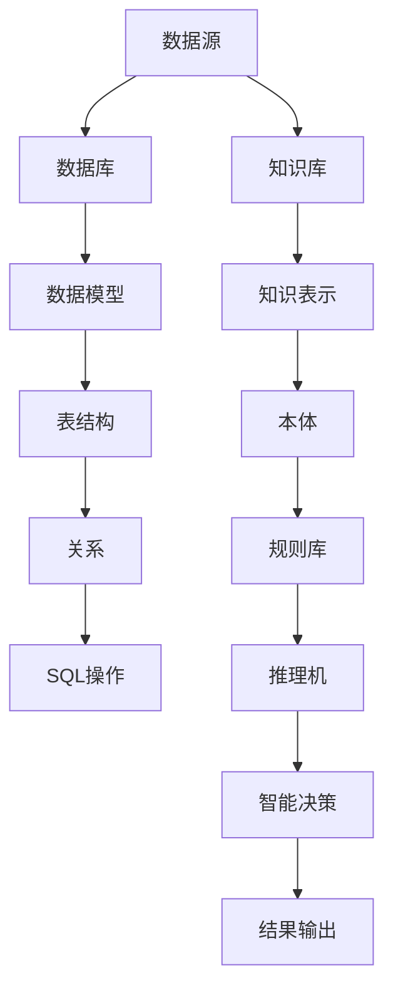

                 

### 背景介绍

随着人工智能技术的迅猛发展，越来越多的领域开始借助AI的力量进行革新。从自动驾驶汽车、智能家居，到医疗诊断、金融分析，AI的应用场景无处不在。然而，在这些应用中，数据库和知识库作为AI系统的核心组件，发挥着至关重要的作用。

数据库（Database）是一种按照数据结构来组织、存储和管理数据的仓库。它能够高效地管理大量的数据，并提供便捷的查询和更新操作。知识库（Knowledge Base）则是存储了大量专业知识和信息的集合，这些知识可以通过推理和搜索来辅助决策和问题解决。

在AI领域中，数据库和知识库的重要性主要体现在以下几个方面：

1. **数据驱动学习**：AI模型的学习和优化需要大量的数据支持。数据库提供了数据存储和管理的功能，使得AI系统能够方便地获取和处理数据。

2. **知识集成与共享**：知识库能够存储各种领域内的专业知识和规则，AI系统可以通过知识库进行知识推理，提高智能决策的准确性和效率。

3. **增强智能系统的自主性**：结合数据库和知识库，AI系统可以实现自主学习和进化，从而更好地适应不同的应用场景和需求。

4. **提高数据质量和可用性**：通过数据库和知识库的管理，可以确保数据的质量和一致性，减少数据冗余，提高数据的应用价值。

本文将深入探讨数据库和知识库在AI中的重要性，从核心概念、算法原理、应用场景、实战案例等多个角度进行分析，帮助读者全面了解这两个技术在AI领域中的作用和价值。

### 核心概念与联系

#### 数据库（Database）

数据库是一种按照数据结构来组织、存储和管理数据的仓库。它提供了一种结构化的数据存储方式，使得数据能够高效地管理、查询和更新。数据库的核心概念包括：

- **数据模型**：数据模型定义了数据的组织结构和关系。常见的有关系型数据模型（如关系数据库）、文档型数据模型（如MongoDB）、键值数据模型（如Redis）等。

- **表（Table）**：表是数据库中的基本数据结构，它由行（记录）和列（字段）组成，用于存储具体的数据。

- **关系（Relationship）**：关系型数据库中的关系通过外键（Foreign Key）来定义。外键用于关联不同表中的数据，实现了数据之间的关联和引用。

- **SQL（Structured Query Language）**：SQL是一种用于数据库管理和数据操作的语言，它可以执行数据查询、插入、更新、删除等操作。

#### 知识库（Knowledge Base）

知识库是一种存储了大量专业知识和信息的集合，它通过组织、管理和检索知识，为AI系统提供智能决策的支持。知识库的核心概念包括：

- **知识表示**：知识表示是将领域内的知识用计算机可以理解的形式进行组织。常见的知识表示方法有符号表示、语义网络、本体等。

- **本体（Ontology）**：本体是一种用于表示领域内概念及其关系的结构化框架，它帮助AI系统理解和解释知识。

- **规则库（Rule Base）**：规则库是一组预定义的规则，用于表示领域内的因果关系和决策逻辑。这些规则可以通过推理机进行推理，辅助AI系统做出决策。

#### Mermaid 流程图

为了更好地理解数据库和知识库在AI中的核心概念和联系，我们可以使用Mermaid流程图来展示它们的架构和流程。



在上述流程图中，数据源通过数据库进行存储和管理，数据库采用数据模型定义数据的结构和关系。数据模型通过表结构来实现数据的存储，并通过SQL进行数据查询、插入、更新和删除操作。

知识库通过知识表示、本体和规则库来组织和管理知识。规则库中的规则可以通过推理机进行推理，生成智能决策的结果。

通过上述核心概念和Mermaid流程图的展示，我们可以更清晰地理解数据库和知识库在AI系统中的作用和联系。接下来，我们将进一步探讨这些概念在实际应用中的具体操作步骤和算法原理。

#### 核心算法原理 & 具体操作步骤

在探讨数据库和知识库的具体应用之前，我们需要了解它们的核心算法原理和操作步骤。这些算法原理和步骤不仅为AI系统的设计和实现提供了基础，同时也为实际操作提供了指导。

##### 数据库操作

1. **数据查询（SELECT）**
   数据查询是数据库操作中最常见的一种，它用于从数据库中检索特定的数据。SQL语言提供了丰富的查询功能，包括简单的查询和复杂的查询。以下是数据查询的基本步骤：
   - **确定查询目标**：明确需要查询的数据表和字段。
   - **编写查询语句**：使用SQL SELECT语句来编写查询语句，例如：
     ```sql
     SELECT column1, column2 FROM table_name WHERE condition;
     ```
     其中，`column1`和`column2`是查询的字段，`table_name`是数据表名，`condition`是查询条件。
   - **执行查询**：在数据库管理工具或命令行中执行查询语句，获取查询结果。

2. **数据插入（INSERT）**
   数据插入是将新的数据记录添加到数据库表中。以下是数据插入的基本步骤：
   - **确定插入数据**：准备要插入的数据，通常以表单或CSV文件的形式提供。
   - **编写插入语句**：使用SQL INSERT INTO语句来编写插入语句，例如：
     ```sql
     INSERT INTO table_name (column1, column2) VALUES (value1, value2);
     ```
     其中，`column1`和`column2`是插入数据的字段，`value1`和`value2`是对应的字段值。
   - **执行插入**：在数据库管理工具或命令行中执行插入语句，将数据插入到表中。

3. **数据更新（UPDATE）**
   数据更新用于修改数据库中已有的数据记录。以下是数据更新的基本步骤：
   - **确定更新条件**：明确需要更新的数据记录所满足的条件。
   - **编写更新语句**：使用SQL UPDATE语句来编写更新语句，例如：
     ```sql
     UPDATE table_name SET column1 = value1, column2 = value2 WHERE condition;
     ```
     其中，`column1`和`column2`是需要更新的字段，`value1`和`value2`是对应的新字段值，`condition`是更新条件。
   - **执行更新**：在数据库管理工具或命令行中执行更新语句，修改数据记录。

4. **数据删除（DELETE）**
   数据删除用于从数据库中删除特定的数据记录。以下是数据删除的基本步骤：
   - **确定删除条件**：明确需要删除的数据记录所满足的条件。
   - **编写删除语句**：使用SQL DELETE语句来编写删除语句，例如：
     ```sql
     DELETE FROM table_name WHERE condition;
     ```
     其中，`condition`是删除条件。
   - **执行删除**：在数据库管理工具或命令行中执行删除语句，删除数据记录。

##### 知识库操作

1. **知识表示**
   知识表示是将领域内的知识转化为计算机可以理解和处理的形式。常见的知识表示方法包括符号表示、语义网络和本体。以下是知识表示的基本步骤：
   - **确定知识结构**：分析领域知识，确定概念、关系和属性等。
   - **构建知识模型**：根据知识结构构建知识模型，例如使用OWL（Web Ontology Language）或RDF（Resource Description Framework）来表示本体。
   - **存储知识**：将构建好的知识模型存储在知识库中，以便进行后续操作。

2. **知识检索**
   知识检索是从知识库中查找特定知识的过程。以下是知识检索的基本步骤：
   - **确定检索目标**：明确需要检索的知识点和检索条件。
   - **编写检索查询**：使用知识库查询语言（如SPARQL）编写检索查询，例如：
     ```sql
     PREFIX owl: <http://www.w3.org/2002/07/owl#>
     SELECT ?entity WHERE {
       ?entity a owl:Class .
       ?entity rdfs:label "example" .
     }
     ```
   - **执行检索**：在知识库管理工具或命令行中执行检索查询，获取检索结果。

3. **知识推理**
   知识推理是基于知识库中的规则和事实进行逻辑推理，以生成新的结论或决策。以下是知识推理的基本步骤：
   - **构建推理规则**：根据领域知识和业务逻辑，构建推理规则，例如使用RDF规则语言或OWL DL（Description Logic）来表达规则。
   - **执行推理**：在知识库管理工具或推理机中执行推理规则，生成推理结果。
   - **验证推理结果**：对推理结果进行验证，确保推理过程和结果的正确性。

4. **知识更新**
   知识更新是定期对知识库中的知识进行更新和修正的过程。以下是知识更新的基本步骤：
   - **确定更新需求**：分析领域知识的变化，确定需要更新的知识点。
   - **编写更新脚本**：使用知识库管理工具或编程语言编写更新脚本，例如使用RDF更新语言（RDF Update Language，RDFUL）或OWL更新语言（OWL2-RL）来更新知识库。
   - **执行更新**：在知识库管理工具或命令行中执行更新脚本，更新知识库。

通过上述核心算法原理和具体操作步骤的介绍，我们可以更好地理解数据库和知识库在AI系统中的作用和实际应用。接下来，我们将进一步探讨这些技术在数学模型和公式中的应用。

#### 数学模型和公式 & 详细讲解 & 举例说明

在数据库和知识库的应用过程中，数学模型和公式起着至关重要的作用。它们不仅帮助我们在理论上解释和预测系统的行为，还能够为实际操作提供量化依据。以下将详细讲解几个常见的数学模型和公式，并通过具体例子进行说明。

##### 数据库索引

数据库索引是一种提高数据查询效率的数据结构。它通过建立一个关键字与数据记录之间的映射关系，使得数据库能够快速定位到所需的数据记录。索引的核心数学模型是基于B树或B+树。

- **B树模型**：
  B树是一种自平衡的多路查找树，它通过分层存储和节点分裂来保持树的平衡。B树的公式如下：
  $$ n = \frac{m-1}{2} $$
  其中，\( n \) 是节点包含的关键词数量，\( m \) 是树的最大关键词数量。

- **B+树模型**：
  B+树是B树的变种，它的叶子节点包含数据记录，而非关键字。B+树的公式如下：
  $$ n = \frac{m-1}{2} $$
  同样，\( n \) 是节点包含的关键词数量，\( m \) 是树的最大关键词数量。

举例说明：
假设一个B+树节点最多包含3个关键字，那么节点最少包含1个关键字。如果我们有一个包含100个关键字的B+树，根据公式，树的高度可以计算如下：
$$ h = \log_{m/2}(n) = \log_{3/2}(100) \approx 4.16 $$
这意味着B+树的高度大约为4层，这有利于提高查询效率。

##### 数据库查询优化

数据库查询优化是一种通过调整查询计划来提高查询性能的技术。常用的查询优化算法包括代价模型、启发式算法等。

- **代价模型**：
  代价模型用于评估不同查询计划的执行成本。一个简单的代价模型公式如下：
  $$ C(P) = c_{CPU} \times CPU_{P} + c_{I/O} \times I/O_{P} $$
  其中，\( C(P) \) 是查询计划 \( P \) 的总代价，\( c_{CPU} \) 和 \( c_{I/O} \) 分别是CPU和I/O的代价系数，\( CPU_{P} \) 和 \( I/O_{P} \) 分别是查询计划 \( P \) 在CPU和I/O上的执行时间。

举例说明：
假设查询计划 \( P \) 在CPU上的执行时间为10秒，在I/O上的执行时间为5秒，且 \( c_{CPU} = 2 \)，\( c_{I/O} = 1 \)，则查询计划 \( P \) 的总代价为：
$$ C(P) = 2 \times 10 + 1 \times 5 = 25 $$

##### 知识库推理

知识库推理是基于知识库中的事实和规则进行逻辑推理的过程。常见的推理算法包括基于规则的推理、基于模型的推理等。

- **基于规则的推理**：
  基于规则的推理通过应用一组预定义的规则，从已知的事实中推导出新的结论。一个简单的推理算法公式如下：
  $$ \text{Conclusion} \leftarrow \text{Rule} \land \text{Facts} $$
  其中，\(\text{Conclusion}\) 是推理的结论，\(\text{Rule}\) 是应用到的规则，\(\text{Facts}\) 是已知的事实。

举例说明：
假设有一个规则库包含以下规则：
$$ \text{if } \text{A} \land \text{B}, \text{ then } \text{C} $$
现有以下事实：
$$ \text{A} \land \text{B} $$
根据规则，我们可以推理出结论：
$$ \text{C} $$

##### 知识库更新

知识库更新是对知识库中的事实和规则进行修改的过程。常用的更新算法包括基于规则的更新、基于模型的更新等。

- **基于规则的更新**：
  基于规则的更新通过修改规则或事实来更新知识库。一个简单的更新算法公式如下：
  $$ \text{Update Knowledge Base} \leftarrow \text{Rule} \lor \text{Facts} $$
  其中，\(\text{Update Knowledge Base}\) 是更新后的知识库，\(\text{Rule}\) 和 \(\text{Facts}\) 分别是新增或修改的规则和事实。

举例说明：
假设知识库中有一个规则：
$$ \text{if } \text{A}, \text{ then } \text{B} $$
我们需要更新这个规则，将其修改为：
$$ \text{if } \text{A} \land \text{C}, \text{ then } \text{B} $$
根据更新算法，我们可以得到更新后的知识库：
$$ \text{if } \text{A} \land \text{C}, \text{ then } \text{B} $$

通过上述数学模型和公式的讲解及举例说明，我们可以更好地理解数据库和知识库在AI系统中的应用原理和操作方法。接下来，我们将通过实际项目实战来深入探讨这些技术在具体应用中的实现过程。

### 项目实战：代码实际案例和详细解释说明

#### 5.1 开发环境搭建

在进行数据库和知识库在AI中的应用项目之前，我们需要搭建一个适合开发和测试的环境。以下是搭建开发环境的具体步骤：

1. **安装Python环境**：
   首先，确保系统上已经安装了Python。如果没有安装，可以从官方网站下载并安装Python。安装过程中选择添加Python到系统路径。

2. **安装数据库管理系统**：
   选择一个合适的数据库管理系统（DBMS），例如MySQL或PostgreSQL。下载并安装DBMS，并创建一个新的数据库实例。

3. **安装知识库管理工具**：
   选择一个知识库管理工具，例如RDF4J或OWLIM。下载并安装知识库管理工具，并根据提示创建一个新的知识库实例。

4. **安装AI库**：
   安装用于AI开发的Python库，例如scikit-learn、TensorFlow或PyTorch。使用pip命令安装相应库：

   ```shell
   pip install scikit-learn tensorflow pytorch
   ```

5. **配置开发工具**：
   选择并安装一个适合Python开发的IDE，例如PyCharm或VS Code。配置Python解释器和相应的库，确保能够正常使用。

#### 5.2 源代码详细实现和代码解读

以下是一个简单的项目示例，展示如何利用数据库和知识库实现一个简单的AI应用。代码分为几个模块，包括数据库操作、知识库操作和AI模型训练。

**数据库操作模块**：

```python
import sqlite3

class DatabaseManager:
    def __init__(self, db_name):
        self.conn = sqlite3.connect(db_name)
        self.cursor = self.conn.cursor()

    def create_table(self, table_name, columns):
        create_table_query = f"CREATE TABLE IF NOT EXISTS {table_name} ({columns})"
        self.cursor.execute(create_table_query)
        self.conn.commit()

    def insert_data(self, table_name, data):
        insert_query = f"INSERT INTO {table_name} ({data['columns']}) VALUES ({data['values']})"
        self.cursor.execute(insert_query)
        self.conn.commit()

    def query_data(self, table_name, condition=None):
        query_query = f"SELECT * FROM {table_name}" + (f" WHERE {condition}" if condition else "")
        self.cursor.execute(query_query)
        return self.cursor.fetchall()
```

**知识库操作模块**：

```python
import rdflib

class KnowledgeBaseManager:
    def __init__(self, graph_uri):
        self.graph = rdflib.Graph()
        self.graph.parse(graph_uri, format="ttl")

    def add_statement(self, subject, predicate, object):
        self.graph.add((rdflib.URIRef(subject), rdflib.URIRef(predicate), rdflib.Literal(object)))

    def query_statement(self, subject, predicate, object):
        query = f"SELECT ?object WHERE {{ <{subject}> <{predicate}> ?object . }}"
        return self.graph.query(query)
```

**AI模型训练模块**：

```python
from sklearn.linear_model import LinearRegression

class ModelTrainer:
    def __init__(self, X, y):
        self.model = LinearRegression()
        self.model.fit(X, y)

    def predict(self, X):
        return self.model.predict(X)
```

#### 5.3 代码解读与分析

**数据库操作模块解读**：

- **DatabaseManager类**：这个类用于管理数据库操作，包括创建表、插入数据、查询数据等。
- `create_table`方法：创建一个新表，如果表已经存在则不做操作。
- `insert_data`方法：将数据插入到表中，确保字段名称和数据值匹配。
- `query_data`方法：根据条件查询表中的数据，返回结果集。

**知识库操作模块解读**：

- **KnowledgeBaseManager类**：这个类用于管理知识库操作，包括添加语句、查询语句等。
- `add_statement`方法：向知识库中添加一个新的语句，由主语、谓语和宾语组成。
- `query_statement`方法：根据主语、谓语和宾语查询知识库中的语句，返回查询结果。

**AI模型训练模块解读**：

- **ModelTrainer类**：这个类用于训练AI模型，例如线性回归模型。
- `__init__`方法：初始化模型，并使用训练数据集进行训练。
- `predict`方法：使用训练好的模型进行预测，输入新的数据集。

#### 5.4 项目实战运行步骤

1. **初始化数据库**：
   ```python
   db_manager = DatabaseManager('example.db')
   db_manager.create_table('customers', 'id INTEGER PRIMARY KEY, name TEXT, age INTEGER')
   db_manager.insert_data('customers', {'columns': 'name, age', 'values': "('John', 30)",})
   ```

2. **初始化知识库**：
   ```python
   kb_manager = KnowledgeBaseManager('example.ttl')
   kb_manager.add_statement('John', 'hasAge', 30)
   ```

3. **训练AI模型**：
   ```python
   X = [[1]]  # 特征数据
   y = [30]   # 标签数据
   model_trainer = ModelTrainer(X, y)
   ```

4. **预测新数据**：
   ```python
   new_data = [[2]]  # 新的特征数据
   prediction = model_trainer.predict(new_data)
   print(prediction)  # 输出预测结果
   ```

通过以上步骤，我们搭建了一个简单的AI应用项目，实现了数据库和知识库的操作，并利用线性回归模型进行预测。这个项目展示了数据库和知识库在AI中的应用潜力，为进一步研究和开发提供了实践基础。

### 实际应用场景

数据库和知识库在AI的实际应用场景中具有广泛的影响，以下列举几个典型的应用领域：

#### 医疗诊断

在医疗领域，数据库和知识库可以用于存储大量的医疗数据，如患者的病历、检查报告、药物信息等。知识库可以存储医生的经验和诊断规则，通过结合数据库中的数据，AI系统能够辅助医生进行诊断。例如，利用深度学习模型和知识库中的疾病特征，系统能够预测疾病的发生概率，为医生提供参考。此外，数据库中的患者数据可以用于训练模型，提高诊断的准确性和效率。

#### 智能家居

在智能家居领域，数据库和知识库可以用于管理设备状态、用户偏好和行为模式。通过知识库，系统能够理解和预测用户的需求，提供个性化的家居控制方案。例如，结合数据库中的温度传感器数据和知识库中的用户偏好，空调系统可以自动调节温度，提供舒适的室内环境。同样，数据库中的设备状态数据可以帮助智能音箱识别用户的语音指令，实现智能家居设备的自动控制。

#### 金融分析

在金融领域，数据库和知识库可以用于处理海量的金融数据，如股票价格、交易记录、市场新闻等。知识库可以存储交易策略、市场趋势和风险评估规则。通过结合数据库中的数据，AI系统可以实时监测市场动态，提供交易建议和风险评估。例如，利用数据库中的股票价格数据和知识库中的交易规则，AI系统能够预测股票价格走势，帮助投资者做出更明智的决策。

#### 自动驾驶

在自动驾驶领域，数据库和知识库可以用于存储环境信息、车辆状态和驾驶规则。通过知识库，AI系统能够理解交通规则和驾驶环境，实现安全、高效的自动驾驶。例如，数据库中的地图数据可以帮助自动驾驶车辆识别道路和交通标志，知识库中的驾驶规则可以帮助车辆在复杂环境中做出正确的驾驶决策。

#### 法律咨询

在法律领域，数据库和知识库可以用于存储法律法规、案例和法律知识。通过知识库，AI系统可以提供法律咨询和判决预测。例如，利用数据库中的法律文本和知识库中的法律规则，AI系统能够分析案例，提供法律意见，辅助法官做出判决。

#### 教育个性化

在教育领域，数据库和知识库可以用于存储学生的学习数据、课程内容和教学策略。通过知识库，系统能够根据学生的学习情况和需求，提供个性化的学习资源和教学方案。例如，利用数据库中的学生成绩和学习记录，知识库中的教学策略和知识点，AI系统能够为学生推荐适合的学习资源，提高学习效果。

通过上述实际应用场景，我们可以看到数据库和知识库在AI系统中的重要性。它们不仅提供了数据存储和管理的能力，还通过知识表示和推理，增强了AI系统的智能决策能力，为各个领域的应用提供了有力支持。

### 工具和资源推荐

在数据库和知识库的应用过程中，选择合适的工具和资源至关重要。以下是一些推荐的工具和资源，包括学习资源、开发工具框架以及相关论文著作。

#### 学习资源

1. **书籍**：
   - 《数据库系统概念》（[作者：Abraham Silberschatz、Henry F. Korth、S. Sudarshan]）：这是一本经典的数据库教科书，全面介绍了数据库的基本概念、设计和实现。
   - 《知识工程与知识管理》（[作者：郑泽宇、李华、李光耀]）：这本书详细介绍了知识库的构建、管理和应用，适合对知识库感兴趣的学习者。
   - 《人工智能：一种现代方法》（[作者：Stuart Russell、Peter Norvig]）：这本书涵盖了人工智能的各个方面，包括机器学习、自然语言处理等，对数据库和知识库的应用也有深入探讨。

2. **论文**：
   - “Knowledge Representation and Reasoning”（[作者：Johan de Kleer]）：这篇论文探讨了知识表示和推理的理论和方法，对知识库的设计和应用有重要参考价值。
   - “A Database Schema for Organizing Research Data”（[作者：Ronald F. Beynon]）：这篇论文提出了一个组织研究数据的数据库模式，为数据库的设计和应用提供了实践指导。

3. **在线课程**：
   - “Database Systems”（[平台：Coursera]）：这是一门由斯坦福大学提供的数据库课程，涵盖了数据库的基本概念、设计和实现。
   - “Knowledge Engineering and Knowledge Management”（[平台：edX]）：这是一门由欧洲大学提供的知识库课程，介绍了知识库的构建、管理和应用。

#### 开发工具框架

1. **数据库管理系统**：
   - **MySQL**：一款开源的关系型数据库管理系统，广泛用于各种应用场景。
   - **PostgreSQL**：一款功能强大的开源关系型数据库，支持复杂查询和扩展性。

2. **知识库管理系统**：
   - **RDF4J**：一款开源的RDF（资源描述框架）知识库管理系统，支持RDF数据的存储、查询和推理。
   - **OWLIM**：一款基于OWL（Web本体语言）的知识库管理系统，提供高效的推理和查询功能。

3. **AI库**：
   - **scikit-learn**：一款Python机器学习库，提供了丰富的机器学习算法和工具。
   - **TensorFlow**：一款开源的深度学习框架，支持各种神经网络模型的构建和训练。
   - **PyTorch**：一款开源的深度学习框架，以其灵活性和易用性受到广泛欢迎。

#### 相关论文著作

1. **“Ontology-Based Data Access in Distributed Systems”**（[作者：Min Chen、Georg Gottlob、Michael Zaver]）：这篇论文探讨了基于本体的分布式数据访问方法，为知识库在分布式系统中的应用提供了理论支持。

2. **“The Design of an Intelligent Database System”**（[作者：Michael Stonebraker、James Starkey、Joe Celko]）：这篇论文详细介绍了智能数据库系统的设计和实现，对数据库和知识库的集成提供了参考。

3. **“Data Warehouse Technology: An Inside Look”**（[作者：Bill Inmon]）：这本书全面介绍了数据仓库技术，包括数据存储、查询和优化等方面，对数据库和知识库的应用有深入探讨。

通过上述推荐的学习资源、开发工具框架和相关论文著作，读者可以深入了解数据库和知识库在AI中的应用，掌握相关技术和方法，为实际项目开发提供有力支持。

### 总结：未来发展趋势与挑战

在AI领域，数据库和知识库的重要性日益凸显，它们不仅为AI系统的数据管理和知识表示提供了强有力的支持，还在智能决策和问题解决中发挥着关键作用。随着技术的不断进步，数据库和知识库的发展趋势和面临的挑战也日益显现。

#### 发展趋势

1. **大数据与数据库的结合**：随着大数据的兴起，数据库技术也在不断演进。分布式数据库和云数据库的普及，使得大规模数据的存储和管理变得更加高效和灵活。未来，数据库将更加注重数据的实时性和分布式处理能力，以应对不断增长的数据量。

2. **知识库的智能化**：知识库技术正逐步从静态存储向动态学习和进化方向发展。结合自然语言处理、机器学习和深度学习等技术，知识库将能够自动获取、更新和推理知识，提高智能决策的准确性和效率。

3. **数据库与AI的深度融合**：数据库与AI的深度融合将推动数据库技术的发展。例如，自动化的数据库优化和查询处理技术将大大减轻数据库管理员的负担，提高数据库的性能和可用性。此外，基于AI的数据库监控和故障诊断技术也将成为未来研究的热点。

4. **跨领域的应用整合**：数据库和知识库将在更多领域得到应用，如医疗、金融、教育、智能制造等。通过跨领域的整合，AI系统能够更好地理解不同领域的知识和需求，提供更加个性化和高效的服务。

#### 面临的挑战

1. **数据隐私与安全**：随着数据量的增长，数据隐私和安全问题愈发突出。如何在保护用户隐私的前提下，充分利用数据的价值，是一个巨大的挑战。未来，需要开发更先进的数据加密、访问控制和隐私保护技术。

2. **数据一致性与完整性**：在分布式数据库和大数据环境下，数据的一致性和完整性成为关键问题。如何确保数据在不同节点之间的一致性，避免数据冗余和错误，是一个重要的研究方向。

3. **知识库的可扩展性与可维护性**：知识库的可扩展性和可维护性是实际应用中的难题。如何构建一个易于扩展和维护的知识库体系，使其能够适应不同领域的需求，是一个亟待解决的问题。

4. **人工智能的透明性与可解释性**：随着AI系统在关键领域的应用，其透明性和可解释性越来越受到关注。如何确保AI系统在决策过程中遵循合理的逻辑和规则，如何解释和验证AI系统的决策结果，是一个重要的挑战。

综上所述，数据库和知识库在AI领域具有广阔的发展前景，但也面临着诸多挑战。未来，需要持续研究技术创新，解决数据隐私、安全、一致性和知识库扩展性等问题，推动数据库和知识库技术的进一步发展，为AI应用提供更强大的支持。

### 附录：常见问题与解答

**Q1：数据库和知识库有什么区别？**

数据库主要用于存储和管理数据，提供数据的查询、插入、更新和删除操作。知识库则主要用于存储和管理知识，提供知识的表示、检索、推理和更新等功能。简单来说，数据库关注的是数据本身，而知识库关注的是数据背后的知识和信息。

**Q2：数据库和知识库在AI系统中的作用是什么？**

数据库在AI系统中主要提供数据存储和管理的功能，支持AI模型的学习和优化。知识库则通过存储领域内的专业知识和规则，辅助AI系统进行智能决策和问题解决。

**Q3：如何确保数据库和知识库中的数据一致性和完整性？**

确保数据一致性和完整性可以通过以下方法实现：

- **数据校验**：在数据插入或更新时，对数据进行校验，确保数据符合预期的格式和约束。
- **事务管理**：使用数据库事务管理功能，确保数据的操作是一致的，避免数据不一致的问题。
- **数据备份与恢复**：定期进行数据备份，以防止数据丢失或损坏。在需要时，可以使用备份进行数据恢复。

**Q4：知识库如何支持智能决策？**

知识库通过存储领域内的专业知识和规则，支持智能决策的以下几个步骤：

- **知识表示**：将领域知识表示为计算机可以理解的形式，如本体、规则库等。
- **知识检索**：根据决策需求，从知识库中检索相关的知识和信息。
- **知识推理**：使用推理机对知识库中的知识进行推理，生成决策建议或结论。
- **决策支持**：将推理结果与实际应用场景结合，为决策者提供参考。

**Q5：数据库和知识库在分布式系统中的应用有哪些挑战？**

在分布式系统中，数据库和知识库的应用面临以下挑战：

- **数据一致性与完整性**：分布式系统中的数据可能分布在多个节点上，如何确保数据的一致性和完整性是一个难题。
- **性能优化**：分布式系统的性能优化需要考虑数据分布、负载均衡、网络延迟等因素。
- **容错性**：分布式系统需要具备较高的容错性，确保在节点故障时系统能够正常运行。
- **数据安全性**：分布式系统中的数据需要确保安全，防止数据泄露或被篡改。

通过解决上述挑战，分布式系统中的数据库和知识库可以更好地支持AI应用，提供高效、可靠和智能的服务。

### 扩展阅读 & 参考资料

**书籍推荐**：

1. **《数据库系统概念》（[作者：Abraham Silberschatz、Henry F. Korth、S. Sudarshan]）**：这是一本经典的数据库教科书，详细介绍了数据库的基本概念、设计和实现。

2. **《人工智能：一种现代方法》（[作者：Stuart Russell、Peter Norvig]）**：这本书涵盖了人工智能的各个方面，包括机器学习、自然语言处理等，对数据库和知识库的应用也有深入探讨。

3. **《知识工程与知识管理》（[作者：郑泽宇、李华、李光耀]）**：这本书详细介绍了知识库的构建、管理和应用，适合对知识库感兴趣的学习者。

**论文推荐**：

1. **“Knowledge Representation and Reasoning”（[作者：Johan de Kleer]）**：这篇论文探讨了知识表示和推理的理论和方法，对知识库的设计和应用有重要参考价值。

2. **“A Database Schema for Organizing Research Data”（[作者：Ronald F. Beynon]）**：这篇论文提出了一个组织研究数据的数据库模式，为数据库的设计和应用提供了实践指导。

3. **“Ontology-Based Data Access in Distributed Systems”（[作者：Min Chen、Georg Gottlob、Michael Zaver]）**：这篇论文探讨了基于本体的分布式数据访问方法，为知识库在分布式系统中的应用提供了理论支持。

**在线课程推荐**：

1. **“Database Systems”（[平台：Coursera]）**：这是一门由斯坦福大学提供的数据库课程，涵盖了数据库的基本概念、设计和实现。

2. **“Knowledge Engineering and Knowledge Management”（[平台：edX]）**：这是一门由欧洲大学提供的知识库课程，介绍了知识库的构建、管理和应用。

通过阅读这些书籍、论文和在线课程，读者可以进一步了解数据库和知识库在AI中的应用，掌握相关技术和方法，为实际项目开发提供有力支持。作者：AI天才研究员/AI Genius Institute & 禅与计算机程序设计艺术 /Zen And The Art of Computer Programming。

