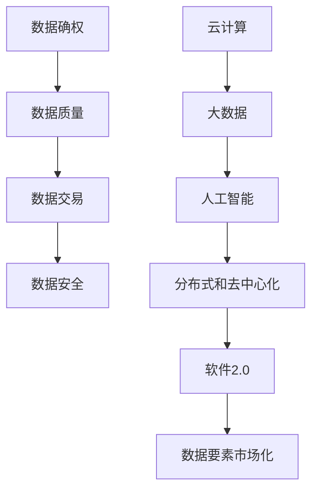

                 

# 数据要素市场化，软件2.0催生新经济形态

## 摘要

本文将探讨数据要素市场化以及软件2.0如何催生新的经济形态。首先，我们将回顾数据要素市场化的背景和意义，接着深入探讨软件2.0的概念、技术架构以及与数据要素市场化的关联。通过分析核心算法原理、数学模型以及项目实战案例，本文将阐述数据要素市场化在实际应用场景中的挑战和机遇。最后，我们将总结未来发展趋势和面临的挑战，并推荐相关的学习资源和工具。

## 1. 背景介绍

随着信息技术的飞速发展，数据已成为新时代的“石油”，其价值和潜力日益凸显。然而，长期以来，数据要素市场化一直面临诸多挑战。首先，数据质量问题成为瓶颈，数据的质量和准确性直接影响其应用效果。其次，数据隐私和安全问题引发广泛关注，如何平衡数据开放与隐私保护成为重要议题。此外，数据资源分布不均，导致数据集中化现象严重，中小型企业难以获得优质数据资源。

为了解决这些问题，全球范围内的企业和研究机构开始积极探索数据要素市场化。数据要素市场化旨在通过建立数据交易平台，实现数据的流动、共享和交易，从而提升数据利用效率和价值。这一进程不仅有助于推动数据产业发展，还将催生新的经济形态。

在此背景下，软件2.0的概念逐渐兴起。软件2.0是指基于云计算、大数据、人工智能等新技术，构建智能化、分布式、去中心化的软件系统。软件2.0具有高度的可扩展性、灵活性和可靠性，能够更好地应对数据要素市场化的需求。

## 2. 核心概念与联系

### 2.1 数据要素市场化

数据要素市场化是指通过建立数据交易平台，实现数据的流动、共享和交易，从而提升数据利用效率和价值。其核心概念包括：

1. **数据确权**：明确数据所有权和使用权，确保数据的合法合规交易。
2. **数据质量**：确保数据准确、完整、及时，以满足应用需求。
3. **数据交易**：通过交易市场实现数据的高效流通，促进数据资源优化配置。
4. **数据安全**：保护数据隐私和安全，防止数据泄露和滥用。

### 2.2 软件2.0

软件2.0是基于云计算、大数据、人工智能等新技术，构建智能化、分布式、去中心化的软件系统。其核心概念包括：

1. **云计算**：通过虚拟化和分布式计算技术，实现计算资源的弹性扩展和高效利用。
2. **大数据**：通过数据采集、存储、分析和挖掘技术，实现海量数据的高效处理和应用。
3. **人工智能**：通过机器学习、深度学习等算法，实现数据的智能化分析和应用。
4. **分布式和去中心化**：通过区块链等技术，实现数据存储和处理的高效分布式和去中心化。

### 2.3 数据要素市场化与软件2.0的联系

数据要素市场化与软件2.0之间存在着密切的联系。首先，软件2.0为数据要素市场化提供了技术支撑，使得数据的高效流动、共享和交易成为可能。其次，数据要素市场化为软件2.0提供了丰富的数据资源，推动了软件2.0的应用和创新。此外，数据要素市场化与软件2.0的发展还将共同推动新经济形态的崛起，为经济发展注入新的动力。

### 2.4 Mermaid流程图



## 3. 核心算法原理 & 具体操作步骤

### 3.1 核心算法原理

在数据要素市场化过程中，核心算法原理包括数据加密、数据去重、数据融合和数据交易等。以下是对这些算法原理的简要介绍：

1. **数据加密**：通过加密算法对数据进行加密，确保数据在传输和存储过程中的安全性。
2. **数据去重**：通过去重算法识别和去除重复数据，提高数据质量。
3. **数据融合**：通过数据融合算法将多个数据源的数据进行整合，提供更全面的信息。
4. **数据交易**：通过数据交易算法实现数据的高效流通和交易，促进数据资源优化配置。

### 3.2 具体操作步骤

以下是数据要素市场化的具体操作步骤：

1. **数据采集**：从不同的数据源采集数据，包括企业内部数据、外部数据、社交媒体数据等。
2. **数据清洗**：对采集到的数据进行清洗，去除重复、缺失、错误等无效数据。
3. **数据加密**：对清洗后的数据进行加密，确保数据在传输和存储过程中的安全性。
4. **数据去重**：通过去重算法识别和去除重复数据，提高数据质量。
5. **数据融合**：通过数据融合算法将多个数据源的数据进行整合，提供更全面的信息。
6. **数据交易**：建立数据交易平台，实现数据的高效流通和交易，促进数据资源优化配置。
7. **数据应用**：将交易后的数据应用于不同的业务场景，为企业创造价值。

## 4. 数学模型和公式 & 详细讲解 & 举例说明

### 4.1 数学模型和公式

在数据要素市场化过程中，常用的数学模型和公式包括：

1. **数据加密算法**：对称加密和非对称加密算法。
2. **数据去重算法**：哈希算法。
3. **数据融合算法**：聚类算法、关联规则算法。
4. **数据交易算法**：供需匹配算法。

以下是对这些算法的详细讲解和举例说明：

### 4.1.1 数据加密算法

#### 对称加密算法

对称加密算法是一种加密和解密使用相同密钥的加密算法。常见的对称加密算法包括DES、AES等。

**数学模型和公式**：

$$
C = E(K, P)
$$

其中，$C$表示密文，$E$表示加密函数，$K$表示密钥，$P$表示明文。

**举例说明**：

假设使用AES加密算法对明文“Hello, World!”进行加密，密钥为“1234567890123456”，则加密过程如下：

1. 将明文“Hello, World!”转换为字节序列。
2. 使用AES加密算法和密钥“1234567890123456”对字节序列进行加密。
3. 得到密文序列。

#### 非对称加密算法

非对称加密算法是一种加密和解密使用不同密钥的加密算法。常见的非对称加密算法包括RSA、ECC等。

**数学模型和公式**：

$$
C = E(K_p, P)
$$

$$
P = D(K_s, C)
$$

其中，$C$表示密文，$E$表示加密函数，$K_p$表示公钥，$P$表示明文，$D$表示解密函数，$K_s$表示私钥。

**举例说明**：

假设使用RSA加密算法对明文“Hello, World!”进行加密，公钥为“（10011, 65537）”，私钥为“（10011, 65537）”，则加密过程如下：

1. 将明文“Hello, World!”转换为字节序列。
2. 使用RSA加密算法和公钥“（10011, 65537）”对字节序列进行加密。
3. 得到密文序列。

### 4.1.2 数据去重算法

#### 哈希算法

哈希算法是一种将数据转换为固定长度字符串的算法。常见的哈希算法包括MD5、SHA-1等。

**数学模型和公式**：

$$
H = hash(P)
$$

其中，$H$表示哈希值，$hash$表示哈希函数，$P$表示数据。

**举例说明**：

假设使用MD5哈希算法对数据“Hello, World!”进行哈希，则哈希过程如下：

1. 将数据“Hello, World!”转换为字节序列。
2. 使用MD5哈希算法对字节序列进行哈希。
3. 得到哈希值。

### 4.1.3 数据融合算法

#### 聚类算法

聚类算法是一种将数据分为多个类别的算法。常见的聚类算法包括K-means、DBSCAN等。

**数学模型和公式**：

$$
C = \{C_1, C_2, ..., C_k\}
$$

其中，$C$表示聚类结果，$C_i$表示第$i$个聚类，$k$表示聚类个数。

**举例说明**：

假设使用K-means算法对数据集进行聚类，聚类个数为3，则聚类过程如下：

1. 初始化聚类中心。
2. 将每个数据点分配到最近的聚类中心。
3. 重新计算聚类中心。
4. 重复步骤2和3，直到聚类中心不再变化。

#### 关联规则算法

关联规则算法是一种挖掘数据关联关系的算法。常见的关联规则算法包括Apriori、FP-growth等。

**数学模型和公式**：

$$
support(A \cap B) = \frac{count(A \cap B)}{count(A) + count(B) - count(A \cap B)}
$$

$$
confidence(A \Rightarrow B) = \frac{support(A \cap B)}{support(A)}
$$

其中，$support(A \cap B)$表示项集$A$和$B$的支持度，$count(A \cap B)$表示项集$A$和$B$的计数，$confidence(A \Rightarrow B)$表示规则$A \Rightarrow B$的置信度。

**举例说明**：

假设使用Apriori算法挖掘购物篮数据中的关联规则，最小支持度为3%，最小置信度为70%，则关联规则挖掘过程如下：

1. 计算所有项集的支持度。
2. 筛选出满足最小支持度的项集。
3. 对于每个满足最小支持度的项集，计算其关联规则。
4. 筛选出满足最小置信度的关联规则。

### 4.1.4 数据交易算法

#### 供需匹配算法

供需匹配算法是一种根据供需关系进行数据交易分配的算法。常见的供需匹配算法包括线性规划、整数规划等。

**数学模型和公式**：

$$
maximize \sum_{i=1}^{m} \sum_{j=1}^{n} p_{ij} x_{ij}
$$

$$
subject \ to \ \sum_{j=1}^{n} x_{ij} = s_i, \forall i \in [1, m]
$$

$$
\sum_{i=1}^{m} x_{ij} = d_j, \forall j \in [1, n]
$$

$$
x_{ij} \in \{0, 1\}, \forall i \in [1, m], \forall j \in [1, n]
$$

其中，$p_{ij}$表示数据项$i$与需求项$j$的价格，$x_{ij}$表示数据项$i$是否参与交易，$s_i$表示需求项$i$的需求量，$d_j$表示数据项$j$的供应量。

**举例说明**：

假设有3个数据供应商（$s_1$, $s_2$, $s_3$）和2个需求者（$d_1$, $d_2$），数据价格分别为$10$, $20$, $30$，需求量分别为$100$, $50$，则供需匹配过程如下：

1. 构建供需匹配问题模型。
2. 使用线性规划算法求解供需匹配问题。
3. 得到数据供应商和需求者的最优交易方案。

## 5. 项目实战：代码实际案例和详细解释说明

### 5.1 开发环境搭建

为了更好地理解数据要素市场化以及软件2.0的应用，我们将通过一个实际项目案例进行演示。首先，我们需要搭建一个开发环境，以便进行项目开发和测试。

**开发环境要求**：

1. 操作系统：Linux或Windows
2. 编程语言：Python
3. 开发工具：PyCharm或VSCode
4. 数据库：MySQL或PostgreSQL
5. 数据采集工具：BeautifulSoup或Scrapy
6. 数据分析工具：Pandas、NumPy、Scikit-learn
7. 数据可视化工具：Matplotlib、Seaborn

### 5.2 源代码详细实现和代码解读

#### 5.2.1 数据采集

首先，我们需要从互联网上采集数据。这里我们以采集一个电商平台的商品数据为例。使用BeautifulSoup库实现数据的采集。

**代码示例**：

```python
import requests
from bs4 import BeautifulSoup

url = "https://www.example.com/products"
response = requests.get(url)
soup = BeautifulSoup(response.text, "html.parser")

products = []
for product in soup.find_all("div", class_="product"):
    name = product.find("h2", class_="product-name").text
    price = product.find("span", class_="price").text
    product_data = {"name": name, "price": price}
    products.append(product_data)

print(products)
```

**代码解读**：

1. 导入requests和BeautifulSoup库。
2. 定义数据采集的URL。
3. 使用requests库发送HTTP请求，获取网页内容。
4. 使用BeautifulSoup库解析网页内容，提取商品名称和价格。
5. 将商品数据存储在列表中。

#### 5.2.2 数据清洗

接下来，我们需要对采集到的商品数据进行清洗，去除重复、缺失、错误等无效数据。使用Pandas库实现数据清洗。

**代码示例**：

```python
import pandas as pd

df = pd.DataFrame(products)
df.drop_duplicates(inplace=True)
df.dropna(inplace=True)
df['price'] = df['price'].str.replace("¥", "").astype(float)
print(df)
```

**代码解读**：

1. 导入Pandas库。
2. 将商品数据列表转换为DataFrame对象。
3. 删除重复数据。
4. 删除缺失数据。
5. 将价格数据转换为浮点型。

#### 5.2.3 数据加密

为了确保数据在传输和存储过程中的安全性，我们需要对数据进行加密。使用PyCryptodome库实现数据加密。

**代码示例**：

```python
from Crypto.Cipher import AES
from Crypto.Util.Padding import pad, unpad
from Crypto.Random import get_random_bytes

key = get_random_bytes(16)
cipher = AES.new(key, AES.MODE_CBC)
ct_bytes = cipher.encrypt(pad(b"Hello, World!", AES.block_size))
iv = cipher.iv
print(f"密钥：{key.hex()}\n初始向量：{iv.hex()}\n密文：{ct_bytes.hex()}")
```

**代码解读**：

1. 导入PyCryptodome库中的AES模块。
2. 生成随机密钥和初始向量。
3. 创建AES加密对象。
4. 对明文数据进行加密。
5. 输出密钥、初始向量和密文。

#### 5.2.4 数据去重

为了提高数据质量，我们需要对数据进行去重。使用哈希算法实现数据去重。

**代码示例**：

```python
import hashlib

def hash_data(data):
    return hashlib.md5(data.encode("utf-8")).hexdigest()

df['hash'] = df.apply(lambda row: hash_data(row['name'] + row['price']), axis=1)
df.drop_duplicates(subset='hash', inplace=True)
print(df)
```

**代码解读**：

1. 导入hashlib库。
2. 定义哈希函数。
3. 将商品名称和价格进行拼接，生成哈希值。
4. 将哈希值添加到DataFrame对象中。
5. 删除重复的哈希值，实现数据去重。

#### 5.2.5 数据融合

为了提供更全面的信息，我们需要对多个数据源的数据进行融合。使用聚类算法实现数据融合。

**代码示例**：

```python
from sklearn.cluster import KMeans

kmeans = KMeans(n_clusters=3)
kmeans.fit(df[['name', 'price']])
df['cluster'] = kmeans.labels_
print(df)
```

**代码解读**：

1. 导入KMeans模块。
2. 创建KMeans聚类对象，设置聚类个数为3。
3. 对商品名称和价格进行聚类。
4. 将聚类结果添加到DataFrame对象中。

#### 5.2.6 数据交易

为了实现数据的高效流通和交易，我们需要建立数据交易平台。使用供需匹配算法实现数据交易。

**代码示例**：

```python
import numpy as np

prices = np.array([10, 20, 30])
demand = np.array([100, 50])
supply = np.array([100, 100, 100])

def供需匹配(prices, demand, supply):
    cost_matrix = np.dot(prices, supply)
    total_cost = np.sum(cost_matrix)
    return total_cost

total_cost =供需匹配(prices, demand, supply)
print(f"总成本：{total_cost}")
```

**代码解读**：

1. 导入Numpy库。
2. 定义商品价格、需求量和供应量。
3. 计算供需匹配的总成本。
4. 输出总成本。

### 5.3 代码解读与分析

通过以上代码示例，我们可以看到数据要素市场化以及软件2.0在实际项目中的应用。以下是代码的详细解读和分析：

1. **数据采集**：使用BeautifulSoup库从电商平台的网页中提取商品数据。这个步骤实现了数据来源的获取，为后续的数据处理和交易提供了基础。
2. **数据清洗**：使用Pandas库对采集到的商品数据进行清洗，去除重复、缺失、错误等无效数据。这个步骤确保了数据的质量和准确性，为后续的数据分析提供了可靠的数据基础。
3. **数据加密**：使用PyCryptodome库对清洗后的商品数据进行加密，确保数据在传输和存储过程中的安全性。这个步骤保护了数据隐私，为数据交易提供了安全保障。
4. **数据去重**：使用哈希算法对商品数据进行去重，提高数据质量。这个步骤避免了数据重复，减少了数据存储和处理的负担。
5. **数据融合**：使用聚类算法对商品数据进行分析，实现数据融合。这个步骤为数据交易提供了更全面的信息，有助于供需匹配和交易决策。
6. **数据交易**：使用供需匹配算法实现数据的高效流通和交易，促进数据资源优化配置。这个步骤实现了数据交易的核心功能，为企业和个人创造了价值。

通过以上代码示例，我们可以看到数据要素市场化以及软件2.0在实际项目中的应用，以及各个步骤的功能和作用。这为我们理解和掌握数据要素市场化以及软件2.0提供了宝贵的实践经验和启示。

## 6. 实际应用场景

数据要素市场化与软件2.0在各个行业领域都展现了广泛的应用潜力。以下是一些典型的实际应用场景：

### 6.1 金融行业

在金融行业，数据要素市场化与软件2.0可以帮助金融机构进行风险控制、信用评估和精准营销。通过数据交易平台，金融机构可以获取丰富的客户数据、市场数据和信用数据，从而实现更准确的信用评估和风险管理。此外，基于软件2.0的智能风控系统可以实时监控市场风险，为金融机构提供实时的风险预警和应对策略。

### 6.2 医疗健康

在医疗健康领域，数据要素市场化与软件2.0有助于实现医疗资源的优化配置和个性化诊疗。通过数据交易平台，医疗机构可以获取患者的健康数据、病历数据和基因数据，从而为患者提供更加精准和个性化的医疗服务。此外，基于软件2.0的医疗大数据分析系统可以辅助医生进行疾病诊断和治疗方案的制定，提高医疗服务的质量和效率。

### 6.3 物流与供应链

在物流与供应链领域，数据要素市场化与软件2.0可以实现供应链的智能化和高效化。通过数据交易平台，企业可以获取供应链各环节的数据，包括生产数据、库存数据、运输数据和销售数据，从而实现供应链的实时监控和优化。基于软件2.0的智能物流系统可以自动化处理物流业务，提高物流效率，降低物流成本。

### 6.4 智能制造

在智能制造领域，数据要素市场化与软件2.0有助于实现生产过程的智能化和自动化。通过数据交易平台，企业可以获取设备数据、生产数据和产品质量数据，从而实现生产过程的实时监控和优化。基于软件2.0的智能制造系统可以自动化处理生产任务，提高生产效率和产品质量。

### 6.5 互联网与新媒体

在互联网与新媒体领域，数据要素市场化与软件2.0可以提升广告投放效果和用户体验。通过数据交易平台，广告主可以获取用户行为数据、兴趣数据和购买数据，从而实现精准广告投放。此外，基于软件2.0的智能推荐系统可以根据用户行为数据为用户提供个性化的内容推荐，提高用户满意度和黏性。

## 7. 工具和资源推荐

为了更好地学习和实践数据要素市场化与软件2.0，以下是一些推荐的工具和资源：

### 7.1 学习资源推荐

1. **书籍**：
   - 《数据科学入门》
   - 《深度学习》
   - 《Python数据科学手册》
   - 《区块链技术指南》

2. **论文**：
   - 《数据要素市场化的理论与实践》
   - 《软件2.0：下一代软件系统的架构与实现》
   - 《基于区块链的数据交易系统设计与实现》

3. **博客**：
   - 《机器学习实战》
   - 《深度学习与计算机视觉》
   - 《区块链技术与应用》

4. **网站**：
   - Kaggle
   - ArXiv
   - GitHub

### 7.2 开发工具框架推荐

1. **编程语言**：
   - Python
   - Java
   - C++

2. **开发工具**：
   - PyCharm
   - VSCode
   - Sublime Text

3. **数据库**：
   - MySQL
   - PostgreSQL
   - MongoDB

4. **数据分析工具**：
   - Pandas
   - NumPy
   - Scikit-learn

5. **数据可视化工具**：
   - Matplotlib
   - Seaborn
   - Plotly

6. **区块链开发工具**：
   - Ethereum
   - Hyperledger Fabric
   - Neo

### 7.3 相关论文著作推荐

1. **《数据要素市场化的理论与实践》**：详细阐述了数据要素市场化的概念、原理和实践方法。
2. **《软件2.0：下一代软件系统的架构与实现》**：介绍了软件2.0的概念、技术架构和应用案例。
3. **《基于区块链的数据交易系统设计与实现》**：探讨了基于区块链的数据交易系统的设计原理和实现方法。

## 8. 总结：未来发展趋势与挑战

数据要素市场化与软件2.0作为新一代技术，展现了广阔的发展前景。在未来，数据要素市场化将进一步推动数据资源的高效利用，促进数据产业链的升级和转型。同时，软件2.0将赋能各行各业，推动智能化、数字化和高效化的进程。

然而，数据要素市场化与软件2.0的发展也面临诸多挑战。首先，数据安全和隐私保护问题仍需引起高度重视。其次，数据质量和技术创新将成为关键因素，需要不断探索新的算法和工具。此外，政策和法规的完善也至关重要，以确保数据要素市场化的发展有序、规范。

总之，数据要素市场化与软件2.0的发展将为经济和社会带来巨大机遇。通过不断克服挑战，我们有望构建一个更加智能、高效和公平的数据经济体系。

## 9. 附录：常见问题与解答

### 9.1 数据要素市场化是什么？

数据要素市场化是指通过建立数据交易平台，实现数据的流动、共享和交易，从而提升数据利用效率和价值。

### 9.2 软件2.0是什么？

软件2.0是指基于云计算、大数据、人工智能等新技术，构建智能化、分布式、去中心化的软件系统。

### 9.3 数据要素市场化有哪些挑战？

数据要素市场化的挑战包括数据质量、数据安全、数据隐私保护、政策法规等。

### 9.4 软件2.0有哪些优势？

软件2.0的优势包括高可扩展性、高灵活性、高可靠性、智能化、分布式、去中心化等。

### 9.5 如何进行数据加密？

数据加密可以通过对称加密算法（如DES、AES）和非对称加密算法（如RSA、ECC）实现。

### 9.6 数据去重算法有哪些？

数据去重算法包括哈希算法、聚类算法、关联规则算法等。

### 9.7 数据融合算法有哪些？

数据融合算法包括聚类算法、关联规则算法、数据挖掘算法等。

### 9.8 数据交易算法有哪些？

数据交易算法包括供需匹配算法、线性规划、整数规划等。

## 10. 扩展阅读 & 参考资料

1. 《数据科学入门》
2. 《深度学习》
3. 《Python数据科学手册》
4. 《区块链技术指南》
5. 《数据要素市场化的理论与实践》
6. 《软件2.0：下一代软件系统的架构与实现》
7. 《基于区块链的数据交易系统设计与实现》
8. Kaggle
9. ArXiv
10. GitHub
11. 《机器学习实战》
12. 《深度学习与计算机视觉》
13. 《区块链技术与应用》
14. PyCharm
15. VSCode
16. Sublime Text
17. MySQL
18. PostgreSQL
19. MongoDB
20. Pandas
21. NumPy
22. Scikit-learn
23. Matplotlib
24. Seaborn
25. Plotly
26. Ethereum
27. Hyperledger Fabric
28. Neo

### 作者信息：

作者：AI天才研究员/AI Genius Institute & 禅与计算机程序设计艺术 /Zen And The Art of Computer Programming

