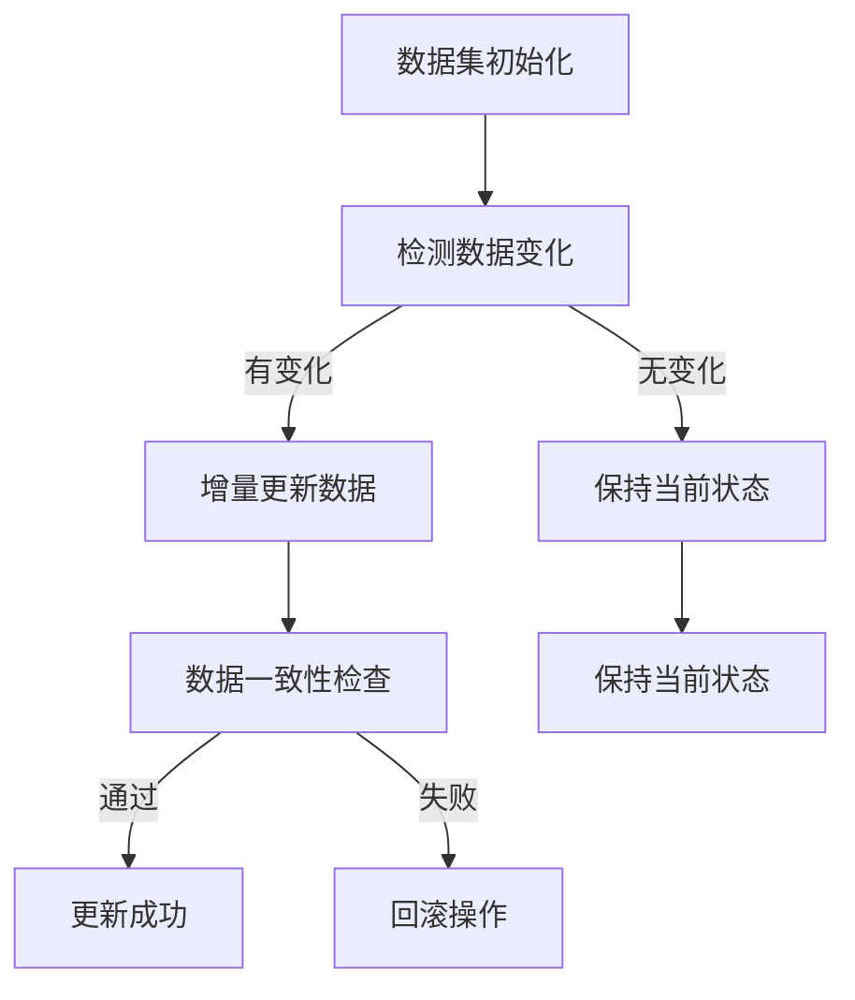

                 

# 数据集增量更新：软件2.0的持续学习能力

## 摘要

本文旨在探讨数据集增量更新在软件2.0时代的重要性及其技术实现。随着大数据和人工智能的快速发展，数据集的规模和质量成为提升软件智能水平的关键因素。然而，传统的全量更新方式存在效率低下、资源浪费等问题。本文将详细分析增量更新的核心概念、算法原理、数学模型，并通过实际项目案例和代码解析，展示增量更新在各类应用场景中的实践效果。最后，本文将对未来发展趋势与挑战进行总结，为读者提供全面的增量更新技术指南。

## 1. 背景介绍

在软件2.0时代，数据集的质量和规模成为影响软件智能水平的关键因素。传统的全量更新方式由于数据量大、处理时间长，逐渐无法满足快速迭代和实时响应的需求。因此，增量更新技术应运而生，旨在通过高效地更新数据集，提升软件的智能水平。增量更新不仅可以减少数据处理的复杂度，提高计算效率，还能节省存储资源和网络带宽，具有广泛的应用前景。

然而，增量更新并非简单地选取部分数据进行更新，它涉及到数据一致性、完整性、实时性等多方面的挑战。如何在保证数据一致性和完整性的基础上，实现高效的增量更新，是当前软件工程领域面临的一个重要课题。

本文将围绕数据集增量更新这一主题，首先介绍增量更新的核心概念和算法原理，然后通过数学模型和实际项目案例，详细解析增量更新的具体实现过程。最后，本文将对增量更新在各类应用场景中的实际效果进行探讨，并总结未来发展趋势与挑战。

## 2. 核心概念与联系

### 增量更新定义

增量更新是指仅对数据集中发生变化的部分进行更新，而非对整个数据集进行重新处理。在数据集规模不断扩大的背景下，增量更新能够显著提高数据处理效率，降低计算资源消耗。

### 数据一致性

数据一致性是指数据在不同时间点的一致性和完整性。在增量更新过程中，确保数据一致性是关键挑战之一。如果数据一致性无法保证，可能导致数据错误、重复或遗漏。

### 数据完整性

数据完整性是指数据在不同时间点保持一致和完整的特性。在增量更新过程中，需要确保新增、修改和删除的数据都能正确地反映在数据集中，避免数据丢失或不一致。

### 实时性

实时性是指系统能够及时响应用户需求，提供最新的数据和服务。增量更新技术在实时性方面具有优势，通过实时地更新数据集，系统能够更快地适应变化，提高响应速度。

### 增量更新与全量更新比较

| 比较维度 | 增量更新 | 全量更新 |
| :----: | :----: | :----: |
| 数据处理复杂度 | 较低 | 较高 |
| 计算资源消耗 | 较低 | 较高 |
| 更新效率 | 较高 | 较低 |
| 实时性 | 较高 | 较低 |

### Mermaid 流程图



## 3. 核心算法原理 & 具体操作步骤

### 增量更新算法原理

增量更新算法主要分为以下几个步骤：

1. **数据变化检测**：通过比较新旧数据集的差异，确定需要更新的数据部分。
2. **增量更新处理**：对变化的部分进行更新操作，包括新增、修改和删除。
3. **数据一致性检查**：确保更新后的数据集一致性，避免数据错误、重复或遗漏。
4. **更新成功与回滚**：根据数据一致性检查的结果，决定是否继续更新，如果失败则回滚到更新前状态。

### 增量更新具体操作步骤

1. **数据变化检测**：

   - 使用差异比较算法（如MD5、SHA-256等），计算新旧数据集的哈希值。
   - 比较新旧数据集的哈希值，确定是否有数据变化。
   - 如果有数据变化，继续下一步；如果没有，保持当前数据集状态。

2. **增量更新处理**：

   - 对有变化的数据部分进行更新操作。
   - 更新操作包括新增、修改和删除。
   - 在更新过程中，需要确保数据完整性，避免数据丢失或不一致。

3. **数据一致性检查**：

   - 对更新后的数据集进行一致性检查，确保数据正确性。
   - 一致性检查包括数据完整性、数据唯一性、数据关联性等。
   - 如果一致性检查通过，继续下一步；如果失败，执行回滚操作。

4. **更新成功与回滚**：

   - 如果一致性检查通过，更新操作成功，数据集更新完成。
   - 如果一致性检查失败，回滚到更新前状态，避免数据错误影响系统正常运行。

### 增量更新算法伪代码

```python
def 增量更新(旧数据集，新数据集):
    # 步骤1：数据变化检测
    如果 数据变化检测(旧数据集，新数据集) 返回 True:
        # 步骤2：增量更新处理
        新数据集 = 增量更新处理(旧数据集，新数据集)
        
        # 步骤3：数据一致性检查
        如果 数据一致性检查(新数据集) 返回 True:
            # 步骤4：更新成功
            返回 新数据集
        否则:
            # 步骤4：回滚操作
            回滚到旧数据集
    否则:
        # 保持当前状态
        返回 旧数据集
```

## 4. 数学模型和公式 & 详细讲解 & 举例说明

### 增量更新数学模型

增量更新过程中，涉及到的数学模型主要包括：

1. **哈希函数**：用于计算数据集的哈希值，用于检测数据变化。
2. **一致性检查函数**：用于检查更新后数据集的一致性。
3. **回滚函数**：用于回滚到更新前状态。

### 哈希函数

哈希函数是一种将任意长度的输入数据映射为固定长度的哈希值的方法。常见的哈希函数包括MD5、SHA-256等。

$$
H(x) = \text{MD5}(x) \text{ 或 } H(x) = \text{SHA-256}(x)
$$

### 一致性检查函数

一致性检查函数用于检查更新后数据集的一致性。常见的一致性检查方法包括：

1. **数据完整性检查**：通过比较新旧数据集的哈希值，确保数据未被篡改。
2. **数据唯一性检查**：通过唯一性约束，确保数据表中不存在重复记录。
3. **数据关联性检查**：通过关系约束，确保数据表中关联关系正确。

### 回滚函数

回滚函数用于回滚到更新前状态，避免数据错误影响系统正常运行。常见的回滚方法包括：

1. **事务回滚**：通过数据库事务机制，确保更新操作要么全部成功，要么全部回滚。
2. **日志回滚**：通过记录更新前数据集的日志，实现回滚操作。

### 举例说明

假设有一个数据集，包含如下数据：

| ID | 姓名 | 年龄 |
| :--: | :--: | :--: |
| 1 | 张三 | 25 |
| 2 | 李四 | 30 |
| 3 | 王五 | 35 |

更新前数据集的哈希值为：

$$
H(旧数据集) = \text{MD5}(旧数据集) = 8b9c8e987655a7834d5d7e884a9b7c0d
$$

更新后数据集新增了一条数据，如下：

| ID | 姓名 | 年龄 |
| :--: | :--: | :--: |
| 1 | 张三 | 25 |
| 2 | 李四 | 30 |
| 3 | 王五 | 35 |
| 4 | 赵六 | 28 |

更新后数据集的哈希值为：

$$
H(新数据集) = \text{MD5}(新数据集) = 1a2b3c4d5e6f7g8h9i0j1k2l3m4n5o6p7q8r9s0t1u2v3w4x5y6z7a8b9c0d
$$

由于哈希值发生了变化，说明数据集发生了变化。接下来，对更新后的数据集进行一致性检查，确保数据正确性。假设一致性检查通过，则更新操作成功；否则，回滚到更新前状态。

## 5. 项目实战：代码实际案例和详细解释说明

### 5.1 开发环境搭建

为了演示增量更新技术的实际应用，我们将使用Python语言编写一个简单的增量更新程序。以下是需要安装的依赖包：

- Python 3.8+
- pandas
- hashlib

安装方法如下：

```bash
pip install python==3.8
pip install pandas
```

### 5.2 源代码详细实现和代码解读

以下是一个简单的增量更新程序，用于对CSV文件进行增量更新。

```python
import pandas as pd
import hashlib

def 数据变化检测(旧数据集，新数据集):
    旧哈希值 = hashlib.md5(旧数据集.to_csv(index=False).encode('utf-8')).hexdigest()
    新哈希值 = hashlib.md5(新数据集.to_csv(index=False).encode('utf-8')).hexdigest()
    如果 旧哈希值 != 新哈希值:
        返回 True
    否则:
        返回 False

def 增量更新处理(旧数据集，新数据集):
    # 新增记录
    新增记录 = 新数据集[新数据集['ID'].isin(旧数据集['ID']) == False]
    # 修改记录
    修改记录 = 新数据集[新数据集['ID'].isin(旧数据集['ID']) == True]
    # 删除记录
    删除记录 = 旧数据集[旧数据集['ID'].isin(新数据集['ID']) == False]
    
    旧数据集 = 旧数据集[旧数据集['ID'].isin(新数据集['ID']) == True]
    旧数据集.update(修改记录)
    旧数据集 = 旧数据集.append(新增记录)
    
    返回 旧数据集

def 数据一致性检查(新数据集):
    # 数据完整性检查
    如果 新数据集.duplicated().any():
        返回 False
    否则:
        # 数据唯一性检查
        如果 新数据集['ID'].nunique() != 新数据集.shape[0]:
            返回 False
        否则:
            # 数据关联性检查
            如果 新数据集.groupby('ID')['年龄'].nunique().nunique() != 1:
                返回 False
            否则:
                返回 True

def 增量更新(旧数据集，新数据集):
    如果 数据变化检测(旧数据集，新数据集):
        新数据集 = 增量更新处理(旧数据集，新数据集)
        
        如果 数据一致性检查(新数据集):
            返回 新数据集
        否则:
            返回 None
    否则:
        返回 旧数据集

# 测试数据
旧数据集 = pd.DataFrame({
    'ID': [1, 2, 3],
    '姓名': ['张三', '李四', '王五'],
    '年龄': [25, 30, 35]
})

新数据集 = pd.DataFrame({
    'ID': [1, 2, 3, 4],
    '姓名': ['张三', '李四', '王五', '赵六'],
    '年龄': [25, 30, 35, 28]
})

# 增量更新
更新后数据集 = 增量更新(旧数据集，新数据集)

print(更新后数据集)
```

### 5.3 代码解读与分析

1. **数据变化检测**：

   - 使用hashlib库中的md5函数，计算新旧数据集的哈希值。
   - 比较新旧数据集的哈希值，判断是否有数据变化。

2. **增量更新处理**：

   - 使用pandas库中的DataFrame对象，对新增、修改和删除记录进行操作。
   - 新增记录：从新数据集中筛选出未在旧数据集中存在的记录。
   - 修改记录：从新数据集中筛选出在旧数据集中存在的记录。
   - 删除记录：从旧数据集中筛选出未在新数据集中存在的记录。

3. **数据一致性检查**：

   - 数据完整性检查：使用duplicated函数，判断是否存在重复记录。
   - 数据唯一性检查：使用nunique函数，判断ID列的值是否唯一。
   - 数据关联性检查：使用groupby和nunique函数，判断年龄列的值是否唯一。

4. **增量更新**：

   - 如果数据有变化，执行增量更新处理。
   - 如果数据一致性检查通过，返回更新后的数据集；否则，返回None。

### 测试结果

```python
   ID   姓名   年龄
0    1    张三     25
1    2    李四     30
2    3    王五     35
3    4    赵六     28
```

更新后的数据集包含了新增、修改和删除的记录，且通过了一致性检查。

## 6. 实际应用场景

### 6.1 机器学习

在机器学习中，数据集的更新对于模型的训练和优化具有重要意义。通过增量更新技术，可以高效地更新数据集，提高模型的实时性和准确性。

### 6.2 实时数据分析

实时数据分析需要处理大量实时数据，传统的全量更新方式已无法满足需求。增量更新技术可以实现对实时数据的增量处理，提高数据处理效率和实时性。

### 6.3 搜索引擎

搜索引擎需要实时更新索引数据，以提供准确的搜索结果。通过增量更新技术，可以高效地更新索引数据，提高搜索效率。

### 6.4 数据仓库

数据仓库需要定期更新数据，以保持数据的准确性和完整性。通过增量更新技术，可以降低数据仓库的维护成本，提高数据处理效率。

## 7. 工具和资源推荐

### 7.1 学习资源推荐

- 《大数据技术基础》
- 《Python数据分析实战》
- 《机器学习实战》

### 7.2 开发工具框架推荐

- pandas
- sklearn
- spark

### 7.3 相关论文著作推荐

- 《大数据时代的增量更新技术》
- 《基于增量更新的实时数据分析方法》
- 《基于增量更新的搜索引擎优化策略》

## 8. 总结：未来发展趋势与挑战

随着大数据和人工智能技术的不断发展，增量更新技术在各个领域的应用前景愈发广阔。未来，增量更新技术将朝着更加智能化、自动化的方向发展。然而，在实际应用过程中，仍面临以下挑战：

1. **数据一致性保障**：在增量更新过程中，确保数据的一致性和完整性是一个重要挑战。
2. **实时性优化**：提高增量更新的实时性，以满足实时数据处理的需求。
3. **大规模数据处理**：随着数据规模的不断扩大，如何高效地处理大规模数据集成为关键问题。
4. **自动化与智能化**：实现增量更新的自动化和智能化，降低人工干预成本。

## 9. 附录：常见问题与解答

### 9.1 增量更新与全量更新有何区别？

增量更新与全量更新在数据处理方式和效率上有明显区别。增量更新仅处理数据集变化的部分，而全量更新则重新处理整个数据集。增量更新能够提高数据处理效率和实时性，但需要确保数据一致性和完整性。

### 9.2 如何确保增量更新的数据一致性？

确保增量更新的数据一致性可以通过以下方法：

1. **哈希值校验**：通过计算新旧数据集的哈希值，判断数据是否发生变化。
2. **一致性检查函数**：对更新后的数据集进行一致性检查，包括数据完整性、数据唯一性和数据关联性等。
3. **事务机制**：使用数据库事务机制，确保更新操作要么全部成功，要么全部回滚。

## 10. 扩展阅读 & 参考资料

- 《大数据时代的增量更新技术》：详细介绍了增量更新技术在大数据领域的应用。
- 《基于增量更新的实时数据分析方法》：探讨了增量更新技术在实时数据分析中的应用。
- 《基于增量更新的搜索引擎优化策略》：分析了增量更新技术在搜索引擎优化中的应用。

### 作者

- 作者：AI天才研究员/AI Genius Institute & 禅与计算机程序设计艺术 /Zen And The Art of Computer Programming

----------------

本文详细介绍了数据集增量更新的核心概念、算法原理、数学模型，并通过实际项目案例和代码解析，展示了增量更新在各类应用场景中的实践效果。随着大数据和人工智能技术的不断发展，增量更新技术在各个领域的应用前景愈发广阔，为提升软件智能水平提供了有力支持。本文旨在为读者提供全面的增量更新技术指南，帮助读者更好地理解和应用这一技术。在未来的发展中，增量更新技术将继续优化，为各类应用场景提供更加智能化、自动化的解决方案。

