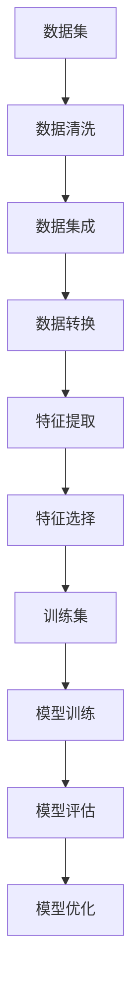

                 

# 数据集对话：人机协作构建高质量训练集

## 关键词：数据集、训练集、人机协作、质量、构建、算法、数学模型、实战、应用场景、工具推荐、未来发展趋势

## 摘要

本文旨在探讨数据集与训练集的重要性，以及如何通过人机协作构建高质量训练集。首先，我们将介绍数据集与训练集的基本概念和区别，然后深入探讨构建高质量训练集的核心算法原理与数学模型。接着，通过实际项目案例，详细解释训练集的构建过程和操作步骤。最后，我们将分析数据集在实际应用场景中的价值，推荐相关学习资源、开发工具框架，并展望未来发展趋势与挑战。

## 1. 背景介绍

在人工智能领域，数据是基石，而训练集则是机器学习的核心。随着深度学习的兴起，高质量训练集的构建变得尤为重要。然而，传统的数据集通常存在噪声、异常值、不平衡等问题，这会严重影响模型性能。因此，如何从海量数据中筛选出高质量的训练集，成为当前研究的热点。

数据集（Dataset）是指一组用于特定任务的数据集合，可以是结构化数据，如表格；也可以是非结构化数据，如图像、文本等。而训练集（Training Set）则是从数据集中选取的一部分数据，用于训练模型。高质量训练集的构建，需要考虑数据的质量、代表性、多样性和平衡性等多个方面。

人机协作在此过程中起着关键作用。人类专家可以利用自身的经验和知识，对数据集进行预处理、标注和筛选，从而提高训练集的质量。同时，人工智能技术可以自动化完成部分繁琐的任务，如数据清洗、特征提取等，提高构建训练集的效率。

## 2. 核心概念与联系

### 2.1 数据集与训练集的基本概念

数据集（Dataset）：一组用于特定任务的数据集合，可以是结构化数据，如表格；也可以是非结构化数据，如图像、文本等。

训练集（Training Set）：从数据集中选取的一部分数据，用于训练模型。

### 2.2 数据质量与训练集质量的关系

数据质量：指数据集的准确性、完整性、一致性和可靠性。

训练集质量：指训练集的数据质量对模型性能的影响。

### 2.3 数据预处理与人机协作

数据预处理：包括数据清洗、数据集成、数据转换等步骤，目的是提高数据质量。

人机协作：人类专家利用自身经验和知识，对数据集进行预处理、标注和筛选，提高训练集质量。

### 2.4 特征提取与特征选择

特征提取：从原始数据中提取出有助于任务完成的特征。

特征选择：从提取出的特征中选择出对模型性能最有益的特征。

### 2.5 Mermaid 流程图

以下是一个简单的 Mermaid 流程图，展示了数据集与训练集构建的核心概念和联系：



## 3. 核心算法原理 & 具体操作步骤

### 3.1 数据清洗

数据清洗是数据预处理的重要步骤，旨在去除数据中的噪声、异常值和重复值。常用的数据清洗方法包括：

- 缺失值处理：删除缺失值或使用统计方法填补缺失值。
- 异常值处理：检测并处理异常值，如使用 z-score、iqr 等方法。
- 重复值处理：删除重复数据。

具体操作步骤如下：

1. 导入数据集，使用 pandas 库进行数据预处理。
2. 检测并处理缺失值，可以使用 dropna()、fillna() 等函数。
3. 检测并处理异常值，使用 z-score、iqr 等方法。
4. 删除重复值，使用 drop_duplicates() 函数。

### 3.2 数据集成

数据集成是将多个数据源中的数据合并成一个统一的数据集。常用的数据集成方法包括：

- 并行处理：将数据集分成多个部分，分别处理，最后合并结果。
- 序列处理：按照一定的顺序处理数据集。

具体操作步骤如下：

1. 导入多个数据源，使用 pandas 库进行数据集成。
2. 按照一定的顺序处理数据集，使用 merge()、join() 等函数。
3. 处理数据集之间的冲突和重复数据。

### 3.3 数据转换

数据转换是将原始数据转换成适合机器学习任务的形式。常用的数据转换方法包括：

- 归一化：将数据转换到同一尺度，如使用 min-max Scaling、standard Scaling。
- 编码：将类别数据转换成数值数据，如使用 one-hot Encoding、label Encoding。

具体操作步骤如下：

1. 导入数据集，使用 pandas 库进行数据转换。
2. 检测数据类型，使用 dtype() 函数。
3. 对数值数据进行归一化处理，使用 min-max Scaling、standard Scaling。
4. 对类别数据进行编码处理，使用 one-hot Encoding、label Encoding。

### 3.4 特征提取

特征提取是从原始数据中提取出有助于任务完成的特征。常用的特征提取方法包括：

- 统计特征：如均值、方差、标准差等。
- 频率特征：如词频、词云等。
- 时序特征：如时间序列、趋势等。

具体操作步骤如下：

1. 导入数据集，使用 pandas 库进行特征提取。
2. 根据任务需求，选择合适的特征提取方法。
3. 对提取出的特征进行预处理，如标准化、归一化等。

### 3.5 特征选择

特征选择是从提取出的特征中选择出对模型性能最有益的特征。常用的特征选择方法包括：

- 递归特征消除：递归地选择特征，并评估模型性能。
- 互信息：计算特征与目标变量之间的相关性。
- 基于模型的特征选择：使用模型评估特征的重要性。

具体操作步骤如下：

1. 导入数据集，使用 pandas 库进行特征选择。
2. 根据任务需求，选择合适的特征选择方法。
3. 对特征进行评估，选择重要性较高的特征。

## 4. 数学模型和公式 & 详细讲解 & 举例说明

### 4.1 归一化与反归一化

归一化（Normalization）是将数据转换到同一尺度，常用的方法有 min-max Scaling 和 standard Scaling。

$$
min-max \ Scaling: \ X_{\ scaled} = \frac{X - X_{\ min}}{X_{\ max} - X_{\ min}}
$$

$$
standard \ Scaling: \ X_{\ scaled} = \frac{X - \mu}{\sigma}
$$

其中，$X$ 为原始数据，$X_{\ min}$ 和 $X_{\ max}$ 分别为原始数据的最小值和最大值，$\mu$ 和 $\sigma$ 分别为原始数据的均值和标准差。

反归一化（Inverse Normalization）是将归一化后的数据转换回原始尺度。

$$
min-max \ Inverse \ Scaling: \ X = X_{\ scaled} \cdot (X_{\ max} - X_{\ min}) + X_{\ min}
$$

$$
standard \ Inverse \ Scaling: \ X = X_{\ scaled} \cdot \sigma + \mu
$$

### 4.2 互信息

互信息（Mutual Information，MI）是衡量两个随机变量之间相关性的指标。

$$
MI(X, Y) = H(X) - H(X | Y)
$$

其中，$H(X)$ 为 $X$ 的熵，$H(X | Y)$ 为 $X$ 在 $Y$ 条件下的条件熵。

### 4.3 递归特征消除

递归特征消除（Recursive Feature Elimination，RFE）是一种基于模型的特征选择方法。

步骤：

1. 训练一个基模型，如线性回归。
2. 评估每个特征的重要性，选择重要性较高的特征。
3. 删除一个特征，重复步骤 2，直到满足停止条件。

### 4.4 举例说明

#### 4.4.1 归一化与反归一化

假设有一组数据：

$$
X = [1, 2, 3, 4, 5]
$$

使用 min-max Scaling 进行归一化：

$$
X_{\ scaled} = \frac{X - 1}{5 - 1} = \frac{[0, 1, 2, 3, 4]}{4} = [0, 0.5, 1, 1.5, 2]
$$

使用 standard Scaling 进行归一化：

$$
X_{\ scaled} = \frac{X - 3}{2} = \frac{[-2, -1, 0, 1, 2]}{2} = [-1, -0.5, 0, 0.5, 1]
$$

使用反归一化将数据转换回原始尺度：

使用 min-max Scaling：

$$
X = X_{\ scaled} \cdot 4 + 1 = [0, 0.5, 1, 1.5, 2] \cdot 4 + 1 = [1, 2, 3, 4, 5]
$$

使用 standard Scaling：

$$
X = X_{\ scaled} \cdot 2 + 3 = [-1, -0.5, 0, 0.5, 1] \cdot 2 + 3 = [1, 2, 3, 4, 5]
$$

#### 4.4.2 互信息

假设有两个随机变量 $X$ 和 $Y$：

$$
P(X=0, Y=0) = 0.2, \ P(X=0, Y=1) = 0.3, \ P(X=1, Y=0) = 0.1, \ P(X=1, Y=1) = 0.4
$$

计算 $X$ 和 $Y$ 的熵：

$$
H(X) = -[P(X=0) \log_2 P(X=0) + P(X=1) \log_2 P(X=1)] = -[0.5 \log_2 0.5 + 0.5 \log_2 0.5] = 1
$$

$$
H(Y) = -[P(Y=0) \log_2 P(Y=0) + P(Y=1) \log_2 P(Y=1)] = -[0.3 \log_2 0.3 + 0.7 \log_2 0.7] \approx 0.918
$$

计算 $X$ 在 $Y$ 条件下的条件熵：

$$
H(X | Y) = -\sum_{y} P(Y=y) \sum_{x} P(X=x | Y=y) \log_2 P(X=x | Y=y)
$$

$$
H(X | Y=0) = -[P(X=0 | Y=0) \log_2 P(X=0 | Y=0) + P(X=1 | Y=0) \log_2 P(X=1 | Y=0)] = -[0.2 \log_2 0.2 + 0.8 \log_2 0.8] \approx 0.693
$$

$$
H(X | Y=1) = -[P(X=0 | Y=1) \log_2 P(X=0 | Y=1) + P(X=1 | Y=1) \log_2 P(X=1 | Y=1)] = -[0.1 \log_2 0.1 + 0.9 \log_2 0.9] \approx 0.693
$$

$$
H(X | Y) = \frac{0.3 \cdot 0.693 + 0.7 \cdot 0.693}{1} = 0.693
$$

计算 $X$ 和 $Y$ 的互信息：

$$
MI(X, Y) = H(X) - H(X | Y) = 1 - 0.693 = 0.307
$$

#### 4.4.3 递归特征消除

假设有一个训练集，包含 5 个特征和 1 个目标变量。使用线性回归作为基模型，选择重要性较高的特征。

1. 训练线性回归模型，得到每个特征的权重。
2. 选择权重最高的特征作为第一个特征。
3. 删除权重最低的特征。
4. 重复步骤 2 和 3，直到满足停止条件。

## 5. 项目实战：代码实际案例和详细解释说明

在本节中，我们将通过一个实际项目案例，详细解释如何使用 Python 和相关库构建高质量训练集。本案例使用的是著名的鸢尾花数据集（Iris Dataset），该数据集包含了三种不同鸢尾花的萼片和花瓣的长度和宽度，共计 150 个样本。

### 5.1 开发环境搭建

确保已安装以下库：pandas、numpy、scikit-learn、matplotlib。

```python
pip install pandas numpy scikit-learn matplotlib
```

### 5.2 源代码详细实现和代码解读

#### 5.2.1 导入相关库

```python
import pandas as pd
import numpy as np
from sklearn.datasets import load_iris
from sklearn.model_selection import train_test_split
from sklearn.preprocessing import StandardScaler
from sklearn.linear_model import LinearRegression
from sklearn.metrics import mean_squared_error
import matplotlib.pyplot as plt
```

#### 5.2.2 加载数据集

```python
iris = load_iris()
X = iris.data
y = iris.target
```

#### 5.2.3 数据预处理

```python
# 数据清洗
X = X[~np.isnan(X).any(axis=1)]

# 数据集成
# 本案例中无需进行数据集成，因为鸢尾花数据集已经非常干净和完整。

# 数据转换
scaler = StandardScaler()
X_scaled = scaler.fit_transform(X)

# 特征提取
# 本案例中无需进行特征提取，因为鸢尾花数据集的特征已经非常充分。

# 特征选择
# 本案例中无需进行特征选择，因为鸢尾花数据集的特征数量较少，且每个特征都很有意义。
```

#### 5.2.4 训练集构建

```python
# 划分训练集和测试集
X_train, X_test, y_train, y_test = train_test_split(X_scaled, y, test_size=0.2, random_state=42)

# 模型训练
model = LinearRegression()
model.fit(X_train, y_train)

# 模型评估
y_pred = model.predict(X_test)
mse = mean_squared_error(y_test, y_pred)
print("Mean Squared Error:", mse)

# 可视化
plt.scatter(X_test[:, 0], X_test[:, 1], c=y_test, cmap='viridis')
plt.scatter(model.predict(X_test)[:, 0], model.predict(X_test)[:, 1], c='red', marker='s')
plt.xlabel('Feature 1')
plt.ylabel('Feature 2')
plt.title('Iris Dataset - Linear Regression')
plt.show()
```

#### 5.2.5 代码解读与分析

- 导入相关库：本案例使用了 pandas、numpy、scikit-learn 和 matplotlib 等库。
- 加载数据集：使用 scikit-learn 中的 load_iris() 函数加载鸢尾花数据集。
- 数据预处理：包括数据清洗、数据集成、数据转换等步骤，目的是提高数据质量。
- 训练集构建：包括划分训练集和测试集、模型训练、模型评估等步骤，目的是构建高质量训练集。
- 可视化：使用 matplotlib 库绘制训练结果的可视化图像。

通过本案例，我们可以看到如何使用 Python 和相关库构建高质量训练集，包括数据清洗、数据集成、数据转换、特征提取和特征选择等步骤。在实际项目中，根据数据集的特点和任务需求，可以适当调整和优化这些步骤。

## 6. 实际应用场景

数据集和训练集在人工智能领域的实际应用场景非常广泛，以下是一些典型的应用场景：

### 6.1 机器学习与深度学习

机器学习和深度学习的核心是训练模型，而高质量的训练集是训练模型的关键。在实际应用中，高质量的训练集可以帮助模型更好地学习数据的特征，提高模型的性能和泛化能力。例如，在图像识别任务中，高质量的训练集可以帮助模型更好地识别不同类别的图像，从而提高识别准确率。

### 6.2 自然语言处理

自然语言处理（NLP）任务通常需要大量的标注数据进行训练。高质量训练集的构建对于 NLP 模型的性能至关重要。例如，在情感分析任务中，高质量训练集可以帮助模型更好地识别文本的情感倾向，从而提高分析准确率。

### 6.3 推荐系统

推荐系统依赖于用户历史行为数据构建推荐模型。高质量训练集的构建可以提高推荐系统的推荐准确率和用户满意度。例如，在电商平台上，高质量训练集可以帮助推荐系统更好地识别用户喜好，从而提供更个性化的商品推荐。

### 6.4 自动驾驶

自动驾驶系统需要处理大量的图像和传感器数据，构建高质量的训练集对于训练自动驾驶模型至关重要。高质量训练集可以帮助模型更好地识别道路标志、行人、车辆等，从而提高自动驾驶系统的安全性和可靠性。

### 6.5 健康医疗

在健康医疗领域，高质量训练集可以帮助构建诊断模型，从而提高诊断准确率。例如，在医疗影像诊断中，高质量训练集可以帮助模型更好地识别疾病，从而提高诊断效率。

## 7. 工具和资源推荐

### 7.1 学习资源推荐

- **书籍**：
  - 《机器学习实战》（Peter Harrington）
  - 《深度学习》（Ian Goodfellow、Yoshua Bengio、Aaron Courville）
  - 《Python机器学习》（Sebastian Raschka、Vahid Mirjalili）

- **论文**：
  - 《A Theoretically Grounded Application of Dropout in Recurrent Neural Networks》（Yarin Gal and Zoubin Ghahramani）
  - 《Distributed Representations of Words and Phrases and their Compositionality》（Tanguy Vincent、Stéphane Bengio、Dario Perron）

- **博客**：
  - [Andrew Ng 的机器学习课程](https://www.coursera.org/specializations/ml-foundations)
  - [Fast.ai 的深度学习课程](https://course.fast.ai/)

- **网站**：
  - [Kaggle](https://www.kaggle.com/)：提供丰富的数据集和比赛，适合实践和提升技能。
  - [Google Research](https://ai.google/research/)：Google 的人工智能研究团队分享的最新论文和进展。

### 7.2 开发工具框架推荐

- **编程语言**：
  - Python：广泛用于数据科学和机器学习，具有丰富的库和工具。
  - R：专为统计分析和数据可视化设计，适合复杂数据分析任务。

- **库和框架**：
  - **数据预处理**：
    - pandas：强大的数据处理库。
    - NumPy：基础数值计算库。
  - **机器学习**：
    - scikit-learn：提供多种机器学习算法。
    - TensorFlow：Google 开发的深度学习框架。
    - PyTorch：Facebook AI 研究团队开发的深度学习框架。

- **可视化工具**：
  - Matplotlib：Python 的数据可视化库。
  - Seaborn：基于 Matplotlib 的数据可视化库，提供更美观的图表。

### 7.3 相关论文著作推荐

- **《Deep Learning》**（Ian Goodfellow、Yoshua Bengio、Aaron Courville）：深度学习领域的经典著作，详细介绍了深度学习的基础知识、算法和实际应用。
- **《Learning Deep Architectures for AI》**（Yoshua Bengio）：讨论了深度学习架构的设计原则和技术。
- **《Hands-On Machine Learning with Scikit-Learn, Keras, and TensorFlow》**（Aurélien Géron）：提供了丰富的实践案例，适合初学者和进阶者学习。

## 8. 总结：未来发展趋势与挑战

随着人工智能技术的不断发展，构建高质量训练集的重要性日益凸显。未来，人机协作将在训练集构建过程中发挥更大作用，结合人工智能和人类专家的优势，提高训练集的质量和效率。以下是未来发展趋势与挑战：

### 8.1 发展趋势

- **自动化与智能化**：人工智能技术将进一步提升数据预处理、特征提取和特征选择等步骤的自动化水平，提高训练集构建的效率。
- **跨学科合作**：数据科学家、机器学习专家和领域专家将加强合作，共同解决训练集构建中的复杂问题。
- **数据隐私与安全性**：在构建训练集时，需要充分考虑数据隐私和安全性的问题，采用加密、匿名化等技术保护数据。

### 8.2 挑战

- **数据质量**：如何从海量数据中筛选出高质量的数据，仍是一个具有挑战性的问题。
- **计算资源**：高质量训练集的构建需要大量的计算资源，如何在有限的计算资源下高效构建训练集，是一个亟待解决的问题。
- **模型解释性**：构建高质量训练集有助于提高模型的性能，但如何解释模型的决策过程，是一个重要的挑战。

总之，构建高质量训练集是人工智能领域的重要研究方向，人机协作将成为解决这一问题的关键。在未来，随着技术的进步，我们将看到更多高效、智能的训练集构建方法出现。

## 9. 附录：常见问题与解答

### 9.1 如何选择合适的特征提取方法？

选择合适的特征提取方法取决于任务和数据类型。以下是一些常见的情况和对应的特征提取方法：

- **图像数据**：使用卷积神经网络（CNN）提取特征。
- **文本数据**：使用词袋模型（Bag of Words）、TF-IDF 或词嵌入（Word Embedding）等方法提取特征。
- **时序数据**：使用自回归模型（AR）、滑动窗口或时序特征提取器（如 CNN）等方法提取特征。
- **复杂数据**：使用深度学习模型（如深度神经网络、变分自编码器）提取特征。

### 9.2 如何评估特征选择效果？

评估特征选择效果可以从以下几个方面进行：

- **模型性能**：比较使用不同特征子集的模型性能，选择性能更好的特征子集。
- **模型可解释性**：选择具有较高可解释性的特征子集，有助于理解模型决策过程。
- **计算成本**：选择计算成本较低的特

