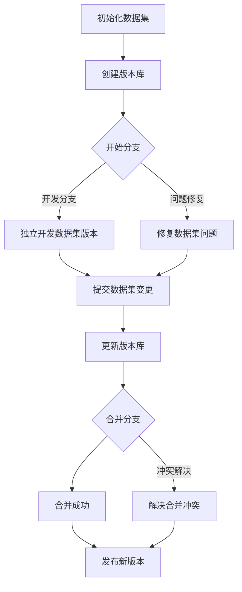

                 

# 数据集版本管理：Git for Data时代来临

> 关键词：数据集版本管理、Git、版本控制、数据完整性、团队协作

> 摘要：本文将深入探讨数据集版本管理的概念、必要性及具体实践方法。通过引入Git这一强大工具，我们将揭示如何在数据驱动时代，确保数据集的版本管理、团队协作以及数据完整性的最佳实践。

## 1. 背景介绍

在当今的数据驱动时代，数据集作为机器学习和人工智能项目的重要资产，其重要性不言而喻。然而，随着项目规模的扩大和数据集的复杂度增加，如何有效地管理和维护数据集版本成为一个亟待解决的问题。

传统的文件管理方法，如重命名或手动记录变更日志，已经难以满足现代数据集管理的需求。一方面，这种方式容易导致数据集版本混乱、更新历史不清晰；另一方面，当团队协作参与项目时，缺乏有效的版本控制机制将导致协作效率低下、数据冲突频发。

因此，引入专业的数据集版本管理工具，如Git，成为了数据驱动时代的一种必然选择。Git作为一种分布式版本控制系统，以其强大的分支管理、合并冲突解决以及历史版本追溯等功能，为数据集版本管理提供了强有力的支持。

## 2. 核心概念与联系

### 2.1 Git的基本概念

Git是一种基于内容的版本控制系统，它的主要功能是跟踪源代码的变更历史，但它的应用并不局限于源代码管理。Git的核心概念包括：

- **版本库（Repository）**：Git项目的基本单位，用于存储和管理代码或数据集。
- **分支（Branch）**：Git用于并行工作的主要工具，允许开发者在独立的环境中开发新的功能或修复bug。
- **提交（Commit）**：Git跟踪变更历史的基本单元，每个提交都包含一系列的文件变更和提交信息。
- **合并（Merge）**：Git将两个或多个分支合并到一个分支的过程，确保所有分支的变更都能妥善整合。

### 2.2 数据集版本管理原理

数据集版本管理利用Git的核心概念，实现对数据集版本的控制：

- **数据集的版本库**：数据集的每个版本都存储在Git的版本库中，每个版本都是一次提交。
- **数据集的分支**：用于跟踪不同数据集版本的变更，允许团队成员独立处理数据集的变更。
- **数据集的提交**：每次数据集的更新或修复都生成一个新的提交，记录变更的具体内容。
- **数据集的合并**：当多个团队成员对同一数据集进行修改后，Git可以帮助合并这些变更，确保数据集的完整性和一致性。

### 2.3 Mermaid流程图

为了更好地理解数据集版本管理的过程，我们使用Mermaid绘制一个流程图：



## 3. 核心算法原理 & 具体操作步骤

### 3.1 Git基本操作

要使用Git进行数据集版本管理，首先需要了解Git的基本操作。以下是Git的一些核心操作步骤：

- **初始化版本库**：使用`git init`命令初始化一个新的Git版本库。
- **添加文件**：使用`git add`命令将文件添加到暂存区。
- **提交变更**：使用`git commit`命令将暂存区的变更提交到版本库。
- **查看历史**：使用`git log`命令查看提交历史。
- **分支管理**：使用`git branch`命令创建、切换和删除分支。
- **合并分支**：使用`git merge`命令将两个或多个分支合并。

### 3.2 数据集版本管理操作步骤

以下是使用Git进行数据集版本管理的具体操作步骤：

1. **初始化数据集版本库**：

    ```bash
    mkdir my_dataset
    cd my_dataset
    git init
    ```

2. **添加数据集文件**：

    ```bash
    git add my_dataset.csv
    ```

3. **提交数据集版本**：

    ```bash
    git commit -m "Initial version of my_dataset.csv"
    ```

4. **创建新分支**：

    ```bash
    git branch new_feature
    ```

5. **在新分支上更新数据集**：

    ```bash
    cd new_feature
    # 对数据集进行修改
    git add my_dataset.csv
    git commit -m "Update my_dataset.csv for new_feature"
    ```

6. **合并分支**：

    ```bash
    git checkout main
    git merge new_feature
    ```

7. **解决合并冲突**（如果存在）：

    ```bash
    git status
    # 手动解决冲突
    git add my_dataset.csv
    git commit -m "Resolved merge conflicts in my_dataset.csv"
    ```

8. **发布新版本**：

    ```bash
    git tag v1.0
    git push origin v1.0
    ```

## 4. 数学模型和公式 & 详细讲解 & 举例说明

### 4.1 数据集版本管理的数学模型

数据集版本管理的核心在于确保数据集的版本可追溯、可重复。这里我们可以使用一个简单的数学模型来描述这一过程：

- **版本号**：用\( V \)表示数据集的版本号，每次提交或更新都会增加版本号。
- **提交历史**：用\( H \)表示提交历史，包含每次提交的元数据（如提交者、提交时间、提交说明）。
- **分支管理**：用\( B \)表示分支，表示数据集在不同版本间的分支情况。

### 4.2 数据集版本管理的具体操作

下面是一个具体的例子，说明如何使用Git进行数据集版本管理：

1. **初始化版本库**：

    ```bash
    git init
    ```

    初始化一个Git版本库，版本号初始为\( V = 0 \)。

2. **添加数据集文件**：

    ```bash
    git add data.csv
    ```

    将数据集文件添加到暂存区。

3. **提交数据集版本**：

    ```bash
    git commit -m "Initial version of data.csv"
    ```

    提交数据集的初始版本，版本号增加为\( V = 1 \)。

4. **创建新分支**：

    ```bash
    git branch new_analysis
    ```

    创建一个新的分支，用于独立分析数据集。

5. **在新分支上更新数据集**：

    ```bash
    git checkout new_analysis
    # 对数据集进行修改
    git add data.csv
    git commit -m "Update data.csv for new_analysis"
    ```

    在新分支上对数据集进行修改，并提交新的版本。

6. **合并分支**：

    ```bash
    git checkout main
    git merge new_analysis
    ```

    将新分支的变更合并到主分支。

7. **解决合并冲突**（如果存在）：

    ```bash
    git status
    # 手动解决冲突
    git add data.csv
    git commit -m "Resolved merge conflicts in data.csv"
    ```

    如果合并过程中出现冲突，需要手动解决并重新提交。

8. **发布新版本**：

    ```bash
    git tag v1.0
    git push origin v1.0
    ```

    发布新版本，版本号增加为\( V = 2 \)。

## 5. 项目实战：代码实际案例和详细解释说明

### 5.1 开发环境搭建

为了实践数据集版本管理，我们首先需要搭建一个Git开发环境。以下是步骤：

1. **安装Git**：

    在Windows、macOS和Linux上，都可以通过官方包管理器或下载安装Git。

    - **Windows**：
      
      ```bash
      chocolatey install git
      ```

    - **macOS**：
      
      ```bash
      brew install git
      ```

    - **Linux**：
      
      ```bash
      sudo apt-get install git
      ```

2. **配置Git**：

    ```bash
    git config --global user.name "Your Name"
    git config --global user.email "your.email@example.com"
    ```

    配置Git的全局用户信息。

### 5.2 源代码详细实现和代码解读

接下来，我们将使用Git对一个小型数据集进行版本管理。数据集包含用户信息，包括用户ID、姓名、年龄和收入。

1. **初始化版本库**：

    ```bash
    mkdir user_data
    cd user_data
    git init
    ```

2. **添加数据集文件**：

    ```bash
    nano users.csv
    ```

    在文本编辑器中创建一个名为`users.csv`的文件，添加以下内容：

    ```csv
    UserID,Name,Age,Income
    1,John,30,50000
    2,Jane,25,60000
    3,Bob,35,55000
    ```

    保存并退出。

3. **提交数据集版本**：

    ```bash
    git add users.csv
    git commit -m "Initial version of users.csv"
    ```

    提交数据集的初始版本。

4. **创建新分支**：

    ```bash
    git branch new_analytics
    ```

    创建一个新的分支，用于数据分析。

5. **在新分支上更新数据集**：

    ```bash
    git checkout new_analytics
    nano users.csv
    ```

    在新分支上编辑`users.csv`文件，添加一行数据：

    ```csv
    UserID,Name,Age,Income
    4,Alice,28,52000
    ```

    保存并退出。

6. **提交更新**：

    ```bash
    git add users.csv
    git commit -m "Update users.csv for new_analytics"
    ```

    提交更新。

7. **合并分支**：

    ```bash
    git checkout main
    git merge new_analytics
    ```

    将新分支的变更合并到主分支。

8. **解决合并冲突**（如果存在）：

    ```bash
    git status
    # 手动解决冲突
    git add users.csv
    git commit -m "Resolved merge conflicts in users.csv"
    ```

    如果合并过程中出现冲突，需要手动解决并重新提交。

9. **发布新版本**：

    ```bash
    git tag v1.0
    git push origin v1.0
    ```

    发布新版本。

### 5.3 代码解读与分析

通过上面的案例，我们可以看到如何使用Git对数据集进行版本管理。以下是代码的解读与分析：

1. **初始化版本库**：

    使用`git init`命令初始化一个新的Git版本库。这将在当前目录创建一个隐藏的`.git`文件夹，用于存储版本信息。

2. **添加数据集文件**：

    使用`git add`命令将数据集文件添加到暂存区。暂存区是Git用于暂存文件变更的区域。

3. **提交数据集版本**：

    使用`git commit`命令将暂存区的变更提交到版本库。提交时需要提供一条提交说明，用于记录变更的内容。

4. **创建新分支**：

    使用`git branch`命令创建一个新的分支。分支是Git用于并行工作的工具，允许团队成员在不同的环境中独立工作。

5. **在新分支上更新数据集**：

    使用`git checkout`命令切换到新创建的分支，然后对数据集文件进行修改。修改后，使用`git add`和`git commit`命令提交更新。

6. **合并分支**：

    使用`git checkout`命令切换回主分支，然后使用`git merge`命令将新分支的变更合并到主分支。合并过程中，如果出现冲突，需要手动解决。

7. **解决合并冲突**（如果存在）：

    使用`git status`命令检查合并过程中是否出现冲突。如果有冲突，需要手动编辑文件解决冲突，然后重新提交。

8. **发布新版本**：

    使用`git tag`命令为版本库打上标签，表示一个新的版本。然后使用`git push`命令将标签推送到远程仓库。

通过这个案例，我们可以看到Git在数据集版本管理中的应用。Git的分支管理和合并机制，使得数据集的版本管理变得简单而高效，同时确保了数据集的历史和完整性。

## 6. 实际应用场景

### 6.1 团队协作

数据集版本管理在团队协作中尤为重要。在多个成员共同参与的项目中，数据集的版本管理可以有效防止数据冲突，提高协作效率。以下是数据集版本管理在团队协作中的实际应用场景：

- **独立分支开发**：团队成员可以创建独立的分支，对数据集进行修改和更新，确保各自的变更不会相互干扰。
- **合并冲突解决**：在合并分支时，Git可以帮助自动解决冲突，或者提示团队成员手动解决冲突，确保数据集的完整性和一致性。
- **代码审查**：通过Git的提交历史和分支管理，团队成员可以对数据集的变更进行审查，确保代码的质量和可靠性。

### 6.2 数据完整性保障

数据集版本管理可以确保数据的完整性和可靠性。通过Git的提交历史和版本控制，我们可以：

- **追踪数据变更历史**：记录每次数据集的更新和修改，确保数据变更的可追溯性。
- **防止数据丢失**：通过备份和版本控制，确保数据集的版本不会丢失，即使在错误的情况下也可以回滚到之前的版本。
- **确保数据一致性**：通过合并和冲突解决机制，确保数据集在不同分支和团队成员之间的更新是一致的。

### 6.3 数据集迭代

数据集版本管理支持数据集的迭代和更新。在项目开发的不同阶段，数据集可能需要不断地更新和优化。通过Git，我们可以：

- **快速迭代**：团队成员可以独立进行数据集的更新和优化，并在合适的时候合并到主分支。
- **版本控制**：通过Git的版本控制机制，确保每次数据集的更新都是可控和可回滚的。

## 7. 工具和资源推荐

### 7.1 学习资源推荐

为了更好地掌握数据集版本管理，以下是一些建议的学习资源：

- **书籍**：
  - 《Pro Git》
  - 《Git from the Ground Up》
- **在线课程**：
  - Coursera上的“Git 基础与进阶”
  - Udemy上的“Git：从入门到专业”
- **博客和网站**：
  - Atlassian的Git教程
  - GitHub的官方文档

### 7.2 开发工具框架推荐

- **Git客户端**：
  - GitHub Desktop
  - Sourcetree
- **代码审查工具**：
  - GitLab
  - GitHub Pull Requests
- **持续集成服务**：
  - Jenkins
  - GitLab CI/CD

### 7.3 相关论文著作推荐

- **论文**：
  - “A Survey of Distributed Version Control Systems”
  - “Git Internals: A Glimpse into the Git Data Model”
- **著作**：
  - 《版本控制手册》
  - 《分布式版本控制系统原理与实践》

## 8. 总结：未来发展趋势与挑战

### 8.1 未来发展趋势

随着数据驱动时代的深入发展，数据集版本管理将迎来以下几个趋势：

- **自动化和智能化**：未来的数据集版本管理工具将更加智能化，能够自动检测和修复版本冲突，提高管理效率。
- **云原生数据集版本管理**：随着云计算的发展，云原生数据集版本管理将变得更加普及，支持更大规模的数据集管理。
- **多模态数据集版本管理**：随着数据类型的多样化，多模态数据集版本管理将成为一个重要方向，支持不同类型数据的版本控制。

### 8.2 挑战与展望

尽管数据集版本管理有着广阔的发展前景，但也面临一些挑战：

- **数据隐私和安全**：如何确保数据集版本管理过程中的数据隐私和安全，是一个亟待解决的问题。
- **数据恢复和回滚**：在出现错误或数据丢失时，如何快速恢复和回滚数据集版本，需要更高效的解决方案。
- **团队协作与沟通**：在多团队协作中，如何确保每个团队成员都能有效地参与数据集版本管理，是一个关键挑战。

## 9. 附录：常见问题与解答

### 9.1 Git常用命令

- **初始化版本库**：
  
  ```bash
  git init
  ```

- **添加文件**：

  ```bash
  git add <file>
  ```

- **提交变更**：

  ```bash
  git commit -m "<message>"
  ```

- **查看历史**：

  ```bash
  git log
  ```

- **创建分支**：

  ```bash
  git branch <branch_name>
  ```

- **切换分支**：

  ```bash
  git checkout <branch_name>
  ```

- **合并分支**：

  ```bash
  git merge <branch_name>
  ```

- **解决合并冲突**：

  ```bash
  git status
  # 手动编辑冲突文件
  git add <file>
  git commit -m "<message>"
  ```

### 9.2 数据集版本管理常见问题

- **如何追踪数据集变更历史？**

  使用Git的提交历史功能，每次提交都会记录变更的详细信息，包括提交者、提交时间、提交说明等。

- **如何避免数据集版本冲突？**

  通过使用分支管理和合并机制，确保每个团队成员在不同分支上独立工作，避免直接在主分支上修改数据集。合并时，Git会自动或提示用户解决冲突。

- **如何恢复之前的版本？**

  通过查看提交历史，可以使用`git checkout`命令回滚到之前的版本。如果需要保留当前的工作，可以先创建一个新分支，然后进行回滚。

## 10. 扩展阅读 & 参考资料

- 《Pro Git》
- 《Git from the Ground Up》
- [GitHub官方文档](https://docs.github.com/en)
- [GitLab官方文档](https://docs.gitlab.com/)
- [Jenkins官方文档](https://www.jenkins.io/doc/)

### 作者

- 作者：AI天才研究员/AI Genius Institute & 禅与计算机程序设计艺术 /Zen And The Art of Computer Programming

