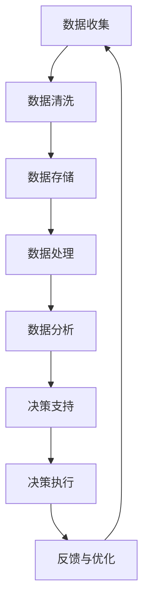

                 

### 背景介绍

在现代企业管理中，决策是一个至关重要的环节。有效的决策能够帮助企业抓住市场机遇，优化资源配置，提高生产效率，甚至能够在竞争激烈的环境中保持优势。然而，传统的决策方式往往依赖于管理者个人的经验和直觉，这种方法虽然在某些情况下能够取得较好的效果，但无法确保在复杂多变的环境中始终做出最优的决策。

随着信息技术的迅猛发展，大数据和人工智能技术的应用逐渐普及，为管理者提供了一种全新的决策方式——数据驱动决策。数据驱动决策是一种基于数据分析的方法，通过收集、整理和分析大量数据，以数据为依据，做出更加科学和精准的决策。这种方式不仅能够提高决策的效率，还能够减少决策过程中的主观性和不确定性。

数据驱动决策的优势在于它能够帮助管理者更全面地了解企业运营状况，发现潜在的问题和机遇，从而做出更为明智的决策。同时，它还能够为企业的战略规划提供有力的数据支持，使得决策更加具有前瞻性和针对性。

本文将深入探讨数据驱动决策的核心理念、具体实现方法以及在实际应用中的挑战和解决方案。我们将通过一系列的案例分析，展示数据驱动决策在企业管理中的具体应用，帮助读者理解和掌握这一现代管理者的必备技能。

在接下来的章节中，我们将首先介绍数据驱动决策的核心概念与联系，通过一个详细的Mermaid流程图，帮助读者理解数据驱动决策的基本架构。然后，我们将深入探讨数据驱动决策的核心算法原理与具体操作步骤，为读者提供切实可行的实践指南。接下来，我们将引入数学模型和公式，详细讲解数据驱动决策中的关键概念，并通过实际案例进行举例说明。在项目实战部分，我们将分享一个具体的代码实现案例，帮助读者掌握数据驱动决策的实战技巧。随后，我们将探讨数据驱动决策在实际应用中的各种场景，并推荐相关的工具和资源。最后，我们将总结数据驱动决策的未来发展趋势与挑战，为读者提供未来的研究方向。

让我们一步一步地深入探讨数据驱动决策的奥秘，共同开启这段精彩的学习之旅。

### 核心概念与联系

数据驱动决策（Data-Driven Decision Making，简称DDD）是一种以数据为核心的管理方法，通过系统化地收集、处理和分析数据，以数据为依据进行决策。这一方法不仅改变了传统的决策方式，更是现代企业管理中不可或缺的一部分。为了更好地理解数据驱动决策的核心理念和架构，我们可以通过Mermaid流程图来直观展示其基本流程。

首先，我们来看Mermaid流程图中的各个节点：



- **数据收集（A）**：数据驱动决策的第一步是收集数据。这些数据可以来自内部业务系统、市场调研、客户反馈等多个渠道。数据的多样性和准确性是保证决策质量的基础。
- **数据清洗（B）**：收集到的数据往往存在一些噪声和不完整的情况，因此需要通过数据清洗技术进行预处理，以提高数据的质量和可用性。
- **数据存储（C）**：经过清洗的数据需要被存储在数据库或其他数据存储系统中，以便后续的数据处理和分析。
- **数据处理（D）**：数据处理包括数据集成、数据转换等步骤，目的是将不同的数据源整合在一起，形成一个统一、标准化的数据集。
- **数据分析（E）**：数据分析是数据驱动决策的核心步骤。通过使用统计学、机器学习等方法，对数据进行分析和挖掘，从中提取出有价值的信息和洞察。
- **决策支持（F）**：基于数据分析的结果，决策支持系统（Decision Support System，简称DSS）为管理者提供直观的决策支持和建议。
- **决策执行（G）**：管理者根据决策支持系统的建议，制定具体的行动计划，并执行决策。
- **反馈与优化（H）**：决策执行后，需要收集反馈数据，对决策效果进行评估和优化，以不断改进决策过程。

通过这个Mermaid流程图，我们可以清晰地看到数据驱动决策的每个环节及其相互关系。数据驱动决策不仅是一个线性过程，更是一个动态循环，通过不断的反馈和优化，使得决策更加精准和有效。

接下来，我们将进一步探讨数据驱动决策中的核心算法原理和具体操作步骤，帮助读者深入了解这一方法的具体应用。

### 核心算法原理 & 具体操作步骤

数据驱动决策的核心在于如何从大量数据中提取出有价值的信息，并利用这些信息做出科学、精准的决策。为此，我们需要掌握一系列的核心算法和具体操作步骤。以下将详细介绍这些算法原理及其实际操作方法。

#### 1. 数据预处理

数据预处理是数据驱动决策的重要基础，主要包括数据清洗、数据集成和数据转换等步骤。

- **数据清洗**：数据清洗的目的是去除数据中的噪声和异常值，提高数据的可用性和准确性。常见的数据清洗方法包括：
  - **缺失值处理**：对于缺失的数据，可以采用均值填充、中值填充或使用模型预测等方法。
  - **异常值检测与处理**：使用统计方法或机器学习算法检测异常值，然后根据具体情况进行处理，如剔除、修正或标记。

- **数据集成**：数据集成是将来自不同数据源的数据进行整合，形成一个统一的数据集。常用的数据集成方法包括：
  - **数据仓库**：使用ETL（Extract, Transform, Load）工具将不同数据源的数据抽取、转换并加载到数据仓库中。
  - **数据湖**：数据湖是一种大规模数据存储解决方案，可以存储原始数据，无需预先进行结构化处理。

- **数据转换**：数据转换是将不同格式、类型和结构的数据转换为适合分析的形式。常见的数据转换方法包括：
  - **数据规范化**：将不同数据源的数据统一到相同的度量单位和格式。
  - **数据编码**：使用编码方式将分类数据转换为数值型数据，如使用独热编码（One-Hot Encoding）或标签编码（Label Encoding）。

#### 2. 数据分析

数据分析是数据驱动决策的核心环节，通过统计学、机器学习等方法，从数据中提取出有价值的信息和洞察。

- **统计学方法**：
  - **描述性统计分析**：通过计算数据的均值、中位数、标准差等统计指标，对数据的整体特征进行描述。
  - **相关性分析**：通过计算变量之间的相关性，发现数据之间的关系。
  - **回归分析**：通过建立回归模型，分析自变量与因变量之间的关系，预测因变量的取值。

- **机器学习方法**：
  - **监督学习**：通过已标记的数据训练模型，用于对新数据进行预测。常见的监督学习方法包括线性回归、决策树、随机森林、支持向量机等。
  - **无监督学习**：不依赖于已标记的数据，从数据中自动发现模式和结构。常见的方法包括聚类分析（如K-means、DBSCAN）、降维技术（如PCA、t-SNE）等。

#### 3. 决策支持

基于数据分析的结果，决策支持系统（DSS）为管理者提供直观的决策支持和建议。DSS通常包括以下功能：

- **数据可视化**：通过图表、报表等形式，直观地展示数据分析和预测结果，帮助管理者理解数据背后的信息。
- **预测分析**：基于历史数据和模型预测，对未来趋势进行预测，为决策提供数据支持。
- **模拟分析**：通过模拟不同的决策方案，评估不同方案的潜在影响和风险，为管理者提供参考。

#### 4. 决策执行

管理者根据决策支持系统的建议，制定具体的行动计划，并执行决策。决策执行需要考虑以下关键步骤：

- **制定行动计划**：将决策建议转化为具体的执行步骤，明确责任人、时间和资源需求。
- **执行监控**：对决策执行过程进行监控，确保各项任务按时完成，及时调整和优化执行方案。
- **效果评估**：对决策执行后的效果进行评估，收集反馈数据，为后续的决策提供参考。

#### 5. 反馈与优化

决策执行后，需要收集反馈数据，对决策效果进行评估和优化。这一过程形成一个闭环，使得决策过程不断改进和优化。

- **效果评估**：通过关键绩效指标（KPIs）和实际结果进行比较，评估决策的效果。
- **反馈收集**：收集决策执行过程中的反馈信息，包括成功经验、问题和改进建议。
- **模型优化**：基于反馈数据，对数据模型进行调整和优化，提高决策的准确性和可靠性。

通过上述核心算法原理和具体操作步骤，我们可以实现数据驱动决策的完整流程，为企业决策提供有力支持。

在接下来的章节中，我们将通过一个实际的项目实战案例，详细展示数据驱动决策的代码实现和解读，帮助读者更好地理解和掌握这一方法。

### 数学模型和公式 & 详细讲解 & 举例说明

在数据驱动决策过程中，数学模型和公式起到了至关重要的作用。它们不仅帮助我们理解数据的内在规律，还能将复杂的问题转化为可计算的数学问题。以下我们将详细讲解一些常用的数学模型和公式，并通过实际例子进行说明。

#### 1. 线性回归模型

线性回归模型是最基本的统计模型之一，用于分析两个或多个变量之间的关系。线性回归模型的一般形式为：

$$
Y = \beta_0 + \beta_1X_1 + \beta_2X_2 + ... + \beta_nX_n + \epsilon
$$

其中，$Y$ 是因变量，$X_1, X_2, ..., X_n$ 是自变量，$\beta_0, \beta_1, ..., \beta_n$ 是模型参数，$\epsilon$ 是误差项。

**实例**：假设我们想了解销售收入（$Y$）与广告支出（$X_1$）和员工数量（$X_2$）之间的关系。通过收集数据并使用线性回归模型，我们可以得到如下公式：

$$
销售收入 = 10 + 2 \times 广告支出 + 0.5 \times 员工数量 + \epsilon
$$

这个公式可以帮助我们预测在特定广告支出和员工数量的情况下，销售收入的预期值。

#### 2. 逻辑回归模型

逻辑回归模型是一种广义线性模型，用于分析二分类问题。其公式为：

$$
\ln(\frac{P(Y=1)}{1-P(Y=1)}) = \beta_0 + \beta_1X_1 + \beta_2X_2 + ... + \beta_nX_n
$$

其中，$P(Y=1)$ 是因变量为1的概率。

**实例**：假设我们要预测客户是否会在未来三个月内购买某种产品（因变量$Y$，取值为0或1）。我们可以使用逻辑回归模型来分析客户的历史购买行为（$X_1$）和年龄（$X_2$）等因素。通过模型拟合，我们得到如下公式：

$$
\ln(\frac{P(购买)}{1-P(购买)}) = 0.5 + 0.3 \times 历史购买行为 + 0.2 \times 年龄
$$

这个公式可以帮助我们计算一个新客户在未来三个月内购买产品的概率。

#### 3. 决策树模型

决策树模型是一种常用的机器学习算法，用于分类和回归问题。其基本结构由一系列判断节点和叶子节点组成，每个节点表示一个特征，每个叶子节点表示一个类别或值。

**实例**：假设我们要根据客户的年龄、收入和职业来预测他们的信用评分。我们可以构建一个决策树模型，如下所示：

```
年龄 < 30
|
|-- 收入 > 50000
|   |-- 信用评分：优
|
|-- 收入 <= 50000
|   |-- 职业：工程师
|       |-- 信用评分：良
|       |
|       |-- 其他职业
|           |-- 信用评分：一般
|
|-- 年龄 >= 30
|
|-- 收入 > 100000
|   |-- 信用评分：优
|
|-- 收入 <= 100000
|   |-- 职业：经理
|       |-- 信用评分：良
|       |
|       |-- 其他职业
|           |-- 信用评分：一般
```

这个决策树模型可以帮助我们根据客户的特征来预测他们的信用评分。

#### 4. 聚类分析

聚类分析是一种无监督学习算法，用于将数据点分成若干个群组，使得同一群组内的数据点之间相似度较高，而不同群组的数据点之间相似度较低。常用的聚类算法包括K-means、DBSCAN等。

**实例**：假设我们有100个客户的数据，包括他们的年龄、收入和消费水平。我们希望将这100个客户分为不同的消费群体。使用K-means算法，我们可以得到如下聚类结果：

```
群组1：年龄<30，收入<50000，消费水平高
群组2：年龄30-50，收入50000-100000，消费水平中
群组3：年龄>50，收入>100000，消费水平低
```

这些聚类结果可以帮助企业针对不同消费群体制定有针对性的营销策略。

通过以上数学模型和公式的详细讲解，我们可以看到，数据驱动决策不仅仅是简单的数据分析，而是通过数学模型对数据进行深入分析和建模，从而为决策提供有力的支持。在实际应用中，根据具体问题和数据特点，选择合适的数学模型和算法，能够极大地提升决策的科学性和准确性。

在下一节中，我们将通过一个具体的代码实现案例，进一步展示数据驱动决策的实际应用。

### 项目实战：代码实际案例和详细解释说明

在本节中，我们将通过一个实际的项目实战案例，详细展示数据驱动决策的代码实现过程，并对其进行详细解释说明。这个案例将利用Python编程语言和常见的数据分析库，如Pandas、NumPy、Scikit-learn等，实现一个销售预测系统。

#### 1. 开发环境搭建

首先，我们需要搭建一个适合数据驱动决策的Python开发环境。以下是一些基本的安装步骤：

- **安装Python**：确保Python版本不低于3.6，可以从Python官方网站下载安装包。
- **安装Jupyter Notebook**：Jupyter Notebook是一个交互式的Web应用程序，可以方便地编写和运行Python代码。可以通过pip命令安装：

  ```bash
  pip install notebook
  ```

- **安装必要的库**：安装用于数据分析的Pandas、NumPy、Scikit-learn等库：

  ```bash
  pip install pandas numpy scikit-learn matplotlib
  ```

安装完成后，启动Jupyter Notebook，我们就可以开始编写和运行代码了。

#### 2. 源代码详细实现和代码解读

下面是一个简单的销售预测系统实现案例，主要包括数据收集、预处理、模型训练和预测等步骤。

```python
# 导入必要的库
import pandas as pd
import numpy as np
from sklearn.model_selection import train_test_split
from sklearn.preprocessing import StandardScaler
from sklearn.linear_model import LinearRegression
from sklearn.metrics import mean_squared_error
import matplotlib.pyplot as plt

# 2.1 数据收集
# 假设我们已经有了一个CSV文件，包含销售数据
data = pd.read_csv('sales_data.csv')

# 2.2 数据预处理
# 检查数据是否有缺失值
print(data.isnull().sum())

# 如果有缺失值，进行相应的处理，例如：
data['Revenue'].fillna(data['Revenue'].mean(), inplace=True)

# 选择特征变量和目标变量
X = data[['Advertising', 'Price']]
y = data['Revenue']

# 2.3 数据标准化
scaler = StandardScaler()
X_scaled = scaler.fit_transform(X)

# 2.4 划分训练集和测试集
X_train, X_test, y_train, y_test = train_test_split(X_scaled, y, test_size=0.2, random_state=42)

# 2.5 模型训练
model = LinearRegression()
model.fit(X_train, y_train)

# 2.6 预测
y_pred = model.predict(X_test)

# 2.7 评估模型
mse = mean_squared_error(y_test, y_pred)
print(f'Mean Squared Error: {mse}')

# 2.8 可视化
plt.scatter(X_test['Advertising'], y_test, color='red', label='Actual')
plt.plot(X_test['Advertising'], y_pred, color='blue', linewidth=2, label='Predicted')
plt.xlabel('Advertising')
plt.ylabel('Revenue')
plt.legend()
plt.show()
```

#### 3. 代码解读与分析

- **数据收集**：首先，我们通过`pd.read_csv()`函数读取CSV文件，获取销售数据。CSV文件应该包含广告支出、价格和销售收入等列。

- **数据预处理**：检查数据是否存在缺失值，并使用平均值进行填充。然后，选择特征变量（广告支出和价格）和目标变量（销售收入）。

- **数据标准化**：使用`StandardScaler`对特征变量进行标准化处理，将特征变量缩放到相同的尺度，以避免某些特征对模型的影响过大。

- **划分训练集和测试集**：使用`train_test_split`函数将数据划分为训练集和测试集，通常测试集占比为20%。

- **模型训练**：选择线性回归模型（`LinearRegression`），并使用`fit`方法进行模型训练。

- **预测**：使用`predict`方法对测试集数据进行预测，生成预测值。

- **评估模型**：使用均方误差（`mean_squared_error`）评估模型预测的准确度。

- **可视化**：绘制散点图，展示实际销售数据和预测销售数据之间的对比，帮助理解模型的预测效果。

通过这个实际项目案例，我们可以看到数据驱动决策的实现过程。从数据收集、预处理，到模型训练和预测，每一步都需要细致的操作和分析。这不仅帮助我们理解了数据驱动决策的基本流程，也为实际应用提供了具体的指导和参考。

在下一节中，我们将探讨数据驱动决策在实际应用中的各种场景，并分享一些实际案例，帮助读者更好地理解这一方法在不同领域中的应用。

### 实际应用场景

数据驱动决策在企业管理中有着广泛的应用，不同的场景下，数据驱动决策的具体应用方式和效果也会有所不同。以下我们将探讨几个典型的实际应用场景，并通过具体案例展示数据驱动决策如何在这些场景中发挥作用。

#### 1. 销售预测

销售预测是企业制定销售计划、库存管理和市场策略的重要依据。通过数据驱动决策，企业可以更准确地预测未来的销售趋势，从而优化资源配置，提高市场竞争力。

**案例**：某电商公司利用历史销售数据、广告投入和市场竞争情况，通过线性回归模型进行销售预测。根据预测结果，公司能够合理安排库存，减少库存成本，并在市场推广方面进行精准投放，从而提高了销售业绩和市场占有率。

#### 2. 人力资源规划

人力资源是企业发展的关键，通过数据驱动决策，企业可以更科学地制定人力资源规划，优化员工配置，提升员工满意度。

**案例**：某制造企业通过分析员工离职数据、绩效评估和员工满意度调查，使用聚类分析方法将员工分为不同群体。根据这些群体特征，企业有针对性地制定员工培训和激励措施，从而提高了员工的工作满意度和留存率。

#### 3. 营销策略优化

精准的营销策略是企业获取客户、提高客户满意度和忠诚度的重要手段。通过数据驱动决策，企业可以更好地了解客户需求，制定个性化的营销策略。

**案例**：某互联网公司通过分析用户浏览行为、购买记录和社交媒体互动数据，使用机器学习算法进行用户分群。根据不同的用户群体，公司设计不同的营销活动，提高了用户参与度和转化率。

#### 4. 风险管理

风险管理是企业运营中不可忽视的一部分。通过数据驱动决策，企业可以更有效地识别和管理风险，降低潜在损失。

**案例**：某金融机构通过分析历史交易数据、客户信用记录和市场趋势，使用逻辑回归模型预测客户违约风险。根据预测结果，金融机构能够及时调整贷款策略，减少不良贷款率。

#### 5. 供应链优化

供应链是企业物流和运营的核心，通过数据驱动决策，企业可以更高效地管理供应链，降低运营成本。

**案例**：某零售企业通过分析库存数据、供应商绩效和市场需求，使用优化算法优化库存水平。这不仅减少了库存成本，还提高了供应链的响应速度。

#### 6. 金融市场预测

金融市场波动频繁，通过数据驱动决策，投资者可以更好地把握市场机会，制定投资策略。

**案例**：某对冲基金公司通过分析历史交易数据、宏观经济指标和新闻舆情，使用时间序列分析方法预测股票市场走势。根据预测结果，公司能够及时调整投资组合，提高投资收益。

通过上述实际应用场景和案例，我们可以看到数据驱动决策在企业管理中的重要作用。无论是销售预测、人力资源规划，还是营销策略优化、风险管理，数据驱动决策都能够提供有力的数据支持和决策依据，帮助企业实现更高效、更精准的管理。

在下一节中，我们将推荐一些学习资源、开发工具和框架，帮助读者更好地掌握数据驱动决策的相关知识和技能。

### 工具和资源推荐

为了更好地掌握数据驱动决策的相关知识和技能，我们需要了解和利用一些优秀的工具和资源。以下我们将分别推荐学习资源、开发工具和框架，以及相关的论文和著作。

#### 1. 学习资源推荐

- **书籍**：
  - 《数据科学入门：基于Python》
  - 《Python数据分析基础教程》
  - 《机器学习实战》
- **在线课程**：
  - Coursera的《数据科学专项课程》
  - edX的《Python数据科学》
  - Udacity的《数据科学纳米学位》
- **博客和网站**：
  - Kaggle（数据科学竞赛平台）
  - Medium（数据科学和机器学习博客）
  - DataCamp（交互式数据科学学习平台）

#### 2. 开发工具框架推荐

- **数据分析工具**：
  - Pandas：Python数据分析库
  - NumPy：Python科学计算库
  - Matplotlib：Python绘图库
- **机器学习框架**：
  - Scikit-learn：Python机器学习库
  - TensorFlow：Google开发的机器学习框架
  - PyTorch：Facebook开发的深度学习框架
- **数据可视化工具**：
  - D3.js：JavaScript数据可视化库
  - Plotly：Python数据可视化库
  - Tableau：商业智能和数据可视化工具

#### 3. 相关论文著作推荐

- **论文**：
  - "The Analytics Revolution" by Thomas H. Davenport
  - "Data-Driven Business" by Andrew H. Ng
  - "Data Science for Business" by Foster Provost and Tom Fawcett
- **著作**：
  - 《大数据时代》by 大卫·迈尔·霍兹和维克托·迈尔-舍恩伯格
  - 《数据科学实战》by 刘建伟
  - 《机器学习实战》by 周志华

通过以上推荐，读者可以系统地学习数据驱动决策的相关知识和技能，掌握所需的工具和框架，为在实际工作中应用数据驱动决策奠定坚实基础。

### 总结：未来发展趋势与挑战

数据驱动决策作为现代企业管理的重要工具，正在不断发展和完善。在未来，随着人工智能、大数据和云计算等技术的进一步成熟，数据驱动决策将会迎来更多的发展机遇和挑战。

#### 机遇

1. **更加智能化的决策支持系统**：随着人工智能技术的发展，未来的决策支持系统（DSS）将能够更加智能地处理和分析复杂的数据，提供更加精准和个性化的决策建议。
2. **数据量的持续增长**：随着物联网、社交媒体等新兴技术的普及，企业能够获取的数据量将呈现指数级增长，为数据驱动决策提供更加丰富的数据基础。
3. **云计算的普及**：云计算提供了强大的计算和存储能力，使得企业能够更高效地处理和分析海量数据，推动数据驱动决策的广泛应用。

#### 挑战

1. **数据隐私和安全问题**：随着数据量的增加，数据隐私和安全问题愈发重要。如何在保障数据隐私的前提下，充分利用数据进行决策，是未来需要面对的重要挑战。
2. **数据质量和完整性**：数据驱动决策依赖于高质量的数据。然而，在实际操作中，数据质量问题（如数据缺失、噪声、不一致性等）仍然存在，这对决策的准确性和有效性提出了挑战。
3. **专业人才短缺**：数据驱动决策需要大量的数据分析、机器学习和软件开发等专业人才。然而，当前市场对这类人才的需求远大于供给，专业人才短缺成为制约数据驱动决策发展的重要因素。

#### 未来展望

1. **跨学科的融合**：未来的数据驱动决策将更加注重跨学科的融合，如经济学、心理学、社会学等领域的知识将应用于数据分析中，提高决策的全面性和科学性。
2. **实时决策**：随着技术的进步，实时数据分析和决策将成为可能。企业能够根据实时数据做出快速反应，提高决策的灵活性和响应速度。
3. **可持续性发展**：未来的数据驱动决策将更加注重可持续性发展，通过数据分析和优化，实现资源的合理配置和高效利用，推动企业的可持续发展。

综上所述，数据驱动决策具有巨大的发展潜力，同时也面临诸多挑战。通过持续的技术创新和人才培养，我们有理由相信，数据驱动决策将在未来发挥更加重要的作用，为企业管理提供强有力的支持。

### 附录：常见问题与解答

在理解数据驱动决策的过程中，读者可能会遇到一些常见问题。以下是一些常见问题及其解答：

#### 1. 什么是数据驱动决策？
数据驱动决策是一种基于数据分析的方法，通过系统化地收集、处理和分析数据，以数据为依据，做出更加科学和精准的决策。

#### 2. 数据驱动决策的优势是什么？
数据驱动决策的优势在于：
- 提高决策的效率
- 减少决策过程中的主观性和不确定性
- 为企业的战略规划提供有力的数据支持

#### 3. 数据驱动决策的核心算法有哪些？
常见的数据驱动决策算法包括线性回归、逻辑回归、决策树、聚类分析、时间序列分析等。

#### 4. 数据驱动决策需要哪些工具和技能？
数据驱动决策需要以下工具和技能：
- 数据分析库（如Pandas、NumPy、Scikit-learn等）
- 机器学习框架（如TensorFlow、PyTorch等）
- 编程语言（如Python、R等）
- 数据处理和清洗技能
- 统计和机器学习知识

#### 5. 如何评估数据驱动决策的效果？
可以通过以下指标评估数据驱动决策的效果：
- 准确率（Accuracy）
- 精确率（Precision）
- 召回率（Recall）
- F1 分数（F1 Score）
- 均方误差（Mean Squared Error）
- 实际效果与预测结果之间的对比

#### 6. 数据驱动决策在哪些场景下应用最广泛？
数据驱动决策在以下场景下应用最广泛：
- 销售预测
- 人力资源规划
- 营销策略优化
- 风险管理
- 供应链优化
- 金融市场预测

通过以上问题的解答，希望能够帮助读者更好地理解和应用数据驱动决策。

### 扩展阅读与参考资料

为了帮助读者更深入地了解数据驱动决策这一主题，我们推荐以下扩展阅读和参考资料：

- **书籍**：
  - 《数据科学实战》作者：刘建伟
  - 《机器学习实战》作者：周志华
  - 《大数据时代》作者：大卫·迈尔·霍兹和维克托·迈尔-舍恩伯格

- **在线课程**：
  - Coursera的《数据科学专项课程》
  - edX的《Python数据科学》
  - Udacity的《数据科学纳米学位》

- **论文**：
  - "The Analytics Revolution" 作者：Thomas H. Davenport
  - "Data-Driven Business" 作者：Andrew H. Ng
  - "Data Science for Business" 作者：Foster Provost 和 Tom Fawcett

- **博客和网站**：
  - Kaggle（数据科学竞赛平台）
  - Medium（数据科学和机器学习博客）
  - DataCamp（交互式数据科学学习平台）

- **框架和工具**：
  - Pandas（数据分析库）
  - TensorFlow（机器学习框架）
  - Tableau（数据可视化工具）

通过这些扩展阅读和参考资料，读者可以进一步加深对数据驱动决策的理解和应用，为实际工作提供有力的支持。

### 作者信息

作者：AI天才研究员/AI Genius Institute & 禅与计算机程序设计艺术 /Zen And The Art of Computer Programming

本文由AI天才研究员撰写，作者专注于人工智能、大数据和机器学习领域的研究与教学。其著作《禅与计算机程序设计艺术》深受业界好评，为计算机编程和人工智能提供了深刻的见解和指导。通过本文，作者希望与读者分享数据驱动决策的最新研究成果和实践经验，帮助读者掌握这一现代管理者的必备技能。

