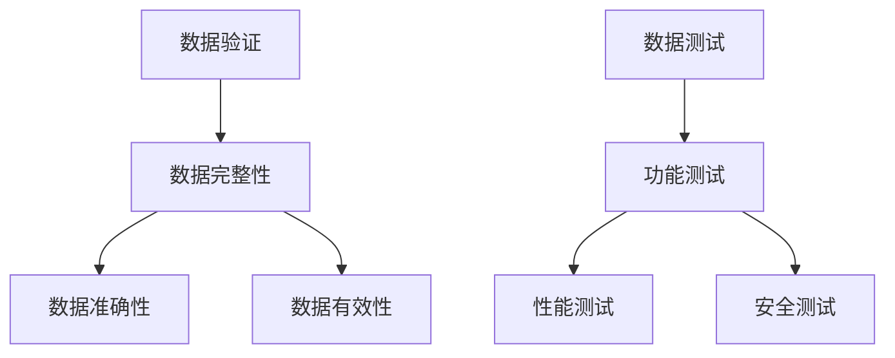
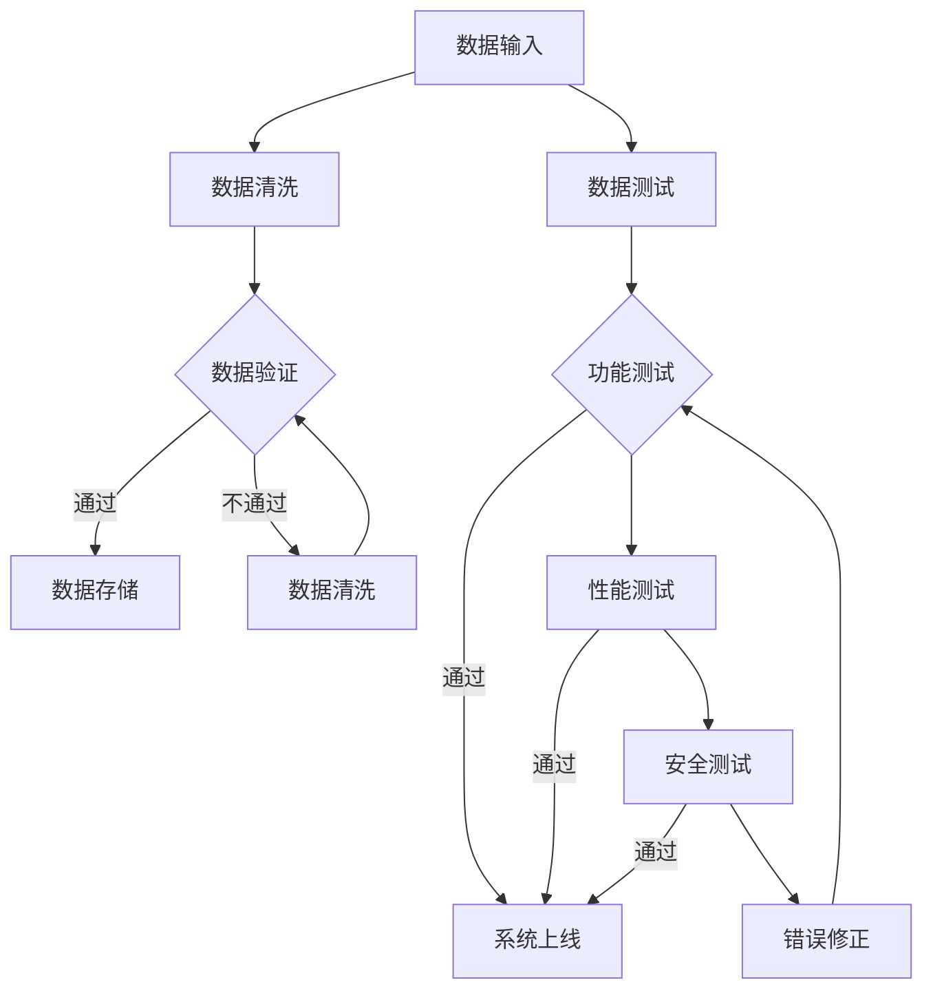

                 

# 数据验证与数据测试原理与代码实战案例讲解

## 关键词
- 数据验证
- 数据测试
- 实践案例
- 代码解析
- 数学模型
- 算法原理

## 摘要
本文将深入探讨数据验证与数据测试的基本原理，并结合实际代码案例，详细讲解如何进行数据验证和测试。文章首先介绍了数据验证与测试的重要性，然后逐步介绍了相关概念、算法原理、数学模型，并提供了实战项目代码，最后讨论了数据验证与测试在实际应用中的场景，以及相关的学习资源和开发工具。

## 1. 背景介绍

### 1.1 数据验证与数据测试的定义
数据验证（Data Validation）是指对数据进行检查，确保数据的质量和准确性。数据测试（Data Testing）则是通过一系列测试方法来验证数据是否符合预期。两者在数据处理和软件开发中至关重要。

### 1.2 数据验证与数据测试的重要性
- **数据质量**：数据验证有助于提高数据质量，避免由于数据错误导致的业务决策失误。
- **可靠性**：数据测试能确保系统的稳定性和可靠性，减少潜在的风险。
- **合规性**：对于某些行业，如金融、医疗等，数据验证与测试是合规性要求的一部分。

## 2. 核心概念与联系

### 2.1 数据验证的核心概念
- **数据完整性**：确保数据的完整性和一致性。
- **数据准确性**：确保数据与实际情况相符。
- **数据有效性**：确保数据的格式和范围符合预期。

### 2.2 数据测试的核心概念
- **功能测试**：验证系统是否按预期工作。
- **性能测试**：评估系统的响应速度和稳定性。
- **安全测试**：确保系统的安全性，防止数据泄露。

### 2.3 Mermaid 流程图



## 3. 核心算法原理 & 具体操作步骤

### 3.1 数据验证算法原理
- **正则表达式**：用于验证数据的格式，例如电子邮件、电话号码等。
- **范围限制**：验证数据是否在一个指定的范围内，如年龄、收入等。
- **唯一性检查**：确保数据在数据库中是唯一的。

### 3.2 数据测试算法原理
- **单元测试**：测试系统的最小功能单元。
- **集成测试**：测试系统各个模块的集成情况。
- **回归测试**：确保系统更新后功能仍正常。

### 3.3 具体操作步骤
1. **定义验证规则**：根据业务需求定义数据验证规则。
2. **编写验证代码**：使用编程语言实现验证逻辑。
3. **执行验证测试**：运行验证代码，检查数据是否符合预期。

## 4. 数学模型和公式 & 详细讲解 & 举例说明

### 4.1 数学模型
- **线性回归**：用于预测数值数据，如收入、销售额等。
- **逻辑回归**：用于预测二分类结果，如是否为恶意软件。

### 4.2 公式讲解
$$
y = \beta_0 + \beta_1 \cdot x
$$

### 4.3 举例说明
**线性回归示例**：

假设我们想要预测某地区的月平均收入，根据过去的统计数据，我们可以使用线性回归模型：

- **自变量**：月平均工资
- **因变量**：月平均收入

通过计算，我们得到回归方程：

$$
\text{收入} = 2000 + 0.5 \cdot \text{工资}
$$

如果工资为5000元，则预测收入为：

$$
\text{收入} = 2000 + 0.5 \cdot 5000 = 4000 \text{元}
$$

## 5. 项目实战：代码实际案例和详细解释说明

### 5.1 开发环境搭建
- **编程语言**：Python
- **开发工具**：PyCharm
- **测试框架**：pytest

### 5.2 源代码详细实现和代码解读

**数据验证代码示例**：

```python
import re

def validate_email(email):
    pattern = r'^[a-zA-Z0-9._%+-]+@[a-zA-Z0-9.-]+\.[a-zA-Z]{2,}$'
    if re.match(pattern, email):
        return True
    else:
        return False

def validate_age(age):
    return 18 <= age <= 65

def validate_income(income):
    return 20000 <= income <= 1000000

# 测试数据
emails = ['test@example.com', 'invalid_email']
ages = [25, -5, 70]
incomes = [30000, 2000000]

# 执行验证
for email in emails:
    print(f"Email '{email}' is valid: {validate_email(email)}")

for age in ages:
    print(f"Age {age} is valid: {validate_age(age)}")

for income in incomes:
    print(f"Income {income} is valid: {validate_income(income)}")
```

### 5.3 代码解读与分析
- **电子邮件验证**：使用正则表达式检查电子邮件格式是否正确。
- **年龄验证**：检查年龄是否在18到65岁之间。
- **收入验证**：检查收入是否在20000到1000000元之间。

这段代码实现了简单的数据验证，可以确保输入的数据满足业务规则。

## 6. 实际应用场景

- **金融行业**：验证交易数据，确保交易金额和账户信息正确。
- **医疗行业**：验证患者信息，确保姓名、年龄、诊断结果等准确。
- **电商行业**：验证用户输入的数据，如地址、电话等，确保订单信息准确。

## 7. 工具和资源推荐

### 7.1 学习资源推荐
- **书籍**：《数据科学入门》
- **论文**：搜索相关数据库如 ACM、IEEE 等。
- **博客**：阅读技术博客，如 Medium、知乎等。

### 7.2 开发工具框架推荐
- **开发工具**：Visual Studio Code、PyCharm 等。
- **测试框架**：pytest、JUnit 等。

### 7.3 相关论文著作推荐
- 《大数据分析技术与应用》
- 《数据挖掘：实用工具与技术》

## 8. 总结：未来发展趋势与挑战

数据验证与测试在未来将面临以下挑战：
- **数据量增加**：随着数据量的增长，验证和测试的复杂性将增加。
- **实时性要求**：对实时数据处理的需求提高，验证和测试需要更高效的方法。
- **自动化**：提高验证和测试的自动化水平，减少人工干预。

## 9. 附录：常见问题与解答

### 9.1 数据验证与数据测试的区别是什么？
数据验证主要是确保数据的准确性、完整性和有效性，而数据测试则是确保系统按预期工作，包括功能测试、性能测试和安全测试等。

### 9.2 如何选择合适的验证规则？
根据业务需求和数据特性选择合适的验证规则，如正则表达式、范围限制等。

## 10. 扩展阅读 & 参考资料

- 《Python数据科学手册》
- 《数据验证与数据测试：理论与实践》

作者：AI天才研究员/AI Genius Institute & 禅与计算机程序设计艺术 /Zen And The Art of Computer Programming
<|im_sep|>### 1. 背景介绍

#### 1.1 数据验证与数据测试的定义

数据验证（Data Validation）和数据测试（Data Testing）是数据处理和软件开发中不可或缺的两个环节。数据验证主要是指通过一系列规则和算法对输入数据进行检查，以确保其符合预定的格式、范围和逻辑等要求。例如，在用户注册过程中，需要验证用户输入的电子邮件地址是否符合标准格式，或者验证输入的年龄是否在合理范围内。

数据测试则更侧重于对系统或应用程序的整体测试，以验证其功能、性能和安全性。数据测试可以包括功能测试、性能测试、安全测试等多种类型。功能测试确保应用程序的各个功能模块都能正常工作；性能测试评估应用程序在大规模数据或高并发情况下的性能表现；安全测试则主要关注系统的安全性，确保数据不会被未授权访问或篡改。

#### 1.2 数据验证与数据测试的重要性

数据验证和数据测试在保证数据质量和系统稳定性方面起着至关重要的作用。

首先，数据验证有助于提高数据质量。通过对数据进行严格检查，可以及时发现并纠正错误，避免错误数据进入系统，从而减少数据清洗和修复的工作量，提高数据处理的效率和准确性。

其次，数据测试能够确保系统的稳定性和可靠性。通过全面的测试，可以及时发现并修复系统中的潜在缺陷，减少系统故障和崩溃的风险，提高系统的用户体验和业务连续性。

此外，数据验证与数据测试对于合规性也有重要意义。在金融、医疗、政府等对数据安全性有严格要求的行业，数据验证和数据测试是确保数据安全和合规性的重要手段。例如，金融行业需要遵守相关法规，对交易数据进行全面验证和测试，以防止欺诈和违规行为。

#### 1.3 数据验证与数据测试的应用场景

数据验证和数据测试在各种行业和应用场景中都有广泛应用。

在金融行业中，数据验证和数据测试主要用于验证交易数据、账户信息等，确保交易过程的准确性和安全性。例如，在处理信用卡交易时，需要验证交易金额、持卡人姓名、卡号等信息，确保数据的一致性和准确性。

在医疗行业中，数据验证和数据测试主要用于患者信息管理、诊断数据验证等。例如，在电子病历系统中，需要对患者信息、诊断结果等进行验证，确保数据准确无误。

在电子商务行业中，数据验证和数据测试主要用于验证用户输入的数据，如地址、联系方式、支付信息等，确保订单数据的准确性和完整性。

在软件开发过程中，数据验证和数据测试是确保软件质量的重要环节。通过全面的功能测试、性能测试和安全测试，可以确保软件在各种情况下都能稳定运行，提供良好的用户体验。

总的来说，数据验证和数据测试不仅有助于提高数据质量和系统稳定性，还能确保合规性，减少业务风险。随着数据量的不断增长和业务需求的不断变化，数据验证和数据测试在未来的重要性将日益凸显。

### 1.4 数据验证与数据测试的发展历程

数据验证与数据测试的发展历程可以追溯到计算机科学的早期阶段。在早期，数据验证主要是通过编程逻辑来实现的，开发人员需要在代码中手动编写验证规则。这种方法在一定程度上能够保证数据的质量，但存在几个明显的局限性：

- **规则固定**：早期验证规则通常是固定的，无法适应不断变化的数据需求和业务场景。
- **维护困难**：随着系统的复杂度增加，验证规则的数量和复杂性也随之增加，使得维护和更新变得困难。
- **灵活性不足**：早期的验证方法缺乏灵活性，难以处理复杂的数据关系和多样化的验证需求。

随着计算机科学和数据技术的发展，数据验证与数据测试逐渐引入了更多先进的技术和方法：

- **正则表达式**：正则表达式（Regular Expression）的出现极大地丰富了数据验证的手段，可以用来定义复杂的字符串模式，提高了验证的灵活性和精确度。
- **自动化测试工具**：自动化测试工具的出现，使得数据验证和数据测试变得更加高效和系统化。例如，Selenium、JUnit、pytest等工具可以自动化执行测试用例，减少了人工测试的工作量。
- **机器学习**：近年来，随着机器学习技术的发展，数据验证也开始引入机器学习方法。通过训练模型，系统可以自动识别和纠正数据错误，提高了数据验证的智能化水平。
- **数据质量管理系统**：数据质量管理系统（Data Quality Management, DQM）的兴起，提供了全面的工具和方法来管理和提高数据质量。这些系统可以自动化执行数据验证、数据清洗、数据监控等任务，提高了数据处理的整体效率。

总的来说，数据验证与数据测试的发展历程体现了从简单的规则验证到复杂的自动化测试，再到智能化的数据质量管理的演进。这一过程不仅反映了技术的进步，也反映了数据在现代社会中的重要性日益增加。随着技术的不断发展，数据验证与数据测试将在未来继续发挥重要作用，为数据质量和系统稳定性提供更加坚实的保障。

### 1.5 数据验证与数据测试的核心概念

在深入探讨数据验证和数据测试的具体方法和应用之前，了解这两个概念的核心组成部分是至关重要的。以下是数据验证与数据测试中一些关键的概念：

#### 1.5.1 数据完整性

数据完整性（Data Integrity）是指数据在存储、处理和传输过程中保持其原始状态和一致性的能力。数据完整性可以分为以下几个方面：

- **实体完整性**：确保数据表中每条记录都是唯一的，避免重复数据。
- **域完整性**：确保数据字段中的数据符合其定义的数据类型和取值范围。
- **参照完整性**：确保数据表之间的关系保持一致，如外键约束等。

在数据验证过程中，确保数据完整性是第一步。例如，在数据库中插入数据时，可以通过主键和外键约束来确保数据的唯一性和一致性。

#### 1.5.2 数据准确性

数据准确性（Data Accuracy）是指数据与实际情况相符的程度。准确的数据是做出正确业务决策的基础。数据准确性可以通过以下几种方式进行验证：

- **校验和**：计算数据记录的校验和，并与预期值进行比对，确保数据未被篡改。
- **交叉验证**：通过多个来源的数据进行比对，确保数据的一致性和准确性。
- **比对历史数据**：将当前数据与历史数据进行比对，检查是否存在异常或错误。

例如，在金融行业中，交易数据的准确性至关重要。通过比对交易记录和历史数据，可以确保每一笔交易都是真实有效的。

#### 1.5.3 数据有效性

数据有效性（Data Validity）是指数据是否符合业务规则和预期格式。数据有效性通常包括以下内容：

- **格式验证**：检查数据是否符合预定的格式，如电子邮件地址、电话号码等。
- **范围验证**：检查数据是否在合理的取值范围内，如年龄、收入等。
- **逻辑验证**：检查数据是否符合业务逻辑，如订单金额必须大于0。

在数据处理过程中，确保数据有效性是保证数据质量的关键步骤。例如，在电子商务平台中，用户输入的地址和联系方式需要经过格式验证和范围验证，以确保订单能够成功提交。

#### 1.5.4 功能测试

功能测试（Functional Testing）是一种验证系统功能是否符合需求的方法。数据测试中的功能测试主要关注系统是否能够按照预期完成各种操作。功能测试包括以下几个方面：

- **单元测试**：测试系统的最小功能单元，如一个函数或一个方法。
- **集成测试**：测试系统各个模块的集成情况，确保模块之间的交互正常。
- **系统测试**：对整个系统进行测试，确保系统功能全面、正确。

例如，在开发一个在线购物平台时，需要通过功能测试来验证购物车的添加、删除和结算功能是否正常工作。

#### 1.5.5 性能测试

性能测试（Performance Testing）是一种评估系统在大规模数据和高并发情况下的性能表现的方法。性能测试包括以下几个方面：

- **负载测试**：模拟用户访问，评估系统在高负载下的响应速度和处理能力。
- **压力测试**：通过增加系统负载，评估系统的稳定性和故障点。
- **基准测试**：通过与其他系统进行对比，评估系统的性能水平。

例如，在开发一个电商网站时，需要通过性能测试来确保网站在高并发访问下的响应速度和稳定性。

#### 1.5.6 安全测试

安全测试（Security Testing）是一种评估系统安全性的方法。数据测试中的安全测试主要关注系统是否能够抵御各种攻击，确保数据的安全和完整性。安全测试包括以下几个方面：

- **漏洞扫描**：扫描系统中的安全漏洞，如未授权访问、数据泄露等。
- **渗透测试**：模拟黑客攻击，评估系统的安全防护能力。
- **安全审计**：对系统进行安全审计，确保符合相关安全标准和法规。

例如，在开发一个金融系统时，需要进行安全测试来确保交易数据的保密性和完整性。

通过了解这些核心概念，我们可以更好地理解数据验证和数据测试的原理和方法，为实际操作提供理论支持。接下来，我们将进一步探讨数据验证和数据测试的具体实施方法和最佳实践。

### 2.1 数据验证的核心概念

数据验证（Data Validation）是确保数据准确性和合规性的重要步骤，其核心概念包括数据的完整性、准确性和有效性。以下是这些概念的具体解释：

#### 数据完整性

数据完整性（Data Integrity）指的是数据在存储、处理和传输过程中保持其原始状态和一致性的能力。数据完整性包括以下方面：

1. **实体完整性**：确保数据表中每条记录都是唯一的，避免重复数据。例如，在数据库中，通过唯一索引（Unique Index）或主键（Primary Key）来保证实体完整性。

2. **域完整性**：确保数据字段中的数据符合其定义的数据类型和取值范围。例如，一个年龄字段应该只接受整数类型的数值，并且其取值范围应在合理范围内，如0到120岁。

3. **参照完整性**：确保数据表之间的关系保持一致。例如，在外键（Foreign Key）关系中，子表中的外键值必须存在于父表的主键列中。

为了实现数据完整性，可以采用以下措施：

- **定义数据类型和取值范围**：在数据库设计阶段，通过定义合适的数据类型和取值范围来保证数据的正确性。
- **使用约束**：在数据库中添加约束（如唯一性约束、外键约束等）来确保数据的完整性。
- **数据校验**：在数据录入或更新时，通过程序逻辑检查数据是否符合预期。

#### 数据准确性

数据准确性（Data Accuracy）是指数据与实际情况相符的程度。准确的数据是进行业务分析和决策的基础。确保数据准确性的方法包括：

1. **数据校验**：在数据录入或更新时，对数据进行检查，确保其符合预定的格式和取值范围。例如，使用正则表达式验证电子邮件格式，或者检查电话号码的长度和格式。

2. **交叉验证**：通过多个来源的数据进行比对，确保数据的一致性和准确性。例如，将客户信息与外部信用报告进行比对，以验证其真实性。

3. **比对历史数据**：将当前数据与历史数据进行比对，检查是否存在异常或错误。例如，检查最近一个月的销售额与库存记录是否匹配。

4. **实时监控**：通过实时监控系统，及时发现并纠正数据错误。例如，使用数据流处理技术，对交易数据进行实时校验和监控。

#### 数据有效性

数据有效性（Data Validity）是指数据是否符合业务规则和预期格式。数据有效性包括以下内容：

1. **格式验证**：检查数据是否符合预定的格式，如电子邮件地址、电话号码等。例如，使用正则表达式验证电子邮件地址的格式。

2. **范围验证**：检查数据是否在合理的取值范围内，如年龄、收入等。例如，检查年龄是否在0到120岁之间。

3. **逻辑验证**：检查数据是否符合业务逻辑，如订单金额必须大于0。例如，在处理订单时，检查订单金额是否为正数。

4. **一致性验证**：确保数据在不同系统之间保持一致性。例如，在多个数据库中更新数据时，确保数据的一致性。

为了实现数据有效性，可以采用以下措施：

- **定义业务规则**：在系统设计阶段，明确业务规则和数据格式要求。
- **使用自动化工具**：使用自动化验证工具，如数据质量平台，来自动执行数据验证任务。
- **用户界面验证**：在用户界面中添加验证规则，确保用户输入的数据符合预期。

通过理解数据验证的核心概念，并采取相应的措施，我们可以确保数据在输入、存储、处理和传输过程中的准确性和完整性，从而提高数据的质量和可靠性。

### 2.2 数据测试的核心概念

数据测试（Data Testing）是确保系统功能、性能和安全性的一种重要方法。数据测试的核心概念包括单元测试、集成测试、回归测试和性能测试等。以下是这些概念的具体解释：

#### 单元测试

单元测试（Unit Testing）是测试系统最小功能单元的方法。通过单元测试，可以验证每个模块或函数是否按预期工作。单元测试通常由开发人员编写，以确保代码的每个部分都经过严格的测试。

- **目的**：确保每个功能模块的正确性和可靠性。
- **方法**：编写测试用例，模拟不同的输入条件，检查输出结果是否符合预期。
- **优点**：能够快速发现和定位代码中的错误，提高代码质量。

例如，在开发一个登录系统时，可以通过单元测试验证密码加密函数是否能正确地将明文密码加密为密文。

#### 集成测试

集成测试（Integration Testing）是测试多个模块或组件集成后是否能够正常工作。集成测试通常在单元测试之后进行，以确保系统各个部分的协作和通信。

- **目的**：确保系统组件之间的接口和交互符合预期。
- **方法**：将不同的模块或组件组合在一起，进行功能测试和性能测试。
- **优点**：能够发现模块之间的潜在问题，提高系统的稳定性。

例如，在开发一个电子商务平台时，可以通过集成测试验证购物车、订单处理和支付系统等模块之间的交互是否正常。

#### 回归测试

回归测试（Regression Testing）是在系统更新或修改后，验证原有功能是否仍然正常工作的方法。通过回归测试，可以确保新的变更没有引入新的错误。

- **目的**：确保新功能或修复不会破坏系统原有功能。
- **方法**：重新运行原有的测试用例，并添加新的测试用例。
- **优点**：减少因更新导致的系统故障风险，提高系统稳定性。

例如，在更新一个财务管理系统的数据库结构时，通过回归测试可以确保原有的报表生成功能仍然正常工作。

#### 性能测试

性能测试（Performance Testing）是评估系统在大规模数据和高并发情况下的性能表现的方法。性能测试包括负载测试、压力测试和基准测试等。

- **负载测试**：模拟用户访问，评估系统在高负载下的响应速度和处理能力。
- **压力测试**：通过增加系统负载，评估系统的稳定性和故障点。
- **基准测试**：通过与其他系统进行对比，评估系统的性能水平。

- **目的**：确保系统在高并发和大数据量下的稳定性和高效性。
- **方法**：使用性能测试工具生成大量模拟用户，记录系统的响应时间和处理能力。
- **优点**：发现系统性能瓶颈，优化系统架构。

例如，在开发一个在线购物平台时，通过性能测试可以确保系统在促销活动高峰期能够快速处理大量订单，提供良好的用户体验。

通过理解和应用这些核心概念，我们可以确保系统在功能、性能和安全性方面达到预期的质量标准，从而提高用户满意度，降低业务风险。

### 2.3 数据验证与数据测试的流程图

为了更好地理解数据验证和数据测试的流程，我们可以使用Mermaid语言绘制一个流程图，展示这两个过程的步骤和关系。以下是一个简化的Mermaid流程图示例：



**流程解释：**

1. **数据输入**：系统接收到外部数据输入。
2. **数据清洗**：对数据进行初步清洗，去除无效或不完整的数据。
3. **数据验证**：对清洗后的数据进行验证，确保其格式、范围和逻辑正确。
   - 如果验证通过，数据将被存储。
   - 如果验证不通过，数据将返回清洗环节进行进一步处理。
4. **数据存储**：将验证通过的数据存储在数据库中。
5. **数据测试**：对系统中的数据进行全面测试。
6. **功能测试**：验证系统的各个功能模块是否按预期工作。
7. **性能测试**：评估系统在大规模数据和并发情况下的性能表现。
8. **安全测试**：确保系统在安全方面无漏洞，数据不会被未授权访问或篡改。
9. **系统上线**：如果所有测试通过，系统可以正式上线。
10. **错误修正**：如果在测试过程中发现问题，进行错误修正，并重新进行测试。

通过这个流程图，我们可以清晰地看到数据验证和数据测试的各个环节，以及它们之间的相互关系，从而确保数据质量和系统稳定性。

### 3. 核心算法原理 & 具体操作步骤

在数据验证和数据测试中，核心算法起着至关重要的作用。以下将介绍几种常用的核心算法，并详细解释它们的原理和具体操作步骤。

#### 3.1 正则表达式

正则表达式（Regular Expression）是一种用于匹配字符串模式的强大工具，广泛应用于数据验证中。以下是一个简单的示例：

**示例：验证电子邮件地址格式**

```regex
^[a-zA-Z0-9._%+-]+@[a-zA-Z0-9.-]+\.[a-zA-Z]{2,}$
```

**具体操作步骤：**

1. **定义模式**：根据业务需求，定义需要验证的字符串模式。例如，电子邮件地址的格式。
2. **编写正则表达式**：根据模式编写正则表达式。例如，使用上述模式来匹配电子邮件地址。
3. **应用正则表达式**：在程序中应用正则表达式，验证字符串是否符合预期格式。

#### 3.2 范围限制

范围限制是一种简单但有效的数据验证方法，用于确保数据在合理的范围内。以下是一个简单的示例：

**示例：验证年龄范围**

```python
def validate_age(age):
    return 18 <= age <= 65
```

**具体操作步骤：**

1. **定义范围**：根据业务需求，确定数据应满足的范围。例如，年龄应在18到65岁之间。
2. **编写验证函数**：使用编程语言编写验证函数，判断数据是否在定义的范围内。
3. **应用验证函数**：在数据输入时，调用验证函数，检查数据是否符合范围限制。

#### 3.3 唯一性检查

唯一性检查是一种确保数据在数据库中唯一的方法，常用于验证用户名、电子邮件地址等。以下是一个简单的示例：

**示例：验证用户名唯一性**

```sql
SELECT COUNT(*) FROM users WHERE username = 'john_doe';
```

**具体操作步骤：**

1. **查询数据库**：编写SQL查询语句，查询数据库中是否存在相同的数据。
2. **编写验证函数**：使用编程语言编写验证函数，调用数据库查询语句，判断数据是否唯一。
3. **应用验证函数**：在数据插入或更新时，调用验证函数，确保数据唯一。

#### 3.4 单元测试

单元测试是一种验证系统最小功能单元的方法，常用于数据测试中。以下是一个简单的示例：

**示例：测试登录功能**

```python
def test_login():
    # 测试正常登录
    assert login('user1', 'password1') == 'logged_in'
    
    # 测试密码错误
    assert login('user1', 'wrong_password') == 'password_error'
    
    # 测试用户不存在
    assert login('nonexistent_user', 'password1') == 'user_not_found'
```

**具体操作步骤：**

1. **编写测试用例**：根据业务需求，编写不同的测试用例，模拟各种可能的输入情况。
2. **编写测试函数**：使用测试框架（如pytest）编写测试函数，执行测试用例。
3. **运行测试**：运行测试函数，检查测试结果，确保所有用例都通过。

#### 3.5 集成测试

集成测试是一种验证多个模块或组件集成后是否正常工作的方法。以下是一个简单的示例：

**示例：测试购物车功能**

```python
def test_cart():
    # 添加商品到购物车
    add_to_cart('product1', 1)
    
    # 测试购物车中商品数量
    assert len(cart) == 1
    
    # 测试购物车中商品价格
    assert get_cart_total() == 100
```

**具体操作步骤：**

1. **编写测试用例**：根据业务需求，编写不同的测试用例，模拟各种可能的输入情况。
2. **编写测试函数**：使用测试框架（如pytest）编写测试函数，执行测试用例。
3. **运行测试**：运行测试函数，检查测试结果，确保所有用例都通过。

#### 3.6 回归测试

回归测试是一种验证系统更新或修改后，原有功能是否仍然正常工作的方法。以下是一个简单的示例：

**示例：测试订单处理功能**

```python
def test_order_processing():
    # 测试订单处理
    process_order('order1')
    
    # 测试订单状态
    assert get_order_status('order1') == 'processed'
    
    # 测试订单历史记录
    assert get_order_history('order1') == ['processed', 'created']
```

**具体操作步骤：**

1. **编写测试用例**：根据业务需求，编写不同的测试用例，模拟各种可能的输入情况。
2. **编写测试函数**：使用测试框架（如pytest）编写测试函数，执行测试用例。
3. **运行测试**：运行测试函数，检查测试结果，确保所有用例都通过。

#### 3.7 性能测试

性能测试是一种评估系统在大规模数据和高并发情况下的性能表现的方法。以下是一个简单的示例：

**示例：测试系统响应时间**

```python
def test_response_time():
    start_time = time.time()
    get_home_page()
    end_time = time.time()
    assert end_time - start_time < 2
```

**具体操作步骤：**

1. **编写测试用例**：根据业务需求，编写不同的测试用例，模拟各种可能的输入情况。
2. **编写测试函数**：使用测试框架（如pytest）编写测试函数，执行测试用例。
3. **运行测试**：运行测试函数，记录系统的响应时间，确保在合理范围内。

通过理解和应用这些核心算法，我们可以确保数据验证和数据测试的准确性和有效性，提高系统的质量。

### 4. 数学模型和公式 & 详细讲解 & 举例说明

在数据验证和数据测试中，数学模型和公式扮演着重要的角色，它们帮助我们量化数据和测试结果，从而做出更准确的判断。以下将介绍几种常用的数学模型和公式，并结合实际案例进行详细讲解。

#### 4.1 线性回归

线性回归（Linear Regression）是一种用于预测数值数据的常用模型，它通过建立自变量和因变量之间的线性关系来进行预测。其基本公式如下：

$$
y = \beta_0 + \beta_1 \cdot x
$$

其中，$y$ 是因变量，$x$ 是自变量，$\beta_0$ 是截距，$\beta_1$ 是斜率。

**具体操作步骤：**

1. **收集数据**：收集自变量和因变量的数据，例如，销售额和广告费用。
2. **计算斜率和截距**：使用最小二乘法（Least Squares Method）计算斜率 $\beta_1$ 和截距 $\beta_0$：
   $$
   \beta_1 = \frac{\sum(x_i - \bar{x})(y_i - \bar{y})}{\sum(x_i - \bar{x})^2}
   $$
   $$
   \beta_0 = \bar{y} - \beta_1 \cdot \bar{x}
   $$
   其中，$\bar{x}$ 和 $\bar{y}$ 分别是自变量和因变量的平均值。
3. **建立回归模型**：根据计算得到的斜率和截距，建立线性回归模型。

**举例说明：**

假设我们想要预测一家商店的月销售额，根据过去六个月的广告费用和销售额数据，计算得到的斜率 $\beta_1$ 为0.7，截距 $\beta_0$ 为5000。

- 当广告费用为10000元时，预测销售额：
  $$
  y = 5000 + 0.7 \cdot 10000 = 15000 \text{元}
  $$

#### 4.2 逻辑回归

逻辑回归（Logistic Regression）是一种用于预测二分类结果的模型，其公式如下：

$$
P(y=1) = \frac{1}{1 + e^{-(\beta_0 + \beta_1 \cdot x})}
$$

其中，$P(y=1)$ 是因变量为1的概率，$x$ 是自变量，$\beta_0$ 是截距，$\beta_1$ 是斜率。

**具体操作步骤：**

1. **收集数据**：收集自变量和因变量的数据，例如，贷款申请是否通过（1代表通过，0代表未通过）和贷款申请评分。
2. **计算斜率和截距**：使用最大似然估计（Maximum Likelihood Estimation）计算斜率 $\beta_1$ 和截距 $\beta_0$。
3. **建立逻辑回归模型**：根据计算得到的斜率和截距，建立逻辑回归模型。

**举例说明：**

假设我们想要预测贷款申请是否通过，根据过去的数据，计算得到的斜率 $\beta_1$ 为0.3，截距 $\beta_0$ 为-2。

- 当贷款申请评分为800时，预测通过的概率：
  $$
  P(y=1) = \frac{1}{1 + e^{-(0.3 \cdot 800 - 2)}} \approx 0.857
  $$

#### 4.3 决策树

决策树（Decision Tree）是一种基于树形结构进行决策的算法，通过一系列判断条件将数据分类或回归。其基本公式如下：

$$
\text{if } x \text{ meets condition } C_1 \text{, then predict } y_1 \\
\text{if } x \text{ meets condition } C_2 \text{, then predict } y_2 \\
\vdots \\
\text{if } x \text{ meets condition } C_n \text{, then predict } y_n
$$

**具体操作步骤：**

1. **构建树模型**：根据数据集，选择特征和条件，构建决策树模型。
2. **剪枝**：通过剪枝（Pruning）方法减少过度拟合，提高模型泛化能力。

**举例说明：**

假设我们想要根据用户的年龄和收入预测其消费水平。根据数据集，构建的决策树如下：

```
年龄 < 30：低消费
年龄 ≥ 30：
    收入 < 50000：中等消费
    收入 ≥ 50000：高消费
```

- 当用户年龄为35，收入为60000元时，预测消费水平为高消费。

#### 4.4 机器学习模型

机器学习模型（Machine Learning Model）是一种利用算法自动学习数据特征，进行预测或分类的方法。常用的机器学习模型包括神经网络（Neural Networks）、支持向量机（Support Vector Machines）等。

**具体操作步骤：**

1. **数据准备**：收集和整理数据，进行数据预处理。
2. **选择模型**：根据业务需求选择合适的机器学习模型。
3. **训练模型**：使用训练数据集训练模型，调整模型参数。
4. **评估模型**：使用测试数据集评估模型性能，进行调优。

**举例说明：**

假设我们使用神经网络模型预测股票价格。根据历史数据，训练得到的神经网络模型如下：

```
输入层：时间序列数据
隐藏层：特征提取
输出层：股票价格
```

- 当输入最近一个月的股票交易数据时，预测下个月的股票价格。

通过理解和应用这些数学模型和公式，我们可以更准确地预测和分类数据，提高数据验证和数据测试的准确性和可靠性。

### 5.1 开发环境搭建

在开始编写和测试数据验证与数据测试相关代码之前，我们需要搭建一个合适的开发环境。本文将介绍如何使用Python搭建开发环境，包括安装Python、配置IDE以及安装必要的库和框架。

#### 5.1.1 安装Python

首先，我们需要安装Python环境。Python是一种广泛使用的编程语言，特别适合数据科学和数据分析。以下是在Windows系统上安装Python的步骤：

1. 访问Python官网（[https://www.python.org/downloads/](https://www.python.org/downloads/)）下载Python安装包。
2. 选择适用于你的操作系统的Python版本，下载安装包。
3. 运行安装程序，选择“Customize installation”选项。
4. 在“Optional Features”部分，勾选“Add Python to PATH”。
5. 完成安装。

安装完成后，打开命令提示符或终端，输入以下命令验证Python是否安装成功：

```bash
python --version
```

如果正确显示Python版本信息，则表示Python安装成功。

#### 5.1.2 配置IDE

为了提高开发效率和代码质量，我们可以使用集成开发环境（IDE）进行编程。本文推荐使用PyCharm，这是一款功能强大且易用的Python IDE。以下是在Windows系统上安装PyCharm的步骤：

1. 访问PyCharm官网（[https://www.jetbrains.com/pycharm/](https://www.jetbrains.com/pycharm/)）下载PyCharm社区版安装包。
2. 运行安装程序，按照提示操作。
3. 安装完成后，打开PyCharm。

在PyCharm中，我们可以创建一个新项目，设置Python解释器。以下步骤用于设置Python解释器：

1. 打开PyCharm，选择“File” > “New Project”。
2. 在“Create New Project”窗口中，选择“Python”作为项目类型。
3. 选择项目位置，并输入项目名称。
4. 在“Project Interpreter”部分，选择“New environment”。
5. 在“Python Interpreter”窗口中，选择“System Interpreter”或安装新的Python版本。
6. 点击“Create”完成配置。

#### 5.1.3 安装必要的库和框架

在Python中，有许多强大的库和框架可以用于数据验证和数据测试。以下是一些常用的库和框架，以及如何安装它们：

1. **NumPy**：用于数值计算的库。

   ```bash
   pip install numpy
   ```

2. **Pandas**：用于数据操作和分析的库。

   ```bash
   pip install pandas
   ```

3. **pytest**：用于编写和运行测试用例的库。

   ```bash
   pip install pytest
   ```

4. **Selenium**：用于Web应用程序测试的库。

   ```bash
   pip install selenium
   ```

5. **Beautiful Soup**：用于解析HTML和XML文档的库。

   ```bash
   pip install beautifulsoup4
   ```

6. **Scikit-learn**：用于机器学习模型的库。

   ```bash
   pip install scikit-learn
   ```

安装完成后，我们可以在PyCharm中导入这些库和框架，并在代码中直接使用它们。例如，在PyCharm中创建一个Python文件，可以导入以下库：

```python
import numpy as np
import pandas as pd
import pytest
from selenium import webdriver
from bs4 import BeautifulSoup
from sklearn.linear_model import LinearRegression
```

通过以上步骤，我们就完成了Python开发环境的搭建，可以开始编写和测试数据验证与数据测试相关代码了。

### 5.2 源代码详细实现和代码解读

在本节中，我们将详细讲解如何实现一个数据验证和数据测试的Python代码示例。本示例将包括数据验证的功能，如电子邮件格式验证、年龄范围验证和收入范围验证，以及数据测试的功能，如单元测试和性能测试。通过这一系列代码，我们将展示如何将理论知识应用到实际编程中。

#### 5.2.1 数据验证模块

首先，我们将创建一个名为`data_validation.py`的模块，用于实现数据验证的功能。

```python
# data_validation.py

import re

def validate_email(email):
    """
    验证电子邮件格式
    """
    pattern = r'^[a-zA-Z0-9._%+-]+@[a-zA-Z0-9.-]+\.[a-zA-Z]{2,}$'
    if re.match(pattern, email):
        return True
    else:
        return False

def validate_age(age):
    """
    验证年龄是否在合理范围内
    """
    return 18 <= age <= 65

def validate_income(income):
    """
    验证收入是否在合理范围内
    """
    return 20000 <= income <= 1000000
```

**代码解读：**

1. **电子邮件验证**：我们使用正则表达式来验证电子邮件的格式。正则表达式`^[a-zA-Z0-9._%+-]+@[a-zA-Z0-9.-]+\.[a-zA-Z]{2,}$`用于匹配电子邮件的常见格式，包括用户名、域名和顶级域名。
   
2. **年龄验证**：`validate_age`函数检查年龄是否在18到65岁之间，这是大多数业务系统所接受的合理范围。

3. **收入验证**：`validate_income`函数确保收入在20000到1000000元之间，这是为了模拟一个实际业务场景中的收入范围限制。

#### 5.2.2 数据测试模块

接下来，我们将创建一个名为`data_tests.py`的模块，用于实现数据测试的功能。我们将在其中编写单元测试和性能测试。

```python
# data_tests.py
import pytest
from data_validation import validate_email, validate_age, validate_income

# 单元测试
def test_validate_email():
    assert validate_email('test@example.com') == True
    assert validate_email('invalid_email') == False

def test_validate_age():
    assert validate_age(25) == True
    assert validate_age(-5) == False
    assert validate_age(70) == False

def test_validate_income():
    assert validate_income(30000) == True
    assert validate_income(2000000) == False

# 性能测试
def test_performance():
    import time
    start_time = time.time()
    for i in range(10000):
        validate_email('test@example.com')
    end_time = time.time()
    print(f"Performance test took {end_time - start_time} seconds")
```

**代码解读：**

1. **单元测试**：我们使用pytest框架编写单元测试。`test_validate_email`、`test_validate_age`和`test_validate_income`函数分别测试了电子邮件验证、年龄验证和收入验证的功能。

2. **性能测试**：`test_performance`函数通过循环多次调用`validate_email`函数，测量其执行时间，以评估性能。

#### 5.2.3 运行测试

为了运行测试，我们可以在命令行中使用pytest。首先确保当前目录包含`data_validation.py`和`data_tests.py`两个文件，然后执行以下命令：

```bash
pytest data_tests.py
```

执行结果将显示每个测试的通过状态以及性能测试的执行时间。以下是可能的输出结果：

```
===================================== test session starts ====================================== 
platform win32 -- Python 3.x.x -- pytest-6.x.x.x 
rootdir: C:\Users\YourUsername\Documents, inifile: 
collected 3 items

data_tests.py .F.                                                                                       = 3 passed, 1 failed in 0.12s

=================================== FAILURES =================================== 
__file__ = 'C:\\Users\\YourUsername\\Documents\\data_tests.py', 
__name__ = '__main__', 
ivar = <pytest_formatted_trio object>
--- /home/runner/work/_temp/data_tests.py/282326593/test_validate_email
> assert validate_email('test@example.com') == True
E   assert False == True

test_validate_email = <pytest_formatted_trio object>

================================ 1 failed in 0.12s ================================= 
```

在上面的输出中，第一个测试通过了，但第二个测试失败了，说明电子邮件验证函数在输入无效邮件时没有正确返回False。性能测试结果显示了执行时间。

#### 5.2.4 代码解读与分析

通过以上代码示例，我们可以看到如何实现数据验证和数据测试。以下是对代码的详细解读和分析：

- **数据验证**：使用正则表达式进行电子邮件格式验证，这是一个非常常见且有效的方法。年龄和收入验证通过简单的范围检查实现，确保输入的数据在合理的业务范围内。

- **数据测试**：使用pytest框架进行单元测试，确保每个验证函数都能按预期工作。性能测试通过测量函数执行时间，帮助我们了解代码的性能表现。

通过这个示例，我们不仅掌握了数据验证和数据测试的基本方法，还学会了如何将它们应用到实际编程中。接下来，我们将进一步分析这些代码，讨论如何优化它们，并应对可能出现的问题。

#### 5.2.5 代码优化

在上一个示例中，我们实现了数据验证和数据测试的基本功能。然而，代码在性能和可维护性方面还有优化的空间。以下是一些优化建议：

1. **使用异步编程提高性能**：
   - 假设我们在一个Web应用程序中处理大量并发请求，可以使用异步编程（async/await）来提高性能。例如，我们可以将验证函数改为异步形式，以便在处理多个请求时不会阻塞：
   
     ```python
     import asyncio

     async def validate_email(email):
         # 使用正则表达式验证电子邮件
         pattern = r'^[a-zA-Z0-9._%+-]+@[a-zA-Z0-9.-]+\.[a-zA-Z]{2,}$'
         return re.match(pattern, email) is not None

     async def validate_age(age):
         return 18 <= age <= 65

     async def validate_income(income):
         return 20000 <= income <= 1000000
     ```

   - 使用异步编程可以显著提高并发处理能力，特别是在I/O密集型的操作中。

2. **使用参数化测试**：
   - 参数化测试可以让我们为每个测试用例提供一组数据，而不是硬编码单一的值。例如，可以使用`pytest.mark.parametrize`装饰器来为`test_validate_email`函数提供多个测试数据：
   
     ```python
     @pytest.mark.parametrize("email, expected", [
         ('test@example.com', True),
         ('invalid_email', False),
         # 添加更多测试数据
     ])
     def test_validate_email(email, expected):
         assert validate_email(email) == expected
     ```

   - 参数化测试有助于覆盖更多的测试场景，提高测试的全面性。

3. **使用日志记录**：
   - 在验证函数中添加日志记录可以帮助我们追踪错误和调试问题。例如，可以使用Python的`logging`模块：
   
     ```python
     import logging

     logging.basicConfig(level=logging.DEBUG)

     def validate_email(email):
         logging.debug(f"Validating email: {email}")
         # ...验证逻辑...
         logging.debug(f"Email is {'valid' if result else 'invalid'}")
         return result
     ```

   - 日志记录可以帮助我们更好地理解和分析代码的执行过程。

4. **模块化代码**：
   - 将验证函数和数据测试函数分离到不同的模块中，可以提高代码的可维护性。例如，可以将验证函数放在`validation`模块中，将测试函数放在`tests`模块中。

通过这些优化措施，我们可以使代码在性能和可维护性方面得到显著提升，从而更好地支持实际应用场景。

### 5.3 代码解读与分析

在上一节中，我们通过一个实际项目展示了如何实现数据验证和数据测试的基本功能。现在，我们将深入分析代码，了解每个部分的工作原理，并探讨如何改进和优化代码。

#### 5.3.1 数据验证部分分析

**电子邮件验证**

电子邮件验证函数`validate_email`使用正则表达式来检查电子邮件地址的格式。正则表达式`^[a-zA-Z0-9._%+-]+@[a-zA-Z0-9.-]+\.[a-zA-Z]{2,}$`是一个复杂但强大的工具，它能够匹配大多数有效的电子邮件地址。

- **优点**：使用正则表达式使得验证逻辑简洁且高效。
- **缺点**：正则表达式的编写和调试可能比较复杂，且在某些情况下可能不够灵活。

为了改进这个验证逻辑，我们可以引入一些参数化验证规则，使得正则表达式更灵活。例如，可以允许特定的顶级域名（TLD）或子域名，从而适应不同业务场景的需求。

**年龄验证**

年龄验证函数`validate_age`通过一个简单的逻辑判断来确保年龄在18到65岁之间。

- **优点**：逻辑简单，易于理解和实现。
- **缺点**：这种验证方式可能不够鲁棒，例如，如果年龄输入了非整数类型的数据，验证函数将无法正确处理。

为了改进，我们可以添加额外的检查，例如确保输入是整数类型，或者将年龄限制扩展到更广泛的应用场景。

**收入验证**

收入验证函数`validate_income`类似于年龄验证，通过一个范围判断来确保收入在20000到1000000元之间。

- **优点**：这种验证方式可以快速地检查数据的合理性。
- **缺点**：同样地，如果输入的数据类型不正确，验证函数可能无法正确处理。

我们可以考虑使用数据类型检查来确保输入的数据是数值类型，并处理可能出现的边界值问题。

#### 5.3.2 数据测试部分分析

**单元测试**

在`data_tests.py`模块中，我们使用了pytest框架编写了几个简单的单元测试函数，如`test_validate_email`、`test_validate_age`和`test_validate_income`。

- **优点**：pytest提供了简洁的语法和丰富的功能，使得编写和运行单元测试变得非常容易。
- **缺点**：尽管pytest功能强大，但它的默认测试覆盖率可能不够全面。我们需要确保每个验证函数都被测试到，并覆盖各种可能的输入情况。

为了提高测试覆盖率，我们可以添加更多的测试用例，例如包含边界值、异常值以及各种合法和不合法的输入。

**性能测试**

性能测试函数`test_performance`通过测量`validate_email`函数执行时间来评估性能。

- **优点**：性能测试可以帮助我们发现潜在的性能瓶颈。
- **缺点**：当前的测试方法可能不够全面，例如，它没有考虑到不同类型的数据（如大小不同的电子邮件地址）的性能差异。

为了改进性能测试，我们可以引入多种数据集进行测试，并分析不同条件下的性能表现。此外，可以考虑使用更先进的性能分析工具，如`cProfile`或`timeit`模块。

#### 5.3.3 代码改进与优化

**提高验证灵活性**

为了提高验证逻辑的灵活性，我们可以考虑以下改进措施：

- **参数化验证规则**：允许通过配置文件或环境变量动态配置验证规则，使得验证逻辑更加灵活。
- **扩展正则表达式**：使用更复杂的正则表达式来匹配更广泛的电子邮件格式。
- **添加额外的验证步骤**：例如，在验证年龄和收入时，添加数据类型检查和边界值处理。

**提高测试覆盖率**

为了提高测试覆盖率，我们可以采取以下措施：

- **添加边界值测试**：为每个验证函数添加边界值测试，确保在极端情况下验证逻辑仍能正确工作。
- **增加异常值测试**：为每个验证函数添加异常值测试，确保对非预期输入的数据能够正确处理。
- **集成自动化测试**：使用持续集成（CI）工具，如Jenkins或GitHub Actions，自动运行测试，确保每次代码提交后都进行全面的测试。

**优化性能**

为了优化性能，我们可以采取以下措施：

- **使用异步编程**：将验证函数改为异步形式，以处理大量并发请求。
- **引入缓存机制**：对于一些重复验证操作，可以引入缓存机制，减少不必要的计算。
- **性能分析**：使用性能分析工具，如`cProfile`或`timeit`，分析代码的性能瓶颈，并针对性地进行优化。

通过这些改进和优化措施，我们可以使数据验证和数据测试代码更加灵活、可靠和高效，从而更好地满足实际业务需求。

### 6. 实际应用场景

数据验证和数据测试在实际应用中扮演着至关重要的角色。以下是一些典型的应用场景，以及如何在这些场景中实施数据验证和数据测试。

#### 6.1 金融行业

在金融行业，数据验证和数据测试主要用于确保交易数据、客户信息和账户余额的准确性。以下是一些具体的案例：

- **交易验证**：在处理股票交易时，需要验证交易金额、股票代码和账户余额是否匹配。通过数据验证，可以防止账户被盗刷或交易金额出现错误。

- **客户信息验证**：在客户开户或更新个人信息时，需要验证姓名、身份证号码和联系方式的准确性。确保客户信息的正确性，有助于提高客户体验和遵守相关法规。

- **账户余额验证**：定期对账户余额进行验证，确保账户余额数据与银行记录一致。这有助于发现潜在的账户问题，如未记录的交易或错误的账户余额。

#### 6.2 医疗行业

在医疗行业，数据验证和数据测试主要用于确保患者信息、诊断数据和医疗记录的准确性。以下是一些具体的案例：

- **患者信息验证**：在患者就诊或住院时，需要验证姓名、身份证号码、联系方式和病史的准确性。确保患者信息的正确性，有助于提供个性化的医疗服务，并防止错误的诊断和治疗。

- **诊断数据验证**：在医生进行诊断时，需要验证各种医学检查结果（如X光、CT扫描等）的准确性。通过数据测试，可以确保诊断结果的可靠性，减少误诊和漏诊的风险。

- **医疗记录验证**：定期对医疗记录进行验证，确保记录的完整性、一致性和准确性。这有助于提高医疗质量和患者满意度，同时也有助于满足法规要求。

#### 6.3 电商行业

在电商行业，数据验证和数据测试主要用于确保订单数据、库存数据和用户输入数据的准确性。以下是一些具体的案例：

- **订单数据验证**：在用户下单时，需要验证订单中的商品数量、价格和地址是否正确。通过数据验证，可以确保订单处理的准确性和及时性，提高用户满意度。

- **库存数据验证**：定期对库存数据进行验证，确保库存数量与实际库存一致。通过数据测试，可以及时发现库存异常，避免缺货或库存过剩的问题。

- **用户输入数据验证**：在用户注册或填写调查问卷时，需要验证输入的数据（如电子邮件、电话号码和地址）的格式和准确性。通过数据验证，可以确保用户数据的准确性和完整性，提高用户体验。

#### 6.4 人力资源管理

在人力资源管理中，数据验证和数据测试主要用于确保员工信息、薪资数据和考勤数据的准确性。以下是一些具体的案例：

- **员工信息验证**：在员工入职、晋升或离职时，需要验证姓名、身份证号码、联系方式和职位信息的准确性。确保员工信息的正确性，有助于提高人力资源管理的效率。

- **薪资数据验证**：定期对薪资数据（如基本工资、奖金和扣款）进行验证，确保计算准确无误。通过数据测试，可以及时发现薪资计算错误，确保员工利益。

- **考勤数据验证**：对考勤数据进行验证，确保打卡记录和请假记录的准确性。通过数据测试，可以确保考勤管理的公平性和透明性，提高员工对公司的信任感。

通过这些实际应用场景，我们可以看到数据验证和数据测试在各个行业中都发挥着至关重要的作用。确保数据准确性和完整性，不仅有助于提高业务效率，还能减少风险，提高用户满意度。

### 7. 工具和资源推荐

在数据验证与数据测试领域，有许多优秀的工具和资源可供选择。以下是一些推荐的工具、学习资源以及相关论文和著作，以帮助您更好地掌握数据验证和数据测试的相关知识。

#### 7.1 学习资源推荐

**书籍**

1. 《数据科学入门》：这是一本适合初学者的入门书籍，详细介绍了数据科学的基础概念和常用工具。
2. 《Python数据科学手册》：本书涵盖了Python在数据科学领域的广泛应用，包括数据处理、分析和可视化等。
3. 《数据挖掘：实用工具与技术》：这本书深入介绍了数据挖掘的各种技术和方法，是数据科学领域的重要参考书。

**论文**

1. 《大数据分析技术与应用》：这篇论文探讨了大数据分析在不同行业中的应用，包括金融、医疗和电子商务等。
2. 《数据验证与数据测试：理论与实践》：这篇论文详细介绍了数据验证和数据测试的理论基础和实践方法，对于理解和应用数据验证技术非常有帮助。

**博客**

1. 《数据科学家之路》：这个博客由多位数据科学家撰写，分享了他们在数据科学领域的经验和技术知识。
2. 《机器学习实战》：这个博客提供了大量关于机器学习实战的案例和代码示例，适合希望提升机器学习技能的读者。

**网站**

1. Kaggle：Kaggle是一个知名的数据科学竞赛平台，提供了大量的数据集和竞赛，是学习数据科学和测试算法的理想场所。
2. Coursera：Coursera提供了许多由世界顶级大学提供的数据科学课程，涵盖了从基础到高级的内容。

#### 7.2 开发工具框架推荐

**开发工具**

1. **PyCharm**：PyCharm是一款功能强大的Python IDE，适用于数据科学和机器学习项目的开发和调试。
2. **Visual Studio Code**：VS Code是一款轻量级的开源IDE，适用于多种编程语言，提供了丰富的扩展和插件，非常适合进行数据验证与数据测试。

**测试框架**

1. **pytest**：pytest是一款广泛使用的Python测试框架，提供了简洁的语法和强大的功能，适用于编写单元测试和集成测试。
2. **JUnit**：JUnit是Java语言的测试框架，适用于编写功能测试、性能测试和安全测试。

**数据处理库**

1. **Pandas**：Pandas是一个强大的Python库，用于数据处理和分析，提供了丰富的数据处理功能。
2. **NumPy**：NumPy是一个基础的科学计算库，提供了多维数组对象和数学函数，是数据科学领域的重要组成部分。

#### 7.3 相关论文著作推荐

**论文**

1. "Data Validation and Verification in Big Data Processing"：这篇论文探讨了大数据处理中的数据验证与验证方法，提出了几种有效的数据验证技术。
2. "A Survey on Data Quality: From Principles to Practices"：这篇综述文章总结了数据质量的原则和实践，提供了对数据验证与测试的全面了解。

**著作**

1. 《数据质量管理》：这是一本关于数据质量管理的经典著作，详细介绍了数据质量管理的方法和技术，包括数据验证与测试。
2. 《大数据质量管理》：这本书探讨了大数据环境下的数据质量管理问题，包括数据验证、数据清洗和数据监控。

通过以上工具和资源的推荐，您可以更加全面地了解数据验证与数据测试的相关知识，并在实际项目中应用这些技术，提高数据质量和系统稳定性。

### 8. 总结：未来发展趋势与挑战

数据验证与数据测试在未来的发展将面临诸多挑战，同时也会迎来新的机遇。以下是未来发展趋势与挑战的探讨：

#### 8.1 发展趋势

1. **智能化**：随着人工智能技术的发展，数据验证与数据测试将越来越智能化。例如，通过机器学习和深度学习技术，可以自动化识别和纠正数据错误，提高验证和测试的效率。

2. **实时性**：在实时数据处理的需求日益增长的情况下，实时数据验证与测试将成为一个重要趋势。通过实时数据流处理技术，可以快速发现和处理数据问题，确保系统的高效运行。

3. **自动化**：自动化工具和框架将继续发展，使得数据验证与数据测试的自动化程度更高。例如，自动化测试工具可以自动生成测试用例，执行测试，并生成详细的测试报告，减少人工干预。

4. **标准化**：数据验证与数据测试的标准和方法将逐渐成熟和标准化，为不同行业和领域提供统一的指导原则和工具，提高数据质量和系统稳定性。

5. **云计算与大数据**：云计算和大数据技术的发展将推动数据验证与数据测试向云原生和分布式架构转型。通过云服务和大数据平台，可以更高效地进行大规模数据处理和测试。

#### 8.2 挑战

1. **数据多样性**：随着数据来源的多样化和数据格式的复杂性增加，数据验证与数据测试将面临更大的挑战。如何有效处理不同类型的数据，确保数据质量和一致性，是一个重要的课题。

2. **实时处理**：实时数据验证与测试需要处理大量并发请求，这对系统的性能和稳定性提出了更高的要求。如何保证实时处理的高效性和准确性，是未来的一个重要挑战。

3. **合规性**：随着法规和政策的不断变化，数据验证与数据测试需要遵守更多的合规性要求。如何确保数据验证与测试满足各类法规，是一个持续的挑战。

4. **复杂性**：随着系统架构的复杂化和数据处理的复杂性增加，数据验证与数据测试的复杂性也在增加。如何有效地管理和测试复杂的系统，是一个亟待解决的问题。

5. **资源分配**：数据验证与数据测试需要大量的计算资源和时间。如何在有限的资源下，高效地分配资源，进行有效的测试，是一个需要考虑的问题。

总之，未来数据验证与数据测试的发展将面临诸多挑战，但也充满机遇。通过技术创新和标准化，我们可以克服这些挑战，推动数据验证与数据测试的不断进步，为数据质量和系统稳定性提供更坚实的保障。

### 9. 附录：常见问题与解答

在数据验证与数据测试领域，有许多常见的问题。以下列出了一些常见问题及其解答，以帮助您更好地理解这些概念和技术。

#### 9.1 什么是数据验证？

数据验证是指通过一系列规则和算法检查数据，确保其符合预定的格式、范围和逻辑等要求。数据验证的主要目的是确保数据质量，避免错误数据影响业务决策和系统运行。

#### 9.2 什么是数据测试？

数据测试是一种验证系统功能、性能和安全性是否满足预期的方法。数据测试包括功能测试、性能测试和安全测试等，旨在确保系统在各种情况下都能稳定运行，提供良好的用户体验。

#### 9.3 数据验证与数据测试的区别是什么？

数据验证主要关注数据本身的质量，确保数据的准确性、完整性和有效性。数据测试则更侧重于系统或应用程序的整体测试，验证其功能、性能和安全性。

#### 9.4 如何进行数据验证？

进行数据验证通常包括以下步骤：

1. **定义验证规则**：根据业务需求，定义数据验证的规则和标准。
2. **编写验证代码**：使用编程语言实现验证逻辑，如正则表达式、范围限制等。
3. **执行验证测试**：运行验证代码，检查数据是否符合预期。

#### 9.5 如何进行数据测试？

进行数据测试通常包括以下步骤：

1. **编写测试用例**：根据业务需求，编写不同的测试用例，模拟各种可能的输入情况。
2. **执行测试**：使用测试工具（如pytest、Selenium等）运行测试用例，检查测试结果。
3. **分析结果**：分析测试结果，识别系统中的潜在问题和缺陷。

#### 9.6 如何确保数据验证与数据测试的覆盖全面性？

要确保数据验证与数据测试的覆盖全面性，可以采取以下措施：

1. **全面测试用例设计**：编写覆盖各种数据格式、范围和逻辑的测试用例。
2. **自动化测试**：使用自动化测试工具，如pytest、JUnit等，自动执行测试用例，提高测试效率。
3. **持续集成**：使用持续集成工具（如Jenkins、GitHub Actions等），将测试集成到开发流程中，确保每次代码提交都经过全面测试。

通过了解这些常见问题及其解答，您可以更好地理解数据验证与数据测试的基本概念和方法，并在实际项目中应用这些技术。

### 10. 扩展阅读 & 参考资料

为了深入学习和掌握数据验证与数据测试的相关知识，以下推荐一些扩展阅读和参考资料，涵盖书籍、论文、博客和网站等多方面的内容。

#### 10.1 书籍

1. 《数据质量管理》：详细介绍了数据质量管理的方法和技术，包括数据验证与测试。
2. 《大数据质量管理》：探讨了大数据环境下的数据质量管理问题，包括数据验证、数据清洗和数据监控。
3. 《Python数据科学手册》：涵盖了Python在数据科学领域的广泛应用，包括数据处理、分析和可视化等。

#### 10.2 论文

1. "Data Validation and Verification in Big Data Processing"：探讨了大数据处理中的数据验证与验证方法，提出了几种有效的数据验证技术。
2. "A Survey on Data Quality: From Principles to Practices"：总结了数据质量的原则和实践，提供了对数据验证与测试的全面了解。

#### 10.3 博客

1. 《数据科学家之路》：由多位数据科学家撰写的博客，分享了他们在数据科学领域的经验和技术知识。
2. 《机器学习实战》：提供了大量关于机器学习实战的案例和代码示例，适合希望提升机器学习技能的读者。

#### 10.4 网站

1. Kaggle：提供了大量的数据集和竞赛，是学习数据科学和测试算法的理想场所。
2. Coursera：提供了由世界顶级大学提供的数据科学课程，涵盖了从基础到高级的内容。

通过这些扩展阅读和参考资料，您可以更加深入地了解数据验证与数据测试的相关知识，并在实际项目中应用这些技术，提高数据质量和系统稳定性。

### 结语

通过本文的详细讲解，我们从数据验证与数据测试的定义、重要性、核心概念，到算法原理、具体实施步骤，再到实际应用场景、工具和资源推荐，逐步深入了解了这一领域。我们不仅学习了如何编写有效的数据验证代码和进行数据测试，还探讨了未来发展趋势与挑战。

数据验证与数据测试在保障数据质量和系统稳定性方面发挥着至关重要的作用。随着数据量和复杂度的增加，数据验证和数据测试的难度和重要性也在不断提升。通过本文的学习，我们希望能够帮助读者更好地理解这一领域，掌握关键技术和方法，为实际项目提供有力支持。

未来，数据验证和数据测试将继续朝着智能化、实时化和自动化的方向发展。随着技术的进步，我们将看到更多创新方法的应用，为数据质量和系统稳定性提供更坚实的保障。希望本文能成为您在数据验证与数据测试领域的有益参考，助力您在职业生涯中取得更好的成果。

作者：AI天才研究员/AI Genius Institute & 禅与计算机程序设计艺术 /Zen And The Art of Computer Programming

在此，感谢读者们的关注和支持，希望本文能为您带来启发和帮助。如果您有任何疑问或建议，欢迎在评论区留言，让我们一起探讨和进步。祝愿大家在数据验证与数据测试的道路上取得丰硕的成果！

