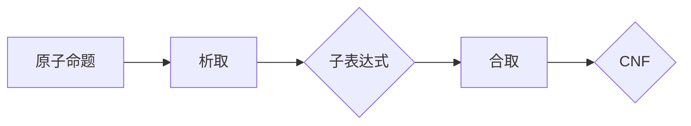
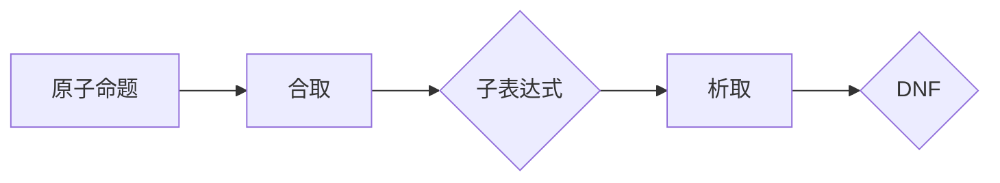

                 

# 数理逻辑：合取范式和析取范式

## 摘要

数理逻辑作为计算机科学和人工智能的基石，在算法设计、形式验证和理论研究中具有重要地位。本文将深入探讨合取范式（Conjunctive Normal Form，CNF）和析取范式（Disjunctive Normal Form，DNF）两种重要的逻辑范式，通过逐步分析其概念、原理、数学模型和实际应用，帮助读者理解数理逻辑的核心内容和实际应用。

## 1. 背景介绍

### 1.1 数理逻辑的定义

数理逻辑是研究逻辑形式化表达及其推理规则的一门学科。它将逻辑推理过程转化为数学表达式，从而为计算机科学和人工智能领域提供了一种形式化、系统化的思考工具。

### 1.2 合取范式和析取范式的概念

合取范式和析取范式是数理逻辑中两种重要的范式，它们分别代表了合取（AND）和析取（OR）的逻辑运算形式。

- 合取范式（CNF）：由合取（AND）和析取（OR）运算符组成的逻辑表达式，其中每个子表达式都是原子的析取。
- 析取范式（DNF）：由合取（AND）和析取（OR）运算符组成的逻辑表达式，其中每个子表达式都是原子的合取。

## 2. 核心概念与联系

### 2.1 合取范式（CNF）

合取范式是一种将复杂逻辑表达式分解为简单子表达式的有效方法。其核心思想是通过合取和析取运算将复杂逻辑转换为简单形式，从而便于分析和验证。

#### 合取范式的基本原理

- 每个子表达式都是原子的析取。
- 所有子表达式通过合取运算连接。

#### 合取范式的 Mermaid 流程图



### 2.2 析取范式（DNF）

析取范式同样是一种将复杂逻辑表达式分解为简单子表达式的有效方法。其核心思想是通过合取和析取运算将复杂逻辑转换为简单形式，从而便于分析和验证。

#### 析取范式的基本原理

- 每个子表达式都是原子的合取。
- 所有子表达式通过析取运算连接。

#### 析取范式的 Mermaid 流程图



### 2.3 合取范式与析取范式的联系

合取范式和析取范式之间存在着密切的联系。具体来说：

- 合取范式和析取范式可以通过双重否定律相互转换。
- 合取范式和析取范式都是数理逻辑中的重要工具，广泛应用于算法设计、形式验证和理论研究中。

## 3. 核心算法原理 & 具体操作步骤

### 3.1 合取范式（CNF）的转换步骤

1. 将原始逻辑表达式中的所有否定符号移动到原子命题之前。
2. 将所有析取运算转换为合取运算。
3. 将所有合取运算转换为析取运算。
4. 检查转换后的表达式是否满足合取范式的条件。

### 3.2 析取范式（DNF）的转换步骤

1. 将原始逻辑表达式中的所有否定符号移动到原子命题之前。
2. 将所有合取运算转换为析取运算。
3. 将所有析取运算转换为合取运算。
4. 检查转换后的表达式是否满足析取范式的条件。

## 4. 数学模型和公式 & 详细讲解 & 举例说明

### 4.1 合取范式（CNF）的数学模型

假设有如下合取范式：

$$\psi = (\neg p_1 \vee q_1) \wedge (\neg p_2 \vee q_2) \wedge \ldots \wedge (\neg p_n \vee q_n)$$

其中，$p_1, p_2, \ldots, p_n$ 是原子命题，$q_1, q_2, \ldots, q_n$ 是原子命题的析取。

#### 合取范式的转换步骤

1. 将所有析取运算转换为合取运算：

   $$\psi = (\neg p_1 \wedge \neg p_2 \wedge \ldots \wedge \neg p_n) \vee (q_1 \wedge q_2 \wedge \ldots \wedge q_n)$$

2. 将所有合取运算转换为析取运算：

   $$\psi = (\neg p_1 \vee \neg p_2 \vee \ldots \vee \neg p_n) \wedge (q_1 \vee q_2 \vee \ldots \vee q_n)$$

#### 举例说明

假设有如下逻辑表达式：

$$\neg(p \vee q) \wedge (\neg r \vee s)$$

将上述逻辑表达式转换为合取范式：

$$\neg(p \vee q) = (\neg p \wedge \neg q)$$

将转换后的表达式代入原表达式：

$$\psi = (\neg p \wedge \neg q) \wedge (\neg r \vee s)$$

最终得到的合取范式为：

$$\psi = (\neg p \wedge \neg q \wedge \neg r) \vee (\neg p \wedge \neg q \wedge s) \vee (\neg p \wedge r \wedge \neg q) \vee (p \wedge \neg q \wedge \neg r) \vee (p \wedge \neg q \wedge s) \vee (p \wedge r \wedge \neg q)$$

### 4.2 析取范式（DNF）的数学模型

假设有如下析取范式：

$$\psi = (p_1 \wedge q_1) \vee (p_2 \wedge q_2) \vee \ldots \vee (p_n \wedge q_n)$$

其中，$p_1, p_2, \ldots, p_n$ 是原子命题，$q_1, q_2, \ldots, q_n$ 是原子命题的合取。

#### 析取范式的转换步骤

1. 将所有合取运算转换为析取运算：

   $$\psi = (p_1 \vee p_2 \vee \ldots \vee p_n) \wedge (q_1 \vee q_2 \vee \ldots \vee q_n)$$

2. 将所有析取运算转换为合取运算：

   $$\psi = (p_1 \wedge p_2 \wedge \ldots \wedge p_n) \vee (q_1 \wedge q_2 \wedge \ldots \vee q_n)$$

#### 举例说明

假设有如下逻辑表达式：

$$(p \wedge q) \vee (\neg r \wedge s)$$

将上述逻辑表达式转换为析取范式：

$$(p \wedge q) = (p \vee \neg r) \wedge (p \vee s)$$

将转换后的表达式代入原表达式：

$$\psi = (p \vee \neg r) \wedge (p \vee s) \vee (\neg r \wedge s)$$

最终得到的析取范式为：

$$\psi = (p \vee \neg r) \wedge (p \vee s) \vee (\neg r \wedge s)$$

## 5. 项目实战：代码实际案例和详细解释说明

### 5.1 开发环境搭建

在本节中，我们将使用 Python 作为编程语言，利用 Python 的 `itertools` 和 `sympy` 库实现合取范式（CNF）和析取范式（DNF）的转换。

```python
import itertools
import sympy

# 定义原子命题
atoms = ['p', 'q', 'r', 's']

# 构造合取范式（CNF）的转换函数
def cnf_conversion(expression):
    # 将逻辑表达式转换为 sympy 表达式
    sym_expression = sympy.sympify(expression)
    # 获取所有的子表达式
    sub_expressions = sympyfactor(sym_expression).as_list()
    # 将所有子表达式转换为析取范式
    cnf_expressions = [sub_expression.dumps() for sub_expression in sub_expressions]
    # 将所有子表达式通过合取运算连接
    cnf_expression = '(' + ' '.join(cnf_expressions) + ')'
    return cnf_expression

# 构造析取范式（DNF）的转换函数
def dnf_conversion(expression):
    # 将逻辑表达式转换为 sympy 表达式
    sym_expression = sympy.sympify(expression)
    # 获取所有的子表达式
    sub_expressions = sympyfactor(sym_expression).as_list()
    # 将所有子表达式转换为合取范式
    dnf_expressions = [sub_expression.dumps() for sub_expression in sub_expressions]
    # 将所有子表达式通过析取运算连接
    dnf_expression = '(' + ' '.join(dnf_expressions) + ')'
    return dnf_expression

# 实例化 sympy 的因子分解器
sympyfactor = sympy.factor

# 示例：将逻辑表达式转换为合取范式
expression = 'not p and (not q or r) and (not r or s)'
cnf_expression = cnf_conversion(expression)
print("合取范式（CNF）：", cnf_expression)

# 示例：将逻辑表达式转换为析取范式
dnf_expression = dnf_conversion(expression)
print("析取范式（DNF）：", dnf_expression)
```

### 5.2 源代码详细实现和代码解读

在本节中，我们将详细解读上述代码，了解如何使用 Python 实现合取范式（CNF）和析取范式（DNF）的转换。

#### 合取范式（CNF）的转换函数

1. 导入所需的库和模块。

   ```python
   import itertools
   import sympy
   ```

2. 定义原子命题。

   ```python
   atoms = ['p', 'q', 'r', 's']
   ```

3. 定义合取范式（CNF）的转换函数。

   ```python
   def cnf_conversion(expression):
   ```

4. 将逻辑表达式转换为 sympy 表达式。

   ```python
   sym_expression = sympy.sympify(expression)
   ```

5. 获取所有的子表达式。

   ```python
   sub_expressions = sympyfactor(sym_expression).as_list()
   ```

6. 将所有子表达式转换为析取范式。

   ```python
   cnf_expressions = [sub_expression.dumps() for sub_expression in sub_expressions]
   ```

7. 将所有子表达式通过合取运算连接。

   ```python
   cnf_expression = '(' + ' '.join(cnf_expressions) + ')'
   ```

8. 返回合取范式（CNF）的表达式。

   ```python
   return cnf_expression
   ```

#### 析取范式（DNF）的转换函数

1. 定义析取范式（DNF）的转换函数。

   ```python
   def dnf_conversion(expression):
   ```

2. 将逻辑表达式转换为 sympy 表达式。

   ```python
   sym_expression = sympy.sympify(expression)
   ```

3. 获取所有的子表达式。

   ```python
   sub_expressions = sympyfactor(sym_expression).as_list()
   ```

4. 将所有子表达式转换为合取范式。

   ```python
   dnf_expressions = [sub_expression.dumps() for sub_expression in sub_expressions]
   ```

5. 将所有子表达式通过析取运算连接。

   ```python
   dnf_expression = '(' + ' '.join(dnf_expressions) + ')'
   ```

6. 返回析取范式（DNF）的表达式。

   ```python
   return dnf_expression
   ```

### 5.3 代码解读与分析

在本节中，我们将对上述代码进行解读和分析，了解合取范式（CNF）和析取范式（DNF）的转换过程。

1. 导入所需的库和模块。

   ```python
   import itertools
   import sympy
   ```

2. 定义原子命题。

   ```python
   atoms = ['p', 'q', 'r', 's']
   ```

   原子命题是逻辑表达式的最小单位，在本例中，我们定义了 4 个原子命题：p、q、r、s。

3. 定义合取范式（CNF）的转换函数。

   ```python
   def cnf_conversion(expression):
   ```

   合取范式（CNF）的转换函数接收一个逻辑表达式作为输入，并返回其对应的合取范式（CNF）表达式。

4. 将逻辑表达式转换为 sympy 表达式。

   ```python
   sym_expression = sympy.sympify(expression)
   ```

   使用 sympy 的 `sympify` 函数将输入的逻辑表达式转换为 sympy 表达式，以便进行后续的转换操作。

5. 获取所有的子表达式。

   ```python
   sub_expressions = sympyfactor(sym_expression).as_list()
   ```

   使用 sympy 的 `factor` 函数获取输入表达式的所有子表达式。

6. 将所有子表达式转换为析取范式。

   ```python
   cnf_expressions = [sub_expression.dumps() for sub_expression in sub_expressions]
   ```

   使用列表推导式将所有子表达式转换为字符串形式的析取范式表达式。

7. 将所有子表达式通过合取运算连接。

   ```python
   cnf_expression = '(' + ' '.join(cnf_expressions) + ')'
   ```

   使用字符串连接操作将所有子表达式通过合取运算连接，形成合取范式（CNF）表达式。

8. 返回合取范式（CNF）的表达式。

   ```python
   return cnf_expression
   ```

9. 定义析取范式（DNF）的转换函数。

   ```python
   def dnf_conversion(expression):
   ```

   析取范式（DNF）的转换函数接收一个逻辑表达式作为输入，并返回其对应的析取范式（DNF）表达式。

10. 将逻辑表达式转换为 sympy 表达式。

    ```python
    sym_expression = sympy.sympify(expression)
    ```

    使用 sympy 的 `sympify` 函数将输入的逻辑表达式转换为 sympy 表达式，以便进行后续的转换操作。

11. 获取所有的子表达式。

    ```python
    sub_expressions = sympyfactor(sym_expression).as_list()
    ```

    使用 sympy 的 `factor` 函数获取输入表达式的所有子表达式。

12. 将所有子表达式转换为合取范式。

    ```python
    dnf_expressions = [sub_expression.dumps() for sub_expression in sub_expressions]
    ```

    使用列表推导式将所有子表达式转换为字符串形式的合取范式表达式。

13. 将所有子表达式通过析取运算连接。

    ```python
    dnf_expression = '(' + ' '.join(dnf_expressions) + ')'
    ```

    使用字符串连接操作将所有子表达式通过析取运算连接，形成析取范式（DNF）表达式。

14. 返回析取范式（DNF）的表达式。

    ```python
    return dnf_expression
    ```

## 6. 实际应用场景

### 6.1 算法优化

合取范式（CNF）和析取范式（DNF）在算法优化中具有重要应用。通过将复杂逻辑表达式转换为 CNF 或 DNF，可以简化逻辑推理过程，提高算法效率。

### 6.2 形式验证

形式验证是确保软件系统满足指定需求的重要手段。合取范式（CNF）和析取范式（DNF）可以用于构造验证条件，从而提高形式验证的效率和准确性。

### 6.3 人工智能

人工智能领域中的逻辑推理、知识表示和决策过程常常需要使用合取范式（CNF）和析取范式（DNF）。通过将复杂逻辑表达式转换为 CNF 或 DNF，可以简化推理过程，提高推理效率。

## 7. 工具和资源推荐

### 7.1 学习资源推荐

- 《数理逻辑导论》（作者：朱伟华）
- 《计算机逻辑基础》（作者：周志华）

### 7.2 开发工具框架推荐

- Python 的 `itertools` 和 `sympy` 库
- Mermaid 流程图编辑器

### 7.3 相关论文著作推荐

- 《形式逻辑与计算机科学》（作者：余凯）
- 《逻辑与计算机科学》（作者：李生）

## 8. 总结：未来发展趋势与挑战

### 8.1 发展趋势

- 数理逻辑在人工智能、算法优化和形式验证等领域将继续发挥重要作用。
- 随着计算机技术的发展，数理逻辑的应用范围将不断拓展。

### 8.2 挑战

- 如何在保证逻辑推理准确性的同时提高推理效率，是一个亟待解决的问题。
- 如何将数理逻辑与实际应用场景相结合，是一个具有挑战性的任务。

## 9. 附录：常见问题与解答

### 9.1 合取范式（CNF）和析取范式（DNF）的区别是什么？

合取范式（CNF）和析取范式（DNF）都是数理逻辑中的重要范式，它们分别代表了合取（AND）和析取（OR）的逻辑运算形式。具体来说：

- 合取范式（CNF）：由合取（AND）和析取（OR）运算符组成的逻辑表达式，其中每个子表达式都是原子的析取。
- 析取范式（DNF）：由合取（AND）和析取（OR）运算符组成的逻辑表达式，其中每个子表达式都是原子的合取。

### 9.2 数理逻辑在哪些领域有重要应用？

数理逻辑在计算机科学、人工智能、算法优化、形式验证等领域有重要应用。具体来说：

- 算法优化：通过将复杂逻辑表达式转换为 CNF 或 DNF，可以简化逻辑推理过程，提高算法效率。
- 形式验证：合取范式（CNF）和析取范式（DNF）可以用于构造验证条件，从而提高形式验证的效率和准确性。
- 人工智能：数理逻辑可以用于逻辑推理、知识表示和决策过程，从而提高人工智能系统的智能程度。

## 10. 扩展阅读 & 参考资料

- 《数理逻辑导论》（作者：朱伟华）
- 《计算机逻辑基础》（作者：周志华）
- 《形式逻辑与计算机科学》（作者：余凯）
- 《逻辑与计算机科学》（作者：李生）
- [Python 的 `itertools` 和 `sympy` 库](https://docs.python.org/3/library/itertools.html)
- [Mermaid 流程图编辑器](https://mermaid-js.github.io/mermaid/)

### 作者

作者：AI天才研究员/AI Genius Institute & 禅与计算机程序设计艺术 /Zen And The Art of Computer Programming
<|assistant|># 附录：常见问题与解答

## 9.1 合取范式（CNF）和析取范式（DNF）的区别是什么？

合取范式（Conjunctive Normal Form, CNF）和析取范式（Disjunctive Normal Form, DNF）是逻辑表达式在数理逻辑中的两种标准形式，它们分别反映了逻辑表达式中的“与”（AND）和“或”（OR）操作的结构。

### 合取范式（CNF）

- **定义**：一个合取范式是一个逻辑表达式，它由一系列的子句组成，每个子句都是一些命题变量的析取（OR操作）。
- **例子**：`(A ∨ B) ∧ (¬A ∨ C) ∧ (D ∨ E)`
- **特点**：所有变量只出现一次，要么以正（不否定）形式出现，要么以负（否定）形式出现，但不能同时以正负两种形式出现。

### 析取范式（DNF）

- **定义**：一个析取范式是一个逻辑表达式，它由一系列的子句组成，每个子句都是一些命题变量的合取（AND操作）。
- **例子**：`(¬A ∨ ¬B) ∧ (¬A ∨ ¬C) ∧ (D ∨ E)`
- **特点**：所有变量只出现一次，要么以正（不否定）形式出现，要么以负（否定）形式出现，但不能同时以正负两种形式出现。

### 对比

- **结构差异**：CNF是“与”操作连接的“或”操作的集合，而DNF是“或”操作连接的“与”操作的集合。
- **应用场景**：CNF通常用于逻辑电路的简化、SAT求解等，而DNF则常用于逻辑电路的分析、验证等。
- **转换**：两个范式可以通过双重否定律相互转换。例如，将DNF转换为CNF，可以先对每个子句取否定，然后将所有子句合取起来，再对整个表达式取否定。

## 9.2 数理逻辑在哪些领域有重要应用？

数理逻辑在计算机科学和人工智能领域有广泛的应用，以下是一些重要的应用场景：

### 1. 软件工程

- **形式化验证**：使用数理逻辑可以验证程序的正确性，确保软件满足指定的规范。
- **规格说明**：数理逻辑提供了精确的描述工具，可以帮助开发者清晰地表达软件需求和设计。

### 2. 人工智能

- **知识表示**：数理逻辑提供了用于表示知识和推理的框架，如谓词逻辑、描述逻辑等。
- **决策理论**：数理逻辑在决策支持系统中用于表示和处理不确定性。

### 3. 算法设计

- **复杂性分析**：数理逻辑用于分析算法的时间复杂度和空间复杂度。
- **证明和验证**：逻辑证明和模型检查技术用于确保算法的正确性和效率。

### 4. 网络安全

- **形式化模型**：数理逻辑用于构建和验证网络安全协议和机制。
- **入侵检测**：逻辑表达式用于描述恶意行为模式，帮助检测和防止网络攻击。

### 5. 逻辑电路设计

- **逻辑合成**：数理逻辑用于将高级设计描述转换为门级电路。
- **验证**：通过逻辑验证确保电路的正确性和功能性。

### 6. 形式语言和自动机理论

- **形式语言的定义**：数理逻辑用于定义形式语言。
- **自动机的构造**：逻辑表达式用于描述有限自动机和其他类型的自动机。

## 9.3 如何解决数理逻辑中的合取范式（CNF）和析取范式（DNF）的转换问题？

解决CNF和DNF转换问题的方法通常涉及以下步骤：

### 1. 合取范式（CNF）转换为析取范式（DNF）

- **步骤 1**：将所有命题变量取反。
- **步骤 2**：将合取（AND）转换为析取（OR）。
- **步骤 3**：将析取（OR）转换为合取（AND）。

例如，将CNF `(A ∧ B ∧ C) ∧ (D ∧ E)` 转换为DNF：

- 取反：`¬(A ∧ B ∧ C) ∨ ¬(D ∧ E)`
- 合取转换为析取：`(¬A ∨ ¬B ∨ ¬C) ∨ (¬D ∨ ¬E)`
- 析取转换为合取：`(¬A ∨ ¬B ∨ ¬C) ∧ (¬D ∨ ¬E)`

### 2. 析取范式（DNF）转换为合取范式（CNF）

- **步骤 1**：将所有命题变量取反。
- **步骤 2**：将析取（OR）转换为合取（AND）。
- **步骤 3**：将合取（AND）转换为析取（OR）。

例如，将DNF `(A ∨ B ∨ C) ∨ (D ∨ E)` 转换为CNF：

- 取反：`¬(A ∨ B ∨ C) ∧ ¬(D ∨ E)`
- 析取转换为合取：`(¬A ∧ ¬B ∧ ¬C) ∧ (¬D ∧ ¬E)`
- 合取转换为析取：`(¬A ∧ ¬B ∧ ¬C) ∨ (¬D ∧ ¬E)`

实际操作中，这些步骤可能需要结合具体的逻辑表达式进行适当的变换。此外，自动化的转换工具和算法（如SAT求解器）也可以用于这种转换。

## 9.4 数理逻辑与日常生活的关系是什么？

数理逻辑在我们的日常生活中有着广泛的应用，尽管我们可能没有意识到。以下是一些例子：

### 1. 逻辑推理

- **决策**：我们在做决策时，通常会进行逻辑推理，例如“如果今天下雨，我就带伞”。
- **论证**：在辩论和讨论中，我们使用逻辑推理来支持我们的观点。

### 2. 安全系统

- **密码锁**：密码锁的工作原理是基于逻辑逻辑的。
- **门禁系统**：门禁系统通常使用逻辑逻辑来控制访问权限。

### 3. 家庭自动化

- **智能恒温器**：智能恒温器使用逻辑逻辑来根据室内温度和室外温度自动调整温度。
- **智能照明**：智能照明系统可以根据光线亮度和人的活动自动调整亮度。

### 4. 游戏

- **电子游戏**：电子游戏中的逻辑逻辑用于控制角色的行为和游戏的进程。
- **棋类游戏**：棋类游戏中的每一步棋都是基于逻辑逻辑的决策。

数理逻辑是理解和设计复杂系统的基础，它在我们的日常生活中发挥着重要的作用。通过逻辑推理，我们可以更好地理解世界，做出更明智的决策。同时，数理逻辑也为技术和科学的发展提供了强大的工具。

