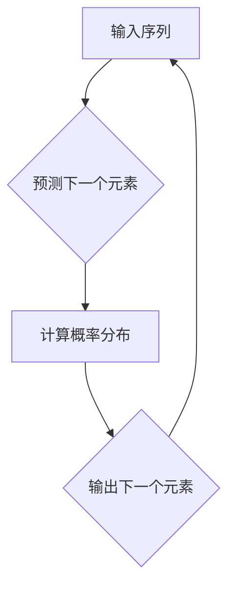

                 

### 背景介绍

自回归模型在自然语言处理（NLP）领域扮演着至关重要的角色，其核心在于预测文本序列中的下一个单词或字符。自回归模型之所以如此受欢迎，是因为它们能够捕获序列数据中的长程依赖关系，从而生成连贯且具有语境意义的文本。

自回归模型的基本思想是，当前状态仅依赖于其前一个状态。这意味着，为了预测序列的下一个元素，模型需要访问先前的元素。这一特性使得自回归模型非常适合处理序列数据，如时间序列分析、语音识别和自然语言生成等。

在NLP中，自回归模型尤其重要，因为自然语言本质上是一种序列数据。例如，在一个句子中，理解最后一个单词可能需要了解整个句子的上下文。因此，自回归模型被广泛用于生成文本、翻译、问答系统和对话系统等任务。

自回归模型有多种实现方式，其中最常见的是基于循环神经网络（RNN）和变换器（Transformer）的模型。RNN通过循环结构保持对历史信息的记忆，而Transformer则使用自注意力机制来处理长距离依赖。尽管这两种模型在技术上有所不同，但它们的核心思想是相同的：通过利用先前的信息来预测下一个元素。

自回归模型之所以重要，还因为它们在生成文本时能够保持连贯性和一致性。这意味着，即使在生成较长文本时，模型也能够保持语义的一致性，避免生成无意义或矛盾的句子。此外，自回归模型还能够通过大量数据进行训练，从而提高其生成文本的质量和准确性。

本文将深入探讨自回归模型的工作原理，包括其核心概念、算法原理和具体操作步骤。我们将通过一个实际项目案例，展示如何使用自回归模型生成文本，并对代码进行详细解读和分析。最后，我们将讨论自回归模型在实际应用场景中的表现，并推荐一些相关工具和资源。

通过本文的阅读，您将了解到自回归模型的核心原理和实现方法，从而能够将其应用到自己的项目中，提高自然语言处理任务的效果和效率。让我们一步一步分析推理，深入理解自回归模型的工作机制，为未来的研究和应用奠定基础。

### 核心概念与联系

在深入探讨自回归模型的工作原理之前，我们首先需要理解一些核心概念，包括自然语言处理（NLP）、序列数据和循环神经网络（RNN）。这些概念不仅是自回归模型的基础，也是理解其工作机制的关键。

#### 自然语言处理（NLP）

自然语言处理是人工智能的一个分支，旨在使计算机能够理解、解释和生成人类语言。NLP的应用范围广泛，包括机器翻译、情感分析、文本摘要、问答系统和对话系统等。在NLP中，文本被视为一种序列数据，每个单词或字符都是序列中的一个元素。

#### 序列数据

序列数据是一系列按时间或顺序排列的数据点。在NLP中，序列数据通常是文本，其中每个单词或字符都是序列中的一个元素。序列数据的一个重要特性是它们具有时间顺序，即先前的数据点对后续的数据点有影响。例如，在句子中，理解最后一个单词可能需要了解整个句子的上下文。

#### 循环神经网络（RNN）

循环神经网络是一种特殊的神经网络，专门用于处理序列数据。与传统的神经网络不同，RNN具有循环结构，可以记住先前的输入，并将其用于当前和未来的预测。这种记忆能力使RNN非常适合处理NLP任务，因为自然语言本质上是一种序列数据。

#### 自回归模型

自回归模型是一种基于RNN的模型，用于预测序列中的下一个元素。它的基本思想是，当前状态仅依赖于其前一个状态。这意味着，为了预测序列的下一个元素，模型需要访问先前的元素。自回归模型在NLP中有着广泛的应用，例如文本生成、机器翻译和对话系统等。

#### Mermaid 流程图

为了更直观地展示自回归模型的工作原理，我们可以使用Mermaid流程图来表示其核心概念和架构。以下是一个简化的Mermaid流程图，用于描述自回归模型的基本结构：



在这个流程图中，A代表输入序列，B表示预测下一个元素，C是计算概率分布的步骤，而D则是输出下一个元素。这个过程不断重复，直到生成完整的文本。

### 核心算法原理 & 具体操作步骤

#### 基本原理

自回归模型的工作原理可以概括为以下几个步骤：

1. **输入序列**：首先，模型接收一个输入序列，例如一个句子或一段文本。
2. **状态转移**：模型根据当前状态和先前的输入，计算下一个状态的概率分布。
3. **概率分布**：模型计算出下一个状态的概率分布，然后从概率分布中抽取一个元素作为输出。
4. **输出**：模型将抽取的元素作为输出，并将其作为新的输入，继续进行预测。

这个过程不断重复，直到生成完整的文本。

#### 实现步骤

要实现一个自回归模型，我们需要遵循以下步骤：

1. **数据准备**：首先，我们需要准备训练数据，这通常是一个大型文本语料库。然后，我们将文本转换为序列，每个序列包含一系列单词或字符。
2. **模型构建**：接下来，我们构建一个循环神经网络（RNN）模型。在构建模型时，我们通常选择一个合适的学习率、批量大小和迭代次数。
3. **训练模型**：使用训练数据对模型进行训练，这个过程涉及模型参数的调整，以最小化预测误差。
4. **评估模型**：在训练完成后，我们需要评估模型的性能，这通常通过交叉验证和测试集来完成。
5. **预测文本**：最后，我们可以使用训练好的模型来生成新的文本。这个过程涉及模型对输入序列的逐步预测，直到生成完整的文本。

#### 数学模型和公式

自回归模型的数学模型通常可以表示为：

$$P(x_t | x_{t-1}, x_{t-2}, \ldots, x_1) = \frac{P(x_t, x_{t-1}, x_{t-2}, \ldots, x_1)}{P(x_{t-1}, x_{t-2}, \ldots, x_1)}$$

其中，$x_t$是当前状态，$x_{t-1}, x_{t-2}, \ldots, x_1$是先前的状态。这个公式表示，当前状态的概率分布仅依赖于先前的状态。

#### 详细讲解 & 举例说明

假设我们有一个简单的输入序列：“我是一个程序员”。首先，模型会接收这个序列作为输入。然后，模型会根据当前状态和先前的输入，计算下一个状态的概率分布。例如，如果当前状态是“一个”，模型可能会计算出下一个状态是“程”的概率为0.5，是“序”的概率为0.5。

接下来，模型会从概率分布中抽取一个元素作为输出，例如，模型可能会输出“序”。然后，模型将“序”作为新的输入，继续进行预测。假设下一个状态是“员”，模型可能会计算出下一个状态是“员”的概率为1.0。

这个过程不断重复，直到生成完整的文本：“我是一个程序员”。

通过这个例子，我们可以看到，自回归模型通过利用先前的输入，逐步生成完整的文本。这种预测机制使得自回归模型在生成文本时能够保持连贯性和一致性。

### 项目实战：代码实际案例和详细解释说明

在本节中，我们将通过一个实际项目案例，展示如何使用自回归模型生成文本。我们将使用Python和TensorFlow库来实现这个项目，并详细解释每个步骤。

#### 开发环境搭建

在开始之前，确保您的系统上已经安装了以下软件和库：

- Python 3.x
- TensorFlow 2.x
- NumPy
- Matplotlib

您可以使用以下命令来安装所需的库：

```bash
pip install python tensorflow numpy matplotlib
```

#### 源代码详细实现和代码解读

以下是一个简单的自回归文本生成项目的实现：

```python
import numpy as np
import tensorflow as tf
from tensorflow.keras.preprocessing.sequence import pad_sequences
from tensorflow.keras.models import Sequential
from tensorflow.keras.layers import LSTM, Dense

# 加载数据
text = "我是一个程序员，喜欢编程。编程是一种艺术，是一种创造。"

# 将文本转换为序列
tokenizer = tf.keras.preprocessing.text.Tokenizer()
tokenizer.fit_on_texts([text])
sequences = tokenizer.texts_to_sequences([text])

# 序列填充
max_sequence_len = max(len(seq) for seq in sequences)
padded_sequences = pad_sequences(sequences, maxlen=max_sequence_len)

# 构建模型
model = Sequential()
model.add(LSTM(50, activation='relu', input_shape=(max_sequence_len, 1)))
model.add(Dense(tokenizer.num_words, activation='softmax'))

# 编译模型
model.compile(optimizer='rmsprop', loss='categorical_crossentropy', metrics=['accuracy'])

# 训练模型
model.fit(padded_sequences, padded_sequences, epochs=100)

# 生成文本
generated_text = ""
for _ in range(100):
    # 随机选择一个序列作为输入
    input_seq = padded_sequences[np.random.randint(len(padded_sequences))]
    
    # 使用模型预测下一个元素
    predicted_idx = model.predict(input_seq.reshape(1, -1))
    predicted_word = tokenizer.index_word[np.argmax(predicted_idx)]
    
    # 将预测的元素添加到生成文本中
    generated_text += predicted_word
    
    # 更新输入序列
    input_seq = np.append(input_seq[:-1], predicted_word)

# 打印生成文本
print(generated_text)
```

让我们逐步解读这段代码：

1. **加载数据**：首先，我们加载一个简单的文本数据，这是我们的训练数据。
2. **文本转换为序列**：接下来，我们使用`Tokenizer`将文本转换为序列。`Tokenizer`将每个单词或字符转换为唯一的索引。
3. **序列填充**：我们使用`pad_sequences`将序列填充到相同的长度。这是因为LSTM层需要固定长度的输入。
4. **构建模型**：我们构建一个简单的LSTM模型，包括一个LSTM层和一个全连接层（Dense）。LSTM层用于处理序列数据，而全连接层用于输出概率分布。
5. **编译模型**：我们使用`compile`函数编译模型，指定优化器和损失函数。
6. **训练模型**：使用`fit`函数训练模型，指定训练数据、迭代次数等参数。
7. **生成文本**：最后，我们使用训练好的模型来生成新的文本。这个过程涉及随机选择一个序列作为输入，然后使用模型预测下一个元素，并将预测的元素添加到生成文本中。

#### 代码解读与分析

让我们进一步分析代码中的关键部分：

1. **文本转换为序列**：
   ```python
   tokenizer = tf.keras.preprocessing.text.Tokenizer()
   tokenizer.fit_on_texts([text])
   sequences = tokenizer.texts_to_sequences([text])
   ```
   在这段代码中，我们首先创建一个`Tokenizer`对象，然后使用`fit_on_texts`方法将其训练到给定的文本。这将创建一个词典，其中每个单词或字符都被分配了一个唯一的索引。然后，我们使用`texts_to_sequences`方法将文本转换为序列。

2. **序列填充**：
   ```python
   max_sequence_len = max(len(seq) for seq in sequences)
   padded_sequences = pad_sequences(sequences, maxlen=max_sequence_len)
   ```
   我们使用`max_sequence_len`变量存储序列的最大长度，并使用`pad_sequences`方法将所有序列填充到这个长度。这确保了所有序列都具有相同长度，以便我们可以将它们输入到LSTM层。

3. **构建模型**：
   ```python
   model = Sequential()
   model.add(LSTM(50, activation='relu', input_shape=(max_sequence_len, 1)))
   model.add(Dense(tokenizer.num_words, activation='softmax'))
   ```
   在这里，我们构建了一个简单的LSTM模型，包括一个LSTM层和一个全连接层。LSTM层具有50个神经元，并使用ReLU激活函数。输入形状为`(max_sequence_len, 1)`，表示每个序列的长度为`max_sequence_len`，每个元素都是一个单词或字符的索引。全连接层将LSTM层的输出映射到词典中的单词或字符。

4. **训练模型**：
   ```python
   model.compile(optimizer='rmsprop', loss='categorical_crossentropy', metrics=['accuracy'])
   model.fit(padded_sequences, padded_sequences, epochs=100)
   ```
   我们使用`compile`函数编译模型，指定了优化器、损失函数和评估指标。然后，我们使用`fit`函数训练模型，指定训练数据和迭代次数。

5. **生成文本**：
   ```python
   generated_text = ""
   for _ in range(100):
       input_seq = padded_sequences[np.random.randint(len(padded_sequences))]
       predicted_idx = model.predict(input_seq.reshape(1, -1))
       predicted_word = tokenizer.index_word[np.argmax(predicted_idx)]
       generated_text += predicted_word
       input_seq = np.append(input_seq[:-1], predicted_word)
   ```
   在生成文本的过程中，我们首先随机选择一个序列作为输入。然后，使用模型预测下一个元素，并将预测的元素添加到生成文本中。这个过程重复进行，直到生成完整的文本。

通过这个实际项目案例，我们展示了如何使用自回归模型生成文本。我们详细解释了代码中的每个步骤，并分析了代码的关键部分。通过这个项目，您可以更好地理解自回归模型的工作原理，并能够将其应用到自己的项目中。

### 实际应用场景

自回归模型在自然语言处理领域有着广泛的应用，其出色的性能和强大的生成能力使其成为许多实际应用场景的首选解决方案。以下是一些典型的应用场景，展示了自回归模型如何在不同领域发挥作用：

#### 1. 文本生成

文本生成是自回归模型最直接的应用之一。通过使用自回归模型，我们可以生成各种类型的文本，如新闻文章、故事、诗歌和对话等。以下是一个具体的例子：

- **新闻文章生成**：自回归模型可以分析大量新闻数据，并基于先前的文章生成新的新闻文章。这种方法在内容生成和个性化推荐系统中非常有用。
- **故事和诗歌生成**：自回归模型能够生成连贯且富有创意的故事和诗歌。例如，谷歌的AI艺术项目“Wordsmith”使用自回归模型生成新闻文章和故事，展示了模型的文本生成能力。

#### 2. 机器翻译

机器翻译是另一个重要的应用场景，自回归模型在这方面的表现尤为出色。通过训练自回归模型，我们可以实现高质量的双语文本翻译。以下是一个具体的例子：

- **谷歌翻译**：谷歌翻译使用自回归模型来处理复杂的翻译任务，包括语法、语义和上下文的准确翻译。这种模型能够生成流畅且准确的翻译结果。
- **社交网络翻译**：自回归模型还可以应用于社交媒体平台上的实时翻译功能，如Twitter和Facebook，使得用户能够轻松地浏览和使用不同语言的帖子。

#### 3. 对话系统

自回归模型在对话系统中的应用也非常广泛，尤其是在聊天机器人和语音助手方面。以下是一个具体的例子：

- **聊天机器人**：自回归模型能够生成自然的对话回应，使得聊天机器人能够与用户进行流畅的交互。例如，苹果的Siri和亚马逊的Alexa都使用自回归模型来处理用户输入，生成合适的回应。
- **语音助手**：自回归模型在语音助手中的应用同样广泛，如亚马逊的Alexa和谷歌助手。这些语音助手通过理解用户的语音输入，并使用自回归模型生成自然的语音回应，从而提供无缝的用户体验。

#### 4. 文本摘要

文本摘要是一种将长文本转换为简短且精炼的摘要的过程。自回归模型在这方面的应用能够自动生成摘要，从而提高信息检索和知识获取的效率。以下是一个具体的例子：

- **新闻摘要**：自回归模型可以分析新闻文章，并自动生成摘要，使得读者能够快速了解文章的主要内容。
- **学术摘要**：自回归模型能够分析学术论文，并生成摘要，帮助研究人员快速了解研究的主要发现和贡献。

#### 5. 情感分析

情感分析是一种分析文本情感倾向的方法。自回归模型在情感分析中的应用能够自动识别和分类文本中的情感，从而为市场研究和社交媒体分析提供有价值的信息。以下是一个具体的例子：

- **社交媒体情感分析**：自回归模型可以分析社交媒体上的用户评论和帖子，识别用户的情感倾向，从而帮助企业了解消费者情绪和反馈。
- **产品评论分析**：自回归模型可以分析产品评论，识别用户的满意度，从而帮助企业改进产品质量和服务。

通过这些实际应用场景，我们可以看到自回归模型在自然语言处理领域的广泛应用和巨大潜力。自回归模型不仅能够生成高质量的文本，还能在翻译、对话系统、文本摘要、情感分析等多个方面发挥重要作用，为各种实际应用提供强大的技术支持。

### 工具和资源推荐

为了更好地学习和应用自回归模型，以下是一些推荐的工具、资源和学习材料。

#### 1. 学习资源推荐

**书籍**：
- 《深度学习》（Goodfellow, I., Bengio, Y., & Courville, A.）: 这本书是深度学习领域的经典之作，详细介绍了循环神经网络和自回归模型的基础知识。
- 《自然语言处理实战》（Daniel Jurafsky & James H. Martin）: 这本书涵盖了自然语言处理的基础知识，包括文本序列处理和自回归模型。

**在线课程**：
- [TensorFlow官方教程](https://www.tensorflow.org/tutorials)：TensorFlow官方教程提供了丰富的入门教程，涵盖从基础到高级的深度学习知识，包括自回归模型的实现。
- [Coursera: Natural Language Processing with Machine Learning](https://www.coursera.org/learn/natural-language-processing)：这个课程由斯坦福大学提供，详细介绍了自然语言处理的基础知识和应用，包括自回归模型。

#### 2. 开发工具框架推荐

**框架**：
- **TensorFlow**: TensorFlow是一个开源的深度学习框架，广泛用于自然语言处理任务，包括自回归模型的实现。
- **PyTorch**: PyTorch是一个流行的深度学习框架，提供灵活的动态计算图，使得实现自回归模型更加方便。

**库**：
- **Keras**: Keras是一个高级神经网络API，可以与TensorFlow和Theano等后端结合使用。Keras提供了简单而强大的工具，用于构建和训练自回归模型。
- **NLTK**: NLTK是一个强大的自然语言处理库，提供了丰富的文本处理工具，如分词、词性标注和词干提取等，有助于预处理文本数据。

#### 3. 相关论文著作推荐

**论文**：
- “Sequence to Sequence Learning with Neural Networks” (Ian J. Goodfellow, David J. Pouget-Abadie, Meire Fortunato, and Daion G. Kingma): 这篇论文介绍了序列到序列学习（seq2seq）模型，包括自回归模型，是理解自回归模型的重要参考。
- “Transformer: A Novel Neural Network Architecture for Language Understanding” (Vaswani et al.): 这篇论文介绍了Transformer模型，一种基于自注意力机制的自回归模型，为自回归模型的发展提供了新的思路。

**著作**：
- 《深度学习》（Ian Goodfellow、Yoshua Bengio和Aaron Courville）: 这本书详细介绍了深度学习的基础知识和最新进展，包括自回归模型。
- 《自然语言处理综合教程》（Daniel Jurafsky和James H. Martin）: 这本书涵盖了自然语言处理的基础知识和应用，包括自回归模型。

通过这些工具、资源和论文著作，您将能够深入了解自回归模型的理论和实践，为您的自然语言处理项目提供强大的支持。

### 总结：未来发展趋势与挑战

自回归模型作为自然语言处理领域的重要技术，已经在多种应用场景中展现了其强大的能力。然而，随着人工智能和深度学习技术的不断发展，自回归模型也面临着一系列新的发展趋势和挑战。

#### 未来发展趋势

1. **模型规模扩大**：随着计算能力和数据量的增加，未来自回归模型的规模将会进一步扩大。大型自回归模型能够处理更复杂的语言现象，生成更高质量的文本。

2. **多模态融合**：自回归模型不仅可以处理文本数据，还可以与图像、语音等其他模态的数据进行融合。这种多模态融合的方法将使得自回归模型在生成具有多感官一致性的内容方面取得突破。

3. **迁移学习和零样本学习**：迁移学习和零样本学习技术将在自回归模型中发挥重要作用。通过利用预训练模型和跨领域知识，自回归模型可以更快速地适应新任务，减少对大量标注数据的依赖。

4. **可解释性和可靠性**：随着自回归模型在关键领域（如医疗诊断、金融预测等）的应用，其可解释性和可靠性变得越来越重要。未来，研究者将致力于提高自回归模型的可解释性，使其决策过程更加透明和可信。

#### 面临的挑战

1. **计算资源需求**：自回归模型通常需要大量的计算资源进行训练和推理。随着模型规模的扩大，对计算资源的需求将进一步增加，这对硬件和软件基础设施提出了更高的要求。

2. **数据隐私和安全性**：自回归模型在处理大量文本数据时，可能会面临数据隐私和安全性的问题。如何保护用户隐私，确保数据安全，是未来研究的一个重要挑战。

3. **泛化能力**：尽管自回归模型在特定任务上表现优秀，但其泛化能力仍需提高。模型如何在不同领域和任务间保持一致性和鲁棒性，是一个亟待解决的问题。

4. **社会伦理问题**：自回归模型在生成文本时，可能会出现偏见、误导和虚假信息。如何确保模型生成的文本符合社会伦理标准，避免对人类造成负面影响，是未来需要关注的重要问题。

总之，自回归模型在未来将继续在自然语言处理领域发挥重要作用，但其发展也面临诸多挑战。通过不断探索和研究，我们可以期待自回归模型在技术上的进一步突破，为人类社会带来更多便利和创新。

### 附录：常见问题与解答

在本文中，我们详细探讨了自回归模型的工作原理、实现步骤和应用场景。为了帮助您更好地理解相关概念，我们在此列出了一些常见问题及其解答。

#### 1. 什么是自回归模型？

自回归模型是一种用于预测序列数据（如文本、时间序列）的模型。其基本思想是，当前状态仅依赖于其前一个状态。这意味着，为了预测序列中的下一个元素，模型需要访问先前的元素。自回归模型在自然语言处理、时间序列分析和语音识别等领域有着广泛的应用。

#### 2. 自回归模型如何工作？

自回归模型通过以下步骤工作：

- 输入序列：模型接收一个输入序列，例如一个句子或一段文本。
- 状态转移：模型根据当前状态和先前的输入，计算下一个状态的概率分布。
- 概率分布：模型计算出下一个状态的概率分布，然后从概率分布中抽取一个元素作为输出。
- 输出：模型将抽取的元素作为输出，并将其作为新的输入，继续进行预测。

这个过程不断重复，直到生成完整的文本。

#### 3. 自回归模型与循环神经网络（RNN）有何关系？

自回归模型是基于循环神经网络（RNN）的一种模型。RNN是一种特殊的神经网络，具有循环结构，可以记住先前的输入。自回归模型利用RNN的这种记忆能力，通过利用先前的输入来预测序列中的下一个元素。

#### 4. 自回归模型如何生成文本？

要生成文本，我们需要遵循以下步骤：

- 数据准备：首先，准备训练数据，这通常是一个大型文本语料库。
- 模型训练：使用训练数据对自回归模型进行训练，调整模型参数以最小化预测误差。
- 文本生成：使用训练好的模型来生成新的文本。这个过程涉及模型对输入序列的逐步预测，直到生成完整的文本。

#### 5. 自回归模型在实际应用中面临哪些挑战？

在实际应用中，自回归模型面临以下挑战：

- 计算资源需求：自回归模型通常需要大量的计算资源进行训练和推理。
- 数据隐私和安全性：在处理大量文本数据时，可能会面临数据隐私和安全性的问题。
- 泛化能力：尽管自回归模型在特定任务上表现优秀，但其泛化能力仍需提高。
- 社会伦理问题：生成文本时，可能会出现偏见、误导和虚假信息。

#### 6. 如何优化自回归模型的性能？

优化自回归模型的性能可以从以下几个方面入手：

- 数据增强：通过增加训练数据量和多样性，提高模型的泛化能力。
- 模型架构优化：尝试不同的模型架构（如LSTM、Transformer）以提高模型性能。
- 超参数调整：通过调整学习率、批量大小和迭代次数等超参数，提高模型性能。
- 预训练：利用预训练模型和跨领域知识，减少对大量标注数据的依赖。

通过上述问题与解答，我们希望能够帮助您更好地理解自回归模型的基本概念和实现方法，为您的自然语言处理项目提供有价值的参考。

### 扩展阅读 & 参考资料

为了更深入地了解自回归模型及其在自然语言处理中的应用，以下是推荐的一些扩展阅读和参考资料：

#### 书籍

1. 《深度学习》（Ian J. Goodfellow, Yoshua Bengio, Aaron Courville）：这本书详细介绍了深度学习的基础知识，包括循环神经网络和自回归模型。
2. 《自然语言处理综合教程》（Daniel Jurafsky, James H. Martin）：这本书涵盖了自然语言处理的基础知识和应用，包括文本序列处理和自回归模型。
3. 《序列模型：基于深度学习的自然语言处理》（François Chollet）：这本书专注于序列模型，包括循环神经网络和自回归模型，以及它们在自然语言处理中的应用。

#### 论文

1. “Sequence to Sequence Learning with Neural Networks” (Ian J. Goodfellow, David J. Pouget-Abadie, Meire Fortunato, and Daion G. Kingma)：这篇论文介绍了序列到序列学习模型，包括自回归模型，是理解自回归模型的重要参考。
2. “Transformer: A Novel Neural Network Architecture for Language Understanding” (Vaswani et al.)：这篇论文介绍了Transformer模型，一种基于自注意力机制的自回归模型，为自回归模型的发展提供了新的思路。
3. “Generative Pre-trained Transformer” (Vaswani et al.)：这篇论文介绍了GPT（Generative Pre-trained Transformer）模型，是当前许多大规模语言模型的基础。

#### 博客和网站

1. [TensorFlow官方文档](https://www.tensorflow.org/tutorials)：TensorFlow官方文档提供了丰富的教程和示例，涵盖了自回归模型的实现和应用。
2. [Keras官方文档](https://keras.io/)：Keras官方文档介绍了如何使用Keras构建和训练自回归模型，是Keras用户的重要资源。
3. [AI加油站](https://www.aigujiashou.com/)：这是一个专注于人工智能技术的中文博客，提供了大量关于自然语言处理和自回归模型的技术文章。

通过阅读这些书籍、论文、博客和网站，您可以更全面地了解自回归模型的理论和实践，为您的自然语言处理项目提供有价值的参考。希望这些资源能够帮助您在探索自回归模型的道路上不断前进。

