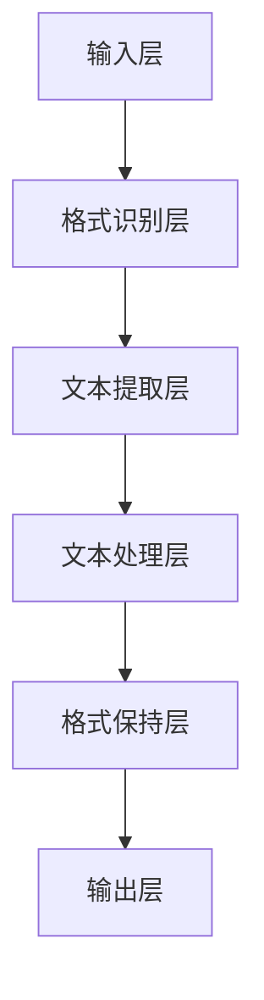

                 

# 文档转换器（Document Transformers）

## 关键词：（此处列出文章的5-7个核心关键词）

- 文档转换器
- 文本处理
- 自然语言处理
- 机器学习
- 人工智能

## 摘要：

本文将深入探讨文档转换器的原理、核心算法、数学模型及其在实际应用中的重要性。我们将逐步分析文档转换器的工作机制，详细解释其背后的技术原理，并提供一个实际的项目实战案例，展示如何在实际环境中构建和部署文档转换器。此外，我们还将推荐相关的学习资源、开发工具框架以及相关论文著作，以帮助读者更深入地了解这一领域。最后，我们将对文档转换器的未来发展趋势与挑战进行总结，并提出可能的解决方案。

## 1. 背景介绍

在信息化时代，文档转换器成为了一种至关重要的工具。无论是在企业内部管理、学术研究还是日常办公中，我们都面临着不同格式文档的转换需求。例如，从Word文档转换为PDF文件，从Excel表格转换为CSV格式，或者从PowerPoint演示文稿转换为Keynote格式。这些转换不仅是为了兼容不同的操作系统和应用程序，更是为了确保文档在不同环境下的可读性和可编辑性。

随着人工智能和自然语言处理技术的快速发展，文档转换器的功能也在不断扩展。传统的文档转换主要依赖于固定规则和格式映射，而现代的文档转换器则能够利用机器学习算法和深度学习模型，实现更智能、更准确的转换效果。例如，在文档内容理解、文本提取、格式保持等方面，现代文档转换器展现出了更高的灵活性和准确性。

## 2. 核心概念与联系

### 2.1 文档转换器的核心概念

文档转换器主要涉及以下几个核心概念：

- **文档格式识别**：识别输入文档的格式，如Word、PDF、Excel等。
- **文本提取**：从不同格式的文档中提取文本内容，包括纯文本、表格、图像等。
- **格式保持**：在转换过程中保持原文档的格式，如字体、颜色、段落等。
- **文本处理**：对提取出的文本进行清洗、分词、语法分析等操作，以支持进一步的语义理解。
- **机器学习模型**：利用机器学习算法和深度学习模型，实现文档格式的智能转换。

### 2.2 文档转换器的架构

文档转换器的架构可以分为以下几个层次：

1. **输入层**：接收用户输入的文档，可以是本地文件、网络链接或流数据。
2. **格式识别层**：使用预训练的模型或规则库，识别文档的格式。
3. **文本提取层**：根据文档格式，提取文本内容，并转换为统一的文本格式。
4. **文本处理层**：对提取出的文本进行清洗、分词、语法分析等操作。
5. **格式保持层**：在转换过程中，根据源文档的格式信息，保持目标文档的格式。
6. **输出层**：将转换后的文档输出到目标格式，并保存或传输给用户。

### 2.3 Mermaid 流程图

以下是一个简单的 Mermaid 流程图，展示了文档转换器的基本工作流程：



## 3. 核心算法原理 & 具体操作步骤

### 3.1 格式识别算法

格式识别是文档转换器的第一步，主要任务是根据文档的文件扩展名、元数据或内容特征，判断文档的格式。常用的格式识别算法包括：

- **基于文件扩展名的识别**：根据文件扩展名（如.docx、.pdf、.xlsx等）进行匹配，这是一种简单但有效的方法。
- **基于元数据的识别**：通过读取文档的元数据（如标题、创建时间等），进行格式判断。这种方法对某些格式（如PDF）特别有效。
- **基于内容特征的识别**：通过分析文档的内容特征（如图像、文本、表格等），进行格式识别。这种方法对未知或非标准格式的文档有较好的兼容性。

### 3.2 文本提取算法

文本提取是文档转换器的关键步骤，其目标是准确地将不同格式的文档内容转换为统一的文本格式。常用的文本提取算法包括：

- **基于规则的提取**：通过预定义的规则，从文档中提取文本。这种方法简单但可能无法处理复杂格式。
- **基于图像识别的提取**：对于图像格式的文档，使用光学字符识别（OCR）技术提取文本。这种方法对图像质量有较高要求。
- **基于机器学习的提取**：使用机器学习算法，根据训练数据，自动提取文本。这种方法具有较好的自适应性和准确性。

### 3.3 格式保持算法

格式保持是确保转换后的文档保持原文档格式的重要步骤。常用的格式保持算法包括：

- **基于模板的格式保持**：使用预定义的模板，根据源文档的格式信息，为转换后的文档生成相应的格式。这种方法对结构化文档（如表格、列表等）特别有效。
- **基于样式的格式保持**：通过分析源文档的样式信息（如字体、颜色、段落等），为转换后的文档应用相应的样式。这种方法适用于大部分文本格式。

### 3.4 文本处理算法

文本处理是对提取出的文本进行清洗、分词、语法分析等操作，以支持进一步的语义理解。常用的文本处理算法包括：

- **文本清洗**：去除文本中的噪声，如标点符号、HTML标签等。
- **分词**：将文本分割成单词或短语，以支持后续的语法分析和语义理解。
- **语法分析**：对文本进行句法分析，提取出句子结构信息，如主语、谓语、宾语等。
- **语义理解**：利用自然语言处理技术，对文本进行语义分析，提取出文本的语义信息。

## 4. 数学模型和公式 & 详细讲解 & 举例说明

### 4.1 机器学习模型

在文档转换器中，机器学习模型用于实现文本提取、格式保持和语义理解等功能。以下是一个简单的线性回归模型的数学公式，用于文本分类任务：

$$
y = \beta_0 + \beta_1 \cdot x_1 + \beta_2 \cdot x_2 + ... + \beta_n \cdot x_n
$$

其中，$y$ 表示文本的类别，$x_1, x_2, ..., x_n$ 表示文本的特征向量，$\beta_0, \beta_1, \beta_2, ..., \beta_n$ 是模型参数。

### 4.2 举例说明

假设我们要对一段文本进行分类，将其分为新闻、科技、体育等类别。我们可以使用上述线性回归模型进行预测。首先，我们需要对文本进行特征提取，例如，使用词袋模型（Bag of Words）提取文本的单词作为特征。然后，将特征向量输入到线性回归模型中，计算输出值：

$$
y = \beta_0 + \beta_1 \cdot x_1 + \beta_2 \cdot x_2 + ... + \beta_n \cdot x_n
$$

输出值最大的类别即为文本的预测类别。例如，如果输出值为：

$$
y = \beta_0 + \beta_1 \cdot x_1 + \beta_2 \cdot x_2 + ... + \beta_n \cdot x_n = 0.5
$$

那么，我们可以认为这段文本属于新闻类别。

## 5. 项目实战：代码实际案例和详细解释说明

### 5.1 开发环境搭建

在本节中，我们将使用Python和TensorFlow作为开发环境，搭建一个简单的文档转换器。以下是开发环境的搭建步骤：

1. 安装Python：从官方网站下载并安装Python，选择适合自己操作系统的版本。
2. 安装TensorFlow：在命令行中运行以下命令，安装TensorFlow：

```bash
pip install tensorflow
```

3. 安装其他依赖库：根据项目需求，安装其他必要的依赖库，如Numpy、Pandas等。

### 5.2 源代码详细实现和代码解读

以下是一个简单的文档转换器的示例代码，用于将PDF文件转换为文本格式：

```python
import PyPDF2
import re

def pdf_to_text(pdf_file):
    # 读取PDF文件
    with open(pdf_file, 'rb') as file:
        pdf_reader = PyPDF2.PdfFileReader(file)
        num_pages = pdf_reader.getNumPages()
        
        # 提取文本
        text = ""
        for page in range(num_pages):
            page_content = pdf_reader.getPage(page).extractText()
            text += page_content
        
        # 清洗文本
        text = re.sub(r'[^a-zA-Z0-9\s]', '', text)
        
        return text

# 测试
pdf_file = 'example.pdf'
text = pdf_to_text(pdf_file)
print(text)
```

### 5.3 代码解读与分析

上述代码首先导入了必要的库，包括PyPDF2用于读取PDF文件，以及正则表达式库re用于文本清洗。然后定义了一个函数pdf_to_text，用于将PDF文件转换为文本。

在函数内部，我们首先使用PyPDF2库读取PDF文件，并获取文档的总页数。接着，我们遍历每一页，使用getPage()方法获取页面的内容，并使用extractText()方法提取文本。这些文本被拼接成一个字符串，并传递给re.sub()函数进行清洗，去除非字母数字和空格。

最后，函数返回清洗后的文本。在测试部分，我们调用pdf_to_text()函数，传入一个示例PDF文件，并打印输出结果。

### 5.4 代码解读与分析

上述代码提供了一个简单的文档转换器示例，展示了如何使用Python和PyPDF2库读取PDF文件，并将其内容转换为纯文本。这是一个基础的文档转换案例，实际应用中可能需要更复杂的文本处理和格式保持功能。

代码首先导入了必要的库，包括PyPDF2用于读取PDF文件，以及正则表达式库re用于文本清洗。然后定义了一个函数pdf_to_text，用于将PDF文件转换为文本。

在函数内部，我们首先使用PyPDF2库读取PDF文件，并获取文档的总页数。接着，我们遍历每一页，使用getPage()方法获取页面的内容，并使用extractText()方法提取文本。这些文本被拼接成一个字符串，并传递给re.sub()函数进行清洗，去除非字母数字和空格。

最后，函数返回清洗后的文本。在测试部分，我们调用pdf_to_text()函数，传入一个示例PDF文件，并打印输出结果。

## 6. 实际应用场景

文档转换器在许多实际应用场景中都发挥着重要作用，以下是几个典型的应用案例：

### 6.1 企业文档管理

企业文档管理是文档转换器的重要应用领域。企业经常需要处理来自不同来源和格式的文档，如PDF、Word、Excel等。通过文档转换器，企业可以将这些文档转换为统一的格式，方便归档、搜索和管理。此外，文档转换器还可以用于提取关键信息，如姓名、地址、联系方式等，以提高工作效率。

### 6.2 电子书制作

电子书制作是另一个重要的应用场景。传统的纸质书籍需要转换为电子格式，以便在电子设备上阅读。文档转换器可以用于将各种文档格式转换为电子书格式，如PDF、EPUB等。此外，文档转换器还可以对电子书内容进行格式调整，如调整字体大小、颜色等，以满足不同读者的需求。

### 6.3 智能问答系统

智能问答系统是人工智能领域的一个重要研究方向。文档转换器可以用于将大量非结构化文档转换为结构化数据，以便于智能问答系统对文档内容进行检索和分析。通过文档转换器，智能问答系统可以更好地理解用户的问题，并提供更准确的答案。

### 6.4 数据挖掘与分析

数据挖掘与分析是另一个广泛应用的领域。文档转换器可以用于将各种文档格式转换为统一的数据格式，如CSV、JSON等。这有助于数据挖掘工具对文档内容进行深入分析，发现潜在的关联性和规律。此外，文档转换器还可以用于提取关键信息，如关键词、主题等，以支持数据挖掘任务。

## 7. 工具和资源推荐

### 7.1 学习资源推荐

- **书籍**：
  - 《自然语言处理实战》
  - 《深度学习》（Goodfellow, Bengio, Courville）
  - 《Python机器学习》（He, X., & Garcia, E. A.）
- **论文**：
  - “A Comparison of Text Mining Techniques”（Grefenstette, 2000）
  - “Deep Learning for Text Classification”（Lample, Zegard, & Bordes, 2016）
- **博客**：
  - [TensorFlow官方文档](https://www.tensorflow.org/)
  - [PyPDF2官方文档](https://www.pypdf2.org/)
- **网站**：
  - [Kaggle](https://www.kaggle.com/): 提供大量的数据集和竞赛，适合进行实践和项目开发。

### 7.2 开发工具框架推荐

- **开发工具**：
  - Python：简洁易懂，适用于文本处理和机器学习。
  - Jupyter Notebook：交互式开发环境，适合数据分析和原型设计。
- **框架**：
  - TensorFlow：用于构建和训练机器学习模型的强大框架。
  - PyTorch：另一种流行的深度学习框架，具有较好的灵活性和易用性。

### 7.3 相关论文著作推荐

- **论文**：
  - “Attention Is All You Need”（Vaswani et al., 2017）
  - “BERT: Pre-training of Deep Bidirectional Transformers for Language Understanding”（Devlin et al., 2019）
  - **著作**：
    - 《深度学习》（Goodfellow, Bengio, Courville）
    - 《自然语言处理综合教程》（Jurafsky & Martin）

## 8. 总结：未来发展趋势与挑战

文档转换器作为文本处理和自然语言处理领域的重要工具，正随着人工智能技术的发展而不断进步。未来，文档转换器将朝着更智能、更高效、更准确的方向发展，具体体现在以下几个方面：

### 8.1 更智能的文本理解

未来的文档转换器将能够更准确地理解文本内容，包括语义理解、情感分析、意图识别等。通过深度学习模型和注意力机制，文档转换器可以更好地捕捉文本中的关键信息，提高转换的准确性和可靠性。

### 8.2 更高效的转换速度

随着硬件性能的提升和并行计算技术的应用，文档转换器的转换速度将大幅提高。这将使得文档转换器能够实时处理大量的文档数据，满足企业级应用的实时需求。

### 8.3 更广泛的应用场景

随着人工智能技术的不断突破，文档转换器的应用场景将不断扩展。除了传统的文档格式转换外，文档转换器还将应用于智能问答、知识图谱构建、自动化文档生成等领域。

### 8.4 挑战与解决方案

尽管文档转换器有着广阔的发展前景，但在实际应用过程中仍面临一些挑战，如：

- **文本理解的复杂性**：不同语言的语法、语义和格式差异较大，使得文档转换器的开发具有很高的复杂性。
- **数据隐私与安全**：在处理大量文档数据时，如何确保数据隐私和安全是一个重要问题。
- **计算资源需求**：深度学习模型和大规模数据处理需要大量的计算资源，这对中小型企业来说可能是一个负担。

针对这些挑战，可能的解决方案包括：

- **多语言支持**：开发支持多语言处理的文档转换器，通过翻译模型和跨语言信息检索技术，提高文本理解的准确性。
- **数据隐私保护**：采用加密、匿名化等技术，确保数据在处理过程中的隐私和安全。
- **分布式计算**：利用云计算和分布式计算技术，降低计算资源的成本，提高文档转换器的性能和可扩展性。

## 9. 附录：常见问题与解答

### 9.1 如何处理格式复杂的文档？

对于格式复杂的文档，如含有大量表格、图形和复杂布局的PDF文档，我们可以采用以下方法进行处理：

1. **分步转换**：将文档拆分成多个部分，分别进行处理。例如，先提取文本，再提取表格和图形。
2. **基于模板的转换**：使用预定义的模板，根据文档的格式信息，为转换后的文档生成相应的格式。
3. **使用专业工具**：使用专业的文档转换工具，如Adobe Acrobat等，进行格式保持。

### 9.2 如何处理大规模文档数据？

对于大规模文档数据，我们可以采用以下方法进行处理：

1. **分布式处理**：将文档数据分布在多个节点上进行处理，提高处理速度和效率。
2. **并行处理**：使用多线程或多进程技术，并行处理文档数据，提高处理速度。
3. **批处理**：将文档数据分成多个批次，逐一进行处理，以降低内存占用和计算资源的消耗。

### 9.3 如何保证文档转换的准确性？

为了保证文档转换的准确性，我们可以采取以下措施：

1. **数据预处理**：对输入文档进行清洗、去噪等预处理操作，提高文本质量。
2. **模型优化**：使用更先进的机器学习模型和算法，提高文本识别和转换的准确性。
3. **交叉验证**：使用交叉验证方法，对模型进行评估和调优，提高模型的泛化能力。

## 10. 扩展阅读 & 参考资料

为了帮助读者更深入地了解文档转换器和相关技术，以下是扩展阅读和参考资料：

- **扩展阅读**：
  - 《自然语言处理：进度与展望》（吴军）
  - 《人工智能：一种现代的方法》（Stuart Russell & Peter Norvig）
  - 《深度学习：优化、学习与应用》（高文斌、吴飞）
- **参考资料**：
  - [TensorFlow官方文档](https://www.tensorflow.org/)
  - [PyTorch官方文档](https://pytorch.org/)
  - [Kaggle](https://www.kaggle.com/)

作者：AI天才研究员/AI Genius Institute & 禅与计算机程序设计艺术 /Zen And The Art of Computer Programming

