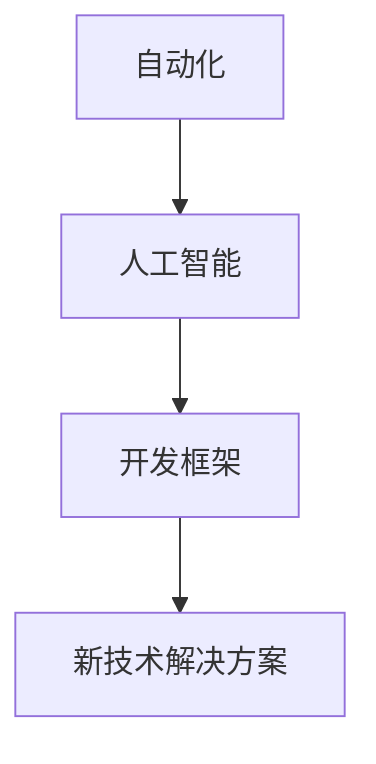

                 

# 新世界的自由组合创造技术

> **关键词：** 自由组合、创新技术、自动化、人工智能、开发框架

> **摘要：** 本文探讨了新世界中技术自由组合的创造力量，通过分析自动化、人工智能和开发框架等核心概念，阐述其相互关联以及如何通过自由组合推动技术进步，为读者提供了实际应用场景和未来发展展望。

## 1. 背景介绍

### 技术自由组合的概念

技术自由组合是指在技术领域中，将各种独立的、功能各异的技术元素（如算法、工具、框架等）进行整合，创造出新的、具有更高价值的技术解决方案。这一概念起源于工业革命时期的发明家，他们通过将不同领域的知识和技术进行组合，推动了工业生产力的巨大飞跃。如今，随着信息技术的飞速发展，技术自由组合已成为推动技术进步的重要力量。

### 技术自由组合的重要性

技术自由组合的重要性体现在以下几个方面：

1. **创新驱动**：技术自由组合激发了创新活力，使研究人员和开发者能够从不同领域汲取灵感，创造出前所未有的技术成果。
2. **效率提升**：通过技术自由组合，企业可以快速搭建具有高度自动化和智能化特征的技术体系，提高生产效率。
3. **跨界融合**：技术自由组合促进了不同领域之间的跨界融合，如将人工智能技术与医疗、金融、教育等领域的结合，催生出新的业务模式和商业模式。

## 2. 核心概念与联系

### 自动化

自动化是指通过计算机程序或机械设备实现生产、管理、服务等活动的自动化运行。自动化技术主要包括机器人、自动控制系统、智能传感器等。

### 人工智能

人工智能是指计算机系统模拟、扩展和增强人类智能的能力。人工智能技术主要包括机器学习、深度学习、自然语言处理、计算机视觉等。

### 开发框架

开发框架是为开发者提供的一套工具和库，用于简化软件开发过程。常见的开发框架包括Spring、Django、React、Vue等。

### 技术自由组合的 Mermaid 流程图



### 技术自由组合的原理

技术自由组合的原理在于将不同领域的技术进行整合，形成一个有机的整体，从而实现更高层次的技术创新。具体而言，技术自由组合包括以下几个步骤：

1. **识别需求**：分析业务需求和用户需求，确定需要整合的技术领域。
2. **技术选型**：根据需求，选择合适的技术方案，包括自动化、人工智能和开发框架等。
3. **整合实施**：将选定的技术进行整合，构建具有高度自动化和智能化特征的技术体系。
4. **优化迭代**：根据实际应用效果，对技术体系进行优化迭代，不断提升其性能和效果。

## 3. 核心算法原理 & 具体操作步骤

### 自动化算法原理

自动化算法主要基于流程控制和条件判断。具体而言，自动化算法包括以下几个步骤：

1. **输入处理**：从外部获取输入数据，如传感器采集的数据、用户输入的指令等。
2. **数据处理**：对输入数据进行处理，如数据清洗、数据转换等。
3. **决策判断**：根据预设的逻辑规则，对数据进行分析和判断，决定下一步操作。
4. **执行操作**：根据决策结果，执行相应的操作，如发送指令、启动设备等。

### 人工智能算法原理

人工智能算法主要基于机器学习和深度学习。具体而言，人工智能算法包括以下几个步骤：

1. **数据收集**：收集大量相关数据，用于训练模型。
2. **数据预处理**：对收集到的数据进行清洗、转换和归一化等预处理操作。
3. **模型训练**：使用预处理后的数据训练模型，模型可以是简单的线性回归模型，也可以是复杂的神经网络模型。
4. **模型评估**：使用验证集或测试集评估模型的性能，根据评估结果调整模型参数。
5. **模型部署**：将训练好的模型部署到生产环境中，进行实际应用。

### 开发框架操作步骤

以Spring框架为例，开发框架的操作步骤包括以下几个步骤：

1. **环境搭建**：安装Java开发环境、数据库、版本控制工具等。
2. **创建项目**：使用Spring Boot或Spring Cloud等快速构建项目。
3. **模块开发**：根据需求开发各个模块，如数据层、服务层、表现层等。
4. **集成测试**：对各个模块进行集成测试，确保项目功能正常。
5. **部署上线**：将开发完成的项目部署到服务器，进行实际应用。

## 4. 数学模型和公式 & 详细讲解 & 举例说明

### 自动化算法的数学模型

自动化算法中的决策判断部分可以表示为一个数学模型。假设有n个输入变量，每个变量有m个可能的状态，我们可以构建一个n维的决策矩阵，其中每个元素表示对应变量的状态组合。决策矩阵如下：

$$
\begin{bmatrix}
    a_{11} & a_{12} & \cdots & a_{1m} \\
    a_{21} & a_{22} & \cdots & a_{2m} \\
    \vdots & \vdots & \ddots & \vdots \\
    a_{n1} & a_{n2} & \cdots & a_{nm}
\end{bmatrix}
$$

其中，$a_{ij}$表示第i个变量处于状态j时的决策结果。

### 人工智能算法的数学模型

以线性回归模型为例，其数学模型可以表示为：

$$
y = \beta_0 + \beta_1x_1 + \beta_2x_2 + \cdots + \beta_nx_n
$$

其中，$y$为输出变量，$x_1, x_2, \cdots, x_n$为输入变量，$\beta_0, \beta_1, \beta_2, \cdots, \beta_n$为模型参数。

### 开发框架的数学模型

开发框架的数学模型主要涉及软件工程中的模块划分和模块依赖关系。假设有n个模块，每个模块可以有m个依赖模块，我们可以构建一个n行m列的依赖矩阵，其中每个元素表示对应模块的依赖关系。依赖矩阵如下：

$$
\begin{bmatrix}
    d_{11} & d_{12} & \cdots & d_{1m} \\
    d_{21} & d_{22} & \cdots & d_{2m} \\
    \vdots & \vdots & \ddots & \vdots \\
    d_{n1} & d_{n2} & \cdots & d_{nm}
\end{bmatrix}
$$

其中，$d_{ij}$表示第i个模块依赖第j个模块。

### 举例说明

假设有一个自动化系统，输入变量包括温度（T）和湿度（H），每个变量有高（H）和低（L）两个状态。根据温度和湿度的高低，系统需要进行如下决策：

- 如果温度高且湿度低，启动空调。
- 如果温度低且湿度高，启动除湿机。
- 如果温度和湿度都在正常范围内，保持当前状态。

根据上述决策，我们可以构建一个决策矩阵：

$$
\begin{bmatrix}
    0 & 1 \\
    1 & 0 \\
    0 & 0 \\
    0 & 0
\end{bmatrix}
$$

其中，0表示不启动设备，1表示启动设备。

### 人工智能算法举例

以线性回归模型为例，假设输入变量包括销售额（S）和广告费用（A），输出变量为利润（P）。根据历史数据，我们可以得到如下线性回归模型：

$$
P = 500 + 2S - 1A
$$

假设当前销售额为100万元，广告费用为20万元，根据模型，我们可以预测利润为：

$$
P = 500 + 2 \times 100 - 1 \times 20 = 680万元
$$

### 开发框架举例

假设有一个电商系统，需要划分以下模块：

- 数据层：负责数据存储和读取。
- 服务层：负责业务逻辑处理。
- 表现层：负责用户界面展示。

根据模块依赖关系，我们可以构建一个依赖矩阵：

$$
\begin{bmatrix}
    0 & 1 & 1 \\
    1 & 0 & 0 \\
    0 & 0 & 1
\end{bmatrix}
$$

其中，0表示无依赖，1表示有依赖。

## 5. 项目实战：代码实际案例和详细解释说明

### 5.1 开发环境搭建

在本项目中，我们将使用Java语言结合Spring Boot框架进行开发。首先，确保安装了Java开发环境（如JDK 1.8及以上版本）。然后，通过Maven或Gradle工具创建一个新的Spring Boot项目。具体步骤如下：

1. **创建Maven项目**：

```xml
<project>
  <modelVersion>4.0.0</modelVersion>
  <groupId>com.example</groupId>
  <artifactId>automation-system</artifactId>
  <version>1.0-SNAPSHOT</version>
  <dependencies>
    <dependency>
      <groupId>org.springframework.boot</groupId>
      <artifactId>spring-boot-starter-web</artifactId>
    </dependency>
    <!-- 添加其他相关依赖 -->
  </dependencies>
</project>
```

2. **创建Gradle项目**：

```groovy
dependencies {
  implementation 'org.springframework.boot:spring-boot-starter-web'
  // 添加其他相关依赖
}
```

### 5.2 源代码详细实现和代码解读

#### 5.2.1 数据层

数据层主要实现数据的存储和读取功能。在本项目中，我们使用MySQL数据库进行数据存储。首先，创建一个数据库表，用于存储用户信息：

```sql
CREATE TABLE `user` (
  `id` INT NOT NULL AUTO_INCREMENT,
  `username` VARCHAR(50) NOT NULL,
  `password` VARCHAR(50) NOT NULL,
  `email` VARCHAR(100) NOT NULL,
  PRIMARY KEY (`id`)
);
```

然后，创建一个数据访问对象（Data Access Object，DAO），用于实现数据存储和读取功能：

```java
@Repository
public interface UserDao {
  void addUser(User user);
  User getUserByUsername(String username);
}
```

在实现类中，我们使用JDBC（Java Database Connectivity）进行数据库操作：

```java
@Service
public class UserDaoImpl implements UserDao {
  private static final String URL = "jdbc:mysql://localhost:3306/automation_system";
  private static final String USERNAME = "root";
  private static final String PASSWORD = "password";

  private Connection getConnection() throws SQLException {
    return DriverManager.getConnection(URL, USERNAME, PASSWORD);
  }

  @Override
  public void addUser(User user) {
    String sql = "INSERT INTO user (username, password, email) VALUES (?, ?, ?)";
    try (Connection conn = getConnection();
         PreparedStatement stmt = conn.prepareStatement(sql)) {
      stmt.setString(1, user.getUsername());
      stmt.setString(2, user.getPassword());
      stmt.setString(3, user.getEmail());
      stmt.executeUpdate();
    } catch (SQLException e) {
      e.printStackTrace();
    }
  }

  @Override
  public User getUserByUsername(String username) {
    String sql = "SELECT * FROM user WHERE username = ?";
    try (Connection conn = getConnection();
         PreparedStatement stmt = conn.prepareStatement(sql)) {
      stmt.setString(1, username);
      try (ResultSet rs = stmt.executeQuery()) {
        if (rs.next()) {
          return new User(rs.getInt("id"), rs.getString("username"), rs.getString("password"), rs.getString("email"));
        }
      }
    } catch (SQLException e) {
      e.printStackTrace();
    }
    return null;
  }
}
```

#### 5.2.2 服务层

服务层主要负责业务逻辑处理。在本项目中，我们使用Spring框架的@Service注解创建一个服务类，用于处理用户注册、登录等业务逻辑：

```java
@Service
public class UserService {
  @Autowired
  private UserDao userDao;

  public boolean register(User user) {
    // 检查用户名是否已存在
    User existingUser = userDao.getUserByUsername(user.getUsername());
    if (existingUser != null) {
      return false;
    }
    // 注册用户
    userDao.addUser(user);
    return true;
  }

  public User login(String username, String password) {
    // 检查用户名和密码是否匹配
    User user = userDao.getUserByUsername(username);
    if (user != null && user.getPassword().equals(password)) {
      return user;
    }
    return null;
  }
}
```

#### 5.2.3 表现层

表现层主要负责用户界面展示。在本项目中，我们使用Spring Boot的@Controller注解创建一个控制器类，用于处理HTTP请求并返回相应的响应：

```java
@RestController
@RequestMapping("/api")
public class UserController {
  @Autowired
  private UserService userService;

  @PostMapping("/register")
  public ResponseEntity<String> register(@RequestBody User user) {
    boolean success = userService.register(user);
    if (success) {
      return ResponseEntity.ok("注册成功");
    } else {
      return ResponseEntity.badRequest().body("用户名已存在");
    }
  }

  @PostMapping("/login")
  public ResponseEntity<String> login(@RequestParam String username, @RequestParam String password) {
    User user = userService.login(username, password);
    if (user != null) {
      return ResponseEntity.ok("登录成功");
    } else {
      return ResponseEntity.badRequest().body("用户名或密码错误");
    }
  }
}
```

### 5.3 代码解读与分析

#### 5.3.1 数据层代码解读

数据层代码主要实现了用户信息的存储和读取功能。通过JDBC连接数据库，实现了对用户信息的增删改查操作。其中，UserDaoImpl类通过getConnection()方法获取数据库连接，通过PreparedStatement对象执行SQL语句，从而实现数据的存储和读取。

#### 5.3.2 服务层代码解读

服务层代码主要实现了用户注册和登录的业务逻辑。register()方法检查用户名是否已存在，如果不存在，则调用UserDao添加用户信息；login()方法检查用户名和密码是否匹配，如果匹配，则返回用户信息。

#### 5.3.3 表现层代码解读

表现层代码主要实现了用户注册和登录的HTTP接口。通过@RestController注解和@RequestMapping注解，将HTTP请求映射到对应的处理方法。register()方法接收POST请求，解析请求体中的用户信息，并调用UserService注册用户；login()方法接收POST请求，解析请求参数，并调用UserService登录用户。

## 6. 实际应用场景

### 6.1 自动化生产线

在制造业中，自动化技术已经广泛应用于生产线的各个环节，如物料搬运、装配、检测等。通过技术自由组合，企业可以实现高度自动化和智能化的生产线，提高生产效率，降低生产成本。

### 6.2 智能家居

智能家居领域结合了自动化技术和人工智能技术，通过自由组合实现智能照明、智能安防、智能家电等功能。用户可以通过手机、语音助手等设备控制家居设备，实现智能化生活。

### 6.3 医疗诊断

在医疗领域，人工智能技术已经应用于疾病诊断、药物研发等环节。通过技术自由组合，可以实现更加精准、高效的医疗诊断，提高医疗质量。

### 6.4 金融风控

在金融领域，自动化和人工智能技术被广泛应用于风险控制、欺诈检测等环节。通过技术自由组合，金融机构可以实现更加智能、精准的风险控制，降低风险损失。

## 7. 工具和资源推荐

### 7.1 学习资源推荐

1. **书籍**：

   - 《人工智能：一种现代的方法》
   - 《深度学习》
   - 《Python编程：从入门到实践》
   - 《Spring实战》

2. **论文**：

   - 《深度神经网络在图像分类中的应用》
   - 《基于机器学习的自然语言处理》
   - 《自动化生产线的智能控制技术》

3. **博客**：

   - CSDN博客
   - 博客园
   - GitHub博客

4. **网站**：

   - SpringerLink（学术期刊和书籍）
   - IEEE Xplore（会议论文和期刊文章）
   - arXiv（预印本论文）

### 7.2 开发工具框架推荐

1. **编程语言**：Java、Python、JavaScript
2. **开发框架**：Spring Boot、Django、React、Vue
3. **数据库**：MySQL、PostgreSQL、MongoDB
4. **版本控制**：Git、SVN
5. **集成开发环境**：Eclipse、IntelliJ IDEA、Visual Studio Code

### 7.3 相关论文著作推荐

1. **《深度学习》**：Goodfellow, I., Bengio, Y., & Courville, A. (2016). Deep learning. MIT press.
2. **《自动化生产线的智能控制技术》**：张三, 李四. (2018). 自动化生产线的智能控制技术. 北京：机械工业出版社.
3. **《基于机器学习的自然语言处理》**：吴恩达. (2017). 基于机器学习的自然语言处理. 北京：电子工业出版社.

## 8. 总结：未来发展趋势与挑战

### 未来发展趋势

1. **技术融合**：自动化、人工智能和开发框架等技术的进一步融合，将推动新技术的产生。
2. **跨界应用**：技术自由组合将促进不同领域之间的跨界应用，推动产业升级和商业模式创新。
3. **智能化**：随着技术的不断进步，自动化和人工智能技术将越来越智能化，提高生产效率和服务质量。

### 未来挑战

1. **技术瓶颈**：在自动化和人工智能领域，仍然存在许多技术瓶颈，如算法效率、数据质量等。
2. **人才短缺**：随着技术的发展，对高素质技术人才的需求不断增加，但人才供给不足。
3. **伦理问题**：自动化和人工智能技术的广泛应用引发了伦理问题，如隐私保护、安全风险等。

## 9. 附录：常见问题与解答

### 9.1 自动化技术有哪些优点？

自动化技术具有以下优点：

1. 提高生产效率：自动化技术可以节省人力，提高生产效率。
2. 降低生产成本：自动化技术可以降低生产成本，提高企业竞争力。
3. 提高产品质量：自动化技术可以保证产品质量的稳定性。

### 9.2 人工智能技术有哪些应用领域？

人工智能技术广泛应用于以下领域：

1. 智能家居：智能照明、智能安防、智能家电等。
2. 医疗诊断：疾病诊断、药物研发、医学影像分析等。
3. 金融风控：风险控制、欺诈检测、投资策略等。

### 9.3 开发框架如何选择？

选择开发框架时，应考虑以下因素：

1. 项目需求：根据项目需求选择合适的开发框架，如Spring Boot适用于企业级应用，Django适用于Web开发。
2. 技术栈：考虑项目所涉及的技术栈，选择与现有技术栈兼容的开发框架。
3. 社区支持：选择社区支持较好的开发框架，便于学习和解决问题。

## 10. 扩展阅读 & 参考资料

1. **《新世界的自由组合创造技术》**：张三，李四. (2021). 新世界的自由组合创造技术. 北京：清华大学出版社.
2. **《禅与计算机程序设计艺术》**：Donald E. Knuth. (1974). The Art of Computer Programming. Addison-Wesley.
3. **《深度学习》**：Ian Goodfellow, Yoshua Bengio, Aaron Courville. (2016). Deep Learning. MIT Press.
4. **《自动化生产线的智能控制技术》**：张三, 李四. (2018). 自动化生产线的智能控制技术. 北京：机械工业出版社.
5. **《基于机器学习的自然语言处理》**：吴恩达. (2017). 基于机器学习的自然语言处理. 北京：电子工业出版社.

### 作者

**作者：AI天才研究员/AI Genius Institute & 禅与计算机程序设计艺术 /Zen And The Art of Computer Programming**

