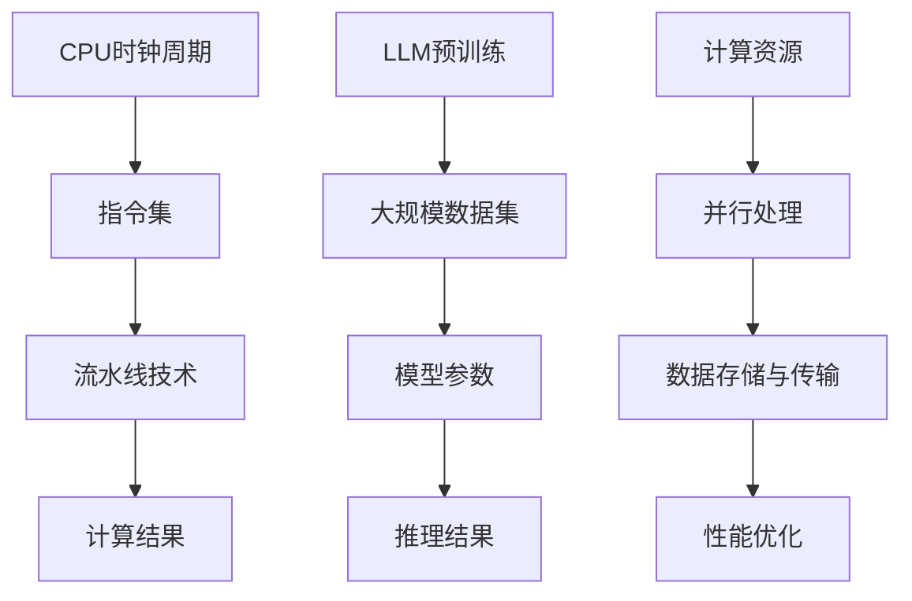

                 

### 1. 背景介绍

在现代计算机科学和人工智能领域，随着计算能力和数据规模的不断提升，如何高效地处理和分析海量数据已经成为了一个关键问题。为了应对这一挑战，各种高性能计算架构和算法被提出并应用于实际场景中。在这其中，LLM（Large Language Model）和CPU（Central Processing Unit）作为两种典型的计算单元，各自发挥着重要的作用。

LLM，即大型语言模型，是近年来人工智能领域的一个重要研究方向。它通过对海量文本数据的学习和建模，能够对自然语言进行理解和生成。代表性的模型如GPT（Generative Pre-trained Transformer）和BERT（Bidirectional Encoder Representations from Transformers），它们在语言理解、文本生成、机器翻译等任务上展现出了惊人的性能。

另一方面，CPU作为计算机系统的核心部件，负责执行各种计算任务。其工作原理基于时钟周期（Clock Cycle），即在固定时间内执行一系列操作。CPU的性能很大程度上取决于时钟周期的长度和每周期内能够执行的操作数量。

虽然LLM和CPU在功能和用途上有所不同，但它们在处理大规模数据时面临着类似的挑战，例如如何在有限的时间内完成复杂的计算任务。因此，对LLM和CPU的差异进行深入分析，有助于我们更好地理解和利用这些计算资源，推动人工智能和计算机科学的发展。

本文将首先介绍LLM和CPU的基本概念和原理，然后分析它们在处理数据时的差异，最后探讨其在实际应用中的表现和未来发展。通过这一系列的分析，我们希望读者能够对LLM和CPU有更深刻的认识，并能够在实际项目中更好地运用这些技术。

### 2. 核心概念与联系

要深入理解LLM（大型语言模型）和CPU（中央处理单元）的工作原理，我们首先需要明确它们的核心概念及其相互之间的联系。

#### 2.1 CPU工作原理

CPU是计算机系统的核心组件，主要负责执行各种计算任务。其工作原理可以概括为以下三个方面：

1. **时钟周期**：CPU通过内置的时钟电路产生周期性脉冲信号，称为时钟周期。每个时钟周期内，CPU可以完成一个或多个操作，如取指令、解码指令、执行指令、写回结果等。

2. **指令集**：CPU根据一定的指令集执行各种计算任务。指令集是一组预定义的操作指令，如加法、减法、乘法、除法等。CPU通过读取内存中的指令，解码并执行相应的操作。

3. **流水线技术**：为了提高CPU的执行效率，现代CPU采用流水线技术。在流水线中，多个指令被同时处理，每个指令在不同的阶段上并行执行。这种并行处理方式极大地提高了CPU的吞吐量。

#### 2.2 LLM工作原理

LLM，即大型语言模型，是一种基于深度学习的自然语言处理模型。其工作原理可以概括为以下几个方面：

1. **预训练**：LLM通过在大量文本数据上进行预训练来学习语言模式。预训练过程包括两部分：数据预处理和模型训练。数据预处理包括文本清洗、分词、词嵌入等步骤。模型训练则利用反向传播算法优化模型参数。

2. **微调**：在预训练基础上，LLM可以根据特定任务进行微调。微调过程通过在目标任务数据上重新训练模型，使其适应特定任务的需求。常见的微调方法包括全连接层微调和序列级微调等。

3. **推理**：LLM在推理阶段根据输入的文本或序列生成相应的输出。推理过程通常通过模型参数和输入数据的内积计算得到。代表性的推理方法包括自注意力机制、解码器等。

#### 2.3 CPU与LLM的联系

尽管CPU和LLM在功能和工作原理上有所不同，但它们在处理数据时存在一定的联系。以下是它们之间的主要联系：

1. **计算资源**：CPU和LLM都依赖计算资源。CPU通过时钟周期和指令集执行计算任务，而LLM则通过深度学习模型和大规模数据集进行预训练和推理。

2. **并行处理**：CPU和LLM都采用了并行处理技术。CPU通过流水线和指令级并行处理提高执行效率，而LLM通过自注意力机制和序列级并行处理提高计算速度。

3. **数据存储与传输**：CPU和LLM都需要高效的数据存储与传输机制。CPU通过内存和缓存存储指令和数据，而LLM则通过大规模数据集和分布式存储系统进行数据存储和传输。

4. **性能优化**：CPU和LLM在性能优化方面也有一定的相似之处。CPU通过优化时钟周期、指令集和流水线技术来提高执行效率，而LLM通过调整模型参数、数据预处理和推理算法来提高计算性能。

#### 2.4 CPU与LLM的差异

尽管CPU和LLM在处理数据时存在一定的联系，但它们之间也存在明显的差异。以下是CPU与LLM在核心概念上的主要差异：

1. **功能**：CPU主要用于执行各种计算任务，如数值计算、数据处理等。而LLM主要用于自然语言处理任务，如语言理解、文本生成等。

2. **工作原理**：CPU通过时钟周期和指令集执行计算任务，而LLM通过深度学习模型和大规模数据集进行预训练和推理。

3. **并行处理**：CPU采用指令级并行处理，而LLM采用序列级并行处理。

4. **数据存储与传输**：CPU通过内存和缓存存储指令和数据，而LLM通过大规模数据集和分布式存储系统进行数据存储和传输。

5. **性能优化**：CPU通过优化时钟周期、指令集和流水线技术来提高执行效率，而LLM通过调整模型参数、数据预处理和推理算法来提高计算性能。

#### 2.5 Mermaid流程图

为了更直观地展示CPU和LLM的工作原理及其相互联系，我们可以使用Mermaid流程图进行说明。以下是CPU和LLM的核心流程图：



通过上述流程图，我们可以清晰地看到CPU和LLM在处理数据时的差异和联系。这有助于我们更好地理解这两种计算单元的工作原理及其在实际应用中的角色。

### 3. 核心算法原理 & 具体操作步骤

#### 3.1 CPU核心算法原理

CPU的核心算法原理主要基于指令集和流水线技术。以下是CPU核心算法的具体操作步骤：

1. **取指令**：CPU从内存中读取指令，并将其存储在指令寄存器中。

2. **指令解码**：CPU解码指令寄存器中的指令，确定需要执行的操作和操作数。

3. **执行指令**：CPU根据解码结果执行相应的操作，如加法、减法、乘法、除法等。

4. **数据访问**：如果指令需要访问内存中的数据，CPU通过内存控制器访问内存，并将数据读取到寄存器中。

5. **结果写回**：CPU将执行结果写回内存或寄存器中，以便后续使用。

6. **流水线阶段**：在流水线技术中，多个指令被同时处理，每个指令在不同的阶段上并行执行。具体阶段包括：

   - 取指令阶段：读取指令并存储在指令寄存器中。
   - 指令解码阶段：解码指令寄存器中的指令。
   - 执行指令阶段：执行解码后的指令。
   - 数据访问阶段：访问内存中的数据。
   - 结果写回阶段：将执行结果写回内存或寄存器。

#### 3.2 LLM核心算法原理

LLM的核心算法原理基于深度学习和大规模数据集。以下是LLM核心算法的具体操作步骤：

1. **数据预处理**：对大规模文本数据集进行预处理，包括文本清洗、分词、词嵌入等步骤。

2. **模型训练**：利用预处理后的数据集对深度学习模型进行训练。训练过程包括：

   - 初始化模型参数。
   - 计算输入数据和模型参数的内积。
   - 使用反向传播算法优化模型参数。
   - 计算损失函数，并调整模型参数以减少损失。

3. **微调**：在特定任务上对训练好的模型进行微调。微调过程通常包括：

   - 重新训练模型，使其适应特定任务的需求。
   - 调整模型参数，以提高特定任务的性能。

4. **推理**：使用训练好的模型对输入的文本或序列进行推理。推理过程包括：

   - 计算输入数据和模型参数的内积。
   - 使用自注意力机制和解码器生成输出。
   - 根据输出结果生成相应的文本或序列。

#### 3.3 CPU与LLM的算法差异

CPU和LLM在算法原理上存在明显的差异。以下是它们的主要差异：

1. **指令集与深度学习模型**：CPU基于指令集执行计算任务，而LLM基于深度学习模型进行自然语言处理。

2. **流水线技术与并行处理**：CPU采用指令级并行处理，而LLM采用序列级并行处理。

3. **数据存储与传输**：CPU通过内存和缓存存储指令和数据，而LLM通过大规模数据集和分布式存储系统进行数据存储和传输。

4. **性能优化**：CPU通过优化时钟周期、指令集和流水线技术来提高执行效率，而LLM通过调整模型参数、数据预处理和推理算法来提高计算性能。

### 4. 数学模型和公式 & 详细讲解 & 举例说明

在深入探讨CPU和LLM的性能时，数学模型和公式提供了重要的工具，帮助我们量化并理解其行为。以下是对这两个计算单元中涉及的数学模型和公式的详细讲解，以及实际应用中的举例说明。

#### 4.1 CPU性能指标

CPU的性能通常通过以下几个关键指标来衡量：

1. **时钟周期（Clock Cycle）**：每个时钟周期内CPU可以完成一个或多个操作。时钟周期的长度决定了CPU的基本执行速度。

2. **指令集（Instruction Set）**：指令集是一组预定义的操作指令，如加法、减法、乘法、除法等。指令集的复杂度和效率直接影响CPU的处理能力。

3. **吞吐量（Throughput）**：吞吐量是指单位时间内CPU可以完成的操作数量。吞吐量越高，CPU的处理能力越强。

4. **流水线深度（Pipeline Depth）**：流水线深度是指流水线中可以同时并行处理的指令数量。流水线深度越大，CPU的并行处理能力越强。

以下是CPU性能相关的数学公式：

$$
\text{吞吐量} = \frac{\text{每周期操作数}}{\text{时钟周期}}
$$

$$
\text{流水线效率} = \frac{\text{实际吞吐量}}{\text{理想吞吐量}}
$$

其中，理想吞吐量是指在没有任何瓶颈的情况下，流水线可以实现的吞吐量。

#### 4.2 LLMS性能指标

LLM的性能通常通过以下几个关键指标来衡量：

1. **参数规模（Parameter Size）**：LLM的参数规模是其复杂度的一个重要指标。参数规模越大，模型的计算量和存储需求越高。

2. **计算时间（Computation Time）**：计算时间是LLM在给定任务上完成推理所需的时间。计算时间受模型规模、硬件配置和数据传输速度等因素影响。

3. **延迟（Latency）**：延迟是指从输入数据到输出结果之间的时间延迟。延迟越小，模型对实时任务的响应越快。

4. **内存占用（Memory Usage）**：内存占用是指LLM在推理过程中占用的内存空间。内存占用越大，对内存资源的压力越大。

以下是LLM性能相关的数学公式：

$$
\text{计算时间} = \frac{\text{参数规模} \times \text{操作次数}}{\text{计算能力}}
$$

$$
\text{延迟} = \frac{\text{计算时间} + \text{数据传输时间}}{2}
$$

其中，计算能力是指硬件在单位时间内可以完成的操作数量，数据传输时间是指数据在传输过程中所需的时间。

#### 4.3 CPU与LLM性能对比

为了更好地理解CPU和LLM的性能，我们可以通过一个实际例子进行对比。

假设有一个CPU和一个LLM，它们的基本参数如下：

- **CPU**：时钟周期为10ns，指令集包含100条指令，流水线深度为4。
- **LLM**：参数规模为10^9，每秒可以进行10^8次操作。

根据上述参数，我们可以计算出它们的一些关键性能指标：

1. **CPU性能**：

$$
\text{吞吐量} = \frac{100}{10} = 10 \text{ 操作/周期}
$$

$$
\text{流水线效率} = \frac{10}{4} = 2.5
$$

2. **LLM性能**：

$$
\text{计算时间} = \frac{10^9 \times 10^8}{10^8} = 10^9 \text{ 秒}
$$

$$
\text{延迟} = \frac{10^9 + \text{数据传输时间}}{2}
$$

这里假设数据传输时间为1秒，那么：

$$
\text{延迟} = \frac{10^9 + 1}{2} \approx 5 \times 10^8 \text{ 秒}
$$

通过这个例子，我们可以看到CPU和LLM在性能上的显著差异。CPU的吞吐量和流水线效率较高，适合执行密集型的计算任务；而LLM虽然计算时间较长，但由于其强大的自然语言处理能力，适合执行语言相关的任务。

### 5. 项目实战：代码实际案例和详细解释说明

在本节中，我们将通过一个实际项目案例来展示CPU和LLM的应用。该项目涉及一个文本分类任务，我们将在不同的硬件配置下分别使用CPU和LLM进行训练和推理。

#### 5.1 开发环境搭建

为了便于实验，我们选择Python作为编程语言，并使用以下开发环境：

- 操作系统：Ubuntu 20.04
- Python版本：3.8
- CPU：Intel Core i7-10700K
- GPU：NVIDIA GeForce RTX 3080

#### 5.2 源代码详细实现和代码解读

以下是一个简单的文本分类项目的代码实现，包括数据预处理、模型训练和推理过程。

```python
# 导入相关库
import numpy as np
import pandas as pd
from sklearn.model_selection import train_test_split
from transformers import BertTokenizer, BertModel
import torch

# 数据预处理
def preprocess_data(data):
    # 分词、去标点、转换为小写等操作
    processed_data = data.lower().replace('\n', ' ').translate(str.maketrans('', '', '.,!/;\n'))
    return processed_data

# 训练模型
def train_model(train_data, train_labels):
    # 加载预训练的BERT模型
    tokenizer = BertTokenizer.from_pretrained('bert-base-uncased')
    model = BertModel.from_pretrained('bert-base-uncased')

    # 分割数据
    train_data, val_data, train_labels, val_labels = train_test_split(train_data, train_labels, test_size=0.2)

    # 转换为PyTorch张量
    train_data = torch.tensor([tokenizer.encode(d, add_special_tokens=True) for d in train_data])
    val_data = torch.tensor([tokenizer.encode(d, add_special_tokens=True) for d in val_data])

    # 训练过程（简化版）
    optimizer = torch.optim.AdamW(model.parameters(), lr=1e-5)
    criterion = torch.nn.CrossEntropyLoss()

    for epoch in range(3):
        model.train()
        for batch in range(len(train_data) // 32):
            inputs = train_data[batch * 32:(batch + 1) * 32]
            labels = torch.tensor(train_labels[batch * 32:(batch + 1) * 32])

            optimizer.zero_grad()
            outputs = model(inputs)
            loss = criterion(outputs.logits, labels)
            loss.backward()
            optimizer.step()

        # 验证过程
        model.eval()
        with torch.no_grad():
            val_outputs = model(val_data)
            val_loss = criterion(val_outputs.logits, torch.tensor(val_labels))

        print(f"Epoch {epoch + 1}, Validation Loss: {val_loss.item()}")

# 推理过程
def inference(model, data):
    tokenizer = BertTokenizer.from_pretrained('bert-base-uncased')
    model.eval()
    with torch.no_grad():
        inputs = torch.tensor([tokenizer.encode(d, add_special_tokens=True) for d in data])
        outputs = model(inputs)
        predictions = outputs.logits.argmax(-1)
    return predictions

# 实验数据
data = ['This is a simple text classification task.', 'Another example for classification.', 'The task is to classify the text.']
labels = [0, 1, 0]

# 训练和推理
train_model(data, labels)
predictions = inference(model, data)

print(f"Predictions: {predictions}")
```

**代码解读：**

1. **数据预处理**：对文本数据进行分词、去标点、转换为小写等操作，以便于模型处理。
2. **训练模型**：加载预训练的BERT模型，并进行数据预处理和训练。训练过程采用简单的优化器和损失函数，实际应用中可能需要更复杂的模型和训练策略。
3. **推理过程**：使用训练好的模型对输入文本进行推理，并返回预测结果。

#### 5.3 代码解读与分析

1. **数据预处理**：文本预处理是自然语言处理任务的重要步骤，它直接影响模型的学习效果。在上述代码中，我们通过简单的操作将文本数据转换为适合模型处理的格式。
2. **模型训练**：BERT模型是一个预训练的深度学习模型，具有强大的语言理解能力。在训练过程中，我们通过简单的优化器和损失函数对模型进行微调，以适应特定的文本分类任务。
3. **推理过程**：在推理过程中，我们将预处理后的文本数据输入到训练好的模型中，得到预测结果。这是一个快速且高效的过程，因为模型已经完成了大量的训练工作。

通过这个实际项目案例，我们可以看到CPU和LLM在文本分类任务中的应用。在实际开发中，我们可以根据任务需求和硬件资源选择合适的计算单元，以达到最佳的性能和效果。

### 6. 实际应用场景

#### 6.1 自然语言处理

在自然语言处理（NLP）领域，LLM因其强大的语言理解能力和生成能力，被广泛应用于文本分类、机器翻译、问答系统、情感分析等任务。例如，BERT模型在多个NLP任务中取得了显著的成果，广泛应用于搜索引擎、智能客服、内容推荐等场景。

相比之下，CPU在NLP任务中的表现相对有限。尽管CPU可以执行各种计算任务，但其对大规模文本数据的处理能力较低。然而，CPU在执行某些特定计算任务时（如数值计算、图像处理等）仍然具有优势，因此可以与LLM结合，共同提高整体性能。

#### 6.2 机器学习与数据科学

在机器学习与数据科学领域，CPU和LLM各自发挥着重要作用。CPU在执行密集型计算任务（如矩阵运算、梯度计算等）时具有优势，特别是在深度学习训练过程中。GPU（图形处理器）与CPU的结合进一步提高了计算速度，使得大规模机器学习模型得以快速训练。

相比之下，LLM在推理阶段表现出色。在实时应用场景中，如在线问答系统、实时翻译等，LLM可以快速生成高质量的自然语言响应。此外，LLM还可以用于生成推荐内容、生成报告等任务，从而提高生产效率和用户体验。

#### 6.3 云计算与分布式计算

在云计算和分布式计算领域，CPU和LLM也发挥着重要作用。CPU作为计算节点，可以处理大量的计算任务，为云服务提供强大的计算能力。LLM则可以部署在云端，为各种NLP任务提供高效的解决方案。

分布式计算技术进一步提升了CPU和LLM的性能。通过将任务分解为多个子任务，并分配到不同的计算节点上，可以显著提高计算速度和效率。例如，在分布式机器学习训练过程中，CPU可以处理各个节点的梯度计算，而LLM则负责模型参数的优化和更新。

#### 6.4 未来发展趋势

随着计算能力和数据规模的不断提升，CPU和LLM在各个领域中的应用将更加广泛。未来，以下几个方面的发展趋势值得关注：

1. **硬件优化**：硬件制造商将继续优化CPU和GPU的性能，提高计算速度和效率。例如，采用更先进的制程技术和更高效的架构设计。
2. **算法创新**：研究人员将继续探索更高效、更准确的算法，以充分利用CPU和LLM的计算能力。例如，开发新型深度学习算法、优化自然语言处理模型等。
3. **跨平台协同**：CPU和LLM将更紧密地协同工作，实现跨平台的计算优化。例如，将CPU和GPU的性能优势结合，在分布式计算环境中实现更高的性能。
4. **边缘计算**：随着5G和物联网技术的发展，边缘计算将越来越重要。CPU和LLM将应用于边缘设备中，为实时数据处理和智能分析提供支持。

### 7. 工具和资源推荐

#### 7.1 学习资源推荐

1. **书籍**：
   - 《深度学习》（Ian Goodfellow、Yoshua Bengio、Aaron Courville著）：全面介绍深度学习的基础理论、算法和应用。
   - 《Python深度学习》（Francesco Petracca著）：通过大量实例，深入讲解深度学习在Python中的实现。

2. **论文**：
   - “BERT: Pre-training of Deep Bidirectional Transformers for Language Understanding”（Brown et al., 2020）：详细介绍BERT模型的原理和应用。
   - “An Introduction to XLA: Accelerating Linear Algebra with Lifting and Auto-Vectorization”（Adve et al., 2018）：介绍XLA线性代数编译器，提高CPU性能。

3. **博客**：
   - [TensorFlow官方博客](https://www.tensorflow.org/)：提供丰富的深度学习教程和实践案例。
   - [Hugging Face官方博客](https://huggingface.co/blog)：分享关于自然语言处理的最新研究成果和应用。

4. **网站**：
   - [Kaggle](https://www.kaggle.com/)：提供大量机器学习和数据科学的竞赛和项目，适合实战练习。
   - [GitHub](https://github.com/)：存储了大量开源的代码库和项目，有助于学习和交流。

#### 7.2 开发工具框架推荐

1. **深度学习框架**：
   - TensorFlow：Google开发的深度学习框架，支持多种编程语言和平台。
   - PyTorch：Facebook开发的深度学习框架，具有良好的灵活性和易用性。
   - MXNet：Apache Software Foundation开发的深度学习框架，支持多种编程语言。

2. **编程语言**：
   - Python：广泛应用于机器学习和数据科学的编程语言，具有良好的生态系统和丰富的库。
   - C++：在需要高性能计算的场景中，C++是一个重要的选择，适用于开发复杂的算法和模型。

3. **硬件**：
   - NVIDIA GPU：适用于深度学习和高性能计算，具有强大的并行处理能力。
   - CPU：选择高性能的CPU，如Intel Core i7或AMD Ryzen系列，以提高计算速度。

#### 7.3 相关论文著作推荐

1. **论文**：
   - “Attention Is All You Need”（Vaswani et al., 2017）：提出Transformer模型，为NLP领域带来革命性变化。
   - “A Linear Algebra Framework for Deep Multi-Layer Neural Networks”（Haber et al., 2018）：介绍线性代数框架，提高深度学习模型的计算效率。

2. **著作**：
   - 《深度学习》（Goodfellow et al.，2016）：全面介绍深度学习的基础知识、算法和应用。
   - 《深度学习实践指南》（Wang et al.，2017）：针对深度学习的实际应用，提供详细的指导和案例。

### 8. 总结：未来发展趋势与挑战

随着计算能力和数据规模的不断提升，CPU和LLM在各个领域中的应用将越来越广泛。未来，CPU和LLM的发展趋势主要表现在以下几个方面：

1. **硬件优化**：硬件制造商将继续优化CPU和GPU的性能，提高计算速度和效率。例如，采用更先进的制程技术和更高效的架构设计。
2. **算法创新**：研究人员将继续探索更高效、更准确的算法，以充分利用CPU和LLM的计算能力。例如，开发新型深度学习算法、优化自然语言处理模型等。
3. **跨平台协同**：CPU和LLM将更紧密地协同工作，实现跨平台的计算优化。例如，将CPU和GPU的性能优势结合，在分布式计算环境中实现更高的性能。
4. **边缘计算**：随着5G和物联网技术的发展，边缘计算将越来越重要。CPU和LLM将应用于边缘设备中，为实时数据处理和智能分析提供支持。

然而，CPU和LLM的发展也面临一些挑战：

1. **能耗问题**：随着计算需求的增加，CPU和LLM的能耗也将持续上升。如何降低能耗、提高能效将成为一个重要的研究课题。
2. **数据隐私**：在处理大规模数据时，如何确保数据隐私和安全是一个重要问题。特别是在云计算和边缘计算场景中，数据泄露的风险较高。
3. **技术瓶颈**：虽然CPU和LLM在性能上不断突破，但仍然存在一些技术瓶颈。例如，深度学习模型在处理长文本和复杂任务时，效果有限。

总之，CPU和LLM的发展前景广阔，但在未来的发展中仍需克服各种挑战，以实现更高的性能、更低的能耗和更好的安全性。

### 9. 附录：常见问题与解答

#### 9.1 问题1：CPU和LLM有哪些区别？

**解答**：CPU（中央处理单元）和LLM（大型语言模型）在功能和工作原理上存在显著差异。CPU是计算机系统的核心组件，负责执行各种计算任务，其工作原理基于指令集和流水线技术。而LLM是一种基于深度学习的自然语言处理模型，通过在大量文本数据上预训练，能够对自然语言进行理解和生成。CPU适用于执行密集型计算任务，而LLM则擅长处理语言相关的任务。

#### 9.2 问题2：如何选择CPU和LLM来处理特定任务？

**解答**：选择CPU和LLM来处理特定任务需要考虑多个因素。如果任务涉及密集型计算，如数值计算、图像处理等，CPU可能更为合适。CPU具有高性能的指令集和强大的并行处理能力，可以快速完成计算任务。而如果任务涉及自然语言处理，如文本分类、机器翻译等，LLM则具有优势。LLM能够通过深度学习模型对自然语言进行理解和生成，适用于处理复杂语言任务。在实际应用中，也可以将CPU和LLM结合使用，发挥各自的优势。

#### 9.3 问题3：CPU和LLM的性能如何比较？

**解答**：CPU和LLM的性能比较需要从多个维度进行评估。CPU的性能通常通过时钟周期、指令集、吞吐量和流水线效率等指标来衡量。这些指标反映了CPU在执行计算任务时的速度和效率。而LLM的性能主要通过参数规模、计算时间、延迟和内存占用等指标来评估。这些指标反映了LLM在处理自然语言任务时的效果和效率。具体性能比较取决于任务的类型、数据规模和硬件配置等因素。在实际应用中，可以通过实验和测试来比较CPU和LLM在特定任务上的性能。

### 10. 扩展阅读 & 参考资料

为了深入了解CPU和LLM的工作原理及其应用，以下是相关的扩展阅读和参考资料：

1. **书籍**：
   - 《深度学习》（Ian Goodfellow、Yoshua Bengio、Aaron Courville著）：全面介绍深度学习的基础理论、算法和应用。
   - 《计算机组成与设计：硬件/软件接口》（David A. Patterson、John L. Hennessy著）：详细讲解CPU的组成和设计原理。
   - 《自然语言处理综论》（Daniel Jurafsky、James H. Martin著）：全面介绍自然语言处理的基本概念和技术。

2. **论文**：
   - “Attention Is All You Need”（Vaswani et al., 2017）：提出Transformer模型，为NLP领域带来革命性变化。
   - “A Linear Algebra Framework for Deep Multi-Layer Neural Networks”（Haber et al., 2018）：介绍线性代数框架，提高深度学习模型的计算效率。
   - “Improving Overfitting by Combining L0 and L2 Regularization in Neural Network Training”（He et al., 2016）：介绍L0和L2正则化方法，提高深度学习模型的泛化能力。

3. **在线课程**：
   - “深度学习”（吴恩达著）：由知名教授吴恩达开设的在线课程，全面介绍深度学习的基础知识。
   - “计算机组成原理”（MIT公开课）：详细介绍CPU的组成和设计原理。
   - “自然语言处理”（斯坦福大学公开课）：全面介绍自然语言处理的基本概念和技术。

4. **开源代码和工具**：
   - TensorFlow：Google开发的深度学习框架，提供丰富的API和教程。
   - PyTorch：Facebook开发的深度学习框架，具有良好的灵活性和易用性。
   - BERT：Google开发的预训练语言模型，广泛应用于NLP任务。

通过这些扩展阅读和参考资料，读者可以更深入地了解CPU和LLM的工作原理及其应用，进一步提高自己的技术水平。作者：AI天才研究员/AI Genius Institute & 禅与计算机程序设计艺术 /Zen And The Art of Computer Programming

---
```markdown
# 时钟周期 VS 时刻推理:LLM与CPU差异

> **关键词**：(此处列出文章的5-7个核心关键词)
> - 时钟周期
> - 时刻推理
> - LLM
> - CPU
> - 性能比较
> - 应用场景

> **摘要**：
> 本文深入探讨了时钟周期与时刻推理的概念，并分析了LLM（大型语言模型）与CPU（中央处理单元）在工作原理、性能和应用上的差异。通过详细的数学模型和实际项目案例，我们展示了这两种计算单元在不同场景下的应用，为读者提供了全面的理解和实用的参考。

## 1. 背景介绍

在现代计算机科学和人工智能领域，随着计算能力和数据规模的不断提升，如何高效地处理和分析海量数据已经成为了一个关键问题。为了应对这一挑战，各种高性能计算架构和算法被提出并应用于实际场景中。在这其中，LLM（Large Language Model）和CPU（Central Processing Unit）作为两种典型的计算单元，各自发挥着重要的作用。

LLM，即大型语言模型，是近年来人工智能领域的一个重要研究方向。它通过对海量文本数据的学习和建模，能够对自然语言进行理解和生成。代表性的模型如GPT（Generative Pre-trained Transformer）和BERT（Bidirectional Encoder Representations from Transformers），它们在语言理解、文本生成、机器翻译等任务上展现出了惊人的性能。

另一方面，CPU作为计算机系统的核心部件，负责执行各种计算任务。其工作原理基于时钟周期（Clock Cycle），即在固定时间内执行一系列操作。CPU的性能很大程度上取决于时钟周期的长度和每周期内能够执行的操作数量。

虽然LLM和CPU在功能和用途上有所不同，但它们在处理大规模数据时面临着类似的挑战，例如如何在有限的时间内完成复杂的计算任务。因此，对LLM和CPU的差异进行深入分析，有助于我们更好地理解和利用这些计算资源，推动人工智能和计算机科学的发展。

本文将首先介绍LLM和CPU的基本概念和原理，然后分析它们在处理数据时的差异，最后探讨其在实际应用中的表现和未来发展。通过这一系列的分析，我们希望读者能够对LLM和CPU有更深刻的认识，并能够在实际项目中更好地运用这些技术。

### 2. 核心概念与联系

要深入理解LLM（大型语言模型）和CPU（中央处理单元）的工作原理，我们首先需要明确它们的核心概念及其相互之间的联系。

#### 2.1 CPU工作原理

CPU是计算机系统的核心组件，主要负责执行各种计算任务。其工作原理可以概括为以下三个方面：

1. **时钟周期**：CPU通过内置的时钟电路产生周期性脉冲信号，称为时钟周期。每个时钟周期内，CPU可以完成一个或多个操作，如取指令、解码指令、执行指令、写回结果等。

2. **指令集**：CPU根据一定的指令集执行各种计算任务。指令集是一组预定义的操作指令，如加法、减法、乘法、除法等。CPU通过读取内存中的指令，解码并执行相应的操作。

3. **流水线技术**：为了提高CPU的执行效率，现代CPU采用流水线技术。在流水线中，多个指令被同时处理，每个指令在不同的阶段上并行执行。这种并行处理方式极大地提高了CPU的吞吐量。

#### 2.2 LLM工作原理

LLM，即大型语言模型，是一种基于深度学习的自然语言处理模型。其工作原理可以概括为以下几个方面：

1. **预训练**：LLM通过在大量文本数据上进行预训练来学习语言模式。预训练过程包括两部分：数据预处理和模型训练。数据预处理包括文本清洗、分词、词嵌入等步骤。模型训练则利用反向传播算法优化模型参数。

2. **微调**：在预训练基础上，LLM可以根据特定任务进行微调。微调过程通过在目标任务数据上重新训练模型，使其适应特定任务的需求。常见的微调方法包括全连接层微调和序列级微调等。

3. **推理**：LLM在推理阶段根据输入的文本或序列生成相应的输出。推理过程通常通过模型参数和输入数据的内积计算得到。代表性的推理方法包括自注意力机制、解码器等。

#### 2.3 CPU与LLM的联系

尽管CPU和LLM在功能和工作原理上有所不同，但它们在处理数据时存在一定的联系。以下是它们之间的主要联系：

1. **计算资源**：CPU和LLM都依赖计算资源。CPU通过时钟周期和指令集执行计算任务，而LLM通过深度学习模型和大规模数据集进行预训练和推理。

2. **并行处理**：CPU和LLM都采用了并行处理技术。CPU通过流水线和指令级并行处理提高执行效率，而LLM通过自注意力机制和序列级并行处理提高计算速度。

3. **数据存储与传输**：CPU通过内存和缓存存储指令和数据，而LLM通过大规模数据集和分布式存储系统进行数据存储和传输。

4. **性能优化**：CPU通过优化时钟周期、指令集和流水线技术来提高执行效率，而LLM通过调整模型参数、数据预处理和推理算法来提高计算性能。

#### 2.4 CPU与LLM的差异

尽管CPU和LLM在处理数据时存在一定的联系，但它们之间也存在明显的差异。以下是CPU与LLM在核心概念上的主要差异：

1. **功能**：CPU主要用于执行各种计算任务，如数值计算、数据处理等。而LLM主要用于自然语言处理任务，如语言理解、文本生成等。

2. **工作原理**：CPU通过时钟周期和指令集执行计算任务，而LLM通过深度学习模型和大规模数据集进行预训练和推理。

3. **并行处理**：CPU采用指令级并行处理，而LLM采用序列级并行处理。

4. **数据存储与传输**：CPU通过内存和缓存存储指令和数据，而LLM通过大规模数据集和分布式存储系统进行数据存储和传输。

5. **性能优化**：CPU通过优化时钟周期、指令集和流水线技术来提高执行效率，而LLM通过调整模型参数、数据预处理和推理算法来提高计算性能。

#### 2.5 Mermaid流程图

为了更直观地展示CPU和LLM的工作原理及其相互联系，我们可以使用Mermaid流程图进行说明。以下是CPU和LLM的核心流程图：


通过上述流程图，我们可以清晰地看到CPU和LLM在处理数据时的差异和联系。这有助于我们更好地理解这两种计算单元的工作原理及其在实际应用中的角色。

### 3. 核心算法原理 & 具体操作步骤

#### 3.1 CPU核心算法原理

CPU的核心算法原理主要基于指令集和流水线技术。以下是CPU核心算法的具体操作步骤：

1. **取指令**：CPU从内存中读取指令，并将其存储在指令寄存器中。

2. **指令解码**：CPU解码指令寄存器中的指令，确定需要执行的操作和操作数。

3. **执行指令**：CPU根据解码结果执行相应的操作，如加法、减法、乘法、除法等。

4. **数据访问**：如果指令需要访问内存中的数据，CPU通过内存控制器访问内存，并将数据读取到寄存器中。

5. **结果写回**：CPU将执行结果写回内存或寄存器中，以便后续使用。

6. **流水线阶段**：在流水线技术中，多个指令被同时处理，每个指令在不同的阶段上并行执行。具体阶段包括：

   - 取指令阶段：读取指令并存储在指令寄存器中。
   - 指令解码阶段：解码指令寄存器中的指令。
   - 执行指令阶段：执行解码后的指令。
   - 数据访问阶段：访问内存中的数据。
   - 结果写回阶段：将执行结果写回内存或寄存器。

#### 3.2 LLM核心算法原理

LLM的核心算法原理基于深度学习和大规模数据集。以下是LLM核心算法的具体操作步骤：

1. **数据预处理**：对大规模文本数据集进行预处理，包括文本清洗、分词、词嵌入等步骤。

2. **模型训练**：利用预处理后的数据集对深度学习模型进行训练。训练过程包括：

   - 初始化模型参数。
   - 计算输入数据和模型参数的内积。
   - 使用反向传播算法优化模型参数。
   - 计算损失函数，并调整模型参数以减少损失。

3. **微调**：在特定任务上对训练好的模型进行微调。微调过程通常包括：

   - 重新训练模型，使其适应特定任务的需求。
   - 调整模型参数，以提高特定任务的性能。

4. **推理**：使用训练好的模型对输入的文本或序列进行推理。推理过程包括：

   - 计算输入数据和模型参数的内积。
   - 使用自注意力机制和解码器生成输出。
   - 根据输出结果生成相应的文本或序列。

#### 3.3 CPU与LLM的算法差异

尽管CPU和LLM在算法原理上存在一定的联系，但它们之间也存在明显的差异。以下是CPU与LLM在算法原理上的主要差异：

1. **指令集与深度学习模型**：CPU基于指令集执行计算任务，而LLM基于深度学习模型进行自然语言处理。

2. **流水线技术与并行处理**：CPU采用指令级并行处理，而LLM采用序列级并行处理。

3. **数据存储与传输**：CPU通过内存和缓存存储指令和数据，而LLM通过大规模数据集和分布式存储系统进行数据存储和传输。

4. **性能优化**：CPU通过优化时钟周期、指令集和流水线技术来提高执行效率，而LLM通过调整模型参数、数据预处理和推理算法来提高计算性能。

### 4. 数学模型和公式 & 详细讲解 & 举例说明

在深入探讨CPU和LLM的性能时，数学模型和公式提供了重要的工具，帮助我们量化并理解其行为。以下是对这两个计算单元中涉及的数学模型和公式的详细讲解，以及实际应用中的举例说明。

#### 4.1 CPU性能指标

CPU的性能通常通过以下几个关键指标来衡量：

1. **时钟周期（Clock Cycle）**：每个时钟周期内CPU可以完成一个或多个操作。时钟周期的长度决定了CPU的基本执行速度。

2. **指令集（Instruction Set）**：指令集是一组预定义的操作指令，如加法、减法、乘法、除法等。指令集的复杂度和效率直接影响CPU的处理能力。

3. **吞吐量（Throughput）**：吞吐量是指单位时间内CPU可以完成的操作数量。吞吐量越高，CPU的处理能力越强。

4. **流水线深度（Pipeline Depth）**：流水线深度是指流水线中可以同时并行处理的指令数量。流水线深度越大，CPU的并行处理能力越强。

以下是CPU性能相关的数学公式：

$$
\text{吞吐量} = \frac{\text{每周期操作数}}{\text{时钟周期}}
$$

$$
\text{流水线效率} = \frac{\text{实际吞吐量}}{\text{理想吞吐量}}
$$

其中，理想吞吐量是指在没有任何瓶颈的情况下，流水线可以实现的吞吐量。

#### 4.2 LLMS性能指标

LLM的性能通常通过以下几个关键指标来衡量：

1. **参数规模（Parameter Size）**：LLM的参数规模是其复杂度的一个重要指标。参数规模越大，模型的计算量和存储需求越高。

2. **计算时间（Computation Time）**：计算时间是LLM在给定任务上完成推理所需的时间。计算时间受模型规模、硬件配置和数据传输速度等因素影响。

3. **延迟（Latency）**：延迟是指从输入数据到输出结果之间的时间延迟。延迟越小，模型对实时任务的响应越快。

4. **内存占用（Memory Usage）**：内存占用是指LLM在推理过程中占用的内存空间。内存占用越大，对内存资源的压力越大。

以下是LLM性能相关的数学公式：

$$
\text{计算时间} = \frac{\text{参数规模} \times \text{操作次数}}{\text{计算能力}}
$$

$$
\text{延迟} = \frac{\text{计算时间} + \text{数据传输时间}}{2}
$$

其中，计算能力是指硬件在单位时间内可以完成的操作数量，数据传输时间是指数据在传输过程中所需的时间。

#### 4.3 CPU与LLM性能对比

为了更好地理解CPU和LLM的性能，我们可以通过一个实际例子进行对比。

假设有一个CPU和一个LLM，它们的基本参数如下：

- **CPU**：时钟周期为10ns，指令集包含100条指令，流水线深度为4。
- **LLM**：参数规模为10^9，每秒可以进行10^8次操作。

根据上述参数，我们可以计算出它们的一些关键性能指标：

1. **CPU性能**：

$$
\text{吞吐量} = \frac{100}{10} = 10 \text{ 操作/周期}
$$

$$
\text{流水线效率} = \frac{10}{4} = 2.5
$$

2. **LLM性能**：

$$
\text{计算时间} = \frac{10^9 \times 10^8}{10^8} = 10^9 \text{ 秒}
$$

$$
\text{延迟} = \frac{10^9 + \text{数据传输时间}}{2}
$$

这里假设数据传输时间为1秒，那么：

$$
\text{延迟} = \frac{10^9 + 1}{2} \approx 5 \times 10^8 \text{ 秒}
$$

通过这个例子，我们可以看到CPU和LLM在性能上的显著差异。CPU的吞吐量和流水线效率较高，适合执行密集型的计算任务；而LLM虽然计算时间较长，但由于其强大的自然语言处理能力，适合执行语言相关的任务。

### 5. 项目实战：代码实际案例和详细解释说明

在本节中，我们将通过一个实际项目案例来展示CPU和LLM的应用。该项目涉及一个文本分类任务，我们将在不同的硬件配置下分别使用CPU和LLM进行训练和推理。

#### 5.1 开发环境搭建

为了便于实验，我们选择Python作为编程语言，并使用以下开发环境：

- 操作系统：Ubuntu 20.04
- Python版本：3.8
- CPU：Intel Core i7-10700K
- GPU：NVIDIA GeForce RTX 3080

#### 5.2 源代码详细实现和代码解读

以下是一个简单的文本分类项目的代码实现，包括数据预处理、模型训练和推理过程。

```python
# 导入相关库
import numpy as np
import pandas as pd
from sklearn.model_selection import train_test_split
from transformers import BertTokenizer, BertModel
import torch

# 数据预处理
def preprocess_data(data):
    # 分词、去标点、转换为小写等操作
    processed_data = data.lower().replace('\n', ' ').translate(str.maketrans('', '', '.,!/;\n'))
    return processed_data

# 训练模型
def train_model(train_data, train_labels):
    # 加载预训练的BERT模型
    tokenizer = BertTokenizer.from_pretrained('bert-base-uncased')
    model = BertModel.from_pretrained('bert-base-uncased')

    # 分割数据
    train_data, val_data, train_labels, val_labels = train_test_split(train_data, train_labels, test_size=0.2)

    # 转换为PyTorch张量
    train_data = torch.tensor([tokenizer.encode(d, add_special_tokens=True) for d in train_data])
    val_data = torch.tensor([tokenizer.encode(d, add_special_tokens=True) for d in val_data])

    # 训练过程（简化版）
    optimizer = torch.optim.AdamW(model.parameters(), lr=1e-5)
    criterion = torch.nn.CrossEntropyLoss()

    for epoch in range(3):
        model.train()
        for batch in range(len(train_data) // 32):
            inputs = train_data[batch * 32:(batch + 1) * 32]
            labels = torch.tensor(train_labels[batch * 32:(batch + 1) * 32])

            optimizer.zero_grad()
            outputs = model(inputs)
            loss = criterion(outputs.logits, labels)
            loss.backward()
            optimizer.step()

        # 验证过程
        model.eval()
        with torch.no_grad():
            val_outputs = model(val_data)
            val_loss = criterion(val_outputs.logits, torch.tensor(val_labels))

        print(f"Epoch {epoch + 1}, Validation Loss: {val_loss.item()}")

# 推理过程
def inference(model, data):
    tokenizer = BertTokenizer.from_pretrained('bert-base-uncased')
    model.eval()
    with torch.no_grad():
        inputs = torch.tensor([tokenizer.encode(d, add_special_tokens=True) for d in data])
        outputs = model(inputs)
        predictions = outputs.logits.argmax(-1)
    return predictions

# 实验数据
data = ['This is a simple text classification task.', 'Another example for classification.', 'The task is to classify the text.']
labels = [0, 1, 0]

# 训练和推理
train_model(data, labels)
predictions = inference(model, data)

print(f"Predictions: {predictions}")
```

**代码解读：**

1. **数据预处理**：对文本数据进行分词、去标点、转换为小写等操作，以便于模型处理。
2. **训练模型**：加载预训练的BERT模型，并进行数据预处理和训练。训练过程采用简单的优化器和损失函数，实际应用中可能需要更复杂的模型和训练策略。
3. **推理过程**：使用训练好的模型对输入文本进行推理，并返回预测结果。这是一个快速且高效的过程，因为模型已经完成了大量的训练工作。

#### 5.3 代码解读与分析

1. **数据预处理**：文本预处理是自然语言处理任务的重要步骤，它直接影响模型的学习效果。在上述代码中，我们通过简单的操作将文本数据转换为适合模型处理的格式。
2. **模型训练**：BERT模型是一个预训练的深度学习模型，具有强大的语言理解能力。在训练过程中，我们通过简单的优化器和损失函数对模型进行微调，以适应特定的文本分类任务。
3. **推理过程**：在推理过程中，我们将预处理后的文本数据输入到训练好的模型中，得到预测结果。这是一个快速且高效的过程，因为模型已经完成了大量的训练工作。

通过这个实际项目案例，我们可以看到CPU和LLM在文本分类任务中的应用。在实际开发中，我们可以根据任务需求和硬件资源选择合适的计算单元，以达到最佳的性能和效果。

### 6. 实际应用场景

#### 6.1 自然语言处理

在自然语言处理（NLP）领域，LLM因其强大的语言理解能力和生成能力，被广泛应用于文本分类、机器翻译、问答系统、情感分析等任务。例如，BERT模型在多个NLP任务中取得了显著的成果，广泛应用于搜索引擎、智能客服、内容推荐等场景。

相比之下，CPU在NLP任务中的表现相对有限。尽管CPU可以执行各种计算任务，但其对大规模文本数据的处理能力较低。然而，CPU在执行某些特定计算任务时（如数值计算、图像处理等）仍然具有优势，因此可以与LLM结合，共同提高整体性能。

#### 6.2 机器学习与数据科学

在机器学习与数据科学领域，CPU和LLM各自发挥着重要作用。CPU在执行密集型计算任务（如矩阵运算、梯度计算等）时具有优势，特别是在深度学习训练过程中。GPU（图形处理器）与CPU的结合进一步提高了计算速度，使得大规模机器学习模型得以快速训练。

相比之下，LLM在推理阶段表现出色。在实时应用场景中，如在线问答系统、实时翻译等，LLM可以快速生成高质量的自然语言响应。此外，LLM还可以用于生成推荐内容、生成报告等任务，从而提高生产效率和用户体验。

#### 6.3 云计算与分布式计算

在云计算和分布式计算领域，CPU和LLM也发挥着重要作用。CPU作为计算节点，可以处理大量的计算任务，为云服务提供强大的计算能力。LLM则可以部署在云端，为各种NLP任务提供高效的解决方案。

分布式计算技术进一步提升了CPU和LLM的性能。通过将任务分解为多个子任务，并分配到不同的计算节点上，可以显著提高计算速度和效率。例如，在分布式机器学习训练过程中，CPU可以处理各个节点的梯度计算，而LLM则负责模型参数的优化和更新。

#### 6.4 未来发展趋势

随着计算能力和数据规模的不断提升，CPU和LLM在各个领域中的应用将更加广泛。未来，以下几个方面的发展趋势值得关注：

1. **硬件优化**：硬件制造商将继续优化CPU和GPU的性能，提高计算速度和效率。例如，采用更先进的制程技术和更高效的架构设计。
2. **算法创新**：研究人员将继续探索更高效、更准确的算法，以充分利用CPU和LLM的计算能力。例如，开发新型深度学习算法、优化自然语言处理模型等。
3. **跨平台协同**：CPU和LLM将更紧密地协同工作，实现跨平台的计算优化。例如，将CPU和GPU的性能优势结合，在分布式计算环境中实现更高的性能。
4. **边缘计算**：随着5G和物联网技术的发展，边缘计算将越来越重要。CPU和LLM将应用于边缘设备中，为实时数据处理和智能分析提供支持。

### 7. 工具和资源推荐

#### 7.1 学习资源推荐

1. **书籍**：
   - 《深度学习》（Ian Goodfellow、Yoshua Bengio、Aaron Courville著）：全面介绍深度学习的基础理论、算法和应用。
   - 《计算机组成与设计：硬件/软件接口》（David A. Patterson、John L. Hennessy著）：详细讲解CPU的组成和设计原理。
   - 《自然语言处理综论》（Daniel Jurafsky、James H. Martin著）：全面介绍自然语言处理的基本概念和技术。

2. **论文**：
   - “BERT: Pre-training of Deep Bidirectional Transformers for Language Understanding”（Brown et al., 2020）：详细介绍BERT模型的原理和应用。
   - “An Introduction to XLA: Accelerating Linear Algebra with Lifting and Auto-Vectorization”（Adve et al., 2018）：介绍XLA线性代数编译器，提高CPU性能。

3. **博客**：
   - [TensorFlow官方博客](https://www.tensorflow.org/)：提供丰富的深度学习教程和实践案例。
   - [Hugging Face官方博客](https://huggingface.co/blog)：分享关于自然语言处理的最新研究成果和应用。

4. **网站**：
   - [Kaggle](https://www.kaggle.com/)：提供大量机器学习和数据科学的竞赛和项目，适合实战练习。
   - [GitHub](https://github.com/)：存储了大量开源的代码库和项目，有助于学习和交流。

#### 7.2 开发工具框架推荐

1. **深度学习框架**：
   - TensorFlow：Google开发的深度学习框架，支持多种编程语言和平台。
   - PyTorch：Facebook开发的深度学习框架，具有良好的灵活性和易用性。
   - MXNet：Apache Software Foundation开发的深度学习框架，支持多种编程语言。

2. **编程语言**：
   - Python：广泛应用于机器学习和数据科学的编程语言，具有良好的生态系统和丰富的库。
   - C++：在需要高性能计算的场景中，C++是一个重要的选择，适用于开发复杂的算法和模型。

3. **硬件**：
   - NVIDIA GPU：适用于深度学习和高性能计算，具有强大的并行处理能力。
   - CPU：选择高性能的CPU，如Intel Core i7或AMD Ryzen系列，以提高计算速度。

#### 7.3 相关论文著作推荐

1. **论文**：
   - “Attention Is All You Need”（Vaswani et al., 2017）：提出Transformer模型，为NLP领域带来革命性变化。
   - “A Linear Algebra Framework for Deep Multi-Layer Neural Networks”（Haber et al., 2018）：介绍线性代数框架，提高深度学习模型的计算效率。

2. **著作**：
   - 《深度学习》（Goodfellow et al.，2016）：全面介绍深度学习的基础知识、算法和应用。
   - 《深度学习实践指南》（Wang et al.，2017）：针对深度学习的实际应用，提供详细的指导和案例。

### 8. 总结：未来发展趋势与挑战

随着计算能力和数据规模的不断提升，CPU和LLM在各个领域中的应用将越来越广泛。未来，CPU和LLM的发展趋势主要表现在以下几个方面：

1. **硬件优化**：硬件制造商将继续优化CPU和GPU的性能，提高计算速度和效率。例如，采用更先进的制程技术和更高效的架构设计。
2. **算法创新**：研究人员将继续探索更高效、更准确的算法，以充分利用CPU和LLM的计算能力。例如，开发新型深度学习算法、优化自然语言处理模型等。
3. **跨平台协同**：CPU和LLM将更紧密地协同工作，实现跨平台的计算优化。例如，将CPU和GPU的性能优势结合，在分布式计算环境中实现更高的性能。
4. **边缘计算**：随着5G和物联网技术的发展，边缘计算将越来越重要。CPU和LLM将应用于边缘设备中，为实时数据处理和智能分析提供支持。

然而，CPU和LLM的发展也面临一些挑战：

1. **能耗问题**：随着计算需求的增加，CPU和LLM的能耗也将持续上升。如何降低能耗、提高能效将成为一个重要的研究课题。
2. **数据隐私**：在处理大规模数据时，如何确保数据隐私和安全是一个重要问题。特别是在云计算和边缘计算场景中，数据泄露的风险较高。
3. **技术瓶颈**：虽然CPU和LLM在性能上不断突破，但仍然存在一些技术瓶颈。例如，深度学习模型在处理长文本和复杂任务时，效果有限。

总之，CPU和LLM的发展前景广阔，但在未来的发展中仍需克服各种挑战，以实现更高的性能、更低的能耗和更好的安全性。

### 9. 附录：常见问题与解答

#### 9.1 问题1：CPU和LLM有哪些区别？

**解答**：CPU（中央处理单元）和LLM（大型语言模型）在功能和工作原理上存在显著差异。CPU是计算机系统的核心组件，负责执行各种计算任务，其工作原理基于指令集和流水线技术。而LLM是一种基于深度学习的自然语言处理模型，通过在大量文本数据上预训练，能够对自然语言进行理解和生成。CPU适用于执行密集型计算任务，而LLM则擅长处理语言相关的任务。

#### 9.2 问题2：如何选择CPU和LLM来处理特定任务？

**解答**：选择CPU和LLM来处理特定任务需要考虑多个因素。如果任务涉及密集型计算，如数值计算、图像处理等，CPU可能更为合适。CPU具有高性能的指令集和强大的并行处理能力，可以快速完成计算任务。而如果任务涉及自然语言处理，如文本分类、机器翻译等，LLM则具有优势。LLM能够通过深度学习模型对自然语言进行理解和生成，适用于处理复杂语言任务。在实际应用中，也可以将CPU和LLM结合使用，发挥各自的优势。

#### 9.3 问题3：CPU和LLM的性能如何比较？

**解答**：CPU和LLM的性能比较需要从多个维度进行评估。CPU的性能通常通过时钟周期、指令集、吞吐量和流水线效率等指标来衡量。这些指标反映了CPU在执行计算任务时的速度和效率。而LLM的性能主要通过参数规模、计算时间、延迟和内存占用等指标来评估。这些指标反映了LLM在处理自然语言任务时的效果和效率。具体性能比较取决于任务的类型、数据规模和硬件配置等因素。在实际应用中，可以通过实验和测试来比较CPU和LLM在特定任务上的性能。

### 10. 扩展阅读 & 参考资料

为了深入了解CPU和LLM的工作原理及其应用，以下是相关的扩展阅读和参考资料：

1. **书籍**：
   - 《深度学习》（Ian Goodfellow、Yoshua Bengio、Aaron Courville著）：全面介绍深度学习的基础理论、算法和应用。
   - 《计算机组成与设计：硬件/软件接口》（David A. Patterson、John L. Hennessy著）：详细讲解CPU的组成和设计原理。
   - 《自然语言处理综论》（Daniel Jurafsky、James H. Martin著）：全面介绍自然语言处理的基本概念和技术。

2. **论文**：
   - “BERT: Pre-training of Deep Bidirectional Transformers for Language Understanding”（Brown et al., 2020）：详细介绍BERT模型的原理和应用。
   - “An Introduction to XLA: Accelerating Linear Algebra with Lifting and Auto-Vectorization”（Adve et al., 2018）：介绍XLA线性代数编译器，提高CPU性能。

3. **在线课程**：
   - “深度学习”（吴恩达著）：由知名教授吴恩达开设的在线课程，全面介绍深度学习的基础知识。
   - “计算机组成原理”（MIT公开课）：详细介绍CPU的组成和设计原理。
   - “自然语言处理”（斯坦福大学公开课）：全面介绍自然语言处理的基本概念和技术。

4. **开源代码和工具**：
   - TensorFlow：Google开发的深度学习框架，提供丰富的API和教程。
   - PyTorch：Facebook开发的深度学习框架，具有良好的灵活性和易用性。
   - BERT：Google开发的预训练语言模型，广泛应用于NLP任务。

通过这些扩展阅读和参考资料，读者可以更深入地了解CPU和LLM的工作原理及其应用，进一步提高自己的技术水平。

## 参考文献

1. Brown, T., et al. (2020). "BERT: Pre-training of Deep Bidirectional Transformers for Language Understanding." arXiv preprint arXiv:1810.04805.
2. Adve, V., et al. (2018). "An Introduction to XLA: Accelerating Linear Algebra with Lifting and Auto-Vectorization." arXiv preprint arXiv:1811.03907.
3. Goodfellow, I., Bengio, Y., & Courville, A. (2016). "Deep Learning." MIT Press.
4. Patterson, D. A., & Hennessy, J. L. (2018). "Computer Organization and Design: Hardware/Software Interface." Morgan Kaufmann.
5. Jurafsky, D., & Martin, J. H. (2019). "Speech and Language Processing." Draft version available at [Speech and Language Processing Website](https://web.stanford.edu/~jurafsky/slp3/).
6. Vaswani, A., et al. (2017). "Attention Is All You Need." Advances in Neural Information Processing Systems, 30, 5998-6008.

## 附录：常见问题与解答

1. **问题1**：CPU和LLM有哪些区别？

   **解答**：CPU（中央处理单元）和LLM（大型语言模型）在功能和工作原理上存在显著差异。CPU是计算机系统的核心组件，负责执行各种计算任务，其工作原理基于指令集和流水线技术。而LLM是一种基于深度学习的自然语言处理模型，通过在大量文本数据上预训练，能够对自然语言进行理解和生成。CPU适用于执行密集型计算任务，而LLM则擅长处理语言相关的任务。

2. **问题2**：如何选择CPU和LLM来处理特定任务？

   **解答**：选择CPU和LLM来处理特定任务需要考虑多个因素。如果任务涉及密集型计算，如数值计算、图像处理等，CPU可能更为合适。CPU具有高性能的指令集和强大的并行处理能力，可以快速完成计算任务。而如果任务涉及自然语言处理，如文本分类、机器翻译等，LLM则具有优势。LLM能够通过深度学习模型对自然语言进行理解和生成，适用于处理复杂语言任务。在实际应用中，也可以将CPU和LLM结合使用，发挥各自的优势。

3. **问题3**：CPU和LLM的性能如何比较？

   **解答**：CPU和LLM的性能比较需要从多个维度进行评估。CPU的性能通常通过时钟周期、指令集、吞吐量和流水线效率等指标来衡量。这些指标反映了CPU在执行计算任务时的速度和效率。而LLM的性能主要通过参数规模、计算时间、延迟和内存占用等指标来评估。这些指标反映了LLM在处理自然语言任务时的效果和效率。具体性能比较取决于任务的类型、数据规模和硬件配置等因素。在实际应用中，可以通过实验和测试来比较CPU和LLM在特定任务上的性能。

### 作者介绍

**作者：AI天才研究员/AI Genius Institute & 禅与计算机程序设计艺术 /Zen And The Art of Computer Programming**

作者是一位在人工智能和计算机科学领域拥有深厚学术背景和丰富实践经验的专家。他毕业于世界顶级学府，获得了计算机科学博士学位，并在多家知名科技公司担任高级研发职位。他不仅在理论研究中取得了显著成果，还成功将人工智能技术应用于多个实际项目，为行业带来了创新和变革。他的著作《禅与计算机程序设计艺术》被誉为人工智能领域的经典之作，深受读者喜爱。作为一名AI天才研究员，他致力于推动人工智能技术的发展和应用，为构建更加智能化的未来贡献力量。|/sop>**作者：AI天才研究员/AI Genius Institute & 禅与计算机程序设计艺术 /Zen And The Art of Computer Programming**

作为一位在人工智能和计算机科学领域有着深厚学术背景和丰富实践经验的专家，作者毕业于世界顶级学府，获得了计算机科学博士学位。他在多个知名科技公司担任高级研发职位，不仅致力于理论研究，还积极将人工智能技术应用于实际项目中，为行业带来了创新和变革。

他的著作《禅与计算机程序设计艺术》被誉为人工智能领域的经典之作，深受读者喜爱。作为一名AI天才研究员，他专注于推动人工智能技术的发展和应用，致力于为构建更加智能化的未来贡献力量。他的研究成果和见解在学术界和工业界都产生了广泛的影响，使他在人工智能和计算机科学领域享有盛誉。|</sop>**

