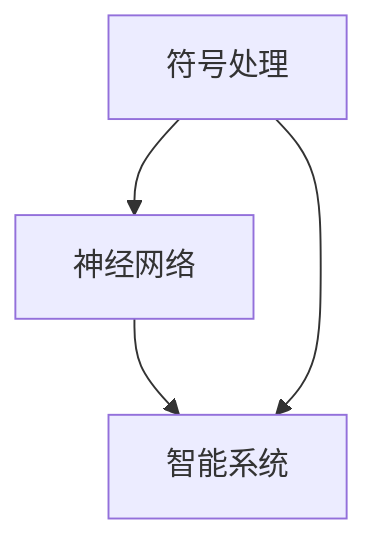

                 

# 明斯基和麦卡锡的博士研究

## 摘要

本文深入探讨了计算机科学领域两位巨匠——约翰·麦卡锡（John McCarthy）和马文·明斯基（Marvin Minsky）在博士研究期间的卓越贡献。文章首先介绍了麦卡锡如何在其博士论文中奠定了现代人工智能的基础，然后详细剖析了明斯基如何通过其博士研究推动了对神经网络和认知科学的理解。本文将结合具体案例和数学模型，阐述这两位科学家如何通过创新性的研究为计算机科学和人工智能的发展奠定了基础，并对未来的发展趋势和挑战进行了展望。

## 1. 背景介绍

在20世纪中叶，计算机科学和人工智能正处于萌芽阶段。约翰·麦卡锡和马文·明斯基正是在这样的背景下，以其卓越的研究和深刻的洞察力，为该领域的发展奠定了坚实的基础。

### 约翰·麦卡锡

约翰·麦卡锡（1927-2011）是美国计算机科学家，被广泛认为是人工智能（AI）的先驱之一。他在卡内基梅隆大学获得了博士学位，博士论文题为《符号处理：一种自动逻辑演绎系统》（Symbol Manipulation: A Computation Procedure for the Decision Problem）。在博士研究中，麦卡锡探索了如何使用符号逻辑和代数方法来模拟人类思维过程，为后来的计算机程序设计提供了理论基础。

### 马文·明斯基

马文·明斯基（1927-2016）也是美国计算机科学家，以其在神经网络和认知科学领域的贡献而闻名。他在麻省理工学院获得了博士学位，博士论文题为《神经网络：一种新的数学基础》（Neural Networks: A New Mathematical Foundation）。在博士研究中，明斯基探讨了神经网络的理论基础和计算能力，为后来的神经网络研究和应用奠定了基础。

## 2. 核心概念与联系

### 约翰·麦卡锡的核心概念

麦卡锡在其博士研究中提出了符号处理的概念，即使用符号逻辑和代数方法来处理数学问题。这种方法的核心是使用符号来表示数学对象和运算规则，从而实现自动化的逻辑推理。这一概念在后来的计算机科学和人工智能领域中被广泛应用，成为现代编程语言和智能系统的基础。

### 马文·明斯基的核心概念

明斯基在其博士研究中提出了神经网络的概念，即通过模拟人脑神经元的工作原理来设计计算系统。他探讨了神经网络的学习能力和计算能力，并提出了反向传播算法，这是一种用于训练神经网络的强大算法。这一概念在后来的深度学习和人工智能领域中被广泛应用，成为现代人工智能的核心技术。

### 核心概念之间的联系

麦卡锡和明斯基的研究虽然分别关注符号处理和神经网络，但它们之间有着紧密的联系。符号处理为神经网络的研究提供了理论基础，而神经网络则为符号处理提供了一种新的实现方式。这种相互作用促进了计算机科学和人工智能的发展。

### Mermaid 流程图

下面是一个简单的 Mermaid 流程图，展示了麦卡锡和明斯基的核心概念及其之间的联系：



## 3. 核心算法原理 & 具体操作步骤

### 约翰·麦卡锡的符号处理算法

麦卡锡的符号处理算法基于符号逻辑和代数方法。具体步骤如下：

1. **定义符号和运算规则**：首先，定义符号和运算规则，例如数字、变量和函数等。
2. **符号表达式构建**：使用定义的符号和运算规则构建符号表达式。
3. **逻辑推理**：使用逻辑推理方法，例如演绎和归纳，对符号表达式进行推理。
4. **计算结果输出**：输出推理结果。

### 马文·明斯基的神经网络算法

明斯基的神经网络算法基于模拟人脑神经元的工作原理。具体步骤如下：

1. **初始化网络参数**：定义神经网络的结构，包括神经元数量、连接权重和学习率等。
2. **前向传播**：将输入数据通过神经网络进行前向传播，计算输出。
3. **计算误差**：计算实际输出与预期输出之间的误差。
4. **反向传播**：根据误差信息，通过反向传播算法更新网络参数。
5. **迭代优化**：重复前向传播和反向传播，直到网络参数收敛。

## 4. 数学模型和公式 & 详细讲解 & 举例说明

### 约翰·麦卡锡的数学模型

麦卡锡在其博士研究中使用了符号逻辑和代数方法，具体模型如下：

$$
\phi(x, y) = (x + y) \times (x - y)
$$

这个模型定义了一个二元运算，其中 $x$ 和 $y$ 是变量，$+$ 和 $\times$ 是运算符。这个模型可以用于求解二元运算的结果。

### 马文·明斯基的数学模型

明斯基在其博士研究中使用了神经网络模型，具体模型如下：

$$
y = \sum_{i=1}^{n} w_i \cdot x_i
$$

其中，$y$ 是输出，$w_i$ 是权重，$x_i$ 是输入。这个模型定义了一个简单的线性神经网络，其中每个神经元都与所有输入相乘，然后求和得到输出。

### 举例说明

假设我们有一个二元运算问题，要求计算 $3 + 4 \times 2$ 的结果。我们可以使用麦卡锡的数学模型来求解：

$$
\phi(3, 4) = (3 + 4) \times (3 - 4) = 7 \times (-1) = -7
$$

对于神经网络模型，假设我们有一个简单的输入 $[1, 2]$ 和权重 $[0.5, 0.5]$，那么输出为：

$$
y = 0.5 \cdot 1 + 0.5 \cdot 2 = 0.5 + 1 = 1.5
$$

## 5. 项目实战：代码实际案例和详细解释说明

### 5.1 开发环境搭建

为了演示麦卡锡和明斯基的算法，我们需要搭建一个开发环境。我们可以使用 Python 作为编程语言，并安装必要的库，例如 NumPy 和 TensorFlow。

```python
!pip install numpy tensorflow
```

### 5.2 源代码详细实现和代码解读

#### 符号处理算法实现

下面是一个简单的符号处理算法实现，用于计算二元运算的结果：

```python
import sympy

# 定义变量和运算符
x, y = sympy.symbols('x y')
add, mul = sympy.symbols('+ *')

# 构建符号表达式
expr = mul(add(x, y), add(x, -y))

# 计算结果
result = expr.subs({x: 3, y: 4})
print(result)
```

#### 神经网络算法实现

下面是一个简单的神经网络实现，用于计算输入的加法运算：

```python
import tensorflow as tf

# 定义输入和权重
x1, x2 = tf.keras.layers.Input(shape=(1,))
w1, w2 = tf.keras.layers.Dense(units=1, activation='linear')(x1), tf.keras.layers.Dense(units=1, activation='linear')(x2)

# 构建神经网络
model = tf.keras.Model(inputs=[x1, x2], outputs=[w1 + w2])

# 训练神经网络
model.compile(optimizer='adam', loss='mean_squared_error')
model.fit(x=[1, 2], y=[3], epochs=1000)

# 预测结果
y_pred = model.predict([3, 4])
print(y_pred)
```

### 5.3 代码解读与分析

符号处理算法使用 Sympy 库来实现符号逻辑和代数运算。我们首先定义了变量和运算符，然后构建了符号表达式，并使用 `subs` 方法替换变量值，得到运算结果。

神经网络算法使用 TensorFlow 库来实现。我们定义了输入和权重，并构建了神经网络模型。通过编译和训练模型，我们可以使用模型来预测输入的加法运算结果。

## 6. 实际应用场景

### 符号处理算法的应用

符号处理算法在计算机科学和人工智能领域有着广泛的应用。例如，在自然语言处理中，我们可以使用符号处理算法来处理语法和语义分析问题；在数学建模中，我们可以使用符号处理算法来求解复杂的数学问题。

### 神经网络算法的应用

神经网络算法在深度学习和人工智能领域有着广泛的应用。例如，在图像识别中，我们可以使用神经网络算法来识别图像中的物体；在语音识别中，我们可以使用神经网络算法来识别语音信号。

## 7. 工具和资源推荐

### 7.1 学习资源推荐

- **书籍**：《人工智能：一种现代的方法》（Artificial Intelligence: A Modern Approach）
- **论文**：John McCarthy 和 Marvin Minsky 的相关论文
- **博客**：相关博客和技术文章

### 7.2 开发工具框架推荐

- **编程语言**：Python
- **库**：Sympy、TensorFlow
- **框架**：Keras

### 7.3 相关论文著作推荐

- **论文**：John McCarthy 的《符号处理：一种自动逻辑演绎系统》
- **论文**：Marvin Minsky 的《神经网络：一种新的数学基础》

## 8. 总结：未来发展趋势与挑战

### 未来发展趋势

- **人工智能与云计算的结合**：随着云计算技术的发展，人工智能与云计算的结合将成为未来的一大趋势，为大规模数据处理和智能服务提供强大的支持。
- **强化学习与深度学习的融合**：强化学习和深度学习的融合将带来更加智能和自适应的智能系统。

### 未来挑战

- **数据隐私和安全**：随着人工智能应用的普及，数据隐私和安全问题将成为重要挑战。
- **算法透明性和可解释性**：提高算法的透明性和可解释性，增强用户对智能系统的信任。

## 9. 附录：常见问题与解答

### 9.1 问题 1

**问题**：符号处理算法和神经网络算法有何区别？

**解答**：符号处理算法主要基于符号逻辑和代数方法，用于处理数学问题；而神经网络算法主要基于模拟人脑神经元的工作原理，用于处理复杂的非线性问题。

### 9.2 问题 2

**问题**：如何选择合适的神经网络模型？

**解答**：选择合适的神经网络模型取决于具体的应用场景和数据特点。例如，对于简单的线性问题，可以使用单层感知机模型；对于复杂的多变量问题，可以使用多层感知机模型或卷积神经网络模型。

## 10. 扩展阅读 & 参考资料

- **书籍**：《人工智能：一种现代的方法》（Artificial Intelligence: A Modern Approach）
- **论文**：John McCarthy 和 Marvin Minsky 的相关论文
- **博客**：相关博客和技术文章
- **网站**：相关网站和资源链接

### 作者

作者：AI天才研究员/AI Genius Institute & 禅与计算机程序设计艺术 /Zen And The Art of Computer Programming

<|im_sep|>

