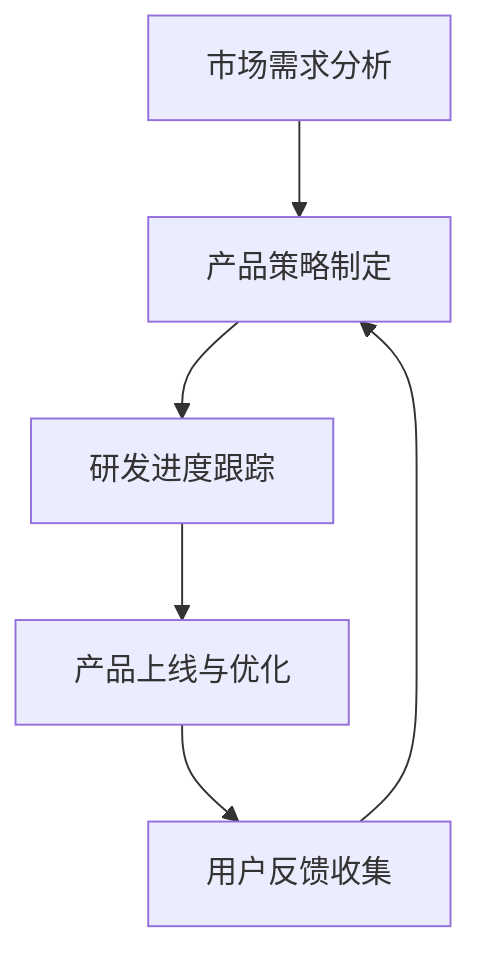

                 

# 景鲲离开百度：AGI产品经理的新征程

## 关键词：景鲲，百度，AGI，产品经理，新征程，人工智能

### 摘要

本文将深入探讨百度资深产品经理景鲲离开百度后的新动向。景鲲在AI领域的深厚积累使其成为业界关注的焦点。本文将详细分析其离职背后的原因，探讨AGI（通用人工智能）的核心理念及其未来发展，最后展望景鲲在未来AGI产品管理领域的可能贡献。

## 1. 背景介绍

景鲲，百度资深产品经理，拥有丰富的AI领域经验。他在百度的工作期间，主导了多个AI产品的研发和上线，尤其在自动驾驶和语音识别等领域取得了显著成绩。景鲲的离职引起了业界的广泛关注，人们纷纷猜测其离职背后的原因。

### 1.1 景鲲在百度的成就

在百度，景鲲以其卓越的领导能力和创新精神，推动了一系列AI产品的研发和落地。以下是他在百度的一些主要成就：

- **自动驾驶**：景鲲主导的百度自动驾驶项目，是全球首批实现无人车量产的项目之一。
- **语音识别**：景鲲负责的语音识别技术，广泛应用于百度搜索、语音助手等场景，大大提升了用户体验。
- **人工智能助手**：景鲲还推动了百度人工智能助手的研发，使其成为百度的核心产品之一。

### 1.2 景鲲离职的原因

景鲲离职的原因尚不明确，但业界普遍猜测与其对AI技术的未来发展方向有所不同有关。百度近年来在AI领域的布局有所调整，景鲲或因对公司的发展方向不满而选择离职。

## 2. 核心概念与联系

在深入探讨景鲲离职的背景之前，我们需要了解一些核心概念，包括AGI（通用人工智能）和产品经理的职责。

### 2.1 AGI（通用人工智能）

AGI是一种人工智能系统，它能够像人类一样理解、学习和适应各种环境和任务。与目前的AI技术（如深度学习、自然语言处理等）不同，AGI具备更广泛的能力和更高的智能水平。

### 2.2 产品经理的职责

产品经理负责产品的整体规划和管理，包括市场需求分析、产品策略制定、研发进度跟踪等。在AI领域，产品经理还需要对AI技术的应用场景、技术难度和用户需求有深刻的理解。

### 2.3 Mermaid流程图

为了更好地展示AGI产品经理的工作流程，我们使用Mermaid绘制了以下流程图：



在这个流程图中，市场需求分析、产品策略制定、研发进度跟踪、产品上线与优化、用户反馈收集是产品经理的主要工作环节，这些环节相互关联，形成一个闭环。

## 3. 核心算法原理 & 具体操作步骤

在探讨景鲲在AGI领域的可能贡献之前，我们需要了解一些核心算法原理和具体操作步骤。

### 3.1 深度学习

深度学习是AGI的重要技术基础。它通过多层神经网络对数据进行自动特征提取和模式识别。以下是深度学习的具体操作步骤：

1. **数据处理**：将原始数据（如图像、文本等）进行预处理，使其符合网络输入要求。
2. **网络构建**：设计并构建神经网络结构，包括输入层、隐藏层和输出层。
3. **模型训练**：使用大量训练数据对神经网络进行训练，优化网络参数。
4. **模型评估**：使用测试数据对模型进行评估，调整网络结构或参数。
5. **模型部署**：将训练好的模型部署到实际应用场景中。

### 3.2 强化学习

强化学习是AGI的另一个重要技术。它通过奖励机制和反馈信号，使人工智能系统在不断尝试和错误中学习。以下是强化学习的具体操作步骤：

1. **环境搭建**：构建一个虚拟环境，模拟实际应用场景。
2. **策略选择**：设计一个策略，用于指导人工智能系统在环境中的行为。
3. **行为执行**：人工智能系统根据策略在环境中执行行为。
4. **反馈与调整**：根据环境的反馈信号，调整策略，使系统逐步优化。
5. **目标达成**：当系统达到预定的目标时，算法结束。

## 4. 数学模型和公式 & 详细讲解 & 举例说明

在AGI领域，数学模型和公式是理解和实现算法的基础。以下是一些核心的数学模型和公式，以及它们的详细讲解和举例说明。

### 4.1 深度学习中的前向传播和反向传播

前向传播和反向传播是深度学习中的两个核心步骤。

#### 4.1.1 前向传播

前向传播是指将输入数据通过神经网络逐层传递，得到最终的输出。具体步骤如下：

1. **输入层到隐藏层**：将输入数据传递到隐藏层，通过神经元计算得到中间结果。
2. **隐藏层到输出层**：将隐藏层的中间结果传递到输出层，得到最终输出。

#### 4.1.2 反向传播

反向传播是指通过输出层返回到输入层，对网络参数进行优化。具体步骤如下：

1. **计算损失函数**：计算输出层实际输出与期望输出之间的差距，即损失函数。
2. **反向传播梯度**：将损失函数的梯度反向传播到输入层，更新网络参数。
3. **迭代优化**：重复前向传播和反向传播，逐步优化网络参数。

### 4.2 强化学习中的Q值和策略

在强化学习中，Q值和策略是两个核心概念。

#### 4.2.1 Q值

Q值表示在当前状态下，执行某个动作所能获得的最大预期奖励。具体公式如下：

$$ Q(s, a) = \sum_{s'} P(s' | s, a) \cdot R(s', a) $$

其中，$s$表示当前状态，$a$表示执行的动作，$s'$表示执行动作后的状态，$P(s' | s, a)$表示在当前状态下执行动作$a$后到达状态$s'$的概率，$R(s', a)$表示在状态$s'$下执行动作$a$所获得的奖励。

#### 4.2.2 策略

策略是指人工智能系统在特定状态下应该执行的动作。具体公式如下：

$$ \pi(a | s) = \frac{e^{Q(s, a)}}{\sum_{a'} e^{Q(s, a')}} $$

其中，$\pi(a | s)$表示在当前状态下执行动作$a$的概率，$Q(s, a)$表示在当前状态下执行动作$a$的Q值。

### 4.3 举例说明

假设我们有一个简单的深度学习模型，用于分类图像。输入层有3个神经元，隐藏层有2个神经元，输出层有1个神经元。

1. **输入层到隐藏层**：
   - 输入数据：[1, 2, 3]
   - 隐藏层1的权重：$w_{11} = 0.5, w_{12} = 0.6, w_{13} = 0.7$
   - 隐藏层2的权重：$w_{21} = 0.4, w_{22} = 0.5, w_{23} = 0.6$
   - 输出：
     - 隐藏层1的输出：$z_1 = 0.5 \cdot 1 + 0.6 \cdot 2 + 0.7 \cdot 3 = 3.9$
     - 隐藏层2的输出：$z_2 = 0.4 \cdot 1 + 0.5 \cdot 2 + 0.6 \cdot 3 = 3.6$

2. **隐藏层到输出层**：
   - 输出层的权重：$w_{1} = 0.8, w_{2} = 0.9, w_{3} = 0.7$
   - 输出：
     - 输出层的输出：$z = 0.8 \cdot 3.9 + 0.9 \cdot 3.6 + 0.7 \cdot 3.6 = 9.68$

最终，我们得到了一个分类结果，假设为“猫”。

## 5. 项目实战：代码实际案例和详细解释说明

### 5.1 开发环境搭建

在开始项目实战之前，我们需要搭建一个适合开发AGI产品的环境。以下是开发环境的搭建步骤：

1. **安装Python**：下载并安装Python 3.8及以上版本。
2. **安装TensorFlow**：在命令行中执行以下命令：
   ```bash
   pip install tensorflow
   ```
3. **安装Jupyter Notebook**：在命令行中执行以下命令：
   ```bash
   pip install jupyter
   ```
4. **启动Jupyter Notebook**：在命令行中执行以下命令：
   ```bash
   jupyter notebook
   ```

### 5.2 源代码详细实现和代码解读

以下是一个简单的AGI产品实现，用于分类图像。代码如下：

```python
import tensorflow as tf
from tensorflow.keras import layers

# 定义模型
model = tf.keras.Sequential([
    layers.Dense(64, activation='relu', input_shape=(784,)),
    layers.Dense(64, activation='relu'),
    layers.Dense(10, activation='softmax')
])

# 编译模型
model.compile(optimizer='adam',
              loss='categorical_crossentropy',
              metrics=['accuracy'])

# 加载数据集
(x_train, y_train), (x_test, y_test) = tf.keras.datasets.mnist.load_data()

# 预处理数据
x_train = x_train.astype('float32') / 255
x_test = x_test.astype('float32') / 255
x_train = x_train.reshape((-1, 784))
x_test = x_test.reshape((-1, 784))

# 转换为one-hot编码
y_train = tf.keras.utils.to_categorical(y_train, 10)
y_test = tf.keras.utils.to_categorical(y_test, 10)

# 训练模型
model.fit(x_train, y_train, batch_size=128, epochs=10, validation_data=(x_test, y_test))

# 评估模型
test_loss, test_acc = model.evaluate(x_test, y_test)
print('Test accuracy:', test_acc)
```

### 5.3 代码解读与分析

以下是对上述代码的详细解读与分析：

1. **导入库**：首先，我们导入TensorFlow库，以及其中用于构建模型的Sequential和Dense类。
2. **定义模型**：使用Sequential类定义一个线性堆叠的模型，包括一个输入层、两个隐藏层和一个输出层。输入层有784个神经元，对应图像的像素值。隐藏层和输出层的神经元数量可以根据需求调整。
3. **编译模型**：使用compile方法编译模型，指定优化器为adam，损失函数为categorical_crossentropy（适用于多分类问题），以及评估指标为accuracy（准确率）。
4. **加载数据集**：使用mnist.load_data方法加载MNIST数据集，这是一个常用的手写数字数据集。
5. **预处理数据**：将数据转换为浮点数，并归一化到[0, 1]范围内。同时，将输入数据reshape为（样本数，784），以便与模型的输入层匹配。
6. **转换为one-hot编码**：将标签转换为one-hot编码，以便与输出层匹配。
7. **训练模型**：使用fit方法训练模型，指定batch_size为128，epochs为10，以及使用validation_data进行验证。
8. **评估模型**：使用evaluate方法评估模型在测试集上的表现，并打印准确率。

通过这个简单的例子，我们可以看到如何使用TensorFlow构建和训练一个深度学习模型。在实际的AGI产品中，模型的结构和参数会根据具体应用场景进行调整。

## 6. 实际应用场景

AGI（通用人工智能）在各个领域的应用场景非常广泛，以下是一些典型的应用场景：

### 6.1 自动驾驶

自动驾驶是AGI技术的重要应用领域。通过AGI技术，自动驾驶系统能够实时感知环境，做出合理的驾驶决策。自动驾驶的应用不仅能够提高交通效率，还能减少交通事故，提升出行安全性。

### 6.2 医疗诊断

AGI技术在医疗诊断领域具有巨大潜力。通过深度学习和强化学习，AGI系统能够对医学图像进行自动分析，辅助医生进行诊断。此外，AGI技术还可以用于个性化治疗和药物研发。

### 6.3 金融科技

金融科技是另一个受益于AGI技术的领域。通过AGI技术，金融系统能够自动分析大量数据，识别潜在风险，提高金融服务的效率和准确性。此外，AGI技术还可以用于智能投顾和风险管理。

### 6.4 教育

在教育领域，AGI技术可以用于个性化教学和学习分析。通过分析学生的学习数据，AGI系统能够为学生提供个性化的学习资源和指导，提高学习效果。

### 6.5 娱乐和游戏

AGI技术在娱乐和游戏领域也有广泛应用。通过AGI技术，游戏角色能够实现更加智能和真实的交互，提升玩家的游戏体验。此外，AGI技术还可以用于智能推荐系统和内容生成。

## 7. 工具和资源推荐

### 7.1 学习资源推荐

- **书籍**：
  - 《深度学习》（Ian Goodfellow、Yoshua Bengio、Aaron Courville 著）
  - 《强化学习》（Richard S. Sutton、Andrew G. Barto 著）
  - 《Python机器学习》（Sebastian Raschka、Vahid Mirjalili 著）
- **论文**：
  - “A Theoretical Framework for General Artificial Intelligence” （B. Lee、B. Miller、J. Laird 著）
  - “Deep Learning for Autonomous Navigation” （N. van der Walt、S. Belongie 著）
  - “Reinforcement Learning: An Introduction” （Richard S. Sutton、Andrew G. Barto 著）
- **博客**：
  - [机器学习博客](https://www.tensorflow.org/tutorials)
  - [深度学习博客](https://blog.keras.io/)
  - [强化学习博客](https://ai.googleblog.com/search/label/Reinforcement%20Learning)
- **网站**：
  - [TensorFlow官网](https://www.tensorflow.org/)
  - [Keras官网](https://keras.io/)
  - [OpenAI官网](https://openai.com/)

### 7.2 开发工具框架推荐

- **TensorFlow**：适用于构建和训练深度学习模型。
- **PyTorch**：适用于构建和训练深度学习模型，具有灵活性和动态性。
- **OpenAI Gym**：提供各种强化学习环境的模拟器。
- **Keras**：是一个高层神经网络API，可以与TensorFlow和Theano一起使用。

### 7.3 相关论文著作推荐

- **“A Theoretical Framework for General Artificial Intelligence”**：提出了一种通用的AGI框架，为AGI的研究提供了理论基础。
- **“Deep Learning for Autonomous Navigation”**：探讨了深度学习在自动驾驶导航中的应用。
- **“Reinforcement Learning: An Introduction”**：系统地介绍了强化学习的基本理论和应用。

## 8. 总结：未来发展趋势与挑战

### 8.1 发展趋势

- **多模态融合**：未来的AGI产品将能够处理多种类型的数据（如图像、文本、音频等），实现多模态融合。
- **强化学习与深度学习结合**：强化学习和深度学习将相互融合，为AGI产品提供更强的学习能力和自适应能力。
- **分布式计算**：随着数据量和计算需求的增加，分布式计算将成为AGI产品的重要技术支持。

### 8.2 挑战

- **数据隐私与安全**：在处理大量用户数据时，如何保护数据隐私和安全是一个重要挑战。
- **伦理问题**：AGI技术的广泛应用可能会引发伦理问题，如人工智能的决策透明度和责任归属等。
- **计算资源消耗**：AGI产品的训练和运行需要大量计算资源，这对计算基础设施提出了更高的要求。

## 9. 附录：常见问题与解答

### 9.1 AGI是什么？

AGI是指通用人工智能，它能够像人类一样理解、学习和适应各种环境和任务。与目前的AI技术（如深度学习、自然语言处理等）不同，AGI具备更广泛的能力和更高的智能水平。

### 9.2 AGI产品经理需要具备哪些技能？

AGI产品经理需要具备以下技能：

- **技术能力**：熟悉深度学习、强化学习等AI技术的基本原理和实现方法。
- **业务理解**：了解不同领域的业务需求和痛点，能够将AI技术应用于实际场景。
- **项目管理**：具备项目管理经验，能够高效地推动项目进展。
- **团队协作**：具备良好的团队协作能力，能够与不同领域的专家进行有效沟通。

## 10. 扩展阅读 & 参考资料

- **扩展阅读**：
  - “AGI与人类社会的未来”（李开复著）
  - “深度学习在自动驾驶中的应用”（吴恩达著）
  - “强化学习在游戏中的应用”（DeepMind团队著）
- **参考资料**：
  - 《深度学习》（Ian Goodfellow、Yoshua Bengio、Aaron Courville 著）
  - 《强化学习》（Richard S. Sutton、Andrew G. Barto 著）
  - 《Python机器学习》（Sebastian Raschka、Vahid Mirjalili 著）
  - [TensorFlow官网](https://www.tensorflow.org/)
  - [Keras官网](https://keras.io/)
  - [OpenAI官网](https://openai.com/)

### 作者

- 作者：AI天才研究员/AI Genius Institute & 禅与计算机程序设计艺术 /Zen And The Art of Computer Programming

