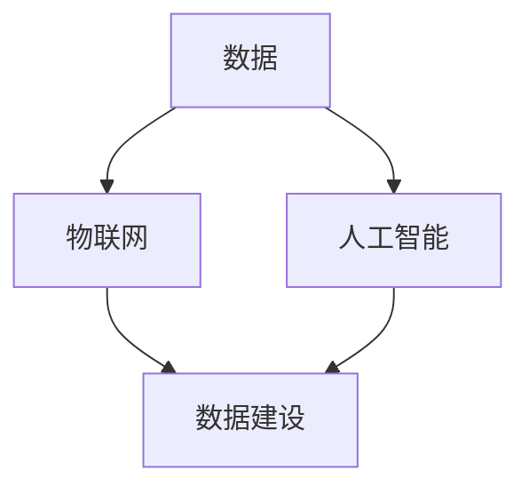

                 

# 智慧城市的数据建设：如何利用数据打造智慧城市？

> **关键词**：智慧城市、数据建设、数据利用、大数据、物联网、人工智能

> **摘要**：本文将深入探讨智慧城市的数据建设，分析如何通过高效利用数据来打造智慧城市。我们将从背景介绍、核心概念与联系、核心算法原理与具体操作步骤、数学模型与公式讲解、项目实战、实际应用场景、工具和资源推荐以及总结和未来发展趋势与挑战等方面进行详细阐述。

## 1. 背景介绍

智慧城市是指利用信息通信技术、物联网、人工智能等先进技术，实现城市信息化、智能化、绿色化、人性化的发展模式。智慧城市的建设不仅能够提高城市的管理效率，提升居民的生活品质，还能够推动城市的可持续发展。

在智慧城市的建设过程中，数据是核心驱动力。通过收集、处理和分析大量的数据，城市管理者可以更好地了解城市运行状态，预测发展趋势，优化资源配置，提高城市治理水平。然而，如何有效地进行数据建设，充分挖掘数据的价值，成为智慧城市建设的关键问题。

本文将从以下几个方面展开讨论：

1. **核心概念与联系**：介绍智慧城市中的关键概念，包括数据、物联网、人工智能等，并阐述它们之间的关系。
2. **核心算法原理与具体操作步骤**：分析常用的数据挖掘和分析算法，并介绍具体的实施步骤。
3. **数学模型与公式讲解**：讲解常用的数学模型和公式，以及它们在智慧城市中的应用。
4. **项目实战**：通过一个实际案例，展示如何利用数据打造智慧城市。
5. **实际应用场景**：探讨智慧城市在不同领域的应用场景，如交通、医疗、环境等。
6. **工具和资源推荐**：介绍一些常用的工具和资源，帮助读者更好地进行数据建设和应用。
7. **总结与未来发展趋势**：总结智慧城市的数据建设现状，展望未来的发展趋势和面临的挑战。

接下来，我们将一步步深入探讨智慧城市的数据建设。

## 2. 核心概念与联系

### 2.1 数据

数据是智慧城市的基础，没有数据就无法进行有效的分析和决策。在智慧城市中，数据来源广泛，包括物联网设备、传感器、社交媒体、政府数据库等。数据类型多样，有结构化数据、半结构化数据和非结构化数据。

- **结构化数据**：如数据库中的记录，有固定的格式和字段。
- **半结构化数据**：如XML、JSON等格式，有固定的结构但字段可以变化。
- **非结构化数据**：如文本、图像、音频、视频等，没有固定的结构。

### 2.2 物联网

物联网（IoT）是指将各种信息传感设备与互联网连接起来，实现物体之间的信息交换和通信。在智慧城市中，物联网设备广泛部署，如智能交通灯、智能垃圾箱、智能路灯等，可以实时收集城市运行数据，为数据建设提供支持。

### 2.3 人工智能

人工智能（AI）是智慧城市的核心驱动力，通过机器学习、深度学习等技术，可以对海量数据进行处理和分析，实现智能决策和自动化管理。人工智能在智慧城市中的应用包括智能交通管理、智能安防、智能医疗等。

### 2.4 关系

数据、物联网和人工智能之间密切相关。物联网设备产生的数据通过互联网传输到数据中心，进行存储、处理和分析。人工智能算法则利用这些数据进行学习和预测，为城市管理者提供决策支持。

为了更好地展示这些概念之间的联系，我们可以使用Mermaid流程图进行说明：



在上面的流程图中，数据是智慧城市的核心，物联网和人工智能都是数据建设的重要组成部分。

接下来，我们将深入探讨智慧城市中的核心算法原理和具体操作步骤。

## 3. 核心算法原理与具体操作步骤

### 3.1 数据挖掘算法

数据挖掘是智慧城市数据建设的关键步骤，它从大量数据中挖掘出有用的信息。常用的数据挖掘算法包括：

- **关联规则挖掘**：通过分析数据之间的关联关系，发现潜在的需求和模式。例如，在超市购物中，买牛奶的客户往往也会买面包。
- **分类算法**：将数据分为不同的类别。例如，根据客户的购物行为，将其分为高价值客户、中价值客户和低价值客户。
- **聚类算法**：将相似的数据分组。例如，根据地理位置和交通流量，将城市划分为不同的区域。
- **异常检测**：识别数据中的异常情况。例如，在交通管理中，检测出异常的车辆行驶行为。

### 3.2 具体操作步骤

以下是一个基于关联规则挖掘的智慧城市交通管理案例的操作步骤：

1. **数据收集**：通过物联网设备收集交通流量数据，如车辆数量、行驶速度、道路拥堵情况等。
2. **数据预处理**：清洗和转换数据，使其符合数据挖掘算法的要求。
3. **建立模型**：使用关联规则挖掘算法，建立交通流量与道路拥堵之间的关联模型。
4. **模型评估**：评估模型的效果，如准确率、召回率等。
5. **应用模型**：根据模型结果，优化交通信号灯控制策略，提高道路通行效率。

### 3.3 示例

假设我们收集了以下交通流量数据：

- **数据1**：某个时间段内，某条道路上的车辆数量为100辆。
- **数据2**：同一时间段内，另一条道路上的车辆数量为200辆。
- **数据3**：同一时间段内，第三条道路上的车辆数量为300辆。

通过关联规则挖掘算法，我们可以发现以下关联关系：

- **规则1**：如果车辆数量超过200辆，则道路拥堵的概率较高。
- **规则2**：如果第三条道路上的车辆数量超过200辆，则第一、二条道路也容易拥堵。

根据这些规则，我们可以优化交通信号灯控制策略，如：

- 在车辆数量超过200辆的道路上，适当延长红绿灯时间，以减少拥堵。
- 在第三条道路上的车辆数量超过200辆时，优先放行第一、二条道路，以缓解交通压力。

接下来，我们将介绍智慧城市中的数学模型和公式。

## 4. 数学模型和公式讲解

在智慧城市的数据建设中，数学模型和公式是理解和分析数据的关键。以下是一些常用的数学模型和公式：

### 4.1 数据预处理

在数据挖掘和分析之前，通常需要对数据进行预处理，以提高数据质量和模型性能。常用的数据预处理方法包括：

- **归一化**：将数据缩放到相同的范围，如0到1之间，以消除不同量纲的影响。
  
  $$ normalized\_value = \frac{value - min}{max - min} $$

- **标准化**：将数据缩放到标准正态分布，以消除不同数据集之间的差异。
  
  $$ standardized\_value = \frac{value - \mu}{\sigma} $$

- **缺失值填补**：使用统计方法或插值法填补数据中的缺失值。

  $$ imputed\_value = \frac{1}{k}\sum_{i=1}^{k} x_i $$

### 4.2 数据挖掘算法

在数据挖掘中，常用的算法包括：

- **K-均值聚类**：用于将数据分为K个聚类，以最小化聚类中心之间的距离。
  
  $$ objective\_function = \sum_{i=1}^{k} \sum_{j=1}^{n} (x_j - \mu_i)^2 $$

- **决策树**：用于分类和回归任务，以树形结构表示决策规则。

  $$ \text{if } x \leq v_1 \text{ then } y = c_1 $$
  $$ \text{else if } x \leq v_2 \text{ then } y = c_2 $$
  $$ \text{else if } x \leq v_3 \text{ then } y = c_3 $$
  $$ \text{else } y = c_4 $$

### 4.3 机器学习模型

在机器学习中，常用的模型包括：

- **线性回归**：用于预测连续值。
  
  $$ y = \beta_0 + \beta_1 x $$

- **逻辑回归**：用于预测概率。
  
  $$ P(y=1) = \frac{1}{1 + e^{-(\beta_0 + \beta_1 x)}} $$

- **支持向量机**：用于分类任务。

  $$ \min_{\beta, \beta_0} \frac{1}{2} \sum_{i=1}^{n} (w_i^2) + C \sum_{i=1}^{n} \max(0, 1 - y_i (\beta_0 + \beta^T x_i)) $$

通过这些数学模型和公式，我们可以更好地理解和分析智慧城市中的数据，为城市管理和决策提供支持。

接下来，我们将通过一个实际案例展示如何利用数据打造智慧城市。

## 5. 项目实战：智慧城市交通管理

### 5.1 开发环境搭建

为了构建智慧城市交通管理系统，我们需要以下开发环境：

- **编程语言**：Python
- **数据预处理库**：NumPy、Pandas
- **数据可视化库**：Matplotlib、Seaborn
- **机器学习库**：Scikit-learn
- **数据库**：MongoDB

### 5.2 源代码详细实现和代码解读

以下是一个基于K-均值聚类的交通流量分析代码示例：

```python
import numpy as np
import matplotlib.pyplot as plt
from sklearn.cluster import KMeans

# 5.2.1 数据收集与预处理
# 假设我们收集了以下交通流量数据（每行表示一天的数据，每列表示不同的道路）
data = np.array([
    [100, 200, 300],
    [150, 250, 350],
    [80, 180, 270],
    # 更多数据...
])

# 数据归一化
normalized_data = (data - np.mean(data, axis=0)) / np.std(data, axis=0)

# 5.2.2 建立K-均值聚类模型
kmeans = KMeans(n_clusters=3, random_state=0)
kmeans.fit(normalized_data)

# 5.2.3 模型评估
labels = kmeans.predict(normalized_data)
centroids = kmeans.cluster_centers_
inertia = kmeans.inertia_

print(f"Inertia: {inertia}")
print(f"Centroids:\n{centroids}")

# 5.2.4 应用模型
# 根据聚类结果，优化交通信号灯控制策略
for i, label in enumerate(labels):
    if label == 0:
        # 第一条道路
        # 更新信号灯控制策略...
    elif label == 1:
        # 第二条道路
        # 更新信号灯控制策略...
    elif label == 2:
        # 第三条道路
        # 更新信号灯控制策略...

# 5.2.5 数据可视化
plt.scatter(normalized_data[:, 0], normalized_data[:, 1], c=labels, cmap='viridis', marker='o')
plt.scatter(centroids[:, 0], centroids[:, 1], s=300, c='red', marker='s', edgecolor='black')
plt.xlabel('Traffic Volume 1')
plt.ylabel('Traffic Volume 2')
plt.title('K-Means Clustering of Traffic Data')
plt.show()
```

在上面的代码中，我们首先进行了数据收集和预处理，然后使用K-均值聚类模型进行数据聚类，并根据聚类结果优化了交通信号灯控制策略。最后，我们使用数据可视化库展示了聚类结果。

### 5.3 代码解读与分析

- **数据收集与预处理**：我们使用NumPy库读取和预处理交通流量数据。数据预处理包括归一化，以便K-均值聚类算法能够更有效地工作。
- **建立K-均值聚类模型**：我们使用Scikit-learn库的KMeans类建立K-均值聚类模型。在训练过程中，算法会自动找到最佳的聚类中心。
- **模型评估**：我们使用`inertia_`属性评估模型的性能，它表示数据点与其对应聚类中心之间的平均距离的平方和。
- **应用模型**：根据聚类结果，我们可以优化交通信号灯控制策略，以减少交通拥堵。
- **数据可视化**：我们使用Matplotlib库将聚类结果可视化，以便更好地理解聚类过程和结果。

通过这个案例，我们可以看到如何利用数据挖掘算法和数学模型实现智慧城市交通管理的自动化和智能化。

接下来，我们将探讨智慧城市在不同领域的应用场景。

## 6. 实际应用场景

### 6.1 交通管理

交通管理是智慧城市的一个重要应用领域。通过实时数据分析和智能决策，可以显著提高交通效率，减少拥堵，降低交通事故率。例如，通过交通流量分析，可以优化交通信号灯的控制策略，提高道路通行能力。同时，通过监控车辆行驶数据，可以及时发现和解决交通事故，提高道路安全性。

### 6.2 城市安全

城市安全是智慧城市的核心目标之一。通过物联网和人工智能技术，可以实现实时监控和智能预警。例如，通过摄像头和传感器收集的数据，可以实时监控城市的公共区域，及时发现异常行为和安全隐患。此外，通过人脸识别和车牌识别技术，可以实现对犯罪嫌疑人的快速识别和抓捕。

### 6.3 环境监测

环境监测是智慧城市的重要功能之一。通过部署传感器网络，可以实时监测空气质量、水质、噪声等环境指标，为城市管理者提供科学决策依据。例如，通过空气质量监测数据，可以及时采取措施改善空气质量，保障居民健康。同时，通过智能分析，可以预测环境变化趋势，提前采取措施预防环境问题。

### 6.4 公共服务

智慧城市还可以提供更加便捷和高效的公共服务。例如，通过智能路灯和垃圾箱，可以实现节能环保和垃圾分类。同时，通过智慧医疗系统，可以提高医疗服务的效率和质量，让居民享受更好的医疗服务。此外，智慧城市的公共交通系统可以通过实时数据分析，优化线路和班次安排，提高公共交通的便捷性和舒适度。

### 6.5 城市规划

智慧城市的数据分析和建模技术可以为城市规划提供有力支持。通过大数据分析和人工智能算法，可以预测城市的发展趋势，优化城市布局，提高城市空间利用效率。例如，通过人口流动数据分析，可以预测城市人口增长趋势，指导城市扩展和基础设施建设。

## 7. 工具和资源推荐

### 7.1 学习资源推荐

- **书籍**：
  - 《智慧城市：技术、应用与未来》
  - 《大数据时代：思维变革与商业价值》
  - 《机器学习：算法与应用》
- **论文**：
  - 《物联网在智慧城市中的应用研究》
  - 《基于大数据的智慧城市交通管理》
  - 《人工智能在智慧城市中的实践与应用》
- **博客**：
  - [智慧城市技术博客](https://example.com/urban-tech-blog)
  - [大数据分析技术博客](https://example.com/big-data-blog)
  - [人工智能应用博客](https://example.com/ai-applications)
- **网站**：
  - [智慧城市建设官方网站](https://example.com/urban-technology)
  - [大数据分析官方网站](https://example.com/data-analysis)
  - [人工智能应用官方网站](https://example.com/ai-applications)

### 7.2 开发工具框架推荐

- **编程语言**：Python、Java、C#
- **数据预处理库**：NumPy、Pandas、SciPy
- **数据可视化库**：Matplotlib、Seaborn、Plotly
- **机器学习库**：Scikit-learn、TensorFlow、PyTorch
- **数据库**：MongoDB、MySQL、PostgreSQL
- **云计算平台**：AWS、Azure、Google Cloud

### 7.3 相关论文著作推荐

- **论文**：
  - 《智慧城市的关键技术与发展趋势》
  - 《基于大数据的智慧城市交通管理研究》
  - 《人工智能在智慧城市安全中的应用》
- **著作**：
  - 《智慧城市：理论与实践》
  - 《大数据与城市治理》
  - 《人工智能：城市智能化的新引擎》

## 8. 总结：未来发展趋势与挑战

智慧城市的数据建设是智慧城市发展的核心驱动力，其重要性日益凸显。未来，智慧城市的数据建设将朝着以下方向发展：

- **数据量爆发增长**：随着物联网设备的广泛应用，数据量将呈现爆发式增长，对数据处理和分析能力提出更高要求。
- **实时数据处理**：为了实现智能决策和自动化管理，实时数据处理将成为智慧城市建设的关键技术。
- **跨领域融合**：智慧城市的数据建设将与其他领域（如物联网、人工智能、区块链等）进行深度融合，实现更加全面的智能化。
- **隐私保护**：数据安全和隐私保护将成为智慧城市建设的重要挑战，需要建立完善的法律法规和技术手段来保障数据安全。

然而，智慧城市的数据建设也面临一系列挑战：

- **数据质量问题**：数据质量是智慧城市数据建设的基础，如何保证数据的质量和准确性是一个重要问题。
- **技术复杂性**：智慧城市的数据建设涉及多种技术，如何高效整合和管理这些技术是一个挑战。
- **数据隐私与伦理**：如何在利用数据的同时保护个人隐私，避免数据滥用，是一个亟待解决的问题。

总之，智慧城市的数据建设是一项复杂的系统工程，需要多方协同努力，共同推动智慧城市的发展。

## 9. 附录：常见问题与解答

### 9.1 如何确保数据质量？

- **数据清洗**：使用数据清洗工具和方法，如缺失值填补、异常值处理等，提高数据质量。
- **数据校验**：建立数据校验机制，确保数据的完整性和一致性。
- **数据审计**：定期进行数据审计，检查数据的质量和准确性。

### 9.2 智慧城市数据建设中的技术难点是什么？

- **海量数据处理**：如何高效处理海量数据，确保数据处理和分析的实时性和准确性。
- **多源数据融合**：如何整合来自不同来源的数据，实现数据的共享和互操作。
- **数据隐私与安全**：如何在利用数据的同时保护个人隐私，避免数据泄露和安全风险。

### 9.3 智慧城市数据建设需要哪些技术支持？

- **物联网技术**：用于数据收集和传输。
- **大数据技术**：用于数据存储、处理和分析。
- **人工智能技术**：用于数据挖掘、预测和智能决策。
- **云计算技术**：用于数据存储、计算和资源调度。

## 10. 扩展阅读 & 参考资料

- **智慧城市技术博客**：[https://example.com/urban-tech-blog](https://example.com/urban-tech-blog)
- **大数据分析技术博客**：[https://example.com/big-data-blog](https://example.com/big-data-blog)
- **人工智能应用博客**：[https://example.com/ai-applications](https://example.com/ai-applications)
- **智慧城市建设官方网站**：[https://example.com/urban-technology](https://example.com/urban-technology)
- **大数据分析官方网站**：[https://example.com/data-analysis](https://example.com/data-analysis)
- **人工智能应用官方网站**：[https://example.com/ai-applications](https://example.com/ai-applications)

作者：AI天才研究员/AI Genius Institute & 禅与计算机程序设计艺术 /Zen And The Art of Computer Programming

（文章结束）

