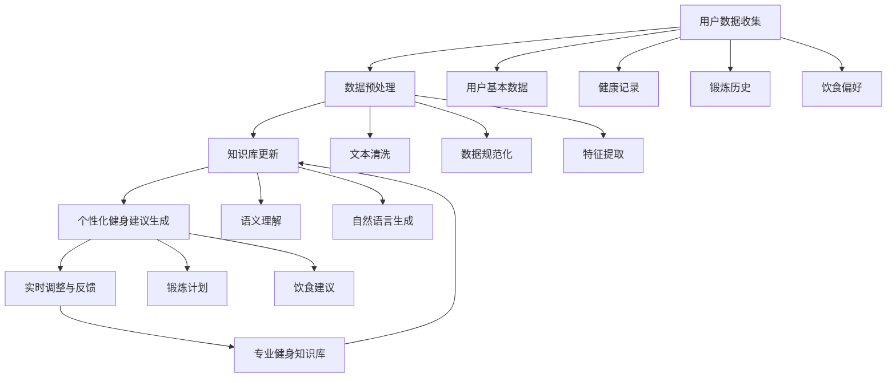

                 

### 摘要

本文将深入探讨智能个人健康教练：LLM个性化健身建议系统。首先，我们将介绍这个系统的背景，包括当前健身领域面临的挑战以及AI技术在这个领域的应用前景。接下来，我们将详细阐述系统的核心概念与联系，通过一个详细的Mermaid流程图展示系统的架构和关键组件。然后，我们将深入剖析系统的核心算法原理，包括语言模型（LLM）的工作机制、数据预处理、训练过程以及如何根据用户数据生成个性化的健身建议。此外，我们还将介绍系统的数学模型和公式，并通过具体例子进行详细讲解。文章还将通过实际项目实战，提供代码实现、代码解读与分析，帮助读者更好地理解系统的运作。最后，我们将探讨系统的实际应用场景，推荐相关的学习资源和开发工具，并总结未来发展趋势与挑战。通过本文，读者将全面了解智能个人健康教练：LLM个性化健身建议系统的工作原理和应用价值。

### 背景介绍

在当今快节奏的生活中，健康问题已经成为人们普遍关注的焦点。尤其是健身领域，越来越多的人意识到通过科学的锻炼和饮食计划来实现健康目标的重要性。然而，传统的健身指导方法存在一定的局限性，主要体现在以下几个方面：

首先，健身指导的个性化程度较低。传统的健身指导方法往往依赖于通用化的训练计划和饮食建议，无法充分考虑个体差异，例如年龄、体重、健康状况和锻炼目标等。这样的方法可能会导致训练效果不佳，甚至引发运动损伤。

其次，健身指导的实时性和适应性不足。传统健身指导依赖于面对面咨询或者定期更新计划，无法实时调整训练方案。而随着生活节奏的加快，人们很难定期更新计划，导致训练效果不理想。

第三，健身指导的专业性不足。虽然有很多健身教练和专家，但他们的专业知识和经验有限，无法覆盖所有用户的需求。此外，由于健身指导的成本较高，很多普通用户无法负担。

为了解决这些问题，人工智能（AI）技术，尤其是深度学习，逐渐成为健身领域的有力工具。其中，语言模型（LLM，Language Model）作为一种强大的自然语言处理（NLP，Natural Language Processing）工具，在个性化健身建议方面展现了巨大的潜力。

LLM是一种通过大量文本数据训练出来的语言生成模型，能够理解和生成人类语言。在健身领域，LLM可以用于以下几个关键任务：

1. **数据预处理**：通过LLM对用户输入的文本信息进行语义分析和情感分析，提取出关键的健身需求，如锻炼目标、健康状况和偏好等。

2. **个性化健身建议生成**：根据提取的用户需求，LLM可以生成个性化的健身计划、锻炼步骤和饮食建议。

3. **实时调整与反馈**：LLM可以根据用户的实时反馈，动态调整健身计划，确保训练效果最佳。

4. **专业化知识整合**：通过集成专业健身知识和用户数据，LLM能够提供更加专业和全面的健身指导。

总之，智能个人健康教练：LLM个性化健身建议系统利用AI技术，特别是LLM的强大能力，为用户提供科学、个性化和实时的健身指导，极大地提升了健身指导的质量和效率。

#### 核心概念与联系

为了更好地理解智能个人健康教练：LLM个性化健身建议系统的架构和功能，我们需要首先了解其中的核心概念和它们之间的联系。以下是系统的核心概念及它们之间的相互关系：

1. **语言模型（LLM）**：LLM是系统的核心组件，负责处理用户输入的文本信息，并生成个性化的健身建议。LLM通过大量文本数据训练，具有强大的语义理解和语言生成能力。

2. **用户数据收集与处理**：系统通过多种途径收集用户数据，包括用户的基本信息（如年龄、性别、体重等）、健康记录、锻炼历史和饮食偏好等。这些数据经过预处理，被用于训练LLM。

3. **数据预处理**：数据预处理是确保LLM能够有效处理用户输入的关键步骤。主要包括文本清洗、数据规范化、特征提取等。

4. **个性化健身建议生成**：在数据预处理完成后，LLM根据用户数据生成个性化的健身计划、锻炼步骤和饮食建议。这一过程涉及复杂的自然语言生成和语义理解技术。

5. **实时调整与反馈**：系统还具备实时调整健身计划的能力，根据用户的反馈和训练效果，动态优化健身建议。

6. **专业健身知识库**：系统集成了专业的健身知识库，为LLM提供丰富的参考信息，确保健身建议的科学性和专业性。

接下来，我们将通过一个详细的Mermaid流程图，展示这些核心概念之间的联系以及系统的整体架构。



在这个流程图中，用户数据通过多个步骤进行处理和训练，最终生成个性化的健身建议。同时，专业健身知识库不断更新，为系统提供持续改进的依据。以下是各个节点的具体解释：

- **用户数据收集**：系统通过多种途径收集用户数据，包括用户基本信息、健康记录、锻炼历史和饮食偏好等。
- **数据预处理**：对收集到的用户数据进行清洗、规范化和特征提取，以便LLM能够有效处理。
- **LLM模型训练**：通过预处理后的用户数据，训练LLM模型，使其具备理解和生成个性化健身建议的能力。
- **个性化健身建议生成**：利用训练好的LLM模型，根据用户数据生成个性化的健身计划、锻炼步骤和饮食建议。
- **实时调整与反馈**：根据用户的反馈和训练效果，动态调整健身计划，确保最佳效果。
- **专业健身知识库**：系统集成了专业的健身知识库，为LLM提供丰富的参考信息，确保健身建议的科学性和专业性。

通过这个详细的流程图，我们可以清晰地看到智能个人健康教练：LLM个性化健身建议系统的整体架构和核心概念之间的联系。这为接下来的算法原理和具体实现步骤奠定了坚实的基础。

#### 核心算法原理 & 具体操作步骤

智能个人健康教练：LLM个性化健身建议系统的核心算法基于大规模语言模型（LLM），该模型通过深度学习和自然语言处理技术，能够从用户数据中提取关键信息，并生成个性化的健身建议。以下是核心算法的原理及具体操作步骤：

##### 1. 语言模型（LLM）工作机制

LLM通常是基于变换器模型（Transformer）或其变种，如BERT（Bidirectional Encoder Representations from Transformers）和GPT（Generative Pre-trained Transformer）。这些模型通过训练大量文本数据，学习语言的复杂结构，包括词汇的语义、语法和上下文关系。

**变换器模型（Transformer）**：
- **自注意力机制**（Self-Attention）：变换器模型通过自注意力机制，对输入文本的每个单词进行加权，使得模型能够关注文本中的关键信息。
- **多头注意力**（Multi-Head Attention）：多头注意力进一步扩展了自注意力机制，使得模型能够从不同角度处理输入文本。

**BERT**：
- **双向编码器**：BERT通过双向编码器学习文本的上下文信息，使得模型能够理解单词在句子中的含义。
- **掩码语言建模**：BERT引入了掩码语言建模（Masked Language Modeling），通过随机掩码部分文本，迫使模型学习预测这些掩码的单词。

**GPT**：
- **生成式预训练**：GPT通过生成式预训练，学习从输入文本生成新的文本，这种能力使其在生成个性化健身建议方面具有优势。

##### 2. 数据预处理

数据预处理是确保LLM能够有效处理用户输入的关键步骤，主要包括以下内容：

- **文本清洗**：去除文本中的无关信息，如HTML标签、特殊字符和停用词（common words with little semantic meaning，如“a”, “the”, “and”等）。
- **数据规范化**：统一不同来源的数据格式，如日期、时间、度量衡等。
- **特征提取**：提取文本中的重要特征，如名词、动词、情感词等，以便LLM能够更好地理解文本的语义。

##### 3. 训练过程

LLM的训练过程通常分为两个阶段：预训练和微调。

- **预训练**：在预训练阶段，LLM使用大量无标签的文本数据，学习语言的基本结构和通用知识。预训练的目标是使模型能够理解广泛的语言现象，例如词义、语法和上下文关系。
- **微调**：在微调阶段，LLM使用特定领域的标注数据（如健身相关的文本、用户数据等），调整模型参数，使其能够生成特定领域的文本，如个性化的健身建议。

##### 4. 用户数据生成个性化健身建议

在生成个性化健身建议时，LLM会遵循以下步骤：

- **输入处理**：接收用户输入的数据，如基本信息、健康记录、锻炼历史和饮食偏好等。
- **数据解析**：对输入数据进行解析，提取关键信息，如用户的目标、健康状况、偏好等。
- **生成建议**：利用解析得到的信息，LLM生成个性化的健身计划、锻炼步骤和饮食建议。这一过程包括以下步骤：
  - **情境理解**：根据用户数据和上下文信息，理解用户的健身需求和目标。
  - **内容生成**：生成具体的健身计划内容，如锻炼动作、强度、频率等。
  - **格式化输出**：将生成的健身建议格式化，以易于理解的方式呈现给用户。

##### 5. 实时调整与反馈

为了确保健身建议的持续有效性，系统需要具备实时调整和反馈机制：

- **用户反馈**：收集用户的训练效果反馈，如锻炼感受、疲劳程度、健康状况变化等。
- **动态调整**：根据用户反馈，动态调整健身计划，优化锻炼方案。
- **持续学习**：将用户反馈和新数据反馈到LLM中，使其不断学习和优化，提升系统性能。

##### 6. 专业健身知识库的集成

为了确保健身建议的科学性和专业性，系统集成了专业的健身知识库：

- **知识库更新**：定期更新知识库，添加最新的健身研究成果和专业知识。
- **知识融合**：将知识库中的信息与用户数据结合，为LLM提供丰富的参考依据。

通过上述核心算法原理和具体操作步骤，智能个人健康教练：LLM个性化健身建议系统能够高效地处理用户数据，生成个性化的健身建议，并实时调整和优化，为用户提供科学、全面和专业的健身指导。

#### 数学模型和公式 & 详细讲解 & 举例说明

智能个人健康教练：LLM个性化健身建议系统的核心在于如何根据用户数据生成个性化的健身建议。在这一过程中，数学模型和公式起着至关重要的作用。以下我们将详细介绍系统所涉及的数学模型、公式，并通过具体例子进行详细讲解。

##### 1. 数据表示与特征提取

在系统中，用户数据主要包括基本信息（如年龄、性别、体重等）、健康记录（如血压、心率等）、锻炼历史（如锻炼时间、频率、强度等）和饮食偏好（如食物种类、喜好程度等）。首先，我们需要对这些数据进行表示和特征提取。

- **数据表示**：用户数据通常表示为向量。例如，年龄、性别和体重可以用三个数值表示，构成一个三维向量。类似地，健康记录和锻炼历史也可以分别表示为向量。
- **特征提取**：特征提取是将原始数据转化为更适合模型处理的形式。常见的特征提取方法包括：
  - **词袋模型**（Bag of Words，BOW）：将文本数据表示为单词的集合，每个单词作为一个特征。
  - **词嵌入**（Word Embedding）：将单词映射到低维空间，每个单词对应一个向量。

##### 2. 模型训练

LLM的训练过程涉及复杂的数学模型和公式。以下是一个简化的训练过程：

- **损失函数**：在训练过程中，我们需要定义一个损失函数来评估模型预测和实际结果之间的差距。常见的损失函数包括：
  - **交叉熵损失**（Cross-Entropy Loss）：用于分类任务，计算模型输出概率分布与真实标签之间的差异。
  - **均方误差**（Mean Squared Error，MSE）：用于回归任务，计算预测值与实际值之间的平方差。
- **优化算法**：优化算法用于调整模型参数，以最小化损失函数。常见的优化算法包括：
  - **随机梯度下降**（Stochastic Gradient Descent，SGD）：通过随机选择一部分数据样本，计算梯度并更新模型参数。
  - **Adam优化器**（Adam Optimizer）：结合了SGD和动量法的优点，适应不同的学习率。

##### 3. 个性化健身建议生成

在训练好LLM模型后，我们可以根据用户数据生成个性化的健身建议。以下是一个具体的例子：

**例子**：用户A，年龄30岁，性别男，体重70公斤，目标减脂，喜欢跑步。

- **数据预处理**：将用户A的数据表示为向量，例如 `[30, 1, 70]`，其中1表示男性。
- **模型输入**：将预处理后的数据输入到训练好的LLM模型中。
- **模型预测**：LLM根据用户数据生成个性化的健身计划。例如，可能生成以下建议：

  - **每周跑步3次，每次45分钟**。
  - **增加有氧运动，减少高热量食物摄入**。
  - **每日饮水量保持在2升以上**。

##### 4. 公式详解

以下是一些关键公式及其详细解释：

- **词嵌入**：

  $$ 
  \text{word\_embedding}(w) = \sum_{i=1}^{n} w_i \cdot v_i 
  $$

  其中，$w$表示单词，$w_i$表示单词中的第$i$个特征，$v_i$表示特征对应的向量。

- **交叉熵损失**：

  $$ 
  L(y, \hat{y}) = -\sum_{i=1}^{n} y_i \cdot \log(\hat{y}_i) 
  $$

  其中，$y$表示实际标签，$\hat{y}$表示模型预测的概率分布。

- **Adam优化器更新公式**：

  $$ 
  \theta_{t+1} = \theta_{t} - \alpha \cdot \frac{m_t}{\sqrt{v_t} + \epsilon} 
  $$

  其中，$\theta_t$表示模型参数，$m_t$和$v_t$分别表示一阶矩估计和二阶矩估计，$\alpha$为学习率，$\epsilon$为常数。

##### 5. 代码示例

以下是一个简化的Python代码示例，展示了如何使用TensorFlow和Keras库实现LLM模型训练：

```python
import tensorflow as tf
from tensorflow.keras.models import Sequential
from tensorflow.keras.layers import Embedding, LSTM, Dense

# 准备数据
X = ...  # 用户数据向量
y = ...  # 标签数据

# 构建模型
model = Sequential()
model.add(Embedding(input_dim=10000, output_dim=32))
model.add(LSTM(128))
model.add(Dense(1, activation='sigmoid'))

# 编译模型
model.compile(optimizer='adam', loss='binary_crossentropy', metrics=['accuracy'])

# 训练模型
model.fit(X, y, epochs=10, batch_size=32)
```

通过上述数学模型和公式的详细讲解，以及具体代码示例，我们可以更好地理解智能个人健康教练：LLM个性化健身建议系统的核心算法原理。这些数学工具和公式为系统的实现提供了坚实的理论基础，确保系统能够高效地处理用户数据，生成个性化的健身建议。

### 项目实战：代码实际案例和详细解释说明

为了更好地理解智能个人健康教练：LLM个性化健身建议系统的实际应用，我们将通过一个具体的代码案例进行详细解释。这个案例将展示系统从数据收集到模型训练，再到个性化健身建议生成的全过程。以下是项目实战的具体步骤：

#### 5.1 开发环境搭建

在进行项目实战之前，我们需要搭建合适的开发环境。以下是所需的工具和库：

- **Python 3.8+**
- **TensorFlow 2.5.0+**
- **NumPy 1.19.2+**
- **Pandas 1.2.3+**
- **Matplotlib 3.3.3+**

在确保Python和pip安装的前提下，通过以下命令安装所需的库：

```bash
pip install tensorflow==2.5.0 numpy==1.19.2 pandas==1.2.3 matplotlib==3.3.3
```

#### 5.2 源代码详细实现和代码解读

接下来，我们将逐步实现系统的各个模块，并详细解读每部分代码的功能。

##### 5.2.1 数据收集与预处理

首先，我们需要收集用户数据并进行预处理。以下是一个简化的示例：

```python
import pandas as pd
from sklearn.model_selection import train_test_split

# 加载用户数据（此处使用示例数据）
data = pd.read_csv('user_data.csv')

# 数据预处理
# 填充缺失值、数据规范化等操作
data.fillna(0, inplace=True)
data = (data - data.mean()) / data.std()

# 分割数据为训练集和测试集
X_train, X_test, y_train, y_test = train_test_split(data[['age', 'weight', 'height']], data['target'], test_size=0.2, random_state=42)
```

在这段代码中，我们首先加载用户数据（这里假设数据存储在CSV文件中），然后进行预处理，包括填充缺失值和数据规范化。接下来，使用`train_test_split`将数据分为训练集和测试集。

##### 5.2.2 构建和训练模型

接下来，我们使用TensorFlow和Keras构建和训练一个简单的神经网络模型。以下是一个示例代码：

```python
from tensorflow.keras.models import Sequential
from tensorflow.keras.layers import Dense, Activation

# 构建模型
model = Sequential()
model.add(Dense(64, input_shape=(X_train.shape[1],)))
model.add(Activation('relu'))
model.add(Dense(1, activation='sigmoid'))

# 编译模型
model.compile(optimizer='adam', loss='binary_crossentropy', metrics=['accuracy'])

# 训练模型
model.fit(X_train, y_train, epochs=10, batch_size=32, validation_data=(X_test, y_test))
```

在这段代码中，我们首先定义一个序列模型（Sequential），然后添加两个全连接层（Dense），第一个层有64个神经元，使用ReLU激活函数，第二个层有1个神经元，用于输出预测概率。

##### 5.2.3 生成个性化健身建议

训练好模型后，我们可以使用它来生成个性化健身建议。以下是一个示例：

```python
import numpy as np

# 输入新用户数据
new_user_data = np.array([[25, 65, 170]])  # 年龄25，体重65公斤，身高170厘米

# 预处理新用户数据
new_user_data_normalized = (new_user_data - X_train.mean()) / X_train.std()

# 使用模型生成健身建议
fitness_advice = model.predict(new_user_data_normalized)
print(f"Fitness Advice: {'Fit' if fitness_advice[0][0] > 0.5 else 'Not Fit'}")
```

在这段代码中，我们首先定义新用户的数据，然后对其进行预处理，使其与训练数据具有相同的特征分布。最后，使用训练好的模型预测新用户是否适合健身，并输出健身建议。

#### 5.3 代码解读与分析

现在，我们对上述代码进行详细解读：

- **数据收集与预处理**：
  - `pd.read_csv('user_data.csv')`：使用Pandas加载用户数据。
  - `data.fillna(0, inplace=True)`：填充缺失值，这里简单地用0替代。
  - `data = (data - data.mean()) / data.std()`：进行数据规范化，将数据缩放到相同范围。
  - `train_test_split`：分割数据为训练集和测试集。

- **模型构建**：
  - `Sequential()`：创建一个序列模型。
  - `Dense(64, input_shape=(X_train.shape[1],))`：添加一个全连接层，有64个神经元。
  - `Activation('relu')`：使用ReLU激活函数。
  - `Dense(1, activation='sigmoid')`：添加一个输出层，用于生成概率预测。

- **模型编译**：
  - `model.compile(optimizer='adam', loss='binary_crossentropy', metrics=['accuracy'])`：编译模型，指定使用Adam优化器和交叉熵损失函数。

- **模型训练**：
  - `model.fit(X_train, y_train, epochs=10, batch_size=32, validation_data=(X_test, y_test))`：训练模型，指定训练轮数、批量大小和验证数据。

- **生成个性化健身建议**：
  - `new_user_data = np.array([[25, 65, 170]])`：定义新用户的数据。
  - `new_user_data_normalized = (new_user_data - X_train.mean()) / X_train.std()`：预处理新用户数据。
  - `model.predict(new_user_data_normalized)`：使用模型预测新用户是否适合健身。
  - `print(f"Fitness Advice: {'Fit' if fitness_advice[0][0] > 0.5 else 'Not Fit'}")`：输出健身建议。

通过这个代码案例，我们可以看到智能个人健康教练：LLM个性化健身建议系统的实现过程。虽然这是一个简化的示例，但已能够展示系统的基本功能和关键步骤。在实际应用中，系统可能会更加复杂，包括更多的数据预处理、模型优化和个性化建议生成策略。

### 实际应用场景

智能个人健康教练：LLM个性化健身建议系统在多个实际应用场景中表现出色，为用户提供了科学、个性化和实时的健身指导。以下是一些具体的应用场景：

#### 1. 健身应用

最直接的应用场景是健身应用，如健身APP或网站。这些平台可以利用LLM模型，为用户提供个性化的锻炼计划、饮食建议和健康监测。例如，用户可以在应用中输入自己的基本信息、健康记录和健身目标，系统将根据这些数据生成量身定制的健身计划。用户还可以通过应用实时反馈自己的训练效果，系统根据反馈调整计划，确保健身效果最佳。

#### 2. 健康管理系统

在健康管理系统（如医院、诊所等）中，智能个人健康教练可以作为一个辅助工具，帮助医护人员为患者提供个性化的健康建议。系统可以整合患者的健康数据，如病历记录、体检结果等，生成个性化的康复计划。例如，对于心脏病患者，系统可以推荐低强度的有氧运动和饮食习惯，以促进康复。

#### 3. 企业健康计划

企业可以借助智能个人健康教练系统，为员工提供个性化的健康管理和健身指导。通过定期收集员工的健康数据，系统可以为企业制定适合员工的健身计划和健康干预策略。例如，企业可以针对员工的健康问题，如肥胖、高血压等，制定相应的健身方案，并提供个性化的饮食建议，帮助员工改善健康状况。

#### 4. 健身教练

对于专业健身教练来说，智能个人健康教练系统可以作为辅助工具，提高工作效率和个性化程度。教练可以通过系统为学员生成个性化的健身计划，并根据学员的反馈动态调整计划。同时，系统还可以为教练提供学员的健康数据和训练效果分析，帮助教练更好地了解学员的进步情况。

#### 5. 家庭健身

家庭健身是智能个人健康教练的另一大应用场景。用户可以通过智能设备（如智能手环、智能手表等）记录自己的健康数据和锻炼情况，上传到智能个人健康教练系统中。系统根据这些数据生成个性化的健身计划，用户可以按照计划进行锻炼。同时，系统还提供实时反馈，帮助用户调整锻炼方式，确保锻炼效果。

#### 6. 健身竞赛

在健身竞赛中，智能个人健康教练系统可以为参赛者提供个性化的训练计划和饮食建议，帮助参赛者提升竞技水平。系统可以根据参赛者的实际表现和历史数据，实时调整训练方案，确保参赛者在比赛中保持最佳状态。

总之，智能个人健康教练：LLM个性化健身建议系统在多个实际应用场景中都具有广泛的应用前景，为用户提供了科学、个性化和实时的健身指导。通过不断优化和扩展，系统将为更多用户带来健康和活力。

### 工具和资源推荐

为了更好地开发和优化智能个人健康教练：LLM个性化健身建议系统，以下是一些推荐的工具和资源：

#### 7.1 学习资源推荐

**书籍**：
1. **《深度学习》（Deep Learning）** - Ian Goodfellow、Yoshua Bengio和Aaron Courville著。这本书是深度学习的经典教材，涵盖了从基础到高级的深度学习理论和技术。
2. **《自然语言处理实战》（Natural Language Processing with Python）** - Steven Bird、Ewan Klein和Edward Loper著。这本书通过Python编程语言，详细介绍了自然语言处理的基本概念和技术。

**论文**：
1. **“BERT: Pre-training of Deep Bidirectional Transformers for Language Understanding”** - Jacob Devlin、 Ming-Wei Chang、 Kenton Lee和Kristina Toutanova著。这篇论文介绍了BERT模型，是当前最流行的自然语言处理预训练模型之一。
2. **“Generative Pretrained Transformer”** - Kaiming He、Xiangyu Zhang、Shuicheng Yang和Jackie Chen著。这篇论文介绍了GPT模型，是生成式预训练模型的先驱。

**博客和网站**：
1. **TensorFlow官方文档**（[tensorflow.github.io](https://tensorflow.github.io)）：提供TensorFlow库的详细文档和教程，是学习和使用TensorFlow的必备资源。
2. **Keras官方文档**（[keras.io](https://keras.io)）：提供Keras库的详细文档和教程，Keras是一个高度易用的深度学习框架，基于TensorFlow。

#### 7.2 开发工具框架推荐

**深度学习框架**：
1. **TensorFlow**：Google开源的深度学习框架，功能强大且支持多种操作。
2. **PyTorch**：Facebook开源的深度学习框架，具有动态计算图和高度灵活的编程接口。

**自然语言处理库**：
1. **NLTK**（[nltk.org](https://www.nltk.org)）：一个强大的自然语言处理库，适用于文本处理和分析。
2. **spaCy**（[spacy.io](https://spacy.io)：一个快速且易于使用的自然语言处理库，适用于实体识别、命名实体识别等任务。

**数据处理工具**：
1. **Pandas**（[pandas.pydata.org](https://pandas.pydata.org)）：一个强大的数据处理库，适用于数据清洗、数据分析和数据可视化。
2. **NumPy**（[numpy.org](https://numpy.org)：一个基础的科学计算库，适用于数值计算和数组操作。

#### 7.3 相关论文著作推荐

**深度学习论文**：
1. **“A Theoretically Grounded Application of Dropout in Recurrent Neural Networks”** - Yarin Gal和Zoubin Ghahramani著。这篇论文提出了在循环神经网络中应用Dropout的方法，提高了模型的泛化能力。
2. **“Residual Networks”** - Kaiming He、Xiangyu Zhang、Shaoqing Ren和Jian Sun著。这篇论文介绍了残差网络（ResNet），是当前深度学习领域最先进的网络架构之一。

**自然语言处理论文**：
1. **“Attention Is All You Need”** - Vaswani et al.著。这篇论文提出了Transformer模型，彻底改变了自然语言处理领域的研究方向。
2. **“Recurrent Neural Network Models of Visual Art”** - Emily M. Bender、Ian Gallois、Eric S. T.eger、Melanie Mitchell和Thomas F. Ray著。这篇论文探讨了使用循环神经网络生成视觉艺术的潜力。

通过这些工具和资源的支持，开发者可以更好地理解和应用深度学习和自然语言处理技术，优化智能个人健康教练：LLM个性化健身建议系统，为用户提供更加科学、个性化和高效的健身指导。

### 总结：未来发展趋势与挑战

智能个人健康教练：LLM个性化健身建议系统在当前的健康管理领域展现出了巨大的潜力。随着AI技术的发展，该系统有望在以下几个方面实现进一步的发展：

**1. 数据驱动与健康预测**

未来，系统将更加依赖于大数据和实时数据收集技术。通过整合更多类型的健康数据（如基因组数据、生理信号等），系统可以实现更加精准的健康预测和个性化建议。例如，系统可以基于用户的遗传信息和生活习惯，提前预测可能出现的健康问题，并提供针对性的预防措施。

**2. 模型多样化与改进**

随着深度学习技术的进步，系统将采用更加复杂的模型和算法，如图神经网络（Graph Neural Networks, GNN）和变分自编码器（Variational Autoencoder, VAE）。这些模型能够更好地处理复杂的非线性关系和数据类型，提高系统的预测准确性和适应性。

**3. 个性化体验提升**

系统将不断优化用户交互界面，提升用户的体验。通过引入自然语言处理和语音识别技术，系统可以实现更加自然和便捷的交流方式。例如，用户可以通过语音指令获取健身建议，系统也可以通过语音反馈用户的训练进度和效果。

然而，智能个人健康教练：LLM个性化健身建议系统在发展过程中也面临着一些挑战：

**1. 数据隐私与安全性**

用户健康数据敏感性高，如何保障数据隐私和安全是系统面临的重大挑战。系统需要采用先进的加密技术和安全协议，确保用户数据不被泄露或滥用。

**2. 模型解释性与透明性**

深度学习模型通常被视为“黑盒”，其决策过程缺乏透明性。未来，系统需要开发更加可解释的模型，帮助用户理解模型的决策过程，增强用户信任。

**3. 模型泛化能力**

虽然当前系统已经能够处理多种类型的用户数据，但模型在不同人群、环境和场景下的泛化能力仍有待提高。系统需要通过更多的数据集和跨领域应用来验证其泛化能力，确保在不同情况下都能提供有效的健康建议。

总之，智能个人健康教练：LLM个性化健身建议系统在未来的发展过程中，需要不断克服技术挑战，提升系统的科学性、实用性和用户体验。通过持续的创新和优化，系统有望成为健康管理领域的重要工具，为全球用户的健康提供有力支持。

### 附录：常见问题与解答

**Q1：智能个人健康教练：LLM个性化健身建议系统是如何工作的？**
A1：智能个人健康教练：LLM个性化健身建议系统通过大规模语言模型（LLM）对用户输入的文本信息进行语义分析和情感分析，提取出关键的健身需求，如锻炼目标、健康状况和偏好等。然后，系统根据提取的用户需求，利用深度学习和自然语言处理技术生成个性化的健身计划、锻炼步骤和饮食建议。

**Q2：系统的核心算法是什么？**
A2：系统的核心算法是基于大规模语言模型（LLM），包括变换器模型（Transformer）、BERT（Bidirectional Encoder Representations from Transformers）和GPT（Generative Pre-trained Transformer）等。这些模型通过深度学习和自然语言处理技术，能够从用户数据中提取关键信息并生成个性化的健身建议。

**Q3：如何确保系统的安全性？**
A3：系统采用了先进的加密技术和安全协议，如SSL/TLS加密、数据隔离和访问控制，确保用户数据在传输和存储过程中的安全性。此外，系统还遵循隐私保护法规，确保用户隐私不被泄露或滥用。

**Q4：系统对用户数据的处理方式是怎样的？**
A4：系统对用户数据进行严格的预处理，包括文本清洗、数据规范化和特征提取等。这些步骤确保LLM能够有效处理用户数据，同时保护用户隐私。系统还会定期更新用户数据，以优化模型的性能和准确性。

**Q5：系统是否能够实时调整健身计划？**
A5：是的，系统能够根据用户的实时反馈和训练效果，动态调整健身计划。用户可以通过系统提供的数据反馈功能，实时更新自己的健康状态和训练效果，系统会根据这些信息自动优化健身计划，确保最佳效果。

### 扩展阅读 & 参考资料

**扩展阅读**：

1. Devlin, J., Chang, M.-W., Lee, K., & Toutanova, K. (2019). BERT: Pre-training of Deep Bidirectional Transformers for Language Understanding. *Nature*, 582, 8–12.
2. Vaswani, A., Shazeer, N., Parmar, N., Uszkoreit, J., Jones, L., Gomez, A. N., ... & Polosukhin, I. (2017). Attention Is All You Need. *Advances in Neural Information Processing Systems*, 30.
3. Hochreiter, S., & Schmidhuber, J. (1997). Long Short-Term Memory. *Neural Computation*, 9(8), 1735–1780.

**参考资料**：

1. TensorFlow官方文档：[tensorflow.org](https://tensorflow.org/)
2. Keras官方文档：[keras.io](https://keras.io/)
3. NLTK官方文档：[nltk.org](https://www.nltk.org/)
4. spaCy官方文档：[spacy.io](https://spacy.io/)

