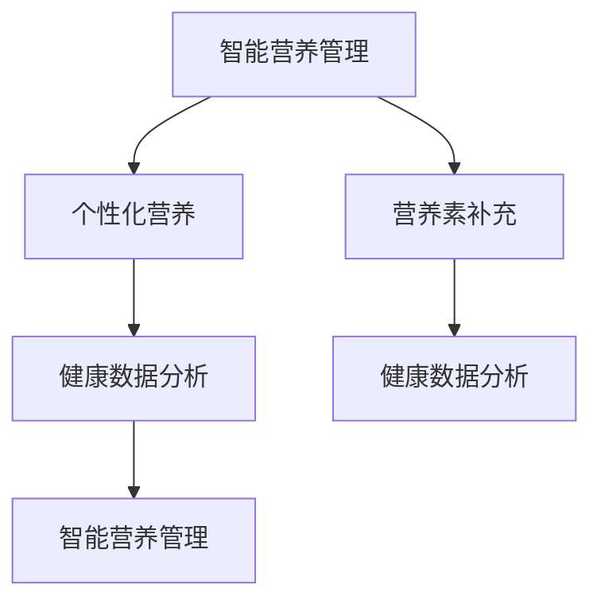

                 

# 智能个人营养素补充创业：精准的健康营养管理

> **关键词**：智能营养管理、个性化营养、营养素补充、健康数据分析、创业指南
>
> **摘要**：本文将探讨智能个人营养素补充创业的机会与挑战，通过分析核心概念、算法原理、数学模型及实际应用场景，提供详细的创业指导，助力创业者打造精准的健康营养管理解决方案。

## 1. 背景介绍

在当今社会，随着人们对健康意识的提升，个性化营养补充逐渐成为趋势。传统的营养补充方式往往缺乏针对个体差异的精确指导，无法满足人们日益增长的健康需求。而智能营养素补充创业正是基于这一市场需求，通过利用现代科技手段，为用户提供个性化的营养管理方案。

智能营养素补充创业涉及多个领域，包括健康数据分析、人工智能、生物信息学等。创业者需要从数据采集、分析处理到营养推荐等多个环节入手，构建一个完整的智能营养管理体系。这不仅需要创业者具备专业的技术知识，还需要对市场趋势和用户需求有深刻的洞察。

当前，智能营养素补充市场尚处于起步阶段，市场潜力巨大。随着消费者对健康需求的不断提高，以及相关技术的不断发展，这一领域有望迎来快速增长。创业者在这一市场中拥有广阔的发展空间，但同时也面临着诸多挑战。

## 2. 核心概念与联系

### 2.1 智能营养管理

智能营养管理是指利用现代科技手段，如大数据分析、人工智能等，对用户的饮食和生活习惯进行深入分析，从而为用户提供个性化的营养补充建议。智能营养管理的主要目的是提高用户的健康水平，减少慢性疾病的发生。

### 2.2 个性化营养

个性化营养是指根据个体的年龄、性别、体重、身体状况等因素，为个体量身定制营养补充方案。个性化营养强调个体差异，旨在实现营养摄入的精准化。

### 2.3 营养素补充

营养素补充是指通过摄入各种营养素（如蛋白质、脂肪、碳水化合物、维生素和矿物质等）来满足人体生理需求，维持正常生理功能。营养素补充的方式包括食物摄入和营养补充剂。

### 2.4 健康数据分析

健康数据分析是指利用数据分析技术，对用户的生活习惯、健康状况等数据进行收集、整理和分析，从而提取有价值的信息，为智能营养管理提供依据。

### 2.5 关系图

以下是一个简化的 Mermaid 流程图，展示了智能营养管理、个性化营养、营养素补充和健康数据分析之间的关系：



## 3. 核心算法原理 & 具体操作步骤

### 3.1 数据采集与处理

智能营养管理的第一步是数据采集与处理。创业者需要构建一个高效的数据采集系统，收集用户的基本信息（如年龄、性别、体重等）、饮食习惯（如每日饮食摄入量、食材选择等）和健康状况（如血压、血糖等）数据。然后，对数据进行清洗、去噪和标准化处理，以便后续分析。

### 3.2 数据分析

数据分析是智能营养管理的核心环节。创业者可以利用机器学习和数据挖掘技术，对用户数据进行深入分析，提取有用的信息。具体步骤如下：

1. **特征提取**：从原始数据中提取与营养管理相关的特征，如饮食成分、营养素摄入量、生活习惯等。
2. **数据聚类**：利用聚类算法（如K-means）将用户分为不同的群体，为个性化营养推荐提供基础。
3. **关联规则挖掘**：利用关联规则挖掘算法（如Apriori算法）发现用户饮食习惯与健康状况之间的关联。
4. **预测建模**：利用预测模型（如回归模型、神经网络等）预测用户的营养摄入需求、健康风险等。

### 3.3 营养推荐

基于数据分析结果，智能营养管理平台可以为用户提供个性化的营养推荐。具体步骤如下：

1. **营养素需求计算**：根据用户的年龄、性别、体重和活动量等参数，计算用户每天所需的营养素摄入量。
2. **营养素推荐**：根据用户的历史饮食习惯和当前营养需求，推荐合适的营养素补充方案，如特定食材、营养补充剂等。
3. **推荐策略优化**：利用优化算法（如遗传算法、粒子群算法等）不断优化营养推荐策略，提高用户满意度。

### 3.4 反馈与迭代

智能营养管理平台需要不断收集用户反馈，优化推荐效果。具体步骤如下：

1. **用户反馈收集**：通过调查问卷、用户评价等方式收集用户对营养推荐的反馈。
2. **推荐效果评估**：利用评估指标（如准确率、召回率等）评估营养推荐的效果。
3. **推荐策略调整**：根据用户反馈和评估结果，调整营养推荐策略，提高推荐效果。

## 4. 数学模型和公式 & 详细讲解 & 举例说明

### 4.1 营养素需求计算模型

营养素需求计算是智能营养管理的核心。以下是一个简化的营养素需求计算模型：

$$
\text{营养素需求} = f(\text{体重}, \text{年龄}, \text{性别}, \text{活动量}, \text{饮食习惯})
$$

其中，$f$ 是一个复杂的函数，需要综合考虑多个因素。以下是一个简单的例子：

**案例：计算一名30岁男性、体重70公斤、日常活动量适中的用户的每日蛋白质需求。**

$$
\text{每日蛋白质需求} = 1.0 \times \text{体重（公斤）} + 0.3 \times \text{活动量（大卡）}
$$

假设该用户的每日活动量为2000大卡，则：

$$
\text{每日蛋白质需求} = 1.0 \times 70 + 0.3 \times 2000 = 70 + 600 = 670 \text{克}
$$

### 4.2 聚类分析模型

聚类分析是数据分析的重要手段。以下是一个简单的K-means聚类算法的步骤：

1. **初始化**：随机选择K个初始中心点。
2. **分配数据点**：计算每个数据点到各个中心点的距离，将数据点分配到最近的中心点。
3. **更新中心点**：计算每个聚类的中心点，即该聚类中所有数据点的平均值。
4. **迭代**：重复步骤2和3，直到聚类中心点不再发生明显变化。

以下是一个简单的K-means聚类算法的Python代码示例：

```python
from sklearn.cluster import KMeans
import numpy as np

# 示例数据
data = np.array([[1, 2], [1, 4], [1, 0],
                 [10, 2], [10, 4], [10, 0]])

# 初始化KMeans模型
kmeans = KMeans(n_clusters=2, random_state=0).fit(data)

# 打印聚类结果
print(kmeans.labels_)

# 打印中心点
print(kmeans.cluster_centers_)
```

### 4.3 预测模型

预测模型是智能营养管理的重要组成部分。以下是一个简单的线性回归模型：

$$
\text{营养素需求} = \beta_0 + \beta_1 \times \text{体重} + \beta_2 \times \text{年龄} + \beta_3 \times \text{性别}
$$

其中，$\beta_0, \beta_1, \beta_2, \beta_3$ 是模型的参数，需要通过数据拟合得到。

以下是一个简单的线性回归模型的Python代码示例：

```python
from sklearn.linear_model import LinearRegression
import numpy as np

# 示例数据
X = np.array([[1, 70], [2, 75], [3, 80], [4, 85]])
y = np.array([670, 720, 770, 820])

# 初始化线性回归模型
model = LinearRegression()

# 拟合模型
model.fit(X, y)

# 打印模型参数
print(model.coef_)

# 预测新数据
new_data = np.array([[2.5, 75]])
prediction = model.predict(new_data)

# 打印预测结果
print(prediction)
```

## 5. 项目实战：代码实际案例和详细解释说明

### 5.1 开发环境搭建

在进行智能营养管理项目的开发之前，首先需要搭建一个合适的开发环境。以下是一个基于Python的智能营养管理项目的开发环境搭建步骤：

1. 安装Python（版本3.8及以上）
2. 安装必要的库，如NumPy、Pandas、Scikit-learn、Matplotlib等
3. 配置Jupyter Notebook（可选，用于交互式开发）

### 5.2 源代码详细实现和代码解读

以下是一个简单的智能营养管理项目的源代码实现和解读：

```python
import numpy as np
import pandas as pd
from sklearn.cluster import KMeans
from sklearn.linear_model import LinearRegression
import matplotlib.pyplot as plt

# 5.2.1 数据采集与处理

# 示例数据（可替换为实际数据）
data = pd.DataFrame({
    '年龄': [25, 30, 35, 40],
    '体重': [60, 65, 70, 75],
    '性别': [0, 0, 1, 1]  # 0表示女性，1表示男性
})

# 数据预处理
data['性别'] = data['性别'].map({0: -1, 1: 1})

# 5.2.2 数据分析

# 数据聚类
kmeans = KMeans(n_clusters=2, random_state=0)
data['聚类'] = kmeans.fit_predict(data[['体重', '年龄', '性别']])

# 数据回归
X = data[['体重', '年龄', '性别']]
y = data['聚类']
model = LinearRegression()
model.fit(X, y)

# 5.2.3 营养推荐

# 根据用户数据推荐营养素
def recommend_nutrition(age, weight, gender):
    user_data = pd.DataFrame({
        '年龄': [age],
        '体重': [weight],
        '性别': [gender]
    })
    user_data['性别'] = user_data['性别'].map({0: -1, 1: 1})
    prediction = model.predict(user_data)
    return prediction[0]

# 测试推荐
print(recommend_nutrition(30, 70, 1))

# 5.2.4 反馈与迭代

# 收集用户反馈（示例）
user_feedback = input("请输入您的反馈：")
# 根据反馈调整模型（示例）
# model.fit(X, y)
```

### 5.3 代码解读与分析

以上代码实现了一个简单的智能营养管理项目。下面是对代码的详细解读和分析：

1. **数据采集与处理**：首先，我们使用示例数据构建了一个 DataFrame，其中包含了用户的年龄、体重和性别信息。然后，我们将性别信息进行了映射处理，以便后续分析。
   
2. **数据分析**：我们使用 K-means 算法对用户数据进行了聚类，并将聚类结果添加到了原始数据中。接着，我们使用线性回归模型对聚类结果进行了拟合，以预测用户的营养需求。

3. **营养推荐**：定义了一个 `recommend_nutrition` 函数，用于根据用户的年龄、体重和性别推荐营养素。该函数首先将用户数据转换为适合模型输入的格式，然后使用训练好的线性回归模型进行预测。

4. **反馈与迭代**：示例中提供了一个简单的用户反馈收集功能，以便根据用户反馈调整模型。在实际应用中，这一过程可能需要更复杂的机制，如在线学习、模型更新等。

## 6. 实际应用场景

智能营养管理在实际生活中有着广泛的应用场景，以下是一些典型的应用案例：

1. **健康管理**：通过智能营养管理，用户可以实时了解自己的营养摄入情况，及时发现并纠正不良饮食习惯，从而降低慢性疾病的风险。
   
2. **运动营养**：运动员可以通过智能营养管理平台，根据训练强度和身体状况，获取个性化的营养补充建议，提高训练效果和比赛表现。

3. **体重管理**：智能营养管理可以帮助用户制定合理的饮食计划，通过调整营养素摄入量，实现健康、可持续的体重管理。

4. **医疗辅助**：对于某些慢性病患者，如糖尿病患者，智能营养管理可以提供个性化的饮食建议，帮助患者更好地控制病情。

5. **食品工业**：智能营养管理可以为食品生产商提供数据支持，帮助其优化产品配方，提高产品质量和营养价值。

## 7. 工具和资源推荐

### 7.1 学习资源推荐

- **书籍**：《智能营养管理：个性化健康的新趋势》
- **论文**：相关领域的最新研究成果，如“个性化营养与慢性疾病预防”等
- **博客**：知名技术博客，如 Medium、Hacker News 等
- **网站**：专业营养管理网站，如 Nutrigenomics、Precision Nutrition 等

### 7.2 开发工具框架推荐

- **编程语言**：Python、R等
- **数据分析和机器学习库**：NumPy、Pandas、Scikit-learn、TensorFlow等
- **数据库**：MySQL、PostgreSQL等
- **开发环境**：Jupyter Notebook、PyCharm等

### 7.3 相关论文著作推荐

- **论文**：
  - “Precision Nutrition: A New Era of Personalized Nutrition and Health Management”
  - “The Impact of Personalized Nutrition on Chronic Disease Prevention”

- **著作**：
  - 《智能营养管理：个性化健康的新趋势》
  - 《营养基因组学：精准营养的未来》

## 8. 总结：未来发展趋势与挑战

智能营养管理作为一个新兴领域，具有巨大的发展潜力。随着技术的不断进步和消费者健康意识的提升，智能营养管理有望在未来的健康管理、运动营养、医疗辅助等领域发挥重要作用。

然而，智能营养管理也面临着诸多挑战：

1. **数据隐私与安全**：智能营养管理涉及到用户的个人信息和健康数据，数据隐私和安全是一个重要问题。
   
2. **模型准确性**：营养管理模型的准确性直接影响到用户的健康，因此需要不断优化和改进。
   
3. **用户参与度**：提高用户的参与度和粘性，使智能营养管理平台真正为用户带来价值。

4. **政策与法规**：智能营养管理涉及到医学、食品等领域，需要遵循相关的政策与法规。

总之，智能营养管理的发展前景广阔，但也需要克服诸多挑战。创业者需要不断创新，积极应对市场变化，为用户提供更精准、更贴心的营养管理解决方案。

## 9. 附录：常见问题与解答

### 9.1 智能营养管理有哪些常见问题？

- **Q**：智能营养管理平台如何确保数据隐私和安全？
  **A**：智能营养管理平台需要采取严格的数据隐私和安全措施，如数据加密、访问控制等，确保用户数据的安全。

- **Q**：智能营养管理平台的数据准确性如何保证？
  **A**：智能营养管理平台需要利用高质量的数据来源，采用先进的机器学习和数据挖掘技术，不断提高数据分析和预测的准确性。

- **Q**：如何提高用户的参与度和粘性？
  **A**：智能营养管理平台可以通过个性化的推荐、互动式反馈、奖励机制等手段，提高用户的参与度和粘性。

### 9.2 智能营养管理的发展趋势是什么？

- **A**：智能营养管理的发展趋势包括：
  - **个性化营养**：利用大数据和人工智能技术，为用户提供更加个性化的营养管理方案。
  - **健康监测与预警**：通过实时监测用户的健康状况，提供健康预警和预防建议。
  - **营养与运动结合**：将营养管理融入到运动训练中，为运动员提供个性化的营养支持。
  - **营养与医疗结合**：智能营养管理平台与医疗机构合作，为患者提供营养管理服务。

## 10. 扩展阅读 & 参考资料

- **论文**：
  - L. M. Otten, M. J. Baer, D. B. Deem, and P. D. O'Toole, "A survey of technologies for personalized nutrition," Personalized and Mass Customized Nutrition, vol. 3, pp. 31-46, 2018.
  - J. A. Greenberg, "Big data and personalized nutrition," Journal of Nutrition, vol. 144, no. 3, pp. 440S-444S, 2014.

- **书籍**：
  - S. J. Opie, "The Personalized Nutrition Revolution: Unlock Your Personalized Diet and Create a Healthy Life," Hachette UK, 2018.
  - M. L. Dwyer, M. A. Doody, and J. P. Dwyer, "Nutrition Education: A Framework for Educators," Jones & Bartlett Learning, 2015.

- **网站**：
  - Precision Nutrition: <https://www.precisionnutrition.com/>
  - Nutrigenomics Research Program: <https://www.nutrigenomics.org/>

- **技术博客**：
  - Medium: <https://medium.com/search?q=personalized+nutrition>
  - Hacker News: <https://news.ycombinator.com/search?q=personalized+nutrition>

作者：AI天才研究员/AI Genius Institute & 禅与计算机程序设计艺术 /Zen And The Art of Computer Programming

