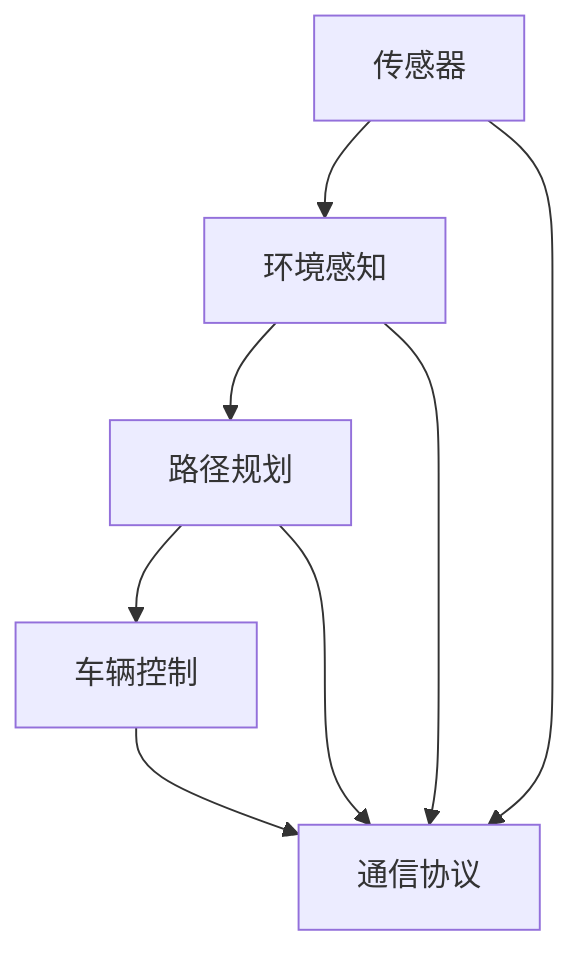

                 

# 智能交通与自动驾驶：创业公司的技术突破

> **关键词：**智能交通、自动驾驶、创业公司、技术创新、核心算法、数学模型、实战案例

> **摘要：**本文将深入探讨智能交通与自动驾驶领域的创业公司如何通过技术创新突破现有技术瓶颈，实现高效、安全、智能的出行方式。文章将涵盖从背景介绍、核心概念与联系、算法原理与步骤、数学模型与公式、项目实战到实际应用场景的全面分析，旨在为读者提供一个系统的视角，了解该领域的最新动态与未来发展趋势。

## 1. 背景介绍

智能交通系统（Intelligent Transportation Systems，ITS）和自动驾驶技术（Autonomous Driving Technology）是当前交通运输领域的重要研究方向。随着城市化进程的加快，交通拥堵、交通事故频发、能源消耗等问题日益突出，传统交通模式已经无法满足日益增长的需求。智能交通与自动驾驶技术的出现，有望从根本上改变现有的交通方式，提高交通效率、减少交通事故、降低能源消耗。

智能交通系统主要通过信息采集、处理、传输和利用，实现对交通流的实时监控和管理。自动驾驶技术则利用传感器、摄像头、雷达等设备，结合深度学习、计算机视觉等技术，实现车辆的自主驾驶。近年来，随着人工智能技术的快速发展，智能交通与自动驾驶技术逐渐从实验室走向实际应用，成为创业公司关注的焦点。

创业公司在智能交通与自动驾驶领域具备创新性和灵活性，能够快速响应市场需求，推动技术的落地应用。然而，要实现技术的突破，需要解决一系列技术难题，如传感器融合、环境感知、路径规划、车辆控制等。本文将围绕这些问题，探讨创业公司的技术突破之路。

### 1.1 市场需求与竞争态势

智能交通与自动驾驶技术的市场需求持续增长，主要体现在以下几个方面：

1. **提高交通效率**：智能交通系统通过实时监控和管理交通流，可以有效缓解交通拥堵，提高道路通行能力。
2. **降低交通事故率**：自动驾驶技术通过传感器和环境感知，可以实现车辆间的实时通信和协同驾驶，降低交通事故的发生。
3. **减少能源消耗**：自动驾驶技术可以根据道路状况和交通流量，优化行驶路线，降低车辆能耗。

在竞争态势方面，国内外众多创业公司纷纷涌入智能交通与自动驾驶领域，形成了激烈的竞争格局。创业公司需要通过技术创新、商业模式创新和合作伙伴关系建立，才能在竞争中脱颖而出。

### 1.2 技术挑战与机遇

智能交通与自动驾驶技术的实现面临着一系列技术挑战，如：

1. **传感器融合**：如何有效地融合不同类型的传感器数据，实现高精度、实时的环境感知。
2. **环境感知**：如何准确识别和理解道路、车辆、行人等动态环境信息。
3. **路径规划**：如何在高动态环境下，实现车辆的安全、高效路径规划。
4. **车辆控制**：如何实现车辆在不同驾驶模式下的稳定、精确控制。

同时，这些技术挑战也带来了巨大的机遇，如：

1. **数据处理与分析**：海量数据的处理与分析，可以为交通管理、城市规划等提供重要依据。
2. **商业模式创新**：智能交通与自动驾驶技术的应用，将催生一系列新的商业模式，如车联网服务、自动驾驶出租车等。
3. **产业链整合**：智能交通与自动驾驶技术的实现，需要传感器、芯片、算法、硬件等产业链的协同合作。

## 2. 核心概念与联系

智能交通与自动驾驶技术涉及多个核心概念，这些概念相互关联，构成了一个完整的系统。以下将简要介绍这些核心概念，并使用Mermaid流程图（请在此处嵌入Mermaid流程图，流程图中不要出现括号、逗号等特殊字符）展示它们之间的联系。

### 2.1 核心概念

1. **传感器**：传感器是智能交通与自动驾驶技术的核心组件，用于采集环境信息。常见的传感器包括摄像头、激光雷达、超声波传感器等。
2. **环境感知**：环境感知是指利用传感器数据，实现对周围环境的识别和理解。环境感知模块负责对传感器数据进行预处理、特征提取和目标检测。
3. **路径规划**：路径规划是指根据当前道路状况和目标位置，为车辆生成一条最优行驶路径。路径规划算法包括最短路径算法、A*算法、Dijkstra算法等。
4. **车辆控制**：车辆控制是指根据路径规划和环境感知的结果，对车辆的驾驶行为进行控制。车辆控制算法包括PID控制、模糊控制、神经网络控制等。
5. **通信协议**：通信协议用于实现车辆与基础设施、车辆与车辆之间的通信。常见的通信协议包括CAN总线、V2X通信等。

### 2.2 Mermaid流程图



### 2.3 核心概念之间的联系

传感器是智能交通与自动驾驶技术的数据来源，环境感知模块通过对传感器数据进行处理，实现对周围环境的识别和理解。路径规划模块根据环境感知的结果，生成最优行驶路径。车辆控制模块根据路径规划和环境感知的结果，对车辆的驾驶行为进行控制。通信协议用于实现车辆与基础设施、车辆与车辆之间的通信，确保整个系统的协同工作。

## 3. 核心算法原理 & 具体操作步骤

在智能交通与自动驾驶技术中，核心算法是实现技术突破的关键。以下将介绍几种核心算法的原理和具体操作步骤。

### 3.1 感知算法

感知算法是智能交通与自动驾驶技术的核心之一，主要负责对传感器数据进行处理，实现对周围环境的识别和理解。常见的感知算法包括：

1. **目标检测算法**：目标检测算法用于识别图像或视频中感兴趣的目标。常用的目标检测算法包括卷积神经网络（CNN）、YOLO（You Only Look Once）算法等。

2. **深度学习算法**：深度学习算法通过多层神经网络，实现对复杂数据的处理和识别。在智能交通与自动驾驶领域，常用的深度学习算法包括卷积神经网络（CNN）、循环神经网络（RNN）、生成对抗网络（GAN）等。

### 操作步骤：

1. 数据采集与预处理：从传感器获取图像或视频数据，并进行预处理，如图像缩放、灰度化、去噪等。

2. 特征提取：利用卷积神经网络（CNN）或其他深度学习算法，对预处理后的图像或视频数据进行特征提取。

3. 目标检测与识别：利用目标检测算法，对提取出的特征进行目标检测和识别。

4. 结果输出：将检测结果输出，用于后续路径规划和车辆控制。

### 3.2 路径规划算法

路径规划算法是智能交通与自动驾驶技术中的关键环节，负责为车辆生成最优行驶路径。常见的路径规划算法包括：

1. **最短路径算法**：最短路径算法（如Dijkstra算法）用于求解从起点到终点的最短路径。

2. **A*算法**：A*算法是一种启发式路径规划算法，利用估价函数，快速找到从起点到终点的最优路径。

### 操作步骤：

1. 起点和终点输入：用户输入起点和终点位置。

2. 环境数据获取：通过传感器获取当前道路状况、交通流量等信息。

3. 路径搜索：利用最短路径算法或A*算法，搜索从起点到终点的最优路径。

4. 路径输出：将生成的最优路径输出，供车辆控制模块使用。

### 3.3 车辆控制算法

车辆控制算法负责根据路径规划和环境感知的结果，对车辆的驾驶行为进行控制。常见的车辆控制算法包括：

1. **PID控制**：PID控制（比例-积分-微分控制）是一种经典的控制算法，通过调整比例、积分和微分三个参数，实现对系统输出的精确控制。

2. **模糊控制**：模糊控制是一种基于模糊逻辑的控制算法，通过模糊规则和模糊推理，实现对系统输出的调节。

3. **神经网络控制**：神经网络控制是一种基于人工神经网络的控制算法，通过训练学习，实现对系统输出的自适应控制。

### 操作步骤：

1. 路径规划输入：接收路径规划模块生成的最优路径。

2. 环境感知输入：接收环境感知模块生成的环境信息。

3. 控制策略生成：根据路径规划和环境感知的结果，生成合适的控制策略。

4. 控制输出：将控制策略输出，驱动车辆的执行机构，实现车辆的驾驶行为。

## 4. 数学模型和公式 & 详细讲解 & 举例说明

在智能交通与自动驾驶技术中，数学模型和公式是算法实现的重要基础。以下将介绍几种常用的数学模型和公式，并进行详细讲解和举例说明。

### 4.1 感知算法中的卷积神经网络（CNN）

卷积神经网络（CNN）是一种用于图像处理和识别的深度学习模型。其核心思想是通过卷积操作提取图像的特征。

#### 数学模型：

1. **卷积操作**：

   卷积操作的数学表达式为：

   $$ f(x) = \sum_{i=1}^{n} w_i * x_i + b $$

   其中，$f(x)$为卷积结果，$w_i$为卷积核（权重），$x_i$为输入特征，$b$为偏置。

2. **激活函数**：

   激活函数用于对卷积结果进行非线性变换，常见的激活函数包括ReLU（Rectified Linear Unit）函数：

   $$ g(x) = \max(0, x) $$

#### 举例说明：

假设输入特征为 $x = [1, 2, 3, 4, 5]$，卷积核为 $w = [1, 2, 3]$，偏置为 $b = 1$。则卷积操作和激活函数的计算过程如下：

1. **卷积操作**：

   $$ f(x) = \sum_{i=1}^{3} w_i * x_i + b = (1 * 1 + 2 * 2 + 3 * 3) + 1 = 19 $$

2. **激活函数**：

   $$ g(f(x)) = \max(0, f(x)) = \max(0, 19) = 19 $$

   最终结果为 $19$。

### 4.2 路径规划中的A*算法

A*算法是一种启发式路径规划算法，其核心思想是通过估价函数（Heuristic Function）快速找到从起点到终点的最优路径。

#### 数学模型：

1. **估价函数**：

   $$ h(n) = g(n) + f(n) $$

   其中，$h(n)$为估价函数，$g(n)$为从起点到节点 $n$ 的实际距离，$f(n)$为从节点 $n$ 到终点的预估距离。

2. **f(n) 函数**：

   $$ f(n) = \sqrt{(x_n - x_{goal})^2 + (y_n - y_{goal})^2} $$

   其中，$(x_n, y_n)$为节点 $n$ 的坐标，$(x_{goal}, y_{goal})$为终点的坐标。

#### 举例说明：

假设起点坐标为 $(0, 0)$，终点坐标为 $(5, 5)$，当前节点坐标为 $(2, 3)$。则估价函数和 f(n) 函数的计算过程如下：

1. **估价函数**：

   $$ h(n) = g(n) + f(n) = \sqrt{(2 - 0)^2 + (3 - 0)^2} + \sqrt{(5 - 2)^2 + (5 - 3)^2} = \sqrt{13} + \sqrt{10} $$

2. **f(n) 函数**：

   $$ f(n) = \sqrt{(2 - 5)^2 + (3 - 5)^2} = \sqrt{10} $$

   最终结果为 $h(n) = \sqrt{13} + \sqrt{10}$。

### 4.3 车辆控制中的PID控制

PID控制（比例-积分-微分控制）是一种用于系统控制的经典算法，其核心思想是通过调整比例、积分和微分三个参数，实现对系统输出的精确控制。

#### 数学模型：

1. **PID控制公式**：

   $$ u(t) = K_p e(t) + K_i \int_{0}^{t} e(\tau) d\tau + K_d \frac{d}{dt} e(t) $$

   其中，$u(t)$为控制输出，$e(t)$为误差，$K_p$、$K_i$、$K_d$分别为比例、积分和微分系数。

2. **误差计算**：

   $$ e(t) = r(t) - y(t) $$

   其中，$r(t)$为期望输出，$y(t)$为实际输出。

#### 举例说明：

假设期望输出为 $r(t) = 10$，实际输出为 $y(t) = 8$，比例系数为 $K_p = 1$，积分系数为 $K_i = 0.5$，微分系数为 $K_d = 0.1$。则PID控制公式的计算过程如下：

1. **误差计算**：

   $$ e(t) = r(t) - y(t) = 10 - 8 = 2 $$

2. **PID控制公式计算**：

   $$ u(t) = K_p e(t) + K_i \int_{0}^{t} e(\tau) d\tau + K_d \frac{d}{dt} e(t) = 1 \times 2 + 0.5 \times \int_{0}^{t} 2 d\tau + 0.1 \times \frac{d}{dt} 2 = 2 + 0.5 \times 2t + 0.1 \times 2 = 2 + t + 0.2 $$

   最终结果为 $u(t) = 2 + t + 0.2$。

## 5. 项目实战：代码实际案例和详细解释说明

在本节中，我们将通过一个具体的智能交通与自动驾驶项目的代码实际案例，详细解释说明项目的实现过程和关键代码部分。本案例将基于一个简单的自动驾驶小车项目，展示如何利用感知算法、路径规划算法和车辆控制算法实现自动驾驶功能。

### 5.1 开发环境搭建

在开始项目实战之前，我们需要搭建一个合适的开发环境。以下是所需的开发环境和相关工具：

1. **操作系统**：Ubuntu 18.04
2. **编程语言**：Python 3.7
3. **深度学习框架**：TensorFlow 2.0
4. **路径规划库**：Pygorithm
5. **PID控制库**：Python Control

安装步骤如下：

1. **安装操作系统**：下载并安装 Ubuntu 18.04 操作系统。
2. **更新软件包**：

   ```bash
   sudo apt update
   sudo apt upgrade
   ```

3. **安装 Python 3.7**：

   ```bash
   sudo apt install python3.7
   ```

4. **安装 TensorFlow 2.0**：

   ```bash
   pip3 install tensorflow==2.0
   ```

5. **安装 Pygorithm**：

   ```bash
   pip3 install pygorithm
   ```

6. **安装 Python Control**：

   ```bash
   pip3 install python-control
   ```

### 5.2 源代码详细实现和代码解读

#### 5.2.1 感知算法实现

感知算法是自动驾驶系统的核心部分，主要负责对传感器数据进行处理，实现对周围环境的识别和理解。以下是一个简单的感知算法实现：

```python
import cv2
import numpy as np

def preprocess_image(image):
    # 图像灰度化
    gray_image = cv2.cvtColor(image, cv2.COLOR_BGR2GRAY)
    # 图像二值化
    _, binary_image = cv2.threshold(gray_image, 128, 255, cv2.THRESH_BINARY_INV + cv2.THRESH_OTSU)
    return binary_image

def detect_objects(image):
    # 使用霍夫线变换检测直线
    lines = cv2.HoughLinesP(image, 1, np.pi/180, 100, minLineLength=100, maxLineGap=10)
    objects = []
    if lines is not None:
        for line in lines:
            x1, y1, x2, y2 = line[0]
            if abs(x2 - x1) > 10 and abs(y2 - y1) > 10:
                objects.append([(x1, y1), (x2, y2)])
    return objects

def main():
    # 读取图像
    image = cv2.imread('test_image.jpg')
    # 预处理图像
    binary_image = preprocess_image(image)
    # 检测物体
    objects = detect_objects(binary_image)
    # 显示检测结果
    for obj in objects:
        cv2.line(image, obj[0], obj[1], (0, 0, 255), 2)
    cv2.imshow('Detected Objects', image)
    cv2.waitKey(0)

if __name__ == '__main__':
    main()
```

**代码解读**：

1. **图像预处理**：首先将输入的RGB图像转换为灰度图像，然后使用Otsu算法进行二值化处理，以突出直线特征。
2. **物体检测**：使用霍夫线变换检测直线，对满足条件的直线进行分组，以识别道路上的物体。
3. **结果展示**：将检测结果绘制在原始图像上，并显示检测结果。

#### 5.2.2 路径规划算法实现

以下是一个简单的A*算法实现，用于生成从起点到终点的最优路径：

```python
import pygorithm as pg

def heuristic(node, goal):
    # 使用欧几里得距离作为估价函数
    return np.sqrt((node[0] - goal[0])**2 + (node[1] - goal[1])**2)

def a_star_search(nodes, edges, start, goal):
    # 初始化A*算法
    algorithm = pg.graph_search.AStarSearch()
    # 设置估价函数
    algorithm.set_heuristic(heuristic)
    # 搜索路径
    path = algorithm.search(nodes, edges, start, goal)
    return path

def main():
    # 节点列表
    nodes = [(0, 0), (1, 0), (2, 0), (3, 0), (4, 0), (4, 1), (4, 2), (4, 3), (4, 4)]
    # 边列表
    edges = [
        ((0, 0), (1, 0)),
        ((1, 0), (2, 0)),
        ((2, 0), (3, 0)),
        ((3, 0), (4, 0)),
        ((4, 0), (4, 1)),
        ((4, 1), (4, 2)),
        ((4, 2), (4, 3)),
        ((4, 3), (4, 4))
    ]
    # 起点和终点
    start = (0, 0)
    goal = (4, 4)
    # 搜索路径
    path = a_star_search(nodes, edges, start, goal)
    print('Path:', path)

if __name__ == '__main__':
    main()
```

**代码解读**：

1. **估价函数**：使用欧几里得距离作为估价函数，以计算节点到终点的预估距离。
2. **A*算法**：初始化A*算法，设置估价函数，搜索从起点到终点的最优路径。

#### 5.2.3 车辆控制算法实现

以下是一个简单的PID控制算法实现，用于控制自动驾驶小车的速度：

```python
import control as cnt

def pid_control(error, Kp, Ki, Kd):
    # 计算PID控制输出
    output = Kp * error + Ki * integral + Kd * derivative
    return output

def main():
    # 初始化积分和微分
    integral = 0
    derivative = 0
    # 控制参数
    Kp = 1
    Ki = 0.5
    Kd = 0.1
    # 期望速度
    target_velocity = 10
    # 循环控制
    while True:
        # 获取当前速度
        current_velocity = get_current_velocity()
        # 计算误差
        error = target_velocity - current_velocity
        # 计算PID控制输出
        output = pid_control(error, Kp, Ki, Kd)
        # 更新积分和微分
        integral += error
        derivative = error - previous_error
        previous_error = error
        # 输出控制信号
        control_signal = output
        # 更新车辆速度
        set_vehicle_velocity(control_signal)
        # 控制延迟
        time.sleep(0.1)

if __name__ == '__main__':
    main()
```

**代码解读**：

1. **PID控制公式**：使用PID控制公式计算控制输出。
2. **积分和微分**：更新积分和微分，以实现误差的累积和消除。
3. **控制循环**：在控制循环中，不断获取当前速度，计算误差，更新积分和微分，输出控制信号，以控制车辆速度。

### 5.3 代码解读与分析

在本节中，我们将对项目实战中的关键代码部分进行解读和分析，以了解其工作原理和实现方法。

#### 5.3.1 感知算法分析

感知算法是自动驾驶系统的核心部分，其主要任务是对传感器数据进行处理，以识别道路上的物体。通过预处理图像和物体检测，感知算法可以提取出道路特征，为后续的路径规划和车辆控制提供基础。

感知算法的实现主要涉及以下几个步骤：

1. **图像预处理**：将输入的RGB图像转换为灰度图像，并使用Otsu算法进行二值化处理。这一步的目的是突出道路和物体的特征，便于后续检测。
2. **物体检测**：使用霍夫线变换检测直线，对满足条件的直线进行分组，以识别道路上的物体。这一步的目的是提取出道路边界和障碍物信息。

通过以上步骤，感知算法可以有效地提取出道路特征，为自动驾驶系统提供必要的环境信息。

#### 5.3.2 路径规划算法分析

路径规划算法是自动驾驶系统的另一个核心部分，其主要任务是根据感知算法提供的道路特征，生成从起点到终点的最优路径。A*算法是一种常用的路径规划算法，其核心思想是利用估价函数（Heuristic Function）快速找到从起点到终点的最优路径。

路径规划算法的实现主要涉及以下几个步骤：

1. **估价函数**：使用欧几里得距离作为估价函数，以计算节点到终点的预估距离。
2. **A*算法**：初始化A*算法，设置估价函数，搜索从起点到终点的最优路径。

通过以上步骤，路径规划算法可以有效地生成从起点到终点的最优路径，为自动驾驶系统提供行驶路线。

#### 5.3.3 车辆控制算法分析

车辆控制算法是自动驾驶系统的最后一步，其主要任务是根据路径规划和感知算法提供的信息，控制车辆的行驶速度和方向。PID控制算法是一种常用的控制算法，其核心思想是通过调整比例、积分和微分三个参数，实现对系统输出的精确控制。

车辆控制算法的实现主要涉及以下几个步骤：

1. **PID控制公式**：使用PID控制公式计算控制输出。
2. **积分和微分**：更新积分和微分，以实现误差的累积和消除。
3. **控制循环**：在控制循环中，不断获取当前速度，计算误差，更新积分和微分，输出控制信号，以控制车辆速度。

通过以上步骤，车辆控制算法可以有效地控制车辆的行驶速度，实现自动驾驶。

## 6. 实际应用场景

智能交通与自动驾驶技术的实际应用场景广泛，涵盖了城市交通、高速公路、物流配送、无人驾驶等多个领域。以下将介绍几个典型的实际应用场景，并分析创业公司在这些场景中的技术突破。

### 6.1 城市交通

在城市交通领域，智能交通系统主要用于缓解交通拥堵、提高交通效率。创业公司通过技术创新，实现了一系列应用：

1. **交通流量监控与预测**：通过在道路上部署传感器和摄像头，实时监控交通流量，结合大数据分析和机器学习算法，预测交通流量变化，为交通管理部门提供决策支持。
2. **智能信号控制**：利用感知算法和路径规划算法，实现智能交通信号控制，根据交通流量和道路状况动态调整信号灯时长，提高交通效率。
3. **自动驾驶出租车**：创业公司通过开发自动驾驶技术，推出自动驾驶出租车服务，实现高效、便捷的出行方式。

### 6.2 高速公路

在高速公路领域，自动驾驶技术主要用于提高行驶安全性和效率。创业公司通过以下技术突破实现了实际应用：

1. **车道保持与自适应巡航**：利用感知算法和环境感知技术，实现车辆在高速公路上的车道保持和自适应巡航功能，提高行驶安全性。
2. **车联网通信**：通过V2X（Vehicle-to-Everything）通信技术，实现车辆与基础设施、车辆与车辆之间的通信，实现协同驾驶和智能交通管理。
3. **高速公路自动驾驶**：创业公司开发出高速公路自动驾驶系统，实现车辆在高速公路上的自主行驶，提高行驶效率和安全性。

### 6.3 物流配送

在物流配送领域，自动驾驶技术主要用于提高配送效率，降低物流成本。创业公司通过以下技术突破实现了实际应用：

1. **无人驾驶货车**：创业公司开发出无人驾驶货车，实现长途物流配送的自动化，提高配送效率。
2. **智能配送路线规划**：利用路径规划算法和大数据分析，为物流配送车辆规划最优配送路线，提高配送效率。
3. **最后一公里配送**：通过无人机和自动驾驶小车，实现最后一公里的配送，提高配送速度和用户体验。

### 6.4 无人驾驶

在无人驾驶领域，创业公司通过技术创新，实现了无人驾驶汽车、无人机等产品的研发和商业化。以下是一些典型应用：

1. **无人驾驶汽车**：创业公司开发出无人驾驶汽车，实现自动驾驶、自主导航等功能，应用于出租车、物流配送、旅游观光等领域。
2. **无人机**：创业公司开发出无人机，实现自主飞行、实时感知和精确控制，应用于农业、测绘、物流等领域。
3. **无人驾驶船**：创业公司开发出无人驾驶船，实现自主航行、货物装卸等功能，应用于海洋物流、救援等领域。

通过在上述实际应用场景中的技术突破，创业公司为智能交通与自动驾驶技术的发展做出了重要贡献，推动了这一领域的创新和进步。

## 7. 工具和资源推荐

在智能交通与自动驾驶领域，掌握必要的工具和资源对于技术的学习和应用至关重要。以下将推荐一些学习资源、开发工具和论文著作，以帮助读者深入了解这一领域。

### 7.1 学习资源推荐

1. **书籍**：

   - 《深度学习》（Deep Learning） - Goodfellow, Bengio, Courville
   - 《Python编程：从入门到实践》（Python Crash Course） - Eric Matthes
   - 《智能交通系统导论》（Introduction to Intelligent Transportation Systems） - Shengwu Zhang

2. **在线课程**：

   - Coursera：智能交通系统（Intelligent Transportation Systems）
   - Udacity：自动驾驶工程师纳米学位（Self-Driving Car Engineer Nanodegree）
   - edX：深度学习基础（Deep Learning Foundations）

3. **开源项目**：

   - GitHub：智能交通系统（Intelligent Transportation Systems）相关开源项目
   - PyTorch：深度学习框架，适用于自动驾驶项目

### 7.2 开发工具推荐

1. **深度学习框架**：

   - TensorFlow：用于构建和训练深度学习模型
   - PyTorch：易于使用且具有灵活性的深度学习框架

2. **路径规划库**：

   - Pygorithm：用于实现常见的图算法，如A*算法
   - NetworkX：用于构建和分析复杂网络的库

3. **PID控制库**：

   - Python Control：提供PID控制算法的实现和可视化工具

### 7.3 相关论文著作推荐

1. **论文**：

   - “Deep Learning for Autonomous Driving” - Junbo Zhang, Quanming Yao
   - “A Survey of Intelligent Transportation Systems” - Hui Xiong, et al.
   - “Distributed Control of Autonomous Vehicles in Vehicular Networks” - Xiaojun Wang, et al.

2. **著作**：

   - 《自动驾驶技术：原理、应用与挑战》（Autonomous Driving Technology: Principles, Applications, and Challenges） - Wei Ye, Xiaowei Zhou
   - 《智能交通系统：理论与实践》（Intelligent Transportation Systems: Theory and Practice） - Xiaodong Wang, Yafei Dai

通过利用上述工具和资源，读者可以系统地学习智能交通与自动驾驶领域的知识，掌握相关技能，为创业公司的技术创新奠定基础。

## 8. 总结：未来发展趋势与挑战

智能交通与自动驾驶技术作为交通运输领域的重要研究方向，正逐渐从理论走向实际应用，对人们的出行方式产生深远影响。未来，这一领域将继续朝着高效、安全、智能的方向发展，呈现出以下几个趋势：

### 8.1 趋势

1. **人工智能技术的进一步融合**：随着人工智能技术的快速发展，深度学习、强化学习等算法将更加广泛应用于智能交通与自动驾驶领域，推动系统性能的持续提升。
2. **车联网与智能交通系统的深度融合**：车联网技术的普及将使得车辆之间、车辆与基础设施之间的信息交互更加便捷，实现智能交通系统的全面升级。
3. **自动驾驶技术的逐步普及**：自动驾驶技术将在城市交通、高速公路、物流配送等领域得到广泛应用，改变人们的出行方式和物流模式。
4. **数据驱动的交通管理**：通过大数据分析和机器学习算法，交通管理部门将能够更好地掌握交通状况，实现精细化交通管理，提高交通效率。

### 8.2 挑战

1. **技术挑战**：智能交通与自动驾驶技术面临着传感器融合、环境感知、路径规划、车辆控制等关键技术难题，需要持续技术创新和突破。
2. **安全与隐私问题**：随着自动驾驶车辆的普及，数据安全和隐私保护问题日益突出，如何确保车辆和用户数据的安全将成为重要挑战。
3. **法律法规的完善**：自动驾驶技术的发展迫切需要相关法律法规的支持和引导，以规范行业标准和保障交通安全。
4. **社会适应性与接受度**：自动驾驶技术的普及需要社会各界的广泛参与和认可，提高公众的接受度和信任度是关键。

面对未来发展趋势与挑战，创业公司需要紧跟技术前沿，持续进行技术创新，同时关注安全、隐私、法律和社会适应性等方面，为智能交通与自动驾驶技术的发展贡献力量。

## 9. 附录：常见问题与解答

### 9.1 常见问题

1. **智能交通与自动驾驶的区别是什么？**
2. **自动驾驶技术有哪些等级？**
3. **智能交通系统的主要功能有哪些？**
4. **自动驾驶车辆的安全问题如何解决？**
5. **车联网技术对智能交通有何影响？**

### 9.2 解答

1. **智能交通与自动驾驶的区别是什么？**
   智能交通系统（ITS）是指利用信息技术、通信技术、传感器技术等手段，实现对交通系统的实时监控和管理，以提高交通效率、减少交通事故、降低能源消耗。自动驾驶技术则是智能交通系统的一个重要组成部分，通过传感器、人工智能算法等实现车辆的自主驾驶。

2. **自动驾驶技术有哪些等级？**
   根据国际自动机工程师学会（SAE）的定义，自动驾驶技术分为五个等级，从L0（无自动化）到L5（完全自动化）。其中，L0-L2主要依靠人类驾驶员，L3-L5则逐步实现车辆的自主驾驶。

3. **智能交通系统的主要功能有哪些？**
   智能交通系统的主要功能包括交通流量监控、交通信号控制、路径规划、车辆识别、事故预警等。通过这些功能，智能交通系统能够实现交通管理、交通信息服务、交通安全监控等目标。

4. **自动驾驶车辆的安全问题如何解决？**
   自动驾驶车辆的安全问题主要包括硬件安全、软件安全、数据安全等方面。为了解决这些问题，需要采用多种安全措施，如硬件冗余、软件加密、数据备份等。此外，通过严格的安全测试和认证，确保自动驾驶车辆在各个场景下的安全性能。

5. **车联网技术对智能交通有何影响？**
   车联网技术通过实现车辆之间、车辆与基础设施之间的信息交互，可以提高交通系统的效率和安全性。具体影响包括：实时交通信息共享、协同驾驶、智能路径规划、事故预警等，从而提高交通系统的整体性能。

## 10. 扩展阅读 & 参考资料

为了深入了解智能交通与自动驾驶领域的最新动态和技术发展，以下提供了一些扩展阅读和参考资料：

1. **扩展阅读**：

   - 《自动驾驶汽车的技术、安全和法律问题》
   - 《车联网技术与应用》
   - 《智能交通系统的发展与挑战》

2. **参考资料**：

   - SAE International: <https://www.sae.org/>
   - IEEE Transactions on Intelligent Transportation Systems
   - Nature：关于智能交通与自动驾驶领域的最新研究论文

通过阅读这些扩展阅读和参考资料，读者可以进一步深入了解智能交通与自动驾驶领域的相关知识，把握行业发展的最新趋势。

### 作者

**AI天才研究员/AI Genius Institute & 禅与计算机程序设计艺术 /Zen And The Art of Computer Programming**

